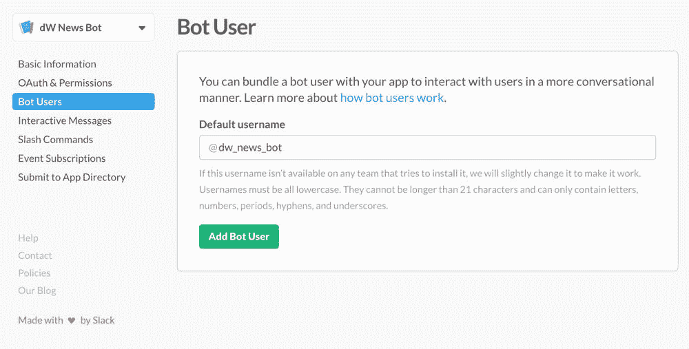
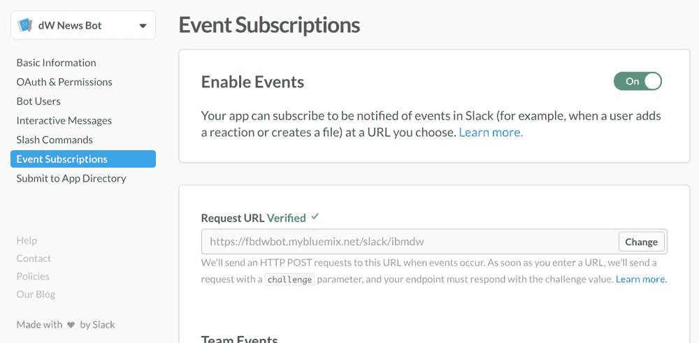

# Archived | 创建新闻聊天机器人来通过 Slack 传送内容

> 原文：[`developer.ibm.com/zh/tutorials/cc-cognitive-chatbot-slack/`](https://developer.ibm.com/zh/tutorials/cc-cognitive-chatbot-slack/)

**本文已归档**

**归档日期：:** 2019-05-22

此内容不再被更新或维护。 内容是按“原样”提供。鉴于技术的快速发展，某些内容，步骤或插图可能已经改变。

本教程系列将介绍如何通过两个消息应用程序创建一个聊天机器人，用它来传送 IBM Developer 新闻和文章：Facebook 和 Slack。以及如何使用 IBM Watson 服务增强该聊天机器人。本系列的第一篇[教程](https://www.ibm.com/developerworks/cn/cognitive/library/cc-cognitive-chatbot-facebook/index.html)介绍了如何创建一个使用 Facebook 消息平台的聊天机器人。在本教程中，将介绍如何开发此聊天机器人并将它部署在 [Slack 消息平台](https://slack.com/developers)上。本系列中的新闻聊天机器人以 IBM Developer 内容为例，但您也可以修改内容来源来满足自己的需求。

## 示例聊天机器人的工作原理

要让这个聊天机器人向您提供新闻和教程，需要安装 Slack 应用程序。可以在 Slack 应用程序目录中找到该应用程序。安装该应用程序后，您的工作空间中会出现一个名为 @dw_news 的机器人用户。您可以直接打开聊天窗口与此机器人用户聊天，或者将它拖到一个群聊中。

1.  在 Slack 中，单击 **@dw_news** 机器人用户开始与该用户进行聊天。
2.  指定您感兴趣的主题。

    

3.  您会看到一个基于您的兴趣的最新教程列表。

    

4.  您可以深入到特定主题。对于每个教程，都可以让聊天机器人向您提供该教程的摘要。从这里，您可以查看 IBM Developer 网站上的完整教程。

    

    该聊天机器人还支持使用类似 Google 的查询来搜索文章。

    

可以在 GitHub 上找到此聊天机器人应用程序的完整源代码：[`github.com/juntao/dwnewsbot`](https://github.com/juntao/dwnewsbot)

## Slack 聊天机器人基础

Slack 是第一批支持聊天机器人的消息平台之一，它支持通过多种不同方式集成聊天机器人。

*   您可以为 Slack 频道指定 webhook（它可以是一对一对话或群组对话）。该频道内的所有消息都将使用 HTTP POST 发送到该 webhook。来自 webhook 的明文 HTTP 响应以机器人消息形式显示在频道中。这或许是将聊天机器人整合到 Slack 对话中的最简单方法。
*   您可以在 Slack 团队中创建一个自定义机器人。该自定义机器人有一个唯一令牌。首先，编写应用程序来使用一个名为 Slack Real Time Messaging (RTM) API 的自定义 TCP/IP 网络 API 连接到 Slack 服务器。该应用程序使用机器人的秘密令牌将向 Slack 标识自身。Slack 使用该 TCP/IP 频道将与机器人的所有用户交互发送到您连接的应用程序，并以机器人消息形式显示应用程序的响应。
*   可以将 Slack 机器人捆绑到 Slack 应用程序中。按照 OAuth 流程，使用一个链接安装 Slack 应用程序。安装 Slack 应用程序后，您的机器人将出现在 Slack 团队中。从那时起，Slack 可以使用 RTM 或 HTTP Events API 与您的应用程序进行交互。

本教程中的 dw_news 聊天机器人是一个成熟的 Slack 应用程序。它使用 HTTP Events API 与 Slack 平台通信。在该实现中，一个 Java™ servlet 执行了 3 项任务：

*   完成 OAuth 身份验证流并存储令牌
*   使用 Events API 接收消息并使用 Slack Web API 发回响应
*   使用消息内的交互式按钮单击进行响应

## 创建基于 Java servlet 的聊天机器人应用程序

借助 Slack，可以配置 3 个不同的 Web 端点：一个用于 OAuth，另一个用于 Events API，还有一个用于交互式按钮单击。您可能已经预料到，有许多样板代码可用于管理 OAuth 流，解析从 Slack 传入的 JSON 消息，生成响应 JSON 消息，并在 Slack 上执行远程 Web 服务调用。对于 dw_news 聊天机器人示例，我使用了一个[开源 Java 聊天机器人框架](https://github.com/juntao/chatbotbook)。

要使用该框架，可以扩展抽象类 `BaseServlet` 并实现其抽象方法。`BaseServlet` 类负责所有传送工作，所以您可以将精力放在抽象方法中的应用程序业务逻辑上。开发并部署一个基于 `BaseServlet` 的 servlet 应用程序后，对 Slack 应用程序所需的所有 3 个 Web 端点使用相同的 servlet URL。让我们看看完成聊天机器人应用程序需要实现的抽象。

以下两个方法将会存储和检索 OAuth 令牌。用户将您的应用程序安装到 Slack 团队中时，Slack 会发放 OAuth 令牌。聊天机器人应用程序必须保存该令牌，因为在以后需要调用 Slack Web API 向 Slack 发送消息时，应用程序需要使用它。借助这两个抽象方法后，您可以选择您的持久性机制来存储这些令牌。

*   `void saveToken (String team_id, String token)`：为安装了该应用程序的 Slack 团队保存令牌。`team_id` 和 `token` 值作为 OAuth 流的一部分从框架传入。
*   `String findToken (String team_id)`：根据 Slack 团队 ID 检索令牌。

接下来，实现 `converse` 方法来提供聊天机器人的业务逻辑。`converse` 方法的 `String` 参数 `human` 是聊天用户发送的文本消息。在简单情况下，`converse` 方法仅向用户返回一个 `String` 响应。例如，下面的简单实现会使用用户消息来响应用户。

```
public Object converse (String human, ConcurrentHashMap<String, Object> context) {
    return "You just said: " + human;
} 
```

`converse` 方法也可以返回一个 `JSONObject` 或 `JSONArray`，该对象为每个 Slack 消息附件规范都指定一条结构化消息。例如，下面的代码段返回一个消息，并在消息下方显示一个 “Click me” 按钮。如果用户选择该按钮，`converse` 方法收到的下一条消息将采用 `CLICKME` 作为 `human` 参数的输入。请注意， `converse` 方法会同时处理来自 Slack 用户和交互式按钮单击的文本消息。

```
public Object converse (String human, ConcurrentHashMap<String, Object> context) {
    try {
        return createButtons(
            "Here is a button",
            new HashMap<String, String>(){{
                put("Click me", "CLICKME");
            }}
        );
    } catch (Exception e) {
        e.printStackTrace();
        return "";
    }
} 
```

如果聊天机器人需要发回多条消息来响应用户消息，该如何做？它可以返回一个 Java `List` 集合，其中包含 `String`、`JSONObject` 和 `JSONArray` 对象的组合。

如果您的聊天机器人是一个简单的命令响应机器人，`converse` 方法可以仅包含一个 `if/else` 语句列表来指定如何响应每个输入。但是大多数聊天机器人都比这更复杂。复杂的聊天机器人需要维护一种对话状态，以便能够基于对话上下文进行响应。可以将任何对话状态对象保存在 Java `HashMap` 参数 `context` 中。在下面的代码中，聊天机器人首先要求用户输入一个搜索查询，在下一次交流中，它会记住用户的输入是一个搜索查询，并使用 Hibernate Search 和 Lucene 执行搜索。搜索结果也保存在 `context` 变量中。

```
public Object converse (String human, ConcurrentHashMap<String, Object> context) {

    String cstr = classifyText(human);
    if ("SEARCH".equalsIgnoreCase(cstr)) {
        context.put("search", true);
        return "Enter your search query here. For example, you can enter \"Java Stream\"";
    }

    if (context.get("search") != null) {
        List <NewsItem> items = dm.searchNewsItems(human);
        context.put("items", items);
        context.remove("search");

        List replies = new ArrayList();
        replies.add ("Search results for: " + human);
        replies.add(dm.replyItems(items, true));
        return replies;
    }
    ...
} 
```

`context HashMap` 的一个额外好处是，该框架可自动填入会话范围内的数据。例如，`converse` 方法始终可以使用 `context` 变量中的 `team_id`、`sender_id` 和 `channel` 字段访问 Slack 团队、用户和对话频道 ID。

最后，对于新闻传送聊天机器人而言，在有新闻时向用户推送这些新闻很重要。换句话说，聊天机器人不应总是等待响应用户命令。在 Java 应用服务器中，可以设置一个 Quartz 调度程序任务来轻松实现此目的。我在 `StartupServlet` 中配置了一个任务工作者类 `SendNewsWorker`，它在 UTC 时间下午 4 点运行，每周运行 3 天。

```
private static final String CRON_EXPRESSION_2 =
      "0 0 16 ? * MON,WED,FRI";

// ... ...

JobDetail jobDetail2 = new JobDetail(
      "MyJob2", "MyJobGroup", SendNewsWorker.class);
JobDataMap dataMap2 = new JobDataMap ();
dataMap2.put("emf", emf);
dataMap2.put("scontext", getServletContext());
jobDetail2.setJobDataMap (dataMap2);

CronTrigger cronTrigger2 = new CronTrigger(
      "MyTrigger2", "MyTriggerGroup");
CronExpression cexp2 = new CronExpression(CRON_EXPRESSION_2);
cronTrigger2.setCronExpression(cexp2);

scheduler.scheduleJob(jobDetail2, cronTrigger2); 
```

下面的代码段来自 `SendNewsWorker` 类。它使用从数据库获取的用户 Slack ID，将新闻以结构化 carousel `JSONObject` 形式发送给用户。

```
// Get all users from database
List <User> users = dm.getActiveUsers();
for (User user : users) {
    List <String> faves = user.getFavesList();
    List <NewsItem> items = new ArrayList <NewsItem> ();
    for (String fave : faves) {
        List <NewsItem> nis = dm.getNewsItems(fave);
        if (nis == null || nis.isEmpty()) {
            continue;1
        }
        for (NewsItem ni : nis) {
            items.add(ni);
        }
    }

    if (items.isEmpty()) {
        continue; // there is no update for today
    }

    // send the replies to the user proactively
    try {
        Token token = dm.getToken(user.getSlackTeamId());

        NewsServlet ns = new NewsServlet(); // This sets up the tokens and constants
        ns.sendReply("Hey, here are some articles you might have missed.", user.getSlackChannel(), token.getBotToken());
        ns.sendReply(dm.replySlackItems(items, true), user.getSlackChannel(), token.getBotToken());
        ns.sendReply("To stop future news delivery messages, please text STOP", user.getSlackChannel(), token.getBotToken());
    } catch (Exception e) {
        e.printStackTrace();
    }

    user.setUpdateDate(new Date ());
    dm.saveUser(user);
} 
```

创建您的 servlet 应用程序后，可以将它部署在 IBM [Cloud](https://cloud.ibm.com/?cm_sp=ibmdev-_-developer-tutorials-_-cloudreg) 上，后者以服务形式提供了 Tomcat 容器和 MySQL 数据库。有关如何将演示应用程序部署到 IBM Cloud 上的详细说明，请参阅这个有关 Facebook Messenger 聊天机器人的系列中的[前一篇教程](https://www.ibm.com/developerworks/cn/cognitive/library/cc-cognitive-chatbot-facebook/index.html)。对于本示例，部署在 IBM Cloud 上的 servlet 应用程序位于：[`fbdwbot.mybluemix.net/slack/ibmdw`](https://fbdwbot.mybluemix.net/slack/ibmdw)

## 创建 Slack 应用程序

本教程前面已经讨论过，为方便团队安装，聊天机器人可打包在 Slack 应用程序中。在本节中，将介绍创建 Slack 应用程序的过程。

1.转到 [`api.slack.com/apps`](https://api.slack.com/apps)，查看您创建的 Slack 应用程序列表。从这里，创建一个新应用程序。


左侧菜单显示了完成 Slack 应用程序的步骤。

2.**Basic Information** 选项卡显示了应用程序的 ID 和密码，当用户尝试将该应用程序添加到团队中时，OAuth 流中需要这些信息。在此选项卡上，为应用程序上传一个图标，填写应用程序描述，并提供应用程序主页以及条款和隐私政策的链接。

 3.在 **OAuth & Permissions** 选项卡上，将该 URL 输入 servlet 应用程序中，作为 OAuth 间接 URL。该 servlet 将会处理 OAuth 令牌，并在需要时调用 `saveToken` 和 `findToken` 抽象方法的实现。


在此选项卡上，还可以指定应用程序所需的权限。在本例中，我选择了 `bot` 权限，它包含机器人接收和响应消息所需的所有权限。

 4.在 **Bot User** 选项卡上，为应用程序中的聊天机器人指定一个名称。用户安装此应用程序后，已命名的聊天机器人显示为一名团队成员。

 5.在 **Interactive Messages** 选项卡上，对聊天机器人如何响应机器人对话中的按钮单击事件进行配置。前面已经提到过，可以使用您刚开发的 servlet 应用程序的 URL。所有按钮单击事件都使用 HTTP 提交到此 URL，框架将它们传入 `converse` 抽象方法的实现中。

 6.在 **Slash Commands** 选项卡上，可以向应用程序添加斜杠命令。这里不需要这些命令。 7.在 **Event Subscriptions** 选项卡上，聊天机器人应用程序可订阅用户消息（即事件）。同样地，请求 URL 是 servlet 应用程序的 URL。



您可以指定将要传送到机器人的事件。这些事件使用 HTTP POST 发送到请求 URL，而框架将它们传递给 `converse` 抽象方法的实现。


现在，您有一个完整的 Slack 应用程序。

## 测试并发布您的聊天机器人

测试 Slack 应用程序的最简单方法是使用 **Add to Slack** 按钮。该按钮实际上是一个链接。将 `CLIENT_ID` 替换为来自 **Basic Information** 选项卡的实际应用程序 ID。

```
https://slack.com/oauth/authorize?scope=bot&client_id=CLIENT_ID 
```

用户单击该链接后，需要授权您的应用程序访问来自团队的信息。在用户同意后，将会安装该应用程序，您的聊天机器人会出现在团队中，可将它用于对话。


测试 Slack 应用程序后，您可以返回到应用程序页面，将应用程序提交到 Slack，以便在 Slack App Directory 中包含它。使用 App Directory 的好处是您的应用程序可被其他 Slack 用户发现。**Submit to App Directory** 选项卡是一个检查列表，用于确保您的 Slack 应用程序遵守 Slack 指导方针。


Slack 需要花两周时间审批应用程序，并在通过审批后通知您。

## 结束语

在本教程中，介绍了构建和发布 Slack 聊天机器人应用程序的过程。该 Slack 聊天机器人应用程序可使用 3 个不同的 Web 应用程序 URL 来处理身份验证、事件消息和交互式按钮。但是，我所介绍的 Java servlet [聊天机器人应用程序框架](https://github.com/juntao/chatbotbook)可以减少样板代码，这样您就可以在 IBM IBM Cloud 上创建单个 Java servlet 应用程序来实现所有 3 种功能。

在下一篇文章中，将讨论如何使用 IBM Watson 服务增强聊天机器人。

本文翻译自：[Archived | Create a news chatbot to deliver content through Slack](https://developer.ibm.com/tutorials/cc-cognitive-chatbot-slack/)（2017-02-06）