# Archived | 创建新闻聊天机器人来通过 Facebook Messenger 传送内容

> 原文：[`developer.ibm.com/zh/tutorials/cc-cognitive-chatbot-facebook/`](https://developer.ibm.com/zh/tutorials/cc-cognitive-chatbot-facebook/)

**本文已归档**

**归档日期：:** 2019-05-22

此内容不再被更新或维护。 内容是按“原样”提供。鉴于技术的快速发展，某些内容，步骤或插图可能已经改变。

本教程系列将介绍如何通过两个消息应用程序创建新闻聊天机器人：Facebook 和 Slack。然后您可以使用 IBM Watson 服务增强该聊天机器人。在本教程中，将介绍如何开发此聊天机器人并部署在 [Facebook Messenger 平台](https://developers.facebook.com/docs/messenger-platform)上。本系列中的新闻聊天机器人以 IBM Developer 内容为例，但您也可以修改内容来源来满足自己的需求。

## 示例聊天机器人的工作原理

该聊天机器人向您提供新闻和教程，要让它完成此工作，您必须确定您感兴趣的主题。

1.  在 Facebook Messenger 中，打开一个聊天窗口与 IBM Developer 新闻聊天机器人进行聊天。
2.  指定您感兴趣的主题。

    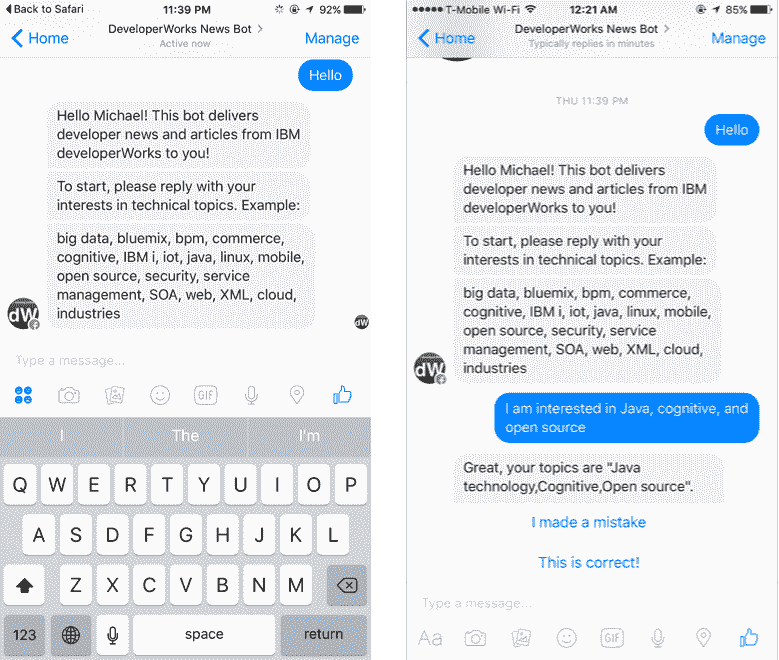

3.  您会看到一个基于您的兴趣的最新教程列表。

    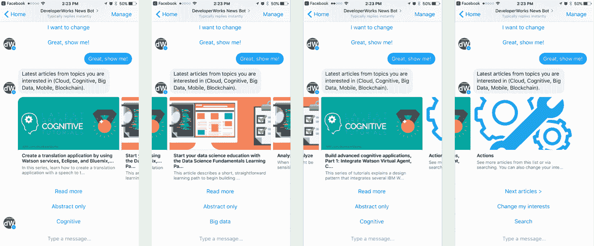

4.  您可以深入到特定主题。对于每个教程，都可以让聊天机器人提供一段摘要，甚至是为您读出这段摘要。从这里，您可以查看 IBM Developer 网站上的完整教程。

    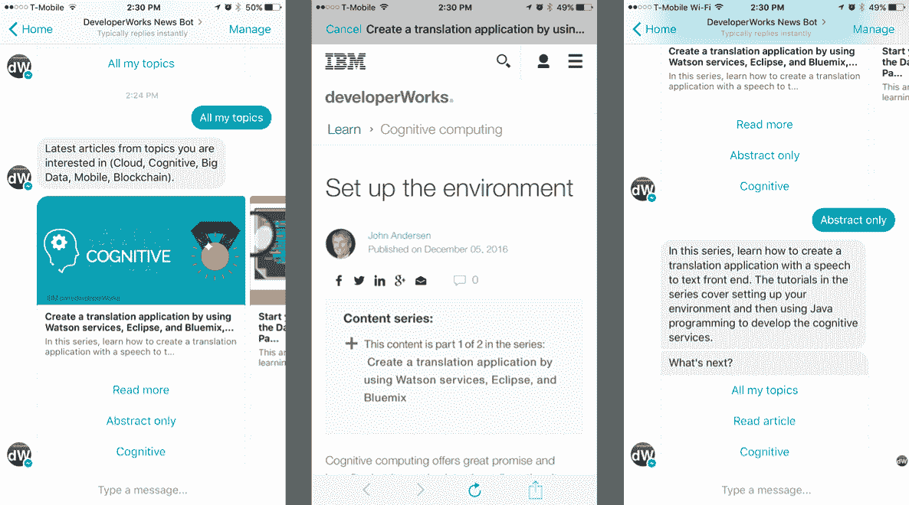

    该聊天机器人还支持使用类似 Google 的查询来搜索文章。

    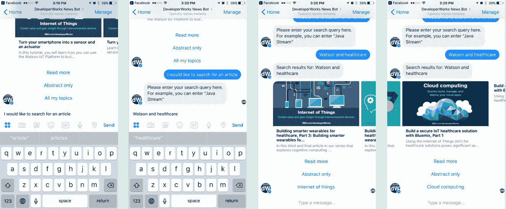

备注：或者，可以使用文本或语音消息与 dW 新闻聊天机器人进行交流。你可以使用 Facebook Messenger 输入语音消息，在响应该消息之前，聊天机器人会将它转录为文本。也可以让聊天机器人为您阅读教程摘要。此语音功能包含在 GitHub 中的聊天机器人源代码中，但未部署在演示应用程序中。可以在 GitHub 上找到此聊天机器人应用程序的完整源代码：[`github.com/juntao/dwnewsbot`](https://github.com/juntao/dwnewsbot)

## 创建基于 Java servlet 的聊天机器人应用程序

因为这个 dW 新闻聊天机器人基于 Facebook Messenger，所以您开发的应用程序是一个 “webhook”，它收听来自 Facebook 用户的消息，然后将聊天机器人的响应发送回 Facebook Messenger。在 Java™ 应用程序领域，您需要编写一个映射到该 webhook URL 的 servlet。

要使用该框架，可以扩展抽象类 `BaseServlet` 并实现 `converse` 方法。`converse` 方法的 `String` 参数 `human` 是聊天用户发送的文本消息。在简单情况下，`converse` 方法仅向用户返回一个 `String` 响应。例如，下面的简单实现会发回用户消息来响应用户。

```
public Object converse (String human, ConcurrentHashMap<String, Object> context) {
    return "You just said: " + human;
} 
```

`converse` 方法也可以返回一个 `JSONObject`，该对象为每个 Facebook Messenger 规范都指定一条结构化消息。例如，下面的代码段返回一个图像，并在图像下方显示了一个 “Click me” 按钮。如果用户选择该按钮，`converse` 方法收到的下一条消息将采用 `CLICKME` 作为 `human` 参数的输入。

```
public Object converse (String human, ConcurrentHashMap<String, Object> context) {
    try {
        JSONObject payload = new JSONObject();
        payload.put("template_type", "button");
        payload.put("image_url", "http://host.com/img.png");

        JSONArray buttons = new JSONArray ();
        buttons.put((new JSONObject())
            .put("type", "postback")
            .put("title", "Click me")
            .put("payload", "CLICKME"));
        payload.put("buttons", buttons);

        return payload;
    } catch (Exception e) {
        e.printStackTrace();
        return "";
    }
} 
```

如果聊天机器人需要发回多条消息来响应用户消息，该如何做？它可以返回一个 Java `List` 集合，其中包含 `String` 和 `JSONObject` 对象的组合。

如果您的聊天机器人是一个简单的命令响应机器人，`converse` 方法可以仅包含一个 `if/else` 语句列表来指定如何响应每个输入。但是大多数聊天机器人都比该聊天机器人复杂。复杂的聊天机器人需要维护一种对话状态，以便能够基于对话上下文进行响应。可以将任何对话状态对象保存在 Java `HashMap` 参数 `context` 中。在下面的代码中，聊天机器人首先要求用户输入一个搜索查询，在下一次交流中，它会记住用户的输入是一个搜索查询，并使用 Hibernate Search 和 Lucene 执行搜索。搜索结果同样保存在 `context` 变量中，这样聊天机器人就知道在用户选择 **Next** 时如何进行翻页。

```
public Object converse (String human, ConcurrentHashMap<String, Object> context) {

    String cstr = classifyText(human);
    if ("SEARCH".equalsIgnoreCase(cstr)) {
        context.put("search", true);
        return "Enter your search query here. For example, you can enter \"Java Stream\"";
    }

    if (context.get("search") != null) {
        List <NewsItem> items = dm.searchNewsItems(human);
        context.put("items", items);
        context.remove("search");

        List replies = new ArrayList();
        replies.add ("Search results for: " + human);
        replies.add(dm.replyItems(items, true));
        return replies;
    }
    ...
} 
```

`context HashMap` 的一个额外好处是，该框架可自动填入会话范围内的数据。例如，`converse` 方法始终能够使用 `context` 变量中的 `sender_id` 字段访问 Facebook 用户 ID。聊天机器人应用程序可检索并保存用户的个人资料数据。

```
public Object converse (String human, ConcurrentHashMap<String, Object> context) {
    User user = dm.getUser((String) context.get("sender_id"));
    if (user == null) {
        user = new User ();
        user.setFbId((String) context.get("sender_id"));

        HashMap profile = getUserProfile(user.getFbId());
        if (profile != null && !profile.isEmpty()) {
            user.setFirst_name((String) profile.get("first_name"));
            user.setLast_name((String) profile.get("last_name"));
             user.setProfile_pic((String) profile.get("profile_pic"));
            user.setLocale((String) profile.get("locale"));
            user.setGender((String) profile.get("gender"));
            try {
                user.setTimezone((Integer) profile.get("timezone"));
            } catch (Exception e) {
                user.setTimezone(0);
            }
        }

        dm.saveUser(user);
        new_user = true;
    }
    ...
} 
```

最后，对于新闻传送聊天机器人，在有新闻时推送给用户很重要。换句话说，聊天机器人不应总是等待响应用户命令。在 Java 应用服务器中，可以设置一个 Quartz 调度程序任务来轻松实现此目的。我在 `StartupServlet` 中配置了一个任务工作者类 `SendNewsWorker`，它在 UTC 时间下午 4 点运行，每周运行 3 天。

```
private static final String CRON_EXPRESSION_2 =
      "0 0 16 ? * MON,WED,FRI";

// ... ...

JobDetail jobDetail2 = new JobDetail(
      "MyJob2", "MyJobGroup", SendNewsWorker.class);
JobDataMap dataMap2 = new JobDataMap ();
dataMap2.put("emf", emf);
dataMap2.put("scontext", getServletContext());
jobDetail2.setJobDataMap (dataMap2);

CronTrigger cronTrigger2 = new CronTrigger(
      "MyTrigger2", "MyTriggerGroup");
CronExpression cexp2 = new CronExpression(CRON_EXPRESSION_2);
cronTrigger2.setCronExpression(cexp2);

scheduler.scheduleJob(jobDetail2, cronTrigger2); 
```

下面的代码段来自 `SendNewsWorker` 类。它使用从数据库检索的用户 Facebook ID，以结构化的 carrousel `JSONObject` 形式向用户发送新闻。

```
// Get all users from database
List <User> users = dm.getActiveUsers();
for (User user : users) {
    List <String> faves = user.getFavesList();
    List <NewsItem> items = new ArrayList <NewsItem> ();
    for (String fave : faves) {
        List <NewsItem> nis = dm.getNewsItems(fave);
        if (nis == null || nis.isEmpty()) {
            continue;
        }
        for (NewsItem ni : nis) {
            items.add(ni);
        }
    }

    if (items.isEmpty()) {
        continue; // there is no update for today
    }

    // send the replies to the user proactively
    try {
        BaseServlet.sendReply("Hey, " + user.getFirst_name() + ", here are some tutorials you might have missed.", user.getFbId());
        BaseServlet.sendReply(dm.replyItems(items, true), user.getFbId());
        BaseServlet.sendReply("To stop future news delivery messages, please text STOP", user.getFbId());
    } catch (Exception e) {
        e.printStackTrace();
    }

    user.setUpdateDate(new Date ());
    dm.saveUser(user);
} 
```

代码中显示的 `replyItems` 方法在一系列 `List` 对象（即 `titles`、`subtitles`、`image_urls`、`button_titles` 和 `button_payloads`）中显示教程 carousel。然后，该方法调用 `BaseServlet createCarousel` 实用程序方法，根据 Facebook Messenger 规范为该 carousel 创建一个 JSON 对象。

## 将聊天机器人连接到 Facebook Messenger

在本节中，将介绍创建 Facebook Messenger 聊天机器人并将应用程序连接到它的过程。

1.  Facebook Messenger 机器人的公开形象是一个 Facebook 页面。要创建一个新 Facebook 页面，可以转到 `https://www.facebook.com/pages/create/?ref_type=hc` 并按照步骤进行操作。创建页面后，可以添加图标和 call-to-action 按钮来自定义它的外观。

    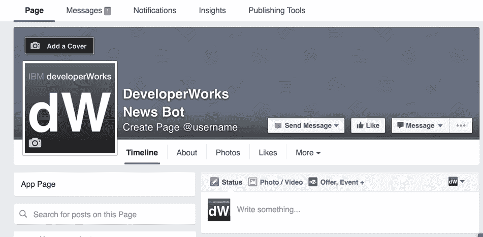

2.  要为聊天机器人创建一个 Facebook 应用程序，可以转到 [`developers.facebook.com/`](https://developers.facebook.com/) 并登录。从右上角的 **My Apps** 菜单中选择 **Add a New App**。可以选择弹出窗口底部的 **Basic Setup**，因为您还不需要集成任何功能。

    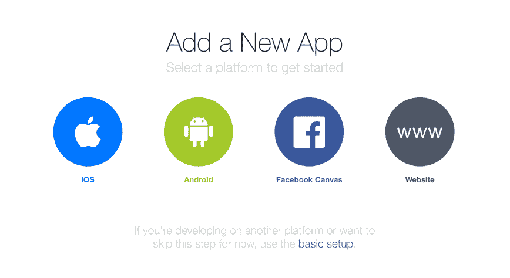

3.  从 Facebook 应用程序仪表板，使用左侧面板中的 **Add Product** 链接来添加 “Messenger” 集成。
4.  在 Messenger 产品选项卡上，创建一个令牌来将应用程序与该页面链接。应用程序的 webhook（您很快将设置）会收到发送到指定页面的消息。

    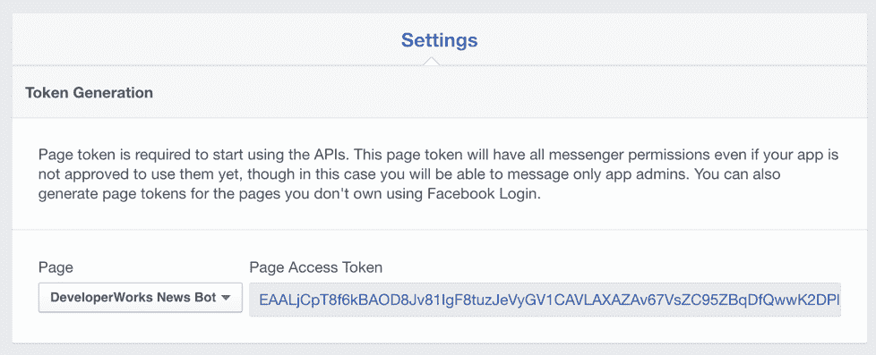

5.  将该令牌输入 Java 聊天机器人应用程序中的 `NewsServlet` 类中。请注意，`NewsServlet` 类还有其他空的密钥或令牌字段 — 这些字段是可选的 Web 服务，聊天机器人可用来改善其智能水平。本系列的其他教程将介绍另外一些服务。
6.  从您的计算机使用页面访问令牌运行下面的命令，以便让页面订阅生效。

    ```
     curl -X POST "https://graph.facebook.com/v2.6/me/subscribed_apps?access_token=<PAGE_ACCESS_TOKEN>" 
    ```

7.  在 Messenger 产品选项卡上的 Webhooks 部分下面，为应用程序订阅您刚刚创建的页面。确保您选择了 **messages** 和 **messaging_postbacks** 选项，以接收来自 Facebook Messenger 的消息和按钮单击操作。

    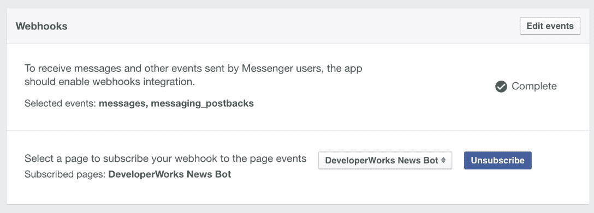

您需要为应用程序设置一个 Webhook URL，以便接收订阅的消息事件。为此，必须将应用程序部署为公开的 Web 应用程序。IBM [Cloud](https://cloud.ibm.com/?cm_sp=ibmdev-_-developer-tutorials-_-cloudreg) 是一个不错的部署选择。

## 将聊天机器人部署到 IBM Cloud 上

现在，已经准备好将聊天机器人 Web 应用程序部署到 IBM Cloud。首先，需要在 IBM Cloud 上设置两个容器：一个 Apache Tomcat 应用服务器，用于运行利用 webhook 的 Web 应用程序；一个 MySQL 关系数据库，供该应用程序存储应用程序数据（例如 Facebook 用户的用户资料数据和 IBM Developer 教程的内容）。

IBM Cloud 基于 Cloud Foundry 平台。您将需要安装 Cloud Foundry [命令行工具](https://cloud.ibm.com/docs/starters?topic=starters-download-modify-and-redeploy-your-cloud-foundry-app-with-the-command-line-interface&cm_sp=ibmdev-_-developer-tutorials-_-cloudreg)及其 IBM Cloud 扩展，以便管理 IBM Cloud 中的应用程序容器。

MySQL 容器由 IBM Cloud 平台上的第三方提供商 [ClearDB](http://w2.cleardb.net/) 提供。ClearDB 的免费计划将数据库大小限制为 5 MB，对您的应用程序而言，该大小可能并不够，因为下载的 dW 教程内容很快就会超过 5 MB。如果计划自行运行 dW 新闻聊天机器人，则必须升级为付费 ClearDB 计划。

1.  在 IBM Cloud 中，创建一个 Apache Tomcat 容器。

    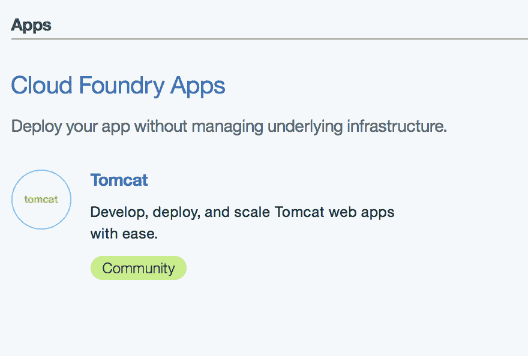

2.  创建一个 MySQL 数据库并选择一个 ClearDB 计划。

    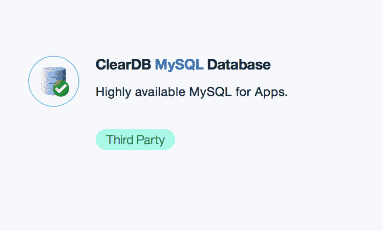

3.  将 MySQL 数据库与 Tomcat 应用程序相连接。

    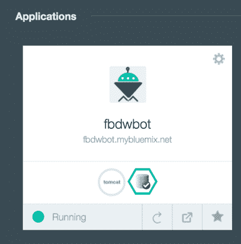

4.  从 IBM Cloud 仪表板，可以打开 Tomcat 应用程序并检查数据库设置，包括连接 URL 与自动生成的用户名和密码。

    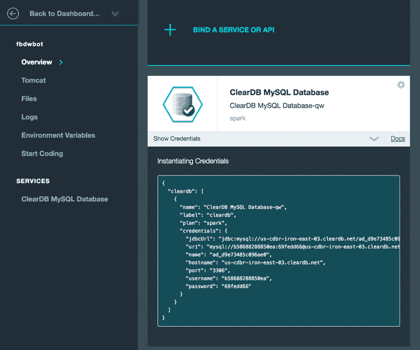

5.  导入一段 SQL 脚本来设置数据库模式。可以从任何安装了 MySQL 客户端库的计算机运行下面的命令。schema.sql 文件位于项目源代码的 bin 目录中。

    ```
     mysql -h HOST -u USERNAME -pPASSWORD DBNAME < schema.sql 
    ```

6.  在 Web 应用程序的 context.xml 文件中，输入数据库连接 URL、用户名和密码。此文件位于项目源代码的 src/main/resources/META-INF 目录中。

    ```
     <?xml version='1.0' encoding='utf-8'?>
        <Context>
          <Resource name="jdbc/dwnews" auth="Container"
            driverClass="com.mysql.jdbc.Driver"
            jdbcUrl="jdbc:mysql://host:3306/DBNAME?autoReconnect=true"
            user="USERNAME"
            password="PASSWORD"
            preferredTestQuery="SELECT 1"
            testConnectionOnCheckin="true"
            idleConnectionTestPeriod="300"
            factory="org.apache.naming.factory.BeanFactory"
            type="com.mchange.v2.c3p0.ComboPooledDataSource"
            maxPoolSize="4"
            minPoolSize="2"
            acquireIncrement="1"/>
        </Context> 
    ```

7.  要构建您刚开发的 Java 应用程序，需要安装 [Apache Maven](http://maven.apache.org/)。安装 Maven 后，使用下面的命令构建 WAR 文件。

    ```
     mvn clean package 
    ```

    现在可以使用 IBM Cloud `cf push` 命令部署 WAR 文件。请参阅 [IBM Cloud 文档](https://cloud.ibm.com/docs?cm_sp=ibmdev-_-developer-tutorials-_-cloudreg)，了解如何设置 manifest.yml 来将 WAR 文件部署到 IBM Cloud Tomcat 容器的细节。

您的 webhook 位于 [`your-bluemix-appname.mybluemix.net/facebook/ibmdw`](https://your-bluemix-appname.mybluemix.net/facebook/ibmdw) 上。

## 测试并发布您的聊天机器人

在 Facebook 应用程序控制台的 Webhooks 选项卡中，输入 IBM Cloud 应用程序 URL 作为 webhook URL。对于 Verify Token 字段，可以输入任何您喜欢的字符串，聊天机器人框架会自动处理它。

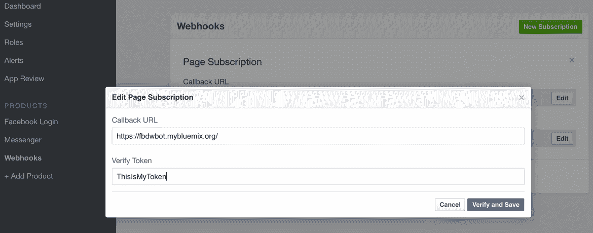

现在可以测试聊天机器人了。转到机器人的 Facebook 页面，向该页面发送一条消息。Facebook Messenger 窗口将会打开，您会看到它的响应。

所有 Facebook Messenger 聊天机器人都必须[经过 Facebook 批准](https://developers.facebook.com/docs/messenger-platform/app-review)，才能供公众使用。在测试期间，可以通过在应用程序仪表板中手动添加测试人员的 Facebook ID，将它们添加到应用程序。完成测试后，可以单击 **Request Permission** 提交您的应用程序供审批。您会被要求提供实际应用程序的隐私政策（[`www.iubenda.com/en`](https://www.iubenda.com/en) 网站可免费为您生成隐私政策）和视频演示。

**备注：**因为该应用程序每周有 3 天会向用户发送新闻教程，所以您必须选择 pages_messaging_subscriptions 权限来对其进行审核。如果没有此权限，聊天机器人只能在用户发起请求后才会向用户发送消息（也就是说，在用户显式联系聊天机器人后 24 小时内向用户发送回复消息）。

Facebook 会花几天时间来审批聊天机器人，并在获得批准后通知您。届时，请返回至 Facebook 应用程序仪表板并滑动开关来将该应用程序公开。

## 结束语

本教程介绍了在 IBM Cloud 平台上构建和发布 Facebook Messenger 聊天机器人的过程。此方法展示了聊天机器人的详细信息，让您能够更自由地选择托管选项（因为 Java 编程几乎受到云和内部部署 IT 提供商的普遍支持）。

下一篇教程将介绍在 Slack 消息平台上为 dW 新闻机器人开发应用程序的过程。

本文翻译自：[Archived | Create a news chatbot to deliver content through Facebook Messenger](https://developer.ibm.com/tutorials/cc-cognitive-chatbot-facebook/)（2017-02-06）