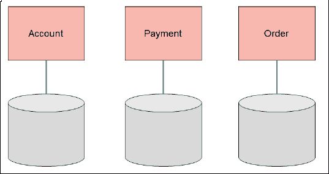
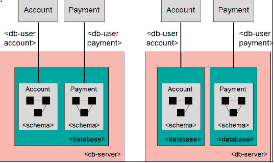
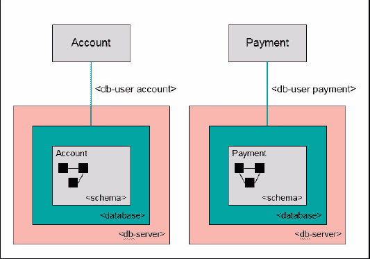
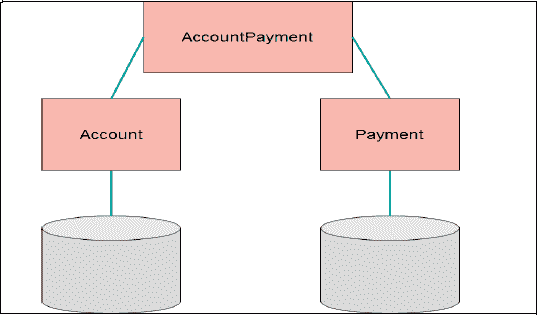
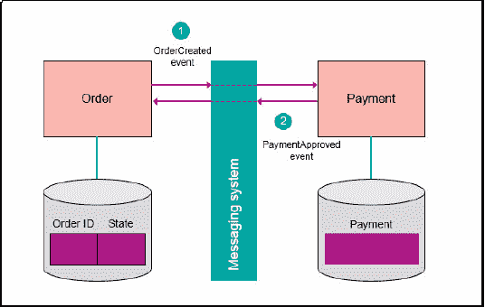
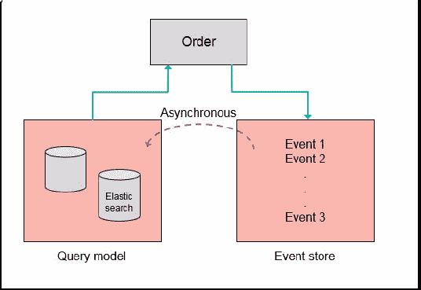

# 处理数据

> 原文：[`developer.ibm.com/zh/tutorials/j-cn-java-and-microservice-4/`](https://developer.ibm.com/zh/tutorials/j-cn-java-and-microservice-4/)

在微服务系统中，具有混合持久性的环境时，有必要让数据处理保持可管理。为了解释如何实现此目标，本章会简要介绍微服务在数据处理方面的特征，然后介绍如何使用基于 Java 的微服务实现此目的。

## 微服务特定于数据的特征

识别数据的一种方式是自上而下的方法，数据必须存储在您的微服务的数据存储中。从业务级别开始建模您的数据。以下各节将介绍如何识别此数据，如何处理它，以及如何与其他微服务的其他数据存储共享它。有关自上而下方法的描述，请访问 [网站](http://en.wikipedia.org/wiki/Top-down_and_bottom-up_design) 。

### 领域驱动设计导致产生各种实体

如果采用领域驱动设计中的方法，您会获得以下对象（和其他对象）：

*   实体

“一种不通过属性定义，而通过连续性和身份定义的对象。”

*   价值对象

“一种包含属性，但没有概念实体的对象。它们应视为不可变。”

*   聚合

“一种通过根实体（也称为聚合根）绑定到一起的对象集合。聚合根通过禁止外部对象持有其成员的引用，确保在聚合内执行的更改的一致性。”

*   存储库

“检索领域对象的方法应委托给专门的存储库对象，以便能够轻松地交换备选的存储实现。”

这些引语出自来源： [点此网址](http://en.wikipedia.org/wiki/Domain-driven_design) 。

这些对象应映射到您的持久存储（仅在实体具有相同的生命周期时才能聚合它们）。这种领域模型是逻辑数据模型和物理数据模型的基础。

有关领域驱动设计术语的更多信息，请访问这个 [网站](http://dddcommunity.org/resources/ddd_terms/) 。

### 每个微服务都有单独的数据存储

每个微服务都应拥有自己的数据存储（如图 1），而且与其他微服务及其数据分离。第二个微服务不能直接访问第一个微服务的数据存储。

采用此特征的原因是：

*   如果两个微服务共享一个数据存储，它们将紧密耦合。如果更改一个微服务的数据存储（比如表）的结构，则可能导致另一个微服务出现问题。如果微服务以这种方式耦合，则必须协调新版本的部署，而这是我们必须避免的。
*   每个微服务都应该采用最能满足其需求的数据库类型（混合持久性，请参阅小节”混合持久性”了解更多的细节）。在选择数据库系统时，不需要在不同微服务之间进行权衡。这种配置会为每个微服务提供一个单独的数据存储。
*   从性能角度讲，每个微服务都有自己的数据存储可能很有用，因为扩展会变得更容易。数据存储可托管在自己的服务器上。

#### 图 1 每个微服务都有单独的数据存储



对于关系数据库，可通过以下方式之一实现数据存储的分离：

*   每个微服务一种模式

每个服务在数据库中都有自己的模式（如图 2）。其他服务可使用同一个数据库，但必须采用不同的模式。可通过数据库访问机制实现这种配置（为连接的数据库用户使用权限），因为面临时间压力的开发人员倾向于使用快捷方式，而且能直接访问其他模式。

*   每个微服务一个数据库

每个微服务都可以有自己的数据库，但与其他微服务共享数据库服务器（如图 2）。使用不同的数据库，用户可以连接到数据库服务器，而且实现了很好的数据库分离。

#### 图 2 每个微服务一种模式和每个微服务一个数据库



*   每个微服务一个数据库服务器

这是最高程度的分离。举例而言，在需要解决性能方面的问题时，这可能很有用（如图 3）。

#### 图 3 每个微服务一个数据库服务器



### 混合持久性

每个微服务应使用自己的数据存储，这意味着该服务也可以采用不同的数据存储技术。NoSQL 运动催生了许多新的数据存储技术，它们可与传统关系数据库一起使用。基于应用程序必须满足的需求，可选择不同类型的技术来存储数据。一个应用程序中拥有各种各样的数据存储技术，这被称为混合持久性。

对于一些微服务，最好将其数据存储在关系数据库中。对于其他具有不同类型的数据（非结构化、复杂和面向图形的数据）的服务，可将它们的数据存储在一些 NoSQL 数据库中。

多语言编程这个词的含义是，应用程序应该使用最适合它必须解决的挑战的编程语言来编写。

[Martin Fowler 网站](http://martinfowler.com/bliki/PolyglotPersistence.html) 提供了这两个术语的更详细的描述。

### 跨微服务的数据共享

在一些情况下，微服务应用程序的用户可能希望请求不同的服务所拥有的数据。例如，用户可能想查看他的所有支付和支付的相应状态。因此，用户需要在服务中查询他的帐户，随后在服务中查询他的支付情况。微服务会使用数据库合并数据，不是一种最佳实践。要处理此业务案例，您必须实现一个适配器服务（如图 4），使用它查询帐户服务和支付服务，然后将收集到的数据返回给用户。适配器服务还负责对它收集到的数据执行必要的数据转换。

#### 图 4 适配器微服务



更改数据可能变得更复杂。在微服务系统中，一些业务事务可能涵盖多个微服务。举例而言，在零售店的微服务应用程序中，可能有一个下单服务和一个支付服务。

因此，如果客户想在您的商店购买商品并付款，那么业务事务需要包含两个微服务。每个微服务都有自己的数据存储，所以对于包含两个或更多微服务的业务事务，涉及到两个或更多个数据存储。本节将介绍如何实现这些业务事务。

#### 事件驱动架构

您需要一种方法来确保包含两个或多个微服务的业务事务中涉及的数据的一致性。一种方法是采用分布式事务，但众多原因表明，不应在微服务应用程序中采用这种方法。主要原因是，分布式事务中涉及的微服务是紧密耦合的。如果一个分布式事务涉及两个微服务，而且一个服务失败或出现性能问题，那么另一个服务必须等到超时后回滚事务。

让一个业务事务涵盖多个微服务的最佳方式是，使用事件驱动架构。要更改数据，第一个服务负责更新它的数据，并在同一个（内部）事务中发布一个事件。第二个微服务（它已订阅此事件）收到此事件，并对它的数据执行更改。通过使用发布/订阅通信模型，两个微服务是松散耦合的。仅在它们交换的消息上存在耦合。该技术使微服务系统能在所有微服务之间保持数据一致性，而无需使用分布式事务。

如果微服务应用程序中的微服务相互发送许多消息，那么它们可能非常适合合并到一个服务中。但是需要谨慎一些，因为此配置可能破坏微服务的领域驱动设计。执行复杂更新（涵盖多个服务）的适配器服务也可以使用事件实现。

事件驱动架构的编程模型更为复杂，但 Java 有助于让该复杂性处于可管理状态下。

#### 最终一致性

在事件驱动架构中，将消息发送给其他微服务会导致所谓的”最终一致性”问题。这通常是以下情况下导致的运行时问题：微服务 A 更改其数据存储中的数据，并在同一个内部事务中向微服务 B 发送一条消息。经过较短时间后，微服务 B 收到消息，并更改其数据存储中的数据。在这个通常很短的时间段内，两个数据存储中的数据不一致。例如：服务 A 更新其数据存储中的订单数据，并向服务 B 发送一条消息以进行支付。在处理支付之前，有一个未支付的订单。当消息接收者无法处理消息时，情况就会变遭。在这种情况下，消息系统或接收微服务必须采取一些策略来处理此问题。

在微服务应用程序中，每个微服务拥有自己的数据库。一次涵盖多个微服务的业务事务会导致”最终一致性”问题，因为分布式事务会阻碍此问题的解决。处理这种业务事务的一种方法如图 5 所示。订单微服务将订单保存到它的数据存储中，并将一个事件（例如 OrderCreated）发送给支付微服务。在订单微服务未从支付微服务收到支付确认期间，订单处于未支付状态。

支付服务订阅了 OrderCreated 事件，所以它会处理该事件，并在其数据存储中执行支付。如果支付成功，它会发布一个被订单微服务订阅的 PaymentApproved 事件。处理 PaymentApproved 事件后，订单状态从”未支付”更改为”已批准”。如果客户查询其订单状态，就会获得以下两种响应之一：订单未支付或订单已批准。

#### 图 5 微服务之间的事件消息



在数据不可用的情况下，服务可能向客户发送类似下面这样的消息：”很抱歉，请稍后重试”。

#### 数据复制

数据存储与从不同数据存储获取数据的需求分离，可能导致使用数据库系统的数据复制机制可以解决问题的想法。举例而言，跟与多个微服务共享数据库相比，使用数据库触发器、计时存储过程或其他流程来解决此问题同样存在缺点。更改复制管道的一端的数据结构会给复制流程带来问题。在部署服务的新版本时，必须调整该流程。这也是一种紧密耦合形式，必须避免。

前面已经提到，基于事件的处理可将两个数据存储分离。如果需要的话，处理事件的服务可执行适当的数据转换，将数据存储在它们自己的数据存储中。

### 事件寻源和命令查询职责分离

在事件驱动架构中，可以考虑命令查询职责分离 (CQRS) 和事件寻源。可结合这两种架构模式来处理流经您的微服务应用程序的事件。

CQRS 将对数据存储的访问拆分为两个不同部分：一部分包含读取操作，另一部分包含写入操作。读取操作不会更改系统的状态。它们仅返回状态。写入操作（命令）会更改系统的状态，但不会返回值。事件寻源存储在数据发生更改时发生的事件序列。图 6 显示了一个使用 CQRS 的示例。

#### 图 6 使用 CQRS 的示例



如图 6 所示，事件按顺序存储在事件存储中。查询模型中的数据与来自事件存储的数据同步。要支持事件存储或查询模型，可以使用专门的系统（例如 [Elastic Search](https://www.elastic.co/) ）来支持微服务的查询。

此架构也可用于处理微服务应用程序中的事件。

### 消息系统

可以使用消息系统或面向消息的中间件来支持事件驱动架构。

“面向消息的中间件 (MOM) 是一种软件或硬件基础架构，用于支持在分布式系统之间发送和接收消息。MOM 允许应用程序模块分布在异构的平台上，这降低了开发涵盖多个操作系统和网络协议的应用程序的复杂性。中间件创建了一个分布式通信层，这一层将应用程序开发人员与各种操作系统和网络接口的细节隔离。跨多样化的平台和网络进行扩展的 API 通常由 MOM 提供。MOM 提供的软件元素位于客户端/服务器架构的所有通信组件中，通常支持客户端与服务器应用程序之间的异步调用。MOM 减少了客户端/服务器机制的主从性质的复杂性与应用程序开发人员的关联。”

要与面向消息的中间件进行通信，可以采用不同的协议。以下是最常用的协议：

*   高级消息队列协议 (AMQP)

AMQP”规定消息提供者和客户端的行为，以便使来自不同供应商的实现可互操作，就像 SMTP、HTTP、FTP 等创建可互操作的系统一样。”

*   MQ 遥测传输 (MQTT)

MQTT 是”基于发布-订阅的轻量型”消息协议，用在 TCP/IP 协议之上。它专为与需要”小代码体积”或网络带宽有限的远程位置建立连接而设计。”它主要用在物联网 (IoT) 环境中。

在 Java 世界中，有一个 API 可与面向消息的中间件通信：

Java Message Service (JMS)，它包含在 Java EE 规范中。具体的版本是 JMS 2.0。

由于 JMS 的悠久历史（可追溯到 2001 年），有许多 JMS 消息代理可用作 MOM 系统。不过也有一些实现 AMQP 的消息系统：

– RabbitMQ

– Apache Qpid

– Red Hat Enterprise MRG

所有这些系统都提供了 Java API，所以它们可用在基于 Java 的微服务中。

### 分布式事务

大部分（不是所有）消息系统都支持事务。在将消息发送给消息系统和更改事务数据存储中的数据时，也可以使用分布式事务。

可在微服务与它的后备存储之间使用分布式事务和两阶段提交，但不要在微服务之间使用它们。考虑到微服务的独立性，特定服务实例之间不得存在关联，而两阶段提交事务需要这种关联。

对于涵盖多个服务的交互，必须添加补救和调解逻辑来保证一致性。

## Java 中的支持

在混合持久性环境中，用于实现微服务的编程语言必须处理不同的持久性技术。您的编程语言必须能支持每种持久保存数据的不同方式。作为编程语言，Java 拥有许多 API 和框架，可帮助开发人员处理不同的持久性技术。

### Java Persistence API

“Java Persistence API (JPA) 是一种在 Java 对象/类与关系数据库之间访问、持久化和管理数据的 Java 规范。EJB 3.0 规范中将 JPA 定义为取代 EJB 2 CMP Entity Beans 规范的一种规范。现在，在 Java 行业中，JPA 被视为对象关系映射 (ORM) 的标准行业方法。

JPA 本身只是一个规范，不是产品；它本身无法无法执行持久化或任何其他操作。JPA 只是一组接口，需要一种实现。有开源和商用的 JPA 实现可供选择，而且所有 Java EE 5 应用服务器都应支持使用它。JPA 还需要一个数据库来实现持久化。”

Java Enterprise Edition 7 (Java EE 7) 包含 Java Persistence 2.1 (JSR 338)。

发明 JPA 主要是为了得到一种对象关系映射器，以便在关系数据库中持久保存 Java 对象。API 背后的实现（持久化提供程序）可由不同的开源项目或供应商实现。使用 JPA 的另一个好处是，您的持久化逻辑更容易移植。

JPA 定义了自己的查询语言（Java 持久化查询语言 (JPQL)），可为不同数据库供应商生成查询。Java 类被映射到数据库中的表，也可以使用类之间的关系来建立对应的表之间的关系。可使用这些关系建立级联操作，所以一个类上的操作可能导致其他类的数据上的操作。JPA 2.0 引入了 Criteria API，可帮助在运行时和编译时获得正确的查询结果。在应用程序中实现的所有查询都有一个名称，可以通过这个名称找到它们。这种配置使得在完成编程几个星期后更容易知道查询的功能。

JPA 持久化提供程序实现数据库访问。以下是最常用的提供程序：

*   [Hibernate](http://hibernate.org/)
*   [EclipseLink](http://www.eclipse.org/eclipselink/)
*   [Apache OpenJPA](http://openjpa.apache.org/)

Liberty for Java EE 7 的默认 JPA 提供程序是 EclipseLink。

#### JPA 概述

下面的简要介绍和代码段展示了 JPA 的特性。开始使用 JPA 的最佳方式是创建实体类来持有数据（示例 1）。

#### 示例 1 持有实体数据的 JPA 类

```
@Entity
public class Order {
@Id
@GeneratedValue(strategy = GenerationType.IDENTITY)
private Long id;
private String description;
@Temporal(TemporalType.DATE)
private Date orderDate;
public String getDescription() {
return description;
}
public void setDescription(String description) {
this.description = description;
}
public Date getOrderDate() {
return orderDate;
}
public void setOrderDate(Date orderDate) {
this.orderDate = orderDate;
}
......
} 
```

每个实体类都需要一个 @Entity 注释，然后才能通过持久化提供程序管理。实体类根据名称映射到数据库中的对应表（约定优于配置）。也可应用不同的映射。类的属性根据名称映射到基础表的列。也可覆盖属性的自动映射 (@Column)。每个实体类必须有一个实体（参见 [第 2 部分”领域驱动设计”中的”将领域元素映射到服务”](https://www.ibm.com/developerworks/cn/java/j-cn-java-and-microservice-2/index.html) ）。持久化提供程序必须使用一个或多个身份列（使用 @Id 标注）来将对象的值映射到表中的数据行。数据库或持久化提供程序可通过不同方式生成身份列的值。实体类的一些属性必须以特殊方式转换，才能存储在数据库中。例如，数据库列 **DATE** 必须使用注释 @Temporal 映射到实体类中。

用于查询数据库的主要 JPA 接口是 EntityManager。它包含从数据库创建、读取、更新和删除数据的方法。可通过不同方式获取 EntityManager 的引用，具体取决于应用程序运行的环境。在非托管环境中（没有 servlet、EJB 或 CDI 容器），必须使用类的工厂方法 EntityManagerFactory，如示例 2 所示。

#### 示例 2 如何在 Java SE 环境中获取 EntityManager

```
EntityManagerFactory entityManagerFactory =
Persistence.createEntityManagerFactory("OrderDB");
EntityManager entityManager =
entityManagerFactory.createEntityManager(); 
```

字符串 OrderDB 是为其创建 EntityManager 的持久化单元的名称。持久化单元用于对实体类和相关属性进行逻辑分组，以配置持久化提供程序（persistence.xml 文件中的配置）。

在托管环境中，情况更简单。可从容器注入 EntityManager，如示例 3 所示。

#### 示例 3 如何在 Java EE 环境中获取 EntityManager

```
@PersistenceContext
EntityManager em; 
```

如果注入持久化上下文时未使用 unitName，也就是配置文件 (persistence.xml) 中配置的持久化单元的名称，则会使用默认值。如果只有一个持久化单元，那么该值就是 JPA 使用的默认值。

以下各节将介绍如何使用来自 EntityManager 的方法实现一些简单的创建、检索、更新和删除方法，如示例 4 所示。

#### 示例 4 JPA 创建操作

```
@PersistenceContext
EntityManager em;
...
public Order createOrder(Order order) {
em.persist(order);
return order;
} 
```

EntityManager 的 persist 方法将执行两个操作。首先，EntityManager 管理该对象，这意味着它在其持久化上下文中保存该对象。可将持久化上下文视为一种缓存，在其中保存与数据库中的行相关的对象。这种关系是使用数据库事务来建立的。其次，该对象被持久存储在数据库中。如果 Order 实体类有一个 ID 属性，该属性的值由数据库生成，那么该属性的值将由 EntityManager 在将对象插入数据库中后设置。正因如此，createOrder 方法的返回值为对象本身（示例 5）。

#### 示例 5 使用 find 方法的 JPA 读取操作

```
@PersistenceContext
EntityManager em;
...
public Order readOrder(Long orderID) {
Order order = em.find(Order.class, orderID);
return order;
} 
```

EntityManager 方法 find 在表中搜索以参数形式 (orderID) 提供主键的行。结果被转换为一个 Order 类型的 Java 类（示例 6）。

#### 示例 6 使用 JPQL 的 JPA 读取操作

```
@PersistenceContext
EntityManager em;
...
public Order readOrder(Long orderID) {
TypedQuery<Order> query =
em.createQuery( "Select o from Order o " +
"where o.id = :id", Order.class );
query.setParameter("id", orderID);
Order order = query.getSingleResult();
return order;
} 
```

示例 6 通过使用 JPQL 和一个参数显示了 find 方法的功能。从 JPQL 字符串 Select o from Order o where o.id = :id 开始，生成一个 TypedQuery。有了 TypedQuery，您就可以在生成结果对象后省略 Java 转换（参见参数 Order.class）。JPQL 中的参数可按名称 (id) 进行查找，该名称使得开发人员很容易理解它。方法 getSingleResult 确保仅在数据库中找到一行。如果有多个行与 SQL 查询对应，则抛出一个 RuntimeException。

merge 方法在数据库中执行更新（示例 7）。参数 order 是一个游离对象，这意味着它不在持久化上下文中。在数据库中更新后，EntityManger 返回一个附加的（现在包含在持久化上下文中）order 对象。

#### 示例 7 JPA 更新操作

```
public Order updateOrder(Order order, String newDesc) {
order.setDescription(newDesc);
return em.merge(order);
} 
```

要删除数据库中的一行数据，需要一个附加对象（示例 8）。要将该对象附加到持久化上下文中，可以运行 find 方法。如果该对象已附加，则不需要运行 find 方法。通过使用 remove 方法和附加对象的参数，可以在数据库中删除该对象。

#### 示例 8 JPA 删除操作

```
public void removeOrder(Long orderId) {
Order order = em.find(Order.class, orderId);
em.remove(order);
} 
```

前面已经提到，必须使用某种配置来告诉持久化提供程序，在何处查找数据库和如何处理数据库。这在名为 persistence.xml 的配置文件中完成。该配置文件需要位于您的服务的类路径中。

依赖于您的环境（是否是 Java 容器），必须通过两种方式之一完成配置（示例 9）。

#### 示例 9 Java SE 环境中的 Persistence.xml

```
<persistence>
<persistence-unit name="OrderDB"
transaction-type="RESOURCE_LOCAL">
<class>com.service.Order</class>
<properties>
<!-- Properties to configure the persistence provider -->
<property name="javax.persistence.jdbc.url"
value="<jdbc-url-of-database" />
<property name="javax.persistence.jdbc.user"
value="user1" />
<property name="javax.persistence.jdbc.password"
value="password1" />
<property name="javax.persistence.jdbc.driver"
value="<package>.<DriverClass>" />
</properties>
</persistence-unit>
</persistence> 
```

要配置持久化提供程序，必须做的第一件事就是定义持久化单元 (OrderDB)。持久化单元的一个属性是 transaction-type。可设置两个值：RESOURCE_LOCAL 和 JTA。第一个选项让开发人员负责在其代码中执行事务处理。如果您的环境中没有事务管理器，那么可以使用该选项。第二个选项是 JTA，它表示 Java Transaction API，包含在 Java Community Process (JCP) 中。此选项告诉持久化提供程序，将事务处理委托给运行时环境中存在的事务管理器。

在 XML 标记 <class></class>之间，可以列出要在这个持久化单元中使用的实体类。

在该文件的 properties 部分，可以设置值来配置持久化提供程序将处理数据库的方式。以 javax.persistence.jdbc 开头的属性名称由 JPA 标准定义。示例 9 展示了如何设置数据库 URL（用于建立数据库连接）、用户名和密码。javax.persistence.jdbc.driver 属性告诉持久化提供程序应该使用哪个 JDBC 驱动程序类。

Java EE 环境的配置文件中的主要区别如示例 10 所示。

#### 示例 10 Java EE 环境中的 Persistence.xml

```
<persistence>
<persistence-unit name="OrderDB">
<jta-data-source>jdbc/OrderDB</jta-data-source>
<class>com.widgets.Order</class>
...
</persistence-unit>
</persistence> 
```

JPA 中的默认事务处理方法是使用 JTA，所以您不需要在配置文件中设置它。jta-data-source 属性指向 Java EE 环境的应用服务器中配置的数据源的 JNDI-Name。

要在非 Java EE 环境中执行事务管理，可使用 EntityManager 的一些方法，如示例 5-11 所示。

#### 示例 11 非 Java EE 环境中的事务管理

```
EntityManagerFactory emf =
Persistence.createEntityManagerFactory("OrderDB");
EntityManager em = emf.createEntityManager();
EntityTransaction tx = em.getTransaction();
tx.begin();
try {
em.persist(yourEntity);
em.merge(anotherEntity);
tx.commit();
} finally {
if (tx.isActive()) {
tx.rollback();
}
} 
```

示例 11 给出了非 Java EE 环境中的事务处理过程。请避免自行在 Java EE 环境中执行事务管理。还有更好的管理方式，如第小节”Enterprise JavaBeans”所述。

要分离微服务的数据存储，可以使用示例 12 中的配置文件来设置关系数据库的默认模式。

#### 示例 12 在 my-orm.xml 中设置默认模式

```
<?xml version="1.0" encoding="UTF-8"?>
<entity-mappings xmlns="http://java.sun.com/xml/ns/persistence/orm"
xmlns:xsi="http://www.w3.org/2001/XMLSchema-instance"
xsi:schemaLocation="http://java.sun.com/xml/ns/persistence/orm orm_2_0.xsd"
version="2.0">
<persistence-unit-metadata>
<persistence-unit-defaults>
<schema>ORDER</schema>
</persistence-unit-defaults>
</persistence-unit-metadata>
</entity-mappings> 
```

必须在 JPA 配置文件 persistence.xml 中引用此文件（示例 13）。

#### 示例 13 persistence.xml 中引用一个映射文件的代码段

```
<persistence-unit name="OrderDB">
<mapping-file>custom-orm.xml</mapping-file> 
```

此配置将模式名称被设置为所有 JPA 类的 my-orm.xml 映射文件中提供的名称，在本例中为 OrderDB。它可确保您仅使用此模式中的表。

#### 结合使用 JPA 与 NoSQL 数据库

EclipseLink 是开始支持 NoSQL 数据库的 JPA 提供程序之一（从 2.4 版开始）。从此版本开始，它们开始支持 MongoDB 和 Oracle NoSQL。预计在未来的版本中还会支持其他 NoSQL 数据库。

MongoDB 是一个面向文档的 NoSQL 数据库。它的数据结构有利于具有动态模式的 JSON 式文档。MongoDB 拥有一个专门的 JSON 格式版本，名为 [BSON](http://docs.mongodb.com/manual/reference/bson-types/) 。

EclipseLink 2.5 版的 [EclipseLink](http://www.eclipse.org/eclipselink/documentation/2.5/solutions/nonrelational_db002.htm) 解决方案指南给出了一个访问 MongoDB 的示例。

在决定使用 JPA（像 EclipseLink 一样）作为 MongoDB 的提供程序之前，请考虑以下几点：

1.  SQL 是一种经过多次修订的特定语言。数据库供应商已实现此标准，但他们还向 SQL 添加了一些未标准化的特性。JPA 提供了对 SQL 的良好支持，但不是 MongoDB 公开的所有特性都受到支持。如果微服务只需要其中某些特性，那么您使用 JPA 所获得的好处将会更少。
2.  JPA 有许多在面向对象的数据库中没有意义的特性，但 EntityManager 拥有处理这些特性的方法。所以您必须定义要在服务中使用哪些方法。

如果您熟悉 JPA，而且只需要使用一些简单功能将数据存储在 NoSQL 数据库中，那么可以开始使用 JPA 提供程序实现此目的。如果数据访问变得更加复杂，那么最好使用来自 NoSQL 数据库的 Java 驱动程序。JPA 并不真的适合 NoSQL 数据库，但它是您的实现的不错起点。有关如何使用 MongoDB 的原生 Java 驱动程序的示例，请访问：

[`docs.mongodb.com/getting-started/java/`](http://docs.mongodb.com/getting-started/java/)

要更充分地利用 JPA 提供程序，使用 Spring Data JPA 可能很有帮助。除了 JPA 提供程序之外，Spring Data JPA 还在 JPA 提供程序之上添加了一个额外层：

[`projects.spring.io/spring-data-jpa/`](http://projects.spring.io/spring-data-jpa/)

#### JPA 对微服务中的数据处理的适合性

下面列出了为什么 JPA 对微服务中的数据处理很有用的一些理由：

*   从领域驱动设计角度定义微服务，这使得大部分微服务只需简单查询即可持久化其实体（简单的创建、检索、更新和删除操作）。JPA 的 EntityManager 包含您所需的创建、检索、更新和删除方法：persist、find、merge、delete。要调用这些方法，无需完成太多编程工作。
*   在一些情况下，查询变得更为复杂。这些查询可使用 JPA 中定义的查询语言 JPQL 来完成。对复杂查询的需求应是一种例外情况。具有实体数据分层结构的 JSON 文档应分开存储。这使得 ID 和查询变得很简单。
*   JPA 已经过标准化，拥有一个优秀的社区来为您的微服务开发提供支持。所有 Java EE 服务器都必须支持 JPA。
*   要实现不在 Java EE 容器中运行的微服务，也可以使用 JPA。
*   从数据库生成实体类（逆向工程），可减少必须自行编写的代码行数。
*   对于混合持久性，JPA 支持关系数据存储和面向文档的数据存储 (EclipseLink)。
*   JPA 是关系数据库的一种抽象，允许您在需要时交换您的关系数据存储与另一个关系数据存储。这种可移植性消除了微服务的供应商锁定。
*   为了实现该策略，每个微服务都应在关系数据库中拥有自己的模式，您可以在 JPA 配置文件 persistence.xml 中为您的服务设置默认模式。

### Enterprise JavaBeans

Enterprise JavaBeans 3.2 (EJB)（在 JSR 345 中指定）包含在 Java EE 规范中。EJB 并不是普通的 Java 类，原因如下：

*   它们拥有生命周期。
*   它们由一个 EJB 容器（EJB 的运行时环境）管理。
*   它们拥有更多很有帮助的特性。

EJB 是服务器端软件组件。从 EJB 3.0 开始，它不再使用部署描述符。EJB 的所有声明都可在 EJB 类自身中使用注释完成。与 CDI 管理 bean 的实现一样，在 EJB 容器内处理 EJB 的实现也是轻量级的。EJB 的线程处理由 EJB 容器完成（类似于 servlet 容器中的线程处理）。EJB 的一个附加特性是，它们可与 Java EE Security 结合使用。

EJB 可分为以下类型：

*   无状态
*   有状态
*   Singleton
*   消息驱动 bean (MDB)

无状态 EJB 无法拥有任何状态，但有状态 EJB 可以。由于微服务的特征，微服务中不应使用有状态 EJB。一个 Singleton Bean 仅在一个 Java EE 服务器中存在一次。异步消息处理中会结合使用 MDB 和 JMS 提供程序。

EJB 可实现多个业务视图，必须相应地注释这些视图：

*   本地接口 (@Local)

此接口中的方法只能由同一个 Java 虚拟机 (JVM) 中的客户端调用。

*   远程接口 (@Remote)

此接口中列出的方法可由 JVM 外部的客户端调用。

*   无接口 (@LocalBean)

与本地接口大体相同，EJB 类的所有公共方法都向客户端公开。

在轻量型架构中（微服务应拥有这种架构），将 EJB 实现为无接口 EJB 会很有用。

EJB 提供的主要好处之一是自动事务处理。每次调用一个业务方法时，都会调用 EJB 容器的事务管理器（例外：显式关闭了事务支持的 EJB）。所以，很容易将 EJB 与事务数据存储结合使用。将 EJB 与 JPA 相集成也很容易。

示例 14 中的代码段给出了一个将 EJB 与 JPA 框架结合的示例。

#### 示例 14 带 PersistenceContext 的无状态（无接口）EJB

```
@Stateless
@LocalBean
public class OrderEJB {
@PersistenceContext
private EntityManager entityManager;
public void addOrder(Order order) {
entityManager.persist(order);
}
public void deleteOrder(Order order) {
entityManager.remove(order);
}
...
} 
```

根据小节 “Java Persistence API” 中的介绍，注入 EntityManager。

EJB 可拥有以下事务属性之一来处理事务数据存储（必须由 EJB 容器实现）：

REQUIRED（默认）

MANDATORY

NEVER

NOT_SUPPORTED

REQUIRES_NEW

SUPPORTS

有关这些属性的更多信息，请访问 [网站](http://docs.oracle.com/javaee/7/api/javax/ejb/TransactionAttributeType.html) 。

这些所谓的容器管理事务 (CMT) 可用在 EJB 的任何业务方法上。应避免 Bean 管理事务 (BMT)，它们也可用在 EJB 中。可在类级别上设置注释 TransactionAttribute，使该类的每个业务方法都有自己的事务属性（示例 15）。如果不执行任何设置，那么所有方法都将拥有默认事务级别 (REQUIRED)。方法级别的事务属性会覆盖类属性。

#### 示例 15 在 EJB 中显式设置事务属性

```
@TransactionAttribute(REQUIRED)
@Stateless
@LocalBean
public class OrderEJB {
...
@TransactionAttribute(REQUIRES_NEW)
public void methodA() {...}
@TransactionAttribute(REQUIRED)
public void methodB() {...}
} 
```

#### 未实现为 EJB 的 REST 端点

在事务管理其决定提交时，会执行一些数据库更改或验证。在某些情况下，验证数据库中的检查约束是提交事务之前的最后一步。如果验证失败，JPA 提供程序将抛出一个 RuntimeException，因为 JPA 使用运行时异常来报告错误。如果使用 EJB 执行事故管理，则捕获 RuntimeException 的位置位于 EJB 的存根代码中，EJB 容器将在这里执行事故管理。存根代码由 EJB 容器生成。因此，您无法处理此 RuntimeException，该异常被进一步抛出到它会被捕获到的地方。

如果将 REST 端点实现为 EJB，就像一些人喜欢的那样，则必须在 REST 提供程序中捕获该异常。REST 提供程序拥有异常映射器，可将异常转换为 HTTP 错误代码。但是，当在数据库提交期间抛出 RuntimeException 时，这些异常映射器不会进行干预。因此，REST 客户端会收到 RuntimeException，应该避免这种情况。

处理这些问题的最佳方式是，将 REST 端点实现为 CDI 管理的请求范围的 bean。在这个 CDI bean 中，可以使用与 EJB 内相同的注入方式。所以很容易将 EJB 注入 CDI 管理的 bean 中（示例 16）。

#### 示例 16 实现为 CDI 管理的 bean 且注入 EJB 的 REST 端点

```
@RequestScoped
@Path("/Order")
public class OrderREST {
@EJB
private OrderEJB orderEJB;
...
} 
```

也可以将 EJB 与 Spring 集成（Enterprise JavaBeans (EJB) 集成 – Spring），而且如果您愿意的话，可以使用 Transaction Management Spring 执行事务管理。但是，在 Java EE 领域，将事务管理委托给服务器会更好一些。

有关 Spring 的更多信息，请访问这个 [网站](http://docs.spring.io/spring/docs/current/spring-framework-reference/html/ejb.html) 。

### BeanValidation

BeanValidation 也包含在 Java EE 7 规范中：Bean Validation 1.1 JSR 349。Bean Validation 的用途是在 bean 数据上轻松地定义和执行验证约束。在 Java EE 环境中，Bean 验证由不同的 Java EE 容器自动完成。开发人员只需要在属性、方法或类上以注释形式设置约束条件。验证会在调用这些元素时自动完成（如果已配置）。验证也可以在源代码中显式完成。有关 BeanValidation 的更多信息，请访问 [网站](http://beanvalidation.org/) 。

javax.validation.constraints 包中的内置约束示例如示例 17 所示。

#### 示例 17 BeanValidation 中的默认内置约束条件

```
private String username; // username must not be null
@Pattern(regexp="\\(\\d{3}\\)\\d{3}-\\d{4}")
private String phoneNumber; // phoneNumber must match the regular expression
@Size(min=2, max=40)
String briefMessage; // briefMessage netween 2 and 40 characters 
```

也可以组合使用多个约束条件，如示例 18 所示。

#### 示例 18 约束条件的组合

```
@NotNull
@Size(min=1, max=16)
private String firstname; 
```

还可以扩展约束条件（自定义约束条件）。示例 19 展示了如何自行执行验证。

#### 示例 19 以编程方式进行验证

```
Order order = new Order( null, "This is a description", null );
ValidatorFactory factory =
Validation.buildDefaultValidatorFactory();
Validator validator = factory.getValidator();
Set<ConstraintViolation<Order>> constraintViolations = validator.validate(order);
assertEquals( 2, constraintViolations.size() );
assertEquals( "Id may not be null",
constraintViolations.iterator().next().getMessage() );
assertEquals( "Order date may not be null",
constraintViolations.iterator().next().getMessage() ); 
```

可以通过配置 JPA 来自动执行 Bean 验证。JPA 规范要求，持久化提供程序必须验证所谓的托管类（参见示例 20）。从 JPA 的意义上讲，托管类是实体类。用于 JPA 编程的所有其他类也必须验证（例如嵌入式类、超类）。此过程必须在这些托管类参与的生命周期事件中完成。

#### 示例 20 开启了 Bean 验证的 Persistence.xml

```
<persistence>
<persistence-unit name="OrderDB">
<provider>
org.eclipse.persistence.jpa.PersistenceProvider
</provider>
<class> ...</class>
<properties>
<property name="javax.persistence.validation.mode"
value="AUTO" />
</properties>
</persistence-unit>
</persistence> 
```

使用的来自 Java EE 产品栈的所有其他框架都可用于自动验证 bean（例如 JAX-RS、CDI），也可以使用 EJB，如示例 21 所示。

#### 示例 21 EJB 中的 Bean 验证

```
@Stateless
@LocalBean
public class OrderEJB {
public String setDescription(@Max(80) String newDescription){
...
}
} 
```

#### JPA 和 BeanValidation 的架构分层方面

据微服务中实现的层，需要解决一些方面的问题。

在仅包含少量层的服务中，使用 JPA 实体类作为数据传输对象 (DTO) 也更容易。将 JPA 对象与它的持久化上下文分离后，可以将它用作简单 Java 对象 (POJO)。还可以将这个 POJO 用作 DTO，以便将数据传输到 REST 端点。以这种方式传输数据有一些缺点。BeanValidation 注释与 JPA 注释混合在一起，这可能导致 Java 类包含大量注释，而且您的 REST 端点与数据库的关系更紧密。

如果微服务稍大一点或需要处理更复杂的数据模型，那么最好使用一个单独层来访问数据库。这个额外层基于 JPA 类来实现所有数据访问方法。此层中的类是数据访问对象 (DAO)。可以使用 DAO 类为 REST 端点生成 DTO 类，一方面关注数据模型 (DAO)，另一方面关注客户端 (DTO)。这种模式的缺点是，必须将 DAO 层中处理的 JPA 类转换为 DTO，并转换回来。为了避免创建大量样板代码来执行此任务，可以使用一些框架来帮助转换。可以使用以下框架来转换 Java 对象：

*   [ModelMapper](https://github.com/modelmapper/modelmapper)
*   [MapStruct](https://mapstruct.org/)

要增加 BeanValidation 带来的可能性，使用 Spring 获得额外的特性可能很有用。有关的更多信息，请参见网页上的”[Validation, Data Binding, and Type Conversion](http://docs.spring.io/spring/docs/current/spring-framework-reference/html/validation.html)“。

### 上下文和依赖注入

如果您的微服务不打算将数据存储在事务数据存储中，可以考虑使用 CDI 管理 bean 代理 EJB。CDI 1.1 是在 JSR 346 中指定的，包含在 Java EE 7 规范中。CDI 管理 bean 可能是这些情况下的不错替代方案。

有关 CDI 管理 bean 的更多信息，请访问下面这个网站：

[`docs.oracle.com/javaee/6/tutorial/doc/giwhl.html`](http://docs.oracle.com/javaee/6/tutorial/doc/giwhl.html)

与 EJB 相比，CDI 本身没有 Java EE 安全机制，没有注入持久化上下文。此过程必须由开发人员自己完成，或使用其他框架完成。举例而言，Apache DeltaSpike 有许多模块可用于扩展 CDI 的功能。有关 Apache DeltaSpike 的更多信息，请访问：

[`deltaspike.apache.org/index.html`](http://deltaspike.apache.org/index.html)

可使用其他框架来扩展 CDI 管理 bean 的功能。EJB 有一个可在应用服务器中管理的线程池。CDI 目前没有与此功能相对应的功能。能够配置线程池，这在高负载的环境中很有帮助。

为了实现不在 Java EE 应用服务器中运行的微服务，CDI 和其他模块提供了许多对这些环境有用的功能。

### Java Message Service API

为了在 Java 领域实现事件驱动架构，JMS API 提供了相关支持，Java Message Service 2.0 JSR 343 中也指定了该 API。JMS 用于与必须通过面向消息的中间件 (MOM) 实现的消息提供程序通信。

当 JMS 从 1.1 版更新到 2.0 版（包含在 Java EE 7 规范中）时，进行了大量返工来让 API 更容易使用。JMS 2.0 兼容更低的版本，所以您可以对新微服务使用现有代码或使用新的简化 API。下一个版本不会弃用旧 API。

依据智能端点和哑管道方法，基于 Java 的微服务必须将 JSON 消息发送到 JMS 提供程序托管的端点。消息的发送方被称为生成者，消息的接收方被称为使用者。这些端点可具有以下类型：

*   队列

一个队列中的消息仅由一个使用者使用。队列中的消息序列可按不同的顺序使用。队列采用端到端的语义使用。

*   主题

这些消息可供多个使用者使用。这是发布/订阅语义的实现。

在基于 REST 的微服务中（其中基于 JSON 的请求由客户端发出），对消息系统也采用 JSON 格式是一个不错的主意。其他消息应用程序使用了 XML。如果您的微服务系统中仅有一种格式，则更容易实现 JSON。

#### 示例 22 生成者使用 EJB 将消息发送到 JMS 队列

```
@Stateless
@LocalBean
public class OrderEJB {
@Inject
@JMSConnectionFactory("jms/myConnectionFactory")
JMSContext jmsContext;
@Resource(mappedName = "jms/PaymentQueue")
Queue queue;
public void sendMessage(String message) {
jmsContext.createProducer().send(queue, message);
} 
```

需要一个 JMSContext 和一个 Queue 才能发送消息（示例 22）。如果消息发送方在 Java EE 应用服务器中运行，则会注入这些对象。示例 22 使用一个 EJB，所以注入了这些资源。必须在应用服务器中对注入的对象进行配置。如果发生异常，则会抛出一个运行时异常 JMSRuntimeException。

注入的 JMSContext 在 JTA 事务中的范围为 transaction。所以如果您的消息生成者是 EJB，您的消息将传送到事务的上下文中，这样做可以避免松散的消息。

要使用来自队列的消息，使用消息驱动 EJB (MDB) 就能轻松实现，如示例 23 所示。使用 MDB 的另一个优势是，消息的使用在事务中完成，所以不会丢失消息。

#### 示例 23 使用者 – 负责处理来自 JMS 队列的消息

```
@MessageDriven(
name="PaymentMDB",
activationConfig = {
@ActivationConfigProperty(
propertyName="messagingType",
propertyValue="javax.jms.MessageListener"),
@ActivationConfigProperty(
propertyName = "destinationType",
propertyValue = "javax.jms.Queue"),
@ActivationConfigProperty(
propertyName = "destination",
propertyValue = "PaymentQueue"),
@ActivationConfigProperty(
propertyName = "useJNDI",
propertyValue = "true"),
}
)
public class PaymentMDB implements MessageListener {
@TransactionAttribute(
value = TransactionAttributeType.REQUIRED)
public void onMessage(Message message) {
if (message instanceof TextMessage) {
TextMessage textMessage = (TextMessage) message;
String text = message.getText();
...
}
}
} 
```

必须使用 @MessageDriven 注释将 EJB 类型声明为消息驱动 EJB。在此注释内，可以设置 MDB 的名称和一些激活配置。激活配置的属性将 MDB 与处理队列或主题的 JMS 消息系统相关联。在托管您的 MDB 的应用服务器环境中，很容易配置这些元素。MDB 本身会实现一个 MessageListener 接口，该接口只有一个方法：onMessage。每当 JMS 提供程序有消息要处理时，它就会调用此方法。使用一个事务属性注释该方法，以表明它是在一个事务内调用的。MDB 的默认事务属性是 TransactionAttributeType.REQUIRED。在该方法内，必须转换消息对象，而且消息可以提取为字符串。也可使用其他消息类型。

仅使用 MDB 处理消息是一种不错的做法。将 MDB 保持为一个技术类。您的剩余业务代码应在 MDB 调用的 Java POJO 中实现。此配置使业务代码更容易在 JUnits 中测试。

前面已经提到过，每个 MDB 在一个事务内运行，所以不会丢失消息。如果在处理消息期间发生错误，而且 EJB（处理 MDB）收到此运行时异常，那么该消息会重新传送到 MDB（错误循环）。可在 JMS 提供程序中配置重试次数，它指定了发生此错误的频率。在达到重试上线次数后，消息通常被放入一个错误队列中。错误队列中的消息必须单独处理。

如果一个业务事务涵盖多个微服务，可使用事件驱动架构（参见小节”跨微服务的数据共享”）。这意味着发送事件的微服务必须执行以下任务：

*   更改其数据存储中的数据
*   将消息发送到第二个微服务

接收微服务必须执行以下任务：

*   从队列接收消息
*   更改它的数据存储中的数据

为了保持一致，如果数据存储是事务性的，这两个操作必须在一个事务中完成。对于消息系统的生成者和使用者，也要满足此要求。在这些情况下，必须使用分布式事务。事务伙伴是数据存储和 JMS 提供程序（不是两个微服务的两个数据存储）。

要跟踪生成和使用的消息，使用关联 ID 很有用。消息生成者指定的关联 ID 与使用者使用的消息相关联。这个关联 ID 也可用在微服务的日志记录中，以便获得微服务调用的完整通信路径。

Java 提供了一个类来生成唯一 Id：UUID。这个类可用于生成关联 ID。示例 24 展示了如何设置关联 ID。

#### 示例 24 在 JMS 消息中设置关联 ID

```
// JMSContext injected as before
JMSProducer producer = jmsContext.createProducer();
producer.setJMSCorrelationID(UUID.randomUUID().toString());
producer.send(queue, message); 
```

示例 25 展示了如何获取关联 ID。

#### 示例 25 从 JMS 消息获取关联 ID

```
// message received as before
String correlationId = message.getJMSCorrelationID(); 
```

有关 UUID 的更多信息，请访问下面这个网站：

[`docs.oracle.com/javase/7/docs/api/java/util/UUID.html`](http://docs.oracle.com/javase/7/docs/api/java/util/UUID.html)

如果使用非 JMS 提供程序作为面向消息的中间件，JMS 可能不是向此系统发送消息的正确方法。可结合使用 RabbitMQ（一个 AMQP 代理）和 JMS，因为 Pivotal 为 RabbitMQ 实现了一个 JMS 适配器。有关 RabbitMQ 的更多信息，请访问下面这个网站：

[`www.rabbitmq.com/`](http://www.rabbitmq.com/)

Apache Qpid 也为 AMQP 协议实现了一个 JMS 客户端。这些只是一些示例，表明使用 JMS 与非 JMS 提供程序通信也很有用。但是，根据您的需求，使用消息系统的原生 Java 驱动程序有可能会更好一些。有关 Apache Qpid 的更多信息，请访问下面这个网站：

[`qpid.apache.org/index.html`](http://qpid.apache.org/index.html)

Spring 对 JMS 消息提供程序的支持是处理 JMS 消息的另一种方案。有关 Spring 的更多信息，请访问下面这个网站：

[`docs.spring.io/spring/docs/current/spring-framework-reference/html/jms.html`](http://docs.spring.io/spring/docs/current/spring-framework-reference/html/jms.html)

### Java 和其他消息协议

根据您需要的面向消息的中间件中的特性，您可能需要一个非 JMS 消息提供程序系统。MQTT 是一种最适合物联网 (IoT) 和 AMQP 的需求的消息协议。它是为实现跨供应商移植而开发的。

JMS 不能用于与这些系统通信。通过使用它们提供的客户端，可以使用它们提供的所有特殊功能。有关 MQTT 的更多信息，请访问下面这个网站：

[`mqtt.org/`](http://mqtt.org/)

Apache Kafka 是一个非 JMS 提供程序，但它提供了一个 Java 驱动程序。人们提出了一种增强请求，希望实现一个适配器，让客户端能与 Apache Kafka 传输 JSM 消息，但此问题仍待解决。所以最好使用 Kafka 提供的 Java 驱动程序。有关 Kafka 的更多信息，请访问下面这个网站：

[`kafka.apache.org/`](http://kafka.apache.org/)

RabbitMQ 是一个消息代理系统，它实现了 AMQP 协议，而且还提供了一个 Java 客户端。有关 RabbitMQ 的更多信息，请访问下面这个网站：

[`www.rabbitmq.com/`](https://www.rabbitmq.com/)

Spring 有一个与基于 AMQP 的消息系统通信的库。Spring 还提供了对 MQTT 协议的支持。有关 Spring 的更多信息，请访问下面这个网站：

[`projects.spring.io/spring-amqp/`](http://projects.spring.io/spring-amqp/)

可以看到，支持结合使用 Java 和非 JMS 消息系统。

## 结束语

本文重点介绍了如何使用基于 Java 的微服务实现微服务在数据处理方面保持可管理。下一部分我们将回到第一部分中讲到的演化策略，将介绍可在实践中考虑和应用的可能战略。好了，学习愉快，下次再见！