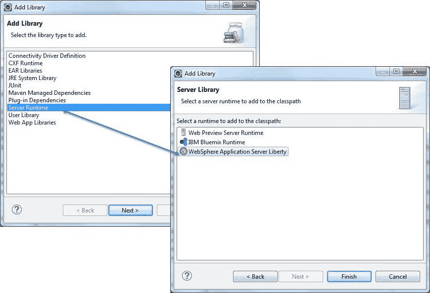
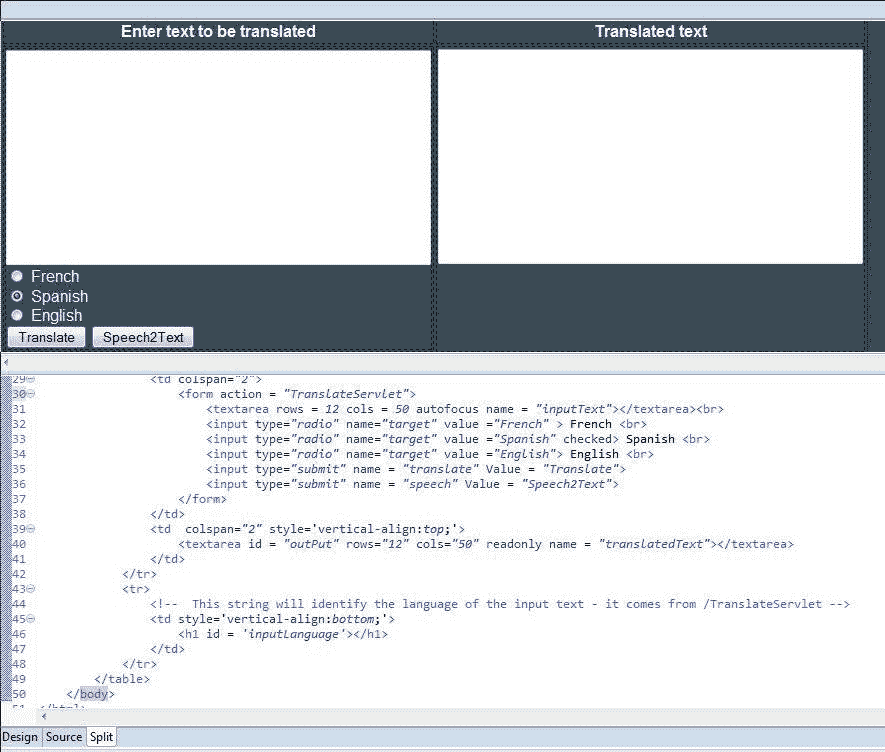

# 向应用程序添加认知服务

> 原文：[`developer.ibm.com/zh/tutorials/cc-translation-app-eclipse-watson-bluemix-part2-trs/`](https://developer.ibm.com/zh/tutorials/cc-translation-app-eclipse-watson-bluemix-part2-trs/)

试验是支持认知计算发展代理和服务的有用且可行的方法。本教程系列将介绍我如何通过试验创建一个简单翻译应用程序，该应用程序能使用两个 IBM Watson 服务： [Language Translator](https://cloud.ibm.com/catalog/services/language-translator?cm_sp=ibmdev-_-developer-tutorials-_-cloudreg) 和 [Speech to Text](https://cloud.ibm.com/catalog/services/speech-to-text?cm_sp=ibmdev-_-developer-tutorials-_-cloudreg)。在将应用程序部署到 IBM Cloud 之前，我会使用 Eclipse IDE 并使用 `localhost` 测试该应用程序。本系列将介绍如何设置 Eclipse 环境，然后将该翻译应用程序作为 Java™ servlet 进行开发，它能控制两个认知服务。

本系列中的第一篇[教程](https://www.ibm.com/developerworks/cn/cognitive/library/cc-translation-app-eclipse-watson-bluemix-trs/index.html)介绍了如何设置 Eclipse 环境。本教程将介绍如何将两个认知服务附加到该应用程序：Language Translator 和 Speech to Text。我构建此应用程序是为了展示如何在 Java 应用程序中调用认知服务。您可以通过改进功能和整合其他服务随意扩展此方法。

目标运行时仍然是 [IBM Cloud Liberty for Java](https://cloud.ibm.com/catalog/starters/liberty-for-java?cm_sp=ibmdev-_-developer-tutorials-_-cloudreg) 对于 Language Translator 认知服务。此试验还会沿用测试 Web 应用程序的最佳实践，在将应用程序推送到 [IBM Cloud](https://cloud.ibm.com/?cm_sp=ibmdev-_-developer-tutorials-_-cloudreg) 之前使用 `localhost` WebSphere Application Server。

可通过两种方式进行该试验：

*   使用 URL localhost:9080/TranslationApp 在本地运行。可以在 Eclipse IDE 内或通过本地浏览器在该 IDE 外调用此 URL。要在安装 Eclipse 本地 Application Server 实例方面获取帮助，请参阅本系列的第 1 部分。此方法同时利用了 Language Translator 服务和 Speech to Text 服务。
*   与 URL https://<translationappname>.myBluemix.net 一起使用 IBM Cloud Liberty 服务器。此选项可以演示 Language Translator 服务。在未来的试验中将使用 Web 套接字增强 Speech to Text 服务，在本地麦克风代理与基于云的服务器之间建立连接。 <translationappname>将是您在将项目添加到 IBM Cloud 中分配的唯一名称。</translationappname></translationappname>

## 入门

本系列中的第一个教程将重点介绍如何设置 Eclipse 和 IBM Cloud 环境来开发认知应用程序。该试验使用了 Java 语言作为开发语言，但这些步骤也可适用于其他语言，比如 Node.js。

在本教程中，我使用了 Eclipse Neon Release 4.6.1 来开发试验。Neon 随带了 IBM Eclipse Tools for IBM Cloud，提供了对 IBM Node.js Tools for Eclipse 的支持。如果需要将 IBM Cloud 工具包安装到更低版本的 Eclipse 实例中，或者在寻找下载 Eclipse 的网站，请访问 [`developer.ibm.com/wasdev/downloads/#asset/tools-IBM_Eclipse_Tools_for_Bluemix`](https://developer.ibm.com/wasdev/downloads/#asset/tools-IBM_Eclipse_Tools_for_Bluemix)。如在下载 Eclipse 方面需要帮助，请参阅[第 1 部分](https://www.ibm.com/developerworks/cn/cognitive/library/cc-translation-app-eclipse-watson-bluemix-trs/index.html)。

有一个包含源文件的压缩文件 [TranslationAppV2.zip](https://github.com/janderse2145/TranslationSource)。这些文件将在导入源文件中导入。

启动 Eclipse，选择您在本系列的第 1 部分中使用的工作空间。可以在启动 Eclipse 后立即选择该工作空间，或者使用菜单栏中的 File 菜单并选择 **Switch Workspace** 来选择该工作空间。将此试验和其他 IBM Cloud 试验生成的工件保留在同一个工作空间中，这样做可减少工件的重用。

## 更新本地 WebSphere Application Server

[第 1 部分](https://www.ibm.com/developerworks/cn/cognitive/library/cc-translation-app-eclipse-watson-bluemix-trs/index.html)介绍了如何安装 IBM Cloud tools for Eclipse 和本地 WebSphere Application Server for Liberty。如果需要帮助，请参阅该教程。我在本教程中使用一个新工具集。

1.  检查您安装 Application Server 的位置和它的目录结构。为了便于说明，假设安装目录 (<was install="install" directory="directory">) 为 WASLiberty，服务器名称为 defaultServer。要找到此服务器，目录结构为 WASLiberty/usr/servers/defaultServer。</was>
2.  WebSphere Developer Tools for Eclipse 是一个轻量级的工具集，用于开发应用程序并将其部署到 WebSphere 实例。请访问下面的 URL，获取下载和安装此工具集的操作说明：`https://www.ibm.com/support/knowledgecenter/`。
3.  在添加 Watson Developer Cloud SDK 中，将下载一个 JAR 文件，其中包含 Language Translator 和 Speech to Text 服务的类。必须修改 Application Server 的目录结构，以便能够看见 Watson 服务类。将子目录 /lib/global 添加到 Application Server <was install="install" directory="directory">/usr/shared/config 目录。这个目录是认知服务 JAR 文件将要下载的位置。</was>

    也可以在 Eclipse 中使用 File > New > Folder 向导添加此子目录。无论采用哪种方法，Project Explorer 视图都应如下图所示：

    

4.  在导入源文件中，添加了一个与 IBM Cloud Watson 服务环境变量具有相同结构的环境变量。

## 创建翻译应用程序项目

创建该项目类似于[第 1 部分](https://www.ibm.com/developerworks/cn/cognitive/library/cc-translation-app-eclipse-watson-bluemix-trs/index.html)中的步骤。

1.  使用 **Create New Dynamic Web Project** 向导创建该项目。
2.  将该项目命名为 **TranslationApp**。
3.  确保目标运行时被设置为 None。
4.  使用 3.1 作为动态 Web 模块版本。
5.  确保未选中 Add project to EAR 复选框。
6.  单击 **Finish**。


## 导入源文件

因为此环境的目的是展示一种在 Java 应用程序中调用认知服务的方式，所以我提供了一个压缩文件，其中包含完成此试验所需的源文件 — 这为您省去了输入或剪切粘贴工作。这些[源文件](https://github.com/janderse2145/TranslationSource)是：

*   TranslateServlet.java
*   TranslationProxy.java
*   S2TProxy.java
*   Index.html

该压缩文件还包含 myStyle.css（一个能在必要时使用的图标）和一个包含 `VCAP-SERVICES` 环境变量（该变量可修改并复制到 server.env 文件中）结构的 JSON 对象模板。

将文件导入项目中非常简单：

1.  如果使用创建翻译应用程序项目创建了该项目，那么一个名为 Java Resources 的文件夹中包含 src 子目录。右键单击 src 目录并使用 **Import** 菜单选项。
2.  在 General 下的 Select 窗口中，选择 **Archive File**，然后单击 **Next**。
3.  在 Archive File 窗口中，使用 **Browse** 导航到该压缩文件，然后挑选出 3 个要导入 src 目录中的 Java 源文件。出现的错误将在您下载支持类后修复。
4.  按照相同的步骤将 index.html 文件导入 WebContent 目录中。
5.  该图标被导入到 WebContent/images 目录中。右键单击 WebContent 文件夹并选择 **New > Folder**。将该文件夹命名为 images。然后，按照前面的说明将图标导入此文件夹中。
6.  按照相同的步骤将 myStyle.css 文件导入 WebContent/theme 目录中。这些步骤将确保 css 和图标与 index.html 条目相匹配。
7.  最后，在 Server 窗口中，打开 Application Server server.env 文件。复制 jsonTemplate.txt 文件的第一行并粘贴到 server.env 文件中。server.env 文件现在应有一个完整的 `VCAP_SERVICES` 行。您需要确定用户名和密码，并使用检查认知服务凭证中的信息更新该行。


## 添加 Watson Developer Cloud SDK

本试验使用了 Watson Developer Cloud Java SDK V3.5.2。SDK 可从 [`github.com/watson-developer-cloud/java-sdk/releases`](https://github.com/watson-developer-cloud/java-sdk/releases) 下载。如果有更新的版本可用，请使用它。查找 Version 3.5.2 Downloads 并选择要下载的 **java-sdk-3.5.2-with-dependencies.jar** 文件。此 SDK 支持所有 Watson 和 Alchemy 服务的开发，包括 Language Translator 服务。

1.  在更新本地 WebSphere Application Server 中，您创建了一个名为 /lib/global 的服务。将此 JAR 文件保存到该目录，Application Server 类加载程序能够访问它。
2.  选择 **Project > TranslationApp**，然后选择 **Build Path > Configure Build Path**。

    

3.  单击 **Add External JARs**。

    

4.  从 JAR 文件所在的目录中选中它。

    

5.  单击 Java Build Path 窗口中的 **Open**。该 SDK 现在已出现在 Project Explorer 中的项目中，显示为一个 Reference Library。
6.  此刻，阻止 Java 类编译的大部分错误都将解决。剩余的错误是由于缺少 `servlet` 类所致。在运行时，IBM Cloud 和 Application Server 都向类加载程序提供了这些类。但您必须先进行一次干净的编译。要将这些类提供给编译器，我使用此步骤中的任务 2 到 5。但是，我没有使用任务 3 中的 Add External JAR，而是单击 **Add Library**。在 Add Library 窗口中选择 **Server Runtime**，并在下一个窗口中选择 **WebSphere Application Server Liberty**。此刻，仅剩下警告类错误。

    

7.  必须执行前面的步骤，Watson 服务和 servlet 类才可见，才能供 IDE 用于编译应用程序类，供应用程序的本地 Application Server 在本地主机实例中运行。要将 Watson 服务类部署到 IBM Cloud，还需要执行最后一步。您必须将 JAR 文件导入项目的 WebContent/WEB-INF/lib 文件夹中。右键单击 **lib** 文件夹并选择 **Import**。在 Import Select 窗口中，选择 **General > File System**，导航到包含 JAR 文件的目录。这会让该文件保持 JAR 文件格式。使用 Archive 选项会将该 JAR 文件展开为各个工件。

## 检查 HTML

更新本地 WebSphere Application Server 中安装的 Application Server Developer 工具提供了一个增强的 HTML 视图，如下所示。



index.html 文件提供了应用程序的入口点。它提供了两个文本框 (`textarea`)，一个用于输入要翻译的文本 (`inputText`)，另一个用于翻译后的文本 (`translatedText`)。单选按钮定义了目标语言，而命令按钮调用了翻译或 Speech to Text 序列。

index.html 文件提供了此试验的起点。源代码位于 WebContent 文件夹中。下图显示了初始应用程序窗口。


检查 index.html 文件，以了解如何管理用户体验。

## 检查翻译 servlet

servlet 有一些特殊特征。`init` 方法可确保仅在加载 servlet 时运行一次。这非常适合从 JSON 对象中解析出用户名和密码的试验。在生产中，`Session` 是保存用户信息的更好选择。每个用户或许还应该提供他们自己的用户名和密码。这里还提供了一个存根，任何有抱负的认知程序员都可利用它。

这个 servlet 中的大部分工作都由 `doGet` 执行。`doGet` 确定单击了哪个命令按钮，为浏览器构造 HTML 流，并管理代理。

当用户输入要翻译的文本并单击 Translate 按钮后，就会显示下图：


该文本被翻译为通过单选按钮所选择的语言。请注意紧挨图标下方的消息。它指向运行该 servlet 的服务器。在本例中，服务器是 `localhost` WebSphere Application Server。应用程序在 IBM Cloud 服务器上执行后，将会显示它的名称。

除了翻译后的文本，Language Translator 还可以识别原文的语言（在本例中为英语）和从语言模型中得出的置信度。要翻译的文本越长，识别正确的原始语言的置信度就越高。Language Translator 服务还具有生成原始语言的模型的能力（本试验中没有探讨这方面的内容），以便捕获作者的个性特征并用来生成更准确的翻译结果。

## 检查认知服务代理

两个代理都由 IBM 通过 GitHub 以 starter 代码形式提供。例如，Translator 代理源自 GitHub 上的一个示例： [`github.com/watson-developer-cloud/java-sdk/tree/master/language-translator`](https://github.com/watson-developer-cloud/java-sdk/tree/master/language-translator)。IBM 提供此示例来帮助您快速将语言翻译功能整合到应用程序中。请仔细检查它。本试验中的 `TranslationProxy` 修改了 GitHub 示例，以便从 `TranslationServlet` 中消除与 Watson 服务端点交互的责任。通过从 servlet 抽象出该功能，用户体验可与 API 集的行为变化隔离。

## 将项目添加到 IBM Cloud

使用本地 Application Server 实例开发一个应用程序并测试它，这是一种很不错且很有效果的做法。不过，IBM Cloud 提供了访问认知服务所需的凭证。所以，现在是时候将应用程序推送到 IBM Cloud 了。获得凭证后，就可以使用本地 Application Server 实例。以下步骤解释了如何将应用程序部署到 IBM Cloud。

1.  在 Server 选项卡中选择 IBM Cloud 服务器，并单击 **Add and Remove**。

    

2.  选择 **TranslationApp** 并单击 **Add**。

    

3.  单击 **Finish**，然后 IBM Cloud 必须收集一些附加信息。Application details 窗口启动该收集过程。

    

4.  输入一个唯一名称，比如 <your initials="initials">TranslationApp<today’s date>，然后选中 **Save to manifest file** 复选框。我们稍后会分析清单文件的内容。单击 **Next**。</your>
5.  IBM Cloud 还需要启动该应用程序相关的细节。

    

6.  下一个窗口将新认知服务绑定到该应用程序。在本例中为 Language Translator 和 Speech to Text 服务。请注意，除了显示的服务之外，靠近右侧边框的图标还允许添加新服务。

    

7.  环境变量是将信息传递给应用程序的有用方法。举例而言，IBM Cloud 将用户名和密码存储为环境变量，这提供了一种使用这些凭证的更安全方法。尽管未用于本试验，但下面的面板提供了一种识别它们的轻松方法。

    

8.  单击 **Finish**，IBM Eclipse Tools for IBM Cloud 就会将应用程序推送到 IBM Cloud。这使您能停留在 Eclipse IDE 内，避免过渡到 Cloud Foundry 会话。请注意，部署到 IBM Cloud 需要花很长时间，这是使用本地 Application Server 服务器执行大部分应用程序测试的好理由。
9.  manifest.yml 文件描述了应用程序。它包含在将应用程序和支持工件推送到 IBM Cloud 时使用的 `cf push` 命令和 IBM Eclipse Tools for IBM Cloud。请参阅 [`cloud.ibm.com/docs/search/manifest.yml?locale=zh-cn`](https://cloud.ibm.com/docs/search/manifest.yml?locale=zh-cn) 了解更多细节。

    

## 检查认知服务凭证

在运行应用程序之前，必须确保 Watson Developer Cloud 凭证与本试验所使用的凭证匹配。因为凭证很长，所以要求用户在窗口中输入它们会很麻烦。对于本应用程序，会在 `control` servlet 的 `init` 方法中以 JSON 对象获取密码和用户名。来看一下 TranslateServlet 源代码中的 `init` 方法。

每个服务都有自己的唯一凭证。在将应用程序推送到 IBM Cloud 并查看它之后，可登录到 IBM Cloud 来确定您的凭证是什么。也可以使用 Cloud Foundry 方法：`$ cf env <xxxTranslationAppmmddyyyy>`。

要让本地 Application Server 实例与 IBM Cloud Liberty 实例尽可能相似，需要向本地 Application Server 服务器添加一个环境变量。

1.  环境变量存储在 Application Server server.env 文件中。在 Project Explorer 窗口中选择 Application Server 的实例。

    

2.  添加以下行：`VCAP_SERVICES=`。
3.  使用您喜欢的任何方法（比如复制粘贴）将 JSON 对象的文本以单行形式添加到此行。例如，以下是来自 IBM Cloud 的 `speech_to_text` JSON 对象：

    ```
    {
     "VCAP_SERVICES": {
      "speech_to_text": [
       {
        "credentials": {
         "password": "password1234",
         "url": "https://api.us-south.speech-to-text.watson.cloud.ibm.com",
         "username": "xxxxxxxx-7b7d-45c1-a44c-xxxxxxxxxxxx"
        },
        "label": "speech_to_text",
        "name": "Speech to Text-eu",
        "plan": "standard",
        "provider": null,
        "syslog_drain_url": null,
        "tags": [
         "watson",
         "ibm_created",
         "ibm_dedicated_public"
        ]
       }
      ]
     }
    } 
    ```

server.env 文件不能分为多行，所以必须将前面的代码更改为一行：

```
VCAP_SERVICES={ "speech_to_text": [{"credentials": {"password": "password1234","url": "https://api.us-south.speech-to-text.watson.cloud.ibm.com","username": "xxxxxxxx-7b7d-45c1-a44c-xxxxxxxxxxxx"},"label": "speech_to_text","name": "Speech to Text-eu",  "plan": "standard","provider": null,"syslog_drain_url": null,"tags": ["watson","ibm_created", "ibm_dedicated_public"]}]} 
```

压缩文件包含一个文本文件，其中包含一个可供您使用的 JSON 模板。使用 IBM Cloud 提供的用户名和密码，并使用它们替换模板中的默认值。

对于 server.env 文件，有一点很重要。该文件仅在服务器启动时加载。如果更改该文件，则必须重新启动服务器，更改才能生效。

## 测试应用程序

必须将项目部署到本地 Application Server 服务器来运行它。该过程基本上与将项目部署到 IBM Cloud 相同。

1.  右键单击 Server 窗口中的 Application Server 服务器，选择 **Add and Remove**。
2.  在 Add and Remove 窗口中选择 **TramslationApp**，单击 **Add**，然后单击 **Finish**。

要运行该应用程序，可在 Project Explorer 中选择 TranslationApp 项目，然后选择 **Run As > Run on Server**。在 IBM Cloud 环境中运行应用程序之前，请使用 `localhost` 测试它。


关于 Speech to Text 选项，有两点需要注意：

1.  麦克风的保真度非常重要。
2.  当尝试结合使用 Speech to Text 和 IBM Cloud 服务器时，您会获得一条 Line not supported 消息。此消息在预料之中，将在未来的试验中使用 Web 套接字进行详细分析。

## 结束语

在本系列和试验中，我尝试介绍了如何快速将认知服务整合到您自己的项目中。然后，您可以扩展此方法，改进功能并整合更多服务。您正踏上一个非常有趣的旅程，希望本试验对您有所帮助。祝您旅途愉快。

本文翻译自：[Create a translation application by using Watson services, Eclipse, and IBM Cloud](https://developer.ibm.com/tutorials/cc-translation-app-eclipse-watson-bluemix-part2-trs/)（2017-01-31）