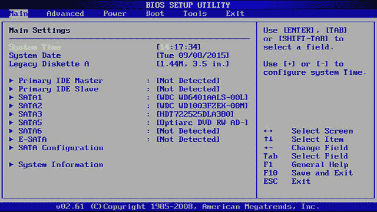
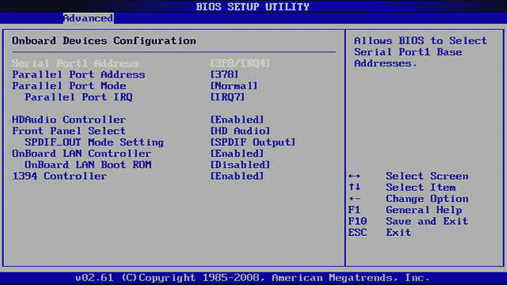
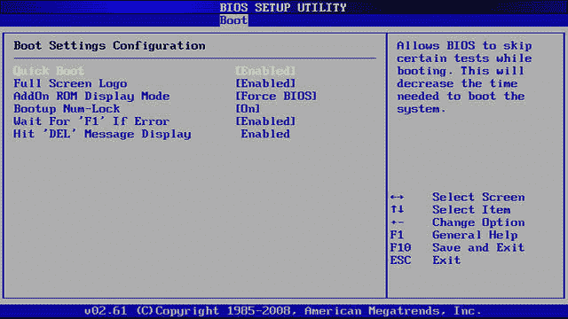
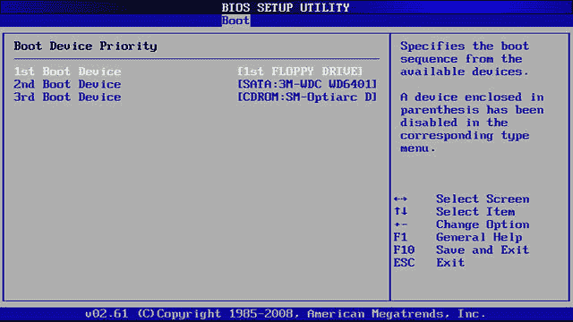
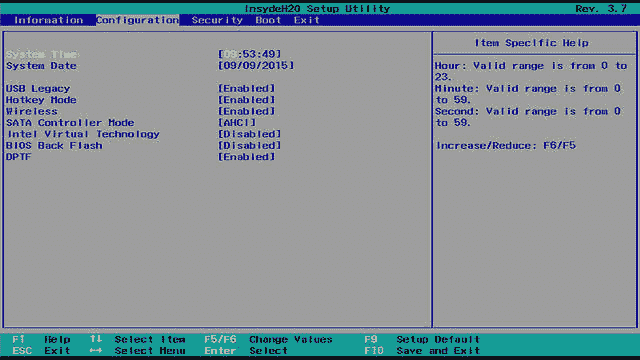
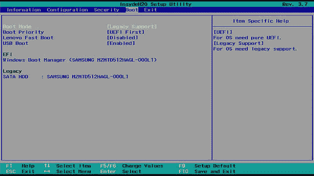
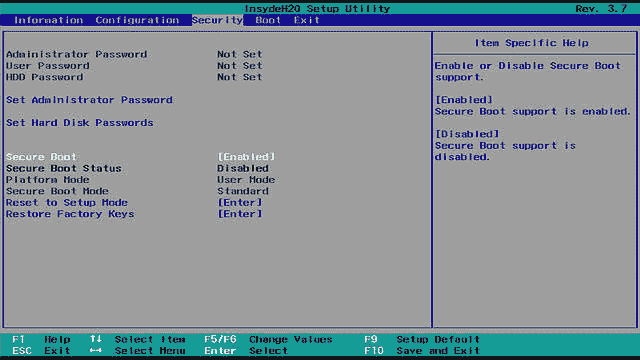
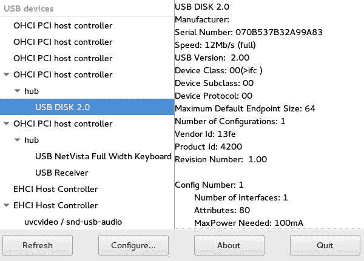

# 学习 Linux 101：配置硬件设置

> 原文：[`developer.ibm.com/zh/tutorials/l-lpic1-101-1/`](https://developer.ibm.com/zh/tutorials/l-lpic1-101-1/)

## 概述

在本教程中，您将了解如何配置和检查 Linux 系统的硬件。学习：

*   启用和禁用集成外围设备
*   配置外围设备的系统（或带有或不带有键盘）
*   区分不同类型的海量存储设备
*   了解冷插拔和热插拔设备
*   了解设备使用哪些硬件资源
*   使用工具列出和操作设备
*   了解 sysfs、procfs、udev 和 dbus

## 计算机硬件

与 1981 年推出的 IBM PC 相比，如今的计算机已经取得巨大进步。除了速度、内存和存储功能的大幅提升外，最显着的变化可能是配置和设置。在本教程中，我将介绍当前计算机上可能使用的一些常见硬件设置，还会讨论 Linux 中提供的用于列出和管理硬件的命令。

##### 关于本系列教程

本系列教程可帮助您学习 Linux 系统管理任务。您还可以使用这些教程中的资料来准备参加 [Linux Professional Institute 的 LPIC-1：Linux 服务器专业认证考试](https://www.lpi.org)。

请参阅“[*学习 Linux 101*：LPIC-1 学习路线图](https://developer.ibm.com/zh/tutorials/l-lpic1-map/)”，获得本系列中每个教程的描述和链接。这个学习路线图正在完善中，反映了 2015 年 4 月 15 日更新的 LPIC-1 V4.0 考试目标。在教程完成时，会将它们添加到学习路线图中。

本教程将帮助您为 Linux Server Professional (LPIC-1) 考试 101 的主题 101 中的目标 101.1 做好应考准备。该目标的权重为 2。

### 前提条件

要想最充分地利用本系列教程，您应该掌握 Linux 的基本知识，还应该有一个正常工作的 Linux 系统，您可以在这个系统上练习本教程中讲解的命令。有时候，由于程序的不同版本会产生不同的输出格式，因此您的结果不一定与这里显示的清单和图完全相同。本教程中的示例来自具有传统基本输入/输出服务 (BIOS) 或较新的通用可扩展固件接口 (UEFI) 的 64 位系统。

## 硬件设置

通常，您可以使用 BIOS 或 UEFI 固件来配置设置。除非设置是特定于 UEFI 的，否则我将使用术语 *BIOS 设置*来涵盖 BIOS 和 UEFI 设置。

开启计算机后，即可访问 BIOS 设置。通常，在开启计算机之后、在开始加载操作系统之前，可通过按 Del、F1 或 F8 这样的键来执行此操作。随着计算机运行速度越来越快，而且固态驱动器 (SSD) 将引导时间缩短到几秒钟，您可能会发现系统上提供了可供使用的特殊按钮或按键序列。查看系统文档，了解如何访问 BIOS 设置。下面显示的示例阐述了您可能找到的设置种类，但是 BIOS 界面的实际布局可能与我的有所不同。

##### 硬件历史记录：跳线和 DIP 开关

在早期的 PC 中，BIOS 是一个无法与用户进行交互的神秘黑匣子。您可以通过安装或移除称为[跳线](https://en.wikipedia.org/wiki/Jumper_%28computing%29)的设备来更改几个可修改或设置的硬件设置。在需要多个设置的地方，经常会使用[双列直插式封装 (DIP)](https://en.wikipedia.org/wiki/DIP_switch) 开关。外部调制解调器可能仍包含用于管理某些内部设置的 DIP 开关，但如今很少会使用[跳线](https://en.wikipedia.org/wiki/Jumper_%28computing%29)或 DIP 开关来配置计算机。BIOS 现在提供了一个用户界面，并且设置都存储在非易失性存储器中。

图 1 显示了我构建的系统的 BIOS 主屏幕示例。在此页面上，您可以更改系统的日期和时间。您还可以更改传统软盘驱动器（如果有）的参数。同时还可以查看已安装驱动器的摘要。我的系统只具有 SATA 驱动器，但通过机载控制器也支持 IDE 驱动器。

*图 1.包含日期和时间设置的 BIOS 主屏幕*


如果系统支持传统的外围设备接口，那么就可以在相应的位置配置这些接口。就我而言，我可以使用 Advanced 菜单来配置串行和并行端口中断请求 (IRQ) 和 I/O 端口起始地址。图 2 显示了我的系统的高级设置。注意，除了配置传统的串行和并行端口外，我还可以启用或禁用机载 LAN 和 1394 (FireWire) 控制器。另外需要注意的是，LAN 控制器还包含一个引导 ROM（已被我禁用）。如果希望从远程服务器通过 LAN 加载系统，请启用该引导 ROM。您可能希望将其用于自助机或重新镜像大量系统。

*图 2.使用 BIOS 配置串行、并行和机载设备*


您的 BIOS 还可能提供用于在不使用键盘或鼠标的情况下进行引导的设置。当出现引导错误或配置发生更改（例如添加内存）时，许多系统（尤其是较旧的系统）会要求您按下某个键来进入 BIOS 设置。如果系统没有键盘，会发生什么情况？如今，您可能会插入通用串行总线 (USB) 键盘，但具有 PS2 键盘接口的旧版系统在插入键盘时有时可能会受损。因此，在许多 BIOS 系统上，您可以禁用键盘本身，或者禁用在没有键盘的情况下可能出现的警告。我的系统上有一个键盘，因此我启用了“Wait for ‘F1’ If Error”设置，如图 3 中所示。

*图 3.使用 BIOS 禁用键盘或键盘引导错误*


您可能还需要完成另一项重要设置，即设置引导设备的顺序。如图 4 中所示，我的系统被设置为先检查第一个软盘驱动器，接着检查第一个 SATA 驱动器，最后检查 CD 或 DVD。我已经好几年没有软盘驱动器了，因此我从该序列中将其删除了。如果硬盘驱动器无法正常工作，那么可以用 CD 或 DVD 作为备份。参阅教程“[学习 Linux 101：引导系统](https://developer.ibm.com/zh/tutorials/l-lpic1-101-2/)”，以获取有关如何选择 CD 或 DVD（如果您希望仅通过 CD 或 DVD 引导一次）的信息。

*图 4.使用 BIOS 配置引导设备顺序*


UEFI 系统的许多设置都与传统 BIOS 的设置类似，包括日期、时间以及是否启用机载设备。图 5 显示了来自 Lenovo Yoga 2 Pro 的示例。

*图 5.使用 UEFI 配置日期、时间和机载设备*


UEFI 系统的一个显著特点是支持 UEFI 引导。您的系统可能支持仅 UEFI 引导，也可能支持类似传统 BIOS 的引导。我的系统上有一个 Boot Mode 参数，此参数有两个选项，如图 6 中所示。如果选择 Legacy Support，那么可以引导传统系统或 UEFI 系统。如果选择 UEFI，那么系统将仅引导 UEFI 系统。

*图 6.选择 UEFI 引导模式*


如果选择仅 UEFI 引导，那么您可能不会看到与传统支持相关的某些项，例如您在图 5 中看到的传统 USB 支持选项。有些选项可能还支持安全引导，这只会引导已签名的二进制文件。图 7 显示了在选择仅 UEFI 引导时可能出现的一些安全选项。在我的系统上，可以同时更改状态值和选项。例如，User 的“Platform Mode”设置可确认已安装安全密钥。如果未安装任何密钥，那么该值可能为 Setup。我可以使用“Reset to Setup Mode”来安装新密钥，也可以使用“Restore Factory Keys”来恢复预安装的工厂密钥。

*图 7.UEFI 的安全引导选项*


## 大容量存储设备

计算机可以使用多种类型的大容量存储设备，并且可通过多种方式来连接这种存储设备。如今，大多数的大容量存储设备都使用标准接口，并且在连接时会检测到此类设备，或者 BIOS 配置大部分是自动的。本教程稍后会介绍如何确定设备所需的资源。下面我们来了解一下不同类型的常见大容量存储设备。

##### 硬件历史记录：软磁盘或软盘

早期的 PC 将操作系统和数据都存储在软磁盘（也称为[软盘](https://en.wikipedia.org/wiki/Floppy_disk)）上。虽然图 1 中使用的计算机未安装软盘驱动器，但您会在初始 BIOS 屏幕中看到软盘驱动器配置的痕迹。如今，您可能会找到带有 USB 接口的 3.5 英寸软盘驱动器，但找不到内部安装了软盘驱动器的计算机。

### 硬盘驱动器

自 20 世纪 80 年代初期以来，硬盘驱动器一直是 PC 上用于存储数据的主要设备。硬盘驱动器封装在一个密封的单元中，并包含多个刻录面或盘片。1980 年推出的 ST-506 只有 5MB 的容量，它使用控制器卡将计算机的请求转换为访问磁盘盘片上的数据所需的内部命令。1984 年，IBM 推出了带有 16 位 AT 总线（后来称为行业标准架构 (ISA) 总线）的 IBM PC/AT 计算机。AT 连接接口 (ATA) 对控制器卡与计算机之间的接口实现标准化，并保留了与 ST-506 命令集的兼容性。在 20 世纪 80 年代初期，Western Digital 将控制器功能植入驱动器壳体内，这种驱动器被命名为“电子集成驱动器”(IDE)。您还会发现一些后期的标准和术语，包括 ATA-1、ATA-2、ATA-4 和 EIDE 等。在 2003 年推出串行 ATA (SATA) 后，原始 ATA 接口被称为并行 ATA (PATA)。

另一种流行的磁盘连接接口是小型计算机系统接口 (SCSI)。SCSI 是在 1978 年左右开发的，用于连接各种设备，包括硬盘驱动器和打印机。SCSI 磁盘在大型服务器中仍然很受欢迎。

原始 ATA 接口是为硬盘驱动器设计的。该 ATA 接口已扩展为 ATA 数据包接口 (ATAPI)，因此可以与其他设备（例如软盘驱动器、Zip 驱动器或 CD 驱动器）一起使用。ATAPI 增加了可检测介质是否存在或弹出介质的功能，以及普通硬盘驱动器不需要的其他功能。ATAPI 接口可以在数据包中携带 SCSI 命令，因此支持各种设备类型。

如今，内置硬盘驱动器通常使用 SCSI 或 SATA 连接。也可以使用 USB、IEE-1394 (FireWire)、外部串行高级技术连接 (eSATA) 或 Apple 的 Thunderbolt 在外部连接驱动器。

可以对硬盘驱动器进行分区以按用途划分其空间，并且可以将它们组合为阵列以实现冗余。也可以使用诸如 Logical Volume Manager 之类的工具将硬盘驱动器组合在一起，使数个较小的磁盘显示为一个或多个较大的磁盘。

### CD 和 DVD 驱动器

CD、DVD 和蓝光驱动器使用的是光存储技术，因此它们可存储的数据量要比软盘驱动器多得多。早期的 CD 驱动器通常通过声卡进行连接，并且接口多种多样。后期的 CD 以及 DVD 驱动器对 ATAPI 接口实现了标准化。如今，您可以发现使用 SATA 在内部连接的 CD 驱动器，或者使用与硬盘驱动器相同类型的接口在外部连接的 CD 驱动器。软件包通常以 CD 或 DVD 形式分发，而 CD 或 DVD 最初是只读介质。现如今，通过使用设备和介质，用户可以创建（*刻录*）自己的 CD 和 DVD 以进行备份或存储数据。

### 闪存或拇指驱动器

目前最常用的数据交换方式是闪存或拇指驱动器。这种驱动器使用非易失性 RAM 来存储数据。与 CD 或 DVD 介质不同，它们比软盘更可靠、更快速且容量更大，而且可以多次重复使用。大多数拇指驱动器都与人类的拇指大小差不多，故因此得名，它们通常连接到 USB 端口。大多数拇指驱动器都支持 USB 2.0，最大速度为 480Mbps。新版的设备支持 USB 3.0，最大速度为 5Gbps。在撰写本文时，拇指驱动器的典型大小为 1GB 到 256GB，少数型号的大小甚至可达 512GB 和 1TB。您可以像硬盘驱动器那样对拇指驱动器进行分区。如果您下载了一个较新的 Linux 发行版，那么可以将其刻录到 USB 拇指驱动器上，以便可以从该设备中进行安装。

### 固态驱动器

固态驱动器 (SSD) 是许多笔记本电脑中使用的一种新型驱动器。与传统的硬盘驱动器相比，SSD 更轻巧、更快速且功耗更低，而且不会发生机械故障。SSD 通常像笔记本驱动器一样封装在外壳中，并使用相同的接口，但这种安排理论上可能会限制 SSD 的功能。针对基于 PCI Express (PCIe) 的固态驱动器，制定了一种称为 NVM Express (NVMe) 的新连接规范。这种规范旨在通过 PCIe 更好地使用 SSD。

## 热插拔和冷插拔

由于笔记本硬件支持使用国际个人计算机存储卡协会 (PCMCIA) 规范和 CardBus 规范的可插拔卡并且可将软盘驱动器换成 CD，因此热插拔设备在笔记本硬件中变得很普遍。Linux 从 2001 年的 2.4 内核开始引入了热插拔支持。热插拔与*冷插拔*相对，热插拔设备是指在引导时以物理方式连接到计算机的设备。

随着 USB 和 IEEE-1394 FireWire 设备的出现，热插拔已成为一种常态，而不是个别现象。如今，高端服务器可以在单个系统上多路复用的 Linux 系统之间动态移动资源（例如内存或 CPU）。现在几乎所有资源都可以进行热插拔。因此，Linux 系统现在只使用几个冷插拔设备来启动系统，然后使用可推动 udev 规则的热插拔事件来激活其他所有设备。甚至会重新扫描冷插拔设备，以推动 udev 事件并有效地使其成为热插拔设备。

## 用于存储硬件和系统信息的虚拟文件

有多种虚拟文件系统都提供了在内存中查看系统的功能，就像内核查看系统一样。从存储设备上不存在实际文件的意义上讲，这些文件系统是虚拟的。利用虚拟文件系统，可以了解内核数据结构和系统硬件。

### Sysfs 和 /sys

Sysfs 是一个虚拟文件系统，Linux 内核使用该文件系统将内核对象的相关信息导出到用户空间中运行的进程。这种文件系统是在 2.6 内核中引入的，最初源自于 2.4 内核中的 ramfs。sysfs 虚拟文件系统是内存中的文件系统，它安装在 /sys 中。如果在初始化期间未通过 /etc/fstab 中的条目安装该文件系统，那么始终可以使用以下命令进行安装：

```
 mount ‑t sysfs sysfs /sys 
```

Sysfs 是一个简单的文件系统，其中使用文件表示对象属性。对象本身由目录表示。对象之间的关系由符号链接表示。sysfs 中的顶级目录表示主要子系统。清单 1 显示了顶级 /sys 目录以及 /sys/bus 和 /sys/devices 目录的示例。

##### 清单 1.来自 sysfs 文件系统的一些条目

```
 [ian@atticf22 ~]$ ls /sys
block  class  devices   fs          kernel  power
bus    dev    firmware  hypervisor  module
[ian@atticf22 ~]$ ls /sys/bus
acpi         edac          i2c           mipi‑dsi     platform  usb
clockevents  event_source  machinecheck  node         pnp       usb‑serial
clocksource  firewire      mdio_bus      pci          scsi      workqueue
container    hdaudio       media         pci_express  serio     xen
cpu          hid           memory        pcmcia       snd_seq   xen‑backend
[ian@atticf22 ~]$ ls /sys/devices/
breakpoint  ibs_fetch  LNXSYSTM:00  platform  software  tracepoint
cpu         ibs_op     pci0000:00   pnp0      system    virtual 
```

如果您查看 /sys/block，那么可以找到块设备。就我而言，我有三个硬盘驱动器（sda、sdb 和 sdc）和一个 CD/DVD 驱动器 (sr0)。它们实际上是指向 /sys/devices 目录下的目录的链接。如果您打开这些链接，那么可以找到 sda 的分区。查看 size 文件，您会看到该磁盘具有 2,040,192 个扇区（可通过 fdisk -l`fdisk-l` 进行确认），如清单 2 中所示。

##### 清单 2./Sys 中的块设备

```
 [ian@atticf22 ~]$ ls /sys/block
sda  sdb  sdc  sr0
[ian@atticf22 ~]$ ls ‑l /sys/block
total 0
lrwxrwxrwx.1 root root 0 Sep  9 12:11 sda ‑> 
../devices/pci0000:00/0000:00:11.0/ata1/host0/target0:0:0/0:0:0:0/block/sda
lrwxrwxrwx.1 root root 0 Sep  9 12:11 sdb ‑> 
../devices/pci0000:00/0000:00:11.0/ata2/host1/target1:0:0/1:0:0:0/block/sdb
lrwxrwxrwx.1 root root 0 Sep  9 12:11 sdc ‑> 
../devices/pci0000:00/0000:00:11.0/ata3/host2/target2:0:0/2:0:0:0/block/sdc
lrwxrwxrwx.1 root root 0 Sep 10 20:30 sr0 ‑> 
../devices/pci0000:00/0000:00:14.1/ata6/host5/target5:0:0/5:0:0:0/block/sr0
[ian@atticf22 ~]$ ls /sys/"devices/pci0000:00/0000:00:11.0/ata1/host0/target0:0:0/0:0:0:0/block/sda"
alignment_offset   events             power      sda10  sda5  slaves
bdi                events_async       queue      sda11  sda6  stat
capability         events_poll_msecs  range      sda12  sda7  subsystem
dev                ext_range          removable  sda2   sda8  trace
device             holders            ro         sda3   sda9  uevent
discard_alignment  inflight           sda1       sda4   size
[ian@atticf22 ~]$ ls /sys/"devices/pci0000:00/0000:00:11.0/ata1/host0/target0:0:0/0:0:0:0/block/sda"/sda1
alignment_offset  discard_alignment  inflight   power  size   stat       trace
dev               holders            partition  ro     start  subsystem  uevent
[ian@atticf22 ~]$ cat 
> /sys/"devices/pci0000:00/0000:00:11.0/ata1/host0/target0:0:0/0:0:0:0/block/sda"/sda1/size
2040192
[ian@atticf22 ~]$ su ‑
Password: 
root@atticf22 ~fdisk ‑l /dev/sda1
Disk /dev/sda1: 996.2 MiB, 1044578304 bytes, 2040192 sectors

Units: sectors of 1 * 512 = 512 bytes
Sector size (logical/physical): 512 bytes / 512 bytes
I/O size (minimum/optimal): 512 bytes / 512 bytes
Disklabel type: dos 
```

`tree` 命令是用于浏览 /sys 的有用工具。注意，必须通过用引号将特殊字符（例如，冒号 (`:`)）括起或使用反斜杠 (`\`) 字符来转义特殊字符。

### procfs 和 /proc

利用 procfs 文件系统，可以了解许多内核数据结构，甚至可以动态更改少数内核数据结构。procfs 通常安装在 /proc 中。清单 3 显示了我的系统上 /proc 的清单。

##### 清单 3./proc 的清单

```
 [ian@atticf22 ~]$ ls /proc
1     1274  1891  2155  254   460   559   7651       devices      mtrr
10    1278  19    2160  255   468   56    768        diskstats    net
107   1281  1903  2174  256   47    562   7745       dma          pagetypeinfo
1080  1287  1947  2185  257   48    565   7885       driver       partitions
1083  13    1951  22    26    488   57    799        execdomains  sched_debug
11    1326  1952  2243  2604  490   570   8          fb           scsi
1120  14    1957  2261  2650  495   585   8077       filesystems  self
1121  15    1959  2264  266   496   588   8159       fs           slabinfo
1144  1548  1971  2289  27    5     590   8182       interrupts   softirqs
1181  1557  1990  23    2711  50    599   8189       iomem        stat
1187  1561  1996  2310  28    51    603   859        ioports      swaps
1192  1591  1999  2327  285   512   6243  9          irq          sys
1195  1659  2     2338  286   513   64    940        kallsyms     sysrq‑trigger
1199  1662  20    2341  29    517   66    942        kcore        sysvipc
12    17    2040  2342  3     518   669   947        keys         thread‑self
1206  1728  2046  24    30    52    67    949        key‑users    timer_list
1226  1734  2052  2438  31    53    68    973        kmsg         timer_stats
1230  1789  2057  2440  32    539   6896  acpi       kpagecount   tty
1232  1792  21    2442  33    54    69    asound     kpageflags   uptime
1243  1796  2111  2444  36    548   7     buddyinfo  loadavg      version
1246  18    2117  2448  37    549   749   bus        locks        vmallocinfo
1249  1804  2119  25    375   55    7505  cgroups    mdstat       vmstat
1254  1808  2122  250   392   551   751   cmdline    meminfo      zoneinfo
1256  1828  2126  251   407   5525  753   consoles   misc
1265  1836  2133  252   411   553   759   cpuinfo    modules
1269  1853  2153  253   459   557   762   crypto     mounts 
```

您会看到大量带编号的目录（系统上运行的每个进程都有一个对应的目录）。编号是进程 ID (PID)。清单 4 显示了正在运行的 bash 命令提示符的前几个条目（PID=$$ – 当前 PID）。注意，procfs 文件系统中几乎所有条目的长度都为 0（即使这些条目可能不为空）；如果使用 `cat` 命令，则可以看到数据。大多数条目都不是以换行符结尾，因此，为了清晰起见，我在清单 4 中使用了 `echo` 命令。

##### 清单 4.显示当前进程的 /proc 条目

```
 [ian@atticf22 ~]$ ls ‑l /proc/$$/ | head ‑n 15
total 0
dr‑xr‑xr‑x.2 ian ian 0 Sep 10 22:44 attr
‑rw‑r‑‑r‑‑.1 ian ian 0 Sep 10 22:44 autogroup
‑r‑‑‑‑‑‑‑‑.1 ian ian 0 Sep 10 22:44 auxv
‑r‑‑r‑‑r‑‑.1 ian ian 0 Sep 10 22:44 cgroup
‑‑w‑‑‑‑‑‑‑.1 ian ian 0 Sep 10 22:44 clear_refs
‑r‑‑r‑‑r‑‑.1 ian ian 0 Sep 10 20:35 cmdline
‑rw‑r‑‑r‑‑.1 ian ian 0 Sep 10 22:44 comm
‑rw‑r‑‑r‑‑.1 ian ian 0 Sep 10 22:44 coredump_filter
‑r‑‑r‑‑r‑‑.1 ian ian 0 Sep 10 22:44 cpuset
lrwxrwxrwx.1 ian ian 0 Sep 10 22:44 cwd ‑> /home/ian
‑r‑‑‑‑‑‑‑‑.1 ian ian 0 Sep 10 22:44 environ
lrwxrwxrwx.1 ian ian 0 Sep 10 20:35 exe ‑> /usr/bin/bash
dr‑x‑‑‑‑‑‑.2 ian ian 0 Sep 10 20:08 fd
dr‑x‑‑‑‑‑‑.2 ian ian 0 Sep 10 22:44 fdinfo
bash[ian@atticf22 ~]$ #Now display our command line
bash[ian@atticf22 ~]$ cat /proc/$$/cmdline;echo ""
bash 
```

对于可通过设置 procfs 文件系统中的值来控制的参数，也可以通过 `sysctl` 命令进行控制。有关更多信息，请参阅 sysctl 和 procfs 手册页。

procfs 文件系统还提供了有关系统所使用的中断、直接存储器存取 (DMA) 和 I/O 端口资源的信息。

清单 5 显示了我的系统上 /proc/interrupts 的内容。使用 ISA 总线的旧版单处理器计算机会使用某些已知的中断（或 IRQ）、I/O 端口和 DMA 资源。由于供应有限，因此添加需要 IRQ 5 的声卡可能会阻止使用也需要 IRQ 5 的另一个并行端口。PCI 总线具有消息信号中断 (MSI) 功能，这可以显著减轻旧版系统中的资源限制。ISA 总线设备中断的编号为 0 到 15。此系统确实有一个使用 IRQ7 的并行打印机端口，但没有通常使用 IRQ3 或 IRQ 4 的串行端口。如果出现错误消息或设备无法正常运行，并且发生可疑的中断冲突，那么最好是先查看 /proc/interrupts。

##### 清单 5./proc/interrupts 的清单

```
 [ian@atticf22 ~]$ cat /proc/interrupts 
           CPU0       CPU1       
  0:        133          0   IO‑APIC‑edge      timer
  1:          0          2   IO‑APIC‑edge      i8042
  7:          0          0   IO‑APIC‑edge      parport0
  8:          0          1   IO‑APIC‑edge      rtc0
  9:          0          0   IO‑APIC‑fasteoi   acpi
 12:          1          4   IO‑APIC‑edge      i8042
 14:          0          0   IO‑APIC‑edge      pata_atiixp
 15:        157     166172   IO‑APIC‑edge      pata_atiixp
 16:        752     764097   IO‑APIC  16‑fasteoi   ohci_hcd:usb3, ohci_hcd:usb4, snd_hda_intel
 17:        125      74351   IO‑APIC  17‑fasteoi   ehci_hcd:usb1, firewire_ohci
 18:          0          3   IO‑APIC  18‑fasteoi   ohci_hcd:usb5, ohci_hcd:usb6, ohci_hcd:usb7
 19:          4       1264   IO‑APIC  19‑fasteoi   ehci_hcd:usb2, snd_hda_intel
 22:        286     186458   IO‑APIC  22‑fasteoi   0000:00:11.0
 27:       1073    1250614   PCI‑MSI‑edge      enp3s0
 28:       7457   10965287   PCI‑MSI‑edge      nvkm

NMI:        850        888   Non‑maskable interrupts
LOC:   25779766   25467714   Local timer interrupts
SPU:          0          0   Spurious interrupts
PMI:        850        888   Performance monitoring interrupts
IWI:          0          2   IRQ work interrupts
RTR:          0          0   APIC ICR read retries
RES:   40628246   39894661   Rescheduling interrupts
CAL:        823        986   Function call interrupts
TLB:    1972576    2052293   TLB shootdowns
TRM:          0          0   Thermal event interrupts
THR:          0          0   Threshold APIC interrupts
MCE:          0          0   Machine check exceptions
MCP:        568        568   Machine check polls
HYP:          0          0   Hypervisor callback interrupts
ERR:          0
MIS:          0 
```

DMA 是在 ISA 总线系统中使用的一种技术，通过该技术，硬盘驱动器等快速设备可以在不涉及处理器的情况下将数据传输到计算机内存。在设备中读写数据时，DMA 会释放处理器，使其可以执行其他工作。PCI 总线架构使用总线主控来实现类似的目标。清单 6 显示了我的系统上 /proc/dma 的内容。如果您具有 ISA 总线资源，则通常会看到更多的信息，并且您可能需要使用这些信息来帮助诊断冲突。

##### 清单 6./proc/interrupts 的清单

```
 [ian@atticf22 ~]$ cat /proc/dma
 4: cascade 
```

可帮助解决问题的另一个资源列表是 /proc/ioports 中的 I/O 端口清单。ISA 总线系统中使用的多个 I/O 端口都是已知端口，例如，通常用于第一个并行端口的范围 0378 至 037a 内的端口。注意，端口是以十六进制格式指定的。

##### 清单 7./Proc/ioports 的清单

```
 [ian@atticf22 ~]$ cat /proc/ioports
0000‑0cf7 : PCI Bus 0000:00
  0000‑001f : dma1
  0020‑0021 : pic1
  0040‑0043 : timer0
  0050‑0053 : timer1
  0060‑0060 : keyboard
  0061‑0061 : PNP0800:00
  0064‑0064 : keyboard
  0070‑0071 : rtc0
  0080‑008f : dma page reg
  00a0‑00a1 : pic2
  00c0‑00df : dma2
  00f0‑00ff : PNP0C04:00
    00f0‑00ff : fpu
  0170‑0177 : 0000:00:14.1
    0170‑0177 : pata_atiixp
  01f0‑01f7 : 0000:00:14.1
    01f0‑01f7 : pata_atiixp
  0230‑023f : pnp 00:07
  0290‑029f : pnp 00:07
  0300‑030f : pnp 00:07
  0376‑0376 : 0000:00:14.1
    0376‑0376 : pata_atiixp
  0378‑037a : parport0
  03c0‑03df : vga+
  03f6‑03f6 : 0000:00:14.1
    03f6‑03f6 : pata_atiixp
  03f8‑03ff : serial
  040b‑040b : pnp 00:06
  04d0‑04d1 : pnp 00:06
  04d6‑04d6 : pnp 00:06
  0800‑0803 : ACPI PM1a_EVT_BLK
  0804‑0805 : ACPI PM1a_CNT_BLK
  0808‑080b : ACPI PM_TMR
  0810‑0815 : ACPI CPU throttle
  0820‑0827 : ACPI GPE0_BLK
  08ff‑08ff : ACPI PM2_CNT_BLK
  0900‑090f : pnp 00:06
  0910‑091f : pnp 00:06
  0a30‑0a3f : pnp 00:07
  0b00‑0b3f : pnp 00:06
    0b20‑0b2f : pnp 00:06
  0c00‑0c01 : pnp 00:06
  0c14‑0c14 : pnp 00:06
  0c50‑0c51 : pnp 00:06
  0c52‑0c52 : pnp 00:06
  0c6c‑0c6c : pnp 00:06

  0c6f‑0c6f : pnp 00:06
  0cd0‑0cd1 : pnp 00:06
  0cd2‑0cd3 : pnp 00:06
  0cd4‑0cd5 : pnp 00:06
  0cd6‑0cd7 : pnp 00:06
  0cd8‑0cdf : pnp 00:06
0cf8‑0cff : PCI conf1
0d00‑ffff : PCI Bus 0000:00
  8000‑800f : 0000:00:11.0
    8000‑800f : ahci
  9000‑9003 : 0000:00:11.0
    9000‑9003 : ahci
  a000‑a007 : 0000:00:11.0
    a000‑a007 : ahci
  b000‑b003 : 0000:00:11.0
    b000‑b003 : ahci
  c000‑c007 : 0000:00:11.0
    c000‑c007 : ahci
  d000‑dfff : PCI Bus 0000:01
    dc00‑dc7f : 0000:01:00.0
  e000‑efff : PCI Bus 0000:03
    e800‑e8ff : 0000:03:00.0
      e800‑e8ff : r8169
  fe00‑fefe : pnp 00:06
  ff00‑ff0f : 0000:00:14.1
    ff00‑ff0f : pata_atiixp 
```

### lsdev 命令

procinfo 软件包中包含 `lsdev` 命令，该命令通过将每个设备的 DMA、IRQ 和 I/O 端口信息收集到一个简单表格格式的文件中，以简化 /proc 中信息的显示。清单 8 显示了我的系统上 `lsdev` 命令的输出。

##### 清单 8.lsdev 命令的输出

```
 [ian@atticf22 ~]$ lsdev
Device            DMA   IRQ  I/O Ports
‑‑‑‑‑‑‑‑‑‑‑‑‑‑‑‑‑‑‑‑‑‑‑‑‑‑‑‑‑‑‑‑‑‑‑‑‑‑‑‑‑‑‑‑‑‑‑‑
0000:00:11.0             22  8000‑800f 9000‑9003 a000‑a007 b000‑b003 c000‑c007
0000:00:14.1                 0170‑0177 01f0‑01f7 0376‑0376 03f6‑03f6 ff00‑ff0f
0000:01:00.0                 dc00‑dc7f
0000:03:00.0                 e800‑e8ff
acpi                      9 
ACPI                         0800‑0803 0804‑0805 0808‑080b 0810‑0815 0820‑0827 08ff‑08ff
ahci                         8000‑800f 9000‑9003 a000‑a007 b000‑b003 c000‑c007
cascade             4       
dma                          0080‑008f
dma1                         0000‑001f
dma2                         00c0‑00df
enp3s0                   27 
firewire_ohci            17 
fpu                          00f0‑00ff
i8042                  1 12 
keyboard                     0060‑0060 0064‑0064
nvkm                     28 
ohci_hcd:usb7            18 
parport0                  7  0378‑037a
pata_atiixp           14 15  0170‑0177 01f0‑01f7 0376‑0376 03f6‑03f6 ff00‑ff0f
PCI                          0000‑0cf7 0cf8‑0cff 0d00‑ffff d000‑dfff e000‑efff
pic1                         0020‑0021
pic2                         00a0‑00a1
pnp                          0230‑023f 0290‑029f 0300‑030f 040b‑040b 04d0‑04d1 04d6‑04d6 0900‑090f 
                             0910‑091f 0a30‑0a3f 0b00‑0b3f 0b20‑0b2f 0c00‑0c01 0c14‑0c14 0c50‑0c51 
                             0c52‑0c52 0c6c‑0c6c 0c6f‑0c6f 0cd0‑0cd1 0cd2‑0cd3 0cd4‑0cd5 0cd6‑0cd7 
                             0cd8‑0cdf fe00‑fefe
PNP0800:00                   0061‑0061
PNP0C04:00                   00f0‑00ff
r8169                        e800‑e8ff
rtc0                      8  0070‑0071
serial                       03f8‑03ff
snd_hda_intel         16 19 
timer                     0 
timer0                       0040‑0043
timer1                       0050‑0053
vga+                         03c0‑03df 
```

procinfo 软件包中还包含 `procinfo` 命令，该命令用于汇总来自 /proc 的其他信息。尝试一下该命令，或者参阅手册页了解详细信息。

### udev 和 /dev

udev 负责热插拔设备所需的动态设备管理。已配置的活动设备的相关信息包含在 /dev 虚拟文件系统中。在系统中添加或移除设备时，或者在设备状态发生变化时，内核会将事件发送到 systemd-udevd.service 守护程序（负责管理 udev 事件）。该守护程序会搜索已配置的规则，将事件与规则进行匹配以识别设备。内核分配的名称通常不会重复但也毫无意义，因此 udev 通常会分配一个更有意义且一致的名称。

udev 规则位于 /usr/lib/udev/rules.d 中，而其他本地规则位于 /etc/udev/rules.d 中。您可以在易变的 /run/udev/rules.d 目录中创建其他规则。您可以使用 /etc/udev/udev.conf 文件配置 udev。**注意**：某些系统将规则放在 /lib/udev/rules.d 中，而不是放在 /usr/lib/udev/rules.d 中。查看系统上的 udev 手册页。

/dev 文件系统描述了系统上的设备。在较长的清单中，您可以在第一列中找到以下四个值之一：

**b**
表示块设备（例如磁盘驱动器）

**c**
表示字符设备（例如终端或打印机）或特殊设备（例如 null）

**d**
表示目录

**l**
表示指向另一个文件目录（位于 /dev、/proc 或 /run 中）的符号链接

清单 9 显示了我的系统上 /dev 的部分清单，您可以在其中看到每种条目类型的示例。

##### 清单 9./dev 的部分清单

```
 [ian@atticf22 ~]$ ls ‑l /dev| head ‑n 60
total 0
crw‑‑‑‑‑‑‑.1 root root     10, 235 Sep  9 12:11 autofs
drwxr‑xr‑x.2 root root         620 Sep 11 06:05 block
drwxr‑xr‑x.2 root root         140 Sep 11 06:05 bsg
crw‑rw‑‑‑‑.1 root disk     10, 234 Sep  9 12:11 btrfs‑control
drwxr‑xr‑x.3 root root          60 Sep  9 12:11 bus
lrwxrwxrwx.1 root root           3 Sep  9 12:11 cdrom ‑> sr0
drwxr‑xr‑x.2 root root        3820 Sep 11 09:59 char
crw‑‑‑‑‑‑‑.1 root root      5,   1 Sep  9 12:12 console
lrwxrwxrwx.1 root root          11 Sep  9 12:11 core ‑> /proc/kcore
drwxr‑xr‑x.4 root root         100 Sep  9 12:11 cpu
crw‑‑‑‑‑‑‑.1 root root     10,  62 Sep  9 12:11 cpu_dma_latency
drwxr‑xr‑x.8 root root         160 Sep 11 06:05 disk
drwxr‑xr‑x.2 root root         100 Sep  9 12:11 dri
crw‑rw‑‑‑‑.1 root video    29,   0 Sep  9 12:11 fb0
lrwxrwxrwx.1 root root          13 Sep  9 12:11 fd ‑> /proc/self/fd
crw‑rw‑rw‑.1 root root      1,   7 Sep  9 12:11 full
crw‑rw‑rw‑.1 root root     10, 229 Sep  9 14:46 fuse
crw‑‑‑‑‑‑‑.1 root root    249,   0 Sep  9 12:11 fw0
crw‑‑‑‑‑‑‑.1 root root    250,   0 Sep  9 12:11 hidraw0
crw‑‑‑‑‑‑‑.1 root root    250,   1 Sep 11 09:59 hidraw1
crw‑‑‑‑‑‑‑.1 root root     10, 228 Sep  9 12:11 hpet
drwxr‑xr‑x.3 root root           0 Sep  9 12:11 hugepages
crw‑‑‑‑‑‑‑.1 root root     10, 183 Sep  9 12:11 hwrng
lrwxrwxrwx.1 root root          25 Sep  9 12:11 initctl ‑> /run/systemd/initctl/fifo
drwxr‑xr‑x.4 root root         420 Sep 11 09:59 input
crw‑r‑‑r‑‑.1 root root      1,  11 Sep  9 12:11 kmsg
crw‑rw‑rw‑+ 1 root kvm      10, 232 Sep  9 12:11 kvm
lrwxrwxrwx.1 root root          28 Sep  9 12:11 log ‑> /run/systemd/journal/dev‑log
crw‑rw‑‑‑‑.1 root disk     10, 237 Sep  9 12:11 loop‑control
crw‑rw‑‑‑‑.1 root lp        6,   0 Sep  9 12:11 lp0
crw‑rw‑‑‑‑.1 root lp        6,   1 Sep  9 12:11 lp1
crw‑rw‑‑‑‑.1 root lp        6,   2 Sep  9 12:11 lp2
crw‑rw‑‑‑‑.1 root lp        6,   3 Sep  9 12:11 lp3
drwxr‑xr‑x.2 root root          60 Sep  9 12:11 mapper
crw‑‑‑‑‑‑‑.1 root root     10, 227 Sep  9 12:11 mcelog
crw‑‑‑‑‑‑‑.1 root root    247,   0 Sep  9 12:11 media0
crw‑r‑‑‑‑‑.1 root kmem      1,   1 Sep  9 12:11 mem
crw‑‑‑‑‑‑‑.1 root root     10,  59 Sep  9 12:11 memory_bandwidth
drwxrwxrwt.2 root root          40 Sep  9 12:11 mqueue
drwxr‑xr‑x.2 root root          60 Sep  9 12:11 net
crw‑‑‑‑‑‑‑.1 root root     10,  61 Sep  9 12:11 network_latency
crw‑‑‑‑‑‑‑.1 root root     10,  60 Sep  9 12:11 network_throughput
crw‑rw‑rw‑.1 root root      1,   3 Sep  9 12:11 null
crw‑‑‑‑‑‑‑.1 root root     10, 144 Sep  9 12:11 nvram
crw‑rw‑r‑‑.1 root lp       99,   0 Sep  9 12:11 parport0
crw‑r‑‑‑‑‑.1 root kmem      1,   4 Sep  9 12:11 port
crw‑‑‑‑‑‑‑.1 root root    108,   0 Sep  9 12:11 ppp
crw‑rw‑rw‑.1 root tty       5,   2 Sep 11 10:33 ptmx
drwxr‑xr‑x.2 root root           0 Sep  9 12:11 pts
crw‑rw‑rw‑.1 root root      1,   8 Sep  9 12:11 random
drwxr‑xr‑x.2 root root          60 Sep  9 12:11 raw
crw‑rw‑r‑‑+ 1 root root     10,  58 Sep  9 14:46 rfkill
lrwxrwxrwx.1 root root           4 Sep  9 12:11 rtc ‑> rtc0
crw‑‑‑‑‑‑‑.1 root root    254,   0 Sep  9 12:11 rtc0
brw‑rw‑‑‑‑.1 root disk      8,   0 Sep  9 12:11 sda
brw‑rw‑‑‑‑.1 root disk      8,   1 Sep  9 12:11 sda1
brw‑rw‑‑‑‑.1 root disk      8,  10 Sep  9 12:11 sda10
brw‑rw‑‑‑‑.1 root disk      8,  11 Sep  9 12:11 sda11
brw‑rw‑‑‑‑.1 root disk      8,  12 Sep  9 12:11 sda12 
```

清单 10 显示了某些内核分配名称与某些更熟悉的硬盘分区名称之间的联系。

##### 清单 10.指向熟悉的硬盘名称的符号链接

```
 [ian@atticf22 ~]$ ls ‑l /dev/block/8\:?
lrwxrwxrwx.1 root root 6 Sep  9 12:11 /dev/block/8:0 ‑> ../sda
lrwxrwxrwx.1 root root 7 Sep  9 12:11 /dev/block/8:1 ‑> ../sda1
lrwxrwxrwx.1 root root 7 Sep  9 12:11 /dev/block/8:2 ‑> ../sda2
lrwxrwxrwx.1 root root 7 Sep  9 12:11 /dev/block/8:3 ‑> ../sda3
lrwxrwxrwx.1 root root 7 Sep  9 12:11 /dev/block/8:4 ‑> ../sda4
lrwxrwxrwx.1 root root 7 Sep  9 12:11 /dev/block/8:5 ‑> ../sda5
lrwxrwxrwx.1 root root 7 Sep  9 12:11 /dev/block/8:6 ‑> ../sda6
lrwxrwxrwx.1 root root 7 Sep  9 12:11 /dev/block/8:7 ‑> ../sda7
lrwxrwxrwx.1 root root 7 Sep  9 12:11 /dev/block/8:8 ‑> ../sda8
lrwxrwxrwx.1 root root 7 Sep  9 12:11 /dev/block/8:9 ‑> ../sda9
[
```

如果要管理或监视 udev 事件，那么可以使用 `udevadm` 命令。有关更多信息，请参阅手册页。

## 工具和实用程序

可以使用一些有用工具来确定有关 PCI 和 USB 设备的信息。我们来看一看 `lspci` 和 `lsusb`。

### PCI 和 lspci

使用不带选项的 `lspci` 命令，可以查看 PCI 设备清单。所看到的内容取决于您的系统硬件。清单 11 显示了本教程大部分内容中一直使用的 Fedora 22 桌面系统。

##### 清单 11.使用 lspci 显示桌面 PCI 设备

```
 [ian@atticf22 ~]$ #Fedora 22
[ian@atticf22 ~]$ lspci
00:00.0 Host bridge: Advanced Micro Devices, Inc. [AMD] RS780 Host Bridge
00:02.0 PCI bridge: Advanced Micro Devices, Inc. [AMD] RS780 PCI to PCI bridge (ext gfx port 0)
00:05.0 PCI bridge: Advanced Micro Devices, Inc. [AMD] RS780/RS880 PCI to PCI bridge (PCIE port 1)
00:06.0 PCI bridge: Advanced Micro Devices, Inc. [AMD] RS780 PCI to PCI bridge (PCIE port 2)
00:11.0 SATA controller: Advanced Micro Devices, Inc. [AMD/ATI] SB7x0/SB8x0/SB9x0 SATA Controller 
        IDE mode00:12.0 USB controller: Advanced Micro Devices, Inc. [AMD/ATI] SB7x0/SB8x0/SB9x0 USB OHCI0 Controller
00:12.1 USB controller: Advanced Micro Devices, Inc. [AMD/ATI] SB7x0 USB OHCI1 Controller
00:12.2 USB controller: Advanced Micro Devices, Inc. [AMD/ATI] SB7x0/SB8x0/SB9x0 USB EHCI Controller
00:13.0 USB controller: Advanced Micro Devices, Inc. [AMD/ATI] SB7x0/SB8x0/SB9x0 USB OHCI0 Controller
00:13.1 USB controller: Advanced Micro Devices, Inc. [AMD/ATI] SB7x0 USB OHCI1 Controller
00:13.2 USB controller: Advanced Micro Devices, Inc. [AMD/ATI] SB7x0/SB8x0/SB9x0 USB EHCI Controller
00:14.0 SMBus: Advanced Micro Devices, Inc. [AMD/ATI] SBx00 SMBus Controller (rev 3a)
00:14.1 IDE interface: Advanced Micro Devices, Inc. [AMD/ATI] SB7x0/SB8x0/SB9x0 IDE Controller
00:14.2 Audio device: Advanced Micro Devices, Inc. [AMD/ATI] SBx00 Azalia (Intel HDA)
00:14.3 ISA bridge: Advanced Micro Devices, Inc. [AMD/ATI] SB7x0/SB8x0/SB9x0 LPC host controller
00:14.4 PCI bridge: Advanced Micro Devices, Inc. [AMD/ATI] SBx00 PCI to PCI Bridge
00:14.5 USB controller: Advanced Micro Devices, Inc. [AMD/ATI] SB7x0/SB8x0/SB9x0 USB OHCI2 Controller
00:18.0 Host bridge: Advanced Micro Devices, Inc. [AMD] Family 10h Processor HyperTransport 
        Configuration
00:18.1 Host bridge: Advanced Micro Devices, Inc. [AMD] Family 10h Processor Address Map
00:18.2 Host bridge: Advanced Micro Devices, Inc. [AMD] Family 10h Processor DRAM Controller
00:18.3 Host bridge: Advanced Micro Devices, Inc. [AMD] Family 10h Processor Miscellaneous Control
00:18.4 Host bridge: Advanced Micro Devices, Inc. [AMD] Family 10h Processor Link Control
01:00.0 VGA compatible controller: NVIDIA Corporation GF119 [GeForce GT 610] (rev a1)
01:00.1 Audio device: NVIDIA Corporation GF119 HDMI Audio Controller (rev a1)
02:00.0 FireWire (IEEE 1394): JMicron Technology Corp. IEEE 1394 Host Controller
03:00.0 Ethernet controller: Realtek Semiconductor Co., Ltd. RTL8111/8168/8411 PCI Express Gigabit 
        Ethernet Controller (rev 02) 
```

清单 12 显示了 Lenovo Yoga 2 Pro 笔记本电脑上运行的 Ubuntu 15.04 系统。

##### 清单 12.使用 lspci 显示笔记本电脑 PCI 设备

```
 ian@ubuntu:~$ #Ubuntu 15.04
ian@ubuntu:~$ lspci
00:00.0 Host bridge: Intel Corporation Haswell‑ULT DRAM Controller (rev 09)
00:02.0 VGA compatible controller: Intel Corporation Haswell‑ULT Integrated Graphics Controller (rev 09)
00:03.0 Audio device: Intel Corporation Haswell‑ULT HD Audio Controller (rev 09)
00:04.0 Signal processing controller: Intel Corporation Device 0a03 (rev 09)
00:14.0 USB controller: Intel Corporation 8 Series USB xHCI HC (rev 04)
00:16.0 Communication controller: Intel Corporation 8 Series HECI #0 (rev 04)
00:1b.0 Audio device: Intel Corporation 8 Series HD Audio Controller (rev 04)
00:1c.0 PCI bridge: Intel Corporation 8 Series PCI Express Root Port 1 (rev e4)
00:1d.0 USB controller: Intel Corporation 8 Series USB EHCI #1 (rev 04)
00:1f.0 ISA bridge: Intel Corporation 8 Series LPC Controller (rev 04)
00:1f.2 SATA controller: Intel Corporation 8 Series SATA Controller 1 [AHCI mode] (rev 04)
00:1f.3 SMBus: Intel Corporation 8 Series SMBus Controller (rev 04)
00:1f.6 Signal processing controller: Intel Corporation 8 Series Thermal (rev 04)
01:00.0 Network controller: Intel Corporation Wireless 7260 (rev 6b) 
```

`lspci` 命令将在 /usr/share/hwdata/pci.ids 文件中查找其大部分数据，该文件包含所有已知 ID（供应商、设备、类和子类）的列表。已为供应商和设备代码分配了编号。如果要查看编号（而不是名称），请使用 `-n` 选项。如果本地数据库中尚不包含您的新设备，请使用 `-q` 选项，通过 DNS 查找来查询中央 PCI ID 服务器数据库。如果在其中找到设备，那么相关信息将保存在 ~/.pciids-cache 中；即使未指定 `-q`，也会在稍后的运行中识别该设备。

可从以下四个级别描述 PCI 拓扑：域、总线、插槽和功能。您可以使用其中任何组件和 `-s` 选项来限制输出。`-t` 选项以树视图显示输出。`lspci` 的其他选项可控制输出的详细程度和格式。您可以有或多或少的详细输出，并且输出可以适合机器或人类阅读。

清单 13 使用 `-t` 和 `-v` 选项显示了我的系统上插槽 00 中设备的拓扑树。

##### 清单 13.lspci -tv 的输出

```
 [ian@atticf22 ~]$ lspci ‑tvv ‑s \:00
‑+‑[0000:03]‑‑‑00.0  Realtek Semiconductor Co., Ltd. RTL8111/8168/8411 PCI Express Gigabit Ethernet
                     Controller
 +‑[0000:02]‑‑‑00.0  JMicron Technology Corp. IEEE 1394 Host Controller
 +‑[0000:01]‑+‑00.0  NVIDIA Corporation GF119 GeForce GT 610 |           \‑00.1  NVIDIA Corporation GF119 HDMI Audio Controller
 \‑[0000:00]‑‑‑00.0  Advanced Micro Devices, Inc. [AMD] RS780 Host Bridge 
```

您还可以使用 `-d` 选项，通过供应商 ID、设备或类来限制输出。`-k` 选项会告诉您哪个内核驱动程序正在处理该设备以及哪些内核模块能够处理该设备。清单 14 显示了我的系统上 NVIDIA 显卡和声卡设备的输出。NVIDIA 的供应商 ID 为 `10de`，您可以使用 `lspci` 的 `-nn` 选项找到该 ID。

##### 清单 14.带有 -d 和 -k 选项的 lspci 的输出

```
 [ian@atticf22 ~]$ lspci ‑d 10de\:
01:00.0 VGA compatible controller: NVIDIA Corporation GF119 [GeForce GT 610] (rev a1)
01:00.1 Audio device: NVIDIA Corporation GF119 HDMI Audio Controller (rev a1)
[ian@atticf22 ~]$ lspci ‑d 10de\: ‑k
01:00.0 VGA compatible controller: NVIDIA Corporation GF119 [GeForce GT 610] (rev a1)
    Subsystem: ASUSTeK Computer Inc. Device 8496
    Kernel driver in use: nouveau
    Kernel modules: nouveau
01:00.1 Audio device: NVIDIA Corporation GF119 HDMI Audio Controller (rev a1)
    Subsystem: ASUSTeK Computer Inc. Device 8496
    Kernel driver in use: snd_hda_intel
    Kernel modules: snd_hda_intel 
```

要了解 `lspci` 的其他选项，请参阅手册页。使用其中的一些选项，您可以访问有关 PCI 设备的详细信息。另外还提供了一个 `setpci` 命令，该命令使 root 用户能够查询和配置 PCI 设备。有关详细信息，请再次参阅手册页。

### USB 和 lsusb

使用 `lsusb` 命令，可以显示有关 USB 设备的信息。与 `lspci` 一样，也可以使用 `-t` 选项来以树布局显示信息，如清单 15 中所示。

##### 清单 15.lsusb 的输出（采用树布局）

```
 root@atticf22 ~lsusb ‑t
/:  Bus 07.Port 1: Dev 1, Class=roothub, Driver=ohci‑pci/2p, 12M
/:  Bus 06.Port 1: Dev 1, Class=roothub, Driver=ohci‑pci/3p, 12M
/:  Bus 05.Port 1: Dev 1, Class=roothub, Driver=ohci‑pci/3p, 12M
/:  Bus 04.Port 1: Dev 1, Class=roothub, Driver=ohci‑pci/3p, 12M
/:  Bus 03.Port 1: Dev 1, Class=roothub, Driver=ohci‑pci/3p, 12M
    | Port 1: Dev 2, If 0, Class=Hub, Driver=hub/4p, 12M
        | Port 1: Dev 3, If 0, Class=Human Interface Device, Driver=usbhid, 1.5M
        | Port 4: Dev 15, If 0, Class=Human Interface Device, Driver=usbhid, 1.5M
/:  Bus 02.Port 1: Dev 1, Class=root_hub, Driver=ehci‑pci/6p, 480M
/:  Bus 01.Port 1: Dev 1, Class=root_hub, Driver=ehci‑pci/6p, 480M
    | Port 5: Dev 7, If 0, Class=Hub, Driver=hub/4p, 480M
        | Port 2: Dev 13, If 0, Class=Mass Storage, Driver=usb‑storage, 480M
    | Port 6: Dev 4, If 0, Class=Video, Driver=uvcvideo, 480M
    |_ Port 6: Dev 4, If 1, Class=Video, Driver=uvcvideo, 480M
    | Port 6: Dev 4, If 2, Class=Audio, Driver=snd‑usb‑audio, 480M
    | Port 6: Dev 4, If 3, Class=Audio, Driver=snd‑usb‑audio, 480M 
```

USB 设备将连接到集线器。根集线器位于顶层，可以支持 USB 1、USB 2 或 USB 3。OHCI（或 UHCI）驱动程序支持 USB 1.1 (12Mbps)，EHCI 驱动程序支持 USB 2.0 (480Mbps)，而 XHCI 驱动程序支持 USB 3.0 (5Gbps)。USB Attached SCSI (UAS) 是一种为 USB 3.0 制定的的协议，它的速度更快，并且还支持 USB 2.0 速度。UAS 是通过内核 3.15 引入 Linux 中的。

连接的设备分为以下几类：

*   人机交互设备，包括键盘、鼠标和其他此类设备。
*   通信设备，包括调制解调器和串行、以太网或 WiFi 接口。
*   大容量存储设备，包括硬盘驱动器、CD 和 DVD 驱动器、闪存驱动器、存储卡读卡器和相机。
*   音频设备，包括声卡、MIDI 设备、扬声器和麦克风。
*   IrDA 设备，它们使用红外通信，包括医疗设备和测试设备。
*   打印机设备，包括打印机和其他设备（例如数控机床）。
*   视频设备，包括网络摄像头。

许多连接的设备都使用了类驱动程序，例如 usb-storage 表示存储设备，usbhid 表示人机交互设备（例如，鼠标或键盘），或 hub 表示级联集线器。清单 15 中的列表包括两个人机交互设备（鼠标和键盘）以及一个连接了存储设备（拇指驱动器）的 USB 2.0 集线器。某些专用设备可能需要独特的驱动程序。

与 PCI 设备一样，您可以通过 USB 拓扑或通过供应商/设备 ID 来限制输出。清单 16 显示了各种情况的示例。

##### 清单 16.限制 lsusb 的输出

```
 [ian@atticf22 ~]$ lsusb ‑d 046d:
Bus 001 Device 004: ID 046d:081b Logitech, Inc. Webcam C310
Bus 003 Device 015: ID 046d:c50e Logitech, Inc. Cordless Mouse Receiver
[ian@atticf22 ~]$ lsusb ‑s 01:
Bus 001 Device 004: ID 046d:081b Logitech, Inc. Webcam C310
Bus 001 Device 001: ID 1d6b:0002 Linux Foundation 2.0 root hub 
```

也可以使用 `usbview` 命令以图形方式查看 USB 信息。数据以树视图形式显示在左侧窗格中。选中一个条目将在右侧窗格中显示其详细信息。Usbfig 1 中的示例显示了 USB 驱动器的详细信息。

*图 8\. 使用 usbview*


## 消息传递和 D-Bus

当插入新硬件或打印机缺纸时，通常需要通知用户。D-Bus（也称为 *dbus*）是在 freedesktop.org 的主持下开发的一种消息传递总线。使用单个系统守护程序，内核与用户空间之间可以就事件（例如，发现新硬件）进行通信。D-Bus 消息可以向用户发送通知，然后接收方应用程序可以提出建议的操作，例如，在将 CD 或 DVD 插入到驱动器时或在插入 USB 拇指驱动器时打开文件浏览器。

在登录时还会启动 per-user-session 守护程序。该用户守护程序将在用户应用程序之间提供进程间通信。D-Bus 协议是通用的一对一消息传递框架。两个应用程序甚至可以使用该框架进行通信，而无需通过 dbus 守护程序传递消息。

有关 D-Bus 的其他信息，请参阅文章右侧的资源。

## 内核模块

早期配置和构建的计算机操作系统是用于处理所连接的一组特定硬件。如果设备未构建到操作系统内核中，那么将无法添加或使用该设备。随着设备种类的增加以及通过热插拔动态添加设备的需求的增长，这种模型已经失去作用了。如今，内核非常小，都是通过可加载的内核模块 (LKM) 来配置设备支持。在引导过程中加载的初始 RAM 磁盘中通常包含一组基本的设备支持模块。系统启动后，内核会进一步探测系统，并在发现新设备时加载所需的设备模块。

可使用多条命令来查询和操作内核模块。下面我将介绍 `lsmod`、`modinfo` 和 `modprobe`。现在，由于 `modprobe` 命令的功能更强大，所以它已取代早期的 `insmod` 和 `rmmod` 命令。

### 使用 lsmod

`lsmod` 命令可以对来自 /proc/modules 的信息进行格式处理，从而为您提供 Linux 系统中模块的当前状态。`lsmod` 命令没有任何选项。清单 17 显示了我的系统上模块状态的部分清单。

##### 清单 17.使用 lsmod 显示的模块状态的部分清单

```
 [ian@atticf22 ~]$ lsmod 
Module                  Size  Used by
vfat                   24576  1
fat                    69632  1 vfat
uas                    24576  0
usb_storage            65536  2 uas
xt_CHECKSUM            16384  1
ipt_MASQUERADE         16384  3
nf_nat_masquerade_ipv4    16384  1 ipt_MASQUERADE
nf_conntrack_netbios_ns    16384  0
nf_conntrack_broadcast    16384  1 nf_conntrack_netbios_ns
ip6t_rpfilter          16384  1
ip6t_REJECT            16384  2
nf_reject_ipv6         16384  1 ip6t_REJECT
xt_conntrack           16384  22
ebtable_nat            16384  1
ebtable_broute         16384  1
ebtable_filter         16384  1
ebtables               32768  3 ebtable_broute,ebtable_nat,ebtable_filter
ip6table_nat           16384  1
nf_conntrack_ipv6      20480  12
nf_defrag_ipv6         36864  1 nf_conntrack_ipv6
nf_nat_ipv6            16384  1 ip6table_nat
ip6table_mangle        16384  1
ip6table_security      16384  1
ip6table_raw           16384  1
ip6table_filter        16384  1
ip6_tables             28672  5 ip6table_filter,ip6table_mangle,ip6table_security,ip6table_nat,
                                ip6table_raw
iptable_nat            16384  1
nf_conntrack_ipv4      16384  12
nf_defrag_ipv4         16384  1 nf_conntrack_ipv4
nf_nat_ipv4            16384  1 iptable_nat
nf_nat                 28672  3 nf_nat_ipv4,nf_nat_ipv6,nf_nat_masquerade_ipv4
nf_conntrack          106496  9 nf_conntrack_netbios_ns,nf_nat,nf_nat_ipv4,nf_nat_ipv6,xt_conntrack,
                                nf_nat_masquerade_ipv4,nf_conntrack_broadcast,nf_conntrack_ipv4,
                                nf_conntrack_ipv6
iptable_mangle         16384  1
iptable_security       16384  1
iptable_raw            16384  1
bnep                   24576  2
bluetooth             491520  5 bnep
rfkill                 24576  2 bluetooth
fuse                   94208  3
tun                    28672  1
bridge                114688  1 ebtable_broute
ppdev                  20480  0
uvcvideo               90112  0
kvm_amd                65536  0
kvm                   495616  1 kvm_amd
videobuf2_vmalloc      16384  1 uvcvideo
videobuf2_core         49152  1 uvcvideo
videobuf2_memops       16384  1 videobuf2_vmalloc
v4l2_common            16384  1 videobuf2_core
videodev              159744  3 uvcvideo,v4l2_common,videobuf2_core
media                  24576  2 uvcvideo,videodev
snd_usb_audio         180224  3
k10temp                16384  0
btrfs                 974848  0
edac_core              53248  0
... 
```

### 使用 modinfo

使用 `modinfo` 命令，可以获取有关模块的信息。您可以提供完整的文件名，也可以仅提供模块名称。清单 18 显示了 vfat 模块（可处理各种形式的 FAT 格式驱动器）的信息。

##### 清单 18.有关 vfat 模块的信息

```
 [ian@atticf22 ~]$ modinfo vfat
filename:       /lib/modules/4.1.6‑200.fc22.x86_64/kernel/fs/fat/vfat.ko.xz
author:         Gordon Chaffee
description:    VFAT filesystem support
license:        GPL
alias:          fs‑vfat
depends:        fat
intree:         Y
vermagic:       4.1.6‑200.fc22.x86_64 SMP mod_unload 
signer:         Fedora kernel signing key
sig_key:        95:D8:8B:1A:62:3B:BF:DF:EF:E2:58:6B:05:ED:0A:C5:C2:88:C1:3A
sig_hashalgo:   sha256 
```

模块信息包括该文件的完整路径，以及有关可用于标识该模块的任何其他名称（别名）的信息。其中还会列出依赖项（如果有）。因此，从 Mod 2 中，您可以看到 vfat 模块也称为 fs-vfat，它依赖于另一个名为 fat 的模块。尝试使用这些模块名称运行 `modinfo`。

您可以使用 `-F` 或 `--field` 选项将输出限制为特定字段。此选项对脚本很有用。

如果未指定完整文件名，那么 `modinfo` 会在 /lib/modules/*version*/kernel 中搜索模块，其中 *version* 是内核发行版本（由 uname -r`uname-r` 提供）。在清单 18 内的示例中，vfat.ko.xz 文件（vfat 内核模块）位于 /lib/modules/4.1.6-200.fc22.x86_64/kernel/fs/fat 中。清单 19 说明了如何开始在系统上查找模块文件。

##### 清单 19.在系统上查找模块文件

```
 [ian@atticf22 ~]$ uname ‑r
4.1.6‑200.fc22.x86_64
[ian@atticf22 ~]$ ls /lib/modules/$(uname ‑r)
build                modules.dep          modules.softdep
kernel               modules.dep.bin      modules.symbols
modules.alias        modules.devname      modules.symbols.bin
modules.alias.bin    modules.drm          source
modules.block        modules.modesetting  updates
modules.builtin      modules.networking   vdso
modules.builtin.bin  modules.order
[ian@atticf22 ~]$ ls /lib/modules/$(uname ‑r)/kernel
arch  crypto  drivers  fs  kernel  lib  mm  net  security  sound 
```

您还可以在 /lib/modules/$(uname -r) 目录中找到几个纯文本文件，包括用于列出依赖项的 modules.dep 文件以及用于列出别名的 modules.alias 文件。modules.builtin 文件会列出内核中的内置模块。其中包括大多数系统上核心功能所需的驱动程序。如果尝试使用 `modinfo` 来查找可能在 `lsusb` 输出中提到的 ehci-pci 驱动程序，那么您可能找不到它，因为它是内置驱动程序。清单 20 说明了此场景。

##### 清单 20.查找内置驱动程序

```
 [ian@atticf22 ~]$ modinfo ehci‑pci
modinfo: ERROR: Module ehci‑pci not found.
[ian@atticf22 ~]$ grep ehci /lib/modules/4.1.6‑200.fc22.x86_64/modules.builtin
kernel/drivers/usb/host/ehci‑hcd.ko
kernel/drivers/usb/host/ehci‑pci.ko 
```

### 使用 modprobe

从 `lspci`、`lsusb`、`lsmod` 和 `modinfo` 的输出中可以看到，系统使用了多个内核模块来驱动设备。您还可以看到，其中一些模块具有依赖项。因此，以正确的顺序加载适当的模块很重要。幸运的是，`modprobe` 命令已接管早期的 `insmod` 和 `rmmod` 命令（分别用于从系统中插入或移除一个模块）的手动工作。

在我的 Ubuntu 16.04.1 LTS 系统上，我将对此示例使用 irnet 模块。使用 `modinfo` 查看有关此模块的更多信息，如清单 21 中所示。

##### 清单 21.Irrnet 的模块信息

```
 ian@ubuntu:~$ modinfo irnet
ian@attic‑u16:~$ modinfo irnet
filename:       /lib/modules/4.4.0‑59‑generic/kernel/net/irda/irnet/irnet.ko
alias:          char‑major‑10‑187
license:        GPL
description:    IrNET : Synchronous PPP over IrDA
author:         Jean Tourrilhes <jt@hpl.hp.com>
srcversion:     2883ED607A4D54A94830F37
depends:        irda
intree:         Y
vermagic:       4.4.0‑59‑generic SMP mod_unload modversions 
ian@attic‑u16:~$ modinfo ‑F depends irda
crc‑ccitt 
```

如您所见，此模块依赖于 irda，而后者又依赖于 crc-ccitt。通过使用 `grep` 在 modules.dep 文件中搜索 irda 或 crc-ccitt，您可以发现模块化驱动程序支持的价值。其中每个驱动程序都被多个其他驱动程序使用。

如果要手动加载或卸载驱动程序，请在 `modprobe` 中使用 `-a`（或 `--all`）选项来加载或插入模块，并使用 `-r` 选项来移除或卸载模块。`-n`、`--dry-run` 或 `--show` 选项将显示要执行的操作，但不会执行该操作。通常，可以将 `-v` 选项与这些选项结合使用来查看更多信息。清单 22 显示了在我尝试加载 irda 模块时会发生什么。

##### 清单 22.加载 irnet 模块时的空运行

```
 ian@attic‑u16:~$ modprobe ‑nav irnet
insmod /lib/modules/4.4.0‑59‑generic/kernel/lib/crc‑ccitt.ko 
insmod /lib/modules/4.4.0‑59‑generic/kernel/net/irda/irda.ko 
insmod /lib/modules/4.4.0‑59‑generic/kernel/net/irda/irnet/irnet.ko 
```

输出显示了加载已解析依赖项的每个必需模块所需的 `insmod` 命令。

`modprobe` 命令会将已加载的模块考虑在内。在清单 22 中，我首先加载 crc-ccitt 模块，然后执行另一次空运行，最后加载 irnet 模块。注意，实际的加载或卸载操作都需要 root 用户权限。

##### 清单 22.加载 irnet 模块

```
 ian@attic‑u16:~$ sudo modprobe ‑av crc‑ccitt
insmod /lib/modules/4.4.0‑59‑generic/kernel/lib/crc‑ccitt.ko 
ian@attic‑u16:~$ modprobe ‑nav irnet
insmod /lib/modules/4.4.0‑59‑generic/kernel/net/irda/irda.ko 
insmod /lib/modules/4.4.0‑59‑generic/kernel/net/irda/irnet/irnet.ko 
ian@attic‑u16:~$ sudo modprobe ‑av irnet
insmod /lib/modules/4.4.0‑59‑generic/kernel/net/irda/irda.ko 
insmod /lib/modules/4.4.0‑59‑generic/kernel/net/irda/irnet/irnet.ko 
ian@attic‑u16:~$ lsmod | grep "ir[dn]|ccitt"
irnet                  24576  0
irda                  196608  1 irnet
crc_ccitt              16384  1 irda 
```

您可以使用 `modprobe` 的 `-r` 选项来移除模块。如果正在使用某个模块，则无法将其移除。清单 23 显示了一些示例。

##### 清单 23.卸载 irnet 模块

```
 ian@attic‑u16:~$ modprobe ‑nvr crc‑ccitt
modprobe: FATAL: Module crc_ccitt is in use.
ian@attic‑u16:~$ modprobe ‑nvr irnet
rmmod irnet
ian@attic‑u16:~$ sudo modprobe ‑vr crc‑ccitt
modprobe: FATAL: Module crc_ccitt is in use.
ian@attic‑u16:~$ sudo modprobe ‑vr irnet
rmmod irnet
rmmod irda
rmmod crc_ccitt 
```

### 模块参数

有些模块具有参数。例如，设备驱动程序可能需要知道要使用哪个 IRQ 或 I/O 端口。清单 24 显示了 nsc-ircc 模块（具有多个这样的参数）的模块信息。

##### 清单 24.具有参数的模块

```
 ian@attic‑u16:~$ modinfo nsc‑ircc
filename:       /lib/modules/4.4.0‑59‑generic/kernel/drivers/net/irda/nsc‑ircc.ko
license:        GPL
description:    NSC IrDA Device Driver
author:         Dag Brattli <dagb@cs.uit.no>
srcversion:     9AA374A6DFC1C886D632DC3
alias:          acpi:IBM0071:
alias:          pnp:dIBM0071
alias:          acpi:HWPC224:
alias:          pnp:dHWPC224
alias:          acpi:NSC6001:
alias:          pnp:dNSC6001*
depends:        irda
intree:         Y
vermagic:       4.4.0‑59‑generic SMP mod_unload modversions 
parm:           qos_mtt_bits:Minimum Turn Time (int)
parm:           io:Base I/O addresses (array of int)
parm:           irq:IRQ lines (array of int)
parm:           dma:DMA channels (array of int)
parm:           dongle_id:Type‑id of used dongle (int) 
```

在加载模块时，可以在 `modprobe` 命令行上指定模块参数。有关更多详细信息以及其他可用 `modprobe` 选项的详细信息，请参阅手册页。

对 Linux 上硬件设置的介绍到此结束。

本文翻译自：[Learn Linux, 101: Configure hardware settings](https://developer.ibm.com/tutorials/l-lpic1-101-1/)（2017-02-09）