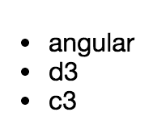
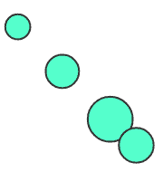
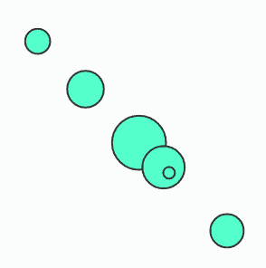

# 使用 D3 和 Angular 实现自定义数据可视化

> 原文：[`developer.ibm.com/zh/tutorials/wa-custom-vizualizations-angular-d3-trs/`](https://developer.ibm.com/zh/tutorials/wa-custom-vizualizations-angular-d3-trs/)

数据无处不在。知道如何处理您拥有的数据至关重要。数据可视化以一种简明、容易理解的方式将相关数据呈现给用户，可帮助他们推断趋势。

网络上有许多库可帮助您生成常见的可视化图形类型：线形图、柱形图、饼图等。但有时您需要采用一种新颖的方式来呈现数据，而且您需要自己创建这种新的可视化图形。 [D3.js](https://d3js.org/) （一种灵活的 JavaScript 库，用于对文档执行数据驱动的操作）可帮助您构建自定义可视化图形。D3.js 没有提供任何内置的可视化图形；它提供了构建模块来帮助您构造自己的可视化图形。结果通常为可伸缩矢量图形 (SVG) 格式，但完全可以将普通的旧 HTML 绑定到您的数据。

在本教程中，我将介绍如何将 D3.js 整合到您的 [AngularJS](https://angularjs.org/) 应用程序中。（我的代码使用 ECMAScript 2015 作为 JavaScript 版本，但它不是运行代码所必需的。）

> *有时您需要采用一种新颖的方式来呈现数据，而且您需要自己创建这种新的可视化图形。*

## 使用 D3 创建数据列表

这段 D3 代码将创建一个无序列表并添加 3 个列表项： `angular` 、 `d3` 和 `c3` ：

```
d3.select('body')
  .append('ul')
  .selectAll('li')
  .data(['angular', 'd3', 'c3'])
  .enter()
  .append('li')
  .text(d => d); 
```

以下是呈现的可视化结果：



## 创建基于数据加权的可视化图形

以下 D3 代码创建了一个 SVG 可视化图形，其中包含 3 个圆圈，每个圆圈的半径和偏移基于指定的值：

```
d3.select('body')
    .append('svg')
    .selectAll('circle')
    .data([1000, 10000, 250000, 15000])
    .enter()
    .append('circle')
    .attr('r', d => Math.log(d))
    .attr('fill', '#5fc')
    .attr('stroke', '#333')
    .attr('transform', (d, i) => {
        var offset = i * 20 + 2 * Math.log(d);
        return `translate(${offset}, ${offset})`;
    }); 
```

以下是可视化效果：



## 将一种可视化图形封装在 Angular 指令中

无论何时使用 Angular 处理 DOM，最好都在指令中执行操作。为自定义数据可视化创建一个 Angular 模块，这是将功能分组以供未来使用的一种不错方式。

以下这段代码创建了一个新指令，可通过将 `<bubbles></bubbles>` 添加到标记中来实例化该指令：

```
angular.module('pi.visualizations').directive('bubbles', bubbles);
function bubbles() {
    return {
        restrict: 'E',
        controller: () => {},
        bindToController: true,
        controllerAs: 'viz'
    };
} 
```

**C3**

C3.js 是一个基于 D3.js 而构建的特殊库，提供许多现成的自定义图表。C3 抽象化了我的前两个示例中的概念，通过配置和操作来生成图表。尽管可以使用封装 C3 的 Angular 模块，但它们都没有提供给我的团队的一个最新项目所需的灵活性。所以，与自定义 D3 可视化图表类似，我们将构造一个指令来处理底层 C3 API。

我使用 `bubbles` 作为指令名称，所以我可以使用来自 创建基于数据加权的可视化图形 部分的示例。此刻，该指令还没有实际完成任何操作，所以我需要添加一些实现细节。

该指令可接受一个数据点数组供可视化图形使用。我将通过 `scope` 属性将该数组添加为该指令的属性，现在，它将一个 `values` 属性绑定到控制器。同样地，因为可视化结果将是 SVG 格式，所以它还可以用作可视化模板，我通过 `template` 属性来将它设置为模板：

```
angular.module('pi.visualizations').directive('bubbles', bubbles);
function bubbles() {
    return {
        scope: {
            values: '='
        },
        template: '<svg width="900" height="300"></svg>',
        restrict: 'E',
        controller: () => {},
        bindToController: true,
        controllerAs: 'viz'
    };
} 
```

该指令的 `link` 函数是使用 D3 生成图表的地方。

## 自定义您的可视化图形

您可以将任何东西放入 `link` 函数中 — 但该代码对 Angular 没有明确依赖性，所以将可视化逻辑构建为一个独立组件可能更有利。此方法推崇松散耦合的理念，而且它使此可视化图形可用于其他可能未使用 Angular 的项目。

在该示例中，我使用 [CommonJS](http://www.commonjs.org/) 包含一个负责呈现可视化图形的类：

```
// There is a dependency on d3 for the visualization
var d3 = require('d3');

// A class that renders values on a logarithmic scale
function Bubbles(target) {
    this.target = target;
}

// Does the work of drawing the visualization in the target area
Bubbles.prototype.render = function (values) {
    d3.select(this.target)
        // Get the old circles
        .selectAll('circle')
        .data(values)
        .enter()
        // For each new data point, append a circle to the target SVG
        .append('circle')
        // Apply several style attributes to the circle
        .attr('r', d => Math.log(d))
        .attr('fill', '#5fc')
        .attr('stroke', '#333')
        .attr('transform', (d, i) => {
            // This moves the circle based on its value
            var offset = i * 20 + 2 * Math.log(d);
            return `translate(${offset},${offset})`;
    });
};

// Does any cleanup for the visualization (e.g., removing event listeners)
Bubbles.prototype.destroy = function () {}

// Exports the visualization
module module.exports = Bubbles; 
```

要使用该类：

```
var Bubbles = require('./Bubbles');
// The target SVG element
var svg = document.getElementById('my-visualization');
var visualization = new Bubbles(svg);
visualization.render([1000, 25000, 3000000, 120000, 25, 10203]); 
```

## 将该类放入指令中

我有一个创建 SVG 的指令和一个呈现该数据的类。现在需要将它们绑在一起。前面已经提到，此工作在指令的 `link` 函数中完成：

```
angular.module('pi.visualizations').directive('bubbles', bubbles);
function bubbles() {
    return {
        scope: {
            values: '='
        },
        template: '<svg width="900" height="300"></svg>',
        restrict: 'E',
        controller: () => {},
        bindToController: true,
        controllerAs: 'viz',
        link: function (scope, element, attrs, ctrl) {
            // Bring in the Bubbles class
            var Bubbles = require('./Bubbles');
            // Create a Bubbles visualization, targeting the SVG element from the template
            var visualization = new Bubbles(element.find('svg')[0]);
            // Watch for any changes to the values array, and when it changes, re-render the chart
            scope.$watchCollection(() => ctrl.values, () => {
                visualization.render(ctrl.values ? ctrl.values : []);
            });
            scope.$on('$destroy', () => {
                // If we have anything to clean up when the scope gets destroyed
                visualization.destroy();
            });
        }
    };
} 
```

下面这段代码将在应用程序中呈现该可视化图形：

```
<bubbles values="[1000, 25000, 3000000, 120000, 25, 10203]"></bubbles> 
```



## 规划未来：Angular 2

Angular 2 建立了一种开发组件的新方式。一些方面可能对您很熟悉，但其他方面则截然不同。最终，您可以按照我展示的相同流程，在您的 Angular 2 应用程序中生成可重用的数据可视化图形。本节中的代码使用了 TypeScript，这是 Angular 2 选择的一种流行语言。

跟以前一样，我将特定于 Angular 的代码与可视化代码分离到不同的模块中，将可视化代码放在 bubbles.chart.ts 中。从功能上讲，TypeScript 与普通的 JavaScript 代码没有多少区别：

```
// There is a dependency on d3 for the visualization; can be included as
// <script src="http://d3js.org/d3.v2.js"></script>
declare var d3;

// Exports the visualization module
export class BubblesChart {
    target: HTMLElement;
    constructor(target: HTMLElement) {
        this.target = target;
    }

    render(values: number[]) {
        d3.select(this.target)
        // Get the old circles
        .selectAll('circle')
        .data(values)
        .enter()
        // For each new data point, append a circle to the target SVG
        .append('circle')
        // Apply several style attributes to the circle
        .attr('r', d => Math.log(d))
        .attr('fill', '#5fc')
        .attr('stroke', '#333')
        .attr('transform', (d, i) => {
                // This moves the circle based on its value
                var offset = i * 20 + 2 * Math.log(d);
                return `translate(${offset}, ${offset})`;
        });
    }

    destroy() {
    }
} 
```

最大的挑战是，Angular 2 包含多个指令分类。在这里，我需要一个 *组件指令* ，因为它是一个具有模板的指令。此组件位于 bubbles.component.ts 中：

```
// Loads some required modules from Angular.
import {Component, Input, OnChanges, AfterViewInit, ViewChild} from '@angular/core';
// Loads the code needed to manipulate the visualization
import {BubblesChart} from './bubbles.chart';

// Identifies the class as a component directive that will be associated
// with `bubbles` elements in the DOM, and will include the specified markup as its template
@Component({
    selector: 'bubbles',
    template: '<svg #target width="900" height="300"></svg>'
})
export class Bubbles implements OnChanges, AfterViewInit {
  // Declares values as a data-bound property
    @Input() values: number[];
  // Gets a reference to the child DOM node
    @ViewChild('target') target;
  // An instance of the BubblesChart
    chart: BubblesChart;

    constructor() {
    }

  // Lifecycle hook that is invoked when data-bound properties change
    ngOnChanges(changes) {
        if (this.chart) {
            this.chart.render(changes.values);
        }
    }

  // Lifecycle hook for when the component's view has been fully initialized
    ngAfterViewInit() {
    // We have to wait until the view has been initialized before we can get the
    //DOM element to bind the chart to it
        this.chart = new BubblesChart(this.target.nativeElement);
        this.chart.render(this.values);
    }

} 
```

在 Angular 2 中，要将一个组件包含在另一个组件中，必须将它添加到包含组件的元数据的 `directives` 数组属性中。下面的代码实现将在 `my-app` 组件中呈现气泡图：

```
import {Component} from '@angular/core';
import {Bubbles} from './bubbles/bubbles.component';

@Component({
    selector: 'my-app',
    template: '<bubbles [values]="[1000, 25000, 3000000, 120000, 25, 10203]"></bubbles>',
  directives: [Bubbles]
})
export class MyApp {
  constructor() {
  }
} 
```

## 结束语

我介绍了一个使用 D3.js 和 Angular （Angular 2） 创建可重用、自定义的数据可视化图形的简单示例。在此基础上，您可以向您的指令添加更多属性，对可视化进行更多的配置，然后更新 `render` 函数，使其能够准确地表示提供给它的数据集。

本文翻译自：[Use D3 and Angular for custom data visualizations](https://developer.ibm.com/tutorials/wa-custom-vizualizations-angular-d3-trs/)（2016-05-26）