# 使用 Angular 2 实现单页应用程序

> 原文：[`developer.ibm.com/zh/tutorials/wa-implement-a-single-page-application-with-angular2/`](https://developer.ibm.com/zh/tutorials/wa-implement-a-single-page-application-with-angular2/)

由于具有实现更高性能的浏览器和智能电话应用程序的潜力，单页应用程序 (SPA) 技术在软件行业引起了广泛的兴趣。在过去 5 年多的时间里，开发人员对 [Angular](https://angular.io/) （一个开源 SPA 框架）的兴趣远超他们对其他 Web 框架（React、Backbone、Meteor 和 Ember）的兴趣，这从 StackOverflow 网站上针对每种 Web 框架的问题数量上可以判断出：

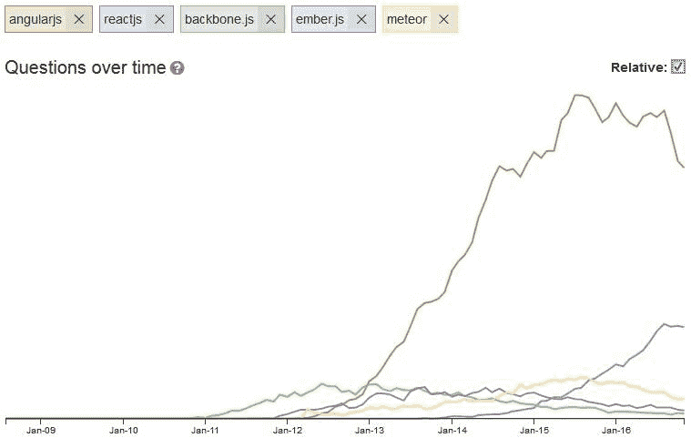

（图像来源：[tag-trends](http://sotagtrends.com/?tags=[angularjs,reactjs,backbone.js,ember.js,meteor]&relative=true) ）

Web 和移动开发人员非常喜欢 Angular 2（2016 年 9 月发布）。Angular 2 不是 Angular 1 的一次升级，而是一个全新的、不同的、更高级的框架。精通 Angular 2 已成为构建高性能、可扩展、稳健、现代的跨平台应用程序的一种很吃香的技能。

**TypeScript**

Angular 2 支持 JavaScript、Dart 和 TypeScript。您将使用 [TypeScript](https://www.typescriptlang.org/) 作为本教程的项目的开发语言。该框架构建于 TypeScript 之上，大多数有关 Angular 的文档、图书和教程都侧重于将 TypeScript 作为开发语言。

本教程将介绍 Angular 2 中的重要构建块，演示如何在开发环境和沙箱服务器中使用 Angular 2 编写和运行 SPA。要充分掌握本教程，您需要具有一定的 Web 编程经验，包括 JavaScript、TypeScript 和 HTML 的各方面知识。无需提前拥有 Angular 经验。练习完示例项目后，您就会为使用 Angular 2 创建自己的 SPA 做好充足的准备。

[获得沙箱应用示例代码](http://public.dhe.ibm.com/software/dw/library/wa-impement-a-single-page-application-with-angular2/dw_ng2_app_for_sandbox.zip)

## 为什么使用 SPA 和 Angular 2？

在用户启动 SPA 时，该应用程序仅呈现来自服务器的一个 HTML 页面。除了这个 HTML 页面，服务器还会向客户端发送一个应用程序引擎。该引擎控制整个应用程序，包括 HTML 页面的处理、输入、输出、绘制和加载。通常，90–95% 的应用程序代码是在浏览器中运行；当用户需要新数据时或必须执行身份验证等安全操作时，就会在服务器中运行剩余代码。由于几乎消除了对服务器的依赖，所以 SPA 能在 Angular 2 环境中自动扩展：无论有多少用户同时访问服务器，在 90–95% 的时间里，应用程序的性能绝不会受到影响。

另外，因为大部分负载都在客户端上运行，所以服务器在大部分时间里都处于空闲状态。对服务器资源的低需求显著减少了服务器上的压力，也潜在地降低了服务器成本。

Angular 2 的另一个优势是，它可以帮助 SPA 有效地使用微服务。

> *通常，90–95% 的 SPA 代码在浏览器中运行；当用户需要新数据或必须执行身份验证等安全操作时，就会在服务器中运行剩余代码。*

## Angular 2 概念

Angular 2 中的关键概念包括：

*   [模块](https://angular.io/docs/ts/latest/guide/architecture.html#modules)
*   [组件](https://angular.io/docs/ts/latest/guide/architecture.html#components)
*   [服务](https://angular.io/docs/ts/latest/guide/architecture.html#services)
*   [路由](https://angular.io/docs/ts/latest/guide/router.html)

从现在开始，我将 Angular 2 简称为 Angular。

### 模块

Angular 应用程序是模块化的。每个 Angular 应用程序拥有至少一个 *模块* ，即根模块，传统上将其命名为 `AppModule` 。根模块可以是小型应用程序中唯一的模块，但大多数应用程序都拥有更多的模块。作为开发人员，您需要决定如何使用模块概念。通常，会将主要功能或特性映射到一个模块。假设您的系统中有 5 个主要区域。除了根模块之外，每个区域都将拥有自己的模块，总计 6 个模块。

### 组件

*组件* 控制页面的一片区域，该区域被称为 *视图* 。您定义组件的应用程序逻辑 — 它如何支持类中的视图。类通过属性和方法的 API 与视图交互。一个组件包含一个类、一个模板和元数据。模板是一个 HTML 表单，用于告诉 Angular 如何呈现组件。一个组件只能属于一个模块。

### 服务

*服务* 提供应用程序所需的任何值、功能或特性。服务通常是一个具有明确定义的较小用途的类；它应高效地执行具体的操作。组件大量使用服务。服务大量使用微服务。

### 路由

*路由* 支持在用户执行应用程序任务时，从一个视图导航到下一个视图。路由等效于用于控制菜单和子菜单的机制。

了解 SPA 的优势并掌握 Angular 概念后，是时候在示例项目上开始实践了。

## 需要做的准备工作

要完成示例项目，您需要在开发 PC 上安装 [Node.js](https://nodejs.org/en/) 和 [Angular CLI](https://cli.angular.io/) （一个用于 Angular 的命令行接口）：

*   安装 Node.js：

    1.  [下载](https://nodejs.org/en/) 适合您的系统的版本，选择默认选项来完成安装。
    2.  从操作系统命令行运行 `node -v` 来验证版本号 — 在我的情况下，版本为 `v6.9.1` 。Node Package Manager (NPM) 会随 Node 自动安装。键入 `npm -v` 来查看它的版本号。当您安装来自公共 NPM 存储库的包时，会在后台运行 NPM。一个常见的 NPM 命令是 `npm install` ，它用于下载您的 Angular 项目的 package.json 文件 文件中列出的包版本。
*   安装 Angular CLI：

    1.  运行 `npm install -g angular-cli@1.0.0-beta.21` 来安装我用于示例应用程序的版本（在编写本文时，仍处于公测阶段）。（如果您想尝试一个不同的编译版，可访问 [CLI 站点](https://github.com/angular/angular-cli/releases) 。）需要花约 10 分钟才能完成安装。
    2.  成功完成安装后，在操作系统命令行上键入 `ng -v` ，以查看您的 CLI 版本号 — 在我的操作系统下：

        `angular-cli: 1.0.0-beta.21 node: 6.9.1 os: win32 x64`如果您需要获得有关 `ng` 语法的帮助，可在操作系统命令行上键入 `ng help` 。

## package.json 文件

package.json 文件（Angular 应用程序中一个关键的元数据文件）包含应用程序和它的依赖包的细节。此文件是 Angular 应用程序中最重要的文件，尤其是在将代码从一台计算机迁移到另一台时，或者是在升级期间。package.json 文件包含需要安装的包版本。

您无需为适合本教程练习的 package.json 感到担心。但在开发生产级应用程序时，必须多多留意此文件中列出的版本号。

以下是来自一个 package.json 文件的一些有效语句：

```
{ "dependencies" :
  { "foo" : "1.0.0 - 2.9999.9999"
  , "bar" : ">=1.0.2 <2.1.2"
  , "baz" : ">1.0.2 <=2.3.4"
  , "boo" : "2.0.1"
  , "qux" : "<1.0.0 || >=2.3.1 <2.4.5 || >=2.5.2 <3.0.0"
  , "til" : "¹.2"
  , "elf" : "~1.2.3"
  , "two" : "2.x"
  , "thr" : "3.3.x"
  , "lat" : "latest"
  }
} 
```

`npm install` 命令对冒号右侧的部分语句的解释如下（其中 *版本* 表示所使用的版本号）：

*   “*版本*“:必须与 *版本* 准确匹配
*   “> *版本*“:必须大于 *版本*
*   “~ *版本*“:约等于 *版本*
*   “^ *版本*“:兼容 *版本*
*   “1.2.x”:1.2.0、1.2.1 等，但不能是 1.3.0
*   “*” :匹配任何 *版本*
*   “”（空字符串）”:与 `*` 相同
*   “*版本 1* –*版本 2*“:与 “>= *版本 1* <= *版本 2*” 相同

要进一步了解 package.json，可在操作系统命令行上键入 `npm help package.json` ，以便在浏览器中查看帮助内容。

## 示例项目概述

示例项目包含一个开箱即用的 Angular 应用程序，以及您将在开箱即用的应用程序上开发的一个自定义应用程序。当您完成上述操作后，您将拥有一个包含 3 个微型应用程序的 Angular 应用程序，每个微型应用程序中的特性使用了 3 个 Web 服务 API：

*   [来自雅虎的天气组件](https://developer.yahoo.com/weather/)
*   [货币兑换](http://fixer.io/)
*   [电影细节](http://www.programmableweb.com/api/omdb)

所有应用程序逻辑都将在您的浏览器中运行。仅在浏览器需要新数据时，才需要服务器。事实上，您可以关闭服务器进程，它仍会在您的应用程序中工作，因为它是一个 SPA。

下图显示了应用程序拓扑结构：

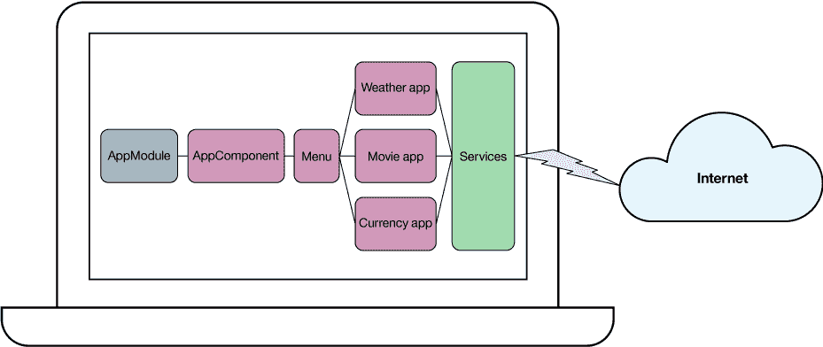

您将使用 Angular CLI 创建您的项目（该项目默认情况下会包含 `AppModule` 和 `AppComponent` ）和 4 个自定义组件：

*   菜单组件
*   天气组件
*   电影组件
*   货币组件

您将创建用于菜单导航的路由，并将以下服务注入到天气、电影和货币组件中：

*   来自使用微服务的 HTTP 的数据
*   在使用这些服务时跨组件的资源共享

## 创建基础应用程序和模块

准备好开始了吗？首先在操作系统命令行上转到您想放置项目目录的位置。

### 创建一个 Angular 项目

运行下面的命令来生成一个新 Angular 项目（其中 `dw_ng2_app` 是项目名称）：

```
ng new dw_ng2_app --skip-git 
```

安装所有需要的包和 Angular 基础应用程序（这将花费大约 10 分钟时间）后，您将返回到操作系统命令提示符上。如果您随后列出 /dw_ng2_app 目录的内容，就可以看到项目结构：

```
| e2e
| node_modules
| src
angular-cli.json
karma.conf.js
package.json
protractor.conf.js
README.md
tslint.json 
```

../dw_ng2_app/src 目录的内容包括：

```
| app
| assets
| environments
favicon.ico
index.html
main.ts
polyfills.ts
styles.css
test.ts
tsconfig.json
typings.d.ts 
```

../dw*ng2_app/src/app 目录（* 根模块文件夹 _ ）包含以下文件：

```
app.component.css
app.component.html
app.component.spec.ts
app.component.ts
app.module.ts
index.ts 
```

### 运行开箱即用的 Angular 应用程序

更改到项目目录，运行 `ng serve` 来启动开箱即用的 Angular 应用程序。

默认情况下，该进程在端口 4200 上启动。如果您的 `port` 系统环境变量的值不是 4200，该进程将在此端口上启动。您可以运行 `ng serve --port 4200` 命令来覆盖默认端口号，这是一项可选操作。

打开您的浏览器并输入 URL `http://localhost:4200/` 。您的 Angular 应用程序会显示 **app works!** ，这表明应用程序已启动、运行并准备就绪：

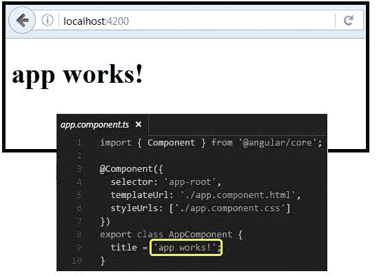

如果在应用程序运行过程中更改代码，Angular 会非常智能地监视并自动重新启动应用程序。尝试编辑 app.component.ts 文件，更改 `title` 的值。您可以看到，您的浏览器页面反映了这一更改：

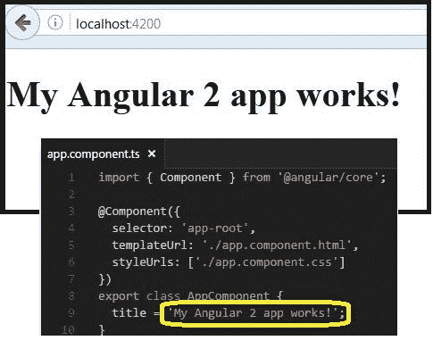

### 如何将模块链接到组件

在清单 1 中，第 20 行显示了 `AppModule` 模块的声明。

##### 清单 1\. app.module.ts

```
import { BrowserModule } from '@angular/platform-browser';
import { NgModule } from '@angular/core';
import { FormsModule } from '@angular/forms';
import { HttpModule } from '@angular/http';

import { AppComponent } from './app.component';

@NgModule({
  declarations: [
    AppComponent
  ],
  imports: [
    BrowserModule,
    FormsModule,
    HttpModule
  ],
  providers: [],
  bootstrap: [AppComponent]
})
export class AppModule { } 
```

此模块仅包含一个组件 — `AppComponent` — 如上第 10 行所示。第 18 行表明，在引导进程下启动的第一个组件是 `AppComponent` 。

### 组件内部结构

清单 2 给出了 app.component.ts 文件中的主要应用程序组件的内容。

##### 清单 2\. app.component.ts

```
import { Component } from '@angular/core';

@Component({
  selector: 'app-root',
  templateUrl: './app.component.html',
  styleUrls: ['./app.component.css']
})
export class AppComponent {
  title = 'My Angular 2 app works!';
} 
```

这是 app.component.html 文件中的主要应用程序组件的内容：

```
<h1>
  {{title}}
</h1> 
```

### 元数据位置

元数据告诉 Angular 如何处理类。事实上，在您通过向 `AppComponent` 附加元数据给类时，告诉 Angular 它还不是组件。

可以使用 `@Component` 修饰器附加元数据，这会将类标识为组件。 `@Component` 修饰器接受一个必需的配置对象，该对象包含 Angular 创建和呈现该组件和它的视图所需的信息。

清单 2 中的代码使用可用的 `@Component` 配置选项中的 3 个选项：

*   `selector` ：一个 CSS 选择器，告诉 Angular 在父 HTML 文件中找到 `selector` 标记的地方创建和插入此组件的一个实例
*   `templateUrl` ：组件的 HTML 文件
*   `styleUrls` ：组件的样式表，比如 .css 文件

### 组件内的模板位置

模板是一个 HTML 表单，用于告诉 Angular 如何呈现组件。在 清单 2 的第 5 行上， `templateUrl` 指向一个名为 `app.component.html` 的视图。

### 组件内的数据绑定

数据绑定是一个 HTML 表单，用于告诉 Angular 如何呈现组件。在 app.component.ts 文件中， `title` 的值在类内设置，在 app.component.html 文件中使用。数据绑定可以是单向或双向的。在本例中，如果您在双花括号 `{{ }}` 内提及该变量，则该映射是单向的。值从类传递到 HTML 文件。

## 创建自定义组件和路由

此刻，您的 Angular 应用程序已准备就绪并能工作正常。这个基础应用程序有一个模块、一个组件、一个类、一个模板、元数据和数据绑定 — 但它仍缺少 4 个其他的重要部分：

*   多个组件
*   路由
*   服务
*   微服务的使用

接下来，您将创建这些自定义组件。

### 创建自定义组件

按 Ctrl-C 停止 Angular 进程（确保您在 Angular 项目的目录中，在本例中为 dw_ng2_app）。在命令提示符下，运行以下命令：

*   `ng g c Menu -is --spec false --flat` ：在 `AppModule` 根模块（同一个文件夹中）内创建 `Menu` 组件。
*   `ng g c Weather -is --spec false` ：在 `AppModule` 根模块内名为 weather 的子文件夹中创建 `Weather` 组件。
*   `ng g c Currency -is --spec false` ：在 `AppModule` 根模块内名为 currency 的子文件夹中创建 `Currency` 组件。
*   `ng g c Movie -is --spec false` ：在 `AppModule` 根模块内名为 movie 的子文件夹中创建 `Movie` 组件。

现在，有了创建的新组件 — 包括类、元数据和模板 — 您可以看到 `AppModule` 如何链接到这些组件。在清单 3 中，第 28 行包含 `AppModule` 模块的声明。此模块包含 5 个组件，包括根组件和其他 4 个组件，如第 14–18 行所示。

##### 清单 3\. app.module.ts

```
import { BrowserModule } from '@angular/platform-browser';
import { NgModule } from '@angular/core';
import { FormsModule } from '@angular/forms';
import { HttpModule } from '@angular/http';

import { AppComponent } from './app.component';
import { MenuComponent } from './menu.component';
import { WeatherComponent } from './weather/weather.component';
import { CurrencyComponent } from './currency/currency.component';
import { MovieComponent } from './movie/movie.component';

@NgModule({
  declarations: [
    AppComponent,
    MenuComponent,
    WeatherComponent,
    CurrencyComponent,
    MovieComponent
  ],
  imports: [
    BrowserModule,
    FormsModule,
    HttpModule
  ],
  providers: [],
  bootstrap: [AppComponent]
})
export class AppModule { } 
```

### 创建路由

##### 路由创建命令

我在这里提供了手动创建路由的操作说明。截至编写本文时，创建路由的 CLI 命令正在开发之中。您可以查阅 [CLI 网站](https://cli.angular.io/)，看看它现在是否可用。

要让 Angular 能在组件之间导航，需要创建 *路由* 。使用清单 4 的内容覆盖 menu.component.html 文件，以便 HTML 包含所有组件的正确菜单。

##### 清单 4\. menu.component.html

```
<div class="row">
   <div class="col-xs-12">
    <ul class="nav nav-pills">
     <li routerLinkActive="active"> <a [routerLink]="['/weather']" >Weather</a></li>
     <li routerLinkActive="active"> <a [routerLink]="['/movie']" >Movie Details</a></li>
     <li routerLinkActive="active"> <a [routerLink]="['/currency']" >Currency Rates</a></li>
    </ul>
  </div>
 </div> 
```

清单 4 中的代码提供了 GUI 与 URL 路径之间的映射。例如，当用户单击 GUI 中的 Movie Details 按钮时，Angular 知道它需要像 URL 路径为 `http://localhost:4200/movie` 一样运行。

接下来，将 URL 路径映射到组件。在根模块的相同文件夹中，创建一个名为 app.routing.ts 的配置文件，使用清单 5 中的代码作为其内容。

##### 清单 5\. app.routing.ts

```
import { Routes, RouterModule } from '@angular/router';
import { CurrencyComponent } from "./currency/currency.component";
import { WeatherComponent } from "./weather/weather.component";
import { MovieComponent } from "./movie/movie.component";
const MAINMENU_ROUTES: Routes = [
    //full : makes sure the path is absolute path
    { path: '', redirectTo: '/weather', pathMatch: 'full' },
    { path: 'weather', component: WeatherComponent },
    { path: 'movie', component: MovieComponent },
    { path: 'currency', component: CurrencyComponent }
];
export const CONST_ROUTING = RouterModule.forRoot(MAINMENU_ROUTES); 
```

在本例中，如果您的 URL 相对路径是 `movie` ，则会告诉 Angular 调用 `MovieComponent` 组件。换句话说，相对路径 `movie` 映射到 URL `http://localhost:4200/movie` 。

现在，您需要将此视图链接到它的父组件。使用以下代码覆盖 app.component.html 文件内容：

```
<div class="container">
 <app-menu></app-menu>
 <hr>
 <router-outlet></router-outlet>
</div> 
```

`<app-menu></app-menu>` 选择器会包含菜单。 `<router-outlet></router-outlet>` 选择器是当前组件的占位符。根据 URL 路径，该值可以是以下 3 个组件中的任意一个：天气、电影或货币。

您还必须向该模块告知此路由。在 app.module.ts 文件中添加两项，如清单 6 中的第 11 和 25 行所示。

##### 清单 6\. app.module.ts

```
import { BrowserModule } from '@angular/platform-browser';
import { NgModule } from '@angular/core';
import { FormsModule } from '@angular/forms';
import { HttpModule } from '@angular/http';

import { AppComponent } from './app.component';
import { MenuComponent } from './menu.component';
import { WeatherComponent } from './weather/weather.component';
import { CurrencyComponent } from './currency/currency.component';
import { MovieComponent } from './movie/movie.component';
import { CONST_ROUTING } from './app.routing';

@NgModule({
  declarations: [
    AppComponent,
    MenuComponent,
    WeatherComponent,
    CurrencyComponent,
    MovieComponent
  ],
  imports: [
    BrowserModule,
    FormsModule,
    HttpModule,
    CONST_ROUTING
  ],
  providers: [],
  bootstrap: [AppComponent]
})
export class AppModule { } 
```

现在，如果您运行应用程序并单击 **Weather** 链接，应用程序将会显示 **weather works!** ：

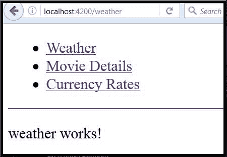

如果单击 **Movie Details** 链接，应用程序会显示 **movie works!** ：

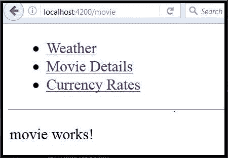

如果单击 **Currency Rates** 链接，应用程序将会显示 **currency works!** ：

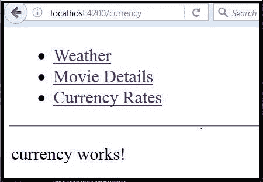

您已成功修改了您的 Angular 应用程序，以便包含多个自定义组件和路由。现在您已经准备好执行最后两个重要操作：

*   创建和配置服务
*   使用微服务

## 创建服务

按下 Ctrl-C 停止 Angular 进程。运行下面的命令：

```
ng g service Shared --spec false 
```

此命令在根模块文件夹中的 shared.service.ts 文件中创建该服务：

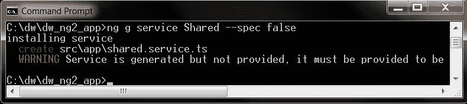

将 shared.service.ts 的内容替换为清单 7 中的代码。

##### 清单 7\. shared.service.ts

```
import { Injectable } from '@angular/core';
import { Http, Headers, Response } from "@angular/http";
import 'rxjs/Rx';
import { Observable } from "rxjs";

@Injectable()
export class SharedService {
    weatherURL1 = "https://query.yahooapis.com/v1/public/yql?q=select%20*%20from%20weather.forecast%20where%20woeid%20in%20(select%20woeid%20from%20geo.places(1)%20where%20text%3D%22";
    weatherURL2 = "%2C%20";
    weatherURL3 = "%22)&format=json&env=store%3A%2F%2Fdatatables.org%2Falltableswithkeys";
    findMovieURL1 = "http://www.omdbapi.com/?t=";
    findMovieURL2 = "&y=&plot=short&r=json";
    currencyURL = "http://api.fixer.io/latest?symbols=";
    totReqsMade: number = 0;
    constructor(private _http: Http) { }

    findWeather(city, state) {
        this.totReqsMade = this.totReqsMade + 1;
        return this._http.get(this.weatherURL1 + city + this.weatherURL2+ state + this.weatherURL3)
            .map(response => {
                { return response.json() };
            })
            .catch(error => Observable.throw(error.json()));
    }

    findMovie(movie) {
        this.totReqsMade = this.totReqsMade + 1;
        return this._http.get(this.findMovieURL1 + movie + this.findMovieURL2)
            .map(response => {
                { return response.json() };
            })
            .catch(error => Observable.throw(error.json().error));
    }

    getCurrencyExchRate(currency) {
        this.totReqsMade = this.totReqsMade + 1;
        return this._http.get(this.currencyURL + currency)
            .map(response => {
                { return response.json() };
            })
            .catch(error => Observable.throw(error.json()));
    }
} 
```

清单 7 中的 `import ...` 语句是任何服务正常运行所必不可少的。 `@Injectable()` 语句特别重要；它表明此 `service` 可注入到其他组件中 — 该技术通常被称为 *依赖注入* 。

`totReqsMade` 变量在这里声明，将用于在 3 个组件之间传递它的值。这将跟踪为获得微服务结果而发出的服务请求总数。

您有 3 个方法，它们的名称表明了自己的功能： `findWeather()` 、 `findMovie()` 和 `getCurrencyExchRate()` 。在方法执行期间，您的 Angular 应用程序将让浏览器访问网络来使用微服务。现在您将把组件链接到所创建的服务。

将 movie.component.ts 文件内容替换为清单 8 中的代码。

##### 清单 8\. movie.component.ts

```
import { Component, OnInit } from '@angular/core';
import { SharedService } from "./../shared.service";

@Component({
  selector: 'app-movie',
  templateUrl: './movie.component.html',
  styles: []
})
export class MovieComponent implements OnInit {
    id_movie: string = "";
    mv_Title: string = "";
    mv_Rated: string = "";
    mv_Released: string = "";
    mv_Director: string = "";
    mv_Actors: string = "";
    mv_Plot: string = "";
    constructor(private _sharedService: SharedService) {
    }

    ngOnInit() {
    }

    callMovieService() {
        this._sharedService.findMovie(this.id_movie)
            .subscribe(
            lstresult => {
                this.mv_Title = lstresult["Title"];
                this.mv_Rated = lstresult["Rated"];

                this.mv_Released = lstresult["Released"];
                this.mv_Director = lstresult["Director"];
                this.mv_Actors = lstresult["Actors"];
                this.mv_Plot = lstresult["Plot"];
            },
            error => {
                console.log("Error. The findMovie result JSON value is as follows:");
                console.log(error);
            }
            );
    }
} 
```

这个重要的代码端调用服务方法来获取新数据。在本例中，它调用 `callMovieService()` ，然后调用 `this._sharedService.findMovie()` 方法。

类似地，将 currency.component.ts 文件内容替换为清单 9 中的代码。

##### 清单 9\. currency.component.ts

```
import { Component, OnInit } from '@angular/core';
import { SharedService } from "./../shared.service";

@Component({
  selector: 'app-currency',
  templateUrl: './currency.component.html',
  styles: []
})
export class CurrencyComponent implements OnInit {

  id_currency: string = "";
  my_result: any;
  constructor(private _sharedService: SharedService) {
  }

  ngOnInit() {
  }

  callCurrencyService() {
    this._sharedService.getCurrencyExchRate(this.id_currency.toUpperCase())
      .subscribe(
      lstresult => {
                this.my_result = JSON.stringify(lstresult);
      },
      error => {
        console.log("Error. The callCurrencyService result JSON value is as follows:");
        console.log(error);
      }
      );
  }
} 
```

将 weather.component.ts 文件内容替换为清单 10 中的代码。

##### 清单 10\. weather.component.ts

```
import { Component, OnInit } from '@angular/core';
import { SharedService } from "./../shared.service";

@Component({
  selector: 'app-weather',
  templateUrl: './weather.component.html',
  styles: []

})
export class WeatherComponent implements OnInit {
  id_city: string = "";
  id_state: string = "";
  op_city: string = "";
  op_region: string = "";
  op_country: string = "";
  op_date: string = "";
  op_text: string = "";
  op_temp: string = "";
  constructor(private _sharedService: SharedService) {
  }

  ngOnInit() {
  }

  callWeatherService() {
    this._sharedService.findWeather(this.id_city, this.id_state)
      .subscribe(
      lstresult => {
        this.op_city = lstresult["query"]["results"]["channel"]["location"]["city"];
        this.op_region = lstresult["query"]["results"]["channel"]["location"]["region"];
        this.op_country = lstresult["query"]["results"]["channel"]["location"]["country"];
        this.op_date = lstresult["query"]["results"]["channel"]["item"]["condition"]["date"];
        this.op_text = lstresult["query"]["results"]["channel"]["item"]["condition"]["text"];
        this.op_temp = lstresult["query"]["results"]["channel"]["item"]["condition"]["temp"];
      },
      error => {
        console.log("Error. The findWeather result JSON value is as follows:");
        console.log(error);
      }
      );
  }
} 
```

现在，更新该模块以包含这些服务。编辑 app.module.ts 文件，以包含清单 11 的第 12 和 28 行的两条语句。

##### 清单 11\. app.module.ts

```
import { BrowserModule } from '@angular/platform-browser';
import { NgModule } from '@angular/core';
import { FormsModule } from '@angular/forms';
import { HttpModule } from '@angular/http';

import { AppComponent } from './app.component';
import { MenuComponent } from './menu.component';
import { WeatherComponent } from './weather/weather.component';
import { CurrencyComponent } from './currency/currency.component';
import { MovieComponent } from './movie/movie.component';
import { CONST_ROUTING } from './app.routing';
import { SharedService } from "./shared.service";

@NgModule({
  declarations: [
    AppComponent,
    MenuComponent,
    WeatherComponent,
    CurrencyComponent,
    MovieComponent
  ],
  imports: [
    BrowserModule,
    FormsModule,
    HttpModule,
    CONST_ROUTING
  ],
  providers: [SharedService],
  bootstrap: [AppComponent]
})
export class AppModule { } 
```

## 修改组件视图

现在还剩难题的最后一部分。您需要告诉 HTML 文件调用正确的服务方法。为此，请将 movie.component.html 文件的内容替换为清单 12 中的代码。

##### 清单 12\. movie.component.html

```
<h2>Open Movie Database</h2>
<div class="col-md-8 col-md-offset-2">
 <div class="form-group">
  <input type="text" required [(ngModel)]="id_movie" (change)="callMovieService()" class="form-control" placeholder="Enter Movie name ...">
  <br><br>
  <h3>Movie Details</h3>
  <br>
  <p class="well lead">
      <i> Title :</i> {{ this.mv_Title }} <br>
      <i> Plot :</i> {{ this.mv_Plot }} <br>
      <i> Actors :</i> {{ this.mv_Actors }} <br>
      <i> Directed by :</i> {{ this.mv_Director }} <br>
      <i> Rated :</i> {{ this.mv_Rated }} <br>
      <i> Release Date :</i> {{ this.mv_Released }} <br>
  </p>
  <p class="text-info">Total # of all the service requests including Weather, Movie, and Currency is :
      <span class="badge">{{this._sharedService.totReqsMade}}</span>
  </p>
 </div>
</div> 
```

movie.component.html 中编码了一些重要的信息：

*   `{{ this._sharedService.totReqsMade }}` ：这是在服务级别上跟踪的值，它会在所有 3 个应用程序组件之间共享。
*   `[(ngModel)]="id_movie"` ：用户输入的 GUI 输入被传递到调用此 HTML 的类。在本例中，该类为 `MovieComponent` 。
*   `(change)="callMovieService()`“：当此字段值更改时，就会告诉系统调用 movie.component.ts 文件中包含的 `callMovieService()` 方法。
*   `{{ this.mv_Title }}, {{ this.mv_Plot }}, {{ this.mv_Actors }}, {{ this.mv_Director }}, {{ this.mv_Rated }}, {{ this.mv_Released }}` ：显示从 `callMovieService() -> this._sharedService.findMovie(this.id_movie)` 执行的服务调用的结果。

将 weather.component.html 文件的内容替换为清单 13 中的代码。

##### 清单 13\. weather.component.html

```
<h2>Yahoo! Weather </h2>
<div class="col-md-8 col-md-offset-2">
 <div class="form-group">
  <input type="text" [(ngModel)]="id_city" class="form-control" placeholder="Enter City name ..."><br>
  <input type="text" [(ngModel)]="id_state" class="form-control" placeholder="Enter State. Example CA for California ..."><br>
  <button type="button" class="btn btn-primary" (click)="callWeatherService()">Submit</button>
  <br><br><br>
  <br>
  <p class="well lead">
    <i>City, State, Country :</i> {{ this.op_city }} {{ this.op_region }} {{ this.op_country }} <br>
    <i>Current Condition :</i> {{ this.op_text }} <br>
    <i>Current Temperature :</i> {{ this.op_temp }} <br>
  </p>
  <p class="text-info">Total # of all the service requests including Weather, Movie, and Currency is :
    <span class="badge">{{this._sharedService.totReqsMade}}</span>
  </p>
 </div>
</div> 
```

最后，将 currency.component.html 文件的内容替换为清单 14 中的内容。

##### 清单 14\. currency.component.html

```
<h2>Currency Exchange Rates</h2>
<div class="col-md-8 col-md-offset-2">
 <div class="form-group">
  <input type="text" [(ngModel)]="id_currency" (change)="callCurrencyService()" class="form-control" placeholder="Enter Currency Symbol. Example: GBP(,AUD,INR)...">
  <br><br>
  <h3>Rate Details</h3>
  <br>
  <p class="well lead">Exchange rate relative to Euro in a JSON format: : {{ this.my_result }} </p>
  <p class="text-info">Total # of all the service requests including Weather, Movie, and Currency is :
    <span class="badge">{{this._sharedService.totReqsMade}}</span>
  </p>
 </div>
</div> 
```

现在，如果各部分均按预期运行，应用程序可接受浏览器中的用户输入。

## 运行应用程序并改进 UI

现在运行应用程序，输入一些值，然后查看结果。例如，单击 Weather 链接，输入 `San Francisco` 来查看该城市的天气条件：

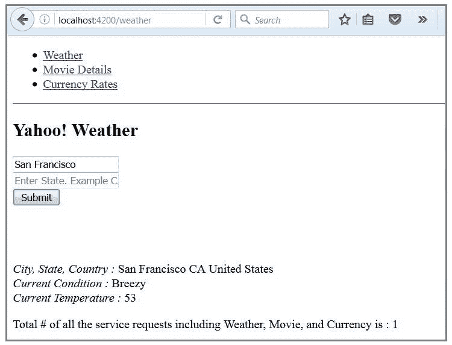

##### 测试您的新 Angular 技能

目前，您的应用程序的输入字段没有实现验证或错误处理。您可以自行尝试添加这些功能。提示：在服务中添加方法 **validateMovie(movie-name)**、**validateCurrency(currency-name)**、**validateCity(city-name)** 和 **validateState(state-name)**。然后从相应的组件调用这些方法。

一切正常，但还可以让 UI 更具吸引力。改进 GUI 的一种方法是使用 [Bootstrap](http://getbootstrap.com/) 。（ [Angular 2 资料](https://github.com/angular/material2) 是理想的选择，但截至编写本文时，它尚未正式发布）。

转到 Bootstrap [入门页面](http://getbootstrap.com/getting-started/) ，将该页的以下两行复制到剪贴板：

```
<!-- Latest compiled and minified CSS -->
<link rel="stylesheet" href="https://maxcdn.bootstrapcdn.com/bootstrap/3.3.7/css/bootstrap.min.css" integrity="sha384-BVYiiSIFeK1dGmJRAkycuHAHRg32OmUcww7on3RYdg4Va+PmSTsz/K68vbdEjh4u" crossorigin="anonymous"> 
```

打开 index.html 文件，将刚复制的语句粘贴到第 8 行下。

##### 清单 15\. index.html

```
 <!doctype html>
<html>

<head>
  <meta charset="utf-8">
  <title>DwNg2App</title>
  <base href="/">

  <!-- Latest compiled and minified CSS -->
  <link rel="stylesheet" href="https://maxcdn.bootstrapcdn.com/bootstrap/3.3.7/css/bootstrap.min.css" integrity="sha384-BVYiiSIFeK1dGmJRAkycuHAHRg32OmUcww7on3RYdg4Va+PmSTsz/K68vbdEjh4u"
    crossorigin="anonymous">

  <meta name="viewport" content="width=device-width, initial-scale=1">
  <link rel="icon" type="image/x-icon" href="favicon.ico">
</head>

<body>
  <app-root>Loading...</app-root>
</body>

</html> 
```

现在该应用程序在浏览器中看起来更加美观，拥有更容易理解的样式和菜单按钮，而不是 Weather、Movie Details 和 Currency Rates 链接：

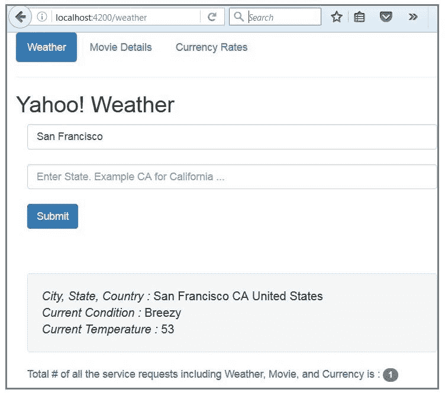

## 嵌套的 index.html

现在花一分钟时间体会一下您刚完成的应用程序为什么被称为 SPA。

当 Angular 应用程序启动时，服务器将 index.html 文件发送到浏览器，而且 index.html 是浏览器显示的唯一文件。Angular 对该页面执行的任何操作都会插入到此视图中：

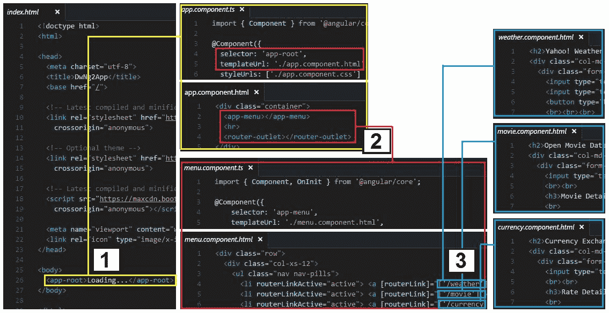

index.html 末尾的 `<app-root>` 选择器被 app.component.html 的内容所取代。app.component.html 包含两个选择器： `<app-menu>` 和 `<router-outlet>` 。 `<app-menu>` 选择器中填入 menu.component.html 的内容， `<router-outlet>` 依据菜单选项而动态填充 — 也就是说，填入 weather.component.html、currency.component.html 或 movie.component.html 的内容。

除了 Angular 保留选择器 `<router-outlet></router-outlet>` 外，所有选择器都是静态的。此选择器在运行时期间依据路由器值而填充。仅显示 index.html，您编码的其他所有 HTML 文件都嵌套在 index.html 文件内。

## 模拟服务器

您的 Angular 项目已成功在开发计算机中运行。如果您能访问远程沙箱服务器，那么可以将代码迁移到那里，看看应用程序在被用户运行时的行为。（否则，可以跳到教程的 结束语 部分。）

确保 Node.js 和 Angular CLI 已安装在远程沙箱中。压缩本地项目文件夹中的所有内容，node_modules 目录及其内容除外。将压缩后的项目文件复制到沙箱服务器并解压。转到包含 package.json 的服务器目录并运行 `npm install` 命令。package.json 文件使 `npm install` 命令能转到 NPM 公共存储库，安装所有需要的包版本。运行此命令也会自动在服务器上创建 node_modules 目录和它的内容。

运行 `ng serve` 命令，以便在沙箱服务器中启动该应用程序，就像在开发计算机中所做的一样。按下 Ctrl-C 停止该进程。同样地，如果您想了解 `ng serve` 的其他选项，可以运行 `ng help` 命令。

使用 `ng serve --port _sandbox-port#_--host _sandbox-hostname` 命令运行该应用程序。

现在 Angular 应用程序可在 URL http:// *sandbox-hostname*: *sandbox-port#* 上访问。在开发计算机浏览器中运行该 URL 上的应用程序时，在沙箱服务器上按下 Ctrl-C 停止服务器 Angular 进程。请注意，整个应用程序都在开发计算机的浏览器中运行，尽管服务器 Angular 进程已关闭。这会告诉您，SPA 技术正在运行。该应用程序加载到浏览器中后，除非应用程序需要新数据，否则控制权绝不会转交给服务器。

在 SPA 领域，浏览器就是新型的服务器。如果 10 个用户在运行该应用程序，就会有 10 个浏览器处理该负载。如果 1,000 个用户在运行该应用程序，则有 1,000 个浏览器处理该负载。整个 Angular 应用程序都在浏览器的控制之下，除了在服务器中运行的任何逻辑，比如身份验证和数据库操作。

更高的性能和服务器压力的减轻，最终会提高用户体验和用户满意度 — 这是任何企业获得成功的关键。

> *在 SPA 领域，浏览器就是新型的服务器。*

## 结束语

您学习了如何使用 Angular 2 编写一个 SPA，并在开发计算机和沙箱服务器中运行它。对于生产需求，请与您的 IT 部门协商。大多数生产应用程序拥有的一项主要功能是身份验证和授权，应在服务器中运行该功能（主要出于安全原因）。您可能需要一个专用服务器来处理这些操作。对于该服务器，可以使用 Node.js，在 Angular 2 在前端运行时，它可以充当在后端运行的服务器。（Node 和 Angular 都起源于 Google，所以它们能有效地协同运行。）

您可以考虑的用来提高应用程序性能的其他技术包括：

*   捆绑：该进程将您的许多程序组合到一个文件中。
*   微型化：压缩捆绑的文件，以便尽可能地减小项目大小。
*   提前 (AoT) 编译：服务器复杂在构建过程中提前编译，而不是浏览器在运行时期间执行即时 (JIT) 编译。

##### 致谢

感谢 IBM 的优秀员工 Guy Huinen、Dean P Cummings、Don Turner 和 Mark Shade 的评审工作和支持。

本文翻译自：[Implement a single-page application with Angular 2](https://developer.ibm.com/tutorials/wa-implement-a-single-page-application-with-angular2/)（2016-12-14）