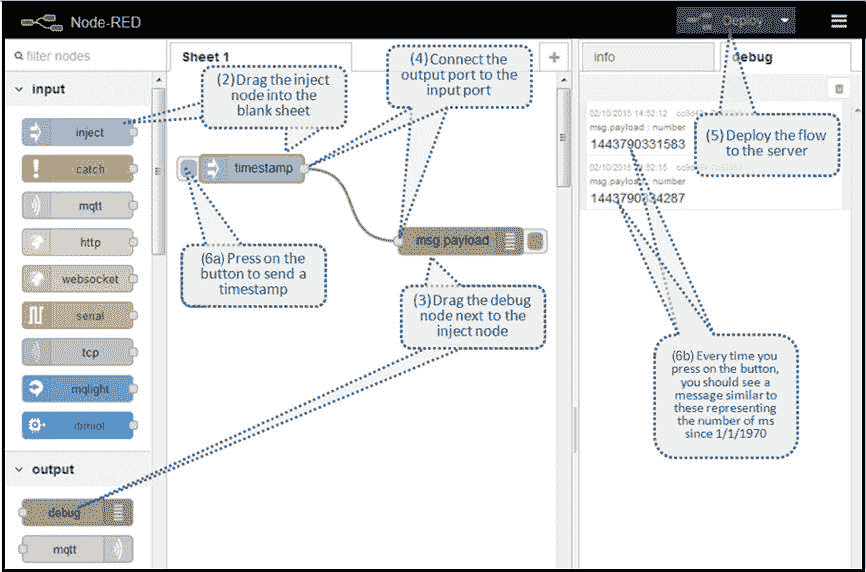
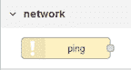
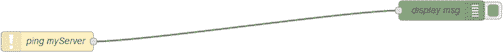
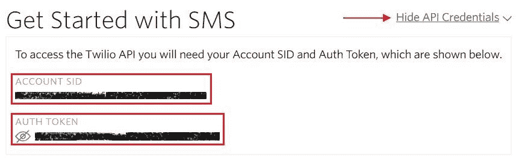
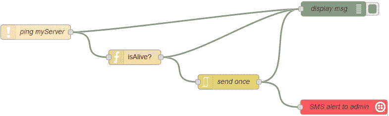

# 构建您的第一个物联网应用程序

> 原文：[`developer.ibm.com/zh/tutorials/iot-monitoring-app-node-red-bluemix-trs/`](https://developer.ibm.com/zh/tutorials/iot-monitoring-app-node-red-bluemix-trs/)

物联网（Internet of Things，IoT）代表设备和应用程序的新生态系统，人们已采用创新的方式对其进行集成，以提供智能服务。举一个简单的例子，一个具有联网功能的咖啡机，或者一台能够记录其库存内容的冰箱。虽然这些例子都是颇为流行的消费品例子，但物联网编程也同样适用于其他许多行业领域，其中包括商业、农业、科研、医疗，等等。

在下面的章节中，您将设置自己的 IBM IBM Cloud 工作区，使用 Node-RED 开发演示应用程序，并通过使用 Twilio，成功地从应用程序将一条短信发送到您的手机。

如果您准备好开始为物联网编程，本教程首先会让您构建一个物联网应用程序，如果远程用户的计算机或 IT 网络出现故障，该应用程序会自动通知用户。我们将使用以下这些技术：

*   [IBM Cloud](https://cloud.ibm.com/?cm_sp=ibmdev-_-developer-tutorials-_-cloudreg)，基于 Cloud Foundry 的 IBM 产品，是一个开源的平台即服务
*   Node-RED，似乎是为了让物联网有意义而量身定制的一项开源技术
*   [Twilio](https://www.twilio.com/)，我们将利用其 SMS 消息功能

## 构建 pingGo IoT 应用程序需要做的准备工作

我们的示例应用程序 pingGo，将会连续地 ping 网络端口和机器端口，以便跟踪机器的状态。如果某台机器出现故障，pingGo 将通过短信通知注册用户。对于负责监控远程关键任务服务器或分布式计算机网络的任何技术用户，这种类型的物联网应用程序都非常有用，因为在紧急情况下，该应用程序会提醒他们采取行动。

**免费试用 IBM Cloud**

利用 [IBM Cloud Lite](https://cloud.ibm.com/registration?cm_sp=ibmdev-_-developer-tutorials-_-cloudreg) 快速轻松地构建您的下一个应用程序。您的免费帐户从不过期，而且您会获得 256 MB 的 Cloud Foundry 运行时内存和包含 Kubernetes 集群的 2 GB 存储空间。[了解所有细节](https://www.ibm.com/cloud/blog/announcements/introducing-ibm-cloud-lite-account-2)并确定如何开始。如果您不熟悉 IBM Cloud，请查阅 [cognitiveclass.ai 上的 IBM Cloud Essentials 课程](https://cognitiveclass.ai/courses/ibm-cloud-essentials/)。

下面是构建该演示应用程序所需的条件。在开始本教程的步骤之前，请先注册以下帐户。

*   一个 IBM Cloud 帐户（您可以[在这里申请一个免费试用版帐户](https://cloud.ibm.com/?cm_sp=ibmdev-_-developer-tutorials-_-cloudreg)。）
*   一个 [Twilio 帐户](https://www.twilio.com/try-twilio) 。在注册时，系统会要求您输入自己的手机号码，以确认您是人类。您会再次使用该号码接收演示应用程序的短信（短信接收方）。
*   一个接收短信通知的手机号码。
*   熟悉 JavaScript 编程。

    [获得代码](https://git.ng.bluemix.net/noureldin/pingGo)

如果您不想自己创建应用程序，可以将简单的预构建应用程序部署到 IBM Cloud。从那里，您可以根据需要多次编辑和重新部署代码。

[部署应用](https://cloud.ibm.com/devops/setup/deploy?repository=https://git.ng.bluemix.net/noureldin/pingGo.git&cm_sp=ibmdev-_-developer-tutorials-_-cloudreg)

1

## 在 IBM Cloud 中创建 Node-RED 应用程序

您可以在 [the IBM Cloud 文档](https://cloud.ibm.com/docs/overview?topic=overview-whatsnew#ov_intro__reg) 中阅读有关 IBM Cloud 架构及其主要概念的更多参考资料，包括最新的地区列表。

1.  [登录到您的 IBM Cloud 帐户](https://cloud.ibm.com/?cm_sp=ibmdev-_-developer-tutorials-_-cloudreg)。
2.  在 IBM Cloud Dashboard 中，选择要部署应用程序的区域，选择 Cloud Foundry 组织，并验证是否已创建 **dev** Cloud Foundry Space。

    

3.  单击 **Catalog** 菜单。（您还可以单击 IBM Cloud Dashboard 中的“创建资源”按钮以打开服务目录。）
4.  在目录中，搜索并选中 **Node-RED Starter** 服务。
5.  为您的应用程序输入唯一的名称（其主机名会自动指定），然后单击 **Create**。

    您可能需要等待几秒钟，然后会看到一个像这样的消息：`Your application was started`。

2

## 创建一个双节点应用程序

观看[这款引入 Node-RED 的实用物联网视频](https://developer.ibm.com/videos/an-introduction-to-node-red/)，以及然后观看[这个其他动手物联网视频，向您展示如何创建您的第一个流](https://developer.ibm.com/videos/creating-your-first-node-red-flow/)

要了解关于如何在 Node-RED 中创建流程的更多信息，请参阅 [Node-RED 入门文档](http://nodered.org/docs/getting-started/first-flow.html)。

您将通过开发一个简单的双节点应用程序来开始使用 Node-RED。

1.  打开 IBM Cloud 应用程序的 URL 链接，然后使用该向导保护 Node-RED 编辑器并完成 Node-RED 的安装。
2.  在 Node-RED 登录页面上，单击“**转到 Node-RED 流编辑器**”。
3.  在流程编辑器中，您将在屏幕中央看到一张空白表，左侧的调色板中有许多节点。 如果您收到 `Error: Lost connection to server` 错误消息，请确保您使用的是 HTTPS 连接。在这种情况下，您的 URL 可能看起来像这样的 URL：`https://pinggo.eu-gb.mybluemix.net/red/`。
4.  在“输入”部分下的调色板中找到“注入”节点。将其拖动到空白表中。此节点有一个按钮，该按钮将当前时间的时间戳发送到连接的节点。
5.  在“输出”部分下的调色板中找到“调试”节点。将其拖动到“注入”节点旁边。此节点允许您在应用程序的“调试”选项卡中查看传入消息。
6.  将 Inject 节点的输出端口连接到 Debug 节点的输入端口。Inject 节点的时间戳消息被定向到 Debug 节点。然后，Debug 节点将在 Debug 选项卡中显示`msg.payload`（时间戳）。（通过单击并按住 Inject 节点右侧的灰色方块并将其拖动到 Debug 节点左侧的灰色方块来连接两个节点。）
7.  按页面右上角的 Deploy 按钮部署 Node-RED 流。
8.  按 Inject 节点左侧的按钮。 您单击的时间戳会显示在 Debug 选项卡中，如下图所示：

    **双节点应用程序的流程图** {: #双节点应用程序的流程图}

    

3

## 将定制节点添加到调色板

如果您的 Node-RED 早于 0.15 版，则必须编辑名为 `app/package.json` 的 JSON 文件，并将新节点添加到依赖项中的所需包列表中文件的一部分。

接下来，需要将一个 Ping 节点添加到调色板。您可以通过编辑名为 package.json 的 JSON 文件，添加一个定制节点。

1.  在 Node-RED 流编辑器中，从右上角的菜单中选择 **Manage Palette** 。
2.  选择“安装”选项卡。
3.  搜索“node-red-node-ping”。
4.  选择小安装按钮。
5.  单击**完成**返回 Node-RED 流编辑器。 新的 Ping 节点已被添加到调色板的底部：

    

4

## 将 Ping 节点添加到流程

1.  在流程编辑器中，将 Ping 节点拖动到页面上。
2.  双击该节点，编辑它的配置。在 **Target** 字段中输入要监控的机器的 IP 地址。为该节点输入一个简短的描述性名称，比如“pingmyServer 上”。 然后，单击 **OK**。
3.  将一个 Debug 节点连接到 Ping 节点的输出，以便观察它的输出。

    

4.  使用目前为止您定义的节点来部署 node-RED 应用程序。调试消息会显示在右侧窗格中的 Debug 选项卡中（参见双节点应用程序的流程图）。

5

## 检查 ping 回复

如果 ping 成功了，Ping 节点会在 `msg.payload` 属性中返回所用的时间。如果 5 秒内都没有收到服务器的响应，节点会返回 false。您可以设置一个 Function 节点来检查 `msg.payload` 的值。

1.  在调色板中找到 Function 部分，并将 Function 节点拖动到页面上，放在 Ping 节点旁边。
2.  将 Ping 节点的输出连接到 Function 节点的输入。
3.  双击该节点，编辑它的配置。在 **Name** 字段中，输入 `isAlive?`。

    在功能块中添加以下代码：

##### 编辑 Function 节点的代码

```
 msg.tripTime = msg.payload;
   msg.payload = msg.payload !== false ?
    "Your server is running":
    "Your server is down";
   return msg; 
```

1.  单击 **OK** 退出编辑对话框。

    Function 节点会创建一个字符串，如果它在 5 秒钟之内收到回复，字符串的内容是 “Your server is running”，或者，如果无法到达您的服务器，字符串的内容会是 “Your server is down”。

2.  因为您可能不希望每隔 20 秒接收一条新短信，因此可以添加一个节点来处理应用程序流程中的异常。

    1.  将 “Report by Exception” 节点拖动到页面上。
    2.  双击节点，并选择 **block unless value changes**。

        现在，仅在 `msg.payload` 与前一个不同时才会传递消息。

    3.  在该节点的 **Name** 字段中，输入 `send once`。
    4.  单击 **OK**。 6.要在“调试”选项卡中查看消息，请将“函数”节点的输出连接到调试节点。

6

## 使用 Twilio 发送短信提醒

您的应用程序已经快要完工。现在是时候将 Twilio 节点添加到应用程序流程了。

如果想将短信发送到与您创建帐户时验证过的手机号码不同的另一个手机号码，则必须先用 Twilio 验证这个号码。此限制仅适用于试用版帐户。您可以 [在自己的 Twilio 帐户页面](https://www.twilio.com/user/account/phone-numbers/verified) 上验证新的号码。

1.  从您创建的 Twilio 帐户收集您的 Twilio 号码和凭证：

    1.  打开 [Twilio 消息页面](https://www.twilio.com/user/account/messaging/getting-started)。
    2.  按下 **Get your first Twilio Number**。记下这个短信发送方的电话号码；您可能要将它复制到一个文本文件中。
    3.  按下 **Choose this Number**。
    4.  在 Twilio 消息页面中，找到并单击名为 **Show API Credentials** 的链接。记下您的帐户 SID 和身份验证令牌；您可能要将它们复制到一个文本文件中。

        

2.  返回到流程编辑器。
3.  在调色板的 Output 部分下找到 Twilio 节点，并将它拖动到页面。
4.  双击 Twilio 节点，配置其设置：

    1.  在 **Service** 中，选择 “External Service”。
    2.  按下小编辑图标，打开 “Add new twilio-api config node” 对话框。
    3.  在此对话框中，提供帐户 SID、短信发送方的电话号码，以及您从 Twilio 消息页面复制的身份验证令牌。
    4.  单击 **Add** 返回 Edit 对话框。
    5.  在 **SMS to** 字段中输入您的手机号码（您的短信接收方的手机号码）。
5.  在 **Name** 字段中，输入 `SMS alert to admin` 并单击 **OK**。

    ```
     message:
     "Permission to send an SMS has not been enabled for the region indicated by the 'To'
     number: *************." 
    ```

    然后，您可能需要更新 Twilio 帐户的 GEO 设置，并激活要发送消息的区域的权限。您可以通过以下 URL 更新 GEO 设置： [`www.twilio.com/console/sms/settings/geo-permissions`](https://www.twilio.com/console/sms/settings/geo-permissions).

6.  在您的流程编辑器中单击 **Deploy**。

以下是供您参考的最终应用程序流程：

##### 最终应用程序流程



7

## 部署 Node-RED 应用程序

在您的流程编辑器中，单击 **Deploy**。

祝贺您！您已经完成了演示应用程序。现在，您可以部署该应用程序，随意监视您的计算机或网络。

## 结束语

在本教程中，您了解了使用 Node-RED、IBM Cloud 和 Twilio 创建物联网应用程序有多么容易。您在应用程序流程中使用了标准节点和定制节点，并配置了那些已连接的节点。您部署了应用程序，并用自己的手机作为警告的短信接收方。

现在您将创建什么物联网应用程序？

本文翻译自：[Build your first IoT application](https://developer.ibm.com/tutorials/iot-monitoring-app-node-red-bluemix-trs/)（2018-02-07）