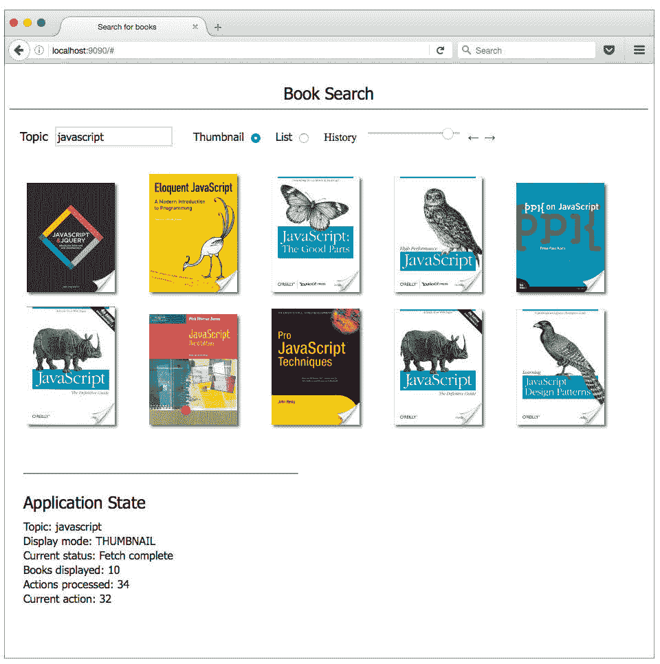
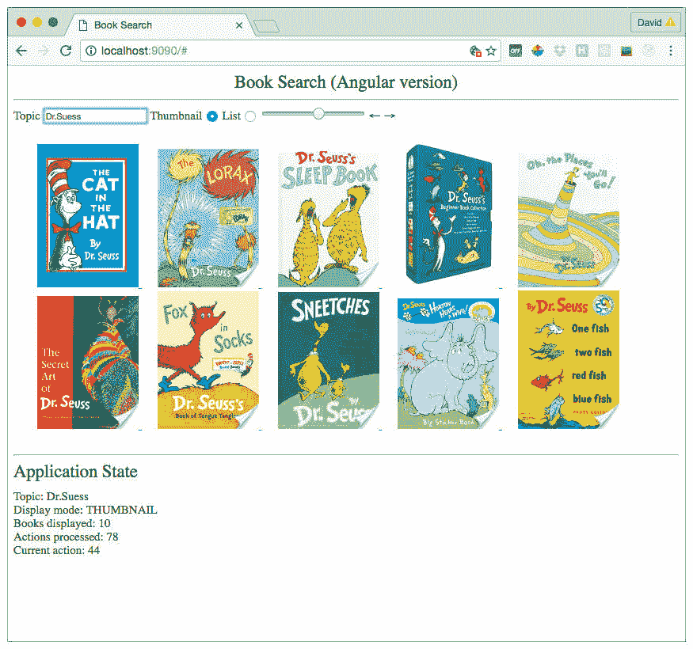
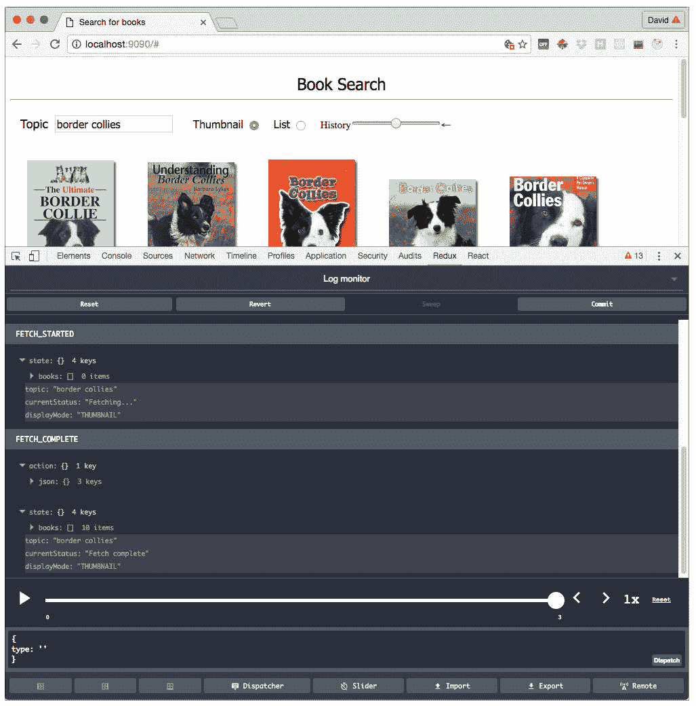
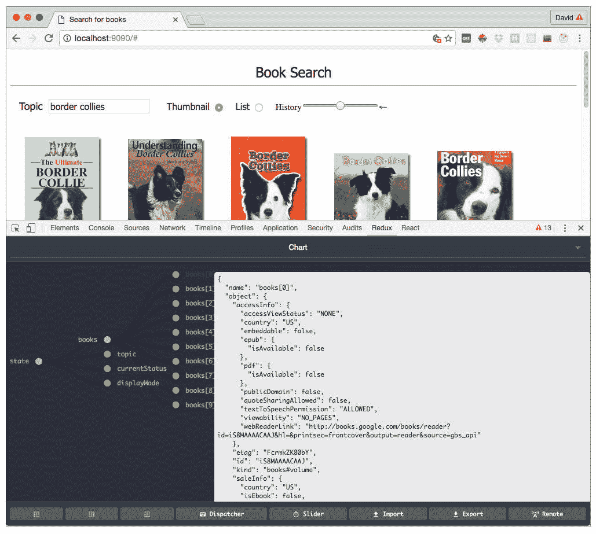

# 结合使用 Redux 和 Angular

> 原文：[`developer.ibm.com/zh/tutorials/wa-manage-state-with-redux-p5-david-geary/`](https://developer.ibm.com/zh/tutorials/wa-manage-state-with-redux-p5-david-geary/)

在本系列的前面两期中，了解了如何使用和实现 Redux 中间件来执行异步操作。还了解了如何实现时间旅行 — 在应用程序以前的状态之间移动的能力。

在这个 使用 Redux 管理状态系列的最后一期中，您将：

*   了解如何完成图书搜索应用程序的 React 版本
*   学习如何使用 Redux 和 Angular 实现图书搜索应用程序
*   了解 Redux DevTools 和 Redux 生态系统

## 完成 React 版本

从前面几期，已经了解了控件和状态查看器组件的实现，如图 1 所示。

##### 图 1\. 图书搜索应用程序



控件显示在应用程序顶部，左侧是 Topic 文本字段，右侧是箭头按钮。状态查看器组件在页面底部显示当前应用程序状态。现在我将解释 `Books` 组件，它将图书显示为文本或缩略图链接。

回想一下 [结合使用 Redux 和 React](http://www.ibm.com/developerworks/cn/web/wa-manage-state-with-redux-p2-david-geary/index.html) ，将 React 组件连接到 Redux 存储的一种方式是将它们实现为两个组件：一个容器包含另一个组件。容器连接到 Redux 存储，在状态更改时将属性导出到包含的组件中。包含的组件创建这些属性的可视表示。 `Books` 组件也不例外。清单 1 给出了 `Books` 容器的代码。

##### 清单 1\. books 容器 (containers/book.js)

```
import { connect } from 'react-redux';
import Books from '../components/books';

const mapStateToProps = state => ({
  books:         state.books,
  currentStatus: state.currentStatus,
  displayMode:   state.displayMode,
});

export default connect(
  mapStateToProps,
  null
)(Books); 
```

`Books` 容器将状态映射到所包含的 `Books` 组件的属性。Books 的用途只是提供它们的存在状态，所以没有要指派的操作，这就解释了 `connect()` 函数的 `null` 参数。

清单 2 给出了 `Books` 容器中包含的 `Books` 组件的代码。

##### 清单 2\. books 组件 (components/books.js)

```
import React from 'react';
import Book from './book.js';

let ReactCSSTransitionGroup =
      require('react-addons-css-transition-group');

const Books = ({
  books,
  displayMode,
  currentStatus,
}) => {
  const styles = {
    container: {
      width: '100%',
    },

    spinner: {
      textAlign: 'center',

      width: '100%',
    },
  };

  const Spinner = () => (
    <div style={styles.spinner}>
      
    </div>
  );

  const bookMarkup = () => {
    let components = null;
    let bookItems = (<span>No items!</span>);

    if (books.length > 0) {
      components = books.map(item => {
        if (item.volumeInfo.imageLinks) {
          // Need different keys for different display modes
          // to trigger <ReactCSSTransitionGroup> animations

          const key = displayMode === 'THUMBNAIL' ?
                                       item.id + 1 :
                                       item.id;
          bookItems = (
            <Book item={item}
              displayMode={displayMode}
              key={key} />);
        }
        return bookItems;
      });
    }
    return components;
  }

  return (
    <div>
      { currentStatus !== 'Fetching...' ?  null : <Spinner /> }

      <div style={styles.container}>
        <ReactCSSTransitionGroup transitionName="books"
          transitionLeaveTimeout={1}
          transitionEnterTimeout={1000}>
          {bookMarkup()}
        </ReactCSSTransitionGroup>
      </div>
    </div>
  );
};

Books.propTypes = {
  books:       React.PropTypes.array.isRequired,
  currentStatus: React.PropTypes.string.isRequired,
  displayMode: React.PropTypes.string.isRequired,
};

export default Books; 
```

在应用程序抓取下一批图书时， `Books` 组件会显示一个下拉列表部件；否则该组件会显示存储在应用程序的状态中的图书。 `Books` 组件使用 `ReactCSSTransitionGroup` 组件让显示的图书淡出。

从 Redux 角度讲，清单 2 中最重要的部分是传递给 `Books` 组件的 3 个属性：图书列表、显示模式和当前抓取状态。这些属性之所以可用，离不开 清单 1 中对 `connect()` 函数的调用。回想一下， `connect()` 函数未包含在 Redux 中，而是由 `react-redux` 绑定提供。

在 清单 2 中， `bookMarkup` 函数使用 `Book` 元素创建标记。 `Book` 组件的代码如清单 3 所示。

##### 清单 3\. book 组件 (components/book.js)

```
import React from 'react';

const Book = ({
  item,
  displayMode,
}) => {
  const styles = {
    links: {
      marginTop: '20px',
    },

    link: {
      padding: '25px',
    },

    image: {
      boxShadow: '3px 3px 3px #686868',
      marginBottom: '15px',
    },
  };

  const linkMarkup = (currentItem, link) => (
    <div style={styles.links}>
      <a href={link} style={styles.link}>
        {currentItem.volumeInfo.title}
      </a>
    </div>
  );

  const thumbnailMarkup = (currentItem, link) => (
    <a href={link} style={styles.link}>
      
    </a>
  );

  const link = item.volumeInfo.canonicalVolumeLink;

  return displayMode === 'THUMBNAIL' ?
           thumbnailMarkup(item, link) :
           linkMarkup     (item, link);
};

Book.propTypes = {
  item:        React.PropTypes.object.isRequired,
  displayMode: React.PropTypes.string.isRequired,
};

export default Book; 
```

`Book` 组件将图书显示为链接或缩略图。 `item` 和 `displayMode` 属性来自 `Books` 组件，如 books 组件 (components/books.js) 所示。

此组件完善了使用 React 和 Redux 的图书搜索应用程序的实现。React 不是您用于 Redux 的组件框架的唯一选择。接下来，将会了解如何结合使用 Redux 和 Angular 创建同一个应用程序。（如果仅使用 React，可以跳到 Redux DevTools 部分。）

## 结合使用 Redux 和 Angular

##### 示例代码存储库

可以从作者的 GitHub [存储库](https://github.com/davidgearyauthor/redux-book-search) 获取图书搜索应用程序的两个版本的完整示例代码。

图 2 给出了图书搜索应用程序的 Angular 2（下文简称 Angular）版本。

##### 图 2\. 图书搜索应用程序的 Angular 版本



##### 为什么选择 TypeScript？

Angular 支持 3 种语言：JavaScript、[TypeScript](https://www.typescriptlang.org/) 和 Dart。我为图书搜索应用程序选择了 TypeScript，这主要是因为 Angular 文档的 TypeScript 版本最完整。

像 React 一样（但不同于 Angular 1），Angular 是一个基于组件的框架。因此从理论上讲，我应该能有效地将 React 组件替换为 Angular 组件，并重用 React 版本的 reducer、操作和存储。事实证明该理论切实可行。

**重要说明：** 图书搜索应用程序的代码 **不适用于** RC5 之前的任何 Angular 版本。

### 设置

图书搜索应用程序的 Angular 版本的 HTML 如清单 4 所示。

##### 清单 4\. 该应用程序的 HTML (index.html)

```
<html>
  <head>
    <title>Book Search</title>
    <meta charset="UTF-8">
    <meta name="viewport" content="width=device-width, initial-scale=1">
    <link rel="stylesheet" href="styles.css">
  </head>

  <body>
    <app>Loading...</app>
  </body>

  <!-- Polyfill(s) for older browsers -->
  <script src="node_modules/core-js/client/shim.min.js"></script>
  <script src="node_modules/zone.js/dist/zone.js"></script>
  <script src="node_modules/reflect-metadata/Reflect.js"></script>
  <script src="node_modules/systemjs/dist/system.src.js"></script>

  <script src="dist/bundle.js"></script>
</html> 
```

清单 4 中的 HTML 拉入了一些填充信息和该应用程序的 TypeScript。清单 5 给出了应用程序的模块。

##### 清单 5\. 该应用程序的模块 (app/app.module.ts)

```
import { NgModule }      from '@angular/core';
import { BrowserModule } from '@angular/platform-browser';
import { FormsModule } from '@angular/forms';

import App from './components/app.component';
import Book from './components/book.component';
import Books from './components/books.component';
import Controls from './components/controls.component';
import DisplayMode from './components/displayMode.component';
import History from './components/history.component';
import StateViewer from './components/stateviewer.component';
import TopicSelector from './components/topicselector.component';

@NgModule({
  bootstrap: [ App ],

  declarations: [
    App,
    Book,
    Books,
    Controls,
    DisplayMode,
    History,
    StateViewer,
    TopicSelector,
  ],

  imports: [
    BrowserModule,
    FormsModule,
  ],
})

export class AppModule { } 
```

清单 5 的代码定义了一个 Angular 模块。 `@NgModule` 是一个 TypeScript 注释。（Angular 的 TypeScript 版本中大量使用了注释。） `@NgModule` 注释是 Angular RC5 中的一项新功能。

在实现 Angular 应用程序时，必须声明模块中的所有组件。清单 5 的代码导入了浏览器模块，浏览器中运行的所有 Angular 应用程序都会导入该模块。该模块也是 `@NgModule` 注释的来源。

我没有在图书搜索应用程序中使用表单，但显然，我必须导入表单模块 (`FormsModule`)；如果不导入，则会获得以下错误消息：

`Can't bind to _ngModel_ since it isn't a known property of _input_.`

该错误消息没有提供任何线索来表明需要导入表单模块；堆栈溢出为我提供了解决方案。

样板的最后一部分是应用程序的入口点 (app/main.ts)：

```
import { platformBrowserDynamic } from '@angular/platform-browser-dynamic';
import { AppModule } from './app.module';

platformBrowserDynamic().bootstrapModule(AppModule); 
```

main.ts 代码启动 Angular 应用程序。

它负责运行图书搜索应用程序的 Angular 版本的样板。现在我将展示该应用程序的 Angular 组件。

### Angular 组件

您可以将原始版本中的 React 组件替换为它们的 Angular 等效组件 — 并迅速得到一个 Angular 图书搜索应用程序。Angular 版本中的 reducer、操作、存储和状态历史都与 React 版本相同。

与 React 一样，借助 Angular，您可以实现彼此嵌套的组件。清单 6 给出了 `App` 组件，它包含应用程序中的其他所有组件。

##### 清单 6\. `App` 组件 (app/components/app.component.ts)

```
import { Component } from '@angular/core';

import Books from './books.component';
import Controls from './controls.component';
import StateViewer from './stateviewer.component';

import store from '../../store';
import { fetchBooks, setTopic } from '../../actions';

@Component({
  selector: 'app',
  template: `
    <div style='text-align: center; font-size: 1.5em'>
     {{app.title}}
    </div>

    <hr/>

    <controls></controls>
    <books></books>
    <state-viewer></state-viewer>`
})

export default class {
  ngOnInit() {
    store.dispatch(setTopic('Border collies'));
    store.dispatch(fetchBooks());
  }

  app = {
    title: 'Book Search (Angular version)',
  };
} 
```

`App` 组件模板包含 3 个组件： `controls` 、 `books` 和 `state-viewer` 。该组件的 TypeScript 在初始化 `App` 组件时向 Redux 存储分派操作。

`controls` 组件如清单 7 所示。

##### 清单 7\. `controls` 组件 (app/components/controls.component.ts)

```
import { Component } from '@angular/core';

@Component({
  selector: 'controls',
  template: `
    <topic-selector></topic-selector>
    <display-mode-container></display-mode-container>
    <history></history>
  `
})

export default class Controls {
} 
```

`controls` 组件不执行任何操作，仅包含其他组件，所以它的关联类的实现是空的（但仍然必不可少）。

topic-selector 组件如清单 8 所示。

##### 清单 8\. `TopicSelector` 组件 (app/components/topicselector.component.ts)

```
import { Component } from '@angular/core';
import { fetchBooks, setTopic } from '../../actions';
import store from '../../store';

@Component({
  selector: 'topic-selector',
  template: `
    <label for='topic'>Topic</label>

    <input #topicInput
      [(ngModel)]='topic'
      (input)='setTopic(topicInput.value)'
      (keyup.enter)='fetchTopic(topicInput.value)'
      autofocus/>
  `
})

export default class TopicSelector {
  private topic: string;
  private unsubscribe: any;

  constructor() {
    store.subscribe(() => {
      this.topic = store.getState().topic;
    });
  }

  setTopic(newTopic) {
    store.dispatch(setTopic(newTopic));
  }

  fetchTopic(newTopic) {
    store.dispatch(fetchBooks());
  }

  ngOnDestroy() {

    this.unsubscribe();
  }
} 
```

主题选择器包含一个标签和一个输入用于指定新主题。输入的 `keyup.enter` 事件对应于该组件的 `fetchTopic()` 方法， `input` 事件对应于该组件的 `setTopic()` 方法。因此，每次击键都会更新该主题，而且在用户按 Enter 键时会发起一次新的抓取。

`[(ngModel)]` 结构是 Angular 的特殊的双向绑定语法。在这个示例中，Angular 将文本字段中的值传递给组件的 `topic` 属性，它还将对属性的更改传递回文本字段。

##### Redux 的 Angular 2 绑定

回想一下，我最开始是通过向 Redux 存储订阅 React 组件来实现应用程序的 React 版本的。随后，我使用了 `react-redux` 绑定来将组件拆分为容器和包含的组件。也可以通过 [`ng2-redux`](https://github.com/angular-redux/ng2-redux)，对 Redux 和 Angular 采用同样的方法，ng2-redux 的使用不属于本文的讨论范围。

从 Redux 角度讲， `TopicSelector` 组件 (app/components/topicselector.component.ts) 的最有趣之处在于，事实上该组件将会订阅 Redux 存储。当存储更改时，该组件会更新它的 `topic` 属性。您会看到，图书搜索应用程序中的所有 Angular 组件均以一种类似方式订阅 Redux 存储。

显示模式组件如清单 9 所示。

##### 清单 9\. `DisplayMode` 组件 (app/components/displayMode.component.ts)

```
import { Component } from '@angular/core';
import store from '../../store';
import { setDisplayMode } from '../../actions';

@Component({
  selector: 'display-mode',
  template: `
    <span>
      <label for='thumbnailRadio'>Thumbnail</label>

      <input id="thumbnailRadio" style="cursor: pointer"
        type="radio"
        name="display_mode"
        value="Thumbnail"
        [checked]='displayMode === "THUMBNAIL"'
        (change)="setMode('THUMBNAIL')"/>

      <label for='listRadio'>List</label>

      <input id="listRadio" style="cursor: pointer"
        type="radio"
        name="display_mode"
        value="List"
        [checked]='displayMode === "LIST"'
        (change)="setMode('LIST')"/>
    </span>
    `
})

export default class DisplayMode {
  private displayMode: string;
  private unsubscribe: any;

  constructor() {
    this.unsubscribe = store.subscribe(() => {
      this.displayMode = store.getState().displayMode;
    });
  }

  setMode(value) {
    store.dispatch(setDisplayMode(value));
  }

  ngOnDestroy() {
    this.unsubscribe();
  }
} 
```

显示模式组件类似于状态查看器。两个组件都将输入事件映射到组件方法。两个组件都订阅 Redux 存储，以便在应用程序状态发生更改时更新一个属性。区别在于显示模式组件有两个输入，它们都是单选按钮。这些单选按钮链接到应用程序的状态中存储的显示模式值。

历史组件的代码很长，所以我将它分为两个清单。该组件的模板如清单 10 所示。

##### 清单 10\. `History` 组件的模板 (app/components/history.component.ts)

```
import { Component } from '@angular/core';

@Component({
  selector: 'history',
  template: `
  <input type='range' #range
    style='cursor: pointer'
    min={1}
    (input)='setState(range.value)'
    [max]='maximum'
    [value]='value'/>

  <a href='#' style='text-decoration: none'
    (click)='previousState()'
    [innerHTML] = 'leftArrow'>
  </a>

  <a href='#' style='text-decoration: none'
    (click)='nextState()'
    [innerHTML] = 'rightArrow'>
  </a>
  `
}) 
```

历史组件包含滑块和箭头按钮，它们控制应用程序的当前状态。同样地，模板标记将事件（确切地讲，是 `click` 和 `input` 事件）映射到组件方法。这些方法如清单 11 所示，其中包含历史组件的 TypeScript。

##### 清单 11\. `History` 组件的 TypeScript (app/components/history.component.ts)

```
import { gotoState, redo, undo } from '../../actions';
import stateHistory from '../../statehistory';
import store from '../../store';

export default class History {
  private leftArrow: string;
  private rightArrow: string;
  private stateHistory: any;
  private topic: string;
  private unsubscribe: any;
  private value: number;
  private maximum: number;

  constructor() {
    this.leftArrow = '←';
    this.rightArrow = '→';

    this.stateHistory = stateHistory;

    this.unsubscribe = store.subscribe(() => {
      this.topic = store.getState().topic;
      this.maximum = this.max();
      this.value = this.val();
    });
  }

  setState(stateIndex) {
    store.dispatch(gotoState(stateIndex));
  }

  previousState() {
    store.dispatch(undo());
  }

  nextState() {
    store.dispatch(redo());
  }

  val() {
    return this.stateHistory.past ? this.stateHistory.past.length : 0;
  }

  max() {
    return (this.stateHistory.past    ? this.stateHistory.past.length   : 0) +
           (this.stateHistory.present ? 1 : 0)             +
           (this.stateHistory.future  ? this.stateHistory.future.length : 0) - 1;
  }

  ngOnDestroy() {
    this.unsubscribe();
  }
} 
```

像我目前讨论的其他 Angular 组件一样，历史组件将会订阅 Redux 存储，并在状态更改时更新其 `topic` 、 `maximum` 和 `value` 属性。

历史组件使用 `stateHistory` 对象配置它的滑块。像 reducer、操作和存储一样， `stateHistory` 对象与应用程序的 React 版本相同。请参阅 “使用 Redux 实现时间旅行 ” 了解 `stateHistory` 对象的实现。

`Books` 组件如清单 12 所示。

##### 清单 12\. `Books` 组件 (app/components/books.component.ts)

```
import { Component } from '@angular/core';
import { trigger, state, style, transition, animate } from '@angular/core';
import store from '../../store';
import Book from './book.component';

@Component({
  selector: 'books',
  template: `
    <div *ngIf='status === "Fetching..."'
      style='width: 100%; padding: 20px; text-align: center'>
      
    </div>

    <div *ngIf='displayMode === "LIST"' style='width: 100%; padding: 20px;'>
      <ul>
        <li *ngFor='let book of books'>
          <book [item]='book'
                [displayMode]='displayMode'></book>
        </li>
      </ul>
    </div>

    <div *ngIf='displayMode === "THUMBNAIL"' style='padding: 20px;'>
      <book *ngFor='let book of books'
        [item]='book'
        [displayMode]='displayMode'>
      </book>
    </div>
  `
})

export default class Books {
  private books: Array<Book>;
  private displayMode: string;
  private status: string;
  private unsubscribe: any;

  constructor() {
    this.unsubscribe = store.subscribe(() => {
      const state = store.getState();

      this.books = state.books;
      this.displayMode = state.displayMode;
      this.status = state.currentStatus;
    });
  }

  ngOnDestroy() {
    this.unsubscribe();
  }
} 
```

如果应用程序的当前状态为 Fetching…， `Books` 组件将显示一个下拉列表部件。该组件也会迭代图书列表，创建 `book` 元素。 `Books` 组件通过订阅 Redux 存储来同步其表示状态的属性。

`Book` 组件如清单 13 所示。

##### 清单 13\. `Book` 组件 (app/components/book.component.ts)

```
import { Component, Input } from '@angular/core';
import store from '../../store';

@Component({
  selector: 'book',
  template: `
    <span *ngIf='displayMode === "THUMBNAIL"' style='padding: 10px'>
      <a href={{item.volumeInfo.canonicalVolumeLink}}>
        
      </a>
    </span>

    <span *ngIf='displayMode === "LIST"'>
      <a href={{item.volumeInfo.canonicalVolumeLink}}>
        {{item.volumeInfo.title}}
      </a>
    </span>
  `
})

export default class Book {
  @Input() item: any;
  @Input() displayMode: string;
} 
```

`Book` 组件的标记将图书呈现为文本链接或缩略图。该组件的 TypeScript 声明了两个输入属性： `item` 和 `displayMode` 。这些属性的值由 `Books` 组件指定，如 `Books` 组件 (app/components/books.component.ts) 所示。

最后一个组件是 `StateViewer` ，如清单 14 所示。

##### 清单 14\. `StateViewer` 组件 (app/components/stateviewer.component.ts)

```
import { Component } from '@angular/core';
import store from '../../store';
import stateHistory from '../../statehistory';

@Component({
  selector: 'state-viewer',
  template: `
  <hr/>

  <span style='font-style: tahoma; font-size: 1.5em'>
    Application State
  </span>

  <div style='padding-top: 10px'>
    Topic: {{state.topic}}<br />
    Display mode: {{state.displayMode}}<br />
    Books displayed:   {{ state.books.length }}<br />
    Actions processed: {{ stateHistory.past.length +
                          stateHistory.future.length + 1 }}<br />
    Current action:    {{ stateHistory.past.length + 1 }}
  </div>
  `
})

export default class StateViewer {
  private state: any;
  private stateHistory: any;
  private unsubscribe: any;

  constructor(
  ){
    this.state = store.getState();
    this.stateHistory = stateHistory;

    this.unsubscribe = store.subscribe(() => {
      this.state = store.getState();
    });
  }

  ngOnDestroy() {
    this.unsubscribe();
  }
} 
```

`StateViewer` 组件使用应用程序状态和状态历史来显示当前状态。

图书搜索应用程序的 Angular 版本现在已完成。

## Redux DevTools

图书搜索应用程序的一些功能（用于在应用程序以前的状态中移动的历史滑块和箭头按钮，以及当前状态的显示视图）不是图书搜索所独有的。您可以提取这些特性的代码，将它们用在其他应用程序中。您可能会怀疑，某人（Redux 的实现者）通过实现 [Redux DevTools](https://github.com/gaearon/redux-devtools) 完成了类似的工作。

图 3 显示了 [Redux DevTools Chrome 扩展](https://github.com/zalmoxisus/redux-devtools-extension) ，该扩展是在 Redux DevTools 上构建的。

##### 图 3\. Redux DevTools Chrome 扩展



图 3 显示了日志监视器窗格，默认情况下，它显示了状态历史，还提供了一个滑块和箭头按钮。目前为止，您应该已经很好地理解了这些特性是如何实现的。

图 4 显示了 Chart 窗格，它提供了应用程序状态的图形表示。将鼠标悬停在状态中的单个数据上时，就可以在一个弹出窗口中看到该数据的表示，在图 4 中也可以看到该数据表示。

##### 图 4\. 使用 Redux DevTools Chrome 扩展了解状态



Redux DevTools Chrome 扩展的使用很简单。根据该扩展的 [文档](http://zalmoxisus.github.io/redux-devtools-extension/) 中的介绍，安装该扩展后，必须对应用程序的代码执行一处更改。对于图书搜索应用程序，它使用了自定义中间件，所以您只需修改对 Redux 的 `createStore()` 函数的调用，如清单 15 所示。

##### 清单 15\. book 组件 (store.js)

```
import { createStore, applyMiddleware, compose } from 'redux';
import reducers from './reducers';
import { logger, thunk } from './middleware';

export default createStore(reducers, compose(applyMiddleware(logger, thunk),
      window.devToolsExtension ? window.devToolsExtension() : f => f)); 
```

随后，当您在 Chrome 中打开开发人员工具时，您会看到一个 Redux 选项卡。单击该选项卡就会显示该扩展。

Redux DevTools 通过提供一组强大的调试工具，使 Redux 变得更加强大。但这不是 Redux 提供的全部优势。Redux 还催生了一个繁荣的生态系统。

## Redux 生态系统概览

Redux 生态系统包含以下存储库：

*   [`redux-form`](https://github.com/erikras/redux-form)
*   [`redux-saga`](https://github.com/yelouafi/redux-saga)
*   [`redux-loop`](https://github.com/redux-loop/redux-loop)
*   [`redux-observable`](https://github.com/redux-observable/redux-observable)
*   [`redux-logic`](https://github.com/jeffbski/redux-logic)

Redux 生态系统中的一些库（比如 `redux-form` ）是特定于 React 的；其他库（比如 `redux-logic` ）仅需要 Redux。

众所周知，Redux 使用操作和 reducer 来维护状态。给定当前状态和一个操作，操作描述状态更改，reducer 根据当前生成一个全新的状态。对于同步操作，这个简单模型就够了，但正如您在 “使用 Redux 实现异步操作 ” 中看到的，它没有考虑异步操作。

异步操作是一种特殊的 *类的副作用* ，之前这些与 Redux 相关的存储库（ `redux-form` 除外，它使用 Redux 存储 React 表单状态）都用于管理副作用。这些库有助于实现一些特性，比如 *去除抖动* ，图书搜索应用程序没有实现该特性（但根据 `redux-logic` 的作者在对 “使用 Redux 实现异步操作 ” 的评价中所指出的，应该实现该特性）。有了 `redux-saga` ，您可以熟悉 [Elm](http://elm-lang.org/) 效果；而有了 `redux-observable` ，您可以了解如何将观察结果与 Redux 相集成。对 Redux 生态系统的进一步讨论不属于本系列的讨论范围。

## 结束语

尽管不是一个吸引人的主题，但状态管理是任何应用程序的最重要方面之一。在编写本文时，Redux 在 GitHub 上拥有 22,000 颗星和 3,500 个分支，是最流行的 JavaScript 存储库之一。

Redux 如此流行是因为，它使状态管理变得可预测，显著减少了应用程序中的错误数量。Redux 也是一个可用于任何 UI 框架的简单 JavaScript 库。在本系列中，您看到了如何使用 Redux 维护同步和异步操作，还看到了可同时用于 React 和 Angular 的相同的 Redux 代码。Redux DevTools 和 Redux 生态系统使 Redux 变得更加振奋人心。

本文翻译自：[Using Redux with Angular](https://developer.ibm.com/tutorials/wa-manage-state-with-redux-p5-david-geary/)（2016-09-28）