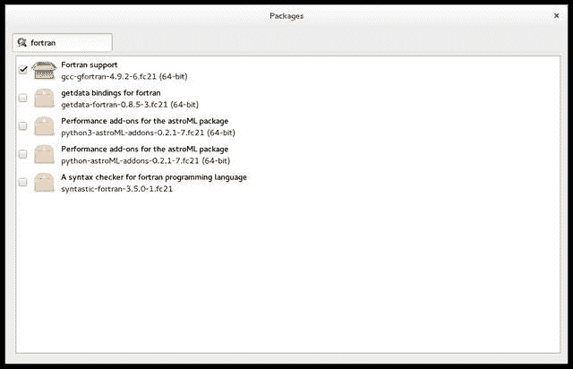

# RPM 和 YUM 包管理

> 原文：[`developer.ibm.com/zh/tutorials/l-lpic1-102-5/`](https://developer.ibm.com/zh/tutorials/l-lpic1-102-5/)

## 概述

在本教程中，学习如何使用 RPM 和 YUM 工具管理 Linux 系统上的包。学习：

*   使用 RPM 和 YUM 安装、重新安装、升级和删除包。
*   获取 RPM 包的信息，包括版本、状态、依赖项、完整性和签名。
*   确定一个包提供了哪些文件，并查找某个特定文件来自哪个包。

本教程将帮助您针对 Linux Professional Institute 的初级管理 (LPIC-1) 考试 101 的主题 102 中的目标 102.5 进行应考准备。该目标的权重为 3。

## 介绍包管理

在过去，许多 Linux 程序以源代码形式发行，用户可将它连同所需的手册页、配置文件等一起构建到需要的程序或程序集中。现在，大部分 Linux 发行商都使用预先构建的程序或称为 *包* 的程序集，这些包已准备好安装在该发行版上。在本教程，您将学习可帮助安装、更新和删除包的 *包管理工具* 。本教程将重点介绍 Red Hat 开发的 **Red Hat Package Manager (RPM)** ，以及最初在杜克大学物理系开发的用来管理 Red Hat Linux 系统的 **Yellowdog Updater Modified (YUM)** 。本系列的另一篇教程 “[学习 Linux 101：Debian 包管理](http://www.ibm.com/developerworks/cn/linux/l-lpic1-102-4/) ” 介绍了 Debian 系统上使用的包管理工具。

**关于本系列**

本教程系列可以帮助您学习 Linux 系统管理任务。您还可以使用这些教程中的资料来对 [Linux Professional Institute 的 LPIC-1：Linux 服务器专业认证考试](http://www.lpi.org) 进行应考准备。

请参阅 “[*学习 Linux，101*：LPIC-1 学习路线图](http://www.ibm.com/developerworks/cn/linux/l-lpic1-map/index.html)”，查看本系列中每部教程的描述和链接。这个路线图正在开发之中，它反映了 2015 年 4 月 15 日更新的 4.0 版 LPIC-1 考试目标。在完成这些教程后，我们会将它们添加到路线图中。

从用户角度讲，基本的包管理功能是通过命令提供的。随着 Linux 开发人员努力让 Linux 变得更容易使用，基本工具已得到了其他工具的补充，包括 GUI 工具，它们为用户隐藏了基本工具的一些复杂性。在本教程和 [Debian 包管理](http://www.ibm.com/developerworks/cn/linux/l-lpic1-102-4/) 教程中，我们将重点介绍基本工具，但也会提到其他一些工具，以便您能进一步了解它们。

### 前提条件

要从本系列教程中获得最大收获，您应该拥有 Linux 的基本知识和一个正常工作的 Linux 系统，您可以在这个系统上实践本教程中涵盖的命令。有时程序的不同版本会得到不同的输出格式，所以您的结果可能并不总是与这里给出的清单和图完全相同。具体地讲，我展示的许多输出都高度依赖于我们的系统上已安装的包。您自己的输出可能非常不同，但您应该能够发现一些重要共性。除非另行说明，本教程中的示例使用的是 Fedora 20 系统。

## 包管理器

RPM、YUM 和 APT（用于 Debian 系统）有许多相似之处。它们都能安装和删除包。有关已安装包的信息保留在数据库中。所有工具都拥有基本的命令行功能，而其他一些工具可以提供对用户更友好的接口。所有工具都能从互联网检索包。

安装 Linux 系统时，通常会安装大量包。可针对系统的目标用途而自定义这个包集合，比如用作服务器、桌面或开发人员工作站。有时，可能还需要安装新包来添加新功能，更新已有的包，甚至删除不再需要的或已被新包淘汰的包。我们看看如何执行这些任务，并解决一些相关的难题，比如找到哪个包可能包含某个特定命令。

### RPM

Red Hat 于 1995 年引入了 RPM。RPM 现在是 Linux Standard Base (LSB) 中用于打包的包管理系统。 `rpm` 命令选项分组为 3 个小组：

*   查询和验证包
*   安装、升级和删除包
*   执行其他功能

本教程将重点介绍前两组命令选项。在 RPM 的手册页中可以找到其他功能的信息。

我们还应注意到， `rpm` 是用于 RPM 的主要命令的命令名称，而 *.rpm* 是用于 RPM 文件的扩展名。所以 “一个 rpm” 或 “xxx rpm” 通常指一个 RPM 文件，而 `rpm` 通常指该命令。

### YUM

YUM 向 RPM 系统添加了自动更新和包管理，包括依赖项管理。除了了解系统上已安装的包之外，YUM 与 Debian Advanced Packaging Tool (APT) 很相似，因为它使用了 *存储库* ，存储库是一种包集合，通常可通过连接网络进行访问。

## 安装 RPM 包

假设您希望编译一个 Fortran 程序，一位同事告诉您使用 `gfortran` 命令。您可以尝试使用 `gfortran --help` ，也可以尝试使用 `which gfortran` ，或者尝试使用 `type gfortran` 。但是，如果系统无法找到 `gfortran` ，您可能会看到类似 缺少 gfortran 命令 中所示的输出。

##### 缺少 gfortran 命令

```
[ian@attic-f21 ~]$ gfortran --help
bash: gfortran: command not found

[ian@attic-f21 ~]$ gfortran --help
bash: gfortran: command not found...
Install package 'gcc-gfortran' to provide command 'gfortran'? [N/y] n

[ian@attic-f21 ~]$ which gfortran
/usr/bin/which: no gfortran in (/usr/local/bin:/usr/local/sbin:/usr/bin:/usr/sbin:/bin:/sbin:
/home/ian/.local/bin:/home/ian/bin)

[ian@attic-f21 ~]$ type gfortran
bash: type: gfortran: not found 
```

如果您没有从 缺少 gfortran 命令 中的第二个输出表单中获得有帮助的建议，可以与您的同事核对一下，确定要安装哪个包。否则，可以推测 `gfortran` 命令在 gfortran 包中。这通常是一种合理的推测，但并不总是对的，至少在本例中是不正确的。我们稍后会了解如何找到正确的包。假设您知道它实际上在 gcc-gfortran 包中，而且您已下载或获取了该包的副本，您可以尝试使用 `rpm` 命令和 `-i` （表示安装）选项来安装它，如 使用 rpm – take 1 安装 gcc-gfortran 中所示。

##### 使用 rpm – take 1 安装 gcc-gfortran

```
[root@attic-f21 ~]# rpm -i  gcc-gfortran-4.9.2-6.fc21.x86_64.rpm
error: Failed dependencies:
    libquadmath-devel = 4.9.2-6.fc21 is needed by gcc-gfortran-4.9.2-6.fc21.x86_64 
```

`rpm` 命令知道该包有一个依赖项，但不幸的是，它不会帮助您解析该依赖项。您需要获取一个或多个依赖包，再次尝试，看看是否有其他依赖项 — 一直这样做，直到已满足所有依赖关系。一个便捷的方法是，您可以向 `rpm` 命令提供一个要安装的包列表，如果所有依赖关系都得到满足，它会按正确的顺序安装所有这些包。所以您至少不需要按正确的顺序手动安装每个包。

如果您使用过 Debian 的 APT，现在您可能希望拥有类似 `apt-get` 的命令，该命令会查找您需要的资源（包括依赖项）并进行安装。对于基于 RPM 的系统，YUM（或 Yellowdog Updater Modified）提供了这样的功能。 使用 yum 安装 gcc-gfortran 展示了如何使用 `yum` 命令和 `install` 选项安装 gcc-gfortran 和所需的必备依赖项。 **备注：** 根据您已在系统上安装的工具，您的依赖项可能不同。

##### 使用 yum 安装 gcc-gfortran

```
[root@attic-f21 ~]# yum install gcc-gfortran
Loaded plugins: langpacks
Resolving Dependencies
--> Running transaction check
---> Package gcc-gfortran.x86_64 0:4.9.2-6.fc21 will be installed
--> Processing Dependency: libquadmath-devel = 4.9.2-6.fc21 for package: gcc-gfortran-4.9.2-6.fc21.x86_64
--> Running transaction check
---> Package libquadmath-devel.x86_64 0:4.9.2-6.fc21 will be installed
--> Finished Dependency Resolution

Dependencies Resolved

================================================================================
 Package                 Arch         Version               Repository     Size
================================================================================
Installing:
 gcc-gfortran            x86_64       4.9.2-6.fc21          updates       7.7 M
Installing for dependencies:
 libquadmath-devel       x86_64       4.9.2-6.fc21          updates        37 k

Transaction Summary
================================================================================
Install  1 Package (+1 Dependent package)

Total download size: 7.7 M
Installed size: 18 M
Is this ok [y/d/N]: y
Downloading packages:
(1/2): libquadmath-devel-4.9.2-6.fc21.x86_64.rpm            |  37 kB  00:00
(2/2): gcc-gfortran-4.9.2-6.fc21.x86_64.rpm                 | 7.7 MB  00:04
--------------------------------------------------------------------------------
Total                                              1.6 MB/s | 7.7 MB  00:04
Running transaction check
Running transaction test
Transaction test succeeded
Running transaction (shutdown inhibited)
  Installing : libquadmath-devel-4.9.2-6.fc21.x86_64                        1/2
  Installing : gcc-gfortran-4.9.2-6.fc21.x86_64                             2/2
  Verifying  : libquadmath-devel-4.9.2-6.fc21.x86_64                        1/2
  Verifying  : gcc-gfortran-4.9.2-6.fc21.x86_64                             2/2

Installed:
  gcc-gfortran.x86_64 0:4.9.2-6.fc21

Dependency Installed:
  libquadmath-devel.x86_64 0:4.9.2-6.fc21

Complete! 
```

使用 yum 安装 gcc-gfortran 中的输出表明，YUM 在名为 “updates” 的存储库中找到了 gcc-gfortran 和 libquadmath-devel 的 x86_64 版本（稍后会更详细地进行介绍），并确定了总下载大小。在回复 “Y” 同意该事务后，它会下载这两个包，然后安装依赖项，最后安装 gcc-gfortran。您会在本教程后面进一步了解依赖项。

**备注：** 在 使用 yum 安装 gcc-gfortran 中，YUM 找到了 gcc-gfortran 包的最新版本，该恰好具有与我们尝试在 使用 rpm – take 1 安装 gcc-gfortran 中安装的版本相同的级别 (4.9.2-6)。您通常想安装包的最新版本，但如果需要更早的版本，或者需要 i686 版而不是 x86_64 版，可以提供附加的限定条件。请参阅 `yum` 命令的手册页中介绍指定包名称的部分。

## 包位置

在上一节中，您学习了如何安装 RPM 包。不过这些包来自何处？ `yum` 如何知道从何处下载包？可将 /etc/yum.repos.d/ 目录作为起点，它通常包含一些 *存储库* 文件。这是存放存储库信息的默认位置，但也可以在 YUM 配置文件（通常为 /etc/yum.conf）中指定其他位置。 /etc/yum.repos.d/*.repo 显示了与我们从中将 gcc-gfortran 安装在 Fedora 21 系统上的位置对应的 fedora-updates.repo。

典型的存储库文件分为 3 个部分，一部分用于正常的包，一部分用于调试包，最后一部分用于源包。通常，会在不同位置或 *镜像* 提供一个发行版的包的多个副本。所以存储库文件告诉 `yum` 在何处查找每部分的最新镜像列表。请注意，发行版的版本级别和机器架构已被参数化，所以 `yum` 会从 [`mirrors.fedoraproject.org/metalink?repo=updates-released-f21&arch=x86_64`](https://mirrors.fedoraproject.org/metalink?repo=updates-released-f21&arch=x86_64) 下载针对我的 x86_64 Fedora 21 系统的列表。

除了存储库位置之外，存储库文件还会告知某个特定存储库是否已启用，是否应使用 GPG 签名检查下载的包。

##### /etc/yum.repos.d/*.repo

```
[ian@attic-f21 ~]$ cat /etc/yum.repos.d/fedora-updates.repo
[updates]
name=Fedora $releasever - $basearch - Updates
failovermethod=priority
#baseurl=http://download.fedoraproject.org/pub/fedora/linux/updates/$releasever/$basearch/
metalink=https://mirrors.fedoraproject.org/metalink?repo=updates-released-f$releasever&arch=$
basearch
enabled=1
metadata_expire=6h
gpgcheck=1
gpgkey=file:///etc/pki/rpm-gpg/RPM-GPG-KEY-fedora-$releasever-$basearch
skip_if_unavailable=False

[updates-debuginfo]
name=Fedora $releasever - $basearch - Updates - Debug
failovermethod=priority
#baseurl=http://download.fedoraproject.org/pub/fedora/linux/updates/$releasever/$basearch/debug/
metalink=https://mirrors.fedoraproject.org/metalink?repo=updates-released-debug-f$releasever&
arch=$basearch
enabled=0
gpgcheck=1
metadata_expire=6h
gpgkey=file:///etc/pki/rpm-gpg/RPM-GPG-KEY-fedora-$releasever-$basearch
skip_if_unavailable=False

[updates-source]
name=Fedora $releasever - Updates Source
failovermethod=priority
#baseurl=http://download.fedoraproject.org/pub/fedora/linux/updates/$releasever/SRPMS/
metalink=https://mirrors.fedoraproject.org/metalink?repo=updates-released-source-f$releasever&
arch=$basearch
enabled=0
gpgcheck=1
metadata_expire=6h
gpgkey=file:///etc/pki/rpm-gpg/RPM-GPG-KEY-fedora-$releasever-$basearch
skip_if_unavailable=False 
```

YUM 和 RPM 使用本地数据库来确定安装了哪些包。存储在本地数据库中的包的元数据是从启用的存储库检索而来的。尽管您很少需要担忧本地数据库，但可以使用命令 `yum clean` 清除本地存储的信息的各个部分，使用 `yum makecache` 在本地数据库中为启用的存储库创建信息。举例而言，如果您更改了存储库配置，则可以这么做。

## 删除 RPM 包

如果想要删除包，可使用 `yum` 的 `remove` 选项或 `rpm` 的 `-e` 选项。一个使用 `rpm -e` 删除 gcc-gfortran 的测试运行如 gcc-gfortran 的删除测试 所示。如果该包可以删除，则没有输出。

##### gcc-gfortran 的删除测试

```
[root@attic-f21 ~]# rpm -e --test gcc-gfortran
 
```

不同于使用 `apt-get` 对 Debian 包的模拟删除，RPM 系统不会维护自动添加的包信息，所以无法轻松地确定还删除了哪些依赖项。但是，如果您在单个命令上指定删除多个包，没有依赖项的包会在有依赖项的包之前删除。

使用 `rpm` 删除包时，在删除包之前没有提示，这与安装包时不同。但是，如果您尝试删除其他某个包需要的包，该操作不会执行，您会获得一条如 [使用 rpm 删除依赖包 所示的错误消息。

##### 使用 rpm 删除依赖包

```
[root@attic-f21 ~]# rpm -e libquadmath-devel
error: Failed dependencies:
    libquadmath-devel = 4.9.2-6.fc21 is needed by (installed) gcc-gfortran-4.9.2-6.fc21.x86_64 
```

如果使用 `yum remove` ，在执行事务测试后将提示您。如果尝试删除的包是其他某些已安装包的依赖包，YUM 会建议删除这些包和依赖包，如 使用 yum 删除依赖包 所示。

##### 使用 yum 删除依赖包

```
[root@attic-f21 ~]# yum remove libquadmath-devel
Loaded plugins: langpacks
Resolving Dependencies
--> Running transaction check
---> Package libquadmath-devel.x86_64 0:4.9.2-6.fc21 will be erased
--> Processing Dependency: libquadmath-devel = 4.9.2-6.fc21 for package: gcc-gfortran-4.9.2-6.fc21.x86_64
--> Running transaction check
---> Package gcc-gfortran.x86_64 0:4.9.2-6.fc21 will be erased
--> Finished Dependency Resolution

Dependencies Resolved

================================================================================
 Package                 Arch         Version              Repository      Size
================================================================================
Removing:
 libquadmath-devel       x86_64       4.9.2-6.fc21         @updates        18 k
Removing for dependencies:
 gcc-gfortran            x86_64       4.9.2-6.fc21         @updates        18 M

Transaction Summary
================================================================================
Remove  1 Package (+1 Dependent package)

Installed size: 18 M
Is this ok [y/N]: n
Exiting on user command
Your transaction was saved, rerun it with:
 yum load-transaction /tmp/yum_save_tx.2015-07-27.22-01.amzaZh.yumtx 
```

## 升级 RPM 包

现在您已经知道了如何安装和删除 RPM，让我们看看如何将 RPM 包升级到更高级别。可以使用 `yum update` 更新整个系统，或者可以指定一个包或一种通配符规范。 使用 yum update 更新 展示了如何更新所有名称以 “pop” 开头的包。注意，这里使用了省略符号来阻止 “*” 的 shell 扩展。

##### 使用 yum update 更新

```
[root@attic-f21 ~]# yum update 'pop*'
Loaded plugins: langpacks
Resolving Dependencies
--> Running transaction check
---> Package poppler.x86_64 0:0.26.2-3.fc21 will be updated
---> Package poppler.x86_64 0:0.26.2-9.fc21 will be an update
---> Package poppler-data.noarch 0:0.4.7-1.fc21 will be updated
---> Package poppler-data.noarch 0:0.4.7-2.fc21 will be an update
---> Package poppler-glib.x86_64 0:0.26.2-3.fc21 will be updated
---> Package poppler-glib.x86_64 0:0.26.2-9.fc21 will be an update
---> Package poppler-utils.x86_64 0:0.26.2-3.fc21 will be updated
---> Package poppler-utils.x86_64 0:0.26.2-9.fc21 will be an update
--> Finished Dependency Resolution

Dependencies Resolved

==========================================================================
 Package             Arch         Version             Repository     Size
==========================================================================
Updating:
 poppler             x86_64       0.26.2-9.fc21       updates       798 k
 poppler-data        noarch       0.4.7-2.fc21        updates       2.2 M
 poppler-glib        x86_64       0.26.2-9.fc21       updates       141 k
 poppler-utils       x86_64       0.26.2-9.fc21       updates       171 k

Transaction Summary
==========================================================================
Upgrade  4 Packages

Total download size: 3.2 M
Is this ok [y/d/N]: y
Downloading packages:
Delta RPMs reduced 3.1 M of updates to 315 k (89% saved)
(1/4): poppler-data-0.4.7-1.fc21_0.4.7-2.fc21.noarch. |  70 kB  00:00
(2/4): poppler-0.26.2-3.fc21_0.26.2-9.fc21.x86_64.drp | 208 kB  00:00
(3/4): poppler-glib-0.26.2-3.fc21_0.26.2-9.fc21.x86_6 |  36 kB  00:00
(4/4): poppler-utils-0.26.2-9.fc21.x86_64.rpm         | 171 kB  00:00
Finishing delta rebuilds of 3 package(s) (3.1 M)
--------------------------------------------------------------------------
Total                                        142 kB/s | 486 kB  00:03
Running transaction check
Running transaction test
Transaction test succeeded
Running transaction (shutdown inhibited)
  Updating   : poppler-data-0.4.7-2.fc21.noarch                       1/8
  Updating   : poppler-0.26.2-9.fc21.x86_64                           2/8
  Updating   : poppler-glib-0.26.2-9.fc21.x86_64                      3/8
  Updating   : poppler-utils-0.26.2-9.fc21.x86_64                     4/8
  Cleanup    : poppler-utils-0.26.2-3.fc21.x86_64                     5/8
  Cleanup    : poppler-glib-0.26.2-3.fc21.x86_64                      6/8
  Cleanup    : poppler-0.26.2-3.fc21.x86_64                           7/8
  Cleanup    : poppler-data-0.4.7-1.fc21.noarch                       8/8
  Verifying  : poppler-data-0.4.7-2.fc21.noarch                       1/8
  Verifying  : poppler-glib-0.26.2-9.fc21.x86_64                      2/8
  Verifying  : poppler-0.26.2-9.fc21.x86_64                           3/8
  Verifying  : poppler-utils-0.26.2-9.fc21.x86_64                     4/8
  Verifying  : poppler-data-0.4.7-1.fc21.noarch                       5/8
  Verifying  : poppler-utils-0.26.2-3.fc21.x86_64                     6/8
  Verifying  : poppler-glib-0.26.2-3.fc21.x86_64                      7/8
  Verifying  : poppler-0.26.2-3.fc21.x86_64                           8/8

Updated:
  poppler.x86_64 0:0.26.2-9.fc21
  poppler-data.noarch 0:0.4.7-2.fc21
  poppler-glib.x86_64 0:0.26.2-9.fc21
  poppler-utils.x86_64 0:0.26.2-9.fc21

Complete! 
```

如果知道 RPM 文件位于何处，或者已下载它们，还可以使用 `rpm` 命令更新它们。更新与安装类似，但使用的是 `-U` 或 `-F` 选项，而不是 `-i` 选项。这两个选项之间的区别在于， `-U` 选项将升级一个现有包 **或者** 在该包未安装时安装它，而 `-F` 选项仅升级或 *刷新* 一个已安装的包。出于这个原因，通常会使用 `-U` 选项，尤其是在命令行包含一组 RPM 时。这样，将安装未安装的包，升级已安装的包。其他两个选项 `-v` （详细）和 `-h` （哈希标记）通常用于提供进度指标。 使用 rpm 更新包 展示了如何使用 `rpm` 命令更新 cairo 包和它的 cairo-gobject 依赖项。我们已将 cairo rpm 下载到根用户的主目录，而且需要从一个更新镜像获取 cairo-gobject 包。

##### 使用 rpm 更新包

```
[root@attic-f21 ~]# ls *.rpm
cairo-1.14.2-1.fc21.x86_64.rpm
[root@attic-f21 ~]# rpm -Uvh *.rpm \
> http://download.fedoraproject.org/pub/fedora/linux/updates/21/\
> x86_64/c/cairo-gobject-1.14.2-1.fc21.x86_64.rpm
Retrieving http://download.fedoraproject.org/pub/fedora/linux/updates/21/x86_64/c/cairo-g
object-1.14.2-1.fc21.x86_64.rpm
Preparing...                          ################################# [100%]
Updating / installing...
   1:cairo-1.14.2-1.fc21              ################################# [ 25%]
   2:cairo-gobject-1.14.2-1.fc21      ################################# [ 50%]
Cleaning up / removing...
   3:cairo-gobject-1.13.1-0.4.git337ab################################# [ 75%]
   4:cairo-1.13.1-0.4.git337ab1f.fc21 ################################# [100%] 
```

## 查询 RPM 包

在我们的示例中，您可以看到，使用 `rpm` 命令安装 rpm 需要包文件的完整名称（或 URL），比如 gcc-gfortran-4.9.2-6.fc21.x86*64.rpm。另一方面，使用 `yum` 安装或使用任一命令删除 rpm 仅需要包名称，比如 gcc-gfortran。与 APT 一样，RPM 维护着已安装包的内部数据库，允许您使用包名称来处理已安装的包。在本节中，我们使用 `rpm` 命令的 `-q` （表示* 查询 _ ）选项或关联的 `yum` 查询，查看这个数据库中提供的一些信息。

我们将重新安装 gcc-gfortran 包来提供我们的示例。

这个基本查询仅循环查询某个包是否已安装，如果已安装，它的版本是什么。添加 `-i` 选项，您会获得该包的信息。请注意，您需要拥有根用户权限才能安装、升级或删除包，但非根用户可以对 rpm 数据库执行查询。

##### 显示 gcc-gfortran 的信息

```
[ian@attic-f21 ~]$ yum list gcc-gfortran
Loaded plugins: langpacks
Installed Packages
gcc-gfortran.x86_64                    4.9.2-6.fc21                     @updates
Available Packages
gcc-gfortran.i686                      4.9.2-6.fc21                     updates

[ian@attic-f21 ~]$ rpm -q gcc-gfortran
gcc-gfortran-4.9.2-6.fc21.x86_64

[ian@attic-f21 ~]$ yum info gcc-gfortran
Loaded plugins: langpacks
Installed Packages
Name        : gcc-gfortran
Arch        : x86_64
Version     : 4.9.2
Release     : 6.fc21
Size        : 18 M
Repo        : installed
From repo   : updates
Summary     : Fortran support
URL         : http://gcc.gnu.org
License     : GPLv3+ and GPLv3+ with exceptions and GPLv2+ with exceptions and
            : LGPLv2+ and BSD
Description : The gcc-gfortran package provides support for compiling Fortran
            : programs with the GNU Compiler Collection.

Available Packages
Name        : gcc-gfortran
Arch        : i686
Version     : 4.9.2
Release     : 6.fc21
Size        : 7.5 M
Repo        : updates/21/x86_64
Summary     : Fortran support
URL         : http://gcc.gnu.org
License     : GPLv3+ and GPLv3+ with exceptions and GPLv2+ with exceptions and
            : LGPLv2+ and BSD
Description : The gcc-gfortran package provides support for compiling Fortran
            : programs with the GNU Compiler Collection.

[ian@attic-f21 ~]$ rpm -qi gcc-gfortran
Name        : gcc-gfortran
Version     : 4.9.2
Release     : 6.fc21
Architecture: x86_64
Install Date: Mon 27 Jul 2015 09:36:14 PM EDT
Group       : Development/Languages
Size        : 19126083
License     : GPLv3+ and GPLv3+ with exceptions and GPLv2+ with exceptions and LGPLv2+ and BSD
Signature   : RSA/SHA256, Fri 13 Feb 2015 09:02:15 PM EST, Key ID 89ad4e8795a43f54
Source RPM  : gcc-4.9.2-6.fc21.src.rpm
Build Date  : Thu 12 Feb 2015 07:40:58 AM EST
Build Host  : buildhw-08.phx2.fedoraproject.org
Relocations : (not relocatable)
Packager    : Fedora Project
Vendor      : Fedora Project
URL         : http://gcc.gnu.org
Summary     : Fortran support
Description :
The gcc-gfortran package provides support for compiling Fortran
programs with the GNU Compiler Collection. 
```

更详细的清单可以显示一些可能与某个 RPM 包关联的 *标签* 。您会注意到， `rpm` 和 `yum` 以稍微不同的格式显示了稍微不同的信息。对于本教程，我们将坚持使用标准命令选项所提供的基本输出。如果想使用 `rpm --queryformat` 选项构建自定义查询输出，请参阅手册页。如果想知道您的 `rpm` 版本支持的所有标签，可以尝试运行 `rpm --querytags` 。

如 显示 gcc-gfortran 的信息 所示， `yum` 将列出已安装的和可用的包。我们已安装 x86_64（64 位）版本，但还有一个 i686（32 位）版本可用。也可以使用它列出有更新可用的包和具有其他特征的包，比如过时的包或最近添加到存储库的包。甚至可以使用 `yum` 搜索包。在 显示 texmacs 的信息 中，可以看到 texmacs 包未安装，但可以从 fedora 存储库获得它。如果搜索 “texmacs”，则会看到 4 个提及它的包。很容易明白为什么找到了 TeXmacs* 包。使用 `yum info pydot` 查明为什么还提到了 pydot 包。

##### 显示 texmacs 的信息

```
[ian@attic-f21 ~]$ yum list texmacs
Loaded plugins: langpacks
Available Packages
TeXmacs.x86_64                      1.0.7.19-4.fc20                       fedora
[ian@attic-f21 ~]$ yum search texmacs
Loaded plugins: langpacks
============================= N/S matched: texmacs =============================
TeXmacs-devel.i686 : Development files for TeXmacs
TeXmacs-devel.x86_64 : Development files for TeXmacs
sympy-texmacs.noarch : TeXmacs integration for sympy
texmacs-fedora-fonts.noarch : Fonts for TeXmacs
TeXmacs.x86_64 : Structured WYSIWYG scientific text editor

  Name and summary matches only, use "search all" for everything. 
```

对于剩余查询示例，我们主要使用 `rpm` ，因为它拥有更丰富的选项。许多示例还可以使用 `yum` 完成，而且 `yum` 拥有的一些功能是基本 `rpm` 选项所没有的。请参阅手册页了解更多信息。

### RPM 包和其中的文件

您常常想知道包中的内容或一个特定文件来自哪个包。要列出 gcc-gfortran 包中的文件，可以使用 `-ql` 选项，如 显示 gcc-gfortran 包中的文件 所示。这个包中有许多文件，所以我们仅显示了部分输出。

##### 显示 gcc-gfortran 包中的文件

```
[ian@attic-f21 ~]$ rpm -ql gcc-gfortran
/usr/bin/f95
/usr/bin/gfortran
/usr/lib/gcc
/usr/lib/gcc/x86_64-redhat-linux
/usr/lib/gcc/x86_64-redhat-linux/4.9.2
/usr/lib/gcc/x86_64-redhat-linux/4.9.2/32
/usr/lib/gcc/x86_64-redhat-linux/4.9.2/32/libcaf_single.a
/usr/lib/gcc/x86_64-redhat-linux/4.9.2/32/libgfortran.a
/usr/lib/gcc/x86_64-redhat-linux/4.9.2/32/libgfortran.so
/usr/lib/gcc/x86_64-redhat-linux/4.9.2/32/libgfortranbegin.a
/usr/lib/gcc/x86_64-redhat-linux/4.9.2/finclude
/usr/lib/gcc/x86_64-redhat-linux/4.9.2/finclude/omp_lib.f90
/usr/lib/gcc/x86_64-redhat-linux/4.9.2/finclude/omp_lib.h
/usr/lib/gcc/x86_64-redhat-linux/4.9.2/finclude/omp_lib.mod
/usr/lib/gcc/x86_64-redhat-linux/4.9.2/finclude/omp_lib_kinds.mod
/usr/lib/gcc/x86_64-redhat-linux/4.9.2/libcaf_single.a
/usr/lib/gcc/x86_64-redhat-linux/4.9.2/libgfortran.so
/usr/lib/gcc/x86_64-redhat-linux/4.9.2/libgfortran.spec
/usr/lib/gcc/x86_64-redhat-linux/4.9.2/libgfortranbegin.a
/usr/libexec/gcc
/usr/libexec/gcc/x86_64-redhat-linux
/usr/libexec/gcc/x86_64-redhat-linux/4.9.2
/usr/libexec/gcc/x86_64-redhat-linux/4.9.2/f951
/usr/share/doc/gcc-gfortran
/usr/share/doc/gcc-gfortran/ChangeLog-2002.bz2
/usr/share/doc/gcc-gfortran/ChangeLog-2002.libgfortran.bz2
...
usr/share/doc/gcc-gfortran/ChangeLog.bz2
/usr/share/doc/gcc-gfortran/ChangeLog.libgfortran.bz2
/usr/share/doc/gcc-gfortran/ChangeLog.ptr.bz2
/usr/share/info/gfortran.info.gz
/usr/share/man/man1/gfortran.1.gz 
```

可以通过向查询添加 `-c` 选项，将列出的文件限制到配置文件。类似地， `-d` 选项将显示结果限制到文档文件。

### 查询包文件

上述包命令查询 RPM 数据库中已安装的包。如果您仅下载了一个包并想要同样的信息，可以在查询中使用 `-p` 选项（表示 *包文件* ）并指定（用于安装该包的）包 *文件* 名来获得此信息。 显示两个 vim 包的包文件信息 显示了我们之前下载的两个 vim 包的这些信息。我们仅以根用户身份运行它，因为这些文件位于根用户的主目录中。可以添加其他查询选项，比如添加 `-l` 来列出文件或添加 `-i` 来列出信息。

##### 显示两个 vim 包的包文件信息

```
[ian@attic-f21 ~]$ # Query vim packages
[ian@attic-f21 ~]$ rpm -qp *.rpm
vim-common-7.4.475-2.fc21.x86_64
vim-enhanced-7.4.475-2.fc21.x86_64
[ian@attic-f21 ~]$ # Query vim configuration files
[ian@attic-f21 ~]$ rpm -qpc *.rpm
/etc/vimrc
/etc/profile.d/vim.csh
/etc/profile.d/vim.sh 
```

### 查询所有已安装的包

`-a` 选项将您的查询应用到所有已安装的包。这可能生成大量输出，所以通常应该将它与一个或多个过滤条件结合使用，比如使用 `sort` 对清单排序，使用 `more` 或 `less` 分页显示它，使用 `wc` 获取包或文件数量，或者在不确定名称的时候，使用 `grep` 搜索包。 查询所有包 显示了以下查询：

1.  系统上所有包的有序列表
2.  系统上所有包的总数
3.  系统上所有包中的所有文件总数
4.  使用 RPM 安装的所有文档文件总数
5.  搜索名称包含 “fortran”（不区分大小写）的所有包

##### 查询所有包

```
[ian@attic-f21 ~]$ rpm -qa | sort | more
aaajohan-comfortaa-fonts-2.004-4.fc21.noarch
aalib-libs-1.4.0-0.26.rc5.fc21.x86_64
abattis-cantarell-fonts-0.0.16-2.fc21.noarch
abrt-2.3.0-8.fc21.x86_64
abrt-addon-ccpp-2.3.0-8.fc21.x86_64
abrt-addon-kerneloops-2.3.0-8.fc21.x86_64
abrt-addon-pstoreoops-2.3.0-8.fc21.x86_64
abrt-addon-python-2.3.0-8.fc21.x86_64
abrt-addon-python3-2.3.0-8.fc21.x86_64
abrt-addon-vmcore-2.3.0-8.fc21.x86_64
abrt-addon-xorg-2.3.0-8.fc21.x86_64
abrt-cli-2.3.0-8.fc21.x86_64
abrt-dbus-2.3.0-8.fc21.x86_64
abrt-desktop-2.3.0-8.fc21.x86_64
abrt-gui-2.3.0-8.fc21.x86_64
abrt-gui-libs-2.3.0-8.fc21.x86_64
abrt-java-connector-1.1.0-2.fc21.x86_64
abrt-libs-2.3.0-8.fc21.x86_64
abrt-plugin-bodhi-2.3.0-8.fc21.x86_64
abrt-python-2.3.0-8.fc21.x86_64
abrt-python3-2.3.0-8.fc21.x86_64
abrt-retrace-client-2.3.0-8.fc21.x86_64
abrt-tui-2.3.0-8.fc21.x86_64
--More--
[[ian@attic-f21 ~]$ rpm -qa | wc -l
1540
[ian@attic-f21 ~]$ rpm -qal | wc -l
179111
[ian@attic-f21 ~]$ rpm -qad | wc -l
47711
[ian@attic-f21 ~]$ rpm -qa | grep -i fortran
gcc-gfortran-4.9.2-6.fc21.x86_64
libgfortran-4.9.2-6.fc21.x86_64 
```

使用 `rpm -qa` 可简化多个系统的管理。如果您将有序输出重定向到一个机器上的一个文件，然后在另一个机器上执行相同操作，可以使用 `diff` 程序查找区别。

### 哪个包拥有一个文件？

由于您可以列出所有包和一个包中的所有文件，您现在拥有查找哪个包拥有一个文件所需的所有信息。但是， `rpm` 命令提供了 `-f` （或 `--file` ）选项来帮助定位拥有一个已安装文件的包。假设您想知道我们之前看到的哪个 vim 包实际提供了 `vim` 命令。您需要提供该文件的完整路径。 哪个包提供了 vim 可执行文件 展示了如何使用 `which` 命令获取 `vim` 命令的完整路径，以及使用此输出作为 `rpm -qf` 命令的输入的方便提示。请注意， which vim 中的刻度标记是反向刻度标记。在 Bash shell 中，使用此命令的另一种方式是使用 `$(which vim)` 。

##### 哪个包提供了 vim 可执行文件

```
[ian@attic-f21 ~]$ which vim
/usr/bin/vim
[ian@attic-f21 ~]$ rpm -qf `which vim`
vim-enhanced-7.4.475-2.fc21.x86_64
[ian@attic-f21 ~]$ rpm -qf $(which vim)
vim-enhanced-7.4.475-2.fc21.x86_64 
```

### RPM 依赖项

您之前已经了解到，由于存在 *依赖项* ，我们擦除 libquadmath-devel 的尝试失败了。除了文件之外，RPM 包还可以包含其他包可能依赖的任意 *功能* 。

正如您看到的，这通常没有问题。如果需要一次安装多个包，其中一些包可能会依赖其他包，可以使用 `yum` ，或者向 `rpm -Uvh` 命令提供整个包列表，它将分析依赖项并按正确的顺序执行安装。

除了尝试安装和擦除包并获得错误消息之外，还可以通过一些方式确定某个包需要或依赖哪些文件或功能。

`rpm` 命令提供了询问已安装的包或包文件来确定它们依赖或 *需要* 哪些功能的选项。这是 `--requires` 选项，可以将它缩写为 `-R` 。 gcc-gfortran 需要哪些功能 显示了 gcc-gfortran 需要的功能。如果想要查询包文件而不是 RPM 数据库，可以添加 `-p` 选项并使用完整的 RPM 文件名。

##### gcc-gfortran 需要哪些功能

```
[ian@attic-f21 ~]$ rpm -qR gcc-gfortran
/bin/sh
/bin/sh
/sbin/install-info
/sbin/install-info
gcc = 4.9.2-6.fc21
ld-linux-x86-64.so.2()(64bit)
ld-linux-x86-64.so.2(GLIBC_2.3)(64bit)
libc.so.6()(64bit)
libc.so.6(GLIBC_2.11)(64bit)
libc.so.6(GLIBC_2.14)(64bit)
libc.so.6(GLIBC_2.2.5)(64bit)
libc.so.6(GLIBC_2.3)(64bit)
libc.so.6(GLIBC_2.4)(64bit)
libdl.so.2()(64bit)
libdl.so.2(GLIBC_2.2.5)(64bit)
libgfortran = 4.9.2-6.fc21
libgfortran.so.3()(64bit)
libgmp.so.10()(64bit)
libm.so.6()(64bit)
libmpc.so.3()(64bit)
libmpfr.so.4()(64bit)
libquadmath = 4.9.2-6.fc21
libquadmath-devel = 4.9.2-6.fc21
libz.so.1()(64bit)
rpmlib(CompressedFileNames) <= 3.0.4-1
rpmlib(FileDigests) <= 4.6.0-1
rpmlib(PayloadFilesHavePrefix) <= 4.0-1
rpmlib(PayloadIsXz) <= 5.2-1
rtld(GNU_HASH) 
```

将功能与提供它们的包匹配可能有点困难。 `yum` 命令和 `deplist` 选项可在这里派上用场。如果您提供了一个未限定版本的包名称，可能会获得一个包含其他已知版本的清单。 使用 yum deplist 查找 gcc-gfortran 所需的功能 展示了如何获取已安装的 gcc-gfortran 版本的依赖项列表。

##### 使用 yum deplist 查找 gcc-gfortran 所需的功能

```
[ian@attic-f21 ~]$ rpm -q gcc-gfortran
gcc-gfortran-4.9.2-6.fc21.x86_64
[ian@attic-f21 ~]$ yum deplist $(rpm -q gcc-gfortran)
Loaded plugins: langpacks
package: gcc-gfortran.x86_64 4.9.2-6.fc21
  dependency: /bin/sh
   provider: bash.x86_64 4.3.39-1.fc21
  dependency: /sbin/install-info
   provider: info.x86_64 5.2-5.fc21
  dependency: gcc = 4.9.2-6.fc21
   provider: gcc.x86_64 4.9.2-6.fc21
  dependency: ld-linux-x86-64.so.2()(64bit)
   provider: glibc.x86_64 2.20-8.fc21
  dependency: ld-linux-x86-64.so.2(GLIBC_2.3)(64bit)
   provider: glibc.x86_64 2.20-8.fc21
  dependency: libc.so.6(GLIBC_2.4)(64bit)
   provider: glibc.x86_64 2.20-8.fc21
  dependency: libdl.so.2()(64bit)
   provider: glibc.x86_64 2.20-8.fc21
  dependency: libdl.so.2(GLIBC_2.2.5)(64bit)
   provider: glibc.x86_64 2.20-8.fc21
  dependency: libgfortran = 4.9.2-6.fc21
   provider: libgfortran.x86_64 4.9.2-6.fc21
   provider: libgfortran.i686 4.9.2-6.fc21
  dependency: libgfortran.so.3()(64bit)
   provider: libgfortran.x86_64 4.9.2-6.fc21
  dependency: libgmp.so.10()(64bit)
   provider: gmp.x86_64 1:6.0.0-9.fc21
  dependency: libm.so.6()(64bit)
   provider: glibc.x86_64 2.20-8.fc21
  dependency: libmpc.so.3()(64bit)
   provider: libmpc.x86_64 1.0.2-3.fc21
  dependency: libmpfr.so.4()(64bit)
   provider: mpfr.x86_64 3.1.2-8.fc21
  dependency: libquadmath = 4.9.2-6.fc21
   provider: libquadmath.x86_64 4.9.2-6.fc21
   provider: libquadmath.i686 4.9.2-6.fc21
  dependency: libquadmath-devel = 4.9.2-6.fc21
   provider: libquadmath-devel.x86_64 4.9.2-6.fc21
   provider: libquadmath-devel.i686 4.9.2-6.fc21
  dependency: libz.so.1()(64bit)
   provider: zlib.x86_64 1.2.8-7.fc21
  dependency: rtld(GNU_HASH)
   provider: glibc.x86_64 2.20-8.fc21
   provider: glibc.i686 2.20-8.fc21 
```

此列表还显示了每个功能的可能的提供者。可以看到，大部分依赖项可能都由一个包的多个备选级别提供。例如，libquadmath 可能来自 libquadmath 包的 32 位或 64 位版本。这里将介绍稍微有点创意的一些过滤方法，您可以将此输出精减为一个包名称列表，如 将 yum deplist 输出精减为包名称列表 所示。

##### 将 yum deplist 输出精减为包名称列表

```
[ian@attic-f21 ~]$ yum deplist $(rpm -q gcc-gfortran) | awk '/provider:/ { print $2 }'|sort|uniq
bash.x86_64
gcc.x86_64
glibc.i686
glibc.x86_64
gmp.x86_64
info.x86_64
libgfortran.i686
libgfortran.x86_64
libmpc.x86_64
libquadmath-devel.i686
libquadmath-devel.x86_64
libquadmath.i686
libquadmath.x86_64
mpfr.x86_64
zlib.x86_64 
```

如果只需知道需要安装哪些包，可以运行 `yum install` 并查看该列表，然后再尝试接受安装建议。

除了查找某个包需要哪些功能之外，您可能还需要查找哪个包提供了某项功能。您在上面已看到如何查找哪个包拥有一个文件。 哪些包提供了 ld-linux-x86-64.so.2(GLIBC_2.3)（64 位）功能 展示了如何使用 `rpm` 或 `yum` 查找哪个包提供了 ld-linux-x86-64.so.2(GLIBC_2.3)（64 位）功能。除了提供了该功能的已安装包的信息，YUM 还显示了存储库中可用的包或版本。这些是来自 fedora 存储库的原始 2.20-5 版本，以及来自 updates 存储库的更新的 2.20-8 版本。

##### 哪些包提供了 ld-linux-x86-64.so.2(GLIBC_2.3)（64 位）功能

```
[ian@attic-f21 ~]$ rpm -q --whatprovides
'ld-linux-x86-64.so.2(GLIBC_2.3)(64bit)'
glibc-2.20-8.fc21.x86_64
[ian@attic-f21 ~]$ yum whatprovides 'ld-linux-x86-64.so.2(GLIBC_2.3)(64bit)'
Loaded plugins: langpacks
glibc-2.20-5.fc21.x86_64 : The GNU libc libraries
Repo        : fedora
Matched from:
Provides    : ld-linux-x86-64.so.2(GLIBC_2.3)(64bit)

glibc-2.20-8.fc21.x86_64 : The GNU libc libraries
Repo        : updates
Matched from:
Provides    : ld-linux-x86-64.so.2(GLIBC_2.3)(64bit)

glibc-2.20-8.fc21.x86_64 : The GNU libc libraries
Repo        : @updates
Matched from:
Provides    : ld-linux-x86-64.so.2(GLIBC_2.3)(64bit) 
```

## RPM 包文件完整性

为了确保完整性，RPM 包通常包含一个摘要（比如 MD5 或 SHA1）并进行了数字签名。经过数字签名的包需要一项验证功能。要检查 RPM 包文件的完整性，可使用 `rpm` 的 `--checksig` （缩写为 `-K` ）选项。您通常会发现，添加 `-v` 选项来获取更详细输出很有用。 检查 vim-enhanced 包文件的完整性 显示了 vim-enhanced RPM 的一个例子。

##### 检查 vim-enhanced 包文件的完整性

```
[ian@attic-f21 ~]$ rpm -vK vim-enhanced-7.4.475-2.fc21.x86_64.rpm
vim-enhanced-7.4.475-2.fc21.x86_64.rpm:
    Header V3 RSA/SHA256 Signature, key ID 95a43f54: OK
    Header SHA1 digest: OK (696e492a4ee7a672cb3851d220de804dce0c9484)
    V3 RSA/SHA256 Signature, key ID 95a43f54: OK
    MD5 digest: OK (6bc225b37f43e7e7075668d04a73b9ea) 
```

您可能获得一个类似 [](#)的输出行，这意味着您有一个已签名的包，但 RPM 数据库中没有所需的公钥。不同的 RPM 版本可能提供不同的验证方法。

```
[ian@attic-f21 ~]$ rpm -K audacity-freeworld-2.1.1-1.fc21.x86_64.rpm
audacity-freeworld-2.1.1-1.fc21.x86_64.rpm: RSA sha1 ((MD5) PGP) md5 NOT OK (MISSING KEYS:
(MD5) PGP#6446d859)
[ian@attic-f21 ~]$ rpm -vK audacity-freeworld-2.1.1-1.fc21.x86_64.rpm
audacity-freeworld-2.1.1-1.fc21.x86_64.rpm:
    Header V3 RSA/SHA256 Signature, key ID 6446d859: NOKEY
    Header SHA1 digest: OK (231ac5339a8084ba84a4a25d2a996f5d52434935)
    V3 RSA/SHA256 Signature, key ID 6446d859: NOKEY
    MD5 digest: OK (188d9cc3bfa2ac9b87483e387c8e74b6) 
```

在本例中，我从 rpmfusion 存储库中下载了 audacity 包，但我没有将该存储库或它的密钥安装在我的系统上。

如果某个包已签名且您希望利用一个签名来验证它，您需要找到合适的签名文件并将其导入您的 RPM 数据库中。您应该首先下载该密钥，检查它的指纹，然后才能使用 `rpm --import` 命令导入它。有关更多信息，请参阅 RPM 手册页。在 RPM 主页上也可以找到已签名二进制文件的更多信息。

## 验证已安装的包

就像检查 rpm 的完整性一样，也可以使用 `rpm -V` 检查已安装文件的完整性。这一步可确保文件自 rpm 安装以来未被修改。如 验证已安装的 vim-common 包 所示，如果该包是正常的，则此命令没有输出，但您可以添加 `-v` 选项来获得更详细的输出。

##### 验证已安装的 vim-common 包

```
[ian@attic-f21 ~]$ rpm -V vim-common 
```

我们切换为根用户，删除 /usr/bin/xxd 并将 /usr/share/vim/vim74/syntax/bindzone.vim 替换为 /bin/bash 来损坏 vim-common 安装。尝试再执行一次验证。结果如 篡改 vim-common 包 所示。

##### 篡改 vim-common 包

```
[root@attic-f21 ~]# rpm -qf /usr/bin/xxd /usr/share/vim/vim74/syntax/bindzone.vim
vim-common-7.4.475-2.fc21.x86_64
vim-common-7.4.475-2.fc21.x86_64
[root@attic-f21 ~]# rm /usr/bin/xxd
rm: remove regular file '/usr/bin/xxd'? y
[root@attic-f21 ~]# cp /bin/bash /usr/share/vim/vim74/syntax/bindzone.vim
cp: overwrite '/usr/share/vim/vim74/syntax/bindzone.vim'? y
[root@attic-f21 ~]# rpm -V vim-common
missing     /usr/bin/xxd
S.5....T.    /usr/share/vim/vim74/syntax/bindzone.vim 
```

此输出表明，/usr/share/vim/vim74/syntax/bindzone.vim 文件未通过 MD5 校验和、文件大小和 mtime 测试。解决该问题的一种方式是删除该包并重新安装它，但存在其他依赖于 vim-common 的包，这些包已安装且仍运行正常。解决方案是使用 `rpm` 的 `--force` 选项或 `yum` 的 `reinstall` 函数强制重新安装它。 重新安装 vim-common 包 展示了如何使用 `yum` 重新安装，然后验证该包现在是正常的，删除的文件已被恢复。

##### 重新安装 vim-common 包

```
[root@attic-f21 ~]# yum reinstall vim-common
Loaded plugins: langpacks
Resolving Dependencies
--> Running transaction check
---> Package vim-common.x86_64 2:7.4.475-2.fc21 will be reinstalled
--> Finished Dependency Resolution

Dependencies Resolved

================================================================================
 Package           Arch          Version                    Repository     Size
================================================================================
Reinstalling:
 vim-common        x86_64        2:7.4.475-2.fc21           fedora        5.9 M

Transaction Summary
================================================================================
Reinstall  1 Package

Total download size: 5.9 M
Installed size: 21 M
Is this ok [y/d/N]: y
Downloading packages:
vim-common-7.4.475-2.fc21.x86_64.rpm                        | 5.9 MB  00:03
Running transaction check
Running transaction test
Transaction test succeeded
Running transaction (shutdown inhibited)
  Installing : 2:vim-common-7.4.475-2.fc21.x86_64                           1/1
  Verifying  : 2:vim-common-7.4.475-2.fc21.x86_64                           1/1

Installed:
  vim-common.x86_64 2:7.4.475-2.fc21

Complete!
[root@attic-f21 ~]# rpm -V vim-common
[root@attic-f21 ~]# ls /usr/bin/xxd
/usr/bin/xxd 
```

### 如果您需要更多权力

包管理系统通常会按顺序保存您的包。但是，如果您设法删除一个包中的某个重要的文件（而且在不删除该包的情况下重新安装它没有修复问题），那么您可能需要在重新安装之前删除该包。对于这种情况，您可能希望删除现有副本并重新安装它，而不是卸载并重新安装所有依赖它的包。为此，在删除包时，可以使用 `rpm` 命令的 `--nodeps` 选项绕过依赖项检查。 使用 rpm 更新包 展示了在意外删除 vim-common 包中包含的 /usr/bin/xxd 文件（像我们之前所做的一样）时，如何使用此方法进行修复。

##### 使用 rpm 更新包

```
[root@attic-f21 ~]# rm /usr/bin/xxd
rm: remove regular file '/usr/bin/xxd'? y
[root@attic-f21 ~]# # Oops! we needed that file
[root@attic-f21 ~]# rpm -Fvh vim-common-7.4.475-2.fc21.x86_64.rpm
[root@attic-f21 ~]# ls /usr/bin/xxd
ls: cannot access /usr/bin/xxd: No such file or directory
[root@attic-f21 ~]# # Oh! Freshening the package didn't replace the missing file
[root@attic-f21 ~]# rpm -e vim-common
error: Failed dependencies:
    vim-common = 2:7.4.475-2.fc21 is needed by (installed) vim-enhanced-2:7.4.475-2.fc21.x86_64
[root@attic-f21 ~]# # Can't remove vim-common because vim-enhanced needs it
[root@attic-f21 ~]# rpm -e --nodeps vim-common
warning: file /usr/bin/xxd: remove failed: No such file or directory
[root@attic-f21 ~]# # Bypassing the dependency check allowed removal
[root@attic-f21 ~]# # No surprise that /usr/bin/xxd was not found
[root@attic-f21 ~]# # Update (or install) vim-common again
[root@attic-f21 ~]# rpm -Uvh vim-common-7.4.475-2.fc21.x86_64.rpm
Preparing...                          ################################# [100%]
Updating / installing...
   1:vim-common-2:7.4.475-2.fc21      ################################# [100%]
[root@attic-f21 ~]# ls /usr/bin/xxd
/usr/bin/xxd
[root@attic-f21 ~]# # And /usr/bin/xxd is back 
```

如果现在发生意外且普通更新过程失败，您已有一些更新或修复方法。请注意，还可以在安装 RPM 时绕过依赖项检查，但这通常不是一个好主意。

## 从存储库下载 RPM

尽管 `yum` 将自动从存储库检索包，但您可能想下载 RPM 并保存它们，以便将它们安装在未连网的系统上或检查它们的内容，或者出于其他某种原因。您可以使用 `yumdownloader` 命令这么做，如 下载 gcc-gfortran 包 所示。在我们的示例中，gcc-gfortran.x86_64 包已安装，所以不需要下载额外的包。

##### 下载 gcc-gfortran 包

```
[ian@attic-f21 ~]$ yumdownloader --resolve gcc-gfortran.x86_64
Loaded plugins: langpacks
--> Running transaction check
---> Package gcc-gfortran.x86_64 0:4.9.2-6.fc21 will be reinstalled
--> Finished Dependency Resolution
gcc-gfortran-4.9.2-6.fc21.x86_64.rpm                       | 7.7 MB  00:04 
```

`yumdownloader` 的 `--resolve` 选项将导致下载其他所需的包。为了演示这一点， 下载 gcc-gfortran 包 还使用 `--resolve` 选项在我们下载 gcc-gfortran 时显示已下载的文件。请注意，我们没有指定架构（x86_64 或 i686），所以默认下载为 i686 版。

##### 下载 gcc-gfortran 包

```
[ian@attic-f21 ~]$ yumdownloader --resolve gcc-gfortran
Loaded plugins: langpacks
updates/21/x86_64/metalink                                 |  14 kB  00:00
--> Running transaction check
---> Package gcc-gfortran.i686 0:4.9.2-6.fc21 will be installed
--> Processing Dependency: libz.so.1(ZLIB_1.2.3.3) for package: gcc-gfortran-4.9.2-6.fc21.i686
--> Processing Dependency: libz.so.1 for package: gcc-gfortran-4.9.2-6.fc21.i686
--> Processing Dependency: libmpfr.so.4 for package: gcc-gfortran-4.9.2-6.fc21.i686
--> Processing Dependency: libmpc.so.3 for package: gcc-gfortran-4.9.2-6.fc21.i686
--> Processing Dependency: libm.so.6 for package: gcc-gfortran-4.9.2-6.fc21.i686
--> Processing Dependency: libgmp.so.10 for package: gcc-gfortran-4.9.2-6.fc21.i686
--> Processing Dependency: libgfortran.so.3 for package: gcc-gfortran-4.9.2-6.fc21.i686
--> Processing Dependency: libdl.so.2(GLIBC_2.1) for package: gcc-gfortran-4.9.2-6.fc21.i686
--> Processing Dependency: libdl.so.2(GLIBC_2.0) for package: gcc-gfortran-4.9.2-6.fc21.i686
--> Processing Dependency: libdl.so.2 for package: gcc-gfortran-4.9.2-6.fc21.i686
--> Processing Dependency: libc.so.6(GLIBC_2.4) for package: gcc-gfortran-4.9.2-6.fc21.i686
--> Processing Dependency: ld-linux.so.2(GLIBC_2.3) for package: gcc-gfortran-4.9.2-6.fc21.i686
--> Processing Dependency: ld-linux.so.2 for package: gcc-gfortran-4.9.2-6.fc21.i686
---> Package gcc-gfortran.x86_64 0:4.9.2-6.fc21 will be reinstalled
--> Running transaction check
---> Package glibc.i686 0:2.20-8.fc21 will be installed
--> Processing Dependency: libfreebl3.so(NSSRAWHASH_3.12.3) for package: glibc-2.20-8.fc21.i686
--> Processing Dependency: libfreebl3.so for package: glibc-2.20-8.fc21.i686
---> Package gmp.i686 1:6.0.0-9.fc21 will be installed
--> Processing Dependency: libstdc++.so.6(GLIBCXX_3.4.11) for package: 1:gmp-6.0.0-9.fc21.i686
--> Processing Dependency: libstdc++.so.6(GLIBCXX_3.4) for package: 1:gmp-6.0.0-9.fc21.i686
--> Processing Dependency: libstdc++.so.6(CXXABI_1.3) for package: 1:gmp-6.0.0-9.fc21.i686
--> Processing Dependency: libstdc++.so.6 for package: 1:gmp-6.0.0-9.fc21.i686
--> Processing Dependency: libgcc_s.so.1(GCC_3.0) for package: 1:gmp-6.0.0-9.fc21.i686
--> Processing Dependency: libgcc_s.so.1 for package: 1:gmp-6.0.0-9.fc21.i686
---> Package libgfortran.i686 0:4.9.2-6.fc21 will be installed
--> Processing Dependency: libquadmath.so.0(QUADMATH_1.0) for package: libgfortran-4.9.2-6.fc21.i686
--> Processing Dependency: libquadmath.so.0 for package: libgfortran-4.9.2-6.fc21.i686
---> Package libmpc.i686 0:1.0.2-3.fc21 will be installed
---> Package mpfr.i686 0:3.1.2-8.fc21 will be installed
---> Package zlib.i686 0:1.2.8-7.fc21 will be installed
--> Running transaction check
---> Package libgcc.i686 0:4.9.2-6.fc21 will be installed
---> Package libquadmath.i686 0:4.9.2-6.fc21 will be installed
---> Package libstdc++.i686 0:4.9.2-6.fc21 will be installed
---> Package nss-softokn-freebl.i686 0:3.19.2-1.0.fc21 will be installed
--> Finished Dependency Resolution
(1/12): gcc-gfortran-4.9.2-6.fc21.i686.rpm                 | 7.5 MB  00:04
(2/12): glibc-2.20-8.fc21.i686.rpm                         | 4.1 MB  00:02
(3/12): gmp-6.0.0-9.fc21.i686.rpm                          | 420 kB  00:01
(4/12): libgcc-4.9.2-6.fc21.i686.rpm                       |  97 kB  00:00
(5/12): libgfortran-4.9.2-6.fc21.i686.rpm                  | 270 kB  00:00
(6/12): gcc-gfortran-4.9.2-6.fc21.x86_64.rpm               | 7.7 MB  00:09
(7/12): libmpc-1.0.2-3.fc21.i686.rpm                       |  56 kB  00:01
(8/12): libquadmath-4.9.2-6.fc21.i686.rpm                  | 243 kB  00:00
(9/12): mpfr-3.1.2-8.fc21.i686.rpm                         | 211 kB  00:00
(10/12): libstdc++-4.9.2-6.fc21.i686.rpm                   | 314 kB  00:00
(11/12): nss-softokn-freebl-3.19.2-1.0.fc21.i686.rpm       | 195 kB  00:00
(12/12): zlib-1.2.8-7.fc21.i686.rpm                        |  97 kB  00:00 
```

将已下载包列表与我们在 将 yum deplist 输出精减为包名称列表 中构建的列表中的 64 位条目相比较。

## 使用 rpm2cpio

如果您下载 RPM 并需要检查它的内容，无需安装它，可以使用 `rpm2cpio` 命令将内容转换为 `cpio` 存档文件，然后通过 `cpio` 命令过滤该存档来提取包中的个别或所有文件。 使用 rpm2cpio 解压 gcc-gfortran 包 展示了如何对 gcc-gfortran 包执行此操作，然后还展示了一些解压出来的文件（和目录）。请参阅 `rpm2cpio` 和 `cpio` 的手册页，了解这些命令的更多细节。

##### 使用 rpm2cpio 解压 gcc-gfortran 包

```
[[ian@attic-f21 ~]$ mkdir gcc-gfortran
[ian@attic-f21 ~]$ cd gcc-gfortran
[ian@attic-f21 gcc-gfortran]$ rpm2cpio ../gcc-gfortran-4.9.2-6.fc21.x86_64.rpm | cpio -idv
./usr/bin/f95
./usr/bin/gfortran
./usr/lib/gcc
./usr/lib/gcc/x86_64-redhat-linux
./usr/lib/gcc/x86_64-redhat-linux/4.9.2
./usr/lib/gcc/x86_64-redhat-linux/4.9.2/32
./usr/lib/gcc/x86_64-redhat-linux/4.9.2/32/libcaf_single.a
./usr/lib/gcc/x86_64-redhat-linux/4.9.2/32/libgfortran.a
./usr/lib/gcc/x86_64-redhat-linux/4.9.2/32/libgfortran.so
./usr/lib/gcc/x86_64-redhat-linux/4.9.2/32/libgfortranbegin.a
./usr/lib/gcc/x86_64-redhat-linux/4.9.2/finclude
./usr/lib/gcc/x86_64-redhat-linux/4.9.2/finclude/omp_lib.f90
./usr/lib/gcc/x86_64-redhat-linux/4.9.2/finclude/omp_lib.h
./usr/lib/gcc/x86_64-redhat-linux/4.9.2/finclude/omp_lib.mod
./usr/lib/gcc/x86_64-redhat-linux/4.9.2/finclude/omp_lib_kinds.mod
./usr/lib/gcc/x86_64-redhat-linux/4.9.2/libcaf_single.a
./usr/lib/gcc/x86_64-redhat-linux/4.9.2/libgfortran.so
./usr/lib/gcc/x86_64-redhat-linux/4.9.2/libgfortran.spec
./usr/lib/gcc/x86_64-redhat-linux/4.9.2/libgfortranbegin.a
./usr/libexec/gcc
./usr/libexec/gcc/x86_64-redhat-linux
./usr/libexec/gcc/x86_64-redhat-linux/4.9.2
./usr/libexec/gcc/x86_64-redhat-linux/4.9.2/f951
./usr/share/doc/gcc-gfortran
./usr/share/doc/gcc-gfortran/ChangeLog-2002.bz2
./usr/share/doc/gcc-gfortran/ChangeLog-2002.libgfortran.bz2
...
./usr/share/doc/gcc-gfortran/ChangeLog.bz2
./usr/share/doc/gcc-gfortran/ChangeLog.libgfortran.bz2
./usr/share/doc/gcc-gfortran/ChangeLog.ptr.bz2
./usr/share/info/gfortran.info.gz
./usr/share/man/man1/gfortran.1.gz
37373 blocks
[ian@attic-f21 gcc-gfortran]$ find . | head
.
./usr
./usr/lib
./usr/lib/gcc
./usr/lib/gcc/x86_64-redhat-linux
./usr/lib/gcc/x86_64-redhat-linux/4.9.2
./usr/lib/gcc/x86_64-redhat-linux/4.9.2/libcaf_single.a
./usr/lib/gcc/x86_64-redhat-linux/4.9.2/finclude
./usr/lib/gcc/x86_64-redhat-linux/4.9.2/finclude/omp_lib.h
./usr/lib/gcc/x86_64-redhat-linux/4.9.2/finclude/omp_lib.mod 
```

## 查找 RPM

我们之前已经看到，YUM 提供了一项搜索功能，该功能搜索描述和包名称。如果需要确定哪个包包含您还未安装的程序，可采用多种方法：

*   可推测哪个包可能包含它，下载该包但不安装它。拥有该包后，可以检查它。
*   可在网络上搜索。
*   可以使用下面介绍的 command-not-found 功能。

如果无法通过系统工具找到特定 RPM，Rpmfind.Net 服务器是一个查找 RPM 的不错的互联网资源。

### 命令未找到

当 Bash shell 搜索某个命令但未找到它时，该 shell 会搜索一个名为 `command_not_found_handle` 的 shell 函数。如果 `command_not_found_handle` 函数存在，则会使用原始的命令和原始的参数来调用它，该函数的退出状态会变成该 shell 的退出状态。如果该函数未定义，该 shell 会打印一条错误消息并返回退出状态 127。此函数通常在系统中的 /etc/bash.bashrc 文件或另一个配置文件（比如 /etc/profile.d/PackageKit.sh）中设置。 查找并安装 command-not-found 功能 展示了如何搜索 command-not-found 功能。如果该功能尚未安装在您系统上，您现在已经知道了如何安装它。

##### 查找并安装 command-not-found 功能

```
[ian@attic-f21 ~]$ yum search command-not-found
Loaded plugins: langpacks
======================= N/S matched: command-not-found ========================
PackageKit-command-not-found.x86_64 : Ask the user to install command line
                                    : programs automatically

  Name and summary matches only, use "search all" for everything. 
```

command_not_found_handle 展示了如何在安装 PackageKit-command-not-found 后定义函数句柄。如果该函数无法执行搜索，它会模拟标准系统行为，返回 127。

##### command_not_found_handle

```
[ian@attic-f21 ~]$ type command_not_found_handle
command_not_found_handle is a function
command_not_found_handle ()
{
    local runcnf=1;
    local retval=127;
    [[ $- =~ i ]] || runcnf=0;
    [ ! -S /var/run/dbus/system_bus_socket ] && runcnf=0;
    [ ! -x /usr/libexec/packagekitd ] && runcnf=0;
    if [ $runcnf -eq 1 ]; then
        /usr/libexec/pk-command-not-found "$@";
        retval=$?;
    else
        echo "bash: $1: command not found";
    fi;
    return $retval
} 
```

在本教程开头，我们展示了来自 `gfortran --help` 的两种不同的输出。第一种输出展示了一个禁用 command_not_found_handle 的响应，第二种输出中启用了它。您可以返回复习一下 缺少 gfortran 命令 来查看这一区别。

## 其他工具

除了 `yum` 和 `rpm` 之外，您的发行商可能还提供了其他工具来从存储库安装包或更新整个系统。这些工具可能是图形和/或命令行形式的工具。一些示例包括：

*   YaST (SUSE)
*   up2date (Red Hat)
*   Mandrake Software Management (Mandriva)

通常，这些工具将采用自动或半自动方式处理多次包更新。它们可能还提供了显示存储库的内容或搜索包的功能。请参阅您的发行版的文档了解更多细节。

### dnf

在 Fedora 22 中，Red Hat 将古老的 yum 替换为了一个名为 `dnf` （表示时尚的 yum）的新工具。它自 Fedora 18 以来就一直作为技术预览版包含在 Fedora 包中。依据项目页面：

> 启动 DNF 项目是由于 Yum 的 3 个最重大的缺陷：未文档化的 API、损坏的依赖项解析算法，以及无法重构内部函数。最后提及的问题与文档的缺乏有关。

大部分命令行接口都类似或等同于 `yum` ，而且这些工具也类似或拥有等效的功能。通常可以在使用 `dnf` 的系统上使用 `yum` 命令，但会出现一个警告表明 `yum` 命令已过时，您应该使用 `dnf` 。

尽管 `dnf` 尚未包含在 LPI 目标中，但您应知道它可以替代 yum。

## PackageKit

如果不提及 PackageKit，针对包安装的任何讨论都不算完整，PackageKit 是一个旨在简化软件的安装和更新的系统。它的目的是统一不同发行版中使用的所有软件图形工具。PackageKit 使用了一个系统激活的守护进程，这意味着该守护进程仅在需要时激活。PackageKit 拥有 Gnome (gnome-packagekit) 和 KDE (KPackageKit) 版本。上面介绍的 command-not-found 句柄也包含在 PackageKit 中。它包含命令 `pkcon` 和 `pkmon` ，前者从控制台执行包管理功能，后者监视包工具箱活动。它还包含用于添加软件包或更新系统的图形工具。 Fedora 21 上的 Gnome PackageKit 图形界面 给出了 Gnome PackageKit (/usr/bin/gpk-application) 图形界面的一个示例。

##### Fedora 21 上的 Gnome PackageKit 图形界面



在编写本文时，最新的 Fedora 版本已将 PackageKit 替换为一个名为 gnome-software 的新软件包。该项目声称：

> 新工具 gnome-software 是针对应用程序的安装而全新设计的。它将为应用程序提供与用户相关的信息（图标、屏幕截图、评论、描述、评分，等等），而不是与打包器相关的信息（依赖项、包大小、文件列表，等等）。

它不会处理所有包，而是仅按特定时间表检查更新，并要求执行不必要的重启。请参阅 [错误 1064717](https://bugzilla.redhat.com/show_bug.cgi?id=1064717) 查看关于为什么这样设计的解释。可以安装 gnome-packagekit-installer 和 gnome-packagekit-updater 包来获取 PackageKit 功能。

由于篇幅所限，RPM 和 YUM 包管理系统还有许多内容未在这里介绍。

本文翻译自：[Learn Linux, 101: RPM and YUM package management](https://developer.ibm.com/tutorials/l-lpic1-102-5/)（2016-11-07）