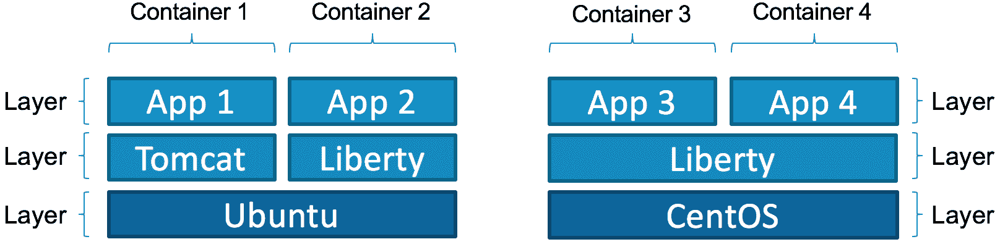
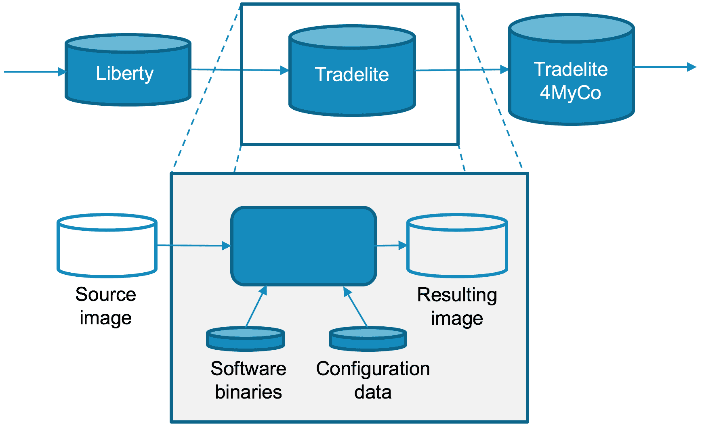
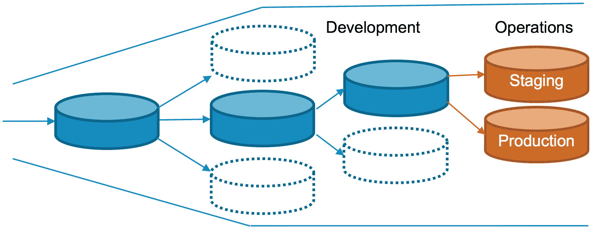

# 使用中间件功能构建和扩展 Docker 容器镜像

> 原文：[`developer.ibm.com/zh/tutorials/mw-1608-tost-trs/`](https://developer.ibm.com/zh/tutorials/mw-1608-tost-trs/)

为了将 IT 环境过渡到云，企业正在使用容器技术，主要是 Docker 容器。此方法有助于简化资源使用，进一步自动化操作流程。与此同时，需要提供多个服务来支持企业级业务应用程序，也就是现有的中间件功能。这些服务可在一个受控、托管的应用服务器环境中应用于集成、消息传递、API 或托管应用程序。

但要运行 Docker 容器，必须有一个镜像。本教程将介绍如何创建和扩展包含中间件功能的 Docker 镜像，以便可以添加利用了 Docker 镜像分层的应用程序。

## Docker 镜像内部结构

拥有 Docker 容器镜像的概念，类似于您必须指定一个镜像才能启动新的虚拟机。但是，Docker 镜像在以下方面有所不同：

*   依据 [Docker 镜像规范](https://github.com/docker/docker/blob/master/image/spec/v1.md) ，它们是 “根文件系统更改和在容器运行时中使用的相应执行参数的有序集合”。
*   它们支持多个堆叠的层，其中每层将自己的更改和参数添加到它所在的镜像上。

Docker 镜像是只读的。当 Docker 从镜像运行容器时，它会在该镜像上添加一个只读层（通过使用联合文件系统），然后应用程序可在该层中运行。

此外，根据定义，每个 Docker 镜像都可以扩展。您可以向现有镜像添加更多层来创建自己的镜像。您应该采用便于通过添加更多层来自定义镜像的方式来设计每个镜像。

在部署新的 Docker 容器时，可以指定想要用于该容器的镜像的名称和标签。Docker 主机检查本地是否存在该镜像。如果不存在，Docker 主机会下载这个特定镜像所需的所有层。如果一些层在镜像之间共享，它们绝不会被下载两次。例如，您希望运行一个包含 WordPress 的容器和另一个包含 MySQL 的容器。两个容器都基于某个基础 Ubuntu 镜像，而且组成该 Ubuntu 镜像的层仅被下载一次。这种拆分为层的方法使 Docker 镜像更容易获得，因为 Docker 镜像不是一个大型、独体式文件。

Docker 镜像也可以在 Docker 主机之间完整地移植，无论主机运行的操作系统是什么（哪怕是在裸机服务器上运行），只要主机在相同的硬件架构上运行。也就是说，基于 x86 的 Docker 镜像只能在该架构上的 Docker 主机上运行。例如，它不会在基于 IBM® POWER® 服务器的主机上运行。

尽管 Docker 镜像只能包含运行操作系统所需的文件，但需要避免将 “空镜像” 部署到容器中。容器应代表一个应用程序，或者至少代表应用程序的一部分，例如一个微服务。举例而言，您不应部署一个运行 Ubuntu 的容器，然后尝试远程登录它来手动安装其他软件。 [Docker 中心](https://hub.docker.com/) 上的 Ubuntu 镜像已经成为最流行的镜像之一，而且这种趋势还在继续。但是，它通常被用作其他拥有更高级功能的镜像的基础。

类似地，Docker 容器也应仅运行一个进程。也就是说，每个 Docker 镜像必须定义一个在容器启动时运行的可执行命令。此命令启动容器提供的应用程序或服务。您可以指定向此命令传递额外的参数，或者在启动容器时定义自己的命令，这将在 Docker 镜像自定义 部分进行解释。

## Dockerfile

新的 Docker 镜像是使用一个名为 *Dockerfile* 的文件构建的，该文件指定的元素包括但不限于：

*   新镜像所基于的基础镜像，因为它继承了基础镜像的所有层
*   需要复制到新镜像的文件
*   新镜像应公开的网络端口
*   应在构建新镜像时运行的 [命令](https://docs.docker.com/engine/reference/builder/) ，比如安装额外的包
*   可在使用该镜像启动容器时设置的环境变量
*   在容器启动时运行的命令

Dockerfile 传递给用于构建新镜像的 `docker build` 命令。下面的示例给出了一个简单的 Dockerfile，它定义一个基于 Ubuntu 的镜像，公开端口 80，并运行一个自定义 shell 脚本：

```
FROM ubuntu
EXPOSE 80
COPY myscript.sh /usr/local/bin/
CMD ["myscript.sh"] 
```

可 [在 GitHub 中找到 Docker 镜像](https://github.com/docker/docker/wiki/Public-docker-images) 的更多真实示例。 [Docker 网站](https://docs.docker.com/engine/userguide/eng-image/dockerfile_best-practices/) 、 [Project Atomic 网站](http://docs.projectatomic.io/container-best-practices/) 和一些其他网站提供了构建良好的 Dockerfile 的最佳实践。

通过使用 Dockerfile，您可以向一个镜像添加扩展点，也可通过这种方式自定义容器，而无需每次构建一个新镜像。例如，您可以在部署时向容器中传递环境变量，然后这些变量可以影响容器内的一些逻辑。您可以通过多种方式扩展和自定义容器的行为，其中一种方式是使用 Dockerfile [构建新镜像](https://docs.docker.com/engine/tutorials/dockerimages/) 。有关这些示例的更多信息，请参阅 示例用例 节。

## 在容器中运行中间件

Docker 镜像应表示一个应用程序或服务，而不是操作系统。Docker 镜像包含最少的操作系统库。一个最好的示例就是 Ubuntu 镜像，它是一个基础镜像，目的是用于扩展而不是在容器中运行。

基础操作系统与应用程序之间有一个中间层，称为 *中间件* 。中间件的最常见示例是应用服务器或消息环境。例如，如果您想在 Docker 化环境的上下文中利用中间件，必须创建包含该中间件作为附加层的 Docker 镜像。但是，这些镜像的目的不是最终部署到容器中。您应该通过某种方式构建它们，使得可通过实际应用程序轻松扩展中间件。

下图展示了容器如何使用有多层组成的 Docker 镜像，这些层涵盖操作系统和中间件部件，但最终会托管一个应用程序。



一些中间件 Docker 镜像的作用，仅是用作添加该应用程序的容器的基础。因此，您可以在此上下文中定义两个相关的角色：

*   中间件提供者，它将相关的软件包添加到基础镜像，而且可能执行一些初步配置
*   应用程序提供者，将它添加到中间件镜像中的方式是，安装一个应用程序并执行任何可能需要的额外配置

最终，中间件的 Docker 镜像必须提供方便添加应用程序的合适扩展点。展示实现此目标的各种方法是本教程的重点之一。

## 示例用例

为了演示这种镜像重用和扩展的想法，可考虑一些构建在彼此之上的镜像，从中间件一直到某个适合生产应用程序部署的镜像。此描述中使用了 IBM® WebSphere® Liberty 和 Tradelite 示例。在此场景中，多方都做出了贡献。Docker 镜像是一种具有附加价值的资产，这些价值可以转移到团队或组织，然后后者进一步自定义该镜像，再提供给另一个团队或组织，如下图所示。



此示例使用以下镜像：

*   **WebSphere Liberty。** 此镜像由 IBM 团队构建，提供了应用服务器中间件。此镜像本身是一个包含所需的操作系统文件系统的基础镜像的扩展。
*   **Tradelite。** 此镜像由一个独立解决方案供应商生成。它提供了核心应用程序功能，同时保留了对云的中立性。
*   **Tradelite4MyCo。** 此镜像提供了特定于虚构的 MyCo 云的应用程序定制。

在构建镜像时，镜像开发人员必须考虑下游对该镜像的使用，以及目标受众。Docker 镜像的生命周期有多个插入点，这个发现流程中使用了以下这些插入点：镜像构建、容器创建和容器运行时。下一节将介绍与这些插入点相关的常见使用模式。然后，这些模式被应用于示例用例。

## Docker 镜像自定义

Docker 提供了多种方式来操纵容器进程的行为，可以向进程本身提供输入，或者编辑可能由进程读取的文件系统内容。在任何情况下，适用于特定容器的机制决定了某个特定机制或容器化的进程的独特方面。

### 环境变量

环境变量是提供默认参数值的最常见和灵活的方式，这些值可在以后在下一个镜像层中覆盖，或者在创建容器时覆盖。

要在构建镜像时定义环境变量，可使用 ENV Dockerfile 指令：

```
ENV myName="John Doe" myDog=Rex\ The\ Dog \
   myCat=fluffy 
```

如果后来在 Dockerfile 或一个扩展 Dockerfile 中指定了同一个环境变量，则会覆盖以前的值。然后，会建立一个新环境变量并持久保存到镜像中。 环境变量 还可以在创建容器时设置：

```
docker run – e "myName=\"Bob\" 
```

环境变量有一些使用限制。首先，此机制最适合简单的数据值，在传递结构化数据时可能增加负担。一个可能的解决办法是 [从简单的变量名称映射到容器进程中的结构化内容](https://docs.docker.com/registry/configuration/) 。第二个限制是，环境变量可在构建镜像时或创建容器时提供，但它们不能在创建容器后动态操作。如果您在运行时修改环境变量，必须销毁容器并使用一个不同的值重新创建它。环境变量可能显示在日志文件中。因此，它们可能不是将秘密传递给容器进程的最佳选择。

### 命令行参数

Docker 将传统上的进程命令行分解为两部分：入口点和命令。入口点表示要启动的进程，命令由提供给该进程的参数组成。例如，一个基础操作系统镜像中的常见入口点是 `/bin/bash – c` 代码，命令行可能是 `ls` 。启动这样一个容器的结果是运行进程：

```
/bin/bash – c ls 
```

类似于环境变量，入口点和命令参数可由 Dockerfile 指令提供或在创建容器时提供。但是，特定进程的命令行接口 (CLI) 通常具有明确的定义。因此，它的最常见用途是更改目标进程特征，而不是用作将参数发送给特定容器的机制。一些软件（比如 WebSphere Liberty）可识别一些命令行参数，保留文件以提供应用程序二进制文件和与应用程序相关的配置数据。

### 文件和卷

前面已经提到过，容器有一个分层文件系统。您可以在镜像层中或在运行的容器实例中添加文件或编辑内容。然后在捕获该层时会记录这些修改。

Docker 构建流程提供了两种机制来将文件添加到容器文件系统中：ADD 和 COPY。ADD 保留在 Docker 编译版所理解的指令集中。但是，COPY 是首选指令，因为它的使用更容易理解，而且人们认为它的使用更加透明。

要使用 COPY 指令，可在 Dockerfile 中指定一个来源和目标：

```
COPY [source] [destination] 
```

Docker 也提供了数据卷，数据卷具有与容器本身不同的生命周期。数据卷不使用分层文件系统，这对经常读取和写入的数据很有利。这些卷通过挂载到主要的分层文件系统中，而从容器中使用。这种挂载模糊化了该目录点上的任何分层数据。

您可以使用 VOLUME 指令从 Dockerfile 声明一个卷。从 Dockerfile 声明卷的独特特征是，在 VOLUME 指令后创建容器时，会将数据从分层容器文件系统复制到新创建的卷。

使用 VOLUME 指令具有多种影响：

*   卷不能在创建后删除。如果卷对下游扩展镜像没有意义，可以将卷的创建延迟到以后。
*   Docker 编译版为 Dockerfile 中的每个指令创建了一个新容器。结果是数据从分层容器文件系统传输到新卷中，这可能降低 VOLUME 指令后的 Docker 编译版的性能。
*   在 VOLUME 指令后的层中，无法再访问分层文件系统。在卷中的目录中添加或修改的任何文件都不会被保留。

也可以使用 Docker `volume` 命令或 `– v` 运行时开关创建卷：

```
docker run – v [volume]:[path] 
```

将卷的创建延迟到最接近使用它时的时间，无论这是意味着在最接近要运行的层的层中使用 Dockerfile 指令，还是意味着让操作员创建卷。

## 应用自定义

您现在应该基本了解 Docker 如何持久保存和使用环境变量、命令行参数，以及镜像构建、容器创建和容器运行时之间的镜像层。接下来，我们将在一个示例场景中看看如何应用此信息。

Tradelite 是一个 Java® Enterprise Edition (Java EE) 应用程序，它需要一个应用服务器来提供所需的功能。WebSphere Liberty 在此场景中提供了应用服务器功能。

尽管一个 Dockerfile 可以表示从基础操作系统到应用程序的整个软件栈，但这种用法通常很难维护，而且没有考虑到单独企业的多次贡献。相反，首选的方法是将整个 Dockerfile 指令集分解为构建基块。每个基块都可以独立构建。输出添加了标签以便重用，每个 Dockerfile 和二进制镜像都可以在独立的源代码控制和注册表系统中保存和维护。

### 基础镜像选择

Docker 容器只是一个在主机上启动的进程，但它会引起一些特殊行为。其中一种行为就是可视文件系统，它在主机文件系统不可见时通过容器镜像进行表示。因为容器进程在挂载镜像文件系统后启动，所以镜像文件系统至少必须包含目标可执行文件。但是，它可以包含额外的可执行文件，供在容器启动后从 Dockerfile 或从 `docker exec` 命令使用。也就是说，Docker 基础镜像不是一个操作系统，它可能是一个足以充当操作系统的虚拟子集。

对于 WebSphere Liberty，进程引导程序由一个 shell 脚本触发，并启动一个 Java 运行时环境 (JRE)。要支持该 shell，需要选择一个包含 shell 环境的基础镜像。您还需要提供一些 Linux 共享库来启动该进程（比如 libpthread、libc 和 ld-linux）。

本教程中的示例场景使用了 Liberty Docker 镜像，可以在 [Docker 中心](https://hub.docker.com/_/websphere-liberty/) 或 [IBM Containers](https://new-console.ng.bluemix.net/docs/containers/container_images_adding_ov.html#container_images_pulling) 中找到该镜像。考虑容器进程主要使用的库由 Linux 内核维护，而且在所有精心维护的 Linux 发行版中保持一致，我们不需要重新构建此镜像来选择不同的基础操作系统。如果在目标环境中的其他 Java EE 应用程序中重用此镜像，结果是 Java EE 镜像之间更加一致，对大容量存储和传输带宽的使用效率更高。

### 声明卷

WebSphere Liberty 镜像拥有广泛的目标用户。因此，此镜像的一个重要特征是，在此镜像中执行的任何操作都可以在后续的 Dockerfile 中撤销或替换。前面已经提到，不能在创建卷后删除它。出于这个原因，WebSphere Liberty 团队选择不声明任何卷，将选择权留给扩展者或操作员。包含已知事务数据的卷（比如日志）是在最后的镜像中声明的，也可以延迟到创建运行时的时候。

### 添加软件二进制文件和配置数据

在我们的示例场景中的每个 Dockerfile 中，我们可能需要添加一些软件二进制文件。我们可以使用 ADD 或 COPY 指令将它们添加到镜像中。我们更喜欢使用 COPY 指令，因为它更简单且拥有我们熟悉的语法。

添加二进制文件通常很简单。每一层可能添加更多二进制文件或替换现有二进制文件。因此，您应该不需要编辑二进制文件，或者在运行时直接影响它的磁盘内容。始终将远程获取的任何软件二进制文件嵌入到镜像中。正在运行的容器不应下载二进制更新，而应尝试保持二进制内容是等幂的 (idempotent)。如果二进制文件需要更新，可提供一个新镜像来实现此目标。

配置数据存在一些不太可能在二进制数据中遇到的困难。我是否应通过镜像提供配置？后续镜像层是否应替换配置数据？如何在运行时提供配置数据？

在我们的示例中，大部分配置内容都与 WebSphere Liberty server.xml 文件和它的相应文件集相关。此内容一部分必须在后续层中提供。例如，我们可能需要声明一个 EAR 文件，并包含与该 EAR 文件关联的部署属性，但其他内容可能与部署环境相关，比如数据库连接信息。

操作员稍微容易定义环境变量一些。因此，操作员应使用环境变量来定义数据。还应在提供二进制文件的同时提供应用程序部署元素。这些文件通过在 Docker 编译版中编辑或提供 server.xml 内容来配置。

然后使用 Dockerfile 添加一个自定义 server.xml 文件：

```
COPY ./server.xml /opt/ibm/wlp/usr/servers/defaultServer/server.xml 
```

server.xml 文件配置应用程序 EAR 文件，向操作员显示数据库的环境变量：

```
 <application name="tradelite" context-root="/" location="trade.war" type="war"/>

     <dataSource id='db2' jdbcDriverRef='db2-driver' jndiName='jdbc/TradeDataSource' statementCacheSize='30' transactional='true'>
        <properties.db2.jcc id='db2-props' databaseName='${env.DB2_DATABASE}'
                 user='DB2_USER' password='${env.DB2_PASS}'
                 portNumber='${env.DB2_PORT}' serverName='${env.DB2_HOST}'/>
    </dataSource>
    <jdbcDriver id='db2-driver' libraryRef='db2-library'/>
    <library id='db2-library'>
        <fileset id='db2-fileset' dir='${server.config.dir}/lib' includes='db2jcc.jar'/>
    </library> 
```

server.xml 文件向操作员显示了以下环境变量：

*   DB2_USER
*   DB2_PASS
*   DB2_PORT
*   DB2_HOST

在本例中，尽管环境变量不是传递秘密的理想方式，但环境变量有利于优先注重其他配置设置与简单性的并行实现，而不是模糊化文件中的密码参数。

### 镜像中特定于环境的配置的位置

环境变量机制适合简单值，但如何对结构化数据进行复杂的运行时配置呢？该数据类型的一个适用于 WebSphere Liberty 的示例是轻型目录访问协议 (LDAP) 配置和传输层安全 (TLS) 配置。可以像之前一样，将此数据的一部分映射到环境变量。但是，具体地讲，TLS 秘密和证书几乎总是通过文件机制提供。

目前，处理文件内容的最简单方法是将它直接添加到镜像中。但是，这可能破坏应用程序镜像的云可移植性，在将秘密数据添加到镜像时暴露出漏洞。Docker 注册表不是秘密数据（比如服务器私钥）的合适存储位置。始终在运行时直接提供此数据。

在每种情况下，都需要确定通过这种镜像扩展机制还是使用运行时卷来提供复杂的配置数据。无论哪种方法适合当前情形，您都有可能过度扩展 Docker 镜像。也就是说，绝不将一个镜像与特定用法捆绑在一起，以至于每个操作实例都需要一个独立的镜像，如下图所示。



## 结束语

在本教程中，您学习了如何构建 Docker 镜像，尤其是在使用中间件对应用程序应用企业级功能的背景下。这些中间件 Docker 镜像必须能够从下往上扩展，可以认为它们始终将用作中间格式，您可以向其中添加具体的应用程序。

可通过多种机制扩展 Docker 镜像。例如，可使用 Dockerfile 在现有 Docker 镜像之上创建一个新镜像，使用各种方法更改和镜像结果 Docker 容器。理想情况下，您应该基于本教程中提供的最佳实践和指南，混合使用这些机制。

本文翻译自：[Build and extend Docker container images with middleware functions](https://developer.ibm.com/tutorials/mw-1608-tost-trs/)（2016-11-07）