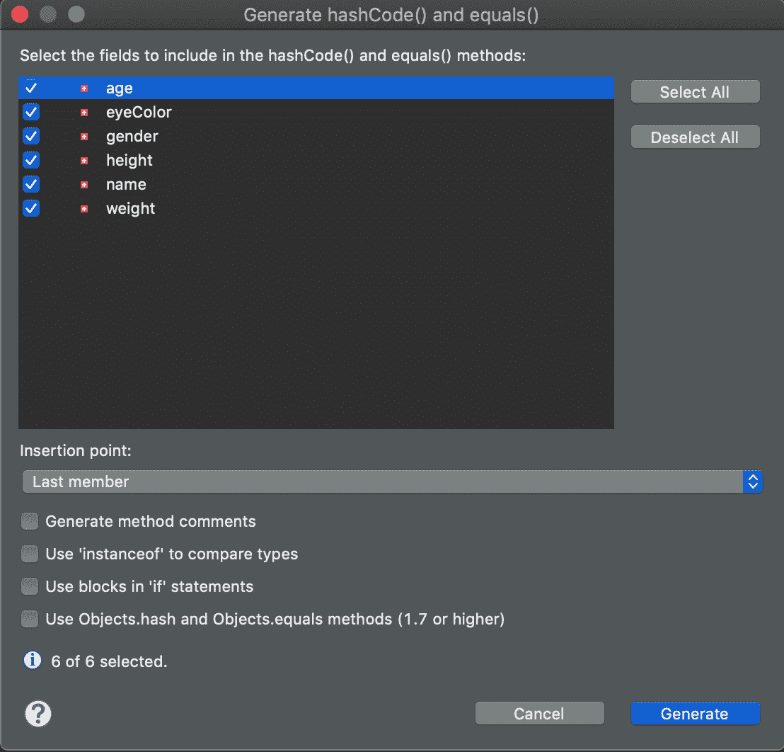

# 构造真实的应用程序，第 1 部分

> 原文：[`developer.ibm.com/zh/tutorials/java-language-constructs-1/`](https://developer.ibm.com/zh/tutorials/java-language-constructs-1/)

## 开始之前

本教程是 *Java 编程入门* 系列的一部分。

| 级别 | 主题 | 类型 |
| --- | --- | --- |
| 101 | 设置您的 Java 开发环境并学习基本的面向对象编程的原理 | 教程 |
| 102 | Java 语言基础 | 教程 |
| 103 | 编写良好的 Java 代码 | 教程 |
| **201** | **构造真实的应用程序，第 1 部分** | 教程 |
| 202 | 构造真实的应用程序，第 2 部分 | 教程 |

尽管各单元中讨论的概念具有独立性，但实践组件是在您学习各单元的过程中逐步建立起来的，推荐您在继续学习之前复习前提条件、设置和单元细节。

## 目标

Java 语言非常成熟和复杂，可帮助您完成几乎任何编程任务。本教程介绍了在处理复杂的编程场景时所需的 Java 语言特性，包括：

*   异常处理
*   继承和抽象
*   接口
*   嵌套类

## 前提条件

本教程的内容适合不熟悉 Java 语言中各种更复杂特性的初级 Java 语言程序员。本教程假设您已有：

*   Java 开发环境（如果您还没有，阅读配置说明）
*   基本了解了 Java 平台上的 OOP 编程原理
*   通读了 “Java 语言基础” 开启编程项目，在本教程中您将继续开发。

## 对象的后续处理

Java 语言基础介绍了 `Person` 类，这个类比较有用，但尚未达到它应有的实用程度。在这里，您将开始学习用各种技术增强一个类（比如 `Person`），首先学习以下技术：

*   重载方法
*   覆盖方法
*   将一个对象与另一个对象进行比较
*   让代码更易于调试

您将开始通过重载某个方法来增强`Person`。

### 重载方法

创建两个具有相同名称，但具有不同参数列表（即不同数量或类型的参数）的方法时，就拥有了一个 *重载* 方法。在运行时，Java 运行时环境（JRE；也称为 Java 运行时）根据传递给它的参数来决定调用哪个重载方法的变体。

假设 `Person` 需要两个方法来打印其当前状态的审计结果。我将这些方法命名为 `printAudit()`。将清单 1 中的重载方法粘贴到 Eclipse 编辑器视图中的 `Person` 类中：

##### 清单 1\. `printAudit()`：一个重载方法

```
public void printAudit(StringBuilder buffer) {
  buffer.append("Name="); buffer.append(getName());
  buffer.append(","); buffer.append("Age="); buffer.append(getAge());
  buffer.append(","); buffer.append("Height="); buffer.append(getHeight());
  buffer.append(","); buffer.append("Weight="); buffer.append(getWeight());
  buffer.append(","); buffer.append("EyeColor="); buffer.append(getEyeColor());
  buffer.append(","); buffer.append("Gender="); buffer.append(getGender());
}
public void printAudit(Logger l) {
  StringBuilder sb = new StringBuilder();
  printAudit(sb);
  l.info(sb.toString());
} 
```

您有 `printAudit()` 的两个重载版本，并且一个版本甚至使用了另一个版本。通过提供两个版本，让调用方能够选择如何打印类的审计结果。根据所传递的参数，Java 运行时会调用正确的方法。

使用重载方法时，记住这两条重要的规则：

*   不能仅通过更改一个方法的返回类型来重载该方法。
*   不能有两个名称和参数列表都相同的方法。

如果违背这些规则，编译器会发出错误信息。

### 覆盖方法

如果一个类的另一个子类提供了父类中已定义方法的自有实现，就称为 *方法覆盖* 。要了解方法覆盖有何用处，需要在 `Employee` 类上执行一些操作。请观看下面的视频，了解如何设置 `Employee` 类和在该类中执行方法重写。观看视频之后，我将更详细地分析该代码，同时简要复述一下这些步骤。

该视频还演示了如何重写 `equals()` 方法和自动生成 `equals()` 和 `hashCode()` 类，我将在本单元的比较对象部分详细介绍这些操作。

[https://cdnapisec.kaltura.com/p/1773841/sp/177384100/embedIframeJs/uiconf_id/44854321/partner_id/1773841?iframeembed=true&playerId=kplayer&entry_id=0_v5349q23&flashvars[streamerType]=auto](https://cdnapisec.kaltura.com/p/1773841/sp/177384100/embedIframeJs/uiconf_id/44854321/partner_id/1773841?iframeembed=true&playerId=kplayer&entry_id=0_v5349q23&flashvars[streamerType]=auto)

#### Employee：Person 的一个子类

回想在前面教程中您学习过基本的 OOP 编程原理，`Employee` 可以是 `Person` 的一个子类（或 *孩子* ），但拥有额外的属性，如纳税人识别编号、员工编号、招聘日期和工资。

要在一个名为 Employee.java 的文件中声明这样一个类，可在 Eclipse 中右键单击 `com.makotojava.intro` 包。单击 **New > Class…** 打开 New Java Class 对话框，如图 1 所示。

##### 图 1\. New Java Class 对话框


输入 `Employee` 作为该类的名称， `Person` 作为它的超类，然后单击 **Finish** 。可在编辑窗口中看到 `Employee` 类。您没有明确要求声明一个构造函数，但仍然实现了两个构造函数。首先，确保 `Employee` 类编辑窗口是当前窗口，然后转到 **Source > Generate Constructors from Superclass…**。 此时会看到一个对话框，可在其中选择要实现的构造函数，如图 2 所示。选择两个构造函数并单击 **OK**。

##### 图 2\. Generate Constructors from Superclass 对话框


Eclipse 会为您生成这些构造函数。现在拥有一个与清单 2 类似的 `Employee` 类。

##### 清单 2\. 改进后的新 `Employee` 类

```
package com.makotojava.intro;

public class Employee extends Person {

  public Employee() {
    super();
    // TODO Auto-generated constructor stub
  }

  public Employee(String name, int age, int height, int weight,
  String eyeColor, String gender) {
    super(name, age, height, weight, eyeColor, gender);
    // TODO Auto-generated constructor stub
  }

} 
```

#### Employee 继承了 Person

从清单 3 中的第 7 行至第 9 行可以看到， `Employee` 继承了它的父类 `Person` 的属性和行为，同时也拥有自己的一些属性和行为。

##### 清单 3\. 包含 `Person` 属性的 `Employee` 类

```
package com.makotojava.intro;

import java.math.BigDecimal;

public class Employee extends Person {

  private String taxpayerIdentificationNumber;
  private String employeeNumber;
  private BigDecimal salary;

  public Employee() {
    super();
  }
  public String getTaxpayerIdentificationNumber() {
    return taxpayerIdentificationNumber;
  }
  public void setTaxpayerIdentificationNumber(String taxpayerIdentificationNumber) {
    this.taxpayerIdentificationNumber = taxpayerIdentificationNumber;
  }

  // Other getter/setters...
} 
```

不要忘记为新属性生成 getter 和 setter。[第 1 部分](http://www.ibm.com/developerworks/cn/java/j-introtojava1/index.html) 中介绍了如何完成该操作。

#### 方法覆盖：printAudit()

现在正如我所承诺的，可以练习覆盖方法了。 您要覆盖 `printAudit()` 方法（参见清单 1 ），该方法可格式化 `Person` 实例的当前状态。 `Employee` 继承了 `Person` 的行为。如果实例化 `Employee`，设置它的属性，然后调用 `printAudit()` 的一个重载方法，则调用会成功完成。但是，生成的审计结果不会全面代表一个 `Employee` 。问题在于，`printAudit()` 无法格式化特定于 `Employee` 的属性，因为 `Person` 不知道这些属性。

解决方案是覆盖可将 `StringBuilder` 作为参数的 `printAudit()` 的重载方法，并添加代码来打印特定于 `Employee` 的属性。

要在 Eclipse IDE 中实现此解决方案，确保已在编辑器窗口中打开或已在 Project Explorer 视图中选择了 `Employee`。然后转到 **Source > Override/Implement Methods…**，此时会看到一个对话框（如图 3 所示），选择 `printAudit()` 的 `StringBuilder` 重载方法，如图 3 所示，然后单击 **OK**。

##### 图 3\. Override/Implement Methods 对话框


Eclipse 会生成方法存根，然后您可填写剩余的部分，类似这样：

```
@Override
public void printAudit(StringBuilder buffer) {
  // Call the superclass version of this method first to get its attribute values
  super.printAudit(buffer);
  // Now format this instance's values
  buffer.append("TaxpayerIdentificationNumber=");
  buffer.append(getTaxpayerIdentificationNumber());
  buffer.append(","); buffer.append("EmployeeNumber=");
  buffer.append(getEmployeeNumber());
  buffer.append(","); buffer.append("Salary=");
  buffer.append(getSalary().setScale(2).toPlainString());
} 
```

注意对 `super.printAudit()` 的调用。您在这里所做的是要求 (`Person`) 超类向 `printAudit()` 显示其行为，然后使用 `Employee` 类型的 `printAudit()` 行为来扩充它。

不需要首先调用 `super.printAudit()`，首先打印这些属性似乎是个不错的主意。事实上，您根本不需要调用 `super.printAudit()`。如果不调用它，就必须在 `Employee.printAudit()` 方法中自行格式化来自 `Person` 的属性。

### 比较对象

Java 语言提供了两种方式来比较对象：

*   `==` 运算符
*   `equals()` 方法

#### 使用 `==` 比较对象

`==` 语法比较对象是否相等，只有在 `a` 和 `b` 拥有相同的值时，`a == b` 才返回 `true`。对于对象，需要两个对象引用 *同一个对象实例* 。对于原语，需要 *它们的值相等* 。

假设您为 `Employee` 生成一个 JUnit 测试（您已在 Java 语言基础中的 “您的第一个 Java 类” 部分了解了如何做）。清单 4 中显示了 JUnit 测试。

##### 清单 4\. 使用 `==` 比较对象

```
public class EmployeeTest {
  @Test
  public void test() {
    int int1 = 1;
    int int2 = 1;
    Logger l = Logger.getLogger(EmployeeTest.class.getName());

    l.info("Q: int1 == int2?           A:" + (int1 == int2));
    Integer integer1 = Integer.valueOf(int1);
    Integer integer2 = Integer.valueOf(int2);
    l.info("Q:Integer1 == Integer2?   A:" + (integer1 == integer2));
    integer1 = new Integer(int1);
    integer2 = new Integer(int2);
    l.info("Q:Integer1 == Integer2?   A:" + (integer1 == integer2));
    Employee employee1 = new Employee();
    Employee employee2 = new Employee();
    l.info("Q:Employee1 == Employee2?A:" + (employee1 == employee2));
  }
} 
```

如果在 Eclipse 中运行清单 4 的代码（在 Project Explorer 视图中选择 `Employee`，然后选择 **Run As > JUnit Test**），输出应该是：

```
Sep 18, 2015 5:09:56 PM com.makotojava.intro.EmployeeTest test
INFO:Q: int1 == int2?           A: true
Sep 18, 2015 5:09:56 PM com.makotojava.intro.EmployeeTest test
INFO:Q:Integer1 == Integer2?   A: true
Sep 18, 2015 5:09:56 PM com.makotojava.intro.EmployeeTest test
INFO:Q:Integer1 == Integer2?   A: false
Sep 18, 2015 5:09:56 PM com.makotojava.intro.EmployeeTest test
INFO:Q:Employee1 == Employee2?A: false 
```

在清单 4 中的第一种情况下，原语的值相同，所以 `==` 运算符返回 `true`。在第二种情况下，`Integer` 对象引用相同的实例，所以 `==` 同样返回 `true`。在第三种情况下，尽管 `Integer` 对象包含相同的值，但 `==` 返回 `false`，因为 `integer1` 和 `integer2` 引用了不同的对象。可将 `==` 视为对”相同对象”进行一种测试。

#### 使用 equals() 比较对象

`equals()` 是每种 Java 语言对象都可自由使用的方法，因为它被定义为 `java.lang.Object`（每个 Java 对象都继承自该对象）的一个实例方法。

可像使用其他任何方法那样调用 `equals()` ：

```
a.equals(b); 
```

这条语句调用对象 `a` 的 `equals()` 方法，向它传递对象 `b` 的引用。默认情况下，Java 程序会使用 `==` 语法简单地检查两个对象是否相同。因为 `equals()` 是一个方法，但是可以被覆盖。将清单 4 中的 JUnit 测试案例与清单 5 中的测试案例（我称之为 `anotherTest()`）进行比较，后者使用 `equals()` 来比较两个对象：

##### 清单 5\. 使用 `equals()` 比较对象

```
@Test
public void anotherTest() {
  Logger l = Logger.getLogger(Employee.class.getName());
  Integer integer1 = Integer.valueOf(1);
  Integer integer2 = Integer.valueOf(1);
  l.info("Q: integer1 == integer2 ?A:" + (integer1 == integer2));
  l.info("Q: integer1.equals(integer2) ?A:" + integer1.equals(integer2));
  integer1 = new Integer(integer1);
  integer2 = new Integer(integer2);
  l.info("Q: integer1 == integer2 ?A:" + (integer1 == integer2));
  l.info("Q: integer1.equals(integer2) ?A:" + integer1.equals(integer2));
  Employee employee1 = new Employee();
  Employee employee2 = new Employee();
  l.info("Q: employee1 == employee2 ?A:" + (employee1 == employee2));
  l.info("Q: employee1.equals(employee2) ?A :" + employee1.equals(employee2));
} 
```

运行清单 5 的代码会生成：

```
Sep 19, 2015 10:11:57 AM com.makotojava.intro.EmployeeTest anotherTest
INFO:Q: integer1 == integer2 ?A: true
Sep 19, 2015 10:11:57 AM com.makotojava.intro.EmployeeTest anotherTest
INFO:Q: integer1.equals(integer2) ?A: true
Sep 19, 2015 10:11:57 AM com.makotojava.intro.EmployeeTest anotherTest
INFO:Q: integer1 == integer2 ?A: false
Sep 19, 2015 10:11:57 AM com.makotojava.intro.EmployeeTest anotherTest
INFO:Q: integer1.equals(integer2) ?A: true
Sep 19, 2015 10:11:57 AM com.makotojava.intro.EmployeeTest anotherTest
INFO:Q: employee1 == employee2 ?A: false
Sep 19, 2015 10:11:57 AM com.makotojava.intro.EmployeeTest anotherTest
INFO:Q: employee1.equals(employee2) ?A : false 
```

#### 关于比较 Integer 的说明

在清单 5 中，如果 `==` 返回 `true`，`Integer` 的 `equals()` 方法就会返回 `true`，对此不应感到奇怪。但请注意第二种情况中发生的事情，在其中创建了都包含值 `1` 的不同对象：`==` 返回 `false`，因为 `integer1` 和 `integer2` 引用不同的对象；但 `equals()` 却返回 `true`。

JDK 的编写者认为，对于 `Integer`， `equals()` 的含义与默认含义不同（回想一下，默认含义是比较对象引用，看看它们是否引用同一个对象）。对于 `Integer`，在底层的 `int` 值相同时，`equals()` 返回 `true`。

对于 `Employee`，您没有覆盖 `equals()`，所以（使用 `==` 的）默认行为返回了您期望的结果，因为 `employee1` 和 `employee2` 引用不同的对象。

然后，对于所编写的任何对象，可定义适合所编写应用程序的 `equals()` 含义。

#### 覆盖 equals()

可通过覆盖 `Object.equals()` 的默认行为，定义 `equals()` 对于应用程序对象的含义。同样，也可使用 Eclipse 完成此任务。确保 `Employee` 拥有 Eclipse IDE 源代码窗口中的焦点，然后转到 **Source > Override/ImplementMethods**。此时打开图 4 中所示的对话框。

##### 图 4\. Override/Implement Methods 对话框


您之前使用过这个对话框，但在本例中，我们要实现 `Object.equals()` 超类方法。所以在方法列表中找到要覆盖或要实现的 `Object`，选择 `equals(Object)` 方法，然后单击 **OK**。Eclipse 生成正确的代码并将它放在源文件中。

如果两个 `Employee` 对象的状态相等，则这两个对象相等，这样就有意义了。也就是说，如果它们的值 — 姓氏、名字、年龄 — 相同，那么它们就相等。

#### 自动生成 equals()

Eclipse 可根据您为一个类所定义的实例变量（属性）来生成一个 `equals()` 方法。因为 `Employee` 是 `Person` 的子类，所以首先为 `Person` 生成 `equals()`。在 Eclipse 的 Project Explorer 视图中，右键单击 `Person` 并选择 **Generate hashCode() and equals()** ，打开图 5 中所示的对话框，选择要在 `hashCode()` 和 `equals()` 方法中包含哪些属性。

##### 图 5\. Generate hashCode() and equals() 对话框



选择所有属性（如图 5 所示）后单击 **OK**。Eclipse 生成一个与清单 6 中所示内容类似的 `equals()` 方法。

##### 清单 6\. Eclipse 生成的 `equals()` 方法

```
@Override
public boolean equals(Object obj) {
  if (this == obj)
    return true;
  if (obj == null)
    return false;
  if (getClass() != obj.getClass())
    return false;
  Person other = (Person) obj;
  if (age != other.age)
    return false;
  if (eyeColor == null) {
    if (other.eyeColor != null)
      return false;
  } else if (!eyeColor.equals(other.eyeColor))
    return false;
  if (gender == null) {
    if (other.gender != null)
      return false;
  } else if (!gender.equals(other.gender))
    return false;
  if (height != other.height)
    return false;
  if (name == null) {
    if (other.name != null)
      return false;
  } else if (!name.equals(other.name))
    return false;
  if (weight != other.weight)
    return false;
  return true;
} 
```

Eclipse 生成的 `equals()` 方法看起来很复杂，但它的操作很简单：如果传入的对象与清单 8 中的对象相同，则 `equals()` 返回 `true`。如果传入的对象为 null（表示缺失），则返回 `false`。

接下来，该方法检查 `Class` 对象是否相同（意味着传入的对象必须是一个 `Person` 对象）。如果它们相同，会检查已传入对象的每个属性值，查看它是否与给定 `Person` 实例的状态逐值匹配。如果属性值为 null，`equals()` 会检查尽可能多的次数，如果这些值匹配，则认为这些对象相等。您可能不希望每个程序都具有这种行为，但它适用于大多数用途。

### 练习

现在，在 Eclipse 中执行两个引导式练习，以便进一步完善 `Person` 和 `Employee`。

<h4 id=”练习” 1-为-code-employee-code-生成一个-code-equals-code>练习 1：为 “Employee” 生成一个 “equals()”

尝试执行自动生成 `equals()` 中的操作步骤，为 `Employee` 生成一个 `equals()`。生成 `equals()` 后，添加下面这个 JUnit 测试案例（我将它称为 `yetAnotherTest()` ）：

```
@Test
public void yetAnotherTest() {
  Logger l = Logger.getLogger(Employee.class.getName());
  Employee employee1 = new Employee();
  employee1.setName("J Smith");
  Employee employee2 = new Employee();
  employee2.setName("J Smith");
  l.info("Q: employee1 == employee2?      A:" + (employee1 == employee2));
  l.info("Q: employee1.equals(employee2)?A:" + employee1.equals(employee2));
} 
```

如果运行该代码，应该看到以下输出：

```
Sep 19, 2015 11:27:23 AM com.makotojava.intro.EmployeeTest yetAnotherTest
INFO:Q: employee1 == employee2?      A: false
Sep 19, 2015 11:27:23 AM com.makotojava.intro.EmployeeTest yetAnotherTest
INFO:Q: employee1.equals(employee2)?A: true 
```

在本例中，单单 `Name` 上的一个匹配值就足以让 `equals()` 相信两个对象相等。尝试向此示例添加更多属性，看看会获得什么。

<h4 id=”练习” 2-覆盖-code-tostring-code>练习 2：覆盖 “toString()”

还记得本部分开头的 `printAudit()` 方法吗？如果您认为它的工作太困难了，那就对了。 将一个对象的状态格式化为 `String` 是一种常见的模式，以至于 Java 语言的设计者已在一个（意料之中的）名为 `toString()` 的方法中将它内置到 `Object` 自身中。 `toString()` 的默认实现不是很有用，但每个对象都有一个。在此练习中，您可让默认的 `toString()` 更有用。

如果认为 Eclipse 可为您生成一个 `toString()` 方法，那就对了。返回 Project Explorer 并右键单击 `Person` 类，然后选择 **Source > Generate toString()…**。此时会看到一个类似图 5 的对话框。选择所有属性并单击 **OK** 。现在对 `Employee` 执行相同的操作。 Eclipse 为 `Employee` 生成的代码如清单 7 所示。

##### 清单 7\. Eclipse 生成的 `toString()` 方法

```
@Override
public String toString() {
  return "Employee [taxpayerIdentificationNumber=" + taxpayerIdentificationNumber + ",
      employeeNumber=" + employeeNumber + ", salary=" + salary + "]";
} 
```

Eclipse 为 `toString` 生成的代码不包含超类的 `toString()` （ `Employee` 的超类为 `Person` ）。使用 Eclipse，可通过这个覆盖方法快速解决问题：

```
@Override
public String toString() {
  return super.toString() + "Employee [taxpayerIdentificationNumber=" + taxpayerIdentificationNumber +
    ", employeeNumber=" + employeeNumber + ", salary=" + salary + "]";
} 
```

添加 `toString()` 使 `printAudit()` 大大简化：

```
@Override
  public void printAudit(StringBuilder buffer) {
  buffer.append(toString());
} 
```

`toString()` 现在执行了主要的对象当前状态格式化工作，您只需将它返回的值放入 `StringBuilder` 并返回。

如果仅用于支持用途，我推荐您始终在类中实现 `toString()` 。几乎不可避免的是，在某个时刻，您想在应用程序运行时查看一个对象的状态是什么， `toString()` 是一个实现此目的很好的挂钩。

### 类成员

每个对象实例都拥有变量和方法，而且对于每个实例，准确的行为是不同的，因为它基于对象实例的状态。您在 `Person` 和 `Employee` 上拥有的变量和方法是 *实例* 变量和方法。要使用它们，必须实例化所需要的类，或者拥有对该实例的引用。每个对象实例都拥有变量和方法，而且对于每个实例，准确的行为会有所不同，因为这些行为基于对象实例的状态。

类也可以拥有 *类* 变量和方法（被称为 *类成员* ）。类变量使用 `static` 关键字声明。类变量与实例变量之间的区别在于：

*   类的每个实例共享一个类变量的单个副本。
*   您可在类本身上调用类方法，而无需拥有实例。
*   实例方法可访问类变量，但类方法无法访问实例变量。
*   类方法只能访问类变量。

何时添加类变量和方法才有意义？最佳的经验是很少添加，这样才不会过度使用它们。尽管如此，在以下情况中使用类变量和方法仍是个不错的主意：

*   声明类的任何实例都可使用的常量（而且常量的值在开发时是固定的）
*   用在具有实用程序方法的类上，这些方法从不需要该类的实例（比如 `Logger.getLogger()`）

### 类变量

要创建类变量，在声明变量时请使用 `static` 关键字：

```
accessSpecifier static variableName [= initialValue]; 
```

**注意：** 此处的方括号表示它们的常量是可选的。方括号不是声明语法的一部分。

JRE 会在内存中创建空间，为所有类实例存储每个类实例变量。相反，JRE 仅创建每个类变量的单个副本，无论有多少个实例都是如此。它在首次加载类时执行此操作（也就是在程序中首次遇到该类时）。类的所有实例共享该变量的这个副本。这使类变量成为所有实例都应该能够使用的常量的不错选择。

例如，可以将 `Person` 的 `Gender` 属性声明为 `String`，但没有对它设置任何约束。清单 8 显示了类变量的一种常见用法。

##### 清单 8\. 使用类变量

```
public class Person {
  //...
  public static final String GENDER_MALE = "MALE";
  public static final String GENDER_FEMALE = "FEMALE";
  // ...
  public static void main(String[] args) {
  Person p = new Person("Joe Q Author", 42, 173, 82, "Brown", GENDER_MALE);
    // ...
  }
  //...
} 
```

#### 声明常量

通常，常量命名要求如下：

*   全部用大写形式命名
*   使用由多个下划线分隔的单词来命名
*   已声明 `final` （这样就无法修改它们的值）
*   使用 `public` 访问说明符来声明（这样其他需要按名称引用常量值的类能够访问这些常量）

在清单 8 中，要在 `Person` 构造函数调用中使用 `MALE` 常量，可引用它的名称。要在类外使用一个常量，可将声明它的类的名称放在常量的前面：

```
String genderValue = Person.GENDER_MALE; 
```

### 类方法

如果您是从 Java 语言基础 开始学习的，那么已调用了静态 `Logger.getLogger()` 方法多次 — 检索 `Logger` 实例来将输出写到控制台时就会调用。但是请注意，并不需要一个 `Logger` 实例来这么做；可引用 `Logger` 类本身。这是执行 *类方法* 调用的语法。与类变量一样， `static` 关键字将 `Logger` （在本例中）标识为类方法。因此，有时也将类方法称为 *静态方法* 。

现在，将所学的静态变量和方法组合到一起，就可在 `Employee` 上创建一个静态方法。声明一个 `private static final` 变量来持有 `Logger` ，所有实例都共享它，而且可通过在 `Employee` 类上调用 `getLogger()` 来访问它。清单 9 显示了如何执行该操作。

##### 清单 9\. 创建一个类（或静态）方法

```
public class Employee extends Person {
  private static final Logger logger = Logger.getLogger(Employee.class.getName());
  //...
  public static Logger getLogger() {
    return logger;
  }

} 
```

清单 9 中发生了两件重要的事：

*   声明 `Logger` 实例时使用了 `private` 访问级别，所以 `Employee` 外部的任何类都无法直接访问该引用。
*   在加载该类时初始化 `Logger` — 因为我们使用 Java 初始化器语法来向它提供值。

要检索 `Employee` 类的 `Logger` 对象，可执行以下调用：

```
Logger employeeLogger = Employee.getLogger(); 
```

## 异常

任何程序都无法始终正常运行，Java 语言的设计者完全了解这一点。在本节中，我会介绍 Java 平台的各种内置机制，处理代码未准确地按计划运行的情况。

### 异常处理基础

*异常* 是在程序执行期间发生的、可破坏正常程序指令流的事件。异常处理是 Java 编程的一项基础技术。其基本机制是，您将代码包装在一个 `try` 代码块中（这表示”尝试此代码并让我知道它是否导致了异常”），并使用它 `catch` 各种类型的异常。

要想开始执行异常处理，可查看清单 10 中的代码。

##### 清单 10\. 您发现错误了吗？

```
@Test
public void yetAnotherTest() {
  Logger l = Logger.getLogger(Employee.class.getName());
//    Employee employee1 = new Employee();
  Employee employee1 = null;
  employee1.setName("J Smith");
  Employee employee2 = new Employee();
  employee2.setName("J Smith");
  l.info("Q: employee1 == employee2?      A:" + (employee1 == employee2));
  l.info("Q: employee1.equals(employee2)?A:" + employee1.equals(employee2));
} 
```

注意，`Employee` 引用被设置为 `null`。运行此代码会获得以下输出：

```
java.lang.NullPointerException
  at com.makotojava.intro.EmployeeTest.yetAnotherTest(EmployeeTest.java:49)
  .
  .
  . 
```

此输出告诉您，您正在尝试通过一个 `null` 引用（指针）来引用一个对象，这是一个非常严重的开发错误。

幸运的是，可使用 `try` 和 `catch` 代码块捕获它（还有来自 `finally` 的一些帮助）。

#### try、catch 和 finally

清单 11 显示了使用标准异常处理代码块从 清单 10 中清除的错误代码：`try`、`catch` 和 `finally`。

##### 清单 11\. 捕获一个异常

```
@Test
public void yetAnotherTest() {
  Logger l = Logger.getLogger(Employee.class.getName());
  //    Employee employee1 = new Employee();
  try {
    Employee employee1 = null;
    employee1.setName("J Smith");
    Employee employee2 = new Employee();
    employee2.setName("J Smith");
    l.info("Q: employee1 == employee2?      A:" + (employee1 == employee2));
    l.info("Q: employee1.equals(employee2)?A:" + employee1.equals(employee2));
  } catch (Exception e) {
    l.severe("Caught exception:" + e.getMessage());
  } finally {
    // Always executes
  }
} 
```

`try`、`catch` 和 `finally` 代码块一同构成了一张捕获异常的大网。首先 `try` 语句包装可能抛出异常的代码。在该例子中，异常直接放在 `catch` 代码块或 *异常处理函数* 中。在所有 try 和 catch 都完成后，会继续执行 `finally` 代码块，无论是否抛出了异常都是如此。捕获到一个异常时，您可尝试优雅地从异常中恢复，或者退出程序（或方法）。

在清单 11 中，程序从错误中恢复，然后打印出异常的消息：

```
Sep 19, 2015 2:01:22 PM com.makotojava.intro.EmployeeTest yetAnotherTest
SEVERE:Caught exception: null 
```

### 异常分层结构

Java 语言包含一个完整的异常分层结构，它由多种类型的异常组成，这些异常主要分为两类：

*   **已检查的异常** 已由编译器检查（表示编译器确定已在代码中的某处处理过这些异常）。通常，这些是 `java.lang.exception` 的直接子类。
*   **未检查的异常** （也称为 *运行时异常* ）未由编译器检查。这些是 `java.lang.RuntimeException` 的子类。

程序导致异常时，您可以说它 *抛出了* 异常。任何方法都可在方法签名中包含 `throws` 关键字，从而向编译器声明已检查的异常。接下来是一个该方法可能在执行期间抛出的各种异常的逗号分隔列表。如果代码所调用的一个方法指定它抛出一种或多种类型的异常，就必须对它进行一定的处理，或者向方法签名中添加一个 `throws` 来传递该异常类型。

发生异常时，Java 运行时在堆栈中向上搜索异常处理函数。如果到达堆栈顶部时仍未找到异常处理函数，它会立即终止程序，就像在清单 10 中看到的一样。

#### 多个 catch 代码块

您可拥有多个 `catch` 代码块，但必须以特定的方式来搭建它们。如果任何异常是其他异常的子类，那么子类按 `catch` 代码块的顺序放在父类前面。清单 12 显示了按正确的分层结构顺序搭建的不同异常类型示例。

##### 清单 12\. 异常分层结构示例

```
@Test
public void exceptionTest() {
  Logger l = Logger.getLogger(Employee.class.getName());
  File file = new File("file.txt");
  BufferedReader bufferedReader = null;
  try {
    bufferedReader = new BufferedReader(new FileReader(file));
    String line = bufferedReader.readLine();
    while (line != null) {
      // Read the file
    }
  } catch (FileNotFoundException e) {
    l.severe(e.getMessage());
  } catch (IOException e) {
    l.severe(e.getMessage());
  } catch (Exception e) {
    l.severe(e.getMessage());
  } finally {
    // Close the reader
  }
} 
```

在这个示例中，`FileNotFoundException` 是 `IOException` 的子类，所以必须将它放在 `IOException catch` 代码块的前面。`IOException` 是 `Exception` 的子类，所以必须将它放在 `Exception catch` 代码块的前面。

#### try-with-resources 代码块

清单 12 中的代码必须声明一个变量来包含 `bufferedReader` 引用，然后在 `finally` 中必须关闭 `BufferedReader`。

在 `try` 代码块超出范围时，更加紧凑的语法（从 JDK7 开始提供）也可以自动关闭资源。清单 13 给出了这种更新的语法。

##### 清单 13\. 资源管理语法

```
@Test
public void exceptionTestTryWithResources() {
  Logger l = Logger.getLogger(Employee.class.getName());
  File file = new File("file.txt");
    try (BufferedReader bufferedReader = new BufferedReader(new FileReader(file))) {
      String line = bufferedReader.readLine();
      while (line != null) {
// Read the file
      }
    } catch (Exception e) {
      l.severe(e.getMessage());
    }
} 
```

从本质上来说，要在 `try` 后面的圆括号内分配资源变量，在 `try` 代码块超出范围时，系统会自动关闭这些资源。这些资源必须实现 `java.lang.AutoCloseable` 接口；如果尝试在一个没有实现该接口的资源类上实现此语法，Eclipse 会提醒您。

## 构建 Java 应用程序

在本节中，我们继续将 `Person` 构建为 Java 应用程序。在此过程中，您可更好地了解一个对象或对象集合如何演变成应用程序。

### Java 应用程序入口点

所有 Java 应用程序都需要一个入口点，这样 Java 运行时才能知道从这里开始执行代码。这个入口点就是 `main()` 方法。 域对象 —— 也就是说，作为应用程序 *业务域* 一部分的对象（例如 `Person` 和 `Employee`）—— 通常没有 `main()`方法，但每个应用程序至少有一个类拥有该方法。

如您所知`Person` 及其 `Employee` 子类在概念上是人力资源应用程序的一部分。现在，您将向应用程序添加一个新类，以给它一个入口点。

#### 创建一个 Driver 类

顾名思义， *Driver 类* 的用途是”驱动”一个应用程序。注意，人力资源应用程序的这个简单 Driver 包含一个 `main()` 方法：

```
package com.makotojava.intro;
public class HumanResourcesApplication {
  public static void main(String[] args) {
  }
} 
```

在 Eclipse 中创建 Driver 类的过程与创建 `Person` 和 `Employee` 的过程相同。将该类命名为 `HumanResourcesApplication`，确保选择了相关的选项，向该类添加一个 `main()` 方法。Eclipse 将为您生成该类。

然后，将一些代码添加到新的 `main()` 方法中，使其类似于下面这段代码：

```
package com.makotojava.intro;
import java.util.logging.Logger;

public class HumanResourcesApplication {
  private static final Logger log = Logger.getLogger(HumanResourcesApplication.class.getName());
  public static void main(String[] args) {
    Employee e = new Employee();
    e.setName("J Smith");
    e.setEmployeeNumber("0001");
    e.setTaxpayerIdentificationNumber("123-45-6789");
    e.setSalary(BigDecimal.valueOf(45000.0));
    e.printAudit(log);
  }
} 
```

现在，启动 `HumanResourcesApplication` 类并观察它的运行情况。您应看到此输出（反斜杠表示一个连续行）：

```
Sep 19, 2015 7:59:37 PM com.makotojava.intro.Person printAudit
INFO:Name=J Smith,Age=0,Height=0,Weight=0,EyeColor=null,Gender=null\
TaxpayerIdentificationNumber=123-45-6789,EmployeeNumber=0001,Salary=45000.00 
```

这就是创建一个简单 Java 应用程序的全部过程。在下一部分中，将介绍一些可帮助您开发更复杂应用程序的语法和库。

## 继承

您在本 x 系列中已遇到过多个继承示例。本节将更详细地解释继承的工作原理 — 包括继承分层结构、构造函数和继承，以及继承抽象。

### 继承的工作原理

Java 代码中的各个类位于分层结构中。分层结构中一个给定类上方的类是该类的 *超类*。这个特定的类是该分层结构更高层中每个类的 *子类*。子类继承其超类的属性和行为。`java.lang.Object` 类位于类分层结构的顶部，意味着每个 Java 类都是 `Object` 的子类并继承其属性和行为。

例如，假设有一个与清单 14 的内容类似的 `Person` 类。

##### 清单 14\. 公共 `Person` 类

```
public class Person {

  public static final String STATE_DELIMITER = "~";

  public Person() {
    // Default constructor
  }

  public enum Gender {
    MALE,
    FEMALE,
    UNKNOWN
  }

  public Person(String name, int age, int height, int weight, String eyeColor, Gender gender) {
    this.name = name;
    this.age = age;
    this.height = height;
    this.weight = weight;
    this.eyeColor = eyeColor;
    this.gender = gender;
  }

  private String name;
  private int age;
  private int height;
  private int weight;
  private String eyeColor;
  private Gender gender; 
```

清单 14 中的 `Person` 类隐式地继承了 `Object`。因为我们会假定每个类都继承 `Object`，所以不需要为您定义的每个类键入 `extends Object`。但说一个类继承它的超类是什么意思？它表示 `Person` 能够访问其超类中已公开的变量和方法。在本例中，`Person` 可查看和使用 `Object` 的公共方法和变量，以及 `Object` 的受保护方法和变量。

### 定义一个类分层结构

现在假设有一个继承 `Person` 的 `Employee` 类。`Employee` 的类定义（或 *继承图* ）类似于这样：

```
public class Employee extends Person {

  private String taxpayerIdentificationNumber;
  private String employeeNumber;
  private BigDecimal salary;
  // ...
} 
```

`Employee` 继承图暗示，`Employee` 能够访问 `Person` 中的所有公共和受保护变量和方法（因为 `Employee` 直接扩展 `Person` ），以及 `Object` 中的公共和受保护变量和方法（因为 `Employee` 实际上也扩展了 `Object` ，尽管是间接扩展）。但是，因为 `Employee` 和 `Person` 都位于同一个包中，所以 `Employee` 也能访问 `Person` 中的 *package-private* （有时称为 *友好* ）变量。

要想深入了解类分层结构，可创建第三个扩展 `Employee` 的类：

```
public class Manager extends Employee {
  // ...
} 
```

在 Java 语言中，任何类可拥有最多 1 个超类，但一个类可拥有任意个子类。这是 Java 语言继承分层结构方面要记住的最重要一点。

#### 单继承与多继承

像 C++ 这样的语言支持 *多继承* 的概念：在层次结构中的任何一点，一个类可以直接从一个或多个类继承。Java 语言只支持 *单继承* — 这意味着只能使用单个类的 `extends` 关键字。因此，任何 Java 类的类层次结构始终包含一条直线，一直到 `java.lang.Object`。但是，正如您将在下一个主要部分 —接口中学习的那样，Java 语言支持在一个类中实现多个接口，提供您一种实现单一继承的的处理方法。

### 构造函数和继承

构造函数不是完整的面向对象成员，所以它们不是继承的；您必须在子类中明确地实现它们。介绍该主题之前，我要回顾一下有关如何定义和调用构造函数的一些基本规则。

#### 构造函数基础知识

记住，一个构造函数的名称始终与它用于构造的类相同，而且它没有返回类型。例如：

```
public class Person {
  public Person() {
  }
} 
```

每个类至少拥有一个构造函数，而且如果没有明确地为类定义构造函数，那么编译器会生成一个（称为 *默认构造函数* ）。前面的类定义和这个类定义具有相同的功能：

```
public class Person {
} 
```

#### 调用一个超类构造函数

要调用一个超类构造函数，而不是默认的构造函数，也必须明确地这么做。例如，假设 `Person` 拥有一个构造函数，该函数仅接受所创建的 `Person` 对象的名称。通过 `Employee` 的默认构造函数，您可调用 `Person` 构造函数，如清单 15 所示：

##### 清单 15\. 初始化一个新的 `Employee`

```
public class Person {
  private String name;
  public Person() {
  }
  public Person(String name) {
    this.name = name;
  }
}

// Meanwhile, in Employee.java
public class Employee extends Person {
  public Employee() {
    super("Elmer J Fudd");
  }
} 
```

但是，您可能绝对不想以这种方式初始化一个新的 `Employee` 对象。更熟悉面向对象的概念和一般性的 Java 语法之前，如果认为需要超类构造函数，一个不错的想法是在子类中实现它们。清单 16 在 `Employee` 中定义了一个与 `Person` 中的构造函数相似的构造函数，以便它们匹配。从维护的角度讲，这种方法要清楚易懂得多。

##### 清单 16\. 调用一个超类

```
public class Person {
  private String name;
  public Person(String name) {
    this.name = name;
  }
}
// Meanwhile, in Employee.java
public class Employee extends Person {
  public Employee(String name) {
    super(name);
  }
} 
```

#### 声明一个构造函数

构造函数所做的第一件事就是调用其直接超类的默认构造函数，除非您 — 在该构造函数的第一行代码中 — 调用了一个不同的构造函数。例如，这两种声明具有相同的功能：

```
public class Person {
  public Person() {
  }
}
// Meanwhile, in Employee.java
public class Employee extends Person {
  public Employee() {
  }
} 
```

或者：

```
public class Person {
  public Person() {
  }
}
// Meanwhile, in Employee.java
public class Employee extends Person {
  public Employee() {
  super();
  }
} 
```

#### 无参数构造函数

如果您提供了一个替代的构造函数，就必须明确地提供默认构造函数；否则后者将不可用。例如，以下代码会出现编译错误：

```
public class Person {
  private String name;
  public Person(String name) {
    this.name = name;
  }
}
// Meanwhile, in Employee.java
public class Employee extends Person {
  public Employee() {
  }
} 
```

此示例中的 `Person` 类没有默认构造函数，因为它提供了一个替代性的构造函数，但没有明确地包含默认构造函数。

#### 构造函数如何调用构造函数

一个构造函数可通过 `this` 关键字和一个参数列表来调用另一个类中的构造函数。像 `super()` 一样，`this()` 调用必须是构造函数中的第一行代码。例如：

```
public class Person {
  private String name;
  public Person() {
    this("Some reasonable default?");
  }
  public Person(String name) {
    this.name = name;
  }
} 
```

您会经常看到此用法，其中一个构造函数委托给另一个构造函数，如果调用后者，则传入一个默认构造函数。向一个类添加一个新构造函数，同时最大限度减少对已使用旧构造函数的代码的影响，这也是一种不错的方式。

#### 构造函数访问级别

构造函数可拥有您想要的任何访问级别，并且会应用一些可见性规则。表 1 总结了构造函数访问规则。

##### 表 1\. 构造函数访问规则

| 构造函数访问修饰符 | 描述 |
| --- | --- |
| `public` | 任何类都可调用构造函数。 |
| `protected` | 只能由同一个包或任何子类中的类调用构造函数。 |
| 无修饰符（ *package-private* ） | 同一个包中的任何类都可调用构造函数。 |
| `private` | 只能由定义构造函数的类调用该构造函数。 |

您可能想到了将构造函数声明为 `protected` 甚至是 package-private 的用例，不过 `private` 构造函数有何用处？比如说在实现 [工厂模式](https://en.wikipedia.org/wiki/Factory_%28object-oriented_programming%29) 时，我不允许通过 `new` 关键字直接创建对象，此时就使用了私有构造函数。在这种情况下，我会使用一个静态方法来创建类的实例，而且该方法 — 包含在该类中 — 将允许调用这个私有构造函数。

### 继承和抽象

如果一个子类覆盖了超类中的一个方法，该方法在本质上是隐藏的，因为通过对子类的引用来调用它时，会调用该方法的子类版本，而不是超类版本。这并不是说，无法再访问超类方法。子类可在方法名称前添加 `super` 关键字来调用超类方法（与构造函数规则不同，这可从子类方法的任何行中执行，甚至可在一个不同的方法内执行）。默认情况下，如果通过对子类的引用来调用子类方法，那么 Java 程序会调用它。

这同样适用于变量，前提是调用方能够访问该变量（也就是变量对尝试访问它的代码是可见的）。随着您逐渐精通 Java 编程，此细节可能会让您非常伤心。但是，Eclipse 提供了大量的警告来提示您正在隐藏来自超类的变量，或者方法调用没有调用您认为它应调用的实体。

在 OOP 上下文中， *抽象* 是指将数据和行为一般化为某种类型，这种类型在继承分层结构中比当前类具有更高的层级。将变量或方法从一个子类移动到一个超类时，就可以说是在 *抽象化* 这些成员。这么做的主要目的是，通过将通用的代码推送到分层结构中尽可能高的层级，从而重用这些代码。将通用的代码放在一个位置也更容易维护。

#### 抽象类和方法

有时，您希望创建一些仅用作抽象，而不是必需实例化的类。这些类称为 *抽象类*。出于同样的原因，有时需要以不同的方式为每个实现超类的子类实现某些方法。这些方法是 *抽象方法*。以下是抽象类和抽象方法的一些基本规则：

*   可将任何类声明为 `abstract`。
*   无法实例化抽象类。
*   抽象方法不能包含一个方法主体。
*   任何包含抽象方法的类都必须声明为 `abstract`。

#### 使用抽象

假设您不允许直接实例化 `Employee` 类。使用 `abstract` 关键字声明它即可：

```
public abstract class Employee extends Person {
  // etc.
} 
```

如果尝试运行此代码，会出现一个编译错误：

```
public void someMethodSomwhere() {
  Employee p = new Employee();// compile error!!
} 
```

编译器抱怨 `Employee` 是抽象的，因此无法实例化。

#### 抽象的力量

假设您需要一个方法来检查 `Employee` 对象的状态并确保该对象是有效的。此需求似乎在所有 `Employee` 对象中很常见，但它的行为在所有完全无法重用它的潜在子类中具有巨大的差别。在这种情况下，可将 `validate()` 方法声明为 `abstract` （强制所有子类实现它）：

```
public abstract class Employee extends Person {
  public abstract boolean validate();
} 
```

`Employee` 的每个直接子类（比如 `Manager` ）现在必须实现 `validate()` 方法。但是，一旦一个子类实现了 `validate()` 方法，该子类的所有子类都不需要实现它了。

例如，假设您拥有一个扩展了 `Manager` 的 `Executive` 对象。此定义是有效的：

```
public class Executive extends Manager {
  public Executive() {
  }
} 
```

#### 何时（不）抽象化：两条规则

首个经验规则是，不要在初始设计中抽象化。在设计工作的早期使用抽象类会迫使您进入某条路径，而且这可能对应用程序造成限制。请记住，始终可在继承图中的更高层级上重构共有的行为（这是拥有抽象类的唯一理由）。发现您的确需要重构时，最好进行重构。Eclipse 对重构提供了极好的支持。

第二，尽管抽象类很强大，但一定要抵制住诱惑。除非超类包含大量相同的行为，而且该行为本身没有意义，否则要保持它们非抽象化。层次较深的继承图可能使代码维护工作变得很困难。要在超级大类与可维护的代码之间实现一种平衡。

### 赋值：类

您可将一个引用从一个类赋给某个类型的变量（属于另一个类），但要遵守一些规则。看看这个示例：

```
Manager m = new Manager();
Employee e = new Employee();
Person p = m; // okay
p = e; // still okay
Employee e2 = e; // yep, okay
e = m; // still okay
e2 = p; // wrong! 
```

目标变量必须是属于来源引用的类的超类型，否则编译器会抛出错误。赋值等式的右侧必须是左侧的实体的子类或同一个类。换句话说：子类的用途比超类更加明确，所以可以将子类视为比超类 **更狭义** 。超类是更加一般性的，比子类 **更广义** 。规则是，绝不执行将 **缩小** 引用范围的赋值。

现在考虑这个示例：

```
Manager m = new Manager();
Person p = m; // so far so good
Employee e = m; // okay
Employee e = p; // wrong! 
```

尽管 `Employee` 是一个 `Person` ，但它几乎肯定不是 `Manager` ，而且编译器会保持这种差别。

## 接口

在本节中，您开始学习接口，并开始在 Java 代码中使用它们。

下面这个简短视频实现了本单元的所有 学习目标。我将展示接口是什么，如何定义并实现接口和引用分配规则的工作原理。观看该视频之后，您可以通过阅读本节的文字，更仔细地查看代码和复习这些概念。

[https://cdnapisec.kaltura.com/p/1773841/sp/177384100/embedIframeJs/uiconf_id/44854321/partner_id/1773841?iframeembed=true&playerId=kplayer&entry_id=0_17sn2hfx&flashvars[streamerType]=auto](https://cdnapisec.kaltura.com/p/1773841/sp/177384100/embedIframeJs/uiconf_id/44854321/partner_id/1773841?iframeembed=true&playerId=kplayer&entry_id=0_17sn2hfx&flashvars[streamerType]=auto)

### 接口：它们有什么用

正如您从前一节中所了解，抽象方法在设计上通过方法名、参数和返回类型来指定 *契约*，但不提供可重用的代码。抽象方法（基于抽象类定义）在行为实现方式可能从抽象类的一个子类实现方式更改为另一个子类实现方式时非常有用。

当您看到应用程序中的一组常见行为（想想 `Java.U.L.List`），可以将它们组合在一起并命名，但其中存在两个或多个实现时，您可以考虑用 *接口* 定义该行为，这就是 Java 语言提供此特性的原因。然而，这个相当高级的特性很容易被滥用、混淆，并被扭曲成最令人发指的形状（正如我亲眼所见），所以谨慎使用接口。

这样考虑接口可能会有所帮助：它们就像**只**包含抽象方法的抽象类；它们**只**定义契约，而不定义任何实现。

### 定义一个接口

定义接口的语法非常简单：

```
public interfaceinterfaceName {
    returnType methodName(argumentList);
  } 
```

接口声明看起来很像类声明，不过要使用 `interface` 关键字。可将接口命名为想要的任何（符合语言规则的）名称，但根据约定，接口名称要与类名称类似。

接口中定义的方法没有方法主体。接口的实现者负责提供方法主体（与抽象方法一样）。

定义接口的分层结构时也与类一样，但一个类可实现任意多个想要的接口。记住，一个类只能扩展一个类。如果一个类扩展了另一个类并实现了一个或多个接口，这些接口会在扩展的类后面列出，类似这样：

```
public class Manager extends Employee implements BonusEligible, StockOptionRecipient {
  // Etc...
} 
```

接口完全不需要拥有任何主体。举例而言，完全可以接受下面的定义：

```
public interface BonusEligible {
} 
```

一般而言，这些接口称为 *标记接口* ，因为它们将一个类标记为实现该接口，但未提供任何特殊的显式行为。

了解这一点后，实际定义接口就很轻松了：

```
public interface StockOptionRecipient {
  void processStockOptions(int numberOfOptions, BigDecimal price);
} 
```

### 实现接口

要使用一个接口，需要 *实现* 它，这意味着要提供一个方法主体来进一步提供可履行接口契约的行为。可使用 `implements` 关键字来实现接口：

```
public class ClassName extends SuperclassName implements InterfaceName {
  // Class Body
} 
```

假设您在 `Manager` 类上实现 `StockOptionRecipient` 接口，如清单 17 所示：

##### 清单 17\. 实现一个接口

```
public class Manager extends Employee implements StockOptionRecipient {
  public Manager() {
  }
  public void processStockOptions (int numberOfOptions, BigDecimal price) {
    log.info("I can't believe I got " + number + " options at $" +
    price.toPlainString() + "!");
  }
} 
```

实现该接口时，需要提供该接口上的一个或多个方法的行为。必须使用与接口上的签名相匹配的签名来实现这些方法，还需要添加 `public` 访问修饰符。

抽象类可以声明它实现了一个特定的接口，但不需要您实现该接口上的所有方法。不需要抽象类提供它们声称要实现的所有方法的实现。但是，第一个具体的类（也就是第一个可实例化的类）必须实现分层结构没有实现的所有方法。

注意：实现接口的具体类的子类不需要提供自己的接口实现（因为接口上的方法是由超类实现的）。

#### 在 Eclipse 中生成接口

如果您确定您的一个类应该实现一个接口，Eclipse 可轻松地为您生成正确的方法签名。只需更改类签名来实现该接口。Eclipse 在该类下面添加了一条红色的波浪线，将它标记为错误，因为该类没有提供接口上的方法。单击类名，按 Ctrl + 1，Eclipse 会提供”快速修复”建议。在这些建议中，选择 **Add Unimplemented Methods**，Eclipse 就会生成这些方法，将它们放在源文件的底部。

### 使用接口

接口定义了一种全新的 *引用* 数据类型，在您要引用类的任何地方，可使用该类型引用接口。声明一个引用变量或从一种类型转换为另一种类型时可使用该功能，如清单 18 所示。

##### 清单 18\. 将一个新 `Manager` 实例赋给 `StockOptionEligible` 引用

```
package com.makotojava.intro;
import java.math.BigDecimal;
import org.junit.Test;
public class ManagerTest {
  @Test
  public void testCalculateAndAwardStockOptions() {
    StockOptionEligible soe = new Manager();// perfectly valid
    calculateAndAwardStockOptions(soe);
    calculateAndAwardStockOptions(new Manager());// works too
    }
    public static void calculateAndAwardStockOptions(StockOptionEligible soe) {
    BigDecimal reallyCheapPrice = BigDecimal.valueOf(0.01);
    int numberOfOptions = 10000;
    soe.awardStockOptions(numberOfOptions, reallyCheapPrice);
  }
} 
```

如您所见，可以有效地将一个新的 `Manager` 实例赋给一个 `StockOptionEligible` 引用，以及将一个新的 `Manager` 实例传递给一个想要 `StockOptionEligible` 引用的方法。

### 赋值：接口

可以将来自一个类（实现了一个接口的）的引用赋给一个接口类型的变量，但要遵守一些规则。从清单 18 中可以看到，将一个 `Manager` 实例赋给 `StockOptionEligible` 变量引用是有效的。原因是 `Manager` 类实现了该接口。但是，以下赋值无效：

```
Manager m = new Manager();
  StockOptionEligible soe = m; //okay
  Employee e = soe; // Wrong! 
```

因为 `Employee` 是 `Manager` 的超类型，所以此代码最初看起来没有问题，但其实不然。因为 `Manager` 是一个特殊化的 `Employee`，所以它是不同的，而且在这个特定的例子中实现了一个 `Employee` 没有的接口。

像这样的赋值应遵守您在继承 节中看到的赋值规则。而且与类一样，只能将一个接口引用赋给一个具有相同类型或超接口类型的变量。

## 嵌套类

在本节中，您将学习嵌套类，在何处以及如何使用它们。

### 在何处使用嵌套类

顾名思义， *嵌套类* 是在一个类中定义的另一个类。这是一个嵌套类：

```
public class EnclosingClass {
  ...
  public class NestedClass {
  ...

  }
} 
```

与成员变量和方法一样，也可在任何范围内定义 Java 类，包括 `public`、`private` 或 `protected`。如果希望以一种面向对象的方式执行类中的内部处理，嵌套类可能很有用，但此功能仅限于需要它的类。

通常，需要一个与定义它的类紧密耦合的类时，可使用嵌套类。嵌套类能够访问包含它的类中的私有数据，但此结构会带来一些负面影响，开始使用嵌套（或内部）类时这些影响并不明显。

### 嵌套类中的范围

因为嵌套类具有范围，所以它受范围规则的约束。例如，只能通过该类的实例（对象）访问一个成员变量。嵌套类也是如此。

假设在 `Manager` 和一个名为 `DirectReports` 的嵌套类之间具有以下关系，后者是一个向 `Manager` 报告工作情况的 `Employee` 集合：

```
public class Manager extends Employee {
  private DirectReports directReports;
  public Manager() {
  this.directReports = new DirectReports();
  }
  ...
  private class DirectReports {
  ...
  }
} 
```

就像每个 `Manager` 对象表示一个唯一的人一样，`DirectReports` 对象表示一组向经理报告工作情况的真实的人（员工）。在不同的 `Manager` 之间 `DirectReports` 是不同的。在本例中，仅在包含 `DirectReports` 嵌套类的 `Manager` 实例中引用该类是合理的，所以我将它声明为 `private`。

#### 公共嵌套类

因为 DirectReports 是 `private`，所以只有 `Manager` 可创建 `DirectReports` 实例。但是假设您想为一个外部实体提供创建 `DirectReports` 实例的能力。在这种情况下，似乎可以为 `DirectReports` 类提供 `public` 范围，然后任何外部代码即可创建 `DirectReports` 实例，如清单 19 所示。

##### 清单 19\. 创建 `DirectReports` 实例：第一次尝试

```
public class Manager extends Employee {
  public Manager() {
  }
  ...
  public class DirectReports {
  ...
  }
}
//
public static void main(String[] args) {
  Manager.DirectReports dr = new Manager.DirectReports();// This won't work!
} 
```

清单 19 中的代码无法工作，而且您可能知道原因是什么。问题（和它的解决方案）依赖于在 `Manager` 中定义 `DirectReports` 的方式，以及范围规则。

#### 再讲讲范围规则

如果有一个 `Manager` 的成员变量，您会认为编译器会要求您拥有 `Manager` 对象的引用，然后才能引用它，对吧？`DirectReports` 也是如此，至少您在清单 19 中定义它时是这样。

要创建一个公共嵌套类的实例，需要使用 `new` 运算符的一个特殊版本。结合使用对一个外部类的封闭实例的引用，`new` 允许创建嵌套类的实例：

```
public class Manager extends Employee {
  public Manager() {
  }
  ...
  public class DirectReports {
  ...
  }
  }
// Meanwhile, in another method somewhere...
public static void main(String[] args) {
  Manager manager = new Manager();
  Manager.DirectReports dr = manager.new DirectReports();
} 
```

在第 12 行上可以注意到，该语法需要使用对封闭实例的引用，还要加上一个点和 `new` 关键字，后跟想要创建的类。

### 静态内部类

有时，您想创建一个（在概念上）与另一个类紧密耦合的类，但范围规则比较宽松，不需要封闭实例的引用。这时就需要静态内部类发挥作用了。一个常见的示例是实现一个 `Comparator`，用于比较同一个类的两个实例，通常用于对类进行排序（或分类）：

```
public class Manager extends Employee {
  ...
  public static class ManagerComparator implements Comparator<Manager> {
  ...
  }
  }
// Meanwhile, in another method somewhere...
public static void main(String[] args) {
  Manager.ManagerComparator mc = new Manager.ManagerComparator();
  ...
} 
```

在本例中，您不需要封闭实例。静态内部类的行为与它们的对应常规 Java 类类似，而且仅在需要将一个类与它的定义紧密耦合时才使用静态内部类。显然，对于像 `ManagerComparator` 这样的实用程序类，创建外部类没有必要，而且可能让代码库变的很乱。将这些类定义为静态内部类是一种解决办法。

### 匿名内部类

使用 Java 语言时，您可在任何地方声明类，如有必要，甚至可在一个方法内声明，而且甚至无需为类提供名称。此功能基本来讲是一种编译器窍门，但有时拥有匿名内部类很方便。

清单 20 构建于清单 17 中的示例之上，添加了一个默认方法来处理不属于 `StockOptionEligible` 的 `Employee` 类型。该清单首先显示 `HumanResourcesApplication` 中一个处理库存选项的方法，然后是一个驱动该方法的 JUnit 测试：

##### 清单 20\. 处理不属于 `StockOptionEligible` 的 `Employee` 类型

```
// From HumanResourcesApplication.java
public void handleStockOptions(final Person person, StockOptionProcessingCallback callback) {
  if (person instanceof StockOptionEligible) {
    // Eligible Person, invoke the callback straight up
    callback.process((StockOptionEligible)person);
  } else if (person instanceof Employee) {
    // Not eligible, but still an Employee.Let's cobble up a
    /// anonymous inner class implementation for this
    callback.process(new StockOptionEligible() {
      @Override
      public void awardStockOptions(int number, BigDecimal price) {
        // This employee is not eligible
        log.warning("It would be nice to award " + number + " of shares at $" +
            price.setScale(2, RoundingMode.HALF_UP).toPlainString() +
            ", but unfortunately, Employee " + person.getName() +
            " is not eligible for Stock Options!");
      }
    });
  } else {
    callback.process(new StockOptionEligible() {
      @Override
      public void awardStockOptions(int number, BigDecimal price) {
        log.severe("Cannot consider awarding " + number + " of shares at $" +
            price.setScale(2, RoundingMode.HALF_UP).toPlainString() +
            ", because " + person.getName() +
            " does not even work here!");
      }
    });
  }
}
// JUnit test to drive it (in HumanResourcesApplicationTest.java):
@Test
public void testHandleStockOptions() {
  List<Person> people = HumanResourcesApplication.createPeople();
  StockOptionProcessingCallback callback = new StockOptionProcessingCallback() {
    @Override
    public void process(StockOptionEligible stockOptionEligible) {
      BigDecimal reallyCheapPrice = BigDecimal.valueOf(0.01);
      int numberOfOptions = 10000;
      stockOptionEligible.awardStockOptions(numberOfOptions, reallyCheapPrice);
    }
  };
  for (Person person : people) {
    classUnderTest.handleStockOptions(person, callback);
  }
} 
```

在清单 20 示例中，我提供了两个使用匿名内部类的接口实现。首先是 `StockOptionEligible` 的两个不同实现 — 一个用于 `Employee`，另一个用于 `Person`（以便符合接口要求）。然后是一个 `StockOptionProcessingCallback` 实现，用于处理 `Manager` 实例的库存选项。

需要一定的时间才能掌握匿名内部类，但它们使用起来非常方便。我一直在 Java 代码中使用它们。而且随着您作为 Java 开发人员不断进步，我相信您也会这么做。

## 结束语

在本教程中，您了解了 Java 编程的一些更高级的构造，尽管总体讨论仍在入门范围内。本教程涵盖的 Java 编程主题包括：

*   异常处理
*   继承和抽象
*   接口
*   嵌套类

### 下一步

在下一篇教程中, 继续学习 Java 编程的其他一些高级构造，包括：

*   正则表达式
*   泛型
*   Enum 类型
*   I/O
*   序列化

本文翻译自：[Java constructs for real-world applications, Part 1](https://developer.ibm.com/tutorials/java-language-constructs-1/)（2020-07-19）