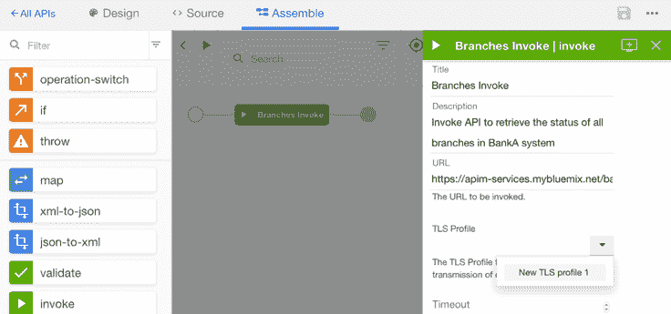

# 在 IBM API Connect 中执行安全的 API 调用

> 原文：[`developer.ibm.com/zh/tutorials/mw-1607-hutchinson-trs/`](https://developer.ibm.com/zh/tutorials/mw-1607-hutchinson-trs/)

安全套接字层 (SSL) 用于实现网络传输安全。在 IBM® API Connect 中，传输层安全 (TLS) 配置文件用于保护通过网站的数据传输。TLS 和 SSL 证书保证您提交的信息不会被盗或被篡改。连接到安全后端系统的能力不可或缺，而且正确设置安全性并不总是一项显而易见的任务。

在本教程中，您将学习如何获取一个证书，然后在 API Manager 中创建一个 [TLS 配置文件](http://www.ibm.com/support/knowledgecenter/SSMNED_5.0.0/com.ibm.apic.apionprem.doc/task_apionprem_ssl.html) 。通过使用这个配置文件，您可以将 API Connect 连接到启用了 SSL 的后端系统。要理解本教程，您应提前具备 TLS 和 API Connect 的知识。

## 完成本教程需要做的准备工作

*   API Connect。访问 [API Connect 开发人员中心](https://developer.ibm.com/apiconnect/) 和 [IBM Cloud 上的 API Connect](https://cloud.ibm.com/catalog/services/api-connect?cm_sp=ibmdev-_-developer-tutorials-_-cloudreg) 。
*   一个 IBM Cloud 帐户
*   OpenSSL
*   互联网访问能力和一个浏览器。本教程使用 Mozilla Firefox。
*   一个您希望添加到后端的证书。此证书可以是自签名证书或任何签名证书。

1

## 获取一个证书

在这一步中，您使用 OpenSSL 命令行接口或通过从浏览器访问您的证书来获取该证书。API Connect 仅支持 P12 (PKCS12) 和 PEM 证书格式的信任库。

### 选项 1：使用 OpenSSL

获取您的证书：

1.  打开 OpenSSL 并查看您的证书，如下所示。指定您的自己的主机名和端口。

    `openssl s_client -connect {_HOSTNAME_}:{_PORT_} –showcerts`

    

2.  复制 BEGIN CERTIFICATE 和 END CERTIFICATE 标签之间的信息（包含标签）并粘贴到 PC 上的一个文本文件中。如果您有多个证书，则获取每个证书。
3.  使用一个有意义的名称和 .ctr 扩展名来保存该文件。

### 选项 2：使用您的 Web 浏览器

如果您使用 Mozilla Firefox，可按照这里的解释和下图所示来获取您的证书：

1.  单击顶部的 SSL 证书图标或底部的 Padlock。
2.  单击 **View Certificate** 。
3.  单击 **Details** 选项卡。
4.  从证书分层结构中，选择您想要的证书。
5.  单击 **Export** 。
6.  将证书保存到本地。

    

在 Apple® Mac® 上，执行以下步骤：

1.  从 Firefox 菜单中，选择 **Preferences** 。
2.  从左侧菜单中，选择 **Advanced** 。
3.  在 **Certificates** 下，单击 **View Certificates** 。
4.  单击 **Your Certificates** 。

2

## 将证书添加到 API Connect

将该证书添加到 API Connect 中的 API：

1.  打开 API Connect。选择 **Admin** 。

    

2.  单击 **TLS profiles** 。

    

3.  创建一个 TLS 配置文件。

    1.  为您的 TLS 配置文件输入一个 **显示名称** 和 **名称** 。
    2.  在 **Description** 字段中输入一个值。
    3.  添加一个信任库并上传证书。
    4.  单击 Protocols 旁边的箭头。

    

4.  选择 TLS 1.0 版（或您使用的其他版本）。下图显示了一个 TLS 配置文件示例。

    

3

## 将该 TLS 配置文件添加到您的 API

将该配置文件添加到您的 API：

1.  返回到使用该证书的 API。
2.  单击 **Assemble** 选项卡。
3.  单击 **Invoke** 。
4.  在 TLS 配置文件所在的部分，单击箭头并选择您刚创建的配置文件。

    

5.  单击 **Save** 。如下图所示，TLS 配置文件已添加。

    

## 结束语

本教程展示了如何创建一个简单 TLS 配置文件，然后将它添加到 API Connect 中的一个 API。借助此配置文件，API 调用可以与启用了 SSL 的后端系统进行通信，以便安全地传输数据。

本文翻译自：[Make secure API calls in IBM API Connect](https://developer.ibm.com/tutorials/mw-1607-hutchinson-trs/)（2016-10-25）