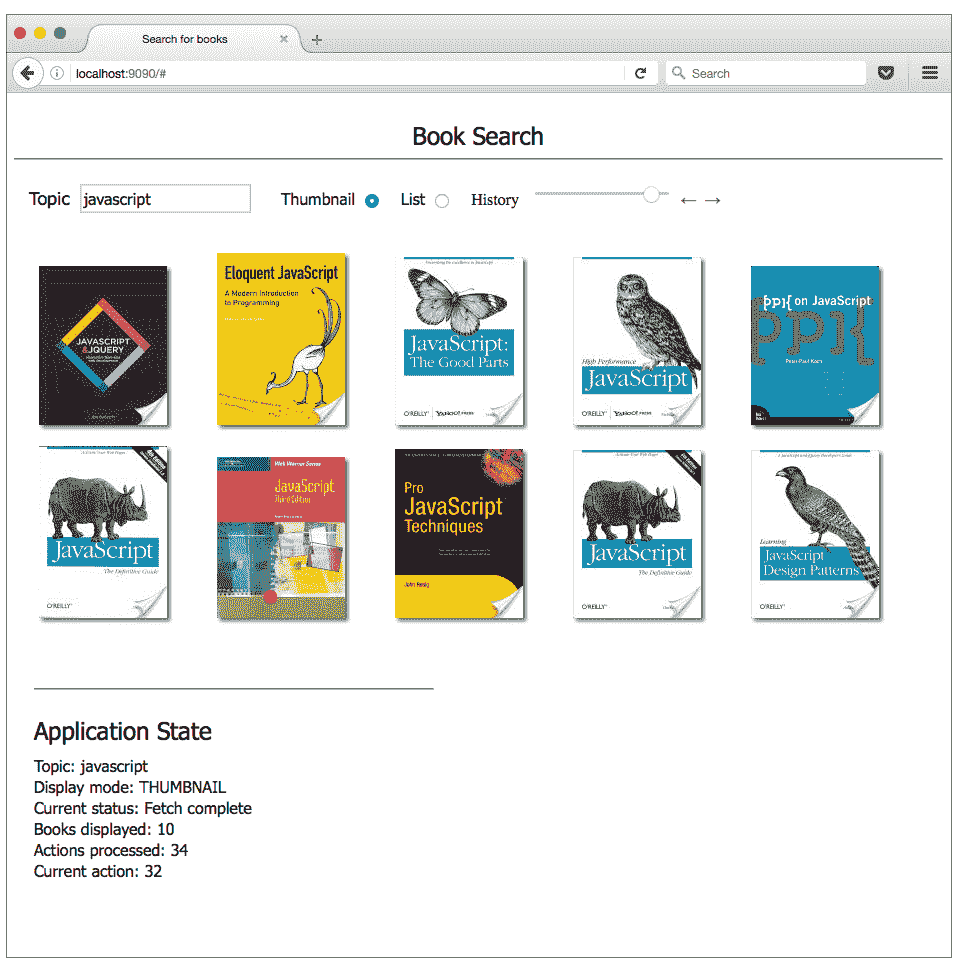
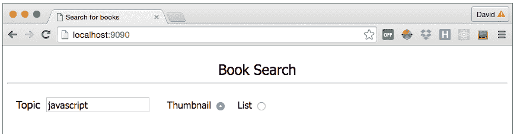
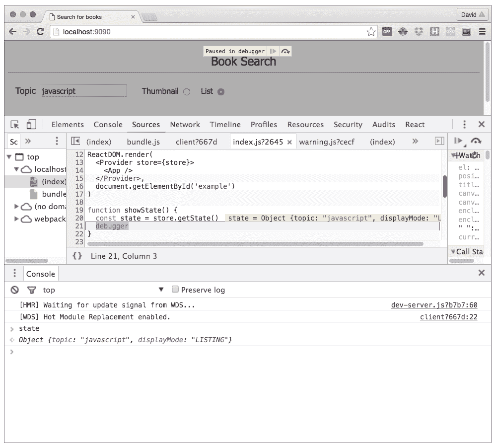
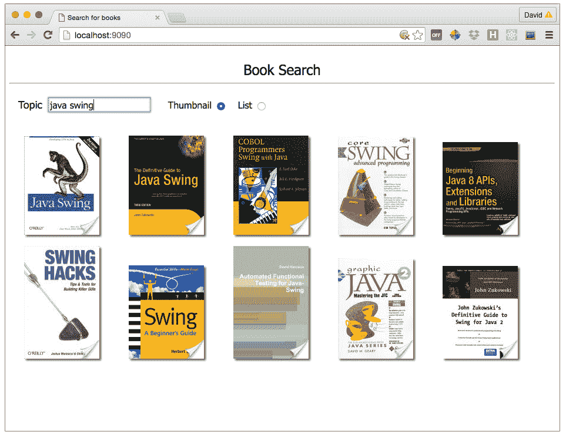
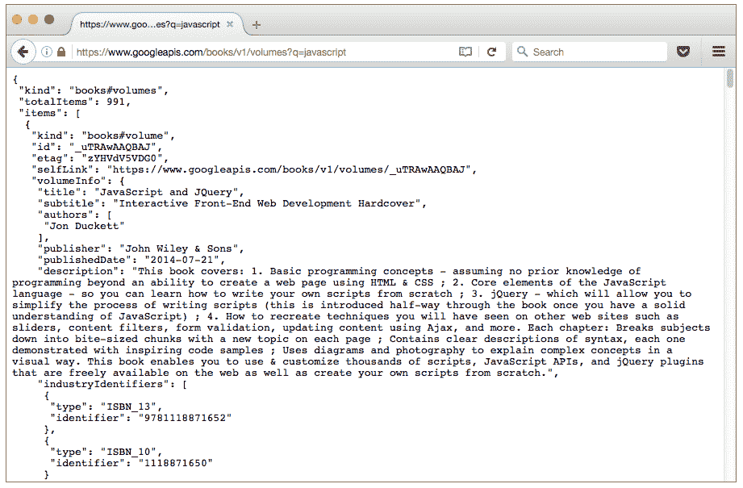

# 使用 Redux 实现异步操作

> 原文：[`developer.ibm.com/zh/tutorials/wa-manage-state-with-redux-p3-david-geary/`](https://developer.ibm.com/zh/tutorials/wa-manage-state-with-redux-p3-david-geary/)

在本系列的第 2 部分 [结合使用 Redux 和 React](http://www.ibm.com/developerworks/cn/web/wa-manage-state-with-redux-p2-david-geary/index.html) 中，已经了解了如何使用 react-redux 绑定，让 Redux 可供 React 应用程序的组件分层结构中的所有 React 组件使用。您还了解了如何实现操作创建器，以及如何将自动连接到 Redux 存储的容器组件与基于当前状态显示信息的表示组件分离。

在第 3 期，将继续构建图书搜索应用程序，该应用程序使用 Redux 执行状态管理。应用程序代码是特定于 React 的，但无论您的应用程序框架是什么，甚至是缺少应用程序框架，您都应该学习如何使用 Redux 的 3 个额外的高级方面：

*   构造缩减程序
*   实现异步操作
*   使用和实现 Redux 中间件

## 图书搜索应用程序回顾

使用图书搜索应用程序（如图 1 所示），您可以通过 Google Books search API 按主题来搜索图书。每次搜索得到与当前主题相关的 10 部或更少的图书，并显示每部图书的封面。封面缩略图是跳转到图书细节的链接。

##### 图 1\. 图书搜索应用程序



有趣之处并不在于搜索结果，而是应用程序如何维护状态。或许更有趣的是应用程序的历史组件，用户可通过该组件在应用程序的状态中前后移动。在整个过程中，应用程序始终会在页面底部显示当前状态。

回想一下，在 [第 2 部分](http://www.ibm.com/developerworks/cn/web/wa-manage-state-with-redux-p2-david-geary/index.html) 中，应用程序的起点类似于图 2。

##### 图 2\. 图书搜索应用程序的起点



清单 1（等同于第 2 部分中的清单 7，这里再次给出是为了便于参考）显示了应用程序的入口点代码。

##### 清单 1\. 入口点 (index.js)

```
import React from 'react';
import ReactDOM from 'react-dom';
import { Provider } from 'react-redux';

import App from './containers/app';
import store from './store';
import { setTopic, setDisplayMode } from './actions';

store.dispatch(setTopic('javascript'));
store.dispatch(setDisplayMode('THUMBNAIL'));

ReactDOM.render(
  <Provider store={store}>
    <App />
  </Provider>,
  document.getElementById('example')
)

function showState() {
  const state = store.getState();
}

store.subscribe(showState); 
```

应用程序分派两个操作（由 `setTopic()` 和 `setDisplayMode()` 操作创建器函数创建）来将主题的初始状态设置为 `javascript` ，将显示模式的初始状态设置为 `THUMBNAIL` 。（要复习一下 `setTopic()` 和 `setDisplayMode()` 操作创建器，请参阅 [结合使用 Redux 和 React](http://www.ibm.com/developerworks/cn/web/wa-manage-state-with-redux-p2-david-geary/index.html) 。）

`Provider` 组件 — 包含在 react-redux 绑定中（将它的所有属性向 `Provider` 标签主体中的所有组件公开），在本例中为一个属性：Redux 存储。

在 清单 1 中可以看到，应用程序的入口点导入该存储，将它指定为 `Provider` 组件的属性。Redux 存储创建并导出到 store.js 中，其中仅包含：

```
import { createStore } from 'redux';
import reducers from './reducers';

export const store = createStore(reducers); 
```

store.js 代码调用 `Redux.createStore()` 来创建 Redux 存储。应用程序将所需的缩减程序传递给 `createStore()` 。

请注意，从 reducers.js 导出的缩减程序名为 `reducers` ，其中包含一个 `s` ，而不是 `reducer` — 因为该缩减程序实际上是一个缩减程序组合。

## 组合缩减程序

最终，完成的图书搜索应用程序的状态将包含以下信息：

*   一个主题
*   一个图书列表
*   当前抓取状态（开始、完成或失败）
*   显示模式（缩略图或列表）

该应用程序显示了针对某个特定主题的图书列表。因为该应用程序异步抓取图书，所以该应用程序会跟踪当前抓取的状态。该应用程序可将图书显示为其封面的缩略图，如 图 1 所示，或者显示为文本列表，所以该应用程序也会跟踪显示模式： *列表* 或 *缩略图* 。

回想一下，Redux 应用程序中的状态存储在单个 JavaScript 对象中。最终的图书搜索应用程序的状态将拥有 4 个属性，对应于前面的列表中的 4 部分信息：

*   `topic`
*   `books`
*   `currentStatus`
*   `displayMode`

另外回想一下，除了仅有一个存储状态的对象，Redux 应用程序也仅有一个针对该状态的缩减程序。但是，对于非平凡的应用程序，维护单个创建应用程序状态的缩减程序函数很快就会变得难以操作。如果它拥有 4 个缩减程序，每个对应一部分状态，代码将变得更容易理解、维护和扩展。好消息是，可以使用 `combineReducers()` 函数将任意多个缩减程序组合为单个缩减程序。

图 3 显示了在调试器后经过一次状态更改后停止的图书搜索应用程序的初期版本。

##### 图 3\. 调试



在调试器的控制台中，可以看到应用程序的状态，它当时是一个对象，包含我之前列出的 4 个属性中的 2 个： `topic` 和 `displayMode` 。每个属性来自一个单独的缩减程序，Redux 将这些缩减程序组合为了一个，如清单 2 所示。

##### 清单 2\. 组合后的缩减程序 (reducers.js)

```
import { combineReducers } from 'redux';

const defaults = {
  TOPIC:        'javascript',
  DISPLAY_MODE: 'THUMBNAIL',
}

const topicReducer = (state = defaults.TOPIC, action) => {
  switch(action.type) {
    case 'SET_TOPIC':
      return action.topic;

    default:
      return state;
  }
}

const displayModeReducer = (state = defaults.DISPLAY_MODE, action) => {
  switch(action.type) {
    case 'SET_DISPLAY_MODE':
      return action.displayMode;

    default:
      return state;
  }
}

// Combine reducers

export default combineReducers({
    topic:       topicReducer,
    displayMode: displayModeReducer
}); 
```

清单 2 实现了一个主题缩减程序（设置状态的主题部分）和一个显示模式缩减程序（设置状态的显示模式部分）。主题和显示模式都很简单。

回想一下，当您调用 Redux `dispatch()` 函数来分派操作时，Redux 调用应用程序的缩减程序函数，并传递当前状态和操作。操作（它将指定一种新状态）通常有一个类型。在清单 2 中，操作类型为 `SET_TOPIC` 和 `SET_DISPLAY_MODE` 。 `SET_TOPIC` 类型的操作有一个 `topic` 属性， `SET_DISPLAY_MODE` 类型的操作有一个 `displayMode` 属性，分别指定其新状态。如果将一个操作发送到一个缩减程序，而且缩减程序对其不感兴趣（例如，您将一个 `SET_DISPLAY_MODE` 操作发送给主题缩减程序），缩减程序就会原封不动地返回当前状态。

实现缩减程序后， 清单 2 将它们与 Redux `combineReducers()` 方法组合在一起。请注意，我将一个 **对象** 传递给 `combineReducers()` 。

您传递给 `combineReducers()` 的对象定义 Redux 根据组合缩减程序创建的状态。在本例中，该状态是一个包含 `topic` 和 `displayMode` 属性的对象。 `topic` 属性的值是从主题缩减程序返回的状态，而 `displayMode` 属性的值是从显示模式缩减程序返回的状态。

在本系列后面部分，将实现图书搜索应用程序的其他两个缩减程序，并将它们添加到传递给 `combineReducers()` 的状态对象。

## 应用程序组件

现在您已经了解了如何组合缩减程序，我将暂时偏离主题，介绍一下应用程序的组件

### 应用程序的组件

该应用程序（由 `App` 组件表示）如清单 3 所示。

##### 清单 3\. `App` 组件 (containers/app.js)

```
import React from 'react';
import ControlsContainer from './controls';

const titleStyle = {
  fontFamily: 'tahoma',
  fontSize: '24px',
  textAlign: 'center'
}

const Title = () => (
  <div style={titleStyle}>
    Book Search
  </div>
);

export const App = () => (
  <div>
    <Title />
    <hr/>
    <ControlsContainer />
  </div>
) 
```

就像表示整个应用程序的 React 组件的常见情况一样，清单 3 中的 `App` 组件仅包含其他组件 — 在本例中为一个标题、一个水平标尺和一个控件容器组件。

### 控制组件

在 [第 2 部分](http://www.ibm.com/developerworks/cn/web/wa-manage-state-with-redux-p2-david-geary/index.html) 中，您看到了 React/Redux 应用程序中的组件通常由两个不同的组件组成：一个连接到 Redux 存储的容器和一个无状态表示组件。您还从第 2 部分中了解到，无状态表示组件的好处有很多。

图书搜索应用程序的控制组件可以以类似方式拆分为两个组件。清单 4 显示了连接的容器的代码。

##### 清单 4\. 控制容器 (containers/controls.js)

```
import { connect } from 'react-redux';
import Controls from '../components/controls';

const mapStateToProps = state => {
  return {
    topic: state.topic,
    displayMode: state.displayMode
  }
}

const mapDispatchToProps = null;

export default connect({
  mapStateToProps,
  mapDispatchToProps
)(Controls); 
```

清单 4 中的控制容器将应用程序状态映射到 `Controls` 组件的属性。我们知道，此刻的应用程序状态由一个主题和应用程序的显示模式组成。

控制容器没有任何分派功能与 `Controls` 无状态组件的属性对应，所以它传递一个 `null` 值作为 Redux `connect()` 函数的第二个参数。

清单 5 给出了相应的无状态组件的代码。

##### 清单 5\. 无状态控制组件 (components/controls.js)

```
import React from 'react';
import DisplayModeContainer from '../containers/displayMode';
import TopicSelectorContainer from '../containers/topicSelector';

const Controls = ({
  topic,
  displayMode
}) => {
  const styles = {
    controls: {
      padding: '15px',
      marginBottom: '25px'
    }
  };

  return(
    <div style={styles.controls}>
      <TopicSelectorContainer topic={topic} />
      <DisplayModeContainer displayMode={displayMode} />
    </div>
  );
}

Controls.propTypes = {
  topic: React.PropTypes.string.isRequired
};

export default Controls; 
```

`Controls` 无状态组件包含针对主题选择器和显示模式的容器组件。 `Controls` 组件的有趣之处在于它的属性： `topic` 和 `displayMode` 。Redux 通过调用 清单 4 中的 `connect()` 将这些属性传递给这个无状态组件。

### 主题选择器组件

清单 6 给出了主题选择器的容器组件的代码。

##### 清单 6\. 主题选择器容器 (containers/topicselector.js)

```
import { connect } from 'react-redux';
import TopicSelector from '../components/topicSelector';
import { setTopic } from '../actions';

const mapStateToProps = state => {
  return {
    topic: state.topic
  }
}

const mapDispatchToProps = dispatch => {
  return {
    setTopic: topic => {
      dispatch(setTopic(topic))
    }
  }
}

export default connect(
  mapStateToProps,
  mapDispatchToProps
)(TopicSelector); 
```

像所有 Redux 容器组件一样， `TopicSelectorContainer` 将状态和分派功能映射到关联的无状态组件的属性。在本例中，状态选择器容器映射一个主题和一个设置该主题的函数。

清单 7 显示了主题选择器无状态组件的代码。

##### 清单 7\. 主题选择器无状态组件 (components/topicselector.js)

```
import React from 'react';

export const TopicSelector = React.createClass({
  propTypes: {
    topic: React.PropTypes.string.isRequired
  },

  componentDidMount: function() {
    function putCursorAtEnd(input) {
      const value = input.value;
      input.value = '';
      input.value = value;
    }

    let input = this.refs.input;

    input.focus();
    putCursorAtEnd(input);
  },

  handleChange: function(event) {
    this.props.setTopic(event.target.value);
  },

  handleKeyPress: function(event) {
    if(event.key == 'Enter') {
      this.props.setTopic(event.target.value);
    }
  },

  render: function() {
    const styles = {
      topic: {
        marginRight: '10px',
        fontFamily: 'tahoma',
        fontSize: '18px'
      },

      input: {
        fontFamily: 'tahoma',
        fontSize: '16px',
        marginRight: '10px'
      }
    };

    const topic = this.props.topic;

    return(
      <span>
        <span style={styles.topic}>
          Topic
        </span>

        <input type='text'
               ref='input'
               style={styles.input}
               defaultValue={topic}
               value={topic}
               onChange={this.handleChange}
               onKeyPress={this.handleKeyPress}/>
      </span>
    );
  }
})

TopicSelector.propTypes = {
  topic: React.PropTypes.string.isRequired,
  setTopic: React.PropTypes.func.isRequired,
  fetchTopic: React.PropTypes.func.isRequired,
}; 
```

主题选择器无状态组件包含一个提示和一个文本字段。当 React 挂载该组件时，该组件的 `componentDidMount()` 方法会提供文本字段的焦点，并将光标放在文本末尾。

当用户在文本字段中键入内容后按 Enter 时，该组件的 `handleKeyPress()` 方法会调用 `setTopic()` 方法。回想一下，该组件的属性中包含 `setTopic()` 方法，这是由于在该无状态组件的容器中调用了 `connect()` 。

### 显示模式组件

清单 8 给出了显示模式的容器组件。

##### 清单 8\. 显示模式容器 (containers/displayMode.js)

```
import { connect } from 'react-redux';
import DisplayMode from '../components/displayMode';
import { setDisplayMode } from '../actions';

const mapStateToProps = null;

const mapDispatchToProps = dispatch => {
  return {
    setListing: () => {
      dispatch(setDisplayMode('LISTING'))
    },

    setThumbnail: () => {
      dispatch(setDisplayMode('THUMBNAIL'))
    }
  }
}

export default connect(
  mapStateToProps,
  mapDispatchToProps
)(DisplayMode); 
```

显示模式容器不会映射状态，但它会映射两个分派函数： `setListing()` 和 `setThumbnail()` ，这两个函数会分派将应用程序的显示模式设置为列表或缩略图的操作。

清单 9 给出了显示模式无状态组件。

##### 清单 9\. 显示模式无状态组件 (components/displayMode.js)

```
import React from 'react';

require('./book.css');

const DisplayMode = ({
  setListing,
  setThumbnail,
  displayMode
}) => {
  const switchToListing = function(event) {
    setListing();
  };

  const switchToThumbnail = function(event) {
    setThumbnail();
  };

  const styles = {
    radio: {
      marginLeft: '10px',
      cursor: 'pointer'
    },

    radiospan: {
      marginLeft: '20px',
      fontFamily: 'tahoma',
      fontSize: '16px'
    }
  };

  return(
    <span>
      <span style={styles.radiospan}>
        Thumbnail
      </span>

      <input type='radio'
             name='display'
             style={styles.radio}
             onChange={switchToThumbnail}
             checked={displayMode == 'THUMBNAIL'}
             value='thumbnail'/>

      <span style={styles.radiospan}>
        List
      </span>

      <input type='radio'
             name='display'
             style={styles.radio}
             onChange={switchToListing}
             checked={displayMode != 'THUMBNAIL'}
             value='list'/>
    </span>
  );
};

DisplayMode.propTypes = {
  setListing: React.PropTypes.func.isRequired,
  setThumbnail: React.PropTypes.func.isRequired,
  displayMode: React.PropTypes.string.isRequired
};

export default DisplayMode; 
```

清单 9 中的无状态组件访问 3 个属性： `setListing()` 、 `setThumbnail()` 和 `displayMode` 。显示模式容器传递 `setListing()` 、 `setThumbnail()` 属性。在 清单 5 中可以看到， `displayMode` 属性由 `Controls` 无状态组件设置。

图书搜索应用程序当前的初始实现演示了组合缩减程序和实现操作创建器的过程。接下来，您将看到如何通过 Redux 和 React 实现异步操作。

## 异步操作

图 4 显示了图书搜索应用程序的下一个版本。

##### 图 4\. 异步搜索图书



您已从 [第 1 部分](http://www.ibm.com/developerworks/cn/web/wa-manage-state-with-redux-p1-david-geary/) 中知道，图 4 中所示的图书缩略图来自 Google Books API。通过直接在浏览器中查询 URL googleapis.com（比如键入 `http://www.googleapis.com/v11/volumes/?q=javascript` 作为网址），您可以获得 JSON 格式的查询结果，如图 5 所示。

##### 图 5\. 使用 Google Books REST API 搜索图书



应用程序的所有操作目前都是简单的对象。对于异步操作，我不想要对象，而是想要一个在异步请求处理过程中分派操作的函数。

清单 10 显示了图书搜索应用程序的更新后的入口点。

##### 清单 10\. 在入口点抓取图书信息 (index.js)

```
import React from 'react';
import ReactDOM from 'react-dom';
import { Provider } from 'react-redux';

import App from './containers/app';
import store from './store';
import { setTopic, setDisplayMode, fetchBooks } from './actions';

store.dispatch(setTopic('javascript'));
store.dispatch(setDisplayMode('THUMBNAIL'));
store.dispatch(fetchBooks());

ReactDOM.render(
  <Provider store={store}>
    <App />
  </Provider>,
  document.getElementById('example')
) 
```

清单 10 与该应用程序的入口点的之前版本的唯一区别在于抓取图书操作的分派。该操作的创建者是 `fetchBooks()` 函数，如清单 11 所示。

##### 清单 11\. 异步操作

```
/**
 * The fetchBooks action creator returns a function instead of an object.
 * Custom middleware is necessary for that to work.
 */
const fetchBooks = () => {
  return fetchCurrentTopic;
}

const fetchStart = () => {
  return {
    type: 'FETCH_STARTED'
  }
}

const fetchComplete = json => {
  return {
    type: 'FETCH_COMPLETE',
    json
  }
}

const fetchFailed = error => {
  return {
    type: 'FETCH_FAILED',
    error
  }
}

const setTopic = topic => {
  return {
    type: 'SET_TOPIC',
    topic
  }
}

const setDisplayMode = displayMode => {
  return {
    type: 'SET_DISPLAY_MODE',
    displayMode
  }
} 
```

清单 11 实现了 6 个操作创建器。回想一下 [第 2 部分](http://www.ibm.com/developerworks/cn/web/wa-manage-state-with-redux-p2-david-geary/index.html) ，操作创建器是返回操作的函数。

`setTopic()` 和 `setDisplayMode()` 操作创建器与之前的实现相同。除了 `setTopic()` 和 `setDisplayMode()` 之外，清单 11 中实现的 6 个操作创建器中的另外 3 个也将返回操作对象。这些操作创建器返回的操作会在发生异步抓取时指定状态：

*   `fetchStart()`
*   `fetchComplete()`
*   `fetchFailed()`

第 6 个抓取操作创建器 (`fetchBooks()`) 返回一个函数而不是对象。该函数（如清单 12 所示）使用 JavaScript fetch API 来抓取图书，但（更重要的是）请注意，它会在合适的时间点分派其他抓取操作。

##### 清单 12\. 抓取当前主题

```
const URL = 'https://www.googleapis.com/books/v1/volumes?q=';

const fetchCurrentTopic = (dispatch, state) => {
  dispatch(fetchStart())

  fetch(URL + state.topic)
    .then(res => {
      return res.json()
    })
    .then(json => {
      if(json.error) {
        dispatch(fetchFailed(json.error))
      }
      else {
        dispatch(fetchComplete(json))
      }
    })
    .catch(error => {
      dispatch(fetchFailed(json.error))
    })
} 
```

像所有 Redux 操作一样，抓取操作由缩减程序处理（缩减）。该应用程序将该缩减程序与显示模式和主题缩减程序组合在一起。

清单 13 显示了 reducers.js 的部分代码，展示了抓取缩减程序如何处理抓取操作。

##### 清单 13\. 抓取缩减程序（reducers.js — 部分代码）

```
import { combineReducers } from 'redux';

const defaults = {
  TOPIC:        'javascript',
  DISPLAY_MODE: 'THUMBNAIL',
  BOOKS:        []
}
...

const fetchReducer = (state = defaults.BOOKS, action) => {
  switch(action.type) {
    case 'FETCH_STARTED':
    case 'FETCH_FAILED':
      return [];

    case 'FETCH_COMPLETE':
      return action.json.items

    default:
      return state;
  }
}

// Combine reducers

export default combineReducers({
    topic:       topicReducer,
    displayMode: displayModeReducer,
    books:       fetchReducer
}); 
```

当抓取开始或失败时，抓取缩减程序会返回一个空数组。当抓取完成时，抓取缩减程序返回从 REST 调用返回的项。

回顾一下我刚才的操作：

我实现了一个抓取操作创建器，它返回一个函数，而不是像大部分操作创建器一样返回一个对象。该函数使用 Google Books API 异步抓取图书，并在异步抓取的各个阶段，通过使用操作创建器创建操作并使用 Redux `dispatch()` 函数分派操作来分派其他操作。

抓取操作由抓取缩减程序处理。当抓取开始时，抓取缩减程序返回的状态是一个空数组。当抓取成功时，抓取缩减程序返回抓取的图书。如果抓取失败，抓取缩减程序会将状态重置为空数组。

但是，这里存在一个问题。默认情况下，Redux 仅支持对象形式的操作，不支持函数形式的操作。如果您尝试运行本节中的代码，则会看到一个错误：

```
Uncaught Error: Actions must be plain objects. Use custom middleware for async actions. 
```

因为 Redux 不支持函数形式的操作，所以我需要指导它支持这类操作 — 通过实现 Redux 中间件。

## Redux 中间件

我们知道，要使用 Redux 更改应用程序状态，则需要分派操作。为了响应操作分派，Redux 会调用应用程序的缩减程序，将当前状态和操作发送给它。该缩减程序随后返回新状态。

我们还知道，默认情况下，操作必须是纯 JavaScript 对象；它们不能是函数。但是对于异步操作，如果 **可以** 将异步操作指定为函数（就像我在上一节中所做的那样），则会非常方便。

幸运的是，Redux 在分派操作和调用缩减程序之间提供了一个挂钩。这个挂钩称为 *中间件* ，只需调用 Redux 的 `applyMiddleware()` 函数即可应用它。

回想一下 [第 1 部分](http://www.ibm.com/developerworks/cn/web/wa-manage-state-with-redux-p1-david-geary/index.html) ， `applyMiddleware()` 是 5 个顶级 Redux 函数之一。可使用 `applyMiddleware()` 通过拦截分派调用的第三方中间件来扩展 Redux。在您处理任务的主要执行工作之前，可以使用此工具实现许多类型的横切关注点，例如日志记录、身份验证、授权或性能指标集合。

我首先将展示如何在图书搜索应用程序中使用现有的有帮助的中间件，然后展示如何创建您自己的中间件。

### 使用 Redux 中间件

创建 Redux 存储时，可通过 Redux `applyMiddleware()` 函数应用 Redux 中间件。清单 14 展示了如何将 [`redux-thunk`](https://github.com/gaearon/redux-thunk) 中间件用于图书搜索应用程序。

##### 清单 14\. 使用 `redux-thunk` (store.js)

```
import { createStore, applyMiddleware } from 'redux'
import { reducers } from './reducers'
import thunk from 'redux-thunk'

export const store = createStore(reducers, applyMiddleware(thunk)) 
```

`redux-thunk` 中间件刚好可以满足我在图书搜索应用程序中的需求 — 除了纯 JavaScript 对象外，还要将操作实现为函数。您可以使用 `npm install redux-thunk` 安装它。

从清单 14 中可以看到，Redux 中间件很容易使用。现在我将展示如何实现您自己的中间件。

### 实现中间件

在清单 15 中，我将 `redux-thunk` 替换为自定义中间件。

##### 清单 15\. 使用自定义中间件 (store.js)

```
import { createStore, applyMiddleware } from 'redux'
import { reducers } from './reducers'
import { thunk } from './middleware'

export const store = createStore(reducers, applyMiddleware(thunk)) 
```

清单 16 展示了这个自定义中间件的实现。

##### 清单 16\. Thunk 中间件 (middleware.js)

```
export function thunk(store) {
  return function(dispatch) {
    return function(action) {
      if(typeof action === 'function') {
        action(dispatch, store.getState) // invoke the action
      }
      else {
        return dispatch(action) // dispatch normally
      }
    }
  }
} 
```

Redux 中间件（例如清单 16 中的 `thunk` ）是一个 JavaScript 函数。更具体地讲，它是 **一个返回一个函数的函数，返回的函数又会返回一个函数** 。您绝不会直接调用 Redux 中间件，但是如果您要这么做，以下是实现方法： `thunk(store)(dispatch)(action)` 。

箭头函数会让实现看起来更美观，但不一定更容易理解。清单 17 给出了使用箭头函数重写的 清单 16 的代码。

##### 清单 17\. 使用箭头函数的 Thunk 中间件 (middleware.js)

```
export const thunk = store => dispatch => action => {
  if(typeof action === 'function') {
    action(dispatch, store.getState) // invoke the action
  }
  else {
    return dispatch(action) // dispatch normally
  }
} 
```

无论是否使用箭头函数，要实现 Redux 中间件，必须实现一个返回一个函数的函数，而且返回的函数还要返回另一个函数。简单地看看此 recipe，其中 `NAME` 表示您的中间件的名称， `...` 是代码：

`const _NAME_ = store ⇒ dispatch ⇒ action ⇒ { ...}`

现在您已经了解了实现 Redux 中间件的基本原理，让我们来看看 清单 16 中的 `thunk` 中间件的实现。得益于 JavaScript 闭包的魔力，中间件函数能够访问 `store` （Redux 存储）、 `dispatch` （Redux `dispatch()` 函数）和 `action` （您即将分派的操作）。

`thunk` 中间件会检查该操作是否是函数；如果是， `thunk` 会调用该操作，传递 `dispatch` 函数和存储的 `getState()` 函数。如果该操作不是函数， `thunk` 中间件会按照 Redux 的正常方式处理操作 — 调用 `dispatch()` 函数并传递该操作。

## 结束语

**获取源代码**
可从 GitHub 上的 [redux-book-search 项目](https://github.com/davidgearyauthor/redux-book-search) 获取该应用程序的完整源代码。

Redux 应用程序通过 Redux `dispatch()` 函数分派操作来更改状态。顾名思义， `dispatch()` 函数将操作分派给应用程序的缩减程序，缩减程序创建一个新应用程序状态。在本期文章中，您了解了如何利用该生命周期，通过实现 Redux 中间件来扩展 Redux 的工作能力，中间件使 Redux 能够处理函数形式的操作，是所有异步操作的一个便捷工具。

在本系列的 下一期文章 中，将会介绍如何使用 Redux 实现时间旅行 — 至少从应用程序状态的角度看是时间旅行。

本文翻译自：[Implementing asynchronous actions with Redux](https://developer.ibm.com/tutorials/wa-manage-state-with-redux-p3-david-geary/)（2016-08-08）