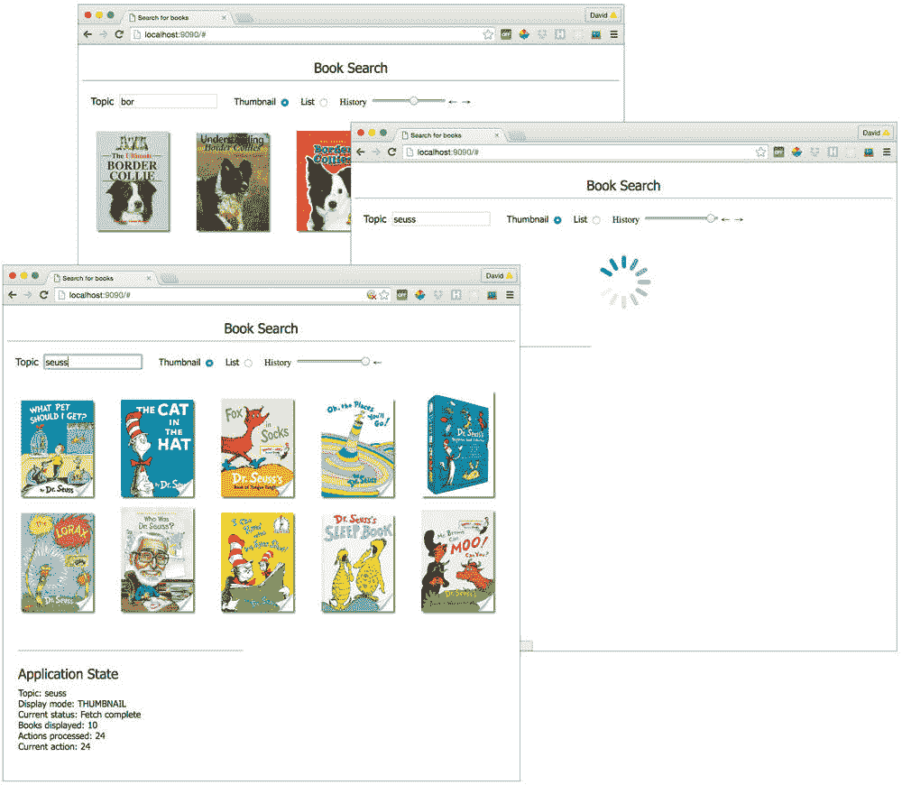

# 使用 Redux 实现时间旅行

> 原文：[`developer.ibm.com/zh/tutorials/wa-manage-state-with-redux-p4-david-geary/`](https://developer.ibm.com/zh/tutorials/wa-manage-state-with-redux-p4-david-geary/)

在 使用 Redux 管理状态系列的 第 3 部分 末尾处，我正在实现图 1 所示的图书搜索应用程序。您了解了如何为应用程序状态的逻辑部分实现不同的缩减程序（主题、显示模式和当前抓取状态），以及如何将这些缩减程序组合到每个应用程序一个的必备 Redux 缩减程序。

##### 图 1\. 异步搜索图书


您还了解了如何将图书搜索应用程序的异步抓取操作实现为一个函数，而不是纯（非函数）对象。但是，Redux 不是天生就能处理函数形式的操作，所以我介绍了如何为了实现该目的来使用和实现 Redux 中间件。在第 4 期文章中，我将展示如何借助 Redux，向应用程序添加时间旅行特性。

## Redux 时间旅行

回想一下，Redux 使用对象来表示状态，并使用纯函数计算下一个应用程序状态。这些特征使 Redux 成为了一个 *可预测* 的状态容器，这意味着如果给定一个特定应用程序状态和一个特定操作，那么应用程序的下一个状态将始终完全相同。这种可预测性使得实现时间旅行变得很容易 — 能够在应用程序以前的状态中前后移动，并实时查看结果。图 2 演示了这一特性，其中给出了图书搜索应用程序的最终版本。

##### 图 2\. 状态历史和撤销/重做


在应用程序的最终版本中，页面顶部的控件组件包含一个历史滑块，和前移和后移时间的箭头。此外，页面底部有一个显示当前应用程序状态的状态查看器组件。

图 3 展示了如何通过操作应用程序的箭头和滑块，在应用程序以前的状态中移动。

##### 图 3\. 时间旅行



从图 3 中的顶部图片可以看到，搜索 Dr. Seuss 图书之前，我搜索了 `border collie` 。从该图片和图 3 中中间的图片可以看到，我删除了 `border collie` 文本，键入了 `seuss` 并按 Enter 键，然后搜索开始。中间的图片显示了该搜索期间的应用程序。底部的图片显示了应用程序的最新状态，历史滑块图标始终位于右侧。

图 3 中的屏幕截图不太明显，但随着您拖动滑块的图标，可以看到文本 `border collie` 变成 `border colli` ，然后变成 `border coll` ，随后变成 `border col` ，等等，直到该文本字段变为空的。然后，随着继续拖动滑块的图标，您会看到文本 `s` ，然后是 `su` ，然后是 `sue` ，直到看到 `suess` 。实际上，您可以向前和向后时间旅行，至少从您应用程序的角度讲是这样。

现在您已看到它的实际效果，我将介绍如何使用 Redux 实现时间旅行。

### 状态历史

实现时间旅行相对比较简单。以下是我将要执行的操作。

首先，我将实现一个状态历史对象，该对象维护一个过去状态数组、一个未来状态数组和一个表示现在的状态。然后我将修改该应用程序，将它的所有状态都存储在状态历史对象中，并将历史滑块和箭头按钮连接到状态历史方法。

清单 1 显示了状态历史对象。

##### 清单 1\. 状态历史对象 (statehistory.js)

```
export default {
  past: [],

  present: undefined,
  future: [],

  thereIsAPresent:     function() { return this.present != undefined; },
  thereIsAPast:        function() { return this.past.length > 0; },
  thereIsAFuture:      function() { return this.future.length > 0; },
  setPresent:          function(state) { this.present = state; },
  movePresentToPast:   function() { this.past.push(this.present); },
  movePresentToFuture: function() { this.future.push(this.present); },
  movePastToPresent:   function() { this.setPresent(this.past.pop()); },
  moveFutureToPresent: function() { this.setPresent(this.future.pop()); },

  push: function(currentState) {
    if(this.thereIsAPresent()) {
      this.movePresentToPast();
    }
    this.setPresent(currentState);
  },

  undo: function() {
    if(this.thereIsAPresent()) {
      this.movePresentToFuture(); // Moving back in time
      this.movePastToPresent();   // Moving back in time
    }
  },

  redo: function() {
    if(!this.thereIsAFuture()) { // No future!
      return;
    }

    if(this.thereIsAPresent()) {
      this.movePresentToPast(); // Moving forward in time
    }

    this.moveFutureToPresent(); // Moving forward in time
  },

  gotoState: function(i) {
    const index = Number(i);
    const allstates = [...this.past, this.present, ...this.future];

    this.present = allstates[index]
    this.past = allstates.slice(0, index)
    this.future = allstates.slice(index+1, allstates.length)
  }
} 
```

状态历史对象是一个包含以下 4 个方法的状态堆栈：

*   `push(state)`
*   `undo()`
*   `redo()`
*   `gotoState(stateIndex)`

只要图书搜索应用程序分派一个操作，它就会调用状态历史对象的 `push()` 方法将当前状态推送到状态历史对象的内部堆栈上。

### 撤销/重做

对于控件组件中的撤销/重做箭头，该应用程序需要状态历史对象的 `undo()` 和 `redo()` 方法。对于历史滑块，我需要能够跳到状态历史中的任何状态，所以状态历史对象提供了一个 `gotoState()` 方法。

`StateHistory.push()` 方法将当前状态设置为现在的状态。如果开始有一个现在的状态，该方法会将它移到过去。

如果没有现在的状态， `undo()` 方法什么都不会做。否则，它将现在的状态移到未来，随后将过去的状态移到现在。

如果没有未来状态， `redo()` 方法什么也不会做；否则，它将现在的状态移到过去，随后将未来的状态移到现在。

最后， `gotoState()` 方法直接进入与传递给函数的索引对应的状态。 `gotoState()` 方法使用 JavaScript 展开运算符将所有状态存储在一个数组中，然后依据索引将该数组拆分为过去、现在和未来。

介绍了状态历史对象的实现后，我将返回到图书搜索应用程序的实现上。

## 包含历史和撤销/重做功能的图书搜索应用程序

清单 2 显示了图书搜索应用程序的 `App` 组件的最终实现。

##### 清单 2\. 最终的图书搜索应用程序 (containers/app.js)

```
import React from 'react';
import ControlsContainer from './controls';
import BooksContainer from './books';
import StateViewerContainer from './stateviewer';

const titleStyle = {
  fontFamily: 'tahoma',
  fontSize: '24px',
  textAlign: 'center'
}

const Title = () => (
  <div style={titleStyle}>
    Book Search
  </div>
);

export default () => (
  <div>
    <Title />
    <hr/>
    <ControlsContainer    />
    <BooksContainer       />
    <StateViewerContainer />
  </div>
) 
```

`App` 组件包含 3 个组件： `ControlsContainer` 、 `BooksContainer` 和 `StateViewerContainer` 。 `ControlsContainer` 包含历史滑块和箭头按钮， `StateViewerContainer` 包含一个显示当前状态的无状态组件。我首先会介绍 `StateViewerContainer` 。

### 状态查看器组件

清单 3 显示了状态查看器容器：

##### 清单 3\. 状态查看器容器 (containers/stateviewer.js)

```
import { connect } from 'react-redux';
import StateViewer from '../components/stateviewer';
import stateHistory from '../statehistory';

const mapStateToProps = state => {
  return {
    books:         state.books,
    topic:         state.topic,
    currentStatus: state.currentStatus,
    displayMode:   state.displayMode,
    history:       stateHistory
  }
}

export default connect(
  mapStateToProps,
  null
)(StateViewer); 
```

`stateviewer` 容器将 5 个属性映射到它包含的无状态组件。状态查看器无状态组件在清单 4 中使用了这些属性。

##### 清单 4\. `stateviewer` 无状态组件 (components/stateviewer.js)

```
import React from 'react';

const StateViewer = ({
  topic,
  books,
  currentStatus,
  displayMode,
  history
}) => {
  const styles = {
    container: {
      margin: '20px',
      width: '400px',
      fontFamily: 'tahoma'
    },

    title: {
      fontSize: '24px',
      marginTop: '25px'
    },

    state: {
      marginTop: '10px'
    },

    hr: {
      marginTop: '50px'
    }
  };

  return(
    <div style={styles.container}>
      <hr style={styles.hr}/>

      <div style={styles.title}>
        Application State
      </div>

      <div style={styles.state}>
        Topic: {topic}<br/>

        Display mode:      { displayMode }<br/>
        Current status:    { currentStatus }<br/>
        Books displayed:   { books.length }<br/>
        Actions processed: { history.past.length + history.future.length + 1 }<br/>
        Current action:    { history.past.length + 1 }
      </div>
    </div>
  );
}

StateViewer.propTypes = {
  books: React.PropTypes.array.isRequired,
  currentStatus: React.PropTypes.string.isRequired,
  displayMode: React.PropTypes.string.isRequired,
  history: React.PropTypes.object.isRequired,
  topic: React.PropTypes.string.isRequired,
};

export default StateViewer; 
```

清单 4 中的组件很简单；它仅显示自己的属性，这些属性来自包含它的 `StateViewerContainer` ，该容器从当前状态获得它们。

这就是在页面底部显示应用程序状态的状态查看器。接下来我返回到更有趣的控件组件。

### 状态控件

在本系列的 上一篇文章 中，我讨论了控件组件，它（像 Redux 应用程序中的许多组件一样）被拆分为一个容器组件和一个包含的无状态组件。容器组件将主题和显示模式映射到无状态组件。此外，该无状态组件（如清单 5 所示）包含 `HistoryContainer` 组件，所有时间旅行操作都在该组件中发生。

##### 清单 5\. 控件无状态组件 (components/controls.js)

```
import React from 'react';
import DisplayModeContainer from '../containers/displayMode';
import TopicSelectorContainer from '../containers/topicSelector';
import HistoryContainer from '../containers/history';

const Controls = ({
  topic,
  displayMode
}) => {
  const styles = {
    controls: {
      padding: '15px',
      marginBottom: '25px'
    }
  };

  return(
    <div style={styles.controls}>
      <TopicSelectorContainer topic={topic} />
      <DisplayModeContainer displayMode={displayMode} />
      <HistoryContainer />
    </div>
  );
}

Controls.propTypes = {
  displayMode: React.PropTypes.string.isRequired,
  topic: React.PropTypes.string.isRequired,
};

export default Controls; 
```

### 历史容器和无状态组件

`HistoryContainer` 组件如清单 6 所示。

##### 清单 6\. 历史容器 (containers/history.js)

```
import { connect } from 'react-redux';
import { undo, redo, gotoState } from '../actions';
import { History } from '../components/history';
import stateHistory from '../statehistory';

const mapStateToProps = state => {
  return {
    past: stateHistory.past,
    present: stateHistory.present,
    future: stateHistory.future
  }
}

const mapDispatchToProps = dispatch => {
 return {
   undo: () => {
     dispatch(undo());
   },

   redo: () => {
     dispatch(redo());
   },

  gotoState: stateIndex => {
     dispatch(gotoState(stateIndex));
   }
 }
}

export default connect(
  mapStateToProps,
  mapDispatchToProps
)(History); 
```

历史容器将 `past` 、 `present` 和 `future` 作为属性映射到它包含的 `History` 组件。它还将 3 个函数（ `undo()` 、 `redo()` 和 `gotoState()` ）作为属性映射到 `History` 组件。

请注意，将历史容器映射到其无状态组件的函数都会分派 Redux 操作。实现时间旅行涉及到更改状态，清单 6 中的函数通过分派 Redux 操作来实现此目的。操作是由操作创建器创建的，如清单 7 所示。

##### 清单 7\. 历史操作创建器 (actions.js)

```
...

export const redo = () => {
  return {
    type: 'REDO'

  }
}

export const undo = () => {
  return {
    type: 'UNDO'
  }
}

export const gotoState = stateIndex => {
  return {
    type: 'GOTO',
    stateIndex
  }
} 
```

与操作创建器中的常见情况一样，清单 7 中的操作创建器很简单 — 它们仅返回操作对象。只有 `gotoState` 操作提供了状态更改类型以外的信息。该信息是历史对象所维护的状态数组的索引。

清单 8 显示了 `history` 无状态组件。

##### 清单 8\. `history` 无状态组件 (components/history.js)

```
import React from 'react';

export const History = ({
  past, present, future,
  undo, redo, gotoState,
}) => {
  const styles = {
    container: {
      marginLeft: '20px',
      cursor: 'pointer',
    },

    link: { textDecoration: 'none' },
    input: { cursor: 'pointer' }
  }

  const RightArrow = () => {
    return(
      <a href='#' style={styles.link}
                  onClick={() => redo()}> →
      </a>
    );
  }

  const LeftArrow = () => {
    return(
      <a href='#' style={styles.link}
                  onClick={() => undo()}> ←
      </a>
    );
  }

  const maxRange = () => {
    return (past   ? past.length   : 0) +
           (present? 1 : 0)             +
           (future ? future.length : 0) - 1;
  }

  return(
    <span style={styles.container}>
      History

      <input type='range'
             style={styles.input}
             min={0}
             max={maxRange()}
             value={past ? past.length : 0}
             onChange={event => gotoState(event.target.value)}/>

      { (past   && past.length   > 0) ? <LeftArrow />  : null }
      { (future && future.length > 0) ? <RightArrow /> : null }
    </span>
  )
}

History.propTypes = {
  past: React.PropTypes.array.isRequired,
  present: React.PropTypes.object.isRequired,
  future: React.PropTypes.array.isRequired,

  undo: React.PropTypes.func.isRequired,
  redo: React.PropTypes.func.isRequired,
  gotoState: React.PropTypes.func.isRequired,
}; 
```

`history` 无状态组件显示历史滑块和箭头。当用户单击某个箭头时，此组件调用它以属性形式从包含它的容器组件收到的相应 `undo()` 或 `redo()` 函数。

当用户操作滑块时，历史无状态组件会调用 `gotoState()` 函数，该函数也是它以属性形式从包含它的容器中收到的。

目前为止，为了实现历史和撤销/重做功能，我实现了一个跟踪过去、现在和未来的状态历史对象。我介绍了 React 组件的实现，这些组件包含操作当前状态的控件和显示该状态的 HTML 元素。

这里保留了一个关键功能：处理 清单 7 中定义的 `undo` 、 `redo` 和 `goto` 操作。接下来，我将介绍如何执行这些操作。

## 更高级的缩减程序

在 第 3 部分 中，您了解了如何组合使用缩减程序与 Redux `combineReducers()` 函数。图书搜索应用程序的最终版本组合了 4 个缩减程序，如清单 9 所示。

##### 清单 9\. 组合后的缩减程序 (reducers.js)

```
// Combine reducers

export default combineReducers({
    books:         fetchReducer,
    topic:         topicReducer,
    currentStatus: statusReducer,
    displayMode:   bookDisplayReducer
}); 
```

清单 10 给出了在包含时间旅行功能后，图书搜索应用程序的经过改良的缩减程序。

##### 清单 10\. 更高级的 `undo` 缩减程序 (reducers.js)

```
import { combineReducers } from 'redux';
import { store } from './store';
import stateHistory from './statehistory';

...

const undo = reducer => (state = stateHistory.present, action) => {
  switch(action.type) {
    case 'UNDO':
      stateHistory.undo();
      break;

    case 'REDO':
      stateHistory.redo();
      break;

    case 'GOTO':
      stateHistory.gotoState(action.stateIndex);
      break;

    default:
      const newState = reducer(state, action);
      stateHistory.push(newState);
  }

  return stateHistory.present;
}

// Combine reducers

export default undo(combineReducers({
    books:         fetchReducer,
    topic:         topicReducer,
    currentStatus: statusReducer,
    displayMode:   bookDisplayReducer
})); 
```

在清单 10 中， `undo()` 函数是一个接受另一个缩减程序作为参数的缩减程序。当前操作与历史无关时，即操作类型不是 `UNDO` 、 `REDO` 或 `GOTO` 时， `undo` 函数会使用该缩减程序计算下一个状态。在这种情况下，在包含的缩减程序计算出该状态后， `undo` 函数会该状态推送到历史堆栈上。

当操作与历史相关时， `undo` 函数被委托给合适的状态历史方法。无论当前操作是否与历史相关， `undo()` 函数都会返回 `stateHistory` 对象当前定义的现在状态。

使用另一个缩减程序来确定下一个状态的缩减程序（比如 `undo` 函数）被称为 *高级* 缩减程序，您可将它们视为 [装饰模式](https://en.wikipedia.org/wiki/Decorator_pattern) 的等效函数。

## 结束语

**获取源代码**
可从 GitHub 上的 [redux-book-search 项目](https://github.com/davidgearyauthor/redux-book-search) 获取该应用程序的完整源代码。

在本文中，您了解了如何实现时间旅行。尽管可能没有实时时间旅行那么刺激，但能够轻松实现代码来使您能在应用程序的以前状态中前后移动也很不错。此特性更像是开发人员的一种福利，而不是用户，因为它使开发时间旅行调试器成为可能。

在 下一期文章 中，我将完成图书搜索应用程序的实现，并介绍 Redux 开发人员工具。您还将学习如何结合使用 Redux 和其他框架，比如 Angular。

本文翻译自：[Implementing time travel with Redux](https://developer.ibm.com/tutorials/wa-manage-state-with-redux-p4-david-geary/)（2016-08-08）