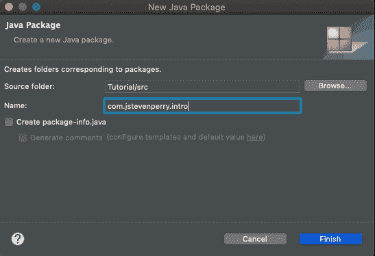
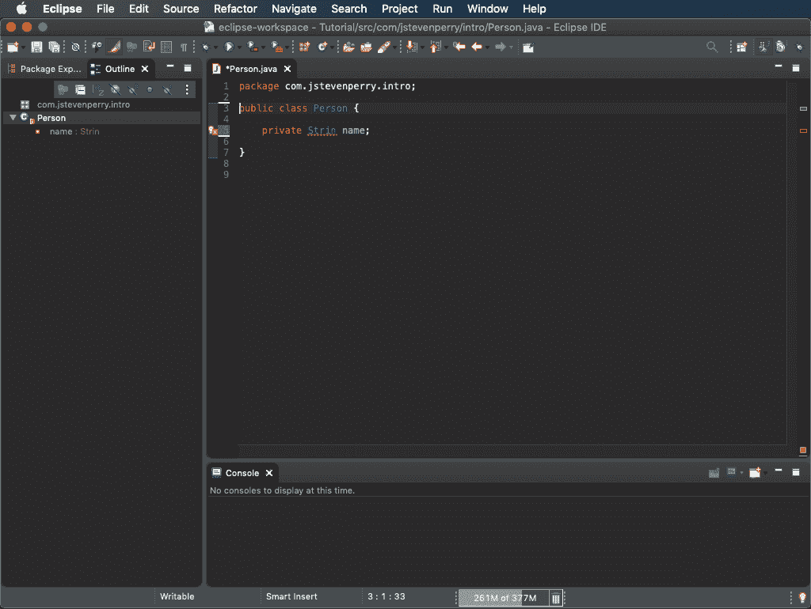
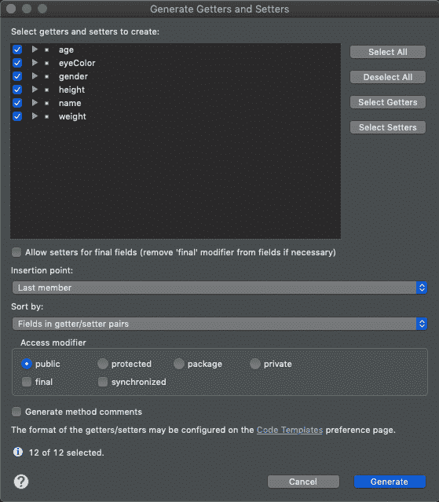
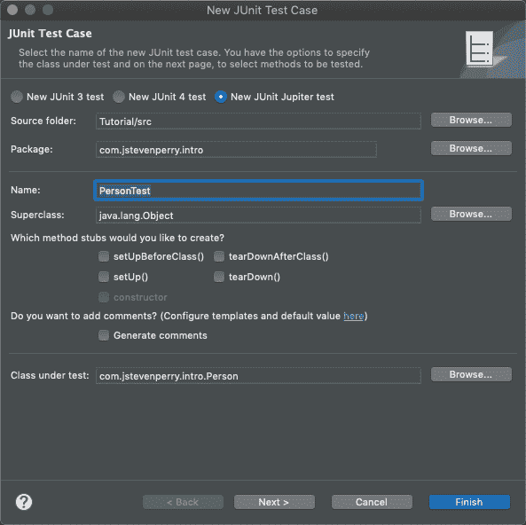
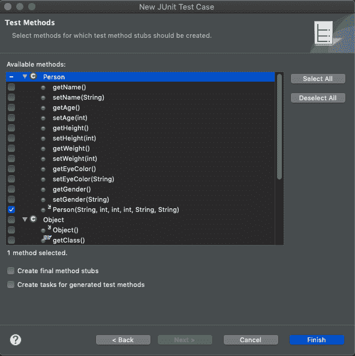
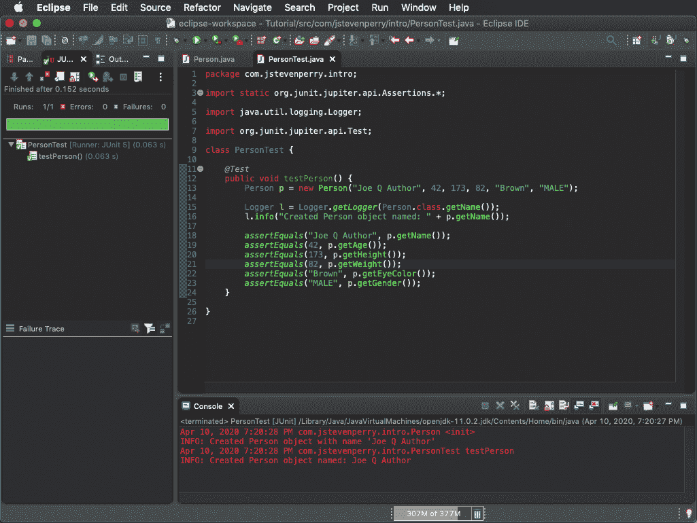
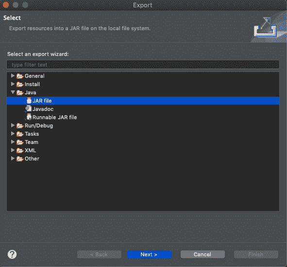
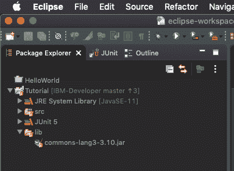

# Java 语言基础

> 原文：[`developer.ibm.com/zh/tutorials/j-introtojava2/`](https://developer.ibm.com/zh/tutorials/j-introtojava2/)

## 开始之前

本教程是 *Java 编程入门* 系列的一部分。

| 级别 | 主题 | 类型 |
| --- | --- | --- |
| 101 | 设置您的 Java 开发环境并学习基本的面向对象编程的原理 | 教程 |
| **102** | **Java 语言基础** | 教程 |
| 103 | 编写良好的 Java 代码 | 教程 |
| 201 | 构造真实的应用程序，第 1 部分 | 教程 |
| 202 | 构造真实的应用程序，第 2 部分 | 教程 |

尽管各单元中讨论的概念具有独立性，但实践组件是在您学习各单元的过程中逐步建立起来的，推荐您在继续学习之前复习前提条件、设置和单元细节。

## 目标

*   了解 Java 对象的结构
*   在 Eclipse 中创建并测试您的第一个 Java 类
*   学习访问器方法声明和方法调用的语法，以将行为添加到 Java 类
*   实例化和操作字符串，并探索算术运算符
*   使用条件运算符和控制语句在代码中做出决策
*   了解循环以及如何使用循环结构遍历代码或重复执行
*   创建和管理对象的集合
*   使用 Java 存档（JAR）文件打包您的应用程序并导入其他开发者的代码

## Java 语言入门

在单个教程中介绍整个 Java 语言语法似乎不太可能。本教程重点介绍该语言的基础知识，使您有足够的知识和实践来编写简单的程序。OOP 都是关于对象的，因此本节从 Java 语言如何处理与它特别相关的两个主题开始：保留字和 Java 对象的结构。

### 保留字

跟任何编程语言一样，Java 语言指定了一些编译器认为具有特殊含义的关键字。出于该原因，不允许您使用它们来命名您的 Java 结构。保留字（也称为 *关键字*）非常少：

```
abstract
assert
boolean
break
byte
case
catch
char
class
const
continue
default
do
double
else
enum
extends
final
finally
float
for
goto
if
implements
import
instanceof
int
interface
long
native
new
package
private
protected
public
return
short
static
strictfp
super
switch
synchronized
this
throw
throws
transient
try
void
volatile
while 
```

您也不可以使用 `true`、`false` 和 `null`（技术上讲，它们是而不是关键字）来命名 Java 结构。

稍后将会看到，使用 IDE 编程的一个优势是，它可以为保留字使用语法颜色。

### Java 类的结构

类是一个包含属性和行为的离散实体（对象）的蓝图。类定义对象的基本结构，在运行时，您的应用程序会创建对象的 *实例* 。对象拥有明确定义的边界和状态，它可在被正确请求时执行操作。每种面向对象的语言都拥有有关如何定义类的规则。

在 Java 语言中，类的定义如清单 1 所示：

##### 清单 1\. 类定义

```
package packageName;
import ClassNameToImport;
accessSpecifier class ClassName {
  accessSpecifier dataType variableName [= initialValue];
  accessSpecifier ClassName([argumentList]) {
    constructorStatement(s)
  }
  accessSpecifier returnType methodName ([argumentList]) {
    methodStatement(s)
  }
  // This is a comment
  /* This is a comment too */
  /* This is a
     multiline
     comment */
} 
```

**注意**
在清单 1 和本节的其他一些代码示例中，方括号表示它们之中的结构不是必需的。方括号（不同于 `{` 和 `}`）不是 Java 语法的一部分。

清单 1 包含各种不同的结构类型，第 1 行是 `package`，第 2 行是 `import`，第 3 行是 `class`。这 3 种结构都属于保留字 ，所以它们必须保持清单 1 中的准确格式。我为清单 1 中的其他结构提供的名称描述了它们表达的概念。

可以注意到清单 1 中的第 11 到 15 行是注释行。在大多数编程语言中，程序员都可添加注释来帮助描述代码。Java 语法允许单行和多行注释。

```
// This is a comment
/* This is a comment too */
/* This is a
multiline
comment */ 
```

单行注释必须包含在一行上，但您可使用邻近的单行注释来形成一个注释组。多行注释以 `/∗` 开头，必须以 `∗/` 终止，而且可以涵盖任意多行。

接下来，我将详细介绍清单 1 中的结构，首先看看 `package`。

### 打包类

在 Java 语言中，您可选择类的名称，比如 `Account`、`Person` 或 `LizardMan`。有时，您可能最终使用了同一个名称来表达两个稍微不同的概念。这种情形称为 *名称冲突* ，经常会发生。Java 语言使用 *包* 来解决这些冲突。

Java 包是一种提供 *命名空间* 的机制 — 名称在命名空间中是唯一的，但在其外部可能不是唯一的。要唯一地标识一个结构，您必须包含它的命名空间来完全限定它。

包也是利用多个离散功能单元来构造更复杂应用程序的不错方式。

要定义包，可使用 `package` 关键字，后跟一个合法的包名称，并以一个分号结尾。包名称常常遵循这种 *事实* 标准模式：

```
package  orgType.orgName.appName.compName; 
```

这个包定义可分解为：

*   `orgType` 是组织类型，比如 `com`、`org` 或 `net` 。
*   `orgName` 是组织的域名称，比如 `makotojava`、`oracle` 或 `ibm` 。
*   `appName` 是缩写的应用程序名称。
*   `compName` 是组件的名称。

本课程将使用此约定，而且我推荐坚持使用它来定义包中的所有 Java 类。（Java 语言没有强制要求您遵循这种包约定。您完全不需要指定一个包，但在这种情况下，您的所有类必须具有唯一名称且将位于默认包中。）

**Eclipse 使导入简化**
在 Eclipse 编辑器中编写代码时，您可键入想要使用的类的名称，然后按 Ctrl+Shift+O。Eclipse 会确定您需要哪些导入语句并自动添加它们。如果 Eclipse 找到两个具有相同名称的类，它会询问您想为哪个类添加导入语句。

### 导入语句

类定义中的下一部分（返回参考清单 1 ）是 *导入语句* 。导入语句告诉 Java 编译器在何处查找您在代码中引用的类。任何非简单的类都会使用其他类来实现某种功能，导入语句是您向 Java 编译器告知这些类的方式。

导入语句通常类似于：

```
import ClassNameToImport; 
```

您指定 `import` 关键字，后跟您想要导入的类，然后输入一个分号。类名应是 *完全限定的* ，意味着名称中应包含它的包。

要导入一个包中的所有类，您可将 `.*` 放在包名称后。例如，这条语句导入 `com.makotojava` 包中的每个类：

```
import com.makotojava.*; 
```

但是，导入整个包会降低代码的可读性，所以我推荐使用完全限定名称来仅导入需要的类。

### 类声明

要在 Java 语言中定义一个对象，必须声明一个类。可将类视为对象的模板，就像饼干模具一样。

清单 1 包含以下类声明：

```
accessSpecifier class ClassName {
  accessSpecifier dataType variableName [= initialValue];
    accessSpecifier ClassName([argumentList]) {
    constructorStatement(s)
  }
  accessSpecifier returnType methodName([argumentList]) {
    methodStatement(s)
  }
} 
```

类的 `accessSpecifier` 可拥有多个值，但该值通常为 `public`。您很快会看到 `accessSpecifier` 的其他值。

可以将类命名为您想要的任何名称，但约定是使用 *驼峰式大小写* ：以一个大写字母开头，但将串联的每个单词的第一个字母大写，将所有其他字母小写。类名应仅包含字母和数字。坚持这些准则，可确保代码更容易供其他遵循相同约定的人使用。

### 变量和方法

类可拥有两种类型的 *成员* — *变量* 和 *方法* 。

#### 变量

类的变量的值可以区分该类的每个实例并定义它的状态。这些值常常称为 *实例变量* 。一个变量有：

*   一个 `accessSpecifier`
*   一个 `dataType`
*   一个 `variableName`
*   一个可选的 `initialValue`

可能的 `accessSpecifier` 值包括：

**公共变量**
使用公共变量绝不是一个好主意，但在极少的情况下有必要这么做，所以存在这个选项。Java 平台不会限制您的使用情形，所以需要您自己遵守使用良好的编码约定的纪律，即使您被诱惑不这么做。

*   `public`：任何包中的任何对象都能看到该变量。（不要使用此值；请参阅 **公共变量** 边栏。）
*   `protected`：在同一个包中或（在任何包中定义的）一个子类中定义的任何对象都能看到此变量。
*   没有修饰符（也称为 *友好* 或 *包私有* 访问）：仅在同一个包中定义的类的对象能够看到此变量。
*   `private`：只有包含该变量的类能够看到它。

变量的 `dataType` 取决于变量的类型 — 它可能是一种原语类型或另一种类类型（稍后将更详细地介绍）。

`variableName` 由您自己决定，但根据约定，变量名使用驼峰式大小写约定，但它们以小写字母开头。（这种样式有时称为 *小驼峰式大小写* 。）

现在暂时不要关心 `initialValue`，只需知道可以在声明一个实例变量时初始化它。（否则，编译器会为您生成一个在实例化该类时设置的默认值。）

#### 示例：Person 的类定义

这个示例总结了您目前所学的知识。清单 2 是 `Person` 的类定义。

##### 清单 2\. `Person` 的基类定义

```
package com.makotojava.intro;

public class Person {
   private String name;
   private int age;
   private int height;
   private int weight;
   private String eyeColor;
   private String gender;
} 
```

`Person` 的这个基类定义目前不是很有用，因为它仅定义了 `Person` 的属性（而且是私有属性）。要更加完整，`Person` 类还需要行为 — 也就是 *方法* 。

#### 方法

类的方法定义它的行为。

方法分为两个主要类别： *构造方法* ；以及所有其他方法，这些方法具有许多类型。构造方法仅用于创建类的实例。其他类型的方法可用于几乎任何应用程序行为。

清单 1 中的类定义给出了定义方法的结构的方式，该结构包括的元素有：

*   `accessSpecifier`
*   `returnType`
*   `methodName`
*   `argumentList`

这些结构元素在方法定义中的组合称为方法的 *签名* 。

现在仔细看看两种方法类别，首先看看构造方法。

##### 构造方法

可使用构造方法指定如何实例化类。清单 1 以抽象形式给出了构造方法声明语法；这里再次给出了它：

```
accessSpecifier ClassName([argumentList]) {
  constructorStatement(s)
} 
```

构造方法的 `accessSpecifier` 与变量的相同。构造方法的名称必须与类名匹配。所以如果您将类命名为 `Person`，构造方法的名称必须也是 `Person`。

对于任何其他不是默认构造方法的构造方法（参见 **构造方法是可选的**），您需要传递一个 `argumentList`，其中包含一个或多个：

```
argumentType argumentName 
```

* * *

**构造方法是可选的**

如果您不提供构造方法，编译器会为您提供一个，这个方法称为默认（或 *无参数* 或 *no-arg*）构造方法。如果您使用的构造方法不是 *no-arg* 构造方法，编译器不会自动为您生成一个。

* * *

`argumentList` 中的参数用逗号分隔，而且任何两个参数不能具有相同名称。`argumentType` 是一种原语类型或另一种类类型（与变量类型相同）。

##### 包含构造方法的类定义

现在来看看在添加了通过两种方式创建 `Person` 对象的能力后会发生什么：通过使用 no-arg 构造方法和通过初始化一个部分属性列表。

清单 3 展示了如何创建构造方法，以及如何使用 `argumentList`：

##### 清单 3\. 包含构造方法的 `Person` 类定义

```
package com.makotojava.intro;
public class Person {
  private String name;
  private int age;
  private int height;
  private int  weight;
  private String eyeColor;

  private String gender;
  public Person() {
    // Nothing to do...
  }

  public Person(String name, int age, int height, int weight String eyeColor, String gender) {
    this.name = name;
    this.age = age;
    this.height = height;
    this.weight = weight;
    this.eyeColor = eyeColor;
    this.gender = gender;
  }
} 
```

可以注意到，清单 3 中使用了 `this` 关键字来执行参数赋值 `this` 关键字是 “this object” 的 Java 速记形式，在引用两个具有相同名称的变量时必须使用它。在本例中，`age` 既是一个构造方法参数，又是一个类变量，所以 `this` 关键字可帮助编译器消除引用的歧义。

`Person` 对象变得越来越有趣了，但它需要有更多行为。为此，您需要更多方法。

#### 其他方法

构造方法是一种具有特定功能的特定方法类型。类似地，其他许多类型的方法执行 Java 程序中的特定功能。从本节到本课程结束，将探索其他方法类型。

返回到清单 1 中，可以看到方法的声明方式：

```
accessSpecifier returnType methodName ([argumentList]) {
  methodStatement(s)
} 
```

其他方法看起来非常像构造方法，但有两处例外。首先，您可为其他方法提供您喜欢的任何名称（但是，肯定要遵守某些规则）。我推荐以下约定：

*   以小写字母开头。
*   避免使用数字，除非确实有必要使用它们。
*   仅使用字母字符。

第二，不同于构造方法，其他方法拥有一个可选的 *返回类型* 。

##### Person 的其他方法

有了这些基本信息，您就可以在清单 4 中看到在向 `Person` 对象添加一些方法后发生的情况。（为简洁起见，我省略了构造方法。）

##### 清单 4\. 包含一些新方法的 `Person`

```
package com.makotojava.intro;

public class Person {
   private String name;
   private int age;
   private int height;
   private int  weight;
   private String eyeColor;
   private String gender;

   public String getName() { return name; }
   public void setName(String value) { name = value; }
   // Other getter/setter combinations...
} 
```

注意清单 4 中有关 “getter/setter 组合” 的注释。稍后会更多地使用 getter 和 setter。就现在而言，您只需知道 *getter* 是一个检索属性值的方法， *setter* 是一个修改该值的方法。清单 4 仅给出了一种 getter/setter 组合（针对 `Name` 属性），但您可通过类似方式定义更多组合。

注意在清单 4 中，如果一个方法没有返回值，您必须在该方法的签名中指定 `void` 返回类型来告诉编译器。

##### 静态和实例方法

通常会使用两种类型的（非构造）方法： *实例方法* 和 *静态方法* 。实例方法依赖于特定对象实例的状态来执行其行为。静态方法有时也称为 *类方法* ，因为它们的行为不依赖于任何一个对象的状态。静态方法的行为在类级别上发生。

静态方法主要用于实用程序；您可将它们视为全局方法（类似于 C 语言），但将该方法的代码与定义它的类放在一起。

例如，在后面各节中，将使用 JDK `Logger` 类向控制台输出信息。要创建一个 `Logger` 类实例，不需要实例化一个 `Logger` 类；而是调用一个名为 `getLogger()` 的静态方法。

在类上调用静态方法的语法不同于在对象上调用方法的语法。您还会使用包含该静态方法的类的名称，如这个调用中所示：

```
Logger l = Logger.getLogger("NewLogger"); 
```

在这个示例中，`Logger` 是类名，`getLogger(...)` 是方法名。所以要调用静态方法，您不需要对象实例，只需要类名。

## 您的第一个 Java 类

现在是时候将您在上一节中学到的东西结合起来，并开始编写一些代码。本节将引导您声明一个类，并使用 Eclipse Package Explorer 向其添加变量和方法。您将学习如何使用 `Logger` 类来监视应用程序的行为，以及如何将 `main()` 方法用作*测试工具*（test harness）。 测试工具是通过在各种条件下运行程序单元并监视其行为和输出来测试程序单元的软件和测试数据的集合。

下面的视频演示了本节的所有步骤。首先观看它，然后我将以文字形式简要复述这些步骤，同时更仔细地分析代码。

[https://cdnapisec.kaltura.com/p/1773841/sp/177384100/embedIframeJs/uiconf_id/44854321/partner_id/1773841?iframeembed=true&playerId=kplayer&entry_id=0_1yp19kbo&flashvars[streamerType]=auto](https://cdnapisec.kaltura.com/p/1773841/sp/177384100/embedIframeJs/uiconf_id/44854321/partner_id/1773841?iframeembed=true&playerId=kplayer&entry_id=0_1yp19kbo&flashvars[streamerType]=auto)

### 创建一个包

如果未在（Java 透视图中的）Package Explorer 视图中，可在 Eclipse 中通过 **Window > Perspective > Open Perspective** 进入该视图。您将通过设置来创建您的第一个 Java 类。第一步是创建一个放置该类的位置。包是名称空间构造，而且它们可方便地直接映射到文件系统的目录结构。

您可以不使用默认包（这通常是一个坏主意），而是专门为您正在编写的代码创建一个包。单击 **File > New > Package** 启动 Java Package 向导，如图 1 所示。

##### 图 1\. Eclipse Java Package 向导



将 `com.makotojava.intro` 键入到 Name 文本框中并单击 **Finish**。可以在 Package Explorer 中看到创建的新包。

### 声明类

可以从 Package Explorer 中通过多种方式创建类，但最简单的方法是右键单击刚创建的包并选择 **New > Class…** 。New Class 对话框将会打开。

在 Name 文本框中，键入 `Person`，然后单击 **Finish**。

新类将显示在编辑窗口中。建议关闭一些在您首次打开 Java 透视图时其中默认打开的视图（Problems、Javadoc 等），以便更容易查看您的源代码。（在下次打开 Eclipse 并转到 Java 透视图时，Eclipse 会记住您不想看到这些视图。）图 2 显示了一个打开了必要视图的工作区。

##### 图 2\. 一个井然有序的工作区



Eclipse 为您生成了一个 shell 类，并在顶部包含 `package` 语句。您现在只需充实该类。可以通过 **Window > Preferences > Java > Code Style > Code Templates** 配置 Eclipse 如何生成新类。为了简便起见，我们使用了 Eclipse 的开箱即用的代码生成功能。

在图 2 中，请注意新的源代码文件名称旁边的星号 (`*`)，它表示我已进行了修改。另请注意，该代码尚未保存。接下来请注意我在声明 `Name` 属性时犯了一个错误：我将 `Name` 的类型声明为了 `Strin`。编译器无法找到对这样一个类的引用，所以将它标记为一个编译错误（在 `Strin` 下添加了红色的波浪线）。当然，我在 `Strin` 的末尾添加一个 `g` 来修复我的错误。这是对使用 IDE 而不是使用命令行工具进行软件开发的一个小示范。可通过将类型更改为 `String` 来更正该错误。

### 添加类变量

在清单 3 中，已经开始充实 `Person` 类，但我没有过多地解释语法。现在，我将正式定义如何添加类变量。

回想一下，一个变量有一个 `accessSpecifier`、一个 `dataType`、一个 `variableName` 和一个可选的 `initialValue`。之前，您简单了解了如何定义 `accessSpecifier` 和 `variableName`。现在，您已看到一个变量可以拥有的 `dataType`。

`dataType` 可以是原语类型或对另一个对象的引用。例如，可以注意到 `Age` 是一个 `int`（原语类型），`Name` 是一个 `String`（一个对象）。JDK 提供了大量有用的类，比如 `java.lang.String`，而且不需要导入 `java.lang` 包中的类（Java 编译器采用的一种简写形式）。但无论 `dataType` 是 JDK 类（比如 `String`），还是用户定义的类，语法都基本相同。

表 1 给出了您可能经常看到的 8 种原语数据类型，包括没有显式初始化某个成员变量的值时这些原语采用的默认值。

##### 表 1\. 原语数据类型

| 类型 | 大小 | 默认值 | 值范围 |
| --- | --- | --- | --- |
| `boolean` | 不适用 | false | true 或 false |
| `byte` | 8 位 | 0 | -128 到 127 |
| `char` | 16 位 | （无符号） | \u0000′ \u0000′ 到 \uffff’ 或 0 到 65535 |
| `short` | 16 位 | 0 | -32768 到 32767 |
| `int` | 32 位 | 0 | -2147483648 到 2147483647 |
| `long` | 64 位 | 0 | -9223372036854775808 到 9223372036854775807 |
| `float` | 32 位 | 0.0 | 1.17549435e-38 到 3.4028235e+38 |
| `double` | 64 位 | 0.0 | 4.9e-324 到 1.7976931348623157e+308 |

### 内置日志功能

在进一步学习编码之前，需要知道您的程序如何告诉您它们在做什么。

Java 平台包含 `java.util.logging` 包，这是一种以可读形式收集程序信息的内置记录机制。Logger 是您通过对 `Logger` 类执行静态方法调用所创建的命名实体：

```
import java.util.logging.Logger;
//...
Logger l = Logger.getLogger(getClass().getName()); 
```

在调用 `getLogger()` 方法时，向它传递了一个 `String`。就现在而言，只需养成传递您正编写的代码所在类的名称的习惯。在任何常规（即非静态）方法中，前面的代码始终引用该类的名称并将它传递给 `Logger`。

如果要在一个静态方法内调用一次 `Logger` ，可引用您所在的类的名称：

```
Logger l = Logger.getLogger(Person.class.getName()); 
```

在这个示例中，您所在的类是 `Person` 类，所以您引用了一个称为 `class` 的特殊文字，它检索 `Class` 对象（将在以后更详细介绍）并获取其 `Name` 属性。

在编写良好的 Java 代码教程中包含一个如何 *不* 进行日志记录的技巧。

开始执行测试之前，首先进入 `Person` 的 Eclipse 源代码编辑器，并将此代码添加到清单 3 中的 `public class Person {` 后，类似于这样：

```
package com.makotojava.intro;

public class Person {
  private String name;
  private int age;
  private int height;
  private int weight;
  private String eyeColor;
  private String gender;
} 
```

Eclipse 拥有一个方便的代码生成器来生成 getter 和 setter（以及其他内容）。要尝试使用代码生成器，请将鼠标光标放在 `Person` 类定义上（即放在类定义中的单词 `Person` 上），然后单击 **Source > Generate Getters and Setters…** 。对话框打开时，单击 **Select All** ，如图 3 所示。

##### 图 3\. 生成 getter 和 setter 的 Eclipse



对于插入点，请选择 **Last member** 并单击 **OK**。

现在，将一个构造方法添加到 `Person` 中，方法是将清单 5 中的代码键入到您的源代码窗口中，放在类定义顶部部分下方（`public class Person ()` 下方紧接的一行）。

##### 清单 5\. `Person` 构造方法

```
public Person(String name, int age, int height, int weight, String eyeColor, String gender) {
  this.name = name;
  this.age = age;
  this.height = height;
  this.weight = weight;
  this.eyeColor = eyeColor;
  this.gender = gender;
} 
```

确保没有看到表示编译错误的波浪线。

**使用 `main()` 作为测试平台**

`main()` 是一个特殊方法，可以将它包含在任何类中，以便 JRE 可执行其代码。类不是必须拥有 `main()` 方法 <mdash>事实上，大部分类从没拥有该方法 <mdash>而且一个类最多可拥有一个 `main()` 方法。 `main()` 是一种值得拥有的方便方法，因为它为类提供了一个快速测试平台。在企业开发中，将会使用测试库，比如 JUnit，但使用 `main()` 作为测试平台可以快速直接地创建测试平台。</mdash></mdash>

#### 生成一个 JUnit 测试案例

现在生成一个 JUnit 测试案例，在该案例中，使用了清单 5 中的构造方法来实例化一个 `Person`，然后将该对象的状态输出到控制台。从这种意义上讲，“测试”可确保构造方法调用采用的属性顺序是正确的（也就是说，为它们设置了正确的属性）。

在 Package Explorer 中，右键单击您的 `Person` 类，然后单击 **New > JUnit Test Case**。New JUnit Test Case 向导的第一页将会打开，如图 4 所示。

##### 图 4\. 创建一个 JUnit 测试案例



单击 **Next** 接受默认值。您会看到 Test Methods 对话框，如图 5 所示。

##### 图 5\. 选择方法（向导将为其生成测试案例）



在这个对话框中，选择您想让向导为其构建测试的一个或多个方法。在本例中，仅选择构造方法，如图 5 所示。单击 **Finish**，Eclipse 会生成 JUnit 测试案例。

接下来，打开 `PersonTest`，进入 `testPerson()` 方法，使它看起来类似于清单 6。

##### 清单 6\. `testPerson()` 方法

```
@Test
public void testPerson() {
  Person p = new Person("Joe Q Author", 42, 173, 82, "Brown", "MALE");
  Logger l = Logger.getLogger(Person.class.getName());
  l.info("Name: " + p.getName());
  l.info("Age:"+ p.getAge());
  l.info("Height (cm):"+ p.getHeight());
  l.info("Weight (kg):"+ p.getWeight());
  l.info("Eye Color:"+ p.getEyeColor());
  l.info("Gender:"+ p.getGender());
  assertEquals("Joe Q Author", p.getName());
  assertEquals(42, p.getAge());
  assertEquals(173, p.getHeight());
  assertEquals(82, p.getWeight());
  assertEquals("Brown", p.getEyeColor());
  assertEquals("MALE", p.getGender());
} 
```

暂时不用担心 `Logger` 类。只需输入您在清单 6 中看到的代码即可。您现在已准备好运行您的第一个 Java 程序和 JUnit 测试案例。

### 在 Eclipse 中运行单元测试

在 Eclipse 中，右键单击 Package Explore 中的 PersonTest.java 并选择 **Run As** > **JUnit Test**。图 6 显示了发生的情况。

##### 图 6\. 查看 `Person` 的运行状况



控制台视图将会自动打开，以显示 `Logger` 输出，JUnit 视图表明测试运行正常。

## 向 Java 类添加行为

`Person` 目前看起来还不错，但可以使用一些额外的行为让它变得更有趣。创建行为意味着添加方法。本节会更详细地介绍 *访问器方法* — 即您已看到过的 getter 和 setter。

### 访问器方法

您在上一节末尾处实际看到的 getter 和 setter 称为 *访问器方法* 。（快速回顾：getter 是检索属性值的方法；setter 是修改该值的方法。）要封装一个类中来自其他对象的数据，可以将它的变量声明为 `private`，然后提供访问器方法。

访问器的命名遵循称为 *JavaBeans 模式* 的严格约定。在此模式中，任何 `Foo` 属性都有一个称为 `getFoo()` 的 getter 方法和一个称为 `setFoo()` 的 setter 方法。JavaBeans 模式很常见，所以 Eclipse IDE 中内置了对它的支持，您在生成 `Person` 的 getter 和 setter 时已看到。

访问器遵循以下准则：

*   属性始终使用 `private` 访问级别来声明。
*   getter 和 setter 的访问说明符是 `public`。
*   getter 不接受任何参数，而且返回一个与它访问的属性同类型的值。
*   setter 仅接受一个与该属性同类型的参数，而且不返回值。

### 声明访问器

目前为止，声明访问器的最简单方法是让 Eclipse 为您声明它。但您还需要知道如何手动编写一个 getter 和 setter 对。

假设我有一个属性 `Foo`，它的类型为 `java.lang.String`。我的完整 `Foo` 声明（依照访问器准则）是：

```
private String foo;
public String getFoo() {
  return foo;
}
public void setFoo(String value) {
  foo = value;
} 
```

注意，传递给 setter 的参数值的命名方式与通过 Eclipse 生成它时所用的命名方式不同（其中参数名称与属性名称相同 — 例如 `public void setFoo(String **foo**)`）。在我手动编写 setter 的极少数情况下，我始终使用 `value` 作为 setter 的参数值名称。这个吸引眼球的词汇（我自己的规范，建议其他开发人员也这么做）提醒我，我已经手动编写了 setter。如果我没有使用 Eclipse 为我生成 getter 和 setter，那么我一定拥有合理的理由。使用 `value` 作为 setter 的参数值，这会提醒我这个 setter 很特殊。（代码注释可满足同样的用途。）

### 调用方法

调用方法很简单。例如，清单 6 中的 `testPerson` 方法调用 `Person` 的各种 getter 来返回它们的值。现在，我将正式介绍执行方法调用的机制。

#### 包含参数和不含参数的方法调用

要在对象上调用某个方法，需要使用对该对象的引用。方法调用语法包含：

*   对象引用
*   一个句点
*   方法名称
*   所有需要传递的参数

不含参数的方法调用的语法为：

```
objectReference.someMethod(); 
```

以下是一个示例：

```
Person p = new Person("Joe Q Author", 42, 173, 82, "Brown", "MALE");
p.getName(); 
```

包含参数的方法调用的语法为：

```
objectReference.someOtherMethod(parameter1, parameter2, ..., parameterN); 
```

以下是一个示例（设置 `Person` 的 `Name` 属性）：

```
Person p = new Person("Joe Q Author", 42, 173, 82, "Brown", "MALE");
p.setName("Jane Q Author"); 
```

记住，构造方法也是方法。而且您可使用空格和换行符来分隔参数。Java 编译器并不关心分隔方法。下面的两个方法调用是等效的：

```
new Person("Joe Q Author", 42, 173, 82, "Brown", "MALE"); 
```

```
new Person("Joe Q Author",// Name
  42,     // Age
  173,    // Height in cm
  82,     // Weight in kg
  "Brown",// Eye Color
  "MALE");// Gender 
```

注意，第二个构造方法调用中的注释使得下一个使用此代码的人更容易理解它。该开发人员一眼就能判断出每个参数的用途。

#### 嵌套的方法调用

方法调用也可以嵌套：

```
Logger l = Logger.getLogger(Person.class.getName());
l.info("Name: " + p.getName()); 
```

在这里，您将 `Person.class.getName()` 的返回值传递给 `getLogger()` 方法。请记住，`getLogger()` 方法调用是一个静态方法调用，所以它的语法稍微不同。（您不需要一个 `Logger` 引用来执行该调用；而是可以在调用的左侧使用类的名称。）

这就是方法调用。

## 字符串和运算符

目前为止，教程中介绍了许多 `String` 类型的变量，但没有进行太多解释。您在这一节中会进一步了解字符串，还会了解何时和如何使用运算符。

### 字符串

在 C 语言中，处理字符串需要花费很大精力，因为字符串是以 null 结尾的数组，其中包含必须处理的 8 位字符。（在字符串方面，与 C 语言最接近的 Java 代码是 `char` 原语数据类型，它可以包含单个 Unicode 字符，比如 *a*。）

在 Java 语言中，字符串是 `String` 类型的一级对象，包含一些可帮助您处理它们的方法。

* * *

**注意：** 在 C 语言中，处理字符串需要花费很大精力，因为字符串是以 null 结尾的数组，其中包含必须处理的 8 位字符。在字符串方面，与 C 语言最接近的 Java 代码是 *char* 原语数据类型，它可以包含单个 Unicode 字符，比如 *a*。.

* * *

以下是两种创建字符串的方法，我们使用创建一个名为 `greeting` 且值为 `hello` 的 `String` 实例为例：

```
greeting = new String("hello"); 
```

```
String greeting = "hello"; 
```

因为 `String` 是一级对象，所以可使用 `new` 实例化它们。将一个 `String` 类型的变量设置为字符串字面常量具有相同的结果，因为 Java 语言会创建一个 `String` 对象来保存字面常量，然后将该对象分配给该实例变量。

#### 串联字符串

可以使用 `String` 做许多事情，该类有许多很有帮助的方法。甚至还没有使用方法，您就已经通过串联（或组合）两个 `String` ，在 `Person` 类的 `testPerson()` 方法中做了一些有趣的事情：

```
l.info("Name: " + p.getName()); 
```

加号 (`+`) 在 Java 语言中是串联 `String` 的简单表示。（在循环内执行这种串联会影响性能，但目前已不需要担心这一点。）

#### 串联练习

现在，可以尝试在 `Person` 类内串联两个 `String` 字符串。此刻您有一个 `name` 实例变量，但有一个 `firstName` 和 `lastName` 会让应用程序更接近真实的业务应用程序。然后，您可以在另一个对象请求 `Person` 的全名时串联它们。

返回到 Eclipse 项目，首先添加新实例变量（放在源代码中目前定义 `name` 的相同位置）：

```
//private String name;
private String firstName;
private String lastName; 
```

注释掉 `name` 定义；您不再需要它，因为已将它替换为 `firstName` 和 `lastName`。

#### 链式方法调用

现在，告诉 Eclipse 代码生成器生成 `firstName` 和 `lastName` 的 getter 和 setter（如有必要，请参考前面的您的第一个 Java 类 部分）。然后删除 `setName()` 和 `getName()` 方法，添加一个新的 `getFullName()` 方法，使代码类似于：

```
public String getFullName() {
  return getFirstName().concat(" ").concat(getLastName());
} 
```

此代码演示了方法调用的 *链接* 。链接是一种经常用于不可变对象（比如 `String` ）的技术，在链接中，修改一个不可变对象总是返回修改后的对象（但不会更改原始对象）。然后，您可以在返回的已更改的值上进行操作。

### 运算符

您已看到，Java 语言使用 `=` 运算符将值赋给变量。正如您可能期望的，Java 语言可执行算术运算，而且它也使用运算符实现此目的。现在，我将简要介绍一下随着您技能的提升需要掌握的一些 Java 语言运算符。

Java 语言使用两种类型的运算符：

*   *一元* (unary)：只需一个操作数。
*   *二元* (binary)：需要两个操作数。

表 2 总结了 Java 语言的算术运算符：

##### 表 2\. Java 语言的算术运算符

| 运算符 | 用法 | 说明 |
| --- | --- | --- |
| `+` | `a + b` | 将 `a` 和 `b` 相加 |
| `+` | `+a` | 如果 `a` 为 `byte` 、 `short` 或 `char` ，则将它升级为 `int` |
| `-` | `a - b` | 从 `a` 中减去 `b` |
| `-` | `-a` | 求 `a` 的算术负数 |
| `*` | `a * b` | 将 `a` 和 `b` 相乘 |
| `/` | `a / b` | 将 `a` 除以 `b` |
| `%` | `a % b` | 返回将 `a` 除以 `b` 的余数（取模运算符） |
| `++` | `a++` | 将 `a` 递增 1；计算递增之前 `a` 的值 |
| `++` | `++a` | 将 `a` 递增 1；计算递增之后 `a` 的值 |
| `--` | `a--` | 将 `a` 递减 1；计算递减之前 `a` 的值 |
| `--` | `--a` | 将 `a` 递减 1；计算递减之后 `a` 的值 |
| `+=` | `a += b` | `a = a + b` 的简写 |
| `-=` | `a -= b` | `a = a - b` 的简写 |
| `*=` | `a *= b` | `a = a * b` 的简写 |
| `%=` | `a %= b` | `a = a % b` 的简写 |

##### 其他运算符

除了表 2 中的运算符之外，还可以看到其他一些在 Java 语言中称为运算符的符号，包括：

*   句点 (`.`)，它限定了包的名称并调用方法
*   圆括号 (`()`)，它限定了一个方法的逗号分隔的参数列表
*   `new`，（后跟一个构造方法名称时）它实例化了一个对象

Java 语言语法也包含一些专门用于条件编程的运算符 — 即根据不同输入提供不同响应的程序。下一节将介绍这些运算符。

## 条件运算符和控制语句

在本节中，将了解可用来告诉 Java 程序，您希望它们根据不同的输入来执行何种操作的各种语句和运算符。

### 关系和条件运算符

Java 语言提供了可在代码中用来制定决策的运算符和控制语句。代码中的决策常常以一个 *Boolean 表达式* 开始 — 也即一个计算为 `true` 或 `false` 的表达式。这些表达式使用 *关系运算符* （将一个操作数或表达式与另一个比较）和 *条件运算符* 。

表 3 列出了 Java 语言的关系和条件运算符。

##### 表 3\. 关系和条件运算符

| 运算符 | 用法 | 返回 true 的条件…… |
| --- | --- | --- |
| `>` | `a > b` | `a` 大于 `b` |
| `>=` | `a >= b` | `a` 大于或等于 `b` |
| < | a < b | `a` 小于 `b` |
| <= | a <= b | `a` 小于或等于 `b` |
| `==` | `a == b` | `a` 等于 `b` |
| `!=` | `a != b` | `a` 不等于 `b` |
| `&&` | `a && b` | 如果 `a` 和 `b` 都为 true，则有条件地计算 `b` （如果 `a` 为 false，则不计算 `b` ） |
| `&#124;&#124;` | `a &#124;&#124; b` | 如果 `a` 或 `b` 为 true，则有条件地计算 `b` （如果 `a` 为 true，则不计算 `b` ） |
| `!` | `!a` | `a` 为 false |
| `&` | `a & b` | 如果 `a` 和 `b` 都为 true，则始终计算 `b` |
| `&#124;` | `a &#124; b` | 如果 `a` 或 `b` 为 true，则始终计算 `b` |
| `^` | `a ^ b` | `a` 和 `b` 不同 |

### if 语句

有了大量运算符后，是时候使用它们了。下面这段代码展示了在将一种逻辑添加到 `Person` 对象的 `getHeight()` 访问器时发生的情况：

```
public int getHeight() {
  int ret = height;
  // If locale of the computer this code is running on is U.S.,
  if (Locale.getDefault().equals(Locale.US))
    ret /= 2.54;// convert from cm to inches
  return ret;
} 
```

如果当前地区是在美国（未使用公制），将 `height`（以厘米为单位）的内部值转换为英寸可能更有意义。这个（人为设计的）示例演示了 `if` 语句的使用，该语句计算圆括号中的一个 Boolean 表达式。如果该表达式计算为 `true`，则程序执行下一个语句。

在本例中，只有在运行代码的计算机的 `Locale` 是 `Locale.US` 时，才需要执行一条语句。如果需要执行多条语句，可使用花括号来形成一条 *复合语句* 。复合语句将许多语句组合成一条语句 — 而且复合语句也可包含其他复合语句。

### 变量范围

Java 应用程序中的每个变量都拥有 *范围* 或本地化的名称空间，在该范围内，可以在代码中通过名称访问该变量。在该空间外，该变量就位于 *范围之外* ，如果尝试访问它，则会获得编译错误。Java 语言中的范围级别由声明变量的位置来定义，如清单 7 所示。

##### 清单 7\. 变量范围

```
public class SomeClass {
  private String someClassVariable;
  public void someMethod(String someParameter) {
    String someLocalVariable = "Hello";

    if (true) {
      String someOtherLocalVariable = "Howdy";
    }
    someClassVariable = someParameter; // legal
    someLocalVariable = someClassVariable; // also legal
    someOtherLocalVariable = someLocalVariable;// Variable out of scope!
  }
  public void someOtherMethod() {
    someLocalVariable = "Hello there";// That variable is out of scope!

  }
} 
```

在 `SomeClass` 中，所有实例（即非静态）方法都可以访问 `someClassVariable`。 `someParameter` 在 `someMethod` 内是可见的，但在该方法外不可见，`someLocalVariable` 也是如此。在 `if` 代码块内，声明了 `someOtherLocalVariable`，在 `if` 代码块外，它就超出了范围。出于这个原因，我们可以说 Java 拥有 *代码块范围* ，因为代码块（由 `{` 和 `}` 限定）定义了范围边界。

范围有许多规则，清单 7 给出了最常用的规则。请花几分钟熟悉一下它们。

### else 语句

有时在程序的控制流中，您希望仅在一个特定表达式未计算为 `true` 时执行操作。这时使用 `else` 将很方便：

```
public int getHeight() {
  int ret;
  if (gender.equals("MALE"))
    ret = height + 2;
  else {
    ret = height;
    Logger.getLogger("Person").info("Being honest about height...");
  }
  return ret;
} 
```

`else` 语句的原理与 `if` 相同，因为程序仅执行它遇到的下一条语句。在本例中，两条语句分组到一个复合语句中（请注意花括号），然后由程序执行。

也可以使用 `else` 执行一次额外的 `if` 检查：

```
if (conditional) {
  // Block 1
} else if (conditional2) {
  // Block 2
} else if (conditional3) {
  // Block 3
} else {
  // Block 4
} // End 
```

如果 `conditional` 计算为 `true`，则执行 `Block 1`，程序跳到最后一个花括号（通过 `// End` 表示）之后的语句。如果 `conditional` **未** 计算为 `true`，则计算 `conditional2`。如果 `conditional2` 为 true，则计算 `Block 2`，并且程序跳到最后一个花括号之后的语句。如果 `conditional2` 不为 true，则程序前进到 `conditional3`，依此类推。只有在所有 3 个条件都失败时，才执行 `Block 4`。

### 三元运算符

Java 语言提供了一个方便的运算符来执行简单的 `if` / `else` 语句检查。这个运算符的语法是：

```
(conditional) ? statementIfTrue : statementIfFalse; 
```

如果 `conditional` 计算为 `true`，则执行 `statementIfTrue`；否则执行 `statementIfFalse`。每条语句都不允许使用复合语句形式。

在获知如果条件计算为 `true`，需要执行一条语句，如果不为 true，则执行另一条语句时，使用三元运算符很方便。三元运算符通常用于初始化一个变量（比如一个返回值），类似这样：

```
public int getHeight() {
  return (gender.equals("MALE")) ? (height + 2) : height;
} 
```

问号后面的圆括号不是必需的，但它们使代码变得更可容易理解。

## 循环

除了能够对程序应用各种条件之外，还可以根据各种 `if` / `then` 场景得到不同的结果，您有时还想让代码反复执行同一件事，直到作业完成。在本节中，将了解用于迭代代码或多次执行代码的构造：

### 什么是循环？

循环是一种编程构造，它在满足某个特定条件（或某组条件）时反复执行。例如，您可能要求程序读取数据文件中的所有记录，或者依次处理数组中的每个元素。（下一节将介绍数组。）

3 种循环构造使迭代代码或多次执行代码成为可能：

*   `for` 循环
*   `while` 循环
*   `do`… `while` 循环

#### for 循环

Java 语言中的基本循环构造是 `for` 语句。可以使用 `for` 语句迭代一个值范围，以确定执行多少次循环 `for` 循环的抽象语法是：

```
for (initialization; loopWhileTrue; executeAtBottomOfEachLoop) {
  statementsToExecute
} 
```

在循环的 *开头* ，执行初始化语句（多个初始化语句可使用逗号分开）。 只要 `loopWhileTrue`（一个必须计算为 `true` 或 `false` 的 Java 条件表达式）为 true，就会执行该循环。在循环的 *底部* ，执行 `executeAtBottomOfEachLoop` 。

例如，如果想让清单 8 中的 `main()` 方法中的代码执行 3 次，可使用一个 `for` 循环。

##### 清单 8\. 一个 `for` 循环

```
public static void main(String[] args) {
  Logger l = Logger.getLogger(Person.class.getName());
  for (int aa = 0; aa < 3; aa++)
    Person p = new Person("Joe Q Author", 42, 173, 82, "Brown", "MALE");
    l.info("Loop executing iteration# " + aa);
    l.info("Name: " + p.getName());
    l.info("Age:"+ p.getAge());
    l.info("Height (cm):"+ p.getHeight());
    l.info("Weight (kg):"+ p.getWeight());
    l.info("Eye Color:"+ p.getEyeColor());
    l.info("Gender:"+ p.getGender());
  }
} 
```

在清单 8 的开头，局部变量 `aa` 初始化为 0。此语句仅在初始化该循环时执行一次。然后，该循环继续执行 3 次，每次都将 `aa` 递增 1。

在下一节将会看到，可使用一种替代性的 `for` 循环语法来循环执行实现 `Iterable` 接口的构造（比如数组和其他 Java 实用程序类）。就现在而言，只需注意清单 8 中的 `for` 循环语法的用法。

#### while 循环

`while` 循环的语法是：

```
while (condition) {
  statementsToExecute
} 
```

您可能已经猜到，如果 *condition* 计算为 `true`，则执行该循环。在每个迭代的顶部（即执行任何语句之前），计算该条件。如果该条件计算为 `true`，则执行循环。因此，如果一个 `while` 循环的条件表达式至少有一次未计算为 true，则不能执行该循环。

再次看看清单 8 中的 `for` 循环。作为对比，清单 9 使用了一个 `while` 循环来获取同样的结果。

##### 清单 9\. 一个 `while` 循环

```
public static void main(String[] args) {
  Logger l = Logger.getLogger(Person.class.getName());
  int aa = 0;
  while (aa < 3) {
    Person p = new Person("Joe Q Author", 42, 173, 82, "Brown", "MALE");
    l.info("Loop executing iteration# " + aa);
    l.info("Name: " + p.getName());
    l.info("Age:"+ p.getAge());
    l.info("Height (cm):"+ p.getHeight());
    l.info("Weight (kg):"+ p.getWeight());
    l.info("Eye Color:"+ p.getEyeColor());
    l.info("Gender:"+ p.getGender());
    aa++;
  }
} 
```

如您所见，`while` 循环需要做比 `for` 循环更多的工作。您必须初始化 `aa` 变量，还要记得在循环底部递增它。

#### do…while 循环

如果想要一个总是执行一次 *然后* 就检查它的条件表达式的循环，可以使用 `do...while` 循环，如清单 10 所示。

##### 清单 10\. 一个 `do...while` 循环

```
int aa = 0;
do {
  Person p = new Person("Joe Q Author", 42, 173, 82, "Brown", "MALE");
  l.info("Loop executing iteration# " + aa);
  l.info("Name: " + p.getName());
  l.info("Age:"+ p.getAge());
  l.info("Height (cm):"+ p.getHeight());
  l.info("Weight (kg):"+ p.getWeight());
  l.info("Eye Color:"+ p.getEyeColor());
  l.info("Gender:"+ p.getGender());
  aa++;
} while (aa < 3); 
```

条件表达式 (`aa < 3`) 在循环结束前不会执行检查。

### 循环终止

有时，需要在条件表达式计算为 `false` 之前跳出（或 *终止* ）循环。如果在一个 `String` 数组中搜索某个特定值，而且只想找到它，并不关心数组的其他元素，则可能出现这种情况。对于想要跳出循环的情况，Java 语言提供了 `break` 语句，如清单 11 所示。

##### 清单 11\. 一条 `break` 语句

```
public static void main(String[] args) {
  Logger l = Logger.getLogger(Person.class.getName());
  int aa = 0;
  while (aa < 3) {
    if (aa == 1)
      break;
    Person p = new Person("Joe Q Author", 42, 173, 82, "Brown", "MALE");
    l.info("Loop executing iteration# " + aa);
    l.info("Name: " + p.getName());
    l.info("Age:"+ p.getAge());
    l.info("Height (cm):"+ p.getHeight());
    l.info("Weight (kg):"+ p.getWeight());
    l.info("Eye Color:"+ p.getEyeColor());
    l.info("Gender:"+ p.getGender());
    aa++;
  }
} 
```

`break` 语句跳转到它所在循环外的下一条可执行语句。

### 循环继续

在清单 11 中的（简化）示例中，您只想执行循环一次并跳出。也可以只跳过循环的一次迭代，但继续执行下一次循环。要实现此目标，需要使用 `continue` 语句，如清单 12 所示。

##### 清单 12\. 一条 `continue` 语句

```
public static void main(String[] args) {
  Logger l = Logger.getLogger(Person.class.getName());
  int aa = 0;
  while (aa < 3) {
    aa++;
    if (aa == 2)
      continue;
    Person p = new Person("Joe Q Author", 42, 173, 82, "Brown", "MALE");
    l.info("Loop executing iteration# " + aa);
    l.info("Name: " + p.getName());
    l.info("Age:"+ p.getAge());
    l.info("Height (cm):"+ p.getHeight());
    l.info("Weight (kg):"+ p.getWeight());
    l.info("Eye Color:"+ p.getEyeColor());
    l.info("Gender:"+
    p.getGender());
  }
} 
```

在清单 12 中，跳过了循环的第二次迭代，但继续执行第三次迭代。例如，在处理记录并遇到一条您完全不想处理的记录时，使用 `continue` 就很方便。您可以跳过该记录并前进到下一条记录。

## Java 集合

大多数真实应用程序都会处理像文件、变量、来自文件的记录或数据库结果集这样的集合。Java 语言有一个复杂的集合框架，可以使用它创建和管理各种类型的对象集合。本节将介绍最常用的集合类并帮助您开始使用它们。

### 数组

**备注**：本节的代码示例中的方括号是 Java 数组所需语法的一部分，**不是**可选元素的指示符。

大多数编程语言都包含 *数组* 的概念，用数组来保存一组元素，Java 语言也不例外。数组基本来讲是一个相同类型的元素的集合。

可以通过两种方式声明数组：

*   创建一个具有一定大小的数组，这个大小在数组的整个生存期中是固定的。
*   创建一个具有一组初始值的数组。这个集合的大小决定了数组的大小 — 它的大小恰好够容纳所有这些值，而且它的大小在数组的整个生存期中是固定的。

#### 声明一个数组

一般而言，可以像这样声明一个数组：

```
new elementType [arraySize] 
```

可以通过两种方式创建一个整数元素数组。这条语句将创建一个拥有 5 个元素的空间的数组，但它是空的：

```
// creates an empty array of 5 elements:
int[] integers = new int[5]; 
```

这条语句创建该数组并一次性初始化它：

```
// creates an array of 5 elements with values:
int[] integers = new int[] { 1, 2, 3, 4, 5 }; 
```

或

```
// creates an array of 5 elements with values (without the new operator):
int[] integers = { 1, 2, 3, 4, 5 }; 
```

初始值放在花括号内，用逗号分隔。

另一种创建数组的方法是先创建它，然后编写一个循环来初始化它：

```
int[] integers = new int[5];
for (int aa = 0; aa < integers.length; aa++) {
  integers[aa] = aa+1;
} 
```

前面的代码声明了一个可容纳 5 个元素的整数数组。如果尝试在该数组中放入多于 5 个元素，Java 运行时将会抛出一个 *异常* 。您将在[第 2 部分](https://developer.ibm.com/zh/tutorials/j-introtojava2/) 中了解异常和如何处理它们。

#### 加载数组

要加载数组，需要循环从 1 一直到数组长度的整数（可以在数组上调用 `.length` 来获取它的长度 — 稍后会更详细地介绍相关内容）。在本例中，循环在到达 5 时停止。

加载数组后，可以像之前一样访问它：

```
Logger l = Logger.getLogger("Test");
for (int aa = 0; aa < integers.length; aa++) {
  l.info("This little integer's value is: " + integers[aa]);
} 
```

此语法也是有效的，而且（因为它更容易使用）本节将全部使用此语法：

```
Logger l = Logger.getLogger("Test");
for (int i : integers) {
  l.info("This little integer's value is: " + i);
} 
```

#### 元素索引

可将数组想成一系列的桶，每个桶中放入一个某种类型的元素。每个桶通过一个元素 *索引* 来访问：

```
element = arrayName [elementIndex]; 
```

要访问一个元素，需要数组的引用（它的名称）和包含您想要访问的元素的索引。

#### length 属性

每个数组都有一个 `length` 属性，该属性具有 `public` 可视性，可用于确定可将多少个元素放入该数组中。要访问此属性，可使用数组引用、一个句点 (.) 和关键字 length，就象这样：

```
int arraySize = arrayName.length; 
```

Java 语言中的数组 *从 0 开始建立索引* 。也就是说，对于所有数组，数组中的第一个元素始终位于 `arrayName_ [0]`，最后一个元素位于 `arrayName_ [_arrayName_.length - 1]`。

#### 一个对象数组

您已看到数组如何容纳原语类型，但值得一提的是，它们也可以容纳对象。创建一个 `java.lang.Integer` 对象数组与创建一个原语类型数组没有太多区别，可通过两种方式来创建它：

```
// creates an empty array of 5 elements:
Integer[] integers = new Integer[5]; 
```

```
// creates an array of 5 elements with values:
Integer[] integers = new Integer[] {
Integer.valueOf(1),
Integer.valueOf(2),
Integer.valueOf(3),
Integer.valueOf(4),
Integer.valueOf(5)
}; 
```

### 装箱和拆箱

Java 语言中的每种原语类型都有一个对应的 JDK 类，如表 4 所示。

##### 表 4\. 原语和对应的 JDK 类

| 原语 | 对应的 JDK 类 |
| --- | --- |
| `boolean` | `java.lang.Boolean` |
| `byte` | `java.lang.Byte` |
| `char` | `java.lang.Character` |
| `short` | `java.lang.Short` |
| `int` | `java.lang.Integer` |
| `long` | `java.lang.Long` |
| `float` | `java.lang.Float` |
| `double` | `java.lang.Double` |

每个 JDK 类都提供了相应方法来解析它的内部表示，并将其转换为相应的原语类型。例如，下面这段代码将十进制值 238 转换为一个 `Integer`：

```
int value = 238;
Integer boxedValue = Integer.valueOf(value); 
```

此技术称为 *装箱* ，因为您将原语放在一个包装器或箱子中。

类似地，要将 `Integer` 表示转换为对应的 `int` 类，可以对它进行 *拆箱* ：

```
Integer boxedValue = Integer.valueOf(238);
int intValue = boxedValue.intValue(); 
```

#### 自动装箱和自动拆箱

严格来讲，不需要显式对原语进行装箱和拆箱。可以使用 Java 语言的自动装箱和自动拆箱特性：

```
int intValue = 238;

Integer boxedValue = intValue;
//
intValue = boxedValue; 
```

但是，建议避免使用自动装箱和自动拆箱，因为它们可能导致代码可读性问题。装箱和拆箱代码段中的代码比自动装箱的代码更一目了然，因此更容易阅读；为此投入额外的工作是值得的。

#### 解析和转换装箱的类型

您已经了解了如何获取一个装箱的类型，但如何才能将一个您怀疑拥有装箱类型的数字 `String` 解析到它的正确箱子中呢？JDK 包装器类也拥有实现此目标的方法：

```
String characterNumeric = "238";
Integer convertedValue = Integer.parseInt(characterNumeric); 
```

还可以将 JDK 包装器类型的内容转换为 `String`：

```
Integer boxedValue = Integer.valueOf(238);
String characterNumeric = boxedValue.toString(); 
```

请注意，在 `String` 表达式中使用串联运算符时（您已在对 `Logger` 的调用中看到过），原语类型已自动装箱，而且包装器类型会自动在它们之上调用 `toString()`。非常方便。

### List

`List` 是一种有序集合，也称为 *序列* 。因为 `List` 是有序的，所以您能够完全控制将列表项放入 `List` 中的何处。Java `List` 集合只能包含对象（不能包含像 `int` 这样的原语类型），而且它为其行为方式定义了严格的契约。

`List` 是一个接口，所以不能直接将其实例化。（您将在[第 2 部分](https://developer.ibm.com/zh/tutorials/j-introtojava2/) 中了解接口。）这里将使用它的最常用实现 `ArrayList`。可通过两种方式声明它。第一种方式使用了显式语法：

```
List<String> listOfStrings = new ArrayList<String>(); 
```

第二种方式使用了”菱形”运算符（在 JDK 7 中引入）：

```
List<String> listOfStrings = new ArrayList<>(); 
```

注意， `ArrayList` 实例化过程中没有指定对象类型。这是因为表达式右侧的类的类型必须与左侧的类型匹配。在本教程的剩余部分中，两种类型都会用到，因为您可能在实践中看到这两种用法。

注意，我将 `ArrayList` 对象赋给了一个 `List` 类型的变量。在 Java 编程中，可以将一种类型的变量赋给另一种类型的变量，只要被赋值的变量是赋值变量所实现的超类或接口。在后面的一节中，将进一步介绍这些变量赋值类型的约束规则。

#### 正式类型

前面的代码段中的 `<Object>` 称为 *正式类型* 。`<Object>` 告诉编译器，这个 `List` 包含一个 `Object` 类型的集合，这意味着您可以将喜欢的任何实体放在 `List` 中。

如果您想对能或不能放入 `List` 中的实体施加更严格的限制，可通过不同方式定义该正式类型：

```
List<Person> listOfPersons = new ArrayList<Person>(); 
```

现在，您的 `List` 只能包含 `Person` 实例。

#### 使用 List

使用 `List` — 通常像使用 Java 集合一样 — 非常容易。以下是可对 `List` 执行的一些操作：

*   在 `List` 中放入列表项。
*   询问 `List` 目前有多大。
*   从 `List` 中获取列表项。

要将列表项放在 `List` 中，请调用 `add()` 方法：

```
List<Integer> listOfIntegers = new ArrayList<>();
listOfIntegers.add(Integer.valueOf(238)); 
```

`add()` 方法将元素添加到 `List` 的末尾。

要询问 `List` 有多大，请调用 `size()`：

```
List<Integer> listOfIntegers = new ArrayList<>();

listOfIntegers.add(Integer.valueOf(238));
Logger l = Logger.getLogger("Test");
l.info("Current List size: " + listOfIntegers.size()); 
```

要从 `List` 中检索某个项，请调用 `get()` 并向它传递您想要的项的索引：

```
List<Integer> listOfIntegers = new ArrayList<>();
listOfIntegers.add(Integer.valueOf(238));
Logger l = Logger.getLogger("Test");
l.info("Item at index 0 is: " listOfIntegers.get(0)); 
```

在真实的应用程序中，`List` 将包含记录或业务对象，您可能想要在处理过程中查看所有这些对象。如何以通用方式实现该目标？答案：您想要 *迭代* 该集合，可以这么做是因为 `List` 实现了 `java.lang.Iterable` 接口。

### Iterable

如果一个集合实现了 `java.lang.Iterable`，那么它称为 *迭代变量集合* 。您可从一端开始，逐项地处理集合，直到处理完所有项。

在循环 部分，我简要提及了对实现 `Iterable` 接口的集合进行迭代的特殊语法。这里将更详细地介绍该语法：

```
for (objectType varName : collectionReference) {
  // Start using objectType (via varName) right away...
} 
```

之前的代码比较抽象，这是一个更切合实际的示例：

```
List<Integer> listOfIntegers = obtainSomehow();
Logger l = Logger.getLogger("Test");
for (Integer i : listOfIntegers) {
  l.info("Integer value is : " + i);
} 
```

这个小代码段所做的事情与下面这个长代码段所做事情相同：

```
List<Integer> listOfIntegers = obtainSomehow();
Logger l = Logger.getLogger("Test");
for (int aa = 0; aa < listOfIntegers.size(); aa++) {
  Integer I = listOfIntegers.get(aa);
  l.info("Integer value is : " + i);
} 
```

第一个代码段使用了简写语法：它没有 `index` 变量（在本例中为 `aa` ）要初始化，也没有调用 `List` 的 `get()` 方法。

因为 `List` 扩展了 `java.util.Collection`（它实现了 `可迭代` ），所以可以使用简写语法来迭代任何 `List`。

### Set

`Set` 是一种集合构造，根据定义，它包含唯一的元素 — 即没有重复项。`List` 可包含同一个对象数百次，而 `Set` 只能包含某个特定实例一次。Java `Set` 集合只能包含对象，而且它为其行为方式定义了严格的契约。

因为 `Set` 是一个接口，所以您不能直接将其实例化。我最喜欢的实现之一是 `HashSet`，它易于使用且类似于 `List`。

以下是可对 `Set` 执行的一些操作：

*   在 `Set` 中放入内容。
*   询问 `Set` 目前有多大。
*   从 `Set` 中获取内容。

`Set` 的一个独特特征是，它可保证其元素的唯一性，但不关心元素的顺序。考虑以下代码：

```
Set<Integer> setOfIntegers = new HashSet<Integer>();
setOfIntegers.add(Integer.valueOf(10));
setOfIntegers.add(Integer.valueOf(11));
setOfIntegers.add(Integer.valueOf(10));
for (Integer i : setOfIntegers) {
  l.info("Integer value is: " + i);
} 
```

您可能认为该 `Set` 中有 3 个元素，但它仅有两个，因为包含值 `10` 的 `Integer` 对象仅添加了一次。

请在迭代 `Set` 时注意此行为，如下所示：

```
Set<Integer> setOfIntegers = new HashSet();
setOfIntegers.add(Integer.valueOf(10));
setOfIntegers.add(Integer.valueOf(20));
setOfIntegers.add(Integer.valueOf(30));
setOfIntegers.add(Integer.valueOf(40));
setOfIntegers.add(Integer.valueOf(50));
Logger l = Logger.getLogger("Test");
for (Integer i : setOfIntegers) {
  l.info("Integer value is : " + i);
} 
```

对象的输出顺序可能与添加顺序不同，因为 `Set` 保证了唯一性，但不保证顺序。如果将前面的代码粘贴到 `Person` 类的 `main()` 方法中并运行它，将可以看到这个结果。

### Map

`Map` 是一种方便的集合构造，可以使用它将一个对象（ *键* ）与另一个对象（ *值* ）相关联。可以想象到，`Map` 的键必须是唯一的，而且可在以后使用它来检索值。Java `Map` 集合只能包含对象，而且它为其行为方式定义了严格的契约。

因为 `Map` 是一个接口，所以不能直接将其实例化。我最喜欢的实现之一是 `HashMap` 。

可对 `Map` 执行的操作包括：

*   在 `Map` 中放入内容。
*   从 `Map` 中获取内容。
*   获取 `Map` 的键 `Set` — 用于迭代它。

要在 `Map` 中放入内容，需要拥有一个表示它的键的对象和一个表示它的值的对象：

```
public Map<String, Integer> createMapOfIntegers() {
  Map<String, Integer> mapOfIntegers = new HashMap<>();
  mapOfIntegers.put("1", Integer.valueOf(1));
  mapOfIntegers.put("2", Integer.valueOf(2));
  mapOfIntegers.put("3", Integer.valueOf(3));
  //...
  mapOfIntegers.put("168", Integer.valueOf(168));
return mapOfIntegers;
} 
```

在这个示例中，`Map` 包含 `Integer`，采用一个 `String` 作为键，这恰好是它们的 `String` 表示。要检索某个特定的 `Integer` 值，需要它的 `String` 表示：

```
mapOfIntegers = createMapOfIntegers();
Integer oneHundred68 = mapOfIntegers.get("168"); 
```

### 结合使用 Set 和 Map

有时，您可能发现您拥有一个 `Map` 的引用，而且您想遍历它的整个内容集合。在这种情况下，需要 `Map` 的键的 `Set`：

```
Set<String> keys = mapOfIntegers.keySet();
Logger l = Logger.getLogger("Test");
for (String key : keys) {
  Integer  value = mapOfIntegers.get(key);
  l.info("Value keyed by '" + key + "' is '" + value + "'");
} 
```

注意，在用于 `Logger` 调用时，会自动调用从 `Map` 检索的 `Integer` 的 `toString()` 方法。`Map` 返回它的键的 `Set`，因为 `Map` 拥有键，而且每个键是唯一的。 唯一性（而不是顺序）是 `Set` 的独特特征（这可以解释为什么没有 `keyList()` 方法）。

## 归档 Java 代码

现在您已经了解了如何编写 Java 应用程序，您可能想知道如何打包它们，以便其他开发人员可以使用它们，或者您想知道如何将其他开发人员的代码导入到您的应用程序中。本节将展示如何做。

### JAR

JDK 附带了一个称为 JAR 的工具，它代表 Java Archive（Java 归档文件）。您可以使用此工具创建 JAR 文件。将代码打包到 JAR 文件中后，其他开发人员可将该 AJR 文件放入其项目中，并配置他们的项目来使用您的代码。

在 Eclipse 中创建 JAR 文件很简单。观看视频，我将逐步引导您操作。

[https://cdnapisec.kaltura.com/p/1773841/sp/177384100/embedIframeJs/uiconf_id/44854321/partner_id/1773841?iframeembed=true&playerId=kplayer&entry_id=0_hylrbrw1&flashvars[streamerType]=auto](https://cdnapisec.kaltura.com/p/1773841/sp/177384100/embedIframeJs/uiconf_id/44854321/partner_id/1773841?iframeembed=true&playerId=kplayer&entry_id=0_hylrbrw1&flashvars[streamerType]=auto)

在您的工作区中，右键单击 `com.makotojava.intro` 包并单击 **File > Export**。您会看到如图 7 所示的对话框。选择 **Java > JAR file** 并单击 **Next**。

##### 图 7\. Export 对话框



打开下一个对话框时，浏览到您想要存储 JAR 文件的位置，并将该文件命名为您喜欢的名称。.jar 扩展名是默认扩展名，建议使用它。单击 **Finish**。

您会在您选择的位置上看到您的 JAR 文件。如果将该 JAR 放在 Eclipse 中的构建路径中，可以从您的代码中使用该文件中的类。接下来您会看到，这么做也很容易。

#### 使用第三方应用程序

JDK 功能全面，但它无法满足编写良好 Java 代码的所有需求。随着越来越熟悉 Java 应用程序的编写，您可能想使用越来越多的第三方应用程序来支持您的代码。Java 开源社区提供了许多库来帮助填补这些空白。

例如，假设您想要使用 [Apache Commons Lang](https://commons.apache.org/proper/commons-lang/) ，这是一个处理核心 Java 类的 JDK 替换库。Commons Lang 提供的类可帮助处理数组，创建随机数，并执行字符串操作。

假设您已经下载了 Commons Lang，将它存储在一个 JAR 文件中。要使用这些类，第一步操作是在项目中创建一个 lib 目录并将该 JAR 文件放入其中：

1.  在 Eclipse Project Explorer 视图中右键单击 Intro 根文件夹。
2.  单击 **New > Folder** 并将该文件夹命名为 `lib`。
3.  单击 **Finish** 。

新文件夹显示在与 src 相同的级别上。现在将 Commons Lang JAR 文件复制到您的新 lib 目录中。在本示例中，该文件名为 commons-lang3-3.4.jar。（我们通常会在 JAR 文件的命名中包含版本号，在本例中为 3.4。）

现在您只需告诉 Eclipse 将 commons-lang3-3.4.jar 文件中的类包含到您的项目中：

1.  在 Package Explorer 中，选择 lib 文件夹，右键单击并选择 **Refresh**。
2.  确认 lib 文件夹中显示了 JAR：

    

3.  右键单击 commons-lang3-3.4 并选择 **Build Path > Add to Build Path**。

Eclipse 处理 JAR 文件中的代码（即类文件）后，就可以从您的 Java 代码引用（导入）它们。可在 Project Explorer 中注意到，您有一个名为 Referenced Libraries 的新文件夹，其中包含 commons-lang3-3.4.jar 文件。

## 结束语

在本教程中，您了解了如何创建和运行可执行大量操作的 Java 对象，包括根据不同的输入来执行不同的操作。您还了解了如何创建应用程序的 JAR，供其他开发人员在其程序中使用。

### 下一步

在下一个教程 中，掌握一些基本的最佳编码实践。

在 “构造真实的应用程序，第 1 部分” 和 “构造真实的应用程序，第 2 部分” ，您将开始学习 Java 编程中的一些更高级的构造，但整体讨论仍是介绍性的。该教程中涵盖的 Java 编程主题包括：

*   异常处理
*   继承和抽象
*   接口
*   嵌套类
*   正则表达式
*   泛型
*   枚举类型
*   I/O
*   序列化

本文翻译自：[Java language basics](https://developer.ibm.com/tutorials/j-introtojava2/)（2020-06-26）