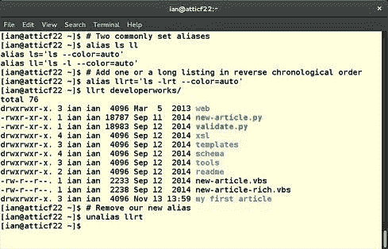

# 自定义和使用 shell 环境

> 原文：[`developer.ibm.com/zh/tutorials/l-lpic1-105-1/`](https://developer.ibm.com/zh/tutorials/l-lpic1-105-1/)

## 概述

在本教程中，学习自定义 Linux bash shell 环境来满足用户需求。学习：

*   修改全局和用户配置文件
*   在登录或生成新 shell 时设置环境变量
*   为常用命令序列创建 bash 函数
*   为新用户帐户维护框架目录
*   设置命令搜索路径

## Linux shell

您在终端上使用一个 Linux shell 程序，通过键入命令（ *输入流* ）来与系统交互，并在同一个终端上查看输出（ *输出流* ）和错误消息（ *错误流* ）。有时，您需要在系统引导以前运行命令，以便允许终端建立连接，有时您需要定期运行命令，无论您是否登录。shell 也可以为您完成这些任务。标准输入和输出流不需要来自或定向到终端上的真实用户。在本教程中，将进一步了解 shell 和自定义用户的环境。具体地讲，您将学习 bash (Bourne again) shell（原始 original Bourne shell 的增强版），并了解使 bash 更符合可移植操作系统接口 (Portable Operating System Interface, POSIX) 标准的更改。我会在此过程中介绍其他一些 shell 特性。

##### 关于本系列

本教程系列帮助学习 Linux 系统管理任务。您还可以使用这些教程中的资料来对 [Linux Professional Institute 的 LPIC-1：Linux 服务器专业认证考试](http://www.lpi.org)进行应考准备。

请参阅 “[*学习 Linux，101*：LPIC-1 学习路线图](https://www.ibm.com/developerworks/cn/linux/l-lpic1-map/)”，查看本系列中每部教程的描述和链接。这个路线图正在开发之中，它反映了 2015 年 4 月 15 日更新的 4.0 版 LPIC-1 考试目标。在完成这些教程后，我们会将它们添加到路线图中。

本教程帮助针对 Linux Server Professional (LPIC-1) 考试 102 的主题 105 中的目标 105.1 进行应考准备。该目标的权重为 4。

### 前提条件

要从本系列教程中获得最大收获，您应该拥有 Linux 的基本知识和一个正常工作的 Linux 系统，您可以在这个系统上实践本教程中涵盖的命令。您应该熟悉 GNU 和 UNIX 命令。本教程以针对考试 101 的主题 103 的教程中介绍的材料为基础。有时一个程序的不同版本会以不同方式格式化输出，所以您的结果可能并不总是与这里所示的清单和图像相同。

本教程中的示例很大程度上与发行版无关。除非另行说明，这些示例使用的是 Fedora 22 和 4.2.3 内核。

## Shell 和环境

shell 在您与操作系统的复杂细节之间提供了一个层。借助 Linux（和 UNIX）shell，您可以通过组合基本函数来构建复杂的操作。然后可以使用编程结构，构建能在 shell 中直接执行的函数或将函数保存为 *shell 脚本* 。shell 脚本是一个命令序列，它存储在 shell 可根据需要来运行的文件中。

##### 很久以前

与计算机的早期交互使用了一个批处理模型，在一叠打孔卡片上提供输入，并将输出通过行式打印机打印出来。后来出现了 ASCII 终端，程序员使用它将字符键入到一个类似打字机的显示终端中。shell 就应运而生了。早期的显示终端通常拥有 25 行，每行 80 个字符，与如今的 GUI 的功能相差甚远，但与打孔卡片相比仍是一次巨大进步。

POSIX 是一系列 IEEE 标准，它们统称为 IEEE 1003。（第一个 POSIX 标准是 1988 年发布的 IEEE Standard 1003.1-1988。）Bash 实现了许多 POSIX 特性，可在一种更符合 POSIX 标准的模式下运行。其他著名的 shell 包括 Korn shell (ksh)、C shell (csh) 和它的衍生产品 tcsh，以及 Almquist shell (ash) 及其 Debian 衍生产品 (dash)。建议您至少非常熟悉其他这些 shell，这样您才会认出一个脚本何时使用了来自任何这些 shell 的特性。

回想一下教程 “[学习 Linux，101：Linux 命令行](http://www.ibm.com/developerworks/cn/linux/l-lpic1-103-1//) ”，当您在 bash shell 中运行时，您有一个 *shell 环境* 。该环境是一组名称 – 值对，定义了您的提示符的形式、主目录、工作目录、shell 的名称、您打开的文件、您定义的函数，等等。该环境可供每个 shell 进程使用。当一个 shell 启动时，它会将来自环境的值分配给 *shell 变量* 。您可以使用 shell（包括 bash）创建和修改其他 shell 变量。然后可以导出这些变量作为环境的一部分，供您从当前 shell 生成的子进程继承。

Shell 变量有一个名称（或标识符）。 常见 bash 环境变量 给出了一些通常会自动设置的常见 bash 环境变量。

##### 常见 bash 环境变量

| 名称 | 用途 |
| --- | --- |
| `USER` | 登录用户的名称 |
| `UID` | 登录用户的用户 ID 数字 |
| `HOME` | 用户的主目录 |
| `PWD` | 当前工作目录 |
| `SHELL` | shell 的名称 |
| `PPID` | 父进程的 PID — 启动此进程的进程的进程 ID |

除了变量之外，shell 还会设置一些特殊参数，但这些参数无法修改。 常见 bash 参数 给出了一些例子。

##### 常见 bash 参数

| 名称 | 用途 |
| --- | --- |
| `$` | （运行的 bash shell [ 或其他 ] 进程）的进程 ID（或 PID） |
| `?` | 上一个命令的退出代码 |
| `0` | shell 或 shell 脚本的名称 |

### 使用变量

可以在名称前面加上 `$` 作为前缀来使用变量的值，如 使用变量值 所示。

##### 使用变量值

```
[ian@atticf22 ~]$ echo $UID
1000
[ian@atticf22 ~]$ echo $HOME
/home/ian 
```

### 设置变量值并让它们可用

可通过键入一个名称后不留空格，立即键入等号 (`=`)，在 bash shell 中创建或设置 shell 变量。变量名是仅由字母数字字符和下划线组成的单词。名称以字母字符或下划线开头。变量名是区分大小写的，所以 `var1` 和 `VAR1` 是不同的变量。变量名（特别是导出变量）通常采用大写形式，就像 常见 bash 环境变量 中的示例一样，但这是一种约定，而不是一种要求。一些变量（比如 `$$` 和 `$?` ）实际上是 shell 参数而不是变量 — 只能引用它们，不能向它们赋值。

Shell 变量仅对您创建它们时所在的进程可见，除非 *导出* 它们，以便子进程可以看到和使用它们。子进程不能将变量导出到父进程。可以使用 `export` 命令导出变量。在 bash shell 中，可以一步完成分配和导出，但不是所有 shell 都支持这项功能。

探索这些概念的一种好方法是使用另一个 shell 来创建子进程。可以使用 `ps` 命令帮助跟踪您所在的位置和正在运行的进程。 设置 shell 变量并将它们导出到环境 给出了一些示例，并提供了行内注释来帮助您理解。

##### 设置 shell 变量并将它们导出到环境

```
[ian@atticf22 ~]$ # Use the ps command to list current PID, parent PID and running command name
[ian@atticf22 ~]$ ps -p $$ -o "pid ppid cmd"
 PID  PPID CMD
12761  9169 bash
[ian@atticf22 ~]$ # Start a child bash process
[ian@atticf22 ~]$ bash
[ian@atticf22 ~]$ # Assign two variables
[ian@atticf22 ~]$ VAR1=v1
[ian@atticf22 ~]$ VAR2="Variable 2"
[ian@atticf22 ~]$ # Export examples
[ian@atticf22 ~]$ export VAR2
[ian@atticf22 ~]$ export VAR3="Assigned and exported in one step"
[ian@atticf22 ~]$ # Use the $ character to reference the variables
[ian@atticf22 ~]$ echo $VAR1 '/' $VAR2 '/' $VAR3
v1 / Variable 2 / Assigned and exported in one step
[ian@atticf22 ~]$ # What is the value of the SHELL variable?
[ian@atticf22 ~]$ echo $SHELL
/bin/bash
[ian@atticf22 ~]$ # Now start ksh child and export VAR4
[ian@atticf22 ~]$ ksh
$ ps -p $$ -o "pid ppid cmd"
 PID  PPID CMD
26212 22923 ksh
$ export VAR4=var4
$ # See what is visible
$ echo $VAR1 '/' $VAR2 '/' $VAR3 '/' $VAR4 '/' $SHELL
/ Variable 2 / Assigned and exported in one step / var4 / /bin/bash
$# No VAR1 and shell is /bin/bash - is that right?
$ exit
[ian@atticf22 ~]$ ps -p $$ -o "pid ppid cmd"
 PID  PPID CMD
22923 12761 bash
[ian@atticf22 ~]$ # See what is visible
[ian@atticf22 ~]$ echo $VAR1 '/' $VAR2 '/' $VAR3 '/' $VAR4 '/' $SHELL
v1 / Variable 2 / Assigned and exported in one step / / /bin/bash
[ian@atticf22 ~]$ # No VAR4 - our child cannot export back to us
[ian@atticf22 ~]$ exit
exit
[ian@atticf22 ~]$ ps -p $$ -o "pid ppid cmd"
 PID  PPID CMD
12761  9169 bash
[ian@atticf22 ~]$ # See what is visible
[ian@atticf22 ~]$ echo $VAR1 '/' $VAR2 '/' $VAR3 '/' $VAR4 '/' $SHELL
/ / / / /bin/bash
[ian@atticf22 ~]$ # None of VAR1 through VAR4 is exported back to parent 
```

在 设置 shell 变量并将它们导出到环境 中您是否注意到，ksh 没有设置 `SHELL` 变量？在您登录时，或者使用 `su` 命令和创建 *登录 shell* 的选项来切换到另一个用户时，通常会设置此变量。本教程后面部分会进一步介绍登录 shell。

可使用 `echo` 命令查看 常见 bash 环境变量 和 常见 bash 参数 中的一些常见 bash 变量和参数的内容，如 常见环境变量和 shell 变量 所示。

##### 常见环境变量和 shell 变量

```
 [ian@atticf22 ~]$ echo $USER $UID
 ian 1000
 [ian@atticf22 ~]$ echo $SHELL $HOME $PWD
 /bin/bash /home/ian /home/ian
 [ian@atticf22 ~]$ (exit 0);echo $?;(exit 4);echo $?
 0
 4

 [ian@atticf22 ~]$ echo $0
 bash
 [ian@atticf22 ~]$ echo $$ $PPID
 12761 9169
 [ian@atticf22 ~]$ # see what my process and its parent are running
 [ian@atticf22 ~]$ ps -p $$,$PPID -o "pid ppid cmd"
  PID  PPID CMD
 9169 1 /usr/libexec/gnome-terminal-server
 12761  9169 bash 
```

在 bash shell 中，还可以通过在命令前加上名称 = 值对作为前缀，将环境值设置为在单个命令的持续时间内有效，如 为单个命令设置 bash 环境值 所示。

##### 为单个命令设置 bash 环境值

```
[ian@atticf22 ~]$ echo "$VAR5 / $VAR6"
/
[ian@atticf22 ~]$ VAR5=5 VAR6="some value" bash
[ian@atticf22 ~]$ echo "$VAR5 / $VAR6"
5 / some value
[ian@atticf22 ~]$ exit
[ian@atticf22 ~]$ echo "$VAR5 / $VAR6"
/ 
```

### `readonly` 和其他变量属性

我提到过一些 shell 参数无法修改。还可以将变量限制为 `readonly` 、 `integer` 或 `string` ，当然还有其他可能性。可以使用 `declare` 命令设置变量属性。可使用 `-p` 选项显示变量和各种属性。要进一步了解 `declare` 命令，可尝试运行：

```
info bash "Shell Builtin Commands" "Bash Builtins"  --index-search declare 
```

或

```
help declare 
```

变量属性 给出了一些示例。

##### 变量属性

```
 [ian@atticf22 ~]$ declare -r rov1="this is readonly"
 [ian@atticf22 ~]$ rov="Who says it's read only?"
 [ian@atticf22 ~]$ readonly rov2="another constant value"
 [ian@atticf22 ~]$ rov2=3
 bash: rov2: readonly variable
 [ian@atticf22 ~]$ UID=99
 bash: UID: readonly variable
 [ian@atticf22 ~]$ declare -pr
 declare -r BASHOPTS="checkwinsize:cmdhist:complete_fullquote:expand_aliases:extglob:extquote:
 force_fignore:histappend:interactive_comments:progcomp:promptvars:sourcepath"
 declare -ir BASHPID
 declare -r BASH_COMPLETION_COMPAT_DIR="/etc/bash_completion.d"
 declare -ar BASH_VERSINFO='([0]="4" [1]="3" [2]="42" [3]="1" [4]="release" [5]=
"x86_64-redhat-linux-gnu")'
 declare -ir EUID="1000"
 declare -ir PPID="12761"
 declare -r SHELLOPTS="braceexpand:emacs:hashall:histexpand:history:interactive-comments:monitor"
 declare -ir UID="1000"
 declare -r rov1="this is readonly"
 declare -r rov2="another constant value"
 [ian@atticf22 ~]$ help declare
 declare: declare [-aAfFgilnrtux] [-p] [name[=value] ...]
    Set variable values and attributes.

    Declare variables and give them attributes.  If no NAMEs are given,
    display the attributes and values of all variables.

    Options:
      -f   restrict action or display to function names and definitions
      -F   restrict display to function names only (plus line number and
       source file when debugging)
      -g   create global variables when used in a shell function; otherwise
       ignored
      -p   display the attributes and value of each NAME

    Options which set attributes:
      -a   to make NAMEs indexed arrays (if supported)
      -A   to make NAMEs associative arrays (if supported)
      -i   to make NAMEs have the `integer' attribute
      -l   to convert NAMEs to lower case on assignment
      -n   make NAME a reference to the variable named by its value
      -r   to make NAMEs readonly
      -t   to make NAMEs have the `trace' attribute
      -u   to convert NAMEs to upper case on assignment
      -x   to make NAMEs export

    Using `+' instead of `-' turns off the given attribute.

    Variables with the integer attribute have arithmetic evaluation (see
    the `let' command) performed when the variable is assigned a value.

    When used in a function, `declare' makes NAMEs local, as with the `local'
    command.  The `-g' option suppresses this behavior.

    Exit Status:
    Returns success unless an invalid option is supplied or a variable
    assignment error occurs. 
```

### 取消设置变量

可以使用 `unset` 命令从 bash shell 删除一个变量。可使用 `-v` 选项确保删除了变量定义。函数（本教程后面将会介绍）可拥有与变量相同的名称，所以如果想要删除一个函数定义，可使用 `-f` 。如果没有 `-f` 或 `-v` ，bash `unset` 命令会在变量定义存在时删除变量定义，在函数定义存在时删除函数定义。 取消设置 bash 变量 给出了一些例子。

##### 取消设置 bash 变量

```
 [ian@atticf22 ~]$ bash
 [ian@atticf22 ~]$ VAR1=v1
 [ian@atticf22 ~]$ declare -i VAR2
 [ian@atticf22 ~]$ VAR2=3+4
 [ian@atticf22 ~]$ echo $VAR1 $VAR2
 v1 7
 [ian@atticf22 ~]$ unset VAR1
 [ian@atticf22 ~]$ echo $VAR1 $VAR2
 7
 [ian@atticf22 ~]$ unset -v VAR2
 [ian@atticf22 ~]$ echo $VAR1 $VAR2

 [ian@atticf22 ~]$ exit
 exit 
```

请注意，如果某个变量被定义为 `integer` ，向它赋的值会计算为算术表达式。

默认情况下，bash 将未设置的变量视为拥有空值。那么为什么取消设置一个变量，而不是向它分配一个空值？在 bash 和其他许多 shell 中，如果应用未定义的变量，可能会产生一个错误。可使用 `set -u` 命令生成未定义变量的错误，使用 `set +u` 禁用该警告。 错误和取消设置变量 演示了这些要点。

##### 错误和取消设置变量

```
 [ian@atticf22 ~]$ bash
 [ian@atticf22 ~]$ set -u
 [ian@atticf22 ~]$ VAR1=var1
 [ian@atticf22 ~]$ echo $VAR1
 var1
 [ian@atticf22 ~]$ unset VAR1
 [ian@atticf22 ~]$ echo $VAR1
 bash: VAR1: unbound variable
 [ian@atticf22 ~]$ VAR1=
 [ian@atticf22 ~]$ echo $VAR1

 [ian@atticf22 ~]$ unset VAR1
 [ian@atticf22 ~]$ echo $VAR1
 bash: VAR1: unbound variable
 [ian@atticf22 ~]$ unset -v VAR1
 [ian@atticf22 ~]$ set +u
 [ian@atticf22 ~]$ echo $VAR1

 [ian@atticf22 ~]$ exit
 exit 
```

您已看到，取消设置一个不存在的变量不会出错，甚至在指定了 `set -u` 时也是如此。

### 环境、变量和 C shell

csh 和 tcsh shell 对环境和变量的处理与 bash 稍微不同。可以使用 `set` 在 shell 中设置变量，使用 `setenv` 命令设置和导出变量。语法与 bash `export` 命令稍有不同，如 在 C 和 tcsh shell 中设置变量和环境值 所示。请注意使用 `set` 时的等号 (`=`)。

##### 在 C 和 tcsh shell 中设置变量和环境值

```
[ian@atticf22 ~]$ tcsh
[ian@atticf22 ~]$ setenv E1 "Env variable 1"
[ian@atticf22 ~]$ set V2="variable 2"
[ian@atticf22 ~]$ echo "$E1 / $V2"
Env variable 1 / variable 2
[ian@atticf22 ~]$ tcsh
[ian@atticf22 ~]$ echo $E1
Env variable 1
[ian@atticf22 ~]$ echo $V2
V2: Undefined variable.
[ian@atticf22 ~]$ echo "$?E1 / $?V2"
1 / 0
[ian@atticf22 ~]$ exit 
```

请注意，第二个 tcsh shell 没有继承 `V2` 变量。尝试引用 `V2` 会生成错误，这与在 bash 中设置 `set -u` 时一样。在 csh 和 tcsh 中，可使用 `$?NAME` 结构检查是否设置了 `NAME` ，如果已设置 `NAME` ，则返回 `1` ，否则返回 `0` 。

环境处理上的另一个区别是，csh 和 tcsh 为变量和环境值维护着不同的命名空间。如果两个位置出现同一个名称，则变量定义优先。与 bash 一样， `unset` 命令取消设置一个变量。可使用 `unsetenv` 命令取消设置环境变量。 取消设置 csh 和 tcsh 变量和环境值 展示了这些命令。

##### 取消设置 csh 和 tcsh 变量和环境值

```
[ian@atticf22 ~]$ echo "$E1 / $V2"
Env variable 1 / variable 2
[ian@atticf22 ~]$ set E1="I'm now a regular variable"
[ian@atticf22 ~]$ echo $E1
I'm now a regular variable
[ian@atticf22 ~]$ unset E1
[ian@atticf22 ~]$ echo $E1
Env variable 1
[ian@atticf22 ~]$ unsetenv E1
[ian@atticf22 ~]$ echo $E1
E1: Undefined variable. 
```

## 配置文件

在登录到 Linux 系统时，您的 ID 有一个默认 shell，这就是您的 *登录 shell* 。该 shell 程序在 /etc/passwd 文件中您的条目中指定，这是用于设置 `SHELL` 环境变量的值。可使用 `man 5 passwd` 命令进一步了解 /etc/passwd 文件。

如果您的登录 shell 是 bash，它会在您获得控制权之前运行多个配置文件脚本。如果 /etc/profile 存在，bash 会首先运行它，以及 /etc/profile.d 中的任何 .sh 文件。bash 运行系统脚本后，它会按顺序检查您的主目录中的 ~/.bash_profile、~/.bash_login 和 ~/.profile 文件，并运行它找到的第一个文件。

/etc 中的发行版文件（比如 /etc/profile）可能因为系统更新而修改，所以不要直接编辑它们。如果需要为系统上的所有用户自定义登录环境，可以在 /etc/profile.d 中创建额外的文件。不用说，您可以修改主目录中的文件来适合您的个人工作风格。

登录并使用 bash 后，您可能会启动更多 shell 来运行命令。如果 shell 接受来自键盘的命令，那么它就是 *交互式* shell。如果 shell 输入来自文件，那么它就是 *非交互式* shell。对于交互式 shell，bash 运行 ~/.bashrc 脚本（如果存在）。您应该习惯在 ~/.bash_profile 中检查此脚本，以便您可在登录时或启动一个交互式 shell 时运行它。取决于您的发行版，您的 ~/.bashrc 可反过来从 /etc/bash.bashrc 或 /etc/bashrc 获取常见别名和全局变量。当您注销时，bash 会运行您的主目录中的 ~/.bash_logout 脚本（如果该脚本存在）。我的 .bash_profile 如 我的 .bash_profile 所示。

##### 我的 .bash_profile

```
 [ian@atticf22 ~]$ cat ~/.bash_profile
 # .bash_profile

 # Get the aliases and functions
 if [ -f ~/.bashrc ]; then
   . ~/.bashrc
 fi

 # User specific environment and startup programs

 PATH=$PATH:$HOME/.local/bin:$HOME/bin

 export PATH 
```

`--login` 选项会强制 bash 读取配置文件，就像它是登录 shell 一样， `--noprofile` 选项会告诉 bash 跳过配置文件。类似地， `--norc` 选项会禁止对交互式 shell 执行 ~/.bashrc 文件。要强制 bash 使用 ~/.bashrc 以外的文件，可指定 `--rcfile` 选项和您想要使用的文件名称。 使用一个文件和 `--rcfile` 参数 展示了如何创建一个简单的示例文件来用于 `--rcfile` 选项。

##### 使用一个文件和 `--rcfile` 参数

```
 [ian@atticf22 ~]$ echo VAR1=var1>testrc
 [ian@atticf22 ~]$ echo $VAR1

 [ian@atticf22 ~]$ bash --rcfile testrc
 bash-4.3$ echo $VAR1
 var1
 bash-4.3$ exit
 exit 
```

### 重要发现

许多程序（包括 bash）使用 readline 库从键盘读取命令。您可以自定义如何使用内置 bash `bind` 命令来揭示击键或组合键。例如， `bind '"\C-t":"pwd\n"'` 将 Ctrl-t（同时按下 Ctrl 和 t）与运行 `pwd` 命令的行为相绑定。

默认键绑定的全局文件位于 /etc/inputrc。您可以在主目录中的 .inputrc 文件中创建自己的绑定。如果这么做，可包含以下行，以防遗漏全局定义：

```
$include /etc/inputrc 
```

请参阅 bash 信息页面了解更多信息。

## 其他启动 bash 的方式

您已经了解了如何启动登录和交互式 shell。当您运行 shell 脚本时，bash 会在非交互式 shell 中启动该脚本，不会读取配置文件。但是，如果设置了 `BASH_ENV` 变量，bash 会扩展该值，并假设它是一个文件的名称。如果该文件存在，bash 会在运行您在非交互式 shell 中运行的任何脚本或命令之前运行它。 使用 `BASH_ENV` 演示了这一行为。

##### 使用 `BASH_ENV`

```
[ian@atticf22 ~]$ cat testenv.sh
#!/bin/bash
echo "Test of BASH_ENV"
export VAR_ENV="my value"
[ian@atticf22 ~]$ cat testscript.sh
#!/bin/bash
echo "Running $0"
echo "VAR_ENV is set to $VAR_ENV"
[ian@atticf22 ~]$ ./testscript.sh
Running ./testscript.sh
VAR_ENV is set to
[ian@atticf22 ~]$ export BASH_ENV="~/testenv.sh"
[ian@atticf22 ~]$ ./testscript.sh
Test of BASH_ENV
Running ./testscript.sh
VAR_ENV is set to my value 
```

如果某个脚本在子 shell 中运行，当它返回到父 shell 时，它导出的所有变量都会丢失。如果 .bash_profile 运行 ~/.bashrc 脚本，为什么从 ~/.bashrc 导出的变量和函数不会丢失？原因是，您使用 `source` （或 `.` ）命令在当前环境中运行该脚本。请参阅 我的 .bash_profile 查看示例。

我之前提到过 POSIX。可使用 `--posix` 选项启动 bash，使其更符合 POSIX 标准。如果您尝试开发的代码将跨具有不同 POSIX 遵从水平的系统而运行，那么您可以这样做。此模式的启动类似于非交互式 shell 的启动，但要运行的初始文件（如果有）是通过 `ENV` 环境变量确定的，而不是通过 `BASH_ENV` 变量。

Linux 系统通常拥有 /bin/sh 作为 bash 的符号链接。当 bash 检测到它以名称 sh 运行时，它会尝试遵循更古老的 Bourne shell 的启动行为，但仍符合 POSIX 标准。运行登录 shell 时，bash 尝试读取和运行 /etc/profile 和 ~/.profile。当通过 `sh` 命令以交互式 shell 形式运行时，bash 会尝试运行 `ENV` 变量指定的文件，就像在 POSIX 模式下调用它时一样。当作为 sh 交互式地运行时，bash 仅使用 `ENV` 变量指定的文件；忽略 `--rcfile` 选项。

最后，如果通过远程 shell 守护进程调用 bash，它将具有交互式 shell 的行为，使用 ~/.bashrc 文件（如果存在）。

## 管道和命令列表

继续学习别名和函数之前，您需要非常了解管道和命令序列（或列表）。请参阅 “[学习 Linux，101：流、管道和重定向](http://www.ibm.com/developerworks/cn/linux/l-lpic1-103-4/index.html) ” 来复习管道概念，参阅 “[学习 Linux，101：Linux 命令行](http://www.ibm.com/developerworks/cn/linux/l-lpic1-103-1/) ” 来复习列表或序列。

有时，您必须将命令分组到管道的某个阶段，然后将所有这些命令的输出重定向到管道的下一个阶段。可以使用圆括号在子 shell 中运行命令列表，或者可以使用花括号在父 shell 中运行命令列表。花括号必须使用空格与其他内容分开，而圆括号被识别为运算符，且无需分开。 使用圆括号和花括号对命令分组 使用这两种方法查找 /usr/bin 中最大的文件，以及 /usr/bin 目录使用的空间总量。

##### 使用圆括号和花括号对命令分组

```
[ian@atticf22 ~]$ (ls -lrS /usr/bin; du /usr/bin) | tail -n 3
-rwxr-xr-x.   1 root root    10669512 Sep 18 10:41 mysql
-rwxr-xr-t.   1 root root    15148768 Sep 14 05:11 emacs-24.5
386296   /usr/bin
[ian@atticf22 ~]$ { ls -lrS /usr/bin; du /usr/bin; } | tail -n 3
-rwxr-xr-x.   1 root root    10669512 Sep 18 10:41 mysql
-rwxr-xr-t.   1 root root    15148768 Sep 14 05:11 emacs-24.5
386296   /usr/bin 
```

## Shell 别名

在 bash 中，可为命令定义别名。可使用别名提供命令的替代性名称，提供命令的默认参数，或者有时会构造一个新的或更复杂的命令。可使用 `alias` 命令设置别名或列出别名，使用 `unalias` 命令删除它们。 `alias` 和 `unalias` 命令的简单用法 给出了一些例子。

##### `alias` 和 `unalias` 命令的简单用法

```
[ian@atticf22 ~]$ # Two commonly set aliases
[ian@atticf22 ~]$ alias ls ll
alias ls='ls --color=auto'
alias ll='ls -l --color=auto'
[ian@atticf22 ~]$ # Add one for a long listing in reverse chronological order
[ian@atticf22 ~]$ alias llrt='ls -lrt --color=auto'
[ian@atticf22 ~]$ llrt /bin
lrwxrwxrwx. 1 root root 7 Aug 16  2014 /bin -> usr/bin
[ian@atticf22 ~]$ # Remove our new alias
[ian@atticf22 ~]$ unalias llrt
[ian@atticf22 ~]$ 
```

来自 `llrt` 命令的多色输出 （来自 使用 `BASH_ENV` 的屏幕截图）显示了新 `llrt` 别名的多色输出。

##### 来自 `llrt` 命令的多色输出



如果命令的第一个单词未包含在引号中，Bash 别名扩展会在这个单词上进行。如果扩展后的第一个单词是尚未扩展的未加引号的单词，bash 会再次执行别名扩展，依此类推。所以 `llrt` 别名可能是 `alias llrt='ls -lrt` ， `llrt` 别名也可能跳过 `--color=auto` 参数 — 因为两个别名都会进一步替换单词 `ls` 。您可以试验这些和其他变形。

别名的另一个常见用法是用于根用户。 `cp` 、 `rm` 和 `mv` 命令通常别名化来包含 `-i` 参数，以帮助预防意外破坏文件。您可以检查您自己的系统上的这些别名。

作为最后一个且更复杂的示例，看看 `which` 命令的别名 中是如何别名化 `which` 命令的。

##### `which` 命令的别名

```
[ian@atticf22 ~]$ alias which
alias which='(alias; declare -f) | /usr/bin/which --tty-only --read-alias \
--read-functions --show-tilde --show-dot'
[ian@atticf22 ~]$ which which
alias which='(alias; declare -f) | /usr/bin/which --tty-only --read-alias \
--read-functions --show-tilde --show-dot'
  /usr/bin/which 
```

在这里， `alias` 和 `declare -f` 命令使用圆括号分组到一起，在一个子 shell 中运行。这个分组列出该 shell 已知的别名和函数。该分组的输出被传输到 /usr/bin/which 可执行文件。如果该可执行文件在终端上运行（ `--tty-only` 选项），/usr/bin/which 会从 stdin 读取别名（ `--read-alias` 选项）和函数（ `--read-functions` 选项）定义，并包含任何匹配的别名或函数的输出，以及在当前 `PATH` 上找到的可执行文件的基本输出。请参阅 `which` 的手册页，进一步了解其他选项。

### 别名、命令列表和引号

在定义使用命令列表或其他 shell 元字符的别名时需要小心。如果想在别名中使用 shell 变量，还需要小心使用引号。

在 `which` 命令的别名 中， `which` 的别名使用一个命令列表和单引号。现在，假设您希望一个名为 `lsdu` 的命令列出当前目录的内容，以及它和它的所有子目录使用的空间量。 在别名中使用命令列表和引号的正确和错误方式 给出了创建别名的正确和错误方式。

##### 在别名中使用命令列表和引号的正确和错误方式

```
[ian@atticf22 developerworks]$ # Wrong way
[ian@atticf22 developerworks]$ alias lsdu=ls;du -sh
8.2M    .
[ian@atticf22 developerworks]$ lsdu
new-article.py        new-article.vbs  schema     tools        web
new-article-rich.vbs  readme           templates  validate.py  xsl
[ian@atticf22 developerworks]$ # Right way
[ian@atticf22 developerworks]$ alias lsdu='ls;du -sh'
[ian@atticf22 developerworks]$ lsdu
new-article.py        new-article.vbs  schema     tools        web
new-article-rich.vbs  readme           templates  validate.py  xsl
8.2M    . 
```

在错误方式示例中， `alias` 命令仅包含一直到 `;` 元字符的文本，该行的剩余部分会立即执行。在类似这样的情况下，您需要为组成别名的全部文本加上引号。但是您应使用单引号还是双引号？

如果您希望 shell 在定义别名时计算所有 shell 变量引用，则使用双引号。如果您希望在执行别名时计算引用，则使用单引号。 在别名中使用单引号和双引号 使用 `PWD` （打印工作目录）变量演示了区别。

##### 在别名中使用单引号和双引号

```
[ian@atticf22 ~]$ alias mypwd1='echo Current directory is $PWD'
[ian@atticf22 ~]$ alias mypwd2="echo Current directory is $PWD"
[ian@atticf22 ~]$ # cd to a different directory
[ian@atticf22 ~]$ cd developerworks
[ian@atticf22 developerworks]$ mypwd1
Current directory is /home/ian/developerworks
[ian@atticf22 developerworks]$ mypwd2
Current directory is /home/ian
[ian@atticf22 developerworks]$ alias mypwd1 mypwd2
alias mypwd1='echo Current directory is $PWD'
alias mypwd2='echo Current directory is /home/ian' 
```

## Shell 函数

别名很有用，但如果您想处理参数，会发生什么情况？别名仅扩展第一个单词，命令行上的剩余所有内容会附加到扩展结果上。如果您想使用一些参数来运行命令，然后对输出进行处理，则不能使用别名。在这种情况下，需要使用一个 shell 函数。

Shell 函数与别名相比有两个优势：

*   可以处理参数。
*   可以使用编程结构（比如测试和循环）来增强处理。

本教程仅介绍简单的函数。本系列的下一篇教程将介绍可在 shell 函数和脚本中使用的增强的编程结构。在这里，我将介绍如何构建必要的命令，然后如何将它们放入一个函数中。

假设您想要一个名为 `ldirs` 的命令，它的行为非常像 `ls` ，但仅列出目录。您首先想到的可能是最初有一个长清单，过滤以 d 开头的行，然后执行进一步处理来消除额外的信息。 首次尝试过滤目录 显示了这种想法的第一个阶段。

##### 首次尝试过滤目录

```
[ian@atticf22 ~]$ ls -l developerworks/ | grep "^d"
drwxrwxr-x. 2 ian ian  4096 Nov 13 13:06 my first article
drwxrwxr-x. 2 ian ian  4096 Sep 12  2014 readme
drwxrwxr-x. 4 ian ian  4096 Sep 12  2014 schema
drwxrwxr-x. 3 ian ian  4096 Sep 12  2014 templates
drwxrwxr-x. 3 ian ian  4096 Sep 12  2014 tools
drwxrwxr-x. 3 ian ian  4096 Mar  5  2013 web
drwxrwxr-x. 4 ian ian  4096 Sep 12  2014 xsl 
```

显然，它不会仅从输出中剥离最后一个单词，因为一些目录名称可能包含空格。与使用长清单相比，更好的方法是从一个分类清单入手，该清单中的目录名称末尾处有一个 / 字符。 对 `ls` 输出分类以查找目录 展示了这种方法的可能用法。

##### 对 `ls` 输出分类以查找目录

```
[ian@atticf22 ~]$ ls -F developerworks/ | grep "/$"
my first article/
readme/
schema/
templates/
tools/
web/
xsl/ 
```

效果好得多了。现在仅剩下剥离结尾的 /，这可使用 `sed` 轻松完成，如 一个 `ldirs` 命令列表示例 所示。

##### 一个 `ldirs` 命令列表示例

```
[ian@atticf22 ~]$ ls -F developerworks/ | grep "/$" | sed -e 's/\/$//'
my first article
readme
schema
templates
tools
web
xsl 
```

现在您拥有 `ldirs` 函数所需的复杂命令，是时候学习如何将它变成函数了。函数包含一个名称，后跟 `()` ，然后是一个复合命令。对于本教程，复合命令是任何以分号终止且放在花括号（必须使用空格将它们与其他记号分开）中的命令或命令列表。本系列的下一篇教程将介绍更复杂的复合命令。

在 bash shell 中，函数名称前可添加单词 `function` 作为前缀，但这不是 POSIX 规范的一部分，而且不受 dash 等更简洁的 shell 支持。另一篇教程将介绍如何确保一个脚本由特定 shell 解释，即使您通常使用一个不同的 shell。

首次尝试过滤目录 、 对 `ls` 输出分类以查找目录 和 一个 `ldirs` 命令列表示例 中的命令列出了我系统上的一个名为 developerworks 的目录，但您可能不希望每次都列出同一个目录 — 而且在使用别名时，不能将目录名称替换为参数。所以您会选择使用函数。

编写函数前，您需要知道如何使用参数。在函数内，使用 Shell 函数参数 中的 bash 特殊变量来引用参数。与其他 shell 变量一样，为这些变量添加一个 `$` 符号作为前缀来引用它们。

##### Shell 函数参数

| 参数 | 用途 |
| --- | --- |
| `0` 、 `1` 、 `2` ，等等 | 从参数 0 开始的位置参数。参数 0 指的是启动 bash 的程序名称，或者如果该函数在 shell 脚本内运行，那么该参数指的是 shell 脚本的名称。请参阅 bash 手册页了解其他可能性，比如在使用 `-c` 参数启动 bash 时。放在单引号或双引号内的字符串作为单个参数传递，而且会剥离引号。如果使用双引号，在调用函数之前会扩展所有 shell 变量，比如 `$HOME` 。如果传递的参数包含嵌入的空白或其他可能对 shell 具有特殊含义的字符，则需要使用单引号或双引号。 |
| `*` | 从参数 1 开始的位置参数。如果在双引号内进行扩展，则扩展结果是一个单词，使用字段间分隔符 (IFS) 特殊变量的第一个字符来分离参数，或者如果 IFS 是空的，则没有中间空格。默认的 IFS 值是一个空白、制表符和换行符。如果 IFS 未设置，则使用的分隔符为空白，与默认 IFS 一样。 |
| `@` | 从参数 1 开始的位置参数。如果在双引号内进行扩展，则每个参数都会变成一个单词，以便 `"$@"` 等于 `"$1"` 、 `"$2"` ，等等，如果您的参数可能包含嵌入的空白，则使用此形式。 |
| `#` | 参数数量，不包含参数 0。 |

如果拥有 9 个以上的参数，则不能使用 `$10` 指代第 10 个参数。必须首先处理或保存第一个参数 (`$1`)，然后使用 `shift` 命令丢弃参数 1 并将所有剩余参数的编号减 1，以便 `$10` 变成 `$9` ，依此类推。 `$#` 的值会被更新，以反映剩余参数数量。

首先，尝试定义一个简单函数，该函数只会告诉您它拥有多少个参数并显示它们，如 一个显示其参数的简单函数 所示。

##### 一个显示其参数的简单函数

```
 [ian@atticf22 ~]$ testfunc () { echo "$# parameters"; echo "$@"; }
 [ian@atticf22 ~]$ testfunc
 0 parameters

 [ian@atticf22 ~]$ testfunc a b c
 3 parameters
 a b c
 [ian@atticf22 ~]$ testfunc a "b c"
 2 parameters
 a b c 
```

在这个示例中，可以使用 `$*` 、 `"$*"` 、 `$@` 或 `"$@"` ，而不会在输出中看到太大区别 — 除了参数数量和处理任何变量引用的方式。当情况变得更复杂时，这些区别肯定会变得很重要。

现在创建您的 `ldirs` 函数，如 `ldirs` 函数 所示，使用 一个 `ldirs` 命令列表示例 中的命令列表。

##### `ldirs` 函数

```
[ian@atticf22 ~]$ # You can enter the function on one line
[ian@atticf22 ~]$ ldirs () { ls -F "$@" |  grep "/$" | sed -e 's/\/$//'; }
[ian@atticf22 ~]$ # Or you can enter it on multiple lines
[ian@atticf22 ~]$ # in which case you do not need the final semi-colon
[ian@atticf22 ~]$ ldirs ()
> {
> ls -F "$@" |  grep "/$" |
> sed -e 's/\/$//'
> } 
```

来自 `ldirs` 函数的输出 显示了在我的系统上运行 `ldirs` 来列出 developerWorks XML 写作软件包目录的输出。

##### 来自 `ldirs` 函数的输出

```
[ian@atticf22 ~]$ ldirs developerworks/ ~/developerworks/xsl/7.0/
my first article
readme
schema
templates
tools
web
xsl
en_US
en_VN
es_AR
ja_JP
ko_KR
pt_BR
ru_RU
zh_CN
[ian@atticf22 ~]$ ldirs -ilrt developerworks
2511035 drwxrwxr-x. 3 ian ian  4096 Mar  5  2013 web
3019425 drwxrwxr-x. 4 ian ian  4096 Sep 12  2014 xsl
2511022 drwxrwxr-x. 3 ian ian  4096 Sep 12  2014 templates
2511036 drwxrwxr-x. 4 ian ian  4096 Sep 12  2014 schema
3023428 drwxrwxr-x. 3 ian ian  4096 Sep 12  2014 tools
3282516 drwxrwxr-x. 2 ian ian  4096 Sep 12  2014 readme
3277408 drwxrwxr-x. 2 ian ian  4096 Nov 13 13:06 my first article
[ian@atticf22 ~]$ ldirs  developerworks/my\ first\ article/
[ian@atticf22 ~]$ mkdir developerworks/my\ first\ article/"dir example"
[ian@atticf22 ~]$ ldirs  developerworks/my\ first\ article/
dir example 
```

尽管 `ldirs` 示例非常简单，但它演示了组合使用小构件来创建更复杂的或自定义的命令的技术。管道和列表都是 Linux（或 UNIX）工具箱的基本组成部分。

## 框架目录

您可能想知道像 ~/.bash_profile、~/.bashrc 或 ~/.bash_logout 这样的文件是如何在您的主目录中创建的。这些是从 /etc/skel 复制过来的框架文件。 /etc/skeleton 的内容 显示了我的系统上的 /etc/skel 中的文件。请注意，您需要使用 `ls` 的 `-a` 选项，该目录可能是空的。

##### /etc/skeleton 的内容

```
[ian@atticf22 ~]$ ls -a /etc/skel/
.  ..  .bash_logout  .bash_profile  .bashrc  .emacs  .kshrc  .mozilla 
```

使用 `-m` 选项运行 `useradd` 命令来创建主目录时，这些文件会复制到新的主目录。在这里可以看到，Firefox 或 Korn shell 等程序可以向 /etc/skel 添加额外的目录。如果您想自定义为新用户创建的目录，可向 /etc/skel 添加您的新目录和任何合适的文件。

/etc/skel 位置可通过 /etc/defaults/useradd 文件进行配置。我的系统上的该文件如 /etc/defaults/useradd 所示。

##### /etc/defaults/useradd

```
[ian@atticf22 ~]$ cat /etc/default/useradd
# useradd defaults file
GROUP=100
HOME=/home
INACTIVE=-1
EXPIRE=
SHELL=/bin/bash
SKEL=/etc/skel
CREATE_MAIL_SPOOL=yes 
```

## 命令搜索路径

您知道，bash 使用 `PATH` 变量中列出的目录来搜索可执行文件。 `PATH` 变量包含一个以冒号分隔各个条目的目录列表。根用户的 `PATH` 通常与普通用户的不同，如 普通用户和根用户的 `PATH` 所示。

##### 普通用户和根用户的 `PATH`

```
[ian@atticf22 ~]$ echo $PATH
/usr/local/bin:/usr/local/sbin:/usr/bin:/usr/sbin:/bin:/sbin:/home/ian/.local/bin:/home/ian/bin
[ian@atticf22 ~]$ su -
Password:
[root@atticf22 ~]# echo $PATH
/usr/local/sbin:/usr/local/bin:/sbin:/bin:/usr/sbin:/usr/bin:/root/bin 
```

现在假设您的公司有一个程序库 /opt/company-bin，该库位于每个非根用户的路径上。假设您想将该库添加到 `PATH` 变量前面，但前提是它还未添加到那里。进一步假设您想要一个函数或别名（假设为 `add2path` ），用户可使用它更轻松地向其 `PATH` 变量添加更多目录。您将使用目前在这里学到的知识完成这两个任务。

首先，您需要确定哪种选择在这里更合适：别名还是函数。只有在该条目不在 `PATH` 上时才能添加该条目的事实表明，您需要处理一个参数。别名不会处理参数，所以您需要一个函数。

查看某个目录是否已在您路径上的一种简单方法是，为目录名称和 `PATH` 变量添加前导和结尾冒号 (`:`)，测试分隔的目录名称是否包含在分隔的 `PATH` 中。如果不以这种方式分隔，您可以测试 /bin 并实际找到 /usr/bin，其中包含字符串 /bin。使用 shell 括号扩展从参数中删除一个字符串，然后将结果与原始结果进行比较。 测试一个字符串是否包含在另一个字符串中 显示了您可以使用的基本结构。

##### 测试一个字符串是否包含在另一个字符串中

```
[ian@atticf22 ~]$ # Augment the path
[ian@atticf22 ~]$ augpath=":$PATH:"
[ian@atticf22 ~]$ # demonstrate with /usr/bin
[ian@atticf22 ~]$ augdir=":/usr/bin:"
[ian@atticf22 ~]$ echo -e "$augdir\n$augpath\n${augpath/$augdir}":/usr/bin:
:/usr/local/bin:/usr/local/sbin:/usr/bin:/usr/sbin:/bin:/sbin:/home/ian/.local/bin:/home/ian/bin:
:/usr/local/bin:/usr/local/sbin/usr/sbin:/bin:/sbin:/home/ian/.local/bin:/home/ian/bin:
[ian@atticf22 ~]$ test "$augpath" != "${augpath/$augdir}" && echo Found || echo Not
Found 
```

现在很容易构造 `add2path` 函数。如果您将中间变量声明为 `local` ，那么它们不会被函数外部的实体所知。 `add2path` 函数及其用法 给出了 `add2path` 函数及其用法的一个示例。

##### `add2path` 函数及其用法

```
[ian@atticf22 ~]$ add2path ()
> {
> local augpath augdir
> augpath=":$PATH:"
> augdir=":$1:"
> test "$augpath" = "${augpath/$augdir}" && PATH="$1:$PATH"
> }
[ian@atticf22 ~]$ add2path /opt/company-bin
[ian@atticf22 ~]$ echo $PATH
/opt/company-bin:/usr/local/bin:/usr/local/sbin:/usr/bin:/usr/sbin:/bin:
   /sbin:/home/ian/.local/bin:/home/ian/bin 
```

在本教程前面学习了配置文件后，您已经知道了添加此命令序列作为系统级函数的最佳方式是在 /etc/profile.d 中创建一个 company-bin.sh 文件。您需要根权限才能创建此文件。请记住，您需要将 /opt/company-bin 添加到非根用户的 `PATH` 。 /etc/profile.d/company-bin.sh 文件 展示了该文件的可能形式。

##### /etc/profile.d/company-bin.sh 文件

```
 [ian@atticf22 ~]$ cat /etc/profile.d/company-dir.sh
 # Declare the add2path function

 add2path ()
 {
    local augpath augdir
    augpath=":$PATH:"
    augdir=":$1:"
    test "$augpath" = "${augpath/$augdir}" && PATH="$1:$PATH"
 }

 # Add /opt/company-bin if not already on non-root PATH
 [ $(id -u) -ne 0 ] && add2path /opt/company-bin 
```

在您自己的系统上尝试这个示例。

对使用和自定义 bash shell 环境的介绍到此结束。

本文翻译自：[Learn Linux, 101: Customize and use the shell environment](https://developer.ibm.com/tutorials/l-lpic1-105-1/)（2015-12-12）