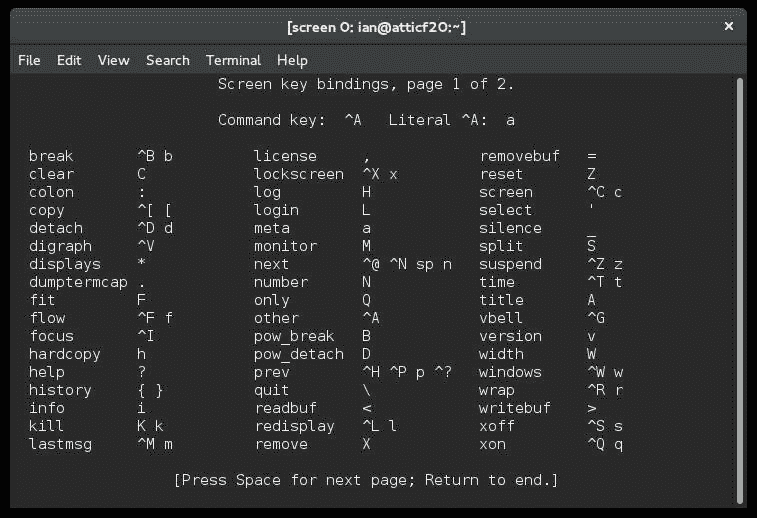

# 创建、监视和结束进程

> 原文：[`developer.ibm.com/zh/tutorials/l-lpic1-103-5/`](https://developer.ibm.com/zh/tutorials/l-lpic1-103-5/)

## 概述

本教程将介绍基本的 Linux 进程管理技术。学习：

*   管理前台和后台作业
*   启动将在您注销后运行的进程
*   监视进程
*   选择将要显示的进程并对它们进行排序
*   向进程发送信号
*   终端窗口中的多任务

## 同时执行多项操作

如果您停下来回想一下就会发现，除了我们在本系列之前的教程中讨论的终端程序外，您的计算机上显然还运行着许多程序。确实如此，如果您使用图形桌面，您可能会同时打开多个终端窗口，或者同时打开文件浏览器、互联网浏览器、游戏、电子表格或其他应用程序。以前，我们的示例展示了如何在终端窗口输入命令。您需要等待命令运行完成，然后才能执行其他任何操作。在本教程中，您将学习如何使用终端窗口同时执行多个操作。

##### 关于本系列

本教程系列将帮助您学习 Linux 系统管理任务。您还可以使用这些教程中的资料来对 [Linux Professional Institute 的 LPIC-1：Linux 服务器专业认证考试](http://www.lpi.org)进行应考准备。

请参阅 “[*学习 Linux，101*：LPIC-1 学习路线图](http://www.ibm.com/developerworks/cn/linux/l-lpic1-map/index.html)”，查看本系列中每部教程的描述和链接。这个路线图仍在开发中，它反映了 2015 年 4 月 15 日更新的 4.0 版 LPIC-1 考试目标。在完成这些教程时，会将它们添加到路线图中。

本教程帮助针对 Linux Server Professional (LPIC-1) 考试 101 的主题 103 中的目标 103.5 进行应考准备。该目标的权重为 4。

### 前提条件

要从本系列教程中获得最大收益，您应该拥有 Linux 的基本知识和一个正常工作的 Linux 系统，您可以在这个系统上实践本教程中涵盖的命令。有时程序的不同版本会得到不同的输出格式，所以您的结果可能并不总是与这里给出的清单和图完全相同。

除非另行说明，本教程中的示例将会使用 Fedora 22 和 4.0.4 内核。您在其他系统上的结果可能有所不同。

## 管理前台和后台作业

在终端窗口中运行命令时，您是在 *前台* 中运行它。许多这样的命令运行得很快，但假设您正运行着一个图形桌面，并喜欢在桌面上显示一个数字时钟。现在，让我们忽略大部分图形桌面已有一个数字时钟的事实，我们就以这种情况为例。

如果已经安装了 X Window 系统，您或许已经有一个图形桌面或许多有趣的图形工具。X Window 系统拥有多个实用程序，比如 `xclock` 和 `xeyes` ，但它们并不总是能在现代桌面上正常使用，所以我将使用 `cairo-clock` 应用程序进行演示，您可以使用 `yum` 、 `dnf` 或 `apt-get` 安装它。

首先打开一个终端窗口并运行命令

`**cairo-clock** **--seconds**`

`--seconds` 选项会请求显示一根秒针，让我们的示例更容易被理解。我们还将一些平时可能出现的 GTK+ 错误消息重定向到 /dev/null（也称为位存储段）。您应该看到一个类似 一个使用 cairo-clock 的图形时钟 的时钟，而且您的终端窗口应类似 启动 cairo-clock 。如果您没有 cairo-clock 或 X Window 系统，您很快会看到如何使用您的终端创建简易数字时钟，所以您现在可能需要继续阅读，然后使用该时钟重新执行这些练习。

##### 一个使用 cairo-clock 的图形时钟


##### 启动 cairo-clock

```
[ian@atticf20 ~]$ cairo-clock --seconds 2>/dev/null 
```

不幸的是，您的终端窗口不再有提示符，所以您需要重新获得控制权。幸运的是，Bash shell 有一个 *暂停* 组合键：Ctrl-z。按下这个组合键就可以再次调出终端提示符，如 使用 Ctrl-z 暂停 cairo-clock 所示。

##### 使用 Ctrl-z 暂停 cairo-clock

```
[ian@atticf20 ~]$ cairo-clock --seconds  2>/dev/null
^Z
[1]+  Stopped                 cairo-clock --seconds 2> /dev/null 
```

该时钟仍在您的桌面上，但它已停止运行。这就是暂停时钟的效果。事实上，如果您拖动另一个窗口覆盖它的一部分，时钟的这部分可能甚至不会被重新绘制。您可以注意到，终端输出消息显示了 [1]+ Stopped。此消息中的 1 是一个 *作业编号* 。可以键入 `fg %1` 来重新启动该时钟。也可以使用命令名称或名称的一部分，键入 `fg %cairo-clock` 或 `fg %?clo` 。最后，如果仅键入 `fg` 而不带参数，您可以重新启动最近停止的作业，在本例中为作业 1。使用 `fg` 重新启动它也会将该作业调回到前台，而且您不再拥有 shell 提示符。您需要做的是将作业放在 *后台* ； `bg` 命令采用了与 `fg` 命令相同类型的作业规范，执行完全相同的任务。

将 cairo-clock 放在前台或后台 展示了如何将 cairo-clock 作业调回到前台，并使用两种形式的 `fg` 命令暂停它。可以暂停它并将它放在后台；在终端上执行其他工作时，时钟会继续运行。

##### 将 cairo-clock 放在前台或后台

```
[ian@atticf20 ~]$ fg %1
cairo-clock --seconds 2> /dev/null
^Z
[1]+  Stopped                 cairo-clock --seconds 2> /dev/null
[ian@atticf20 ~]$ fg %?clo
cairo-clock --seconds 2> /dev/null
^Z
[1]+  Stopped                 cairo-clock --seconds 2> /dev/null
[ian@atticf20 ~]$ bg
[1]+ cairo-clock --seconds 2> /dev/null & 
```

<h3 id=”使用-” -”>使用 “&”

您可能已注意到，当 cairo-clock 作业放在后台时，消息不再显示 “Stopped”，它以一个 & 符号结尾。事实上，您完全不需要暂停该进程来将它放入后台，只需要在命令后附加一个 &，shell 就会在后台启动该命令（或命令列表）。我们使用此方法，启动 cairo-clock 并使用一个复古主题 (antique theme)。您会看到一个类似 一种使用 cairo-clock 的复古时钟 的时钟，终端输出类似 使用 & 在后台启动复古的 cairo-clock 。

##### 一种使用 cairo-clock 的复古时钟


##### 使用 & 在后台启动复古的 cairo-clock

```
[ian@atticf20 ~]$ cairo-clock --seconds --theme antique 2>/dev/null &
[2] 6268 
```

请注意，这一次的消息稍有不同。它显示了作业编号和进程 ID (PID)。我稍后会介绍 PID 并更详细地介绍各种状态。现在让我们使用 `jobs` 命令查看哪些作业正在运行。添加 `-l` 选项来列出 PID，您会看到作业 2 确实拥有 PID 4320，如 限制作业和进程信息 所示。另请注意，作业 2 的作业编号旁有一个加号 (+)，表明它是 *当前的作业* 。如果没有使用 `fg` 命令提供作业规范，此作业会进入前台。

##### 限制作业和进程信息

```
[ian@atticf20 ~]$ jobs -l
[1]-  6250 Running                 cairo-clock --seconds 2> /dev/null &
[2]+  6268 Running                 cairo-clock --seconds --theme antique 2> /dev/null & 
```

在解决一些与后台作业相关的其他问题之前，让我们创建一个简易数字时钟。我们使用 `sleep` 命令引入 2 秒的延迟，并使用 `date` 命令打印当前日期和时间。我们使用一个 `do/done` 代码块将这些命令包装在一个 `while` 循环中，以便创建一个无限循环。最后，我们将所有代码都放在括号中来创建一个命令列表，并使用 & 将整个列表放入后台。您将在本系列的后续教程中进一步学习如何使用循环和脚本构建更复杂的命令。请参阅我们的 [系列路线图](http://www.ibm.com/developerworks/cn/linux/l-lpic1-map/) ，获得本系列中每篇教程的说明和链接。

##### 简易数字时钟

```
 [ian@atticf20 ~]$ (while sleep 2; do date;done)&
 [3] 6717
 [ian@atticf20 ~]$ Mon Jun 15 16:35:40 EDT 2015
 Mon Jun 15 16:35:42 EDT 2015
 Mon Jun 15 16:35:44 EDT 2015
 Mon Jun 15 16:35:46 EDT 2015
 Mon Jun 15 16:35:48 EDT 2015
 fMon Jun 15 16:35:50 EDT 2015
 Mon Jun 15 16:35:52 EDT 2015
 gMon Jun 15 16:35:54 EDT 2015

 ( while sleep 2; do
    date;
 done )
 Mon Jun 15 16:35:56 EDT 2015
 Mon Jun 15 16:35:58 EDT 2015
 Mon Jun 15 16:36:00 EDT 2015
 ^C 
```

我们的列表将作为作业 3 运行，PID 为 6717。date 命令每隔两秒运行一次，在终端上打印出日期和时间。您键入的输入已突出显示。对于打字较慢的人，在键入整条命令之前，字符会分散在多个输出行上。事实上，您可以注意到，您为将命令列表调出到前台而键入的 ‘ f ‘ ‘ g ‘ 之间已相隔了几行。最终输入 `fg` 命令后，bash 会显示现在正在您的 shell 中运行的命令，也就是命令列表，该命令仍会每隔两秒打印出时间。

成功将作业调入前台后，您可以终止（ *结束* ）它，或者执行其他某个操作。在本例中，我们使用 Ctrl-c 来终止我们的’时钟’。

### 标准 IO 和后台进程

我们前一个例子中 `date` 命令的输出中夹杂着我们尝试键入的 `fg` 命令的回显字符。这带来了一个有趣的问题。如果后台进程需要来自 stdin 的输入，会发生什么？

我们用来启动后台应用程序的终端进程被称为 *控制终端* 。除非重定向到别处，否则来自后端进程的 stdout 和 stderr 流都会定向到控制终端。类似地，后台任务需要来自控制终端的输入，但控制终端无法将您键入的任何字符定向到后台进程的 stdin。在这种情况下，Bash shell 会暂停该进程，使其不再执行。您可以将它调到前台并提供必要的输入。 等待 stdin 演示了一种可将命令列表放入后台的简单情况。片刻之后，按下 **Enter** 就会看到表明该进程已停止的消息。将它调到前台并提供一行输入，然后按下 **Ctrl-d** 表示输入文件的结尾。完成命令列表并显示我们创建的文件。

##### 等待 stdin

```
 [ian@atticf20 ~]$ (date; cat - > bginput.txt;date)&
 [3] 6877
 Mon Jun 15 16:45:35 EDT 2015

 [3]+  Stopped                 ( date; cat - > bginput.txt; date )
 [ian@atticf20 ~]$ fg
 ( date; cat - > bginput.txt; date )
 some textmore text
 Mon Jun 15 16:45:47 EDT 2015
 [ian@atticf20 ~]$ cat bginput.txt
 some text
 more text 
```

您可能想知道为什么此作业是作业 3。终止简易时钟后，只有两个 cairo-clock 作业在运行，它们的作业编号为 1 和 2。所以，下一个可用作业编号被分配，我们的后台输入作业变成了作业 3。

## 注销后运行一个进程

实际上，您可能希望向或从一个文件重定向后台进程的标准 IO 流。还有另一个相关问题：如果控制终端关闭或用户注销，该进程会怎样？答案取决于使用的 shell。如果 shell 发送一个 SIGHUP（或 hangup）信号，应用程序可能会关闭。我稍后会介绍信号，现在，我们将考虑解决此问题的另一种方式。

### nohup

`nohup` 命令用于启动一个命令，以便忽略 hangup 信号并将 stdout 和 stderr 附加到一个文件。默认文件为 nohup.out 或 $HOME/nohup.out。如果无法写入该文件，就不会运行此命令。如果您想输出到其他某个地方，可按照教程 “[学习 Linux 101：流、管道和重定向](http://www.ibm.com/developerworks/library/l-lpic1-103-4/index.html) ” 中介绍的方法重定向 stdout 或 stderr。

`nohup` 命令不会执行一个管道或命令列表。您可以将管道或列表保存在一个文件中，然后使用 `sh` （默认 shell）或 `bash` 命令运行该文件。本系列的另一篇教程介绍了如何让脚本文件变得可执行，但现在，我们坚持使用 `sh` 或 `bash` 命令来运行脚本。 在脚本中结合使用 nohup 和命令列表 展示了如何为我们的简易数字时钟运行脚本。不用说，花时间写入到文件中不是特别有用，而且该文件会不断增长，所以我们将时钟设置为每 30 秒更新一次，而不是每秒更新一次。

##### 在脚本中结合使用 nohup 和命令列表

```
 [ian@atticf20 ~]$ echo "while sleep 30; do date;done">pmc.sh
 [ian@atticf20 ~]$ nohup sh pmc.sh&
 [3] 6955
 [ian@atticf20 ~]$ nohup: ignoring input and appending output to ' nohup.out '

 [ian@atticf20 ~]$ nohup bash pmc.sh&
 [4] 6970
 nohup: ignoring input and appending output to ' nohup.out ' 
```

如果显示 nohup.out 的内容，我们会看到我们运行的两个 nohup 命令的输出行交叉显示在一起，每行的显示时间比其上面两行晚约 30 秒，如 来自 nohup 进程的输出 所示。

##### 来自 nohup 进程的输出

```
[ian@atticf20 ~]$ cat nohup.out
Mon Jun 15 17:02:24 EDT 2015
Mon Jun 15 17:02:43 EDT 2015
Mon Jun 15 17:02:54 EDT 2015
Mon Jun 15 17:03:13 EDT 2015
Mon Jun 15 17:03:24 EDT 2015
Mon Jun 15 17:03:43 EDT 2015 
```

nohup 的旧版本不会将状态消息写入到控制终端，因此，如果您犯了错误，您可能不会立即知道。假设您将 stdout 和 stderr 都重定向到您自己选择的一个文件，并且假设您断定使用 `.` 获取命令比键入 `sh` 或 `bash` 更容易。 使用 nohup 时犯错 展示了如果像我们之前一样使用 nohup，但同时重定向 stdout 和 stderr，会发生什么。输入命令后，您会看到一条消息表明作业 4 已启动且它的 PID 为 5853。如果没有立即看到表明该作业已终止，且退出代码为 126 的消息，可再次按下 **Enter** ，然后您就会看到它。

##### 使用 nohup 时犯错

```
[ian@atticf20 ~]$ nohup . pmc.sh >mynohup.out 2>&1 &
[5] 7042
[5]+  Exit 126                nohup . pmc.sh > mynohup.out 2>&1 
```

来自 nohup 的隐藏消息 显示了 mynohup.out 的内容。其实没什么奇怪的。您使用 **nohup** 在后台运行一个命令，使用 **source** (**.**) 从一个文件读取命令，并在当前 shell 中运行它们。对于此方法，要记住的重要一点是，您可能需要按下 **Enter** 来允许 shell 显示后台作业退出状态，而且您可能需要查看 nohup 的输出文件，以便了解到底哪里出了错。

##### 来自 nohup 的隐藏消息

```
[ian@atticf20 ~]$ cat mynohup.out
nohup: ignoring input
nohup: failed to run command ' . ' : Permission denied 
```

现在将注意力转到进程的状态上。如果您一直在学习并打算现在休息一下，请不要走远，因为您现在有两个作业正在文件系统中创建不断增大的文件。可以使用 `fg` 命令依次将每个作业调到前台，然后使用 Ctrl-c 终止它，但是，如果想让它们运行更长时间，您会看到监控它们和与它们交互的其他方法。

## 监视进程

之前我曾简要介绍过 `jobs` 命令，您已经了解如何使用它列出我们的作业的进程 ID (PID)。

### ps

还有另一个 `ps` 命令，我们使用它来显示进程状态信息的各个部分。请记住，”ps” 是 “process status” 的缩写。 `ps` 命令接受 0 或更多 PID 作为参数，并显示关联的进程状态。如果我们使用 `jobs` 命令和 `-p` 选项，输出为每个作业的 *process group leader* 的 PID。我们将使用此输出作为 `ps` 命令的参数，如 后台进程的状态 所示。

##### 后台进程的状态

```
[ian@atticf20 ~]$ jobs -p
6250
6268
6955
6970
[ian@atticf20 ~]$ ps $(jobs -p)
 PID TTY      STAT   TIME COMMAND
6250 pts/1    Sl     2:34 cairo-clock --seconds
6268 pts/1    Sl     3:42 cairo-clock --seconds --theme antique
6955 pts/1    S      0:00 sh pmc.sh
6970 pts/1    S      0:00 bash pmc.sh 
```

如果使用 `ps` 而不带选项，那么您会看到一组使用您的终端作为其控制终端的进程，如 使用 ps 显示状态 所示。请注意，pmc.sh 命令没有显示在此列表中。您稍后会看到原因。

##### 使用 ps 显示状态

```
[ian@atticf20 ~]$ ps
 PID TTY          TIME CMD
4111 pts/1    00:00:00 bash
6250 pts/1    00:02:36 cairo-clock
6268 pts/1    00:03:46 cairo-clock
6955 pts/1    00:00:00 sh
6970 pts/1    00:00:00 bash
7218 pts/1    00:00:00 sleep
7221 pts/1    00:00:00 sleep
7222 pts/1    00:00:00 ps 
```

一些选项（包括 `-f` (full)、 `-j` (jobs) 和 `-l` (long)）可以控制显示的信息量。如果未指定任何 PID， `--forest` 选项是另一个有用的选项，它在树分层结构中显示命令，显示哪个进程以其他哪个进程作为父进程。具体地讲，您可以看到，前面的清单中的 `sleep` 命令是后台运行的脚本的子命令。如果您在不同时刻运行该命令，可能会看到进程状态中列出了 `date` 命令，但此脚本出现这种情况的几率很小。我在 更多状态信息 中演示了部分选项。

##### 更多状态信息

```
[ian@atticf20 ~]$ ps -f
UID        PID  PPID  C STIME TTY          TIME CMD
ian       4111  2176  0 13:38 pts/1    00:00:00 bash
ian       6250  4111  4 16:20 pts/1    00:02:41 cairo-clock --seconds
ian       6268  4111  6 16:21 pts/1    00:03:53 cairo-clock --seconds --theme an
ian       6955  4111  0 17:01 pts/1    00:00:00 sh pmc.sh
ian       6970  4111  0 17:02 pts/1    00:00:00 bash pmc.sh
ian       7240  6970  0 17:19 pts/1    00:00:00 sleep 30
ian       7243  6955  0 17:19 pts/1    00:00:00 sleep 30
ian       7256  4111  0 17:19 pts/1    00:00:00 ps -f
[ian@atticf20 ~]$ ps -j --forest
 PID  PGID   SID TTY          TIME CMD
4111  4111  4111 pts/1    00:00:00 bash
6250  6250  4111 pts/1    00:02:41  \_ cairo-clock
6268  6268  4111 pts/1    00:03:53  \_ cairo-clock
6955  6955  4111 pts/1    00:00:00  \_ sh
7243  6955  4111 pts/1    00:00:00  |   \_ sleep
6970  6970  4111 pts/1    00:00:00  \_ bash
7264  6970  4111 pts/1    00:00:00  |   \_ sleep
7265  7265  4111 pts/1    00:00:00  \_ ps 
```

现在，您已经拥有了一些使用 `jobs` 和 `ps` 命令监视进程的基本工具，在继续介绍选择和排序要显示的进程的其他方式之前，我们将简要介绍另外两个监视命令。

### free

`free` 命令将会显示系统中的空闲和已用内存量。默认情况下，显示值以 KB 为单位，但可以覆盖此设置，使用 `-b` 表示字节， `-k` 表示 KB， `-m` 表示 MB，或者 `-g` 表示 GB。 `-t` 选项显示一个总和行，结合使用 `-s` 选项和一个值可按指定的频率刷新该信息。该数字以秒为单位，但也可以是浮点值。 使用 free 命令 显示了两个例子。

##### 使用 free 命令

```
[ian@atticf20 ~]$ free
             total        used        free      shared  buff/cache   available
Mem:        4046816     1845624      334164       21212     1867028     1926056
Swap:             0           0           0
[ian@atticf20 ~]$ free -mt
             total        used        free      shared  buff/cache   available
Mem:           3951        1801         327          20        1823        1882
Swap:             0           0           0
Total:         3951        1801         327 
```

### uptime

`uptime` 命令会显示一个行，其中包含当前时间、系统已运行时长、目前有多少用户登录，以及过去 1、5 和 15 分钟的系统平均负载。 显示正常运行时间信息 显示了一个示例。

##### 显示正常运行时间信息

```
[ian@atticf20 ~]$ uptime
17:22:39 up  8:53,  4 users,  load average: 0.41, 0.62, 0.66 
```

## 选择和排序要显示的进程

### 使用 ps

目前为止所讨论的 `ps` 命令仅列出从终端会话启动的进程（请注意 更多状态信息 的第二个示例中的 SID 列，即会话 ID）。要查看所有具有控制终端的进程，可使用 `-a` 选项。 `-x` 选项将会显示没有控制终端的进程， `-e` 选项将会显示 **每个** 进程的信息。您会发现，如果在您或其他任何人已登录图形桌面的系统上运行此命令，则会得到许多输出。 显示其他进程 显示了两个不同系统（Ubuntu 15 和 Fedora 22）上所有具有控制终端的进程的完整 (`-f`) 格式。对于第二个系统，我们删减了输出，但显示了实际有多少行输出。我怀疑 Fedora 22 中存在一个错误，守护进程通常应与其控制终端分离，所以我们不应在此输出中看到守护进程。

##### 显示其他进程

```
 jenni@yoga-u15:~$ ps -af # Ubuntu 15.04
 jenni@yoga-u15:~$ ps -af
 UID        PID  PPID  C STIME TTY          TIME CMD
 root      3168  1934  0 12:23 pts/1    00:00:00 sudo -s
 root      3169  3168  0 12:23 pts/1    00:00:00 /bin/bash
 root      4938  4769  0 22:03 pts/5    00:00:00 su - jenni
 jenni     4939  4938  0 22:03 pts/5    00:00:00 -su
 jenni     5013  4994  0 22:06 pts/19   00:00:00 ps -af

 [ian@atticf20 ~]$ ps -af #Fedora 22
 UID        PID  PPID  C STIME TTY          TIME CMD
 gdm       1050  1045  0 08:29 tty1     00:00:00 dbus-daemon --print-address 3 --
 gdm       1089  1045  0 08:29 tty1     00:00:00 /usr/bin/gnome-session --autosta
 ...
 ian       4788     1  0 14:09 tty2     00:00:00 /usr/libexec/gvfsd-http --spawne
 ian       6250  4111  4 16:20 pts/1    00:14:24 cairo-clock --seconds
 ian       6268  4111  6 16:21 pts/1    00:21:55 cairo-clock --seconds --theme an
 ian       6955  4111  0 17:01 pts/1    00:00:00 sh pmc.sh
 ian       6970  4111  0 17:02 pts/1    00:00:00 bash pmc.sh
 ian      10758 10715  0 21:24 pts/3    00:00:00 ssh ian@192.168.1.42
 ian      10962  6955  0 21:36 pts/1    00:00:00 sleep 30
 ian      10963 10922  0 21:36 pts/4    00:00:00 ssh ian@192.168.1.24
 ian      11138  6970  0 21:36 pts/1    00:00:00 sleep 30
 ian      11139 10974  0 21:36 pts/5    00:00:00 ps -af
 [ian@atticf20 ~]$ ps -af | wc -l
 83 
```

可以注意到 TTY 列中列出了控制终端。对于此清单的 Fedora 22 部分，我切换到了 ssh 登录 (pts/5)，所以 `ps -af` 命令在 pts/5 下运行，而为本教程创建的大部分命令都在 pts/1 下运行。

`ps` 还有更多选项，包括一个控制显示哪些字段和如何显示它们的选项。其他选项控制如何选择要显示的进程，例如通过选择针对特定用户 (`-u`) 或特定命令 (`-C`) 的进程。在 谁在运行 bash 命令？ 中，用户 jenni 找到了所有运行 `bash` 命令的进程；我们使用 `-o` 选项指定显示的列。我们将 `user` 选项添加到您使用单纯的 `ps` 所获得的正常列表中，所以您可以看到哪个用户在运行 `bash` 。

##### 谁在运行 bash 命令？

```
[jenni@atticf20 ~]$ ps -C bash -o user,pid,tty,time,comm
jenni@yoga-u15:~$ ps -af # Ubuntu 15.04
UID        PID  PPID  C STIME TTY          TIME CMD
root      3168  1934  0 12:23 pts/1    00:00:00 sudo -s
root      3169  3168  0 12:23 pts/1    00:00:00 /bin/bash
root      4938  4769  0 22:03 pts/5    00:00:00 su - jenni
jenni     4939  4938  0 22:03 pts/5    00:00:00 -su
jenni     5014  4994  0 22:08 pts/19   00:00:00 ps -af 
```

有时您可能想按照特定字段对输出进行排序，您还可以使用 `--sort` 选项指定排序字段来实现此目的。默认情况下会按升序进行排序 (`+`)，但您也可以指定降序 (`-`)。 对来自 ps 的输出进行排序 显示了最终的 `ps` 示例，其中所有进程都使用作业格式列出，而且输出会按照会话 ID 和命令名称进行排序。对于第一个字段，我们将使用默认排序顺序；对于第二个字段，我们会显式指定两种排序顺序。

##### 对来自 ps 的输出进行排序

```
jenni@yoga-u15:~$ ps -aj --sort -sid,+comm # Ubuntu 15.04
 PID  PGID   SID TTY          TIME CMD
5083  5083  4994 pts/19   00:00:00 ps
4939  4939  4769 pts/5    00:00:00 bash
4938  4938  4769 pts/5    00:00:00 su
3169  3169  1934 pts/1    00:00:00 bash
3168  3168  1934 pts/1    00:00:00 sudo
jenni@yoga-u15:~$ ps -aj --sort sid,comm # Ubuntu 15.04
 PID  PGID   SID TTY          TIME CMD
3169  3169  1934 pts/1    00:00:00 bash
3168  3168  1934 pts/1    00:00:00 sudo
4939  4939  4769 pts/5    00:00:00 bash
4938  4938  4769 pts/5    00:00:00 su
5085  5085  4994 pts/19   00:00:00 ps 
```

### pgrep

另一个有用的命令（但具有更少的选项）是 `pgrep` 命令，它允许您使用正则表达式来按名称搜索进程。 `-a` 选项还会打印命令行， `-f` 选项与整个命令行匹配。 使用 pgrep 查找时钟进程 中给出了一个搜索我们的时钟进程的示例。

##### 使用 pgrep 查找时钟进程

```
[ian@atticf20 ~]$ pgrep iro # Fedora 22
6250
6268
[ian@atticf20 ~]$ pgrep -af "i.*seconds"
6250 cairo-clock --seconds
6268 cairo-clock --seconds --theme antique 
```

跟平常一样，请参阅 `ps` 和 `pgrep` 的手册页，了解您可指定的许多选项和字段的完整细节。

### 使用 top

如果连续运行 `ps` 多次来查看发生了哪些更改，您可能需要使用 `top` 命令。它显示一个持续更新的进程列表，以及有用的摘要信息。 使用 top 显示进程 显示了 `top` 显示结果的前几行。使用 **q** 子命令退出 **top** 。

##### 使用 top 显示进程

```
 jenni@yoga-u15:~$ top # Ubuntu 15.04
 top - 22:20:01 up 10:11,  5 users,  load average: 0.00, 0.01, 0.05
 Tasks: 206 total,   1 running, 205 sleeping,   0 stopped,   0 zombie
 %Cpu(s):  0.4 us,  0.1 sy,  0.0 ni, 99.5 id,  0.0 wa,  0.0 hi,  0.0 si,  0.0 st
 KiB Mem:   8090136 total,  2355204 used,  5734932 free,    50760 buffers
 KiB Swap:  4095996 total,        0 used,  4095996 free.  1713188 cached Mem

  PID USER      PR  NI    VIRT    RES    SHR S  %CPU %MEM     TIME+ COMMAND
 1257 ian       20   0 1225160 176140  85496 S   1.7  2.2   3:31.96 compiz
 1252 ian       20   0  628292  37536  25508 S   0.3  0.5   0:05.15 unity-pane+
 4026 root      20   0       0      0      0 S   0.3  0.0   0:00.54 kworker/2:0
 5086 jenni     20   0   29184   3084   2560 R   0.3  0.0   0:00.05 top
    1 root      20   0  182724   5400   3676 S   0.0  0.1   0:02.08 systemd
    2 root      20   0       0      0      0 S   0.0  0.0   0:00.00 kthreadd 
```

`top` 命令有一些子命令，其中对入门最优帮助的是：

*   **h** ：获取帮助
*   **q** ：退出 `top` 命令
*   **f** ：在显示结果中添加或删除字段
*   F：选择要排序的字段

请参阅 `top` 的手册页，了解选项的完整细节，包括如何按内存使用量或其他条件进行排序。 对 top 的输出进行排序 显示了一个按虚拟内存使用量降序进行排序的输出示例。

##### 对 top 的输出进行排序

```
 top - 22:42:27 up 10:34,  5 users,  load average: 0.00, 0.01, 0.05
 Tasks: 205 total,   1 running, 204 sleeping,   0 stopped,   0 zombie
 %Cpu(s):  0.3 us,  0.0 sy,  0.0 ni, 99.7 id,  0.0 wa,  0.0 hi,  0.0 si,  0.0 st
 KiB Mem:   8090136 total,  2356524 used,  5733612 free,    50836 buffers
 KiB Swap:  4095996 total,        0 used,  4095996 free.  1713456 cached Mem

  PID USER      PR  NI    VIRT    RES    SHR S  %CPU %MEM     TIME+ COMMAND
 1257 ian       20   0 1225160 176240  85596 S   0.9  2.2   3:44.41 compiz
  802 root      20   0  695780 152280 132704 S   0.1  1.9   0:48.44 Xorg
 1408 ian       20   0 1220376  66628  56444 S   0.0  0.8   0:01.02 nautilus
 1461 ian       20   0 1003252  59780  20904 S   0.0  0.7   0:00.18 evolution-+
 1244 ian       20   0  939208  38948  29604 S   0.0  0.5   0:01.11 unity-sett+
 1252 ian       20   0  628292  37536  25508 S   0.0  0.5   0:05.27 unity-pane+ 
```

## 向进程发送信号

现在看看 Linux *信号* ，它们是与进程通信的异步方式。我们已提到过 SIGHUP 信号，而且已使用过 Ctrl-c 和 Ctrl-z，这些是将信号发送到进程的其他方法。发送信号的一般方法是使用 `kill` 命令。您也可以使用 `pkill` 或 `killall` 命令，在一个命令中向多个进程发送信号。

### 使用 kill 发送信号

`kill` 命令将信号发送到指定的作业或进程。 停止并重新启动后台作业 展示了使用 SIGTSTP 和 SIGCONT 信号停止和恢复后台作业。使用 SIGTSTP 信号等效于使用 `fg` 命令将作业调到前台，然后按下 Ctrl-z 暂停它。使用 SIGCONT 类似于使用 `bg` 命令。

##### 停止并重新启动后台作业

```
 [ian@atticf20 ~]$ kill -s SIGTSTP %1

 [1]+  Stopped                 cairo-clock --seconds 2> /dev/null
 [ian@atticf20 ~]$ jobs -l
 [1]+  6250 Stopped                 cairo-clock --seconds 2> /dev/null
 [2]   6268 Running                 cairo-clock --seconds --theme antique 2> /dev/null &
 [3]   6955 Running                 nohup sh pmc.sh &
 [4]-  6970 Running                 nohup bash pmc.sh &
 [ian@atticf20 ~]$ kill -s SIGCONT 6250
 [ian@atticf20 ~]$ jobs -l
 [1]   6250 Running                 cairo-clock --seconds 2> /dev/null &
 [2]   6268 Running                 cairo-clock --seconds --theme antique 2> /dev/null &
 [3]-  6955 Running                 nohup sh pmc.sh &
 [4]+  6970 Running                 nohup bash pmc.sh & 
```

我们在本例中使用了作业规范 (%1) 来停止 `cairo-clock` 进程，然后使用进程 ID (PID) 来重新启动（继续运行）它。如果停止了作业 %2，然后使用 `tail` 和 `-f` 选项来跟踪 nohup 输出文件 nohup.out，就会看到只有一个进程在更新该文件。

您可以使用 `kill -l` 在系统上显示其他许多信号。一些信号用于报告错误，比如非法操作代码、浮点异常，或者尝试访问一个进程没有访问权的内存。请注意，信号同时包含一个编号（比如 20）和一个名称（比如 SIGTSTP）。您可以使用以 – 符号为前缀的编号，或者使用 `-s` 选项和信号名称。在我的系统上，我可以使用 `kill -20` 代替 `kill -s SIGTSTP` 。在假设哪个编号属于哪个信号之前，始终应检查系统上的信号编号。

### 信号处理函数和进程终止

您已经看到，可以使用 Ctrl-c 终止进程。事实上，它向进程发送了一个 SIGINT（或中断）信号。如果使用 `kill` 而不带任何信号名称，它会发送一个 SIGTERM 信号。对于大部分用途，这两种信号是等效的。

您还可以看到， `nohup` 命令使进程不受 SIGHUP 信号影响。一般而言，进程可实现 *信号处理函数* 来 *捕获* 信号。所以进程可实现信号处理函数来捕获 SIGINT 或 SIGTERM。因为信号处理函数知道发送了哪个信号，所以它可以选择忽略 SIGINT，仅在收到 SIGTERM 时才终止。 使用 SIGTERM 终止进程 展示了如何使用 `kill` 将 SIGTERM 信号发送到作业 %1，使用命令名称的一部分作为模式来将 SIGTERM（默认）信号发送到另一个 `cairo-clock` 进程。请注意，在我们发送该信号后，进程状态显示为 “Terminated”。如果使用 SIGINT，状态将显示为 “Interrupt”。片刻之后，就会进行进程清理，该作业不再显示在作业列表中。最后，我们将 SIGHUP 信号发送到所有运行 `sleep` 命令的进程。因为 `pmc.sh` 在大多数时候会这么做，所以如果我们使用 `pgrep` 查找运行 `sleep` 的进程，就会看到此结果。毫不奇怪，这些进程保持运行，因为我们启动它们时希望它们忽略 SIGHUP 信号。

##### 使用 SIGTERM 终止进程

```
[ian@atticf20 ~]$ kill -s SIGTERM %1
[1]   Terminated              cairo-clock --seconds 2> /dev/null
[ian@atticf20 ~]$ pkill cairo
[2]   Terminated              cairo-clock --seconds --theme antique 2> /dev/null
[ian@atticf20 ~]$ pgrep -a sleep; pkill --signal SIGHUP sleep;jobs -l
13628 sleep 30
13631 sleep 30
[3]-  6955 Running                 nohup sh pmc.sh &
[4]+  6970 Running                 nohup bash pmc.sh & 
```

信号处理函数为进程提供了很高的灵活性。进程可执行自己的正常工作，并有一个用于某种特殊用途的信号中断。除了允许进程捕获终止请求并采取可能的操作，比如关闭文件或在正在运行是事务中设置检查点，信号通常还用于告诉守护进程重新读取其配置文件，而且可能重新启动操作。您在更改网络参数时可对 inetd 进程这么做，或者在添加新参数时对行式打印机守护进程 (lpd) 这么做。

### 无条件地终止进程

一些信号无法捕获，比如一些硬件异常。信号处理函数无法捕获 SIGKILL（您最有可能使用的信号），该信号会无条件地终止进程。一般而言，仅在其他所有终止进程的方式都失败后，才需要采用这种方式。

## 注销和 nohup

还记得吗，您已经了解到，通过使用 `nohup` ，您的进程会在您注销后继续运行。让我们先来注销，然后再次登录。再次登录后，使用 `jobs` 检查剩余的简易时钟进程，就像我们在上面所做的一样。输出如 再次登录 所示。

##### 再次登录

```
[ian@atticf20 ~]$ jobs -l 
```

没有我们的作业的信息！这或许不是我们期望的结果。但是，并不是一无所有。假设您不记得您终止的是使用 bash 启动的 nohup 作业还是使用 sh 启动的作业。之前我们已经了解了如何找到运行 `bash` 命令的进程，所以您可以使用同样的技巧来仅显示 SID、PID、PPID 和命令字符串。然后可以使用 `-js` 选项，使用 SID（会话 ID）值显示会话中的所有进程。 找到我们丢失的命令 显示了结果。考虑您查找这些进程的其他方式，比如按用户名搜索，然后使用 `grep` 过滤。

##### 找到我们丢失的命令

```
[ian@atticf20 ~]$ ps -C bash -C sh -o pid,sid,tname,cmd
 PID   SID TTY      CMD
2180  2180 pts/0    bash
3779  1474 tty2     /bin/sh /home/ian/Oxygen XML Author 17/oxygenAuthor17.0
4158  4158 pts/2    bash
6955  4111 ?        sh pmc.sh
6970  4111 ?        bash pmc.sh
10715 10715 pts/3    bash
10922 10922 pts/4    bash
10974 10974 pts/5    -bash
11262 11262 pts/6    bash
13702 13702 pts/1    bash
[ian@atticf20 ~]$ ps -js 4111
 PID  PGID   SID TTY          TIME CMD
6955  6955  4111 ?        00:00:00 sh
6970  6970  4111 ?        00:00:00 bash
14394  6955  4111 ?        00:00:00 sleep
14402  6970  4111 ?        00:00:00 sleep 
```

请注意，pmc.sh 仍在运行，但现在它在控制 TTY 列中有一个问号 (?)。

借助您目前学到的结束进程的知识，您应能够使用 PID 和 `kill` 命令结束剩余的简易时钟进程。我们将介绍另一个结束进程的命令，也就是 `killall` 命令，它的许多参数与 `pgrep` 和 `pkill` 相同。不幸的是，它没有使用 pmc.sh 名称标识我们的进程，所以我们将使用它结束所有 `sleep` 命令。这里使用它只是为了演示目的；从一个运行的 shell 脚本中选择一个命令通常不是查找一组特定进程的好方法。您可能意外地结束完全不相关的进程。 `killall` 更适合用于结束 `cairo-clock` 进程，但我们已结束了它们。

##### 使用 killall 命令

```
[ian@atticf20 ~]$ killall sleep
[ian@atticf20 ~]$ ps -js 4111
 PID  PGID   SID TTY          TIME CMD 
```

## 使用 screen 命令共用终端

在需要管理多个系统时，通常会使用 SSH 终端会话登录一个系统。在该系统中，您可能启动一个长期运行的系统并忘记使用 `nohup` 。当您注销时，您的工作就丢失了。在其他时候，您可能在做某件事的同时，希望拥有另一个窗口来查看相关或无关的问题。您可以启动另一个 SSH 会话，或者可以使用 `screen` 命令，这是一个全屏窗口管理器，在多个进程之间多路复用一个物理终端。您可以从远程系统断开，然后在以后重新连接，让进程在您离开期间保持运行。

可键入 **screen** 启动 `screen` 程序。您的终端窗口已清除，现在，您在 `screen` 环境中运行。您会看到，这与常规终端没有太多区别，除了您现在使用 **Ctrl-a** （按住 Ctrl 键的同时按下小写字母 ‘ a ‘ 键）来与 `screen` 本身交互，而不是与 shell 交互。然后可以输入 `screen` 能够理解的命令，例如输入 `?` 来获取帮助。我们已在 screen 命令帮助 – 第 1 页 中演示了 screen 的外观，在 screen 命令帮助 – 第 2 页 中给出了第 2 页帮助。从现在开始，我们将使用更容易理解的代码清单来进行演示。

**备注：** 如果您提供的命令中没有 `screen` 命令，您可能需要安装 screen 包。请参阅 [developerWorks LPIC-1 学习路线图](http://www.ibm.com/developerworks/cn/linux/l-lpic1-map/) 了解包安装主题。

##### screen 命令帮助 – 第 1 页



##### screen 命令帮助 – 第 2 页

```
 Screen key bindings, page 2 of 2.

 ^]   paste .
"    windowlist -b
 -    select -
 0    select 0
 1    select 1
 2    select 2
 3    select 3
 4    select 4
 5    select 5
 6    select 6
 7    select 7
 8    select 8
 9    select 9
 I    login on
 O    login off
 ]    paste .
 |    split -v
 :kB: focus prev

                        [Press Space or Return to end.] 
```

我们现在将重新启动简易时钟脚本，让它运行一段时间，然后使用 **Ctrl-a** 并输入 `d` 来与 screen 断开连接，如 从正在运行的 screen 会话断开连接 中所示。在本节剩余部分中，我们会在清单中使用 **^a** 表示 **Ctrl-a** 。

##### 从正在运行的 screen 会话断开连接

```
[ian@atticf20 ~]$ bash pmc.sh
Tue Jun 16 12:11:16 EDT 2015
Tue Jun 16 12:11:46 EDT 2015
Tue Jun 16 12:12:16 EDT 2015
Tue Jun 16 12:12:46 EDT 2015
^ad
[detached from 21657.pts-8.atticf20] 
```

现在我们将进入另一个办公室（或家里，就像我一样）的 Ubuntu 15.04 系统，使用 ssh 连接回 atticf20 来查看命令进展。我们使用 `-r` 选项重新连接到断开的 screen 会话，如 重新连接到断开的 screen 中所示。可以看到它在继续运行，甚至在我们与 `screen` 命令断开时。在本例中，我们还将使用 **Ctrl-c** 终止该命令。请注意，我们仍在 `screen` 控制之下；只有正在运行的 **pmc.sh** 命令被终止。

##### 重新连接到断开的 screen

```
ian@yoga-u15:~$ ssh ian@atticf20
ian@atticf20's password:
Last login: Tue Jun 16 12:11:09 2015 from 192.168.1.42
[ian@atticf20 ~]$ screen -r
[ian@atticf20 ~]$ bash pmc.sh
Tue Jun 16 12:11:16 EDT 2015
Tue Jun 16 12:11:46 EDT 2015
Tue Jun 16 12:12:16 EDT 2015
Tue Jun 16 12:12:46 EDT 2015
Tue Jun 16 12:13:16 EDT 2015
Tue Jun 16 12:13:47 EDT 2015
Tue Jun 16 12:14:17 EDT 2015
Tue Jun 16 12:14:47 EDT 2015
Tue Jun 16 12:15:17 EDT 2015
Tue Jun 16 12:15:47 EDT 2015
Tue Jun 16 12:16:17 EDT 2015
^C 
```

如果您的 screen 会话中需要多个虚拟终端，您可以首先使用以下基本命令。请参阅 `screen` 的手册页，进一步了解可执行的操作。为了清楚起见，我们已将子命令字母与 **Ctrl-a** 部分分开，所以 **Ctrl-a w** 实际上表示 **^aw** 。

*   Ctrl-a w：启动另一个虚拟屏幕
*   Ctrl-a n：显示此循环中的下一个窗口
*   Ctrl-a p：显示此循环中的上一个窗口
*   Ctrl-a k：终止（或结束）当前的虚拟屏幕
*   Ctrl-a \：结束所有窗口并终止屏幕

目前为止，我们今看到了一个正在运行的 `screen` 命令。我们看到了如何打开多个虚拟屏幕和在它们之间轮换。我们看到了如何使用 `screen` 的 `-r` 选项重新连接。但是如果您有多个 `screen` 副本在运行，如何重新连接？

要注意的第一点是断开命令。（ 从正在运行的 screen 会话断开连接 中显示的 **Ctrl-a d** 表明我们正在从 21657.pts-8.atticf20” 断开。）21657 部分实际上是 `screen` 命令的进程的 PID，而且您可以使用 `-r` 和值 `21657` 重新连接。因为 PID 不太人性化，所以您还可以使用 `-S` 选项和一个更人性化的名称来启动 `screen` 。 `-ls` 选项提供了一个您可以重连的正在运行的 `screen` 副本列表。您不能重连到一个已处于 Attached 状态的屏幕，只能重连处于 Detached 状态的屏幕。我在 有关断开和重连的更多信息 中展示了一些例子。

##### 有关断开和重连的更多信息

```
 [ian@atticf20 ~]$ screen -S lpi-example^ad
 [detached from 22399.lpi-example]
 [ian@atticf20 ~]$ screen -ls
 There are screens on:
     22399.lpi-example      (Detached)
     21657.pts-8.atticf20      (Attached)
 2 Sockets in /var/run/screen/S-ian.

 [ian@atticf20 ~]$ screen -r 21657.pts-8.atticf20
 There is a screen on:
     21657.pts-8.atticf20      (Attached)
 There is no screen to be resumed matching 21657.pts-8.atticf20.
 [ian@atticf20 ~]$ screen -r 21657
 There is a screen on:
     21657.pts-8.atticf20      (Attached)
 There is no screen to be resumed matching 21657.
 [ian@atticf20 ~]$ screen -r lpi-example^ad
 [detached from 22399.lpi-example] 
```

您可使用手册进一步探索 `screen` 命令的其他许多可能性。

也可以将您的屏幕与其他用户共享，例如在类设置中或用于提供帮助，这需要在 `screen` 命令的二进制文件中设置 `suid` 位，不属于本教程的介绍范畴。如果您愿意的话，还可以在网上查找一些有帮助的技巧，因为手册页没有全面解释它。

我们对创建、监视和结束进程的介绍到此结束。

本文翻译自：[Learn Linux, 101: Create, monitor, and kill processes](https://developer.ibm.com/tutorials/l-lpic1-103-5/)（2016-07-12）