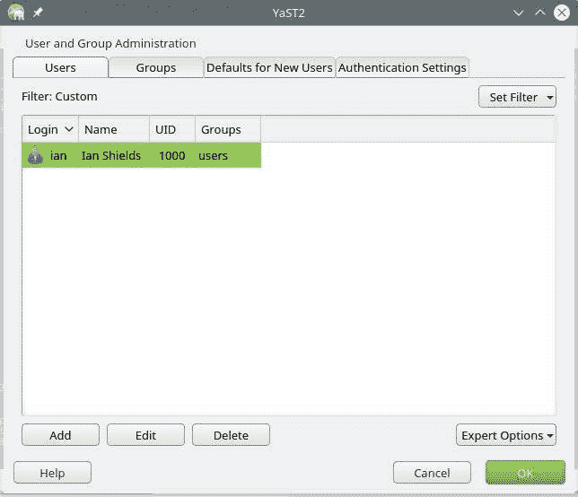
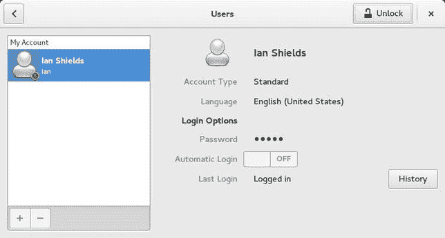
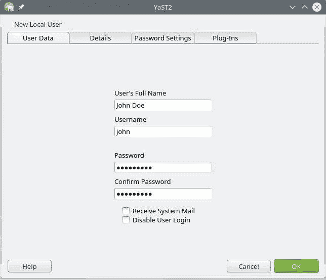
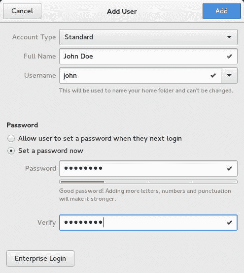

# 管理用户和组帐户及相关系统文件

> 原文：[`developer.ibm.com/zh/tutorials/l-lpic1-107-1/`](https://developer.ibm.com/zh/tutorials/l-lpic1-107-1/)

## 概述

在本教程中，学习：

*   添加、修改和删除用户和组
*   挂起和更改用户帐户
*   管理密码和组数据库中的用户和组信息
*   创建和管理受限和特殊用途的帐户

## 用户和组

您已在 “[*学习 Linux，101* ：管理文件权限和所有权](http://www.ibm.com/developerworks/cn/linux/l-lpic1-104-5/) ” 中了解到，Linux 是一种多用户系统，其中每个用户都属于一个主要组，可能也属于其他一些组。Linux 中的文件所有权与用户 ID 和组紧密相关。回想一下，您能够以用户身份进行登录，并使用 `su` 或 `sudo -s` 命令变成另一个用户。而且您可以使用 `whoami` 命令检查您当前的有效 ID，使用 `groups` 命令查看您属于哪些组。在本教程中，您将学习如何创建、删除和管理用户和组。还将学习 /etc 中的文件，其中存储了用户和组的信息。

##### 关于本系列

本教程系列可以帮助您学习 Linux 系统管理任务。您还可以使用这些教程中的材料对 [Linux Professional Institute 的 LPIC-1：Linux 服务器专业认证考试](http://www.lpi.org) 进行备考。

请参阅 “[*学习 Linux，101*：LPIC-1 学习路线图](https://www.ibm.com/developerworks/cn/linux/l-lpic1-map/)”，获得本系列中每篇教程的说明和链接。这个路线图正在开发之中，它反映了 2015 年 4 月 15 日更新的 4.0 版 LPIC-1 考试目标。在完成这些教程后，我们会将它们添加到路线图中。

本教程可以帮助您针对 Linux Server Professional (LPIC-1) 考试 102 的主题 107 中的目标 107.1 进行应考准备。该目标的权重为 5。

### 前提条件

要从本系列教程中获得最大收获，您应该拥有 Linux 的基本知识和一个正常工作的 Linux 系统，您可以在这个系统上实践本教程中涵盖的命令。您应熟悉 GNU 和 UNIX® 命令。有时，一个程序的不同版本会以不同的方式格式化输出，所以您的结果可能并不总是与这里所示的清单和图像相同。

对于本教程中的示例，我使用了 openSUSE Leap 42 和 Fedora 23。这两个发行版以两种可交替使用的方式管理用户和组，您应该熟悉这两种方式。对 Fedora 或 openSUSE 系统的未限定引用指的就是这两个系统。

## 添加和删除用户和组

可以使用 `useradd` 命令将用户添加到 Linux 系统，使用 `userdel` 命令删除用户。类似地，可以使用 `groupadd` 和 `groupdel` 命令添加或删除组。

对于用户和组的管理，大部分现代 Linux 桌面都拥有图形界面，通常可通过系统管理菜单选项来访问它们。不同的界面差异很大，所以您系统上的界面可能看起来与这里的图形示例不同。尽管存在这些差异，基础概念和命令都是类似的。 openSUSE 用户管理界面 显示了 openSUSE 42 系统上的图形 KDE 用户界面。

##### openSUSE 用户管理界面



为了进行比较， Fedora 用户管理界面 显示了 Fedora 23 系统上的图形 GNOME 用户界面。

##### Fedora 用户管理界面



### 添加用户

首先，我将展示如何使用图形界面将用户 John Doe（用户名为 `john` ）添加到 openSUSE 系统。单击您在 openSUSE 用户管理界面 中看到的 **Add** 按钮（或者如果您的 UI 语言不是英语，请单击相应的按钮）来添加新用户。然后输入 `John Doe` 作为用户的全名，输入 `john` 作为用户名（或 ID），并输入一个起始密码，如 使用 openSUSE 图形界面添加用户 `john` 所示。单击 **OK** 创建该用户。

##### 使用 openSUSE 图形界面添加用户 `john`



您现在已经有一个新用户 `john` ，它的主目录为 /home/john。使用 `id` 和 `ls` 命令（如 在 openSUSE 上显示有关用户 `john` 的信息 所示）进行验证。您可以看到，用户 `john` 具有用户编号 (`uid`) `1001` ，而且是 `users` 组的成员。

##### 在 openSUSE 上显示有关用户 `john` 的信息

```
ian@attic4-s42:~> id john
uid=1001(john) gid=100(users) groups=100(users)
ian@attic4-s42:~> ls -ld ~john
drwxr-xr-x 7 john users 4096 Feb  5 18:27 /home/john 
```

从命令行使用 `useradd` 命令创建一个新用户，然后使用 `passwd` 命令设置该用户的密码。这两个命令都需要具有根权限。 在 openSUSE 上添加用户 `jane` 显示了使用这些命令添加另一个用户 `jane` 的基本用法。 `useradd` 的 `-c` 选项提供了一个将与该用户关联的文本字符串（比如一个名称）， `-m` 选项请求创建一个主目录。

##### 在 openSUSE 上添加用户 `jane`

```
attic4-s42:~ # useradd -m -c "Jane Doe" jane
attic4-s42:~ # passwd jane
New password:
Retype new password:
passwd: password updated successfully
attic4-s42:~ # id jane
uid=1002(jane) gid=100(users) groups=100(users)
attic4-s42:~ # ls -ld ~jane
drwxr-xr-x 7 jane users 4096 Feb 15 11:27 /home/jane 
```

除了您可能使用的图形界面存在差别之外，不同的系统可以拥有不同的用户添加方法。例如，在 Fedora 23 GUI 中，必须先单击 **Unlock** 按钮解锁对话框，然后再单击 **+** 按钮添加一个新用户。对于 openSUSE 示例，需要输入用户的全名和想要使用的用户名（或 ID）。您可以输入一个起始密码（如 使用 Fedora 图形界面添加用户 `john` 所示），或者让用户在首次登录时输入密码。请注意您在这里输入的密码的强度评估。单击 **Add** 按钮创建新用户。

##### 使用 Fedora 图形界面添加用户 `john`



使用您在 在 openSUSE 上显示有关用户 `john` 的信息 中看到的相同命令来查看新的 Fedora 用户的信息，如 在 Fedora 上显示有关用户 `john` 的信息 所示。

##### 在 Fedora 上显示有关用户 `john` 的信息

```
[ian@attic-f23 ~]$ id john
uid=1001(john) gid=1001(john) groups=1001(john)
[ian@attic-f23 ~]$ ls -ld ~john
drwx------. 3 john john 4096 Feb 15 16:03 /home/john 
```

在 Fedora 上显示有关用户 `john` 的信息 显示已创建了一个名为 `john` 且组 ID 为 `1001` 的新组。

### 添加组

添加新用户时，在创建该用户之前，主要组（以及您希望该用户所属的其他任何组）必须存在。所以，如果想要将用户 `jane` 和所属的组 `jane` 添加到 Fedora 系统上，必须先创建一个 `jane` 组。可以使用 `groupadd` 命令创建该组。 在 Fedora 上添加组 `jane` 和用户 jane 展示了如何创建组和用户。跟之前一样，您需要根权限才能添加用户和组，并设置其他用户的密码。

##### 在 Fedora 上添加组 `jane` 和用户 jane

```
[root@attic-f23 ~]# groupadd jane
[root@attic-f23 ~]# useradd -c "Jane Doe" -g jane -G users jane
[root@attic-f23 ~]# passwd jane
Changing password for user jane.
New password:
Retype new password:
passwd: all authentication tokens updated successfully.
[root@attic-f23 ~]# id jane
uid=1002(jane) gid=1002(jane) groups=1002(jane),100(users)
[root@attic-f23 ~]# ls -ld ~jane
drwx------. 3 jane jane 4096 Feb 15 21:33 /home/jane 
```

在创建新用户之前定义一个组的要求有一个例外。和 openSUSE 示例 (在 openSUSE 上添加用户 `jane`) 中一样，可以创建一个 Fedora 用户而不指定 `-g` 选项和组名称。这样做时， `useradd` 会创建一个与用户名同名的新组。我将在 “使用 /etc/login.defs 控制用户和组的创建 ” 部分解释此行为。

在 在 Fedora 上添加组 `jane` 和用户 jane 中，我将使用 `-g` 选项指定用户 `jane` 的主要组，并使用 `-G` 选项指定一个额外的组 `users` 。可以看到，所创建的组 `jane` 的组 ID 为 `1002` 。Linux 没有与 `id` 命令类似的命令来显示与组名称有关联的组 ID 信息。在 “管理用户和组数据库 ” 和 “将 `getent` 用于用户和组数据库文件 ” 部分，我将展示如何查找组的信息。

我还省略了 `-m` 选项，但创建了一个主目录。同样地，请参阅 “使用 /etc/login.defs 控制用户和组的创建 ” 获取解释。

## 主目录框架

创建新用户和新的主目录时，该目录中会在默认情况下填入一些从 /etc/skel 复制而来的文件和子目录。在安装包时可能在 /etc/skel 中创建一些子目录，或者在首次使用包时，可能在用户的主目录中创建子目录。所以，根据安装了哪些包，以及它们是向 /etc/skel 添加了文件还是目录，或者它们是否在等待用户使用该包，您将看到框架目录中存在许多差异。 用户 `jane` 的主目录的初始内容 显示了 openSUSE 系统和 Fedora 系统上的用户 `jane` 的主目录的内容。在每种情况下， `diff` 命令都可以验证主目录内容是否与 /etc/skel 匹配。

##### 用户 `jane` 的主目录的初始内容

```
attic4-s42:~ # # openSUSE 42
attic4-s42:~ # diff -rq ~jane /etc/skel
attic4-s42:~ # ls -al ~jane
total 80
drwxr-xr-x 7 jane users  4096 Feb 15 12:55 .
drwxr-xr-x 6 root root   4096 Feb 15 12:55 ..
-rw------- 1 jane users     0 May 18  1996 .bash_history
-rw-r--r-- 1 jane users  1177 Oct 25 05:04 .bashrc
drwx------ 2 jane users  4096 Sep 30 06:59 .config
-rw-r--r-- 1 jane users   315 Sep 30 06:41 .dvipsrc
-rw-r--r-- 1 jane users  1637 Sep 11  2014 .emacs
drwxr-xr-x 2 jane users  4096 Sep 30 06:59 .fonts
-rw-r--r-- 1 jane users 18517 Oct 25 09:08 .gnu-emacs
-rw-r--r-- 1 jane users   305 Sep 30 06:54 .i18n
-rw-r--r-- 1 jane users   861 Sep 11  2014 .inputrc
drwx------ 2 jane users  4096 Sep 30 06:59 .local
-rw-r--r-- 1 jane users  1028 Oct 25 05:04 .profile
-rw-r--r-- 1 jane users  1952 Sep 30 06:54 .xim.template
-rwxr-xr-x 1 jane users  1112 Sep 24 00:05 .xinitrc.template
drwxr-xr-x 2 jane users  4096 Sep 30 06:59 bin
drwxr-xr-x 2 jane users  4096 Oct 29 17:08 public_html

[root@attic-f23 ~]# # Fedora 23
[root@attic-f23 ~]# diff -rq ~jane /etc/skel
[root@attic-f23 ~]# ls -al ~jane
total 32
drwx------. 3 jane jane 4096 Feb 15 21:33 .
drwxr-xr-x. 5 root root 4096 Feb 15 21:33 ..
-rw-r--r--. 1 jane jane   18 Jan 11 06:02 .bash_logout
-rw-r--r--. 1 jane jane  193 Jan 11 06:02 .bash_profile
-rw-r--r--. 1 jane jane  231 Jan 11 06:02 .bashrc
-rw-r--r--. 1 jane jane  334 Feb  3 01:55 .emacs
drwxr-xr-x. 4 jane jane 4096 Dec  5 19:48 .mozilla
-rw-r--r--. 1 jane jane  658 Dec 25 07:14 .zshrc 
```

在清单 5 中，可以注意到创建了不同的配置文件。如果您需要获得 bash shell 使用的各种配置文件的更多信息，请参阅 “[*学习 Linux，101* ：自定义和使用 shell 环境](https://www.ibm.com/developerworks/library/l-lpic1-105-1/) ”。

## 使用 /etc/login.defs 控制用户和组的创建

您可能想知道为什么用户和组 ID 编号是从 1000 开始的，或者为什么 openSUSE 系统将用户放在 `users` 组中，而 Fedora 系统会为每个用户创建一个新组 — 或者为什么我在 Fedora 上不需要使用 `-m` 选项来创建主目录。/etc/login.defs 文件是一个文本文件，包含多个与系统登录相关的定义。此文件中的一些值可以控制用户和组的创建，其他值可以控制登录时的系统行为。

来自 openSUSE 上的 /etc/login.defs 的条目 显示了一些从 openSUSE 上的 login.defs 文件提取的行。

##### 来自 openSUSE 上的 /etc/login.defs 的条目

```
# Min/max values for automatic uid selection in useradd
#
# SYS_UID_MIN to SYS_UID_MAX inclusive is the range for
# UIDs for dynamically allocated administrative and system accounts.
# UID_MIN to UID_MAX inclusive is the range of UIDs of dynamically
# allocated user accounts.
#
UID_MIN             1000
UID_MAX            60000
# System accounts
SYS_UID_MIN          100
SYS_UID_MAX          499

#
# Min/max values for automatic gid selection in groupadd
#
# SYS_GID_MIN to SYS_GID_MAX inclusive is the range for
# GIDs for dynamically allocated administrative and system groups.
# GID_MIN to GID_MAX inclusive is the range of GIDs of dynamically
# allocated groups.
#
GID_MIN             1000
GID_MAX            60000
# System accounts
SYS_GID_MIN          100
SYS_GID_MAX          499

#
# If useradd should create home directories for users by default (non
# system users only)
# This option is overridden with the -M or -m flags on the useradd command
# line.
#
CREATE_HOME     no

#
# Enable setting of the umask group bits to be the same as owner bits
# (examples: 022 -> 002, 077 -> 007) for non-root users, if the uid is
# the same as gid, and username is the same as the primary group name.
#
# This also enables userdel to remove user groups if no members exist.
#
USERGROUPS_ENAB no 
```

来自 Fedora 上的 /etc/login.defs 的条目 显示了来自我的 Fedora 系统的相同值。 `CREATE_HOME` 的不同值解释了为什么我在 openSUSE 上需要使用 `-m` 选项，但在 Fedora 上可以省略它。类似地， `USERGROUPS_ENAB` 的不同值可以控制新用户有一个专用的组还是成为 `users` 组的成员。

##### 来自 Fedora 上的 /etc/login.defs 的条目

```
#
# Min/max values for automatic uid selection in useradd
#
UID_MIN                  1000
UID_MAX                 60000
# System accounts
SYS_UID_MIN               201
SYS_UID_MAX               999

#
# Min/max values for automatic gid selection in groupadd
#
GID_MIN                  1000
GID_MAX                 60000
# System accounts
SYS_GID_MIN               201
SYS_GID_MAX               999

#
# If useradd should create home directories for users by default
# On RH systems, we do. This option is overridden with the -m flag on
# useradd command line.
#
CREATE_HOME    yes

# This enables userdel to remove user groups if no members exist.
#
USERGROUPS_ENAB yes 
```

`UID_MIN` 和 `GID_MIN` 指定针对 *普通用户* 的起始值。 `SYS_UID_MIN` 到 `SYS_UID_MAX` 范围内的值和相应的组限制值保留给 *系统用户* 。请参阅 “受限制和特殊用途的帐户 ” 部分，了解系统用户的更多信息。

**备注：** 在过去，普通用户编号以 500 开始，您可能仍会发现具有这一较低限制的系统。

## `useradd` 和 `groupadd` 的选项

`useradd` 和 `groupadd` 命令都拥有比我目前在示例中使用的更多的选项。 `useradd` 的选项 给出了 `useradd` 命令的选项。

##### `useradd` 的选项

| 选项 | 用途 |
| --- | --- |
| `-b --base-dir` | 在其中创建用户主目录的默认基础目录。这通常是 /home，用户的主目录是 /home/$USER。 |
| `-c --comment` | 一个描述该 ID 的文本字符串，比如用户的全名。 |
| `-d --home` | 主目录的具体的目录名称。 |
| `-e --expiredate` | 帐户将过期或被禁用的日期，格式为 `YYYY-MM_DD` 。 |
| `-g --gid` | 用户的初始登录组的名称或编号。该组必须存在。 |
| `-G --groups` | 用户所属的其他组的逗号分隔列表。 |
| `-K` | 可用于覆盖来自 /etc/login.defs 的默认值。 |
| `-m --create-home` | 如果用户的主目录不存在，则创建它。将框架文件和 /etc/skel 中的所有目录都复制到主目录。 |
| `-o --non-unique` | 允许用户拥有一个非唯一 ID。 |
| `-p --password` | 加密的密码。如果未指定密码，默认设置是禁用该帐户。您通常将在后续步骤中使用 `passwd` 命令，而不是生成一个加密的密码并在 `useradd` 命令上指定它。 |
| `-s --shell` | 如果用户的登录 shell 的名称与默认登录 shell 不同，则采用用户的登录 shell 名称。 |
| `-u --uid` | 非负的用户 ID 编号，如果未指定 `-o` ，那么它必须是唯一的。默认设置是使用不低于 `UID_MIN` 且大于任何现有用户的 ID 的最小值。 |

**备注：**

*   一些系统（包括 Fedora 和 Red Hat 发行版）拥有 user-creation 命令的扩展。例如，Fedora 和 Red Hat 系统有一个 `-n` 选项来预防 `useradd` 创建主目录。请注意这些可能的系统区别，如果有疑虑，请参阅系统手册页。
*   图形界面和 `useradd` 命令可以指定更多任务，比如在 /var/spool/mail 中创建用户的邮件文件。

组名称必须以小写字母或下划线开头，通常只包含这些字符和连字符或数字。 `groupadd` 的选项 给出了 `groupadd` 的常用选项。

##### `groupadd` 的选项

| 选项 | 用途 |
| --- | --- |
| `-f` | 如果组已存在，则以成功状态退出。当您不需要在尝试创建某个组之前检查它是否存在时，此选项对于脚本编写很方便。 |
| `-g` | 手动指定组 ID。默认设置是使用不低于 `GID_MIN` 且大于任何现有组的 ID 的最小值。组 ID 通常是唯一的，而且必须是非负的。 |
| `-o` | 允许组拥有一个非唯一 ID。 |
| `-K` | 可用于覆盖来自 /etc/login.defs 的默认值。 |

### 删除用户或组

删除用户或组比添加它们简单得多，因为相关命令的选项更少。事实上，删除组的 `groupdel` 命令只需要组名称；它没有选项。您不能删除作为用户的主要组的任何组。如果使用图形界面来删除用户和组，功能类似于我展示的命令。

可以使用 `userdel` 命令来删除用户。可以添加 `-r` 或 `--remove` 选项来删除用户的主目录及其内容，以及用户的邮件假脱机文件。

删除 openSUSE 上的用户和组 展示了如何向 openSUSE 系统添加一个组 `jane2` ，然后添加两个使用该组的用户。用户 `jane2` 具有主要组 `jane2` ，用户 `jane3` 使用 `jane2` 作为辅助组。使用 `userdel` 命令删除用户 `jane2` 后， `id` 命令会显示组 `jane2` 仍是用户 `jane3` 的辅助组。第二次尝试使用 `groupdel` 删除组 `jane2` 成功了，因为用户 `jane3` 仅拥有 `jane2` 作为辅助组。

##### 删除 openSUSE 上的用户和组

```
attic4-s42:~ # groupadd jane2
attic4-s42:~ # useradd -c "Jane Doe2" -m -g jane2 jane2
attic4-s42:~ # useradd -c "Jane Doe3" -m -G jane2 jane3
attic4-s42:~ # ls -ld /var/spool/mail/jane*
-rw-rw---- 1 jane  mail 0 Feb 15 12:55 /var/spool/mail/jane
-rw-rw---- 1 jane2 mail 0 Feb 16 14:42 /var/spool/mail/jane2
-rw-rw---- 1 jane3 mail 0 Feb 16 14:42 /var/spool/mail/jane3
attic4-s42:~ # groupdel jane2
groupdel: cannot remove the primary group of user 'jane2'
attic4-s42:~ # id jane3
uid=1004(jane3) gid=100(users) groups=1000(jane2),100(users)
attic4-s42:~ # userdel -r jane2
no crontab for jane2
attic4-s42:~ # id jane3
uid=1004(jane3) gid=100(users) groups=1000(jane2),100(users)
attic4-s42:~ # groupdel jane2
attic4-s42:~ # id jane3
uid=1004(jane3) gid=100(users) groups=100(users)
attic4-s42:~ # ls -ld /var/spool/mail/jane*
-rw-rw---- 1 jane  mail 0 Feb 15 12:55 /var/spool/mail/jane
-rw-rw---- 1 jane3 mail 0 Feb 16 14:42 /var/spool/mail/jane3
attic4-s42:~ # ls -ld /home/jane*
drwxr-xr-x 7 jane  users 4096 Feb 15 12:55 /home/jane
drwxr-xr-x 7 jane3 users 4096 Feb 16 14:42 /home/jane3 
```

如果 /etc/login.defs 中的 `USERGROUPS_ENAB` 被设置为 `yes` ，就像在我的 Fedora 系统中一样，仍会删除与用户同名的组，只要该组不是另一个用户的主要组。

删除 Fedora 上的用户和组 展示了 Fedora 上的不同 /etc/login.defs 文件如何影响用户和组的删除。在本例中，用户 `jane2` 和 `jane3` 共享一个主要组 `jane2` 。

##### 删除 Fedora 上的用户和组

```
[root@attic-f23 ~]# useradd -c "Jane Doe2" jane2
[root@attic-f23 ~]# id jane2
uid=1003(jane2) gid=1003(jane2) groups=1003(jane2)
[root@attic-f23 ~]# useradd -c "Jane Doe3" -g jane2 jane3
[root@attic-f23 ~]# id jane3
uid=1004(jane3) gid=1003(jane2) groups=1003(jane2)
[root@attic-f23 ~]# groupdel jane2
groupdel: cannot remove the primary group of user 'jane2'
[root@attic-f23 ~]# userdel -r jane2
userdel: group jane2 is the primary group of another user and is not removed.
[root@attic-f23 ~]# userdel -r jane3
[root@attic-f23 ~]# groupdel jane2 
```

可以使用 `userdel` 的 `-f` 或 `--force` 选项删除用户和同名的组。此选项很危险，所以仅在万不得已的情况下才会使用它。在这么做之前请仔细查阅手册页。

如果删除一个用户或组，属于该用户或组的文件就会位于您的文件系统上，这些文件不会自动删除或分配给另一个用户或组。如果用户或组不存在， `ls` 命令的输出将会显示该用户或组的数字值，与来自我的 openSUSE 系统的 某个已删除的用户以前拥有的文件 显示的一样。

##### 某个已删除的用户以前拥有的文件

```
attic4-s42:~ # touch /tmp/jane3-test
attic4-s42:~ # chown jane3: /tmp/jane3-test
attic4-s42:~ # ls -l /tmp/jane3-test
-rw-r--r-- 1 jane3 users 0 Feb 16 15:08 /tmp/jane3-test
attic4-s42:~ # userdel -r jane3
no crontab for jane3
attic4-s42:~ # ls -l /tmp/jane3-test
-rw-r--r-- 1 1003 users 0 Feb 16 15:08 /tmp/jane3-test 
```

## 修改帐户和挂起用户

现在您可以创建或删除用户 ID 或组了，您可能还需要修改用户或组。或者您可能需要挂起用户在您系统上的特权，而不删除该用户。

### 修改用户帐户

假设用户 `john` 希望使用 tcsh shell 作为其默认 shell。在图形界面中，通常可以找到一种编辑用户（或组）的方法，或者检查对象的属性。 修改用户帐户 显示了 openSUSE 系统上的用户 `john` 的 Details 对话框。在 修改用户帐户

##### 修改用户帐户


在命令行中，可以使用 `usermod` 命令修改用户帐户。可以使用用于 `useradd` 的大部分选项，但不能为用户创建或填充新主目录。如果需要更改用户的名称，可以指定 `-l` 或 `--login` 选项和新名称。您可能希望重命名主目录，使之与用户 ID 相匹配。您可能还需要重命名其他项不，比如邮件假脱机文件。最后，如果登录 shell 更改了，可能需要修改一些关联的配置文件。 修改用户 给出了一些示例，展示了如何将用户 `john` 更改为 `john2` 并使用 /bin/tcsh 作为默认 shell，还提供了将主目录重命名为 /home/john2 所需的信息。

##### 修改用户

```
attic4-s42:~ # usermod -l john2 -s /bin/tcsh -d /home/john2 john
attic4-s42:~ # ls -d ~john2
ls: cannot access /home/john2: No such file or directory
attic4-s42:~ # mv /home/john /home/john2
attic4-s42:~ # ls -d ~john2
/home/john2 
```

**备注：**

*   如果需要修改用户的其他组，必须指定其他组的完整列表。Linux 没有为用户添加或删除单个组的命令。
*   Linux 对更改已登录或正在运行进程的用户的名称或 ID 进行了限制。请参阅手册页，了解有关的细节。
*   如果更改用户 ID 编号，您可能希望更改该用户拥有的文件和目录来与新编号匹配。

### 修改组

需要修改组信息时，可以使用 `groupmod` 命令。可以使用 `-n` 选项更改组名称，使用 `-g` 选项更改组编号。在 重命名组 中，我将 Fedora 系统上的组 `john` 更改为了 `john2` 。

##### 重命名组

```
[root@attic-f23 ~]# id john
uid=1001(john) gid=1001(john) groups=1001(john)
[root@attic-f23 ~]# groupmod -n john2 john
[root@attic-f23 ~]# id john
uid=1001(john) gid=1001(john2) groups=1001(john2)
[root@attic-f23 ~]# ls -ld ~john
drwx------. 3 john john2 4096 Feb 15 16:03 /home/john 
```

请注意在 重命名组 中，在我更改组名称时，用户 `john` 的主目录的组名称也发生了更改 — 这毫不奇怪，因为组在文件系统 inode 中是使用它们的编号而不是名称表示的。

如果您更改了组的编号，则需要更新使用该组作为主要组或辅助组的所有用户。 `groupmod` 的现代版本不会为您执行此更新，但旧版本可能仅更新主要组或不进行更新。 重新编号组 展示了在我的 Fedora 系统上如何将 `john2` 的组编号更改为 `1020` 。在这里， `groupmod` 更新了用户 `john` 的主要组，以及用户 `john3` 的主要组和辅助组，用户 john3 使用组 `john2` 作为辅助组。

##### 重新编号组

```
[root@attic-f23 ~]# useradd -c "John Doe3" -G john2 john3
[root@attic-f23 ~]# id john3
uid=1003(john3) gid=1003(john3) groups=1003(john3),1001(john2)
[root@attic-f23 ~]# groupmod -g 1020 john2
[root@attic-f23 ~]# id john
uid=1001(john) gid=1020(john2) groups=1020(john2)
[root@attic-f23 ~]# id john3
uid=1003(john3) gid=1003(john3) groups=1003(john3),1020(john2) 
```

通常，您希望更新属于一个组的文件和目录来与新组编号匹配，因为 `groupmod` 不会为您这么做。更改用户和组编号的过程是相同的。 更改 /home 中所有受影响的文件的组 展示了如何更改 /home 文件系统中所有受影响的文件的组。您的系统可能还有其他受影响的文件，所以请尽可能地避免对用户和组进行重新编号。

##### 更改 /home 中所有受影响的文件的组

```
[root@attic-f23 ~]# ls -ld ~john
drwx------. 3 john 1001 4096 Feb 15 16:03 /home/john
[root@attic-f23 ~]# find /home -gid 1001 -exec chgrp john2 {} \;
[root@attic-f23 ~]# ls -ld ~john
drwx------. 3 john john2 4096 Feb 15 16:03 /home/john 
```

### 用户和组密码

您已经看到了 `passwd` 命令，它用于更改用户密码。密码是（或应是）用户独有的，而且可由该用户更改。根用户可以更改任何用户的密码，就像我在设置新用户时所做的一样。

组也可以有密码，可以使用 `gpasswd` 命令设置。知道组密码的用户可以使用 `newgrp` 命令临时加入该组。您需要权衡使用 `usermod` 命令将用户添加到组的优势与有太多人知道组密码的安全问题。

### 挂起和锁定帐户

如果您需要预防用户登录，可以使用 `usermod` 命令的 `-L` 选项 *挂起* 或 *锁定* 帐户。可以使用 `-U` 选项解锁帐户。 锁定帐户 展示了如何锁定用户 `john3` ，以及 `john3` 尝试登录系统时会发生什么。请注意，当 `john3` 帐户解锁时，会还原现有的密码。

##### 锁定帐户

```
[root@attic-f23 ~]# usermod -L john3
[root@attic-f23 ~]# ssh john3@attic-f23
john3@attic-f23's password:
Permission denied, please try again. 
```

您可能已在前面的 openSUSE 用户管理界面 中注意到，对话框有多个包含更多用户属性的选项卡。在 修改用户帐户 中，我使用 Details 页面更改了用户的登录 shell。您现在已经熟悉如何使用 `passwd` 命令设置用户密码。此外， `passwd` 命令（以及 `usermod` 命令和另一个 `chage` 命令）可以执行与用户帐户相关的许多任务。 更改用户帐户的命令和选项 给出了其中一些选项。

更改用户帐户的命令和选项 {: #更改用户帐户的命令和选项}

命令的选项用途 `usermod passwd chage -L -l` 不适用锁定或挂起帐户。 `-U -u` 不适用解锁帐户。不适用 `-d` 不适用通过将帐户设置为无密码来禁用它。 `-e -f -E` 设置帐户的有效期。不适用 `-n -m` 密码的最短有效天数。不适用 `-x -M` 密码的最长有效天数。不适用 `-w -W` 在必须更改密码之前提醒的天数。 `-f -i -I` 密码过期之后到禁用帐户之前的天数。不适用 `-S -l` 输出一条有关当前帐户状态的短消息。

请参阅您系统上的相关手册页来了解这些和其他选项的更多细节。

## 管理用户和组数据库

用户和组信息的主要存储库是 /etc 中的 4 个文件：

*   /etc/passwd 是包含用户的基本信息的 *密码* 文件。
*   /etc/shadow 是包含已加密的密码的 *影子密码* 文件。
*   /etc/group 是 *组* 文件，包含组的基本信息和哪些用户属于它们。
*   /etc/gshadow 是包含已加密的组密码的 *影子组* 文件。

可以使用您已在本教程中看到的命令来更新这些文件，在我讨论这些文件后，您会遇到更多处理它们的命令。所有这些文件都是纯文本文件。通常，不要直接编辑它们。可以使用所提供的工具来更新它们，以便正确锁定它们并保持同步。

出于安全原因，密码 (/etc/passwd) 和组 (/etc/group) 文件都 *添加了阴影* 。passwd 和 group 文件本身必须是所有用户可读的，但加密的密码不应是所有用户可读的。因此，影子文件包含加密的密码，而且这些文件仅能由 `root` 读取。 `suid` 程序提供了必要的验证访问权，该程序具有根权限但可由任何用户运行。请确保您的系统设置了合适的权限。 用户和组数据库权限 给出了我的 Fedora 系统上的权限。

##### 用户和组数据库权限

```
[root@attic-f23 ~]# ls -l /etc/passwd /etc/shadow /etc/group /etc/gshadow
-rw-r--r--. 1 root root 1183 Feb 17 13:23 /etc/group
----------. 1 root root  956 Feb 17 13:22 /etc/gshadow
-rw-r--r--. 1 root root 3026 Feb 17 15:03 /etc/passwd
----------. 1 root root 1877 Feb 17 15:03 /etc/shadow 
```

尽管从技术上讲，无需添加影子的密码和组文件也可以运行，但这几乎从未成功过，而且也不推荐这么做。

### /etc/passwd 文件

/etc/passwd 文件包含系统中的每个用户的一行。 /etc/password 条目 显示了一些示例行。

##### /etc/password 条目

```
root:x:0:0:root:/root:/bin/bash
mail:x:8:12:mail:/var/spool/mail:/sbin/nologin
john:x:1001:1020:John Doe:/home/john:/bin/bash
jane:x:1002:1002:Jane Doe:/home/jane:/bin/bash
john3:x:1003:1003:John Doe3:/home/john3:/bin/bash 
```

每一行包含 7 个以冒号 (`:`) 分隔的字段，如 /etc/passwd 中的字段 所示。

##### /etc/passwd 中的字段

| 字段 | 用途 |
| --- | --- |
| 用户名 | 用于登录系统的名称。例如 `jane` 。 |
| 密码 | 已加密的密码。使用影子密码时，只包含一个 `x` 字符。 |
| 用户 ID (UID) | 用于在系统中表示此用户名的编号。例如，表示用户 `jane` 的 1002。 |
| 组 ID (GID) | 用于表示此用户在系统中的主要组的编号。例如，用户 `jane` 的 1002。 |
| 注释 (GECOS) | 一个用于描述用户的可选字段。例如 `Jane Doe` 。该字段可以包含多个逗号分隔的条目。它也可供 `finger` 等程序使用。GECOS 是过去使用的名称。请在 `man 5 passwd` 中查阅详细信息。 |
| 主目录 | 用户的主目录的绝对路径。例如 `/home/jane` 。 |
| Shell | 在用户登录到系统时自动启动的程序。这通常是一个交互式 shell，比如 /bin/bash 或 /bin/tcsh，但它可以是任何程序，不一定是交互式 shell。对于 /etc/password 条目 中的 `mail` 用户，它是 /sbin/nologin，指示系统 `mail` 用户无法登录。 |

### /etc/group 文件

/etc/group 文件包含系统中的每个组的一行。 /etc/group 条目 显示了一些示例行。

##### /etc/group 条目

```
root:x:0:
mail:x:12:
jane:x:1002:
john2:x:1020:john3
john3:x:1003: 
```

每一行包含 4 个以冒号 (`:`) 分隔的字段，如 /etc/group 中的字段 所示。

##### /etc/group 中的字段

| 字段 | 用途 |
| --- | --- |
| 组名称 | 此组的名称。例如 `john2` 。 |
| 密码 | 已加密的密码。使用影子组密码时，只包含一个 `x` 字符。 |
| 组 ID (GID) | 用于在系统中表示此组的编号。例如表示组 `jane` 的 `1002` 。 |
| 成员 | 一个逗号分隔的组成员列表，以此组作为主要组的成员除外。 |

从 /etc/group 条目 中可以看到，用户 `john3` 是组 `john2` 的成员。

### 影子文件

/etc/shadow 文件包含已加密的密码，以及密码和帐户有效期信息。请保护文件，防止一般的用户访问。请参阅手册页 (`man 5 shadow`)，了解 9 个冒号分隔的字段的信息。密码可使用多种加密算法之一来进行加密。旧版的系统使用了 DES 或 MD5，但现代系统通常使用 Blowfish、SHA-256 或 SHA-512，或者可能使用 MD5。无论采用哪种加密算法，密码都会 *加盐* ，防止两个平常相同的密码生成相同的已加密值。 /etc/shadow 中的密码 展示了如何为用户 `jane` 和 `john` 设置相同的密码，然后在 /etc/shadow 中显示已编码的结果密码。 **备注：** 为了方便排版，我对来自 /etc/shadow 的长行进行了断行。

##### /etc/shadow 中的密码

```
[root@attic-f23 ~]# echo lpic1-107-1| passwd jane --stdin
Changing password for user jane.
passwd: all authentication tokens updated successfully.
[root@attic-f23 ~]# echo lpic1-107-1| passwd john --stdin
Changing password for user john.
passwd: all authentication tokens updated successfully.
[root@attic-f23 ~]# grep "^j...\:" /etc/shadow
john:
$6$wZCpY7Pd$s0I4kh29E5a/r8gJdBCJwvKwDbcETzNv34mXSE4gGGiaW5YTByAYcS1WPoMQmA6vpBofE78.E00hzJm8XScNd/:
16848:0:99999:7:::
jane:
$6$oEHqS0Ke$ScH3RxVi8LR/lVPg0D0r8mDLqCR.pTAMrvmeidBiPXszB/GE/Ge4UDWAO3whNZchEnSsvkYccU2/ioAACFh/i.:
16848:0:99999:7::: 
```

密码字段中的前导 `$6$` 指示我的 Fedora 系统使用了 SHA-512 进行加密。我的 openSUSE 系统也使用了 SHA-512。请参阅手册页 `man 3 crypt` ，了解其他可能的值。盐是一个可变长度的字段，最长 8 个字符，并以下一个 `$` 符号结尾。随后是已加密的密码。

## 将 `getent` 用于用户和组数据库文件

在本教程的前面部分，我说过 Linux 没有与针对用户的 `id` 命令类似的命令来处理组。您已在 /etc/group 条目 中看到了来自 /etc/group 的一些条目，所以可以轻松地构造 `grep` 命令来提取单独一行。 使用 `grep` 提取组信息 表明您需要小心地避免找到多个条目，甚至是不存在的组（比如 `john` ，它是其他两个有效的组名称的一部分）的条目。

##### 使用 `grep` 提取组信息

```
[root@attic-f23 ~]# grep john3 /etc/group
john2:x:1020:john3
john3:x:1003:
[root@attic-f23 ~]# grep ^john /etc/group
john2:x:1020:john3
john3:x:1003:
[root@attic-f23 ~]# grep ^john3: /etc/group
john3:x:1003: 
```

`getent` 命令（包含在名称服务切换工具中）提供了一种一般化的方式来访问用户和组数据库，以及其他包含主机、网络和服务的数据库。 `getent` 命令需要一个数据库的名称和一个查找关键词。如果未提供关键词，许多数据库支持返回其条目的完整列表。不需要拥有根权限即可使用 `getent` ，但您需要能够读取您想要使用的数据库，所以我在所有示例中都使用了用户 `root` 。 `getent` 的基本用法 给出了 `getent` 用法的基本例子。

##### `getent` 的基本用法

```
[root@attic-f23 ~]# getent passwd mail
mail:x:8:12:mail:/var/spool/mail:/sbin/nologin
[root@attic-f23 ~]# getent group mail
mail:x:12:
[root@attic-f23 ~]# getent shadow mail
mail:*:16605:0:99999:7:::
[root@attic-f23 ~]# getent gshadow mail
mail:::
[root@attic-f23 ~]# getent group | tail -n 5
mysql:x:27:
nginx:x:973:
jane:x:1002:
john2:x:1020:john3
john3:x:1003:
[root@attic-f23 ~]# getent group john
[root@attic-f23 ~]# getent group john3
john3:x:1003:
[root@attic-f23 ~]# getent group john2
john2:x:1020:john3 
```

可以使用您在 “[*学习 Linux，101* ：文本流和过滤器](http://www.ibm.com/developerworks/library/l-lpic1-103-2/) ” 中学到的文本过滤工具来提取特定的字段或构造更复杂的查询。 结合使用 `getent` 与文本过滤器 展示了一些可能的用法。

##### 结合使用 `getent` 与文本过滤器

```
[ian@attic-f23 ~]$ # Print the group number for group john2
[ian@attic-f23 ~]$ getent group john2 | cut -d: -f3
1020
[ian@attic-f23 ~]$ # Find users with john2 as a secondary group
[ian@attic-f23 ~]$ getent group john2 | cut -d: -f4
john3
[ian@attic-f23 ~]$ # Print the group number for group root
[ian@attic-f23 ~]$ getent group root | cut -d: -f3
0
[ian@attic-f23 ~]$ # Use it to list all users with primary group root
[ian@attic-f23 ~]$ getent passwd |
> awk -v g=$(getent group root | cut -d: -f3) -F: ' $4 == g  { print }'
root:x:0:0:root:/root:/bin/bash
sync:x:5:0:sync:/sbin:/bin/sync
shutdown:x:6:0:shutdown:/sbin:/sbin/shutdown
halt:x:7:0:halt:/sbin:/sbin/halt
operator:x:11:0:operator:/root:/sbin/nologin 
```

现在您已经了解 `getent` ，可以使用它提取并处理您的用户和组信息了。 显示组信息的脚本 展示了一段提取组信息的脚本，这些信息与用于用户的 `id` 命令返回的信息类似。

##### 显示组信息的脚本

```
#!/bin/bash

# Example script to output info for a group analogous to the info
# provided for a user by the id command
# Ian Shields 2016-02-18

# output list if ids and names or primary users of a given group
# List is comma-separated as in 100(john),200(joe)
pusers ()
{
    test "$1" && echo $(getent passwd |
awk -v g=$(getent group $1 | cut -d: -f3) -F: ' $4 == g  { print $3"("$1")"  }') | tr ' ' ','
}

# Output comma-separated list of ids and names give a list of user names
# as in 100(john),200(joe)
susers ()
{
    slist=""
    for u in $(echo "$1" | tr ',' ' ')
    do slist="$slist $(id -u $u)($u)"
    done
    echo $slist | tr ' ' ','
}

# Use passed group name or group of current user
mygroup=$(id -gn)
getgroup="${1:-$mygroup}"
groupinfo=$(getent group $getgroup)
if [ $? -eq 0 ]; then
    priu="$(pusers $getgroup)"
    sul=$(echo $groupinfo | cut -d: -f4)
    secu="$(susers $sul)"
    test "$priu" -a "$secu" && allu="$priu,$secu" || allu="$priu$secu"
    test "$allu" && allu="users=$allu"
    echo $groupinfo | awk -F: -vau=$allu ' { print "gid="$3"("$1") "au } '
else
    echo "group: $getgroup: no such group"
fi 
```

我已将 显示组信息的脚本 中的脚本作为 groupid.sh 保存在我的系统上。我还添加了一个不含用户的组 `dept-107` ，以展示该脚本在这种情况下的运行情况。 使用 groupid.sh 脚本 给出了一些使用示例。对于此演示，我使用了我的普通用户登录名而不是 `root` 。

##### 使用 groupid.sh 脚本

```
[ian@attic-f23 ~]$ ./groupid.sh
gid=1000(ian) users=1000(ian)
[ian@attic-f23 ~]$ ./groupid.sh john2
gid=1020(john2) users=1001(john),1003(john3)
[ian@attic-f23 ~]$ ./groupid.sh root
gid=0(root) users=0(root),5(sync),6(shutdown),7(halt),11(operator)
[ian@attic-f23 ~]$ ./groupid.sh dept-107
gid=1030(dept-107)
[ian@attic-f23 ~]$ ./groupid.sh users
gid=100(users) users=12(games),1002(jane) 
```

## 受限制和特殊用途的帐户

根据约定，系统用户通常拥有低于 100 的 ID， `root` 的 ID 为 0。普通用户从 /etc/login.defs 中设置的 `UID_MIN` 值开始自动编号，此值通常被设置为 500 或 1000。

除了常规用户帐户和系统上的根帐户之外，通常还有一些特殊用途的帐户，用于 FTP、SSH、邮件、新闻等守护进程。 受限制和特殊用途的帐户 显示了 /etc/passwd 中针对其中一些帐户的条目。

##### 受限制和特殊用途的帐户

```
root:x:0:0:root:/root:/bin/bash
mail:x:8:12:mail:/var/spool/mail:/sbin/nologin
ftp:x:14:50:FTP User:/var/ftp:/sbin/nologin
nobody:x:99:99:Nobody:/:/sbin/nologin
apache:x:48:48:Apache:/usr/share/httpd:/sbin/nologin
systemd-timesync:x:999:998:systemd Time Synchronization:/:/sbin/nologin
systemd-network:x:998:997:systemd Network Management:/:/sbin/nologin
systemd-resolve:x:997:996:systemd Resolver:/:/sbin/nologin
systemd-bus-proxy:x:996:995:systemd Bus Proxy:/:/sbin/nologin
dbus:x:81:81:System message bus:/:/sbin/nologin
setroubleshoot:x:989:984::/var/lib/setroubleshoot:/sbin/nologin
rpc:x:32:32:Rpcbind Daemon:/var/lib/rpcbind:/sbin/nologin
nfsnobody:x:65534:65534:Anonymous NFS User:/var/lib/nfs:/sbin/nologin
sshd:x:74:74:Privilege-separated SSH:/var/empty/sshd:/sbin/nologin
tcpdump:x:72:72::/:/sbin/nologin 
```

这些帐户通常可以控制文件，不应被普通登录用户访问。因此，它们通常将登录 shell 指定为 /sbin/nologin 或 /bin/false，以便让登录尝试失败。

## 其他处理用户和组的工具

在本教程中，您看到了一些操作帐户和组文件及其影子文件的命令。在最后一个小节，我将介绍其他一些与用户和组管理相关，但不在 LPI 目标范围内的命令。可以使用手册页或搜索 Internet，了解有关的更多信息。

### 组管理员

在某些情况下，您可能希望非 `root` 的用户能够管理一个或多个组，添加或删除组成员。根用户可以使用 `gpasswd` 的 `-A` 选项来添加用户作为组的管理员。例如：

```
gpasswd -A jane john2 
```

此命令将用户 `jane` 设置为组 `john2` 的管理员。用户 `jane` 现在可以使用 `groupadd` 的 `-a` 选项向组 `john2` 添加成员。类似地，管理员可以删除组的成员。 **备注：** 如果组管理员不是组的成员，添加他或她不会使其成为组的成员。

**备注：** openSUSE Leap 42 系统未使用 /etc/gshadow，不支持通过 `gpasswd` 的 `-A` 选项执行组管理。如果您创建了一个组密码，它的加密形式会存储在 /etc/group 中，对所有用户都是可读的。

### 密码和组文件的编辑命令

可以使用 `vipw` 命令安全地编辑 /etc/passwd，使用类似的 `vigr` 命令安全地编辑 /etc/group。当您在 `vi` 编辑器中执行更改时，这两个命令会锁定必要的文件。如果更改 /etc/passwd， `vipw` 会提示您查看是否还需要更新 /etc/shadow。类似地，如果使用 `vigr` 更新 /etc/group，系统会提示您更新 /etc/gshadow。如果需要删除组管理员，可能需要使用 `vigr` ，因为 `gpasswd` 只允许添加管理员。

### 转换程序

LPI 目标中还有其他 4 个相关命令未列出： `pwconv` 、 `pwunconv` 、 `grpconv` 和 `grpunconv` 。这些命令用于在影子和非影子密码和组文件之间转换。您可能从不需要使用这些命令，但知道有这些命令也不错。请参阅手册页了解有关的详细信息。

对用户和组帐户管理的介绍到此结束。

本文翻译自：[Learn Linux, 101: Manage user and group accounts and related system files](https://developer.ibm.com/tutorials/l-lpic1-107-1/)（2016-03-21）