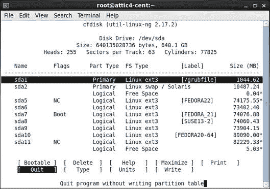

# 创建分区和文件系统

> 原文：[`developer.ibm.com/zh/tutorials/l-lpic1-104-1/`](https://developer.ibm.com/zh/tutorials/l-lpic1-104-1/)

## 概述

在本教程中，学习磁盘分区和 Linux 文件系统相关内容，包括学习如何：

*   使用 `fdisk` 、 `gdisk` 和 `parted` 创建和修改 MBR 和 GPT 分区
*   使用 `mkfs` 命令设置 ext2、ext3、ext4、xfs 和 vfat 文件系统
*   创建和管理交换空间

## 划分磁盘空间

本教程首先将复习块设备和分区，然后进一步介绍 `fdisk` 、 `gdisk` 和 `parted` 命令，这些命令用于在块设备上创建、修改或删除分区。您还将学习 `mkfs` 命令的各种形式（mkfs 表示 *创建文件系统* ）； `mkfs` 命令用于将分区格式化为特定的文件系统类型。

**备注：** 除了 LPI 考试中需要的工具和文件系统之外，您可能还会遇到或需要其他工具和文件系统。在 其他工具和文件系统 中查阅其他一些可用工具的简介。

##### 关于本系列

本教程系列帮助学习 Linux 系统管理任务。也可使用这些教程中的资料来对 [Linux Professional Institute 的 LPIC-1：Linux 服务器专业认证考试](http://www.lpi.org)。

请参阅我们的 [*学习 Linux，101*：LPIC-1 学习路线图](http://www.ibm.com/developerworks/cn/linux/l-lpic1-map/)，查看本系列中每部教程的描述和链接。这个路线图仍在开发中，目前反映的最新内容是在以下日期更新的 4.0 版 LPIC-1 考试目标。2015 年 4 月 15 日。一旦完成这些教程后，我们会将它们添加到路线图中。

本教程可以帮助您针对 Linux Server Professional (LPIC-1) 考试 101 的主题 104 中的目标 104.1 进行应考准备。该目标的权重为 2。

### 前提条件

要从本系列教程中获得最大收获，您应该拥有 Linux 的基本知识和一个正常工作的 Linux 系统，您可以在这个系统上实践本教程中涵盖的命令。有时一个程序的不同版本会以不同方式格式化输出，所以您的结果可能并不总是与此处所示的清单和图像相同。

您还应该熟悉我们的教程 “[学习 Linux 101：硬盘布局](http://www.ibm.com/developerworks/cn/linux/l-lpic1-102-1/index.html) ” 中的资料。

本教程中的示例来自一些不同的系统和 Linux 发行版。一些系统使用相对较小的 16GB USB 闪存驱动器作为重新格式化整个磁盘的轻松方式，且不会严重损失数据。您在其他 Linux 系统上的结果可能有所不同。您的硬件也会附加不同的磁盘，所以这里的示例仅用于演示。在每个清单中的第一个命令上（如果我们使用不同的发行版来演示，则是在多个命令上），我们以注释的方式表明了实际使用的 Linux 发行版。

## 块设备和分区

我们的教程 “[学习 Linux 101：硬盘布局](http://www.ibm.com/developerworks/cn/linux/l-lpic1-102-1/index.html) ” 介绍了硬盘驱动器布局、分区，以及使用 `fdisk` 和 `gdisk` 命令来查看分区信息的一些基本用法。您学习了主引导记录 (MBR)、分区表、分区，包括主、扩展和逻辑分区。我们还介绍了 GUID 分区表 (GPT)，一种用于解决 MBR 布局中的内在大小限制的新格式。最后还了解到，一个 Linux 文件系统包含以目录形式排列在磁盘上或其他块存储设备上的文件。与许多其他系统一样，Linux 系统上的目录可以包含其他称为 *子目录* 的目录。该教程还探讨了指导您做出分区相关选择的考虑因素。

本教程将重点介绍与使用 MBR 布局执行分区的 `fdisk` 命令和使用 GPT 布局执行分区的 `gdisk` 命令相关的 LPI 需求。

### 块设备

*块设备* 是一个表示任何可格式化为固定大小的块的存储设备的抽象层；各个块可与其他块地址独立地存取。这种存取通常称为 *随机存取* 。

可随机存取的固定大小块的抽象层允许程序使用这些块设备，而不必担忧底层设备是硬盘驱动器、软盘、CD、固态硬盘、网络驱动器还是某种虚拟设备，比如内存型文件系统。

块设备的示例包括您的系统上的第一个 IDE 或 SATA 硬盘驱动器（/dev/sda 或 /dev/hda）或第二个 SCSI、IDE 或 USB 驱动器 (/dev/sdb)。可使用 `ls -l` 命令显示 /dev 条目。每个输出行上的第一个字符是 **b** ，表示 **块** 设备，比如软盘、CD 驱动器、IDE 硬盘驱动器或 SCSI 硬盘驱动器； **c** 表示 **字符** 设备，比如终端 (tty) 或空 (null) 设备。请参见 Linux 块和字符设备 中的示例。

##### Linux 块和字符设备

```
[ian@attic-f21 resent]$ ls -l /dev/null /dev/sd[ab] /dev/sr0 /dev/tty0  #Fedora 21
crw-rw-rw-. 1 root root   1,  3 Jul 27 20:38 /dev/null
brw-rw----. 1 root disk   8,  0 Jul 30 07:46 /dev/sda
brw-rw----. 1 root disk   8, 16 Jul 30 07:46 /dev/sdb
brw-rw----+ 1 root cdrom 11,  0 Jul 27 20:38 /dev/sr0
crw--w----. 1 root tty    4,  0 Jul 27 20:38 /dev/tty0 
```

### 分区

对于一些块设备，比如软盘和 CD 或 DVD 光盘，通常会将完整的介质用作单个文件系统。但是，对于大型硬盘驱动器，甚至对于 USB 闪存盘，将可用空间划分或分区为多个不同的分区更常见一些。

分区可具有不同的大小，不同的分区之上可包含不同的文件系统，所以一个磁盘可用于许多用途，包括在多个操作系统之间共享它。例如，我使用的测试系统包含多个不同的 Linux 发行版，有时还包含一个 Windows® 系统，它们共享一个或两个硬盘驱动器。

回顾一下教程 “[学习 Linux，101：硬盘布局](http://www.ibm.com/developerworks/cn/linux/l-lpic1-102-1/index.html) ”，硬盘驱动器有一种使用柱面、磁头和扇区来定义的几何结构。尽管现代驱动器使用了逻辑块寻址 (LBA)，它呈现出几乎毫无关联的几何结构，但用于 MBR 分区用途的基础分配单元通常仍是柱面。

## 显示分区信息

分区信息存储在磁盘上的分区表上。该表列出了每个分区的起点和终点的信息、它的类型信息，以及它是否标记为可引导。要创建和删除分区，可以使用一个专为该工作而设计的程序来编辑分区表。对于 LPI 考试，您需要了解 `fdisk` 、 `gdisk` 和 `parted` 分区，所以这里将介绍这些程序，但您也可以使用其他一些工具。本教程最后会提到一些工具。

### 使用 fdisk 显示 MBR 分区信息

带 `-l` 选项的 `fdisk` 命令用于列出分区。如果您希望查看一个特定驱动器上的分区，可以添加一个设备名称，比如 /dev/sda。请记住分区工具需要根访问权限。 使用 fdisk 列出 MBR 分区 显示了我的两个系统的主硬盘驱动器上的分区。

##### 使用 fdisk 列出 MBR 分区

```
ian@Z61t-u14:~$ sudo fdisk -l /dev/sda # Ubuntu 14

Disk /dev/sda: 500.1 GB, 500107862016 bytes
255 heads, 63 sectors/track, 60801 cylinders, total 976773168 sectors
Units = sectors of 1 * 512 = 512 bytes
Sector size (logical/physical): 512 bytes / 512 bytes
I/O size (minimum/optimal): 512 bytes / 512 bytes
Disk identifier: 0xed1f86f7

   Device Boot      Start         End      Blocks   Id  System
/dev/sda1   *          63   185915519    92957728+   7  HPFS/NTFS/exFAT
/dev/sda2       185915520   195365519     4725000   12  Compaq diagnostics
/dev/sda3       195366910   976773119   390703105    5  Extended
/dev/sda5       195366912   293021695    48827392   83  Linux
/dev/sda6       293023744   312553471     9764864   82  Linux swap / Solaris
/dev/sda7       312555520   333035519    10240000   83  Linux

[root@atticf20 ~]# fdisk -l /dev/sda # Fedora 22
Disk /dev/sda: 596.2 GiB, 640135028736 bytes, 1250263728 sectors
Units: sectors of 1 * 512 = 512 bytes
Sector size (logical/physical): 512 bytes / 512 bytes
I/O size (minimum/optimal): 512 bytes / 512 bytes
Disklabel type: dos
Disk identifier: 0x00064a1a

Device     Boot      Start        End    Sectors   Size Id Type
/dev/sda1               63    2040254    2040192 996.2M 83 Linux
/dev/sda2          2040255   22523129   20482875   9.8G 82 Linux swap / Solaris
/dev/sda4         22523191 1250258624 1227735434 585.4G  5 Extended
/dev/sda5         22523193  167397299  144874107  69.1G 83 Linux
/dev/sda6        167397363  310761359  143363997  68.4G 83 Linux
/dev/sda7  *     310761423  455442749  144681327    69G 83 Linux
/dev/sda8        455442813  600092009  144649197    69G 83 Linux
/dev/sda9        600092073  744436034  144343962  68.8G 83 Linux
/dev/sda10       744436098  918439935  174003838    83G 83 Linux
/dev/sda11       918441984 1079044095  160602112  76.6G 83 Linux
/dev/sda12      1079053983 1250258624  171204642  81.7G 83 Linux 
```

**备注：**

1.  标头信息显示了磁盘大小和几何结构。使用 LBA 的最大磁盘拥有每个柱面 255 个磁头和每个磁道 63 个扇区，总计 16065 个扇区或每个柱面 8225280 个字节。
2.  在第二个示例中，一个逻辑分区 (/dev/sda7) 被标记为 *可引导* （或 *活动* ）。该标志通常使标准 DOS PC 主引导记录能够引导该分区。但是，加载程序只能引导主分区。此标志对于 LILO 或 GRUB 引导加载程序没有意义。两个示例现在都使用 GRUB2 作为引导加载程序，而且 /dev/sda7 被标记为可引导的事实可能是我过去使用这个驱动器的一个意外结果。
3.  Start 和 End 列显示了每个分区的开始和结束柱面。这些柱面不得重叠，一般都是连续的，没有其他空间介于中间。
4.  Blocks 列显示分区中的 1K（1024 字节）块数。对于编写本教程时使用的大部分磁盘，扇区大小都为 512 字节，所以一个分区中的最大块数是柱面数 (End + 1 – Start) 与每个柱面的扇区数的乘积的一半。末尾的 + 符号表示不是该分区中的所有扇区都被使用。一些磁盘现在可使用更大的扇区来格式化。
5.  Id 字段表示该分区的目标用途。类型 82 是一个 Linux 交换分区，类型 83 是一个 Linux 数据分区。定义了大约 100 个不同的分区类型。第二个磁盘在多个操作系统之间共享，包括 Windows/XP，因此存在 Windows NTFS（可能还有 FAT32）分区。

### 使用 gdisk 显示 GPT 分区信息

像用于 MBR 格式磁盘的 `fdisk` 命令一样，带 `-l` 选项的 `gdisk` 用于列出 GPT 格式磁盘的分区。如果希望查看一个特定驱动器上的分区，可以添加一个设备名称，比如 /dev/sda。和 `fdisk` 一样， `gdisk` 也需要根访问权限。 使用 gdisk 列出 GPT 分区 显示了包含我的许多系统的 GPT 格式硬盘驱动器的分区，其中该分区占据了几乎一半的可用磁盘。

##### 使用 gdisk 列出 GPT 分区

```
[root@attic-f21 ~]# # Fedora 21
[root@attic-f21 ~]# gdisk -l /dev/sdc
GPT fdisk (gdisk) version 1.0.0

Partition table scan:
  MBR: protective
  BSD: not present
  APM: not present
  GPT: present

Found valid GPT with protective MBR; using GPT.
Disk /dev/sdc: 1953525168 sectors, 931.5 GiB
Logical sector size: 512 bytes
Disk identifier (GUID): E5D8C34A-33BF-49EA-8800-AE195E292F1D
Partition table holds up to 128 entries
First usable sector is 34, last usable sector is 1953525134
Partitions will be aligned on 2048-sector boundaries
Total free space is 1004111213 sectors (478.8 GiB)

Number  Start (sector)    End (sector)  Size       Code  Name
   1            2048       949415935   452.7 GiB   0700 
```

您可能注意到有一个保护性 MBR。这使无法识别 GPT 格式的程序能够将该磁盘视为好像整个磁盘都被单个分区占用。目前的 `fdisk` 版本能够识别 GPT 格式，还将显示 GPT 格式磁盘上的分区。

### 使用 parted 显示分区信息

`parted` 命令是一个 enquiry 编辑器，将同时适用于 MBR 和 GPT 格式磁盘。 使用 parted 列出 MBR 和 GPT 分区 显示了来自 使用 fdisk 列出 MBR 分区 的第二个磁盘和来自 使用 gdisk 列出 GPT 分区 的磁盘。

##### 使用 parted 列出 MBR 和 GPT 分区

```
[root@attic-f21 ~]# # Fedora 21
[root@attic-f21 ~]# parted /dev/sda p
Model: ATA WDC WD6401AALS-0 (scsi)
Disk /dev/sda: 640GB
Sector size (logical/physical): 512B/512B
Partition Table   : msdos
Disk Flags:

Number  Start   End     Size    Type      File system     Flags
 1      32.3kB  1045MB  1045MB  primary   ext3
 2      1045MB  11.5GB  10.5GB  primary   linux-swap(v1)
 4      11.5GB  640GB   629GB   extended
 5      11.5GB  85.7GB  74.2GB  logical   ext4
 6      85.7GB  159GB   73.4GB  logical   ext4
 7      159GB   233GB   74.1GB  logical   ext4            boot
 8      233GB   307GB   74.1GB  logical   ext3
 9      307GB   381GB   73.9GB  logical   ext3
10      381GB   470GB   89.1GB  logical   ext4
11      470GB   552GB   82.2GB  logical   ext3
12      552GB   640GB   87.7GB  logical   ext4

[root@attic-f21 ~]# parted /dev/sdc p
Model: ATA WDC WD1003FZEX-0 (scsi)
Disk /dev/sdc: 1000GB
Sector size (logical/physical): 512B/4096B
Partition Table   : gpt
Disk Flags:

Number  Start   End    Size   File system  Name  Flags
 1      1049kB  486GB  486GB  ext4               msftdata 
```

请注意两个磁盘上不同的物理扇区大小。

## 对一个磁盘进行分区

您已看到如何使用 `fdisk` 、 `gdisk` 和 `parted` 命令显示分区信息。这些命令还提供了一个菜单驱动的环境来编辑分区表，以便创建或删除分区。

### 警告

开始修改分区之前，需要记住一些重要的事项。如果没有遵循这些准则，您可能 **丢失现有的数据** 。

1.  **开始之前备份重要的数据** ，像任何可能导致数据丢失的操作一样。
2.  **不要更改正在使用的分区** 。计划您的操作并小心执行它们。从 CD、DVD 或 USB 引导一个活动的发行版，这是确保没有硬盘驱动器分区正在使用的一个不错方法。
3.  **了解您的工具** 。 `fdisk` 命令在您告诉它之前不会将任何更改提交到磁盘。其他工具（包括 `parted` ）可能不断提交更改。
4.  **如果犯错，则停止操作** 。分区工具会写入分区表。除非您使用的工具还包含移动、调整、格式化或将数据写入磁盘的数据区域的能力，否则分区工具不会接触您的数据。如果您犯了一个错误，请尽快停止操作并寻求帮助。您可能仍然能够还原以前的分区表定义，从而恢复您的分区和数据。

## 使用 fdisk 分区 MBR 磁盘

如果需要更改在正常使用的分区，您可能希望从一个活动 CD 或 USB 闪存盘来操作。对于我们使用 `fdisk` 添加分区的第一个示例，我将使用 Knoppix 7.4.2 活动 DVD。

要在交互式模式下启动 `fdisk` ，可以提供一个磁盘的名称（比如 /dev/sda 或 /dev/sdb）作为参数。您需要具有根用户权限，并会看到类似 启动交互式 fdisk 的输出。

##### 启动交互式 fdisk

```
knoppix@Microknoppix:~$ su -
root@Microknoppix:~# fdisk /dev/sda

Command (m for help): 
```

对于拥有超过 1024 个柱面的磁盘，旧的 `fdisk` 版本会提供警告。如果您的 BIOS 非常老，不支持从超过 1024 个柱面的磁盘进行引导，那么这个版本可能适合您，但如今的大部分系统都不会受此限制影响，而且 `fdisk` 的现代版本不再显示该警告。您可能还会发现您的版本有一个 `-c` 选项，用于关闭 DOS 兼容性模式。一般情况下会推荐这么做，这样还会禁止一些警告。

可以键入 `m` 来显示可用的单字母命令列表，如 fdisk 中的帮助 所示。

##### fdisk 中的帮助

```
Command (m for help): m
Command action
   a   toggle a bootable flag
   b   edit bsd disklabel
   c   toggle the dos compatibility flag
   d   delete a partition
   l   list known partition types
   m   print this menu
   n   add a new partition
   o   create a new empty DOS partition table
   p   print the partition table
   q   quit without saving changes
   s   create a new empty Sun disklabel
   t   change a partition's system id
   u   change display/entry units
   v   verify the partition table
   w   write table to disk and exit
   x   extra functionality (experts only)

Command (m for help): 
```

可以使用 `p` 命令显示此磁盘上的现有分区。 显示现有分区表 显示了输出。

##### 显示现有分区表

```
Command (m for help): p

Disk /dev/sda: 640.1 GB, 640135028736 bytes
255 heads, 63 sectors/track, 77825 cylinders, total 1250263728 sectors
Units = sectors of 1 * 512 = 512 bytes
Sector size (logical/physical): 512 bytes / 512 bytes
I/O size (minimum/optimal): 512 bytes / 512 bytes
Disk identifier: 0x00064a1a

   Device Boot      Start         End      Blocks   Id  System
/dev/sda1              63     2040254     1020096   83  Linux
/dev/sda2         2040255    22523129    10241437+  82  Linux swap / Solaris
/dev/sda4        22523191  1250258624   613867717    5  Extended
/dev/sda5        22523193   167397299    72437053+  83  Linux
/dev/sda6       167397363   310761359    71681998+  83  Linux
/dev/sda7   *   310761423   455442749    72340663+  83  Linux
/dev/sda8       455442813   600092009    72324598+  83  Linux
/dev/sda9       600092073   744436034    72171981   83  Linux
/dev/sda10      744436098   918439935    87001919   83  Linux
/dev/sda11      918441984  1079044095    80301056   83  Linux
/dev/sda12     1079053983  1250258624    85602321   83  Linux

Command (m for help): 
```

这个特定的磁盘是一个 640GB 磁盘，包含两个主分区 /dev/sda1 和 /dev/sda2，一个扩展分区 /dev/sda4（其中包含 8 个逻辑分区）。有一个 Linux 交换分区。

### 使用 fdisk 添加分区

我们现在使用磁盘末尾非常少量的空闲空间的一部分来添加一个主分区，我们最终将它格式化为 FAT32。

首先使用 `n` 命令创建一个新分区；请参见 创建我们的第一个分区 。

##### 创建我们的第一个分区

```
Command (m for help): n
Partition type:
   p   primary (2 primary, 1 extended, 1 free)
   l   logical (numbered from 5)
Select (default p): p
Selected partition 3
First sector (22523130-1250263727, default 22523130): 1250258625
Last sector, +sectors or +size{K,M,G} (1250258625-1250263727, default 1250263727):
Using default value 1250263727

Command (m for help): p

Disk /dev/sda: 640.1 GB, 640135028736 bytes
255 heads, 63 sectors/track, 77825 cylinders, total 1250263728 sectors
Units = sectors of 1 * 512 = 512 bytes
Sector size (logical/physical): 512 bytes / 512 bytes
I/O size (minimum/optimal): 512 bytes / 512 bytes
Disk identifier: 0x00064a1a

   Device Boot      Start         End      Blocks   Id  System
/dev/sda1              63     2040254     1020096   83  Linux
/dev/sda2         2040255    22523129    10241437+  82  Linux swap / Solaris
/dev/sda3      1250258625  1250263727        2551+  83  Linux
/dev/sda4        22523191  1250258624   613867717    5  Extended
/dev/sda5        22523193   167397299    72437053+  83  Linux
/dev/sda6       167397363   310761359    71681998+  83  Linux
/dev/sda7   *   310761423   455442749    72340663+  83  Linux
/dev/sda8       455442813   600092009    72324598+  83  Linux
/dev/sda9       600092073   744436034    72171981   83  Linux
/dev/sda10      744436098   918439935    87001919   83  Linux
/dev/sda11      918441984  1079044095    80301056   83  Linux
/dev/sda12     1079053983  1250258624    85602321   83  Linux

Partition table entries are not in disk order

Command (m for help): 
```

主分区必须使用 1 到 4 来编号，所以选择 `p` 作为分区类型后，我们唯一的分区编号选择使用是 3，因为该磁盘已使用了 1、2 和 4。我们指定了 1250258625 作为开始扇区，因为它是为 /dev/sda12 使用的最后一个扇区之后的扇区。我们使用磁盘上的最后一个扇作为结束扇区的默认设置。新的 /dev/sda3 分区有 2551 个 1K 块，所以它确实非常小。

一个不错的主意是顺序分配分区编号；如果没有这么做，一些工具会抗议， `fdisk` 会提醒我们分区表条目不再与磁盘顺序相同。

另请注意，我们的新分区分配了一个类型 83，表示 Linux 数据分区。可以使用它向操作系统表明该分区的目标用途。最终的用途应与它相匹配，但在目前，我们甚至没有格式化该分区，更不用说在该分区上放入数据了。我们稍后将更改分区类型。

您可能已经注意到，在我们输入 `n` 子命令来创建新分区时，唯一的选择是表示逻辑分区的 ‘l’ 和表示主分区的 ‘p’。您只会看到可以创建的可能分区类型的选项。如果驱动器还没有扩展分区，那么您会看到表示扩展分区的 ‘e’。另请注意，我们的扩展分区 (/dev/sda4) 为类型 5。

### 使用 fdisk 更改分区类型

离开 `fdisk` 之前，我们将更改新分区的分区类型。为此，我们使用 `t` 子命令来设置分区类型。我们将 /dev/sda3 设置为类型 b (W95 FAT32)。如果希望看到受支持类型的完整列表，可以输入 `L` ，就像在 更改分区类型 中看到的一样。

##### 更改分区类型

```
Command (m for help):  t
Partition number (1-12):  3
Hex code (type L to list codes):  b
Changed system type of partition 3 to b (W95 FAT32)

Command (m for help): 
```

### 保存我们的分区表

目前为止，我们仅对一个分区表执行了内存中编辑。我们可以使用 `q` 命令来退出而不保存更改。如果某个结果不是您想要的，可以使用 `d` 命令删除一个或多个分区，以便重新定义它们。如果对设置满意，可以使用 `v` 命令验证您的设置，然后使用 `w` 命令写入新分区表和 `fdisk` 的退出点。参见 保存分区表 。如果再次运行 `fdisk -l` ，您会看到 Linux 现在能够识别这些新分区。与一些操作系统中不同，并不总是需要重新引导才能让更改生效。举例而言，如果因为删除了原始的 /dev/hda2 让 /dev/hda3 变成了 /dev/hda2，可能需要进行重新引导。如果需要重新引导， `fdisk` 会告诉您执行该操作。

##### 保存分区表

```
Command (m for help): v
Remaining 12367 unallocated 512-byte sectors

Command (m for help): w
The partition table has been altered!

Calling ioctl() to re-read partition table.

WARNING: If you have created or modified any DOS 6.x
partitions, please see the fdisk manual page for additional
information.
Syncing disks. 
```

### fdisk 的更多信息

LILO 和 GRUB 都没有使用可引导标志。如果它们中的一个已安装在 MBR 中，那么它可以引导任何分区，无论是主分区还是逻辑分区。

如果需要的话，还可以使用 `fdisk` 修复分区表中的分区顺序。这通常会更改分区编号，所以您可能需要执行其他操作来将系统还原为正常工作的系统。要执行此更改，可以使用 `f` 子命令切换到导出模式，然后使用 `f` 子命令修复分区顺序，如 修复分区表顺序 中所示。如果只想查看新分区顺序而不更改它，可以使用 `q` 子命令退出，就像我们在这个示例中所做的一样，而不将更新的分区表写入磁盘。

##### 修复分区表顺序

```
root@Microknoppix:~# fdisk /dev/sda

Command (m for help): p

Disk /dev/sda: 640.1 GB, 640135028736 bytes
255 heads, 63 sectors/track, 77825 cylinders, total 1250263728 sectors
Units = sectors of 1 * 512 = 512 bytes
Sector size (logical/physical): 512 bytes / 512 bytes
I/O size (minimum/optimal): 512 bytes / 512 bytes
Disk identifier: 0x00064a1a

   Device Boot      Start         End      Blocks   Id  System
/dev/sda1              63     2040254     1020096   83  Linux
/dev/sda2         2040255    22523129    10241437+  82  Linux swap / Solaris
/dev/sda3      1250258625  1250263727        2551+   b  W95 FAT32
/dev/sda4        22523191  1250258624   613867717    5  Extended
/dev/sda5        22523193   167397299    72437053+  83  Linux
/dev/sda6       167397363   310761359    71681998+  83  Linux
/dev/sda7   *   310761423   455442749    72340663+  83  Linux
/dev/sda8       455442813   600092009    72324598+  83  Linux
/dev/sda9       600092073   744436034    72171981   83  Linux
/dev/sda10      744436098   918439935    87001919   83  Linux
/dev/sda11      918441984  1079044095    80301056   83  Linux
/dev/sda12     1079053983  1250258624    85602321   83  Linux

Partition table entries are not in disk order

Command (m for help): x

Expert command (m for help): m
Command action
   b   move beginning of data in a partition
   c   change number of cylinders
   d   print the raw data in the partition table
   e   list extended partitions
   f   fix partition order
   g   create an IRIX (SGI) partition table
   h   change number of heads
   i   change the disk identifier
   m   print this menu
   p   print the partition table
   q   quit without saving changes
   r   return to main menu
   s   change number of sectors/track
   v   verify the partition table
   w   write table to disk and exit

Expert command (m for help): f
Done.

Expert command (m for help): p

Disk /dev/sda: 255 heads, 63 sectors, 77825 cylinders

Nr AF  Hd Sec  Cyl  Hd Sec  Cyl     Start      Size ID
 1 00   1   1    0 254  63  126         63    2040192 83
 2 00   0   1  127 254  63 1023    2040255   20482875 82
 3 00 254  63 1023 254  63 1023   22523191 1227735434 05
 4 00   0   1    1  80  63    1 1250258625       5103 0b
 5 00 254  63 1023 254  63 1023          2  144874107 83
 6 00 254  63 1023 254  63 1023         63  143363997 83
 7 80 254  63 1023 254  63 1023         63  144681327 83
 8 00 254  63 1023 254  63 1023         63  144649197 83
 9 00 254  63 1023 254  63 1023         63  144343962 83
10 00 254  63 1023 254  63 1023         63  174003838 83
11 00 254  63 1023 254  63 1023       2048  160602112 83
12 00 254  63 1023 254  63 1023         63  171204642 83

Expert command (m for help): q 
```

从导出命令的菜单可以看到，许多命令不大可能被使用，只有在知道它们的用途后才会使用它们。另请注意，分区的打印输出在导出模式下具有不同的格式。

## 使用 gdisk 分区 GPT 磁盘

我们现在来查看如何使用 `gdisk` 命令将分区添加到 GPT 格式磁盘。我们将添加一个 4GB 交换分区和一个 40GB 数据分区。本节中的示例使用了一个 CentOS 6 系统。

**警告：** 如果在 MBR 格式磁盘上使用 `gdisk` ，则会将磁盘转换为 GPT 格式。这可能销毁磁盘上的数据，所以在尝试此命令之前，请确保做好备份。

在交互式模式下启动 gdisk 显示 `gdisk` 首先使用我们上面使用的 MBR 磁盘 (/dev/sda)，然后使用一个 GPT 格式磁盘 (/dev/sdc)。我们将使用 /dev/sdc 作为我们的两个新分区。

##### 在交互式模式下启动 gdisk

```
[root@attic4-cent ~]# gdisk /dev/sda
GPT fdisk (gdisk) version 0.8.10

Partition table scan:
  MBR: MBR only
  BSD: not present
  APM: not present
  GPT: not present

***************************************************************
Found invalid GPT and valid MBR; converting MBR to GPT format
in memory. THIS OPERATION IS POTENTIALLY DESTRUCTIVE! Exit by
typing 'q' if you don't want to convert your MBR partitions
to GPT format!
***************************************************************

Warning! Secondary partition table overlaps the last partition by
33 blocks!
You will need to delete this partition or resize it in another utility.

Command (? for help): q

[root@attic4-cent ~]# gdisk /dev/sdc
GPT fdisk (gdisk) version 0.8.10

Partition table scan:
  MBR: protective
  BSD: not present
  APM: not present
  GPT: present

Found valid GPT with protective MBR; using GPT.

Command (? for help): 
```

与 `fdisk` 一样，您可以获取帮助。可使用 `?` 子命令获得帮助，如 获取启动 gdisk 的帮助 中所示。

##### 获取启动 gdisk 的帮助

```
Command (? for help): ?
b    back up GPT data to a file
c    change a partition's name
d    delete a partition
i    show detailed information on a partition
l    list known partition types
n    add a new partition
o    create a new empty GUID partition table (GPT)
p    print the partition table
q    quit without saving changes
r    recovery and transformation options (experts only)
s    sort partitions
t    change a partition's type code
v    verify disk
w    write table to disk and exit
x    extra functionality (experts only)
?    print this menu

Command (? for help): 
```

使用 gdisk 添加分区 展示了如何添加我们的两个分区。最初，这两个分区都默认为 Linux 数据分区（类型为 8300）。您可以注意到，我们使用了 `+4G` 和 `+40G` 来指定分区的最后一个扇区。

##### 使用 gdisk 添加分区

```
Command (? for help): n
Partition number (2-128, default 2):
First sector (34-1953525134, default = 949415936) or {+-}size{KMGTP}:
Last sector (949415936-1953525134, default = 1953525134) or {+-}size{KMGTP}: +4G
Current type is 'Linux filesystem'
Hex code or GUID (L to show codes, Enter = 8300):
Changed type of partition to 'Linux filesystem'

Command (? for help): n
Partition number (3-128, default 3):
First sector (34-1953525134, default = 957804544) or {+-}size{KMGTP}:
Last sector (957804544-1953525134, default = 1953525134) or {+-}size{KMGTP}: +40G
Current type is 'Linux filesystem'
Hex code or GUID (L to show codes, Enter = 8300):
Changed type of partition to 'Linux filesystem'

Command (? for help): 
```

现在我们将 /dev/sdc2 的分区类型更改为 Linux 交换分区。 使用 gdisk 更改分区类型 显示了可用的类型和如何更改 /dev/sdc2。我们还给出了结果分区表，包括已在磁盘上的第一个分区。

##### 使用 gdisk 更改分区类型

```
Command (? for help): l
0700 Microsoft basic data  0c01 Microsoft reserved    2700 Windows RE
3000 ONIE boot             3001 ONIE config           4100 PowerPC PReP boot
4200 Windows LDM data      4201 Windows LDM metadata  7501 IBM GPFS
7f00 ChromeOS kernel       7f01 ChromeOS root         7f02 ChromeOS reserved
8200 Linux swap            8300 Linux filesystem      8301 Linux reserved
8302 Linux /home           8400 Intel Rapid Start     8e00 Linux LVM
a500 FreeBSD disklabel     a501 FreeBSD boot          a502 FreeBSD swap
a503 FreeBSD UFS           a504 FreeBSD ZFS           a505 FreeBSD Vinum/RAID
a580 Midnight BSD data     a581 Midnight BSD boot     a582 Midnight BSD swap
a583 Midnight BSD UFS      a584 Midnight BSD ZFS      a585 Midnight BSD Vinum
a800 Apple UFS             a901 NetBSD swap           a902 NetBSD FFS
a903 NetBSD LFS            a904 NetBSD concatenated   a905 NetBSD encrypted
a906 NetBSD RAID           ab00 Apple boot            af00 Apple HFS/HFS+
af01 Apple RAID            af02 Apple RAID offline    af03 Apple label
af04 AppleTV recovery      af05 Apple Core Storage    be00 Solaris boot
bf00 Solaris root          bf01 Solaris /usr & Mac Z  bf02 Solaris swap
bf03 Solaris backup        bf04 Solaris /var          bf05 Solaris /home
bf06 Solaris alternate se  bf07 Solaris Reserved 1    bf08 Solaris Reserved 2
bf09 Solaris Reserved 3    bf0a Solaris Reserved 4    bf0b Solaris Reserved 5
c001 HP-UX data            c002 HP-UX service         ea00 Freedesktop $BOOT
eb00 Haiku BFS             ed00 Sony system partitio  ed01 Lenovo system partit
Press the <Enter> key to see more codes:
ef00 EFI System            ef01 MBR partition scheme  ef02 BIOS boot partition
fb00 VMWare VMFS           fb01 VMWare reserved       fc00 VMWare kcore crash p
fd00 Linux RAID

Command (? for help): t
Partition number (1-3): 2
Current type is 'Linux filesystem'
Hex code or GUID (L to show codes, Enter = 8300): 8200
Changed type of partition to 'Linux swap'

Command (? for help): p
Disk /dev/sdc: 1953525168 sectors, 931.5 GiB
Logical sector size: 512 bytes
Disk identifier (GUID): E5D8C34A-33BF-49EA-8800-AE195E292F1D
Partition table holds up to 128 entries
First usable sector is 34, last usable sector is 1953525134
Partitions will be aligned on 2048-sector boundaries
Total free space is 911836525 sectors (434.8 GiB)

Number  Start (sector)    End (sector)  Size       Code  Name
   1            2048       949415935   452.7 GiB   0700
   2       949415936       957804543   4.0 GiB     8200  Linux swap
   3       957804544      1041690623   40.0 GiB    8300  Linux filesystem

Command (? for help): i 
```

请注意，/dev/sdc1 具有分区类型 0700，表示 Microsoft 基本数据。该分区被实际格式化为 Linux ext4 文件系统。一些分区类型（比如 Microsoft 基本数据）对一些操作系统很重要。其他类型（像这个例子中一样）对操作系统只有提示作用。

我们的最后一项任务是验证分区表并写入它。我们在 使用 gdisk 验证和写入分区表 中给出了使用的命令。

##### 使用 gdisk 验证和写入分区表

```
Command (? for help): v

No problems found. 911836525 free sectors (434.8 GiB) available in 2
segments, the largest of which is 911834511 (434.8 GiB) in size.

Command (? for help): w

Final checks complete. About to write GPT data. THIS WILL OVERWRITE EXISTING
PARTITIONS!!

Do you want to proceed? (Y/N): y
OK; writing new GUID partition table (GPT) to /dev/sdc.
Warning: The kernel is still using the old partition table.
The new table will be used at the next reboot.
The operation has completed successfully. 
```

最后一条有关需要重新引导的警告是因为我们挂载了 /dev/sdc1。我们之前说过，在磁盘没有挂载文件系统时，通常最好对它进行重新分区。

## 使用 parted 进行分区

目前为止，您可能对还可以在交互式模式下使用 `parted` 并不感到奇怪。您可以将它用于 MBR 或 GPT 格式磁盘。 `parted` 与 `fdisk` 或 `gdisk` 之间的一个重大区别是， `parted` 立即执行它的子命令并不断更新分区表。

启动 `parted` 来更新 /dev/sdc 展示了如何启动 `parted` 来更新 /dev/sdc。您可以获得一个命令列表和各个命令的帮助。我们演示了 `mklabel` 命令的个别帮助。可以缩短命令，将其缩写为最简短的唯一缩写形式，所以我们可以使用 `h mklabel` 代替 `help mklabel` 。我们还打印了分区表，您可以确认 /dev/sdc1 是唯一的格式化分区，而且它被格式化为 ext4。

##### 启动 `parted` 来更新 /dev/sdc

```
[root@attic4-cent ~]# parted /dev/sdc
GNU Parted 2.1
Using /dev/sdc
Welcome to GNU Parted! Type 'help' to view a list of commands.
(parted) help
  align-check TYPE N                        check partition N for TYPE(min|opt)
        alignment
  check NUMBER                             do a simple check on the file system
  cp [FROM-DEVICE] FROM-NUMBER TO-NUMBER   copy file system to another partition
  help [COMMAND]                           print general help, or help on
        COMMAND
  mklabel,mktable LABEL-TYPE               create a new disklabel (partition
        table)
  mkfs NUMBER FS-TYPE                      make a FS-TYPE file system on
        partition NUMBER
  mkpart PART-TYPE [FS-TYPE] START END     make a partition
  mkpartfs PART-TYPE FS-TYPE START END     make a partition with a file system
  move NUMBER START END                    move partition NUMBER
  name NUMBER NAME                         name partition NUMBER as NAME
  print [devices|free|list,all|NUMBER]     display the partition table,
        available devices, free space, all found partitions, or a particular
        partition
  quit                                     exit program
  rescue START END                         rescue a lost partition near START
        and END
  resize NUMBER START END                  resize partition NUMBER and its file
        system
  rm NUMBER                                delete partition NUMBER
  select DEVICE                            choose the device to edit
  set NUMBER FLAG STATE                    change the FLAG on partition NUMBER
  toggle [NUMBER [FLAG]]                   toggle the state of FLAG on partition
        NUMBER
  unit UNIT                                set the default unit to UNIT
  version                                  display the version number and
        copyright information of GNU Parted
(parted) help mklabel
  mklabel,mktable LABEL-TYPE               create a new disklabel (partition
        table)

    LABEL-TYPE is one of: aix, amiga, bsd, dvh, gpt, mac, msdos, pc98, sun,
        loop
(parted) p
Model: ATA WDC WD1003FZEX-0 (scsi)
Disk /dev/sdc: 1000GB
Sector size (logical/physical): 512B/4096B
Partition Table : gpt

Number  Start   End    Size    File system  Name              Flags
 1      1049kB  486GB  486GB   ext4
 2      486GB   490GB  4295MB               Linux swap
 3      490GB   533GB  42.9GB               Linux filesystem

(parted) 
```

请注意， `parted` 使用了 10 的倍数而不是 2 的倍数来表示 MB、GB 等，所以 `gdisk` 添加的 40GB 分区现在使用 `parted` 显示为 42.9 GB。

我们现在将使用 `mkpart` 子命令添加另外两个 Linux 文件系统分区。您可以使用 `mkpartfs` 命令来创建分区并将其格式化，但 `parted` 推荐使用我们稍后将遇到的更可靠的分区格式化工具，所以我们将使用 `mkpart` ，如 使用 `mkpart` 添加两个 Linux 文件系统分区 中所示。

##### 使用 `mkpart` 添加两个 Linux 文件系统分区

```
(parted) mkpart
Partition name?  []? "Linux filesystem"
File system type?  [ext2]? xfs
Start? 533GB
End? 573GB
Partition name?  []? "Linux filesystem"
File system type?  [ext2]?
Start? 573GB
End? 613GB
(parted) p
Model: ATA WDC WD1003FZEX-0 (scsi)
Disk /dev/sdc: 1000GB
Sector size (logical/physical): 512B/4096B
Partition Table : gpt

Number  Start   End    Size    File system  Name              Flags
 1      1049kB  486GB  486GB   ext4
 2      486GB   490GB  4295MB               Linux swap
 3      490GB   533GB  42.9GB               Linux filesystem
 4      533GB   573GB  39.7GB               Linux filesystem
 5      573GB   613GB  40.0GB               Linux filesystem

(parted) 
```

您可能已经注意到， `parted` 向我们询问文件系统类型而不是分区类型编码。我们为一个分区指定了 xfs，让第二个分区使用默认的 ext2。从理论上讲， `parted` 使用目标文件系统类型来确定正确的分区类型。 使用 gdisk 显示 parted 所创建的分区类型 使用 `gdisk` 来显示 `parted` 分配给我们的新分区的类型。

##### 使用 gdisk 显示 parted 所创建的分区类型

```
[root@attic4-cent ~]# gdisk -l /dev/sdc
GPT fdisk (gdisk) version 0.8.10

Partition table scan:
  MBR: protective
  BSD: not present
  APM: not present
  GPT: present

Found valid GPT with protective MBR; using GPT.
Disk /dev/sdc: 1953525168 sectors, 931.5 GiB
Logical sector size: 512 bytes
Disk identifier (GUID): E5D8C34A-33BF-49EA-8800-AE195E292F1D
Partition table holds up to 128 entries
First usable sector is 34, last usable sector is 1953525134
Partitions will be aligned on 2048-sector boundaries
Total free space is 756262253 sectors (360.6 GiB)

Number  Start (sector)    End (sector)  Size       Code  Name
   1            2048       949415935   452.7 GiB   0700
   2       949415936       957804543   4.0 GiB     8200  Linux swap
   3       957804544      1041690623   40.0 GiB    8300  Linux filesystem
   4      1041690624      1119139839   36.9 GiB    0700  Linux filesystem
   5      1119139840      1197264895   37.3 GiB    0700  Linux filesystem 
```

/dev/sdc1 可能是使用 `parted` 或 `gparted` 创建的。

您现在已经了解了向 Linux 工作站添加分区的多种方法。本教程后面将介绍可以添加到工具箱中的其他一些工具。可能影响您的文件系统选择的考虑因素已在教程 “[学习 Linux，101：查找和放置系统文件](http://www.ibm.com/developerworks/library/l-lpic1-104-7/index.html) ” 中介绍。

## 文件系统类型

Linux 支持多种不同的文件系统。每种文件系统都有其优点和缺点，以及它们自己的一组性能特征。文件系统的一个重要属性是日志，它有助于在发生系统崩溃后更快地恢复。一般而言，在选择时，日志文件系统优先于非日志文件系统。您可能还希望考虑您选择的文件系统是否支持 *安全增强 Linux* （或 SELinux）。两种较新的文件系统 ZFS 和 btrfs 都使用了一种称为 Copy on Write（写时复制）的技术来改进数据完整性和解决大型存储需求。以下是应对 LPI 考试您需要知道的文件系统类型的简介。请参见 参考资料 ，获取额外的背景信息。

### ext2 文件系统

ext2 文件系统（也称为 *第二个扩展文件系统* ）被开发用来补充早期 Linux 版本中使用的 Minix 文件系统中的不足之处。多年以来，它被广泛用于 Linux 之上。ext2 中没有日志，它在很大程度上已被 ext3 和最新的 ext4 所取代。

### ext3 文件系统

ext3 文件系统向标准的 ext2 文件系统添加了日志功能，因此是一个非常稳定的文件系统的一次革命性改进。它在大部分条件下都提供了合理的性能，而且仍在不断改进。因为它在成熟的 ext2 文件系统上添加了日志，所以可以将现有的 ext2 文件系统转换为 ext3，甚至可以在需要时再次转换回来。

ext4 文件系统最初是 ext3 的扩展，它通过增加存储限制和提高性能来满足更大的文件系统的需求。为了保留 ext3 的稳定性，2006 年 6 月决定将这些扩展分支到一个新文件系统中，也就是 ext4。ext4 文件系统于 2008 年 12 月发布，包含在 2.6.28 内核中。对 ext3 的一些更改包括：

*   文件系统最大为 1 EB，可包含最大 16 TB 的文件
*   使用盘区来取代块映射，以此作为提高性能的一种途径
*   使用日志校验和提高可靠性
*   因为在检查期间会跳过未分配的块，所以文件系统检查更快。
*   延迟的分配和多块分配器提高了性能并减少了文件碎片。
*   时间戳更改提供了更细的粒度，增加了一个新的创建日期（需要最终更新许多库和实用程序才能完全发挥作用）。一项进一步的时间戳更改解决了将时间戳存储为有符号 32 位整数所导致的 2038 年问题。

### XFS 文件系统

XFS 是一种包含日志功能的文件系统。它拥有可靠的功能并针对可伸缩性进行了优化。XFS 大胆地将传输中的数据缓存在 RAM 中，所以在使用 XFS 时，推荐使用不会中断的电源。

### 交换文件系统

交换空间必须格式化才能用作交换空间，但它一般不会被视为文件系统。

### vfat 文件系统

此文件系统（也称为 *FAT32* ）没有日志功能，缺少完整的 Linux 文件系统实现所需的许多功能。它对在 Windows 与 Linux 系统之间交换数据很有用，因为它可以同时被 Windows 和 Linux 读取。 **不要** 将此文件系统用于 Linux，除非用该文件系统在 Windows 和 Linux 之间共享数据。如果将 Linux 存档文件解压到 vfat 磁盘上，您将失去一些权限，比如执行权限，而且您将失去可能存储在该存档文件中的所有符号链接。

### ReiserFS 文件系统

ReiserFS 是一种基于 B 树的文件系统，它具有非常好的整体性能，尤其对于大量小文件。ReiserFS 还具有良好的扩展性能并具有日志功能。它没有再得到积极开发，不支持 SELinux，在很大程度上已被 Reiser4 取代，而后者的未来并不明朗。

### btrfs 文件系统

btrfs（B 树文件系统）最初由 Oracle 开发，可根据 GPL 许可来获得（参见 参考资料 ）。它是一种用于 Linux 的新的写时复制文件系统，旨在实现高级功能，同时专注于容错、修复和轻松的管理。Btrfs 文件系统代码自 2009 年的 2.6.29 版开始已加入主线内核中。具体地讲，该文件系统旨在高效地处理大型文件，处理贯穿多个设备的文件系统。一些设计目标包括：

*   很大的文件大小（高达 2⁶⁴ 字节）
*   数据和元数据的校验和
*   集成了对多个设备的支持
*   SSD 感知
*   高效的增量备份
*   数据完整性
*   写时复制不会重写数据，所以硬件故障不会让数据处于不一致状态

像大部分新文件系统一样，该系统花了很长时间才获得了足够的稳定性，以供用户向其提交重要的数据，所以它还不是大多数 Linux 发行版的主要文件系统。

ext3 文件系统已发展成熟，被用作许多发行版上的默认文件系统。从 Red Hat Enterprise Linux 6 等发行版开始，ext4 文件系统现在正在取代它成为一些发行版上的默认文件系统。Fedora 17 和 Ubuntu 12.10.ReiserFS 文件系统多年来被用作一些发行版上的默认文件系统，包括 SUSE，但目前未被广泛使用。

## 创建文件系统

Linux 使用 `mkfs` 命令创建文件系统，使用 `mkswap` 命令创建交换空间。 `mkfs` 命令实际上是一些特定于文件系统的命令的前端，比如用于 ext3 的 `mkfs.ext3` ，用于 ext4 的 `mkfs.ext4` 和用于 btrfs 的 `mkfs.btrfs` 。

您的系统上已安装了哪些文件系统支持功能？可以使用 `ls /sbin/mk*` 命令进行查看。一个示例如 文件系统创建命令 中所示。

##### 文件系统创建命令

```
[[ian@attic4-cent ~]$ ls /sbin/mk*
/sbin/mkdosfs     /sbin/mkfs.cramfs   /sbin/mkfs.msdos        /sbin/mksquashfs
/sbin/mkdumprd    /sbin/mkfs.ext2     /sbin/mkfs.vfat         /sbin/mkswap
/sbin/mke2fs      /sbin/mkfs.ext3     /sbin/mkfs.xfs
/sbin/mkfs        /sbin/mkfs.ext4     /sbin/mkhomedir_helper
/sbin/mkfs.btrfs  /sbin/mkfs.ext4dev  /sbin/mkinitrd 
```

您将注意到一些命令的各种形式。例如，您通常会发现文件 mke2fs、mkfs.ext2 和 mkfs.ext3 是同一个文件，而 mkfs.msdos 和 mkfs.vfat 通常是 mkdosfs 的符号链接。引导该系统所需的文件系统通常会使用硬链接为同一个文件提供不同的名称。无法用于 Linux 中的 / 文件系统的文件系统（比如 vfat 或 msdos）可使用符号链接代替。教程 “[学习 Linux，101：创建和更改硬链接和符号链接](http://www.ibm.com/developerworks/cn/linux/l-lpic1-104-6/index.html) ” 将帮助您了解这些不同类型的链接。

所有 `mkfs` 命令都有一些常用的选项。基于 `-type` 选项中指定的文件系统类型，特定于所创建的文件系统类型的选项会传递给合适的创建命令。我们的示例使用了 `mkfs -type` ，但您可以直接使用其他具有相同效果的形式。例如，您可以使用 `mkfs -type ext2` 、 `mk2fs` 或 `mkfs.ext2` 。要查看特定文件系统的手册页，可以使用适当的 `mkfs` 命令作为名称，例如 `man mkfs.ext3` 。下面的输出示例中显示的许多值可通过 `mkfs` 的选项进行控制。

现在我们已创建了所有分区，我们将重新引导 CentOS 系统并使用天来格式化文件系统，而不使用某个更慢的活动 Knoppix DVD。当然，如果您愿意的话，还可以继续使用活动系统。请记住，您需要获得根用户权限来创建文件系统。

### 创建 ext3 文件系统

我们使用 `mkfs` 命令将 /dev/sdc3 分区格式化为 ext3，如 创建 ext3 文件系统 中所示。

##### 创建 ext3 文件系统

```
[root@attic4-cent ~]# mkfs -t ext3 /dev/sdc3
mke2fs 1.41.12 (17-May-2010)
Filesystem label=
OS type: Linux
Block size=4096 (log=2)
Fragment size=4096 (log=2)
Stride=1 blocks, Stripe width=0 blocks
2621440 inodes, 10485760 blocks
524288 blocks (5.00%) reserved for the super user
First data block=0
Maximum filesystem blocks=4294967296
320 block groups
32768 blocks per group, 32768 fragments per group
8192 inodes per group
Superblock backups stored on blocks:
    32768, 98304, 163840, 229376, 294912, 819200, 884736, 1605632, 2654208,
    4096000, 7962624

Writing inode tables: done
Creating journal (32768 blocks): done
Writing superblocks and filesystem accounting information: done

This filesystem will be automatically checked every 32 mounts or
180 days, whichever comes first.  Use tune2fs -c or -i to override. 
```

您可以注意到，ext3 创建了一个日志。如果您希望向现有的 ext2 系统添加日志，可以使用 `tune2fs` 命令和 `-j` 选项。

针对 ext2、ext3 和 ext4 文件系统的一个有用选项是 `-L` 选项和一个名称，它会向分区分配一个标签。在挂载文件系统时可以使用它代替设备名称；它提供了与可能需要在各种控制文件中反映出来的更改的一定水平的隔离。要显示或设置一个现有 ext2、ext3 或 ext3 文件系统的标签，可以使用 `e2label` 命令。标签被限制为最大 16 个字符。

最近的一项改进是使用一个通用唯一标识符或 UUID，而不使用标签。一个 UUID 是一个 128 位标识符，通常显示为 8 个一组的 32 个十六进制数，每组使用 4 个连字符分开。大部分 Linux 文件系统都会在格式化该文件系统时自动生成一个 UUID。可使用 `blkid` 命令（它不需要根权限）（如 使用 blkid 显示 UUID 中所示）来查看我们格式化的分区的 UUID。UUID 比标签很有可能是唯一的，而且对于 USB 驱动器等热插拔设备特别有用。

##### 使用 blkid 显示 UUID

```
[ian@attic4-cent ~]$ blkid /dev/sdc3
/dev/sdc3: UUID="05efd400-c689-4205-a53a-e8b009eb5a55" SEC_TYPE="ext2" TYPE="ext3" 
```

### 创建 ext4 文件系统

现在让我们在新分区 /dev/sdc4 上创建一个 ext4 文件系统。使用 `mkfs` 的 `-L` 选项标记该分区，并使用 `blkid` 命令显示 GUID，就像我们上面对 ext3 分区所做的那样。 创建 ext4 分区 演示了此过程。

##### 创建 ext4 分区

```
[root@attic4-cent ~]# mkfs -t ext4 -L IAN-GPT-EXT4 /dev/sdc4
mke2fs 1.41.12 (17-May-2010)
Filesystem label=IAN-GPT-EXT4
OS type: Linux
Block size=4096 (log=2)
Fragment size=4096 (log=2)
Stride=1 blocks, Stripe width=0 blocks
2424832 inodes, 9681152 blocks
484057 blocks (5.00%) reserved for the super user
First data block=0
Maximum filesystem blocks=4294967296
296 block groups
32768 blocks per group, 32768 fragments per group
8192 inodes per group
Superblock backups stored on blocks:
    32768, 98304, 163840, 229376, 294912, 819200, 884736, 1605632, 2654208,
    4096000, 7962624

Writing inode tables: done
Creating journal (32768 blocks): done
Writing superblocks and filesystem accounting information: done

This filesystem will be automatically checked every 23 mounts or
180 days, whichever comes first.  Use tune2fs -c or -i to override.
[root@attic4-cent ~]# blkid /dev/sdc4
/dev/sdc4: LABEL="IAN-GPT-EXT4" UUID="f69e0b28-beda-4255-ad5a-4d73672ac9e4" TYPE="ext4" 
```

请注意， `mkfs` 输出的第一行确认了创建 ext3 和 ext4 文件系统的工作是由 `mke2fs` 完成的。

要查看可在创建 ext4 分区时指定的所有分区，请参阅 `mkfs.ext4` 的手册页。

### 创建 XFS 文件系统

我们现在使用 XFS 文件系统来格式化 /dev/sdc3，刚才已将该分区格式化为 ext3。如果使用 SELinux（安全增强 Linux）和 XFS，则应使用 `-i` 参数指定比默认的 256 更大的 inode。推荐采用的值为 512。这是因为 256 字节的默认大小对 SELinux XATTR 而言不够用，它需要存储在一个单独的节点中。请注意，如果 XFS 格式化器找到一个已在分区上的识别的文件系统，它会通知您。另请注意，UUID 被重新分配为 XFS 格式。

##### 创建 XFS 文件系统

```
[root@attic4-cent ~]# mkfs -t xfs -i size=512 /dev/sdc3
mkfs.xfs: /dev/sdc3 appears to contain an existing filesystem (ext3).
mkfs.xfs: Use the -f option to force overwrite.
[root@attic4-cent ~]# mkfs -t xfs -i size=512 -f /dev/sdc3
meta-data=/dev/sdc3              isize=512    agcount=16, agsize=655360 blks
         =                       sectsz=4096  attr=2, projid32bit=0
data     =                       bsize=4096   blocks=10485760, imaxpct=25
         =                       sunit=0      swidth=0 blks
naming   =version 2              bsize=4096   ascii-ci=0
log      =internal log           bsize=4096   blocks=5120, version=2
         =                       sectsz=4096  sunit=1 blks, lazy-count=1
realtime =none                   extsz=4096   blocks=0, rtextents=0
[root@attic4-cent ~]# blkid /dev/sdc3
/dev/sdc3: UUID="16df203e-7ee8-4604-b65f-1a490e9a2f8c" TYPE="xfs" 
```

可以使用 `-L` 选项和一个名称来标记 XFS 系统。或者可以使用 `xfs_admin` 命令和 `-L` 选项来向现有 XFS 文件系统添加一个标签。可以使用 `xfs_admin` 的 `-l` 选项显示一个标签。不同于 ext2、ext3 和 ReiserFS，XFS 标签的最大长度是 12 个字符。

##### 创建 vfat 文件系统

```
[root@attic4-cent ~]# mkfs -t vfat /dev/sda3
mkfs.vfat 3.0.9 (31 Jan 2010)
[root@attic4-cent ~]# blkid /dev/sda3
/dev/sda3: SEC_TYPE="msdos" UUID="8856-9AA8" TYPE="vfat" 
```

vfat 文件系统的 UUID 比正常的 UUID 更短，因此更不可能是唯一的。如果想要一个标签，可以使用 `dosfslabel` 命令。DOS 分区的标签限制为 11 个字符长。

对于我们的最后一个文件系统，我们将使用 btrfs 文件系统格式化 GPT 分区 /dev/sdc5，如 创建 btrfs 文件系统 中所示。

##### 创建 btrfs 文件系统

```
[root@attic4-cent ~]# mkfs -t btrfs /dev/sdc5

WARNING! - Btrfs Btrfs v0.20-rc1 IS EXPERIMENTAL
WARNING! - see http://btrfs.wiki.kernel.org before using

fs created label (null) on /dev/sdc5
    nodesize 4096 leafsize 4096 sectorsize 4096 size 37.25GB
Btrfs Btrfs v0.20-rc1 
```

目前为止，您已经学习了如何查阅 `mkfs.btrfs` 的手册页来进一步了解可用的选项。

## 创建交换空间

现在让我们使用 `mkswap` 命令在 /dev/sdc2 分区上创建一个交换空间，如 创建交换空间 中所示。

##### 创建交换空间

```
[root@attic4-cent ~]# mkswap /dev/sdc2
Setting up swapspace version 1, size = 4194300 KiB
no label, UUID=34ec5a36-08a4-458f-bb6e-a62800716211 
```

请注意，最新的 `mkswap` 版本会显示生成的 UUID。

不同于常规文件系统，交换分区未挂载。它们可以使用 `swapon` 命令来启用。您的 Linux 系统的启动脚本通常会负责自动启用交换分区。

## 其他工具和文件系统

以下工具和文件系统未包含在本考试的 LPI 目标中。这篇非常简短的概述介绍了您可能遇到的一些工具和文件系统。

### 分区工具

许多 Linux 发行版包含 `cfdisk` 或 `sfdisk` 命令，以及它们的与 GPT 类似的命令 `cgdisk` 和 `sgdisk` 。 `cfdisk` 命令提供了比 fdisk 更加图形化的界面，使用 ncurses 库函数 ，如 使用 cfdisk 中所示。 `sfdisk` 命令适合程序员使用，可以脚本化。请仅在您知道该命令的原理时使用它。

##### 使用 cfdisk



`gparted` 工具是另一个图形分区工具，是为 GNOME 桌面设计的。它使用 GTK+GUI 库，如 使用 gparted 中所示。（参见 参考资料 ）

您可能需要安装 gparted，因为它可能未包含在默认安装中。

##### 使用 gparted


许多发行版允许对磁盘进行分区，而且有时会在安装过程中缩减现有的 Windows NTFS 或 FAT32 分区。请查阅您的发行版的安装文档。

### 逻辑卷管理器

Linux 的逻辑卷管理器（或 LVM）允许将多个物理存储设备组合到单个 *卷组* 中。例如，您可以将一个分区添加到现有的卷组中，而不需要为目标文件系统获取足够大的连续空间。教程 “[学习 Linux 101：硬盘布局](http://www.ibm.com/developerworks/cn/linux/l-lpic1-102-1/index.html) ” 介绍了更多信息和使用 LVM 创建文件系统的示例。请注意，btrfs 也支持多个卷。

### RAID

RAID（独立磁盘冗余阵列）是一种使用低成本磁盘提供可靠的数据存储的技术，这些磁盘比高端系统中使用的磁盘便宜得多。有多种不同类型的 RAID，RAID 可在硬件或软件中实现。Linux 同时支持硬件和软件 RAID。

### 更多文件系统

您可能会遇到上述文件系统以外的文件系统。

IBM 的日志文件系统 (JFS)（目前用在 IBM 企业服务器）中是为高吞吐量服务器环境而设计的。它可用于 Linux，包含在多个发行版中。还有一个旨在容纳 64 位内核和更大的文件的新的增强型日志文件系统 (JFS2)。它是在 IBM 的 AIX 5.1 操作系统中引入的。最初的 JFS 目前有时被称为 JFS1。要创建 JFS 文件系统，可使用 `mkfs.jfs` 命令。您可能需要安装 jfsutils 包来获得 JFS 支持。

还有其他一些文件系统，比如 cramfs 文件系统通常用在嵌入式设备上。

本文对创建分区和文件系统的介绍到此结束了。

本文翻译自：[Learn Linux, 101: Create partitions and filesystems](https://developer.ibm.com/tutorials/l-lpic1-104-1/)（2016-04-25）