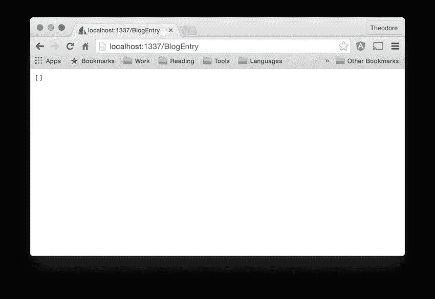
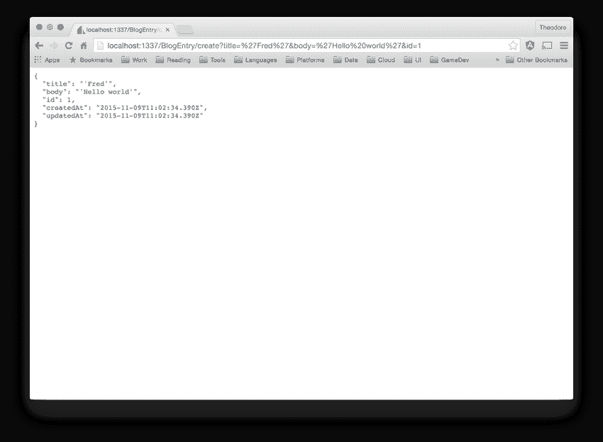

# 模型和蓝图

> 原文：[`developer.ibm.com/zh/tutorials/wa-build-deploy-web-app-sailsjs-2-bluemix/`](https://developer.ibm.com/zh/tutorials/wa-build-deploy-web-app-sailsjs-2-bluemix/)

欢迎回来，水手们！您已经在 [第 1 部分](https://www.ibm.com/developerworks/cn/web/wa-build-deploy-web-app-sailsjs-1-bluemix/index.html) 中初步了解 Sails.js，在开发环境中设置了一个本地安装，创建了一个 Sails.js 应用程序的框架，并在 IBM Cloud; 上启动它。开发框架应用程序有助于了解 Sails.js 中的编程的基础知识。现在我们将撇开 “Hello World” 应用程序的简单乐趣，创建一个更加真实的示例应用程序。[在此获得示例代码](http://public.dhe.ibm.com/software/dw/web/wa-build-deploy-web-app-sailsjs-2-bluemix/sailsjs-2-source.zip)。

您会回想起示例应用程序是一个博客 API，其中集成了传统 REST 架构的部分元素。该博客应用程序将保存并发布博客条目，还将执行典型的博客操作，比如跟踪评论，生成和显示 RSS 提要等。HTTP API 设计有助于建立一个稳定的可扩展后端，而视图取决于移动、桌面或 Web 客户端。

博客 API 拥有相对较小的用例集合，至少在开始的时候是这样。用户能够创建任何数量的博客条目，而且每个条目都将包含标题、正文、标记和作者。这些条目还将显示一个创建时间戳和另一个更新时间戳。

在以后，您将重构该应用程序并添加更多的功能，但现在我们将保持它的简单性。

## 建模该应用程序

##### 关于本系列

像 Sails.js 的同类产品 Ruby on Rails 一样，Sails.js 是一个旨在帮助开发人员构建 Web 应用程序的框架。默认情况下，Rails 用于构建在服务器上生成 HTML，并将其发回给浏览器的应用程序，与 Ruby on Rails 不同的是，Sails 为构建 HTTP API 提供了很好的开箱即用的支持。这种设计有助于在客户端和服务器之间实现更好的关注点分离，并促进客户端和服务器之间的更多的互操作性。在本系列中，Web 开发人员和教师 Ted Neward 将向您介绍 Sails.js。HTTP API 示例应用程序可以是 AngularJS、React 或几乎其他任何客户端应用程序的后端。

从头开发 MVC 应用程序时，您可能会考虑应该从模型还是从控制器元素开始。在必要时，不仅可以从控制器开始，也可以从控制器构建完整的应用程序：您只需为应用程序的每个功能定义一个控制器，并与数据库传输数据。您始终可以在以后重构该应用程序，从您的控制器架构中提取模型。

在 Sails.js 中，从模型开始的效率更高一些。不仅 Sails 模型容易设计，Sails 还提供了一系列称为 *蓝图* 的控制器路由，它们会自动应用于不同的模型类型。您需要做的只是在 Sails 中定义模型，Sails 将自动为该模型的基本数据存储和检索功能设置 API 路由和功能。

Sails.js 的模型优先方法也非常适合 HTTP API 应用程序的 RESTful 设计。REST 希望公开资源，您已在模型中提前定义了这些资源。

为博客 API 建模很容易：只需定义应用程序所需的模型类型，Sails 默认情况下会为它们建立蓝图。在拥有模型和蓝图后，还要定义它们之间的关系，并添加一些独立控制器来处理整个应用程序的行为。对于该博客 API，我们需要一个独立控制器来查找评价最高的博客条目，还需要另一个控制器来提供博客条目的 RSS 提要。

### 一般化的建模

开发第一个 Sails 模型之前，需要确定 *如何* 建模您的数据：您将使用关系实体、文档实体还是其他实体？在 Sails 中，答案是视具体情况而定。

正常情况下，在使用其他软件堆栈（比如 MEAN 堆栈）时，数据存储引擎是堆栈的重点部分。因此，您使用该堆栈为应用程序定义的条目是根据数据存储引擎自己的偏好严格建模的。例如，在使用 Rails 时，您将构建与关系实体紧密关联的模型；使用 MEAN 时，您将构建面向文档的模型。

不同于其他一些堆栈，Sails 从数据存储引擎中抽象出数据操作。因此，您可以选择 MySQL 和 Postgres 等关系数据库，MongoDB 等文档数据库，Redis 等键值存储，甚至可以选择内存型或自定义的简单磁盘存储格式。此抽象在数据存储引擎的选择上为您提供了很高的灵活性，但也为您留下了一些一般性选项。（这是功能还是限制完全取决于您的决定。）

##### 记住差异：ORM 和 ODM

对象关系映射 (ORM) 是开发人员用于减轻面向对象的编程与关系数据存储之间的上下文差异（或*阻抗失配*）的工具。如果您是一名 Java 开发人员，您或许使用过或听说过 Hibernate 和 Java Persistence API 等 ORM 工具。如果使用 .NET 作为平台，那么您可能知道 Entity Framework。

就像使用关系数据存储的开发人员需要解决对象和关系之间的阻抗失配一样，设置面向文档的数据存储的开发人员需要解决对象和文档之间的差异。Mongoose（用于 MongoDB）等对象文档映射 (ODM) 工具可帮助解决这个问题。

您可能想知道何时将使用对象分层映射器 (OHM) 来处理分层系统，比如 XML 数据库。以及在 OHM 出现时，我们是否会面对一片抗议声？（是的，这是程序员的幽默。记得要向服务员付小费哦，伙计。我整周都会在这里。）

### Waterline：Sails ORM

Sails 抽象数据层的核心是它的内置 ORM，名为 [Waterline](http://sailsjs.org/documentation/reference/waterline-orm) 。作为一个数据访问层，Waterline 支持几乎所有数据库，包括关系和非关系 (NoSQL) 数据库。尽管 Waterline 对任何类型数据存储的支持满足了避免供应商锁定的诉求，但一般化也消除了针对特定类型的数据层进行优化的机会。

幸运的是，您不 *需要* 结合使用 Waterline 和 Sails。所以如果您认为 Waterline 不适合针对 MongoDB 的数据建模，那么您可以悄悄使用 Mongoose。然后，您可以直接将 Sails 应用程序与 MongoDB 和 Mongoose 绑定在一起。

考虑到这项提醒，我们暂时假设您在为一个一般化的数据层建模。

### 基于磁盘的持久性

在开发周期的早期，您或许不想太多地考虑持久性层，甚至是像您从 MongoDB 获得的一般化且松散类型的持久性层一样。这意味着除了坚持采用 Waterline 之外，您将为 Sails 使用默认的持久性层。这是一个纯粹的本地系统，Sails 称之为 “sails-disk” 数据库，它将对象存储在内存中，直到可以将它们写入磁盘。实际存储格式非常简单，但几乎不相关，因为您只能将它用于设计项目原型，自行实验或在文章中演示 Sails。使用默认系统为您提供了以创造性的方式思考模型的最终状态的空间，但又不会让您太快地迷失在构建这种复杂东西的细节上。因为没有模式，所以在您准备好后执行重构将会非常容易。

创建 Sails 模型的过程是一种类似对象的体验，但不是您可能熟悉的 *富域模型* 。Sails 模型缺少基于对象的编程的一些常见功能。但是，如果您了解其他框架中的对象关系映射，就可能发现 Sails 与其中的体验差不多。在开始建立对象之间的关系时，您将面临它们之间的权衡。就现在而言，我们首先会定义一些基本的数据类型。

## 建模一个博客条目

花点时间想想您希望在博客条目中看到哪些功能。您不需要立即规划和实现每个组件，但在开始编码之前制定一个基本计划是一个不错的想法。作为一个模型， `BlogEntry` 至少需要一个标题和正文。因为人们经常编辑和检索博客条目，所以一个不错的想法是添加一个 **created** 字段来表示首次创建该条目的时间，添加一个 **updated** 字段来表示最后编辑时间。

您将在以后添加 **tags** 和 **author** 等其他字段。我们现在首先来查看前 4 个字段。

### Sails：生成！

您已选定了一个基本模式并决定让 Sails 将模型存储到磁盘中。接下来，您将告诉 Sails 生成您的数据模型和关联的控制器的脚手架。首先调用命令 `sails generate api BlogEntry` 。该命令将创建两个文件： `BlogEntry.js` （可在 `/api/models` 目录中找到）和 `BlogEntryController.js` （在 `/api/controllers` 目录中）。

我们将 `BlogEntryController` 留到以后讨论。现在来看看 `BlogEntry` 模型：

##### 一个空模型

```
/**
 * BlogEntry.js
 *
 * @description :: TODO: ...
 * @docs        :: http://sailsjs.org/#!documentation/models
 */

module.exports = {

  attributes: {
  }

}; 
```

该模型显然需要一些属性。使用您的默认 sails-disk 数据库，首先定义 `BlogEntry` 类型。请注意，您没有添加 **created** 和 **updated** 属性，因为 Sails 会自动添加它们：

##### 将字段添加到模型中

```
/**
 * BlogEntry.js
 *
 * @description :: A blog entry stored in the CMS.
 * @docs        :: http://sailsjs.org/#!documentation/models
 */

module.exports = {

  attributes: {
    title: {
      type: 'string'
    },
    body: {
      type: 'string'
    }
  }

}; 
```

接下来，Sails 会定义一个基于 `BlogEntry` 模型的 `BlogEntry` 类（任何种类；位于所有 JavaScript 后）。该模型的每个实例都将拥有您在它之上定义的初始博客条目属性。

### 将属性添加到模型中

Sails 支持的属性远不止字符串类型，还包括一些方便的标准，比如 `'string'` 、 `'text'` 、 `'integer'` 、 `'float'` 、 `'date'` 、 `'datetime'` 、 `'boolean'` 、 `'binary'` 、 `'array'` 和 `'json'` 。其中许多属性也支持依据需求执行自定义（例如用于验证或实现唯一性）。

碰巧，下面清单中的模型缺少一些关键内容。如果两篇博客文章拥有同一个标题会怎样？这是一个完全合理的假设场景，而且很容易通过向模型添加主键字段来管理。这听起来像 `'integer'` 属性的工作，如下所示。

##### 将主键添加到模型中

```
/**
 * BlogEntry.js
 *
 * @description :: A blog entry stored in the CMS.
 * @docs        :: http://sailsjs.org/#!documentation/models
 */

module.exports = {

  attributes: {
    id: {
      type: 'integer'
    },
    // ... the rest
  }

}; 
```

这是 Waterline 模型管理不同数据存储的方法变得有趣的地方，因为 Waterline 必须能够向数据库描述数据模型中的任何属性。例如，Waterline 需要知道该 ID 是否将是主键。如果它是（大部分情况下是这样），Waterline 会将 RDBMS 中的 `id` 列标记为 `PRIMARY KEY` ，将 MongoDB 中的一个 `id` 属性改为 `_id` ，等等。

Sails 允许您使用 JavaScript 的简单的对象式语法来提供元属性，比如：

##### 将元属性添加到模型中

```
/**
 * BlogEntry.js
 *
 * @description :: A blog entry stored in the CMS.
 * @docs        :: http://sailsjs.org/#!documentation/models
 */

module.exports = {

  attributes: {
    id: {
      type: 'integer',
      primaryKey: true
    },
    title: {
      type: 'string',
      required: true,
      defaultsTo: ''
    },
    body: {
      type: 'string',
      required: true,
      defaultsTo: ''
    }
  }
}; 
```

这是一种非常直观的描述格式。转换为人类语言后，上述代码将类似于： `id` 是一个整数类型的属性， `primaryKey` 元属性被设置为 *true* 。

以下是 Sails 中使用的常见元属性的快速参考：

*   `email` 验证数据元素是否是电子邮件地址。
*   如果未指定值， `defaultsTo` 会将该值设置为 use。
*   `autoIncrement` 只能用在整数属性上。
*   `unique` 验证此属性是否在所有实例上是唯一的。
*   `primaryKey` 表明该属性将用作模型的主键。
*   `enum` 表明这个元属性的值是只接受给定属性的值的数组。所以 `enum:['Fred', 'Barney', 'Wilma', 'Betty']` 表示仅接受这 4 个值。
*   `size` 将会设置传递给数据库的大小限制，通常是字符串长度限制。

请参阅 [Sails](http://sailsjs.org/documentation/concepts/models-and-orm/attributes) 或 [Waterline](http://sailsjs.org/documentation/concepts/models-and-orm/models) 文档，了解 Sails 元属性的完整列表。

上面的简单模型对基本的博客引擎已足够了。保存您的 `BlogEntry.js` 文件，然后执行 `sails lift` 在本地运行它。严肃地讲，请完成这一步后再前进到下一步。

### 中止、重试和忽略

发出这个 `sails-lift` 后，您或许有点震惊。Sails 没有安静愉快地继续执行，它会立刻将以下信息发送到您的控制台：

##### safe/alter/drop?

```
Excuse my interruption, but it looks like this app
 does not have a project-wide "migrate" setting configured yet.
 (perhaps this is the first time you're lifting it with models?)

 In short, this setting controls whether/how Sails will attempt to automatically
 rebuild the tables/collections/sets/etc. in your database schema.
 You can read more about the "migrate" setting here:
 http://sailsjs.org/#/documentation/concepts/ORM/model-settings.html?q=migrate

 In a production environment (NODE_ENV==="production") Sails always uses
 migrate:"safe" to protect inadvertent deletion of your data.
 However during development, you have a few other options for convenience:

 1\. safe  - never auto-migrate my database(s). I will do it myself (by hand)
 2\. alter - auto-migrate, but attempt to keep my existing data (experimental)
 3\. drop  - wipe/drop ALL my data and rebuild models every time I lift Sails

What would you like Sails to do? 
```

现在，您可能注意到的第一件事是，Sails 的错误消息是最容易理解的。这不是唯一的方式：Sails 还会生成其他难以阅读的错误消息，尤其在与我们在一些编程语言中获得的错误相比时。

因为您是向新的 `BlogEntry` 发出的第一个 `sails lift` 请求，所以 Sails 会问：我应该如何处理将用来存储此模型的底层数据库系统的模式（如果有）？

对于许多开发人员，还会停下来思考以下问题：其他 ORM 系统有一些要求您手动编辑和管理数据库模式的基本行为，而 Sails 希望代表您管理这些任务。由于 Sails 无法对 “旧” 模式和 “新” 模式执行任何类型的语义比较，而且在您能进行多大程度的重构才不会让 Sails 无法理解语义方面，可能有些限制，所以选项有点少。将这种模式迁移合并到环境中非常不错，至少在它阻碍您工作或犯错之前是这样的。所以最好花点时间想想您的选择，并始终确保备份了您的代码和数据。

与此同时，返回到控制台，Sails 也希望知道它在重构模型时该如何做：

*   **safe** ：假设开发人员将管理所有模式重构。
*   **alter** ：尽可能地在不丢失任何数据的情况下修改现有模式（这肯定存在失败的风险）。
*   **drop** ：从头开始创建新模式。

在开发周期的早期阶段，每次都重新构建模型是您的最佳方法，因为您将不断调整模型类型。不用说，您绝不会为生产系统选择此选项。在将应用程序部署到生产中时，您可能需要选择第一个选项，因为大部分组织都对任何可能潜在地截断一个表的操作都很敏感，更别提整个数据库。但是因为您仍在实验并使用 sails-disk 存储系统（它没有任何模式），所以可以随意选择 “drop” 并保持简单性。

##### 自动化构建配置的时机

用不了多久，您就会厌倦在每个 `sails lift` 上执行 “safe/alter/drop” 查询。在将应用程序部署到生产中后，这些查询就会从烦恼演变为明显的危险（想想将应用程序部署到生产中的人选择 “drop” 选项时会发生什么）。幸运的是，您可以通过编程方式为 Sails 配置您最喜欢的选项。但在应用程序进一步完善后这样做可能更有意义。就个人而言，我更喜欢询问，而不是设置一个可能某一天产生事与愿违的结果的自动 “drop”。我不想 Sails 在应用程序重新启动时丢弃我的生产数据。

选择 drop 选项后，您将在控制台中看到熟悉的帆船图案。Sails 在正常运行，是时候开始将数据注入您的模型了 — 但是该如何操作？

## Blueprints API

Sails 随带了预定义的 HTTP 端点来支持基本的 CRUD 操作（GET、POST、PUT 和 DELETE）。每个选项都连接到一个从您模型的名称生成的 URL 端点。因此，即使只设置了博客 API 的框架，向 `http://localhost:1337/BlogEntry` 发出 GET 请求也会返回合法的 JSON 响应，如下所示：

##### GET /BlogEntry



尽管屏幕截图是空的，但上面显示的 JSON 数组告诉我 Sails 蓝图正在运行。在这种情况下，蓝图正在运行为一个 HTTP GET 端点定义的路由。剩余 CRUD 端点不难确定：POST 到 `/BlogEntry` ，这会使用 POST 正文作为要插入的数据来创建一个新的 `BlogEntry` 对象。PUT 将修改一个现有的 `BlogEntry` ，DELETE 会删除它。（请注意，PUT 和 DELETE 都将切断提交的 HTTP 请求中的主键属性。）

在典型的 Web 开发场景中，这可能是您开始编写 `curl` 命令行脚本的时刻，因为浏览器默认情况下不会执行 PUT 或 DELETE 操作，而是需要一个 HTML 表单来启动 POST 请求。该操作非常单调和无聊，而且（对 Sails 开发人员而言）完全没有必要。除了基本的 4 个 HTTP 端点之外，得益于 Sails 开箱即用地设置的蓝图默认设置，您还可以使用一些 “快捷” 路由使用来自浏览器的 GET 请求将记录放入系统中。举个恰当的例子，如果您在浏览器中访问：

```
/BlogEntry/create?title=%27Fred%27&body=%27Hello world%27&id=1", 
```

Sails 将使用以下信息作为响应：

##### 一个包含一些数据参数的 CREATE



毫无疑问，如果您返回并再次发出 `GET /BlogEntry` 请求，则会显示一个实例。现在您可能注意到，此设置不太像 REST 风格，因为它使用 GET 动词来执行修改数据库的操作。尽管明显违背 REST 系统的规则，但在此刻，它是开发周期中值得拥有的一个不错选项。

而且在将系统部署生产中之前，您应该关闭此实例和所有其他自动生成的路由。首先，拥有两种将数据插入系统中的可能方式会导致代码重复（有两个必须创建的端点，例如，如果您对谁可以将新博客条目放入数据库中进行限制）。其次，拥有执行同一种操作的多种方法可能会让将继承您的系统的开发人员混淆。很好地理解这些演示和早期原型设计，一旦经过了早期阶段，它们就没那么有用了。

##### 如何处理非唯一主键？

如果实验 `/create` 选项，您很快就会发现（与所有合理的数据库定义相反）主键的 `id` 字段实际上不是唯一的。可以运行同一个请求多次，最终在系统中得到多个 `BlogEntry` 实例，每个实例都拥有一个值为 1 的 `id` 字段。这是因为 sails-disk 适配器不是仅为开发用途而设计的。sails-disk 适配器实现中缺少通常包含在数据库中的许多功能：该功能只是其中之一。

### 蓝图路由

完整的 [Blueprints API 文档](http://sailsjs.org/documentation/reference/blueprint-api) 详细介绍了为 Sails 配置的所有蓝图路由。除了执行创建/插入的快捷路由（您已在上文看到）之外，还有两个自动生成的蓝图路由也值得讨论：

*   `PUT /:model/:record` 是对记录执行更新的默认路由。
*   `GET /:model/:record/update` 允许您将要更新的属性指定为查询参数对，比如： `GET /BlogEntry/1/update/title=New%20Title` 。

您可以指定 PUT 请求或 GET “快捷” 请求上的参数，但同样地，应该为了生产用途而关闭该快捷路由。

`GET /:model` 有许多参数可作为查询参数传递给 GET 请求。例如， `limit` 可用于设置应返回的最大条目数， `skip` 可用于表明在返回之前跳过了多少个条目。一起使用这两个参数可为大型记录集提供简单的分页支持：当用户在以 50 个记录划分的记录块中移动时，每移动一次就会执行一次 `limit=50` ， `skip 0, 50, 100, 150` ，依此类推。

GET 蓝图路由也支持 `sort` ，这允许您指定某个要排序的属性，以及该属性应按升序 (ASC) 还是降序 (DESC) 进行排序。（一定要确保在属性名和顺序之间放入了一个空格，就像这样： `?sort=lastName$20ASC` 。）

另一个受支持的参数是 `where` ，它将接受一个 JSON 风格的类似 MongoDB 的谓词，比如 `?where={"name":{"contains":"theodore"}}` （这是一个 Waterline WHERE 条件对象，Waterline 将针对关系数据库适配器而将它调整为 SQL。）

如果要搜索的属性有一个特定的值（无处不在的 `SELECT * FROM persons WHERE lastName='Flintstone'` 查询），该路由会直接接受它作为查询参数，比如： `GET /BlogEntry?title=Greetings%20everybody` 。

考虑到您目前仅编写了十几行代码，这是一组不错的功能。

## 结束语

关于在 Sails.js 中建模，还有许多知识需要学习，但现在，已经有足够的新领域供您探索。在下一篇教程中，将进一步了解模型和它们之间的关系；也就是说，将了解许多数据系统中存在的经典的 “1 对 1”、”1 对多” 和 “多对多” 关系。建模关系会使您能够扩展博客 API 来接受评论等信息。但现在，是时候暂停一下了。对于该框架的名称，我们不想说 “再见”，说 *一路平安* 也许会更合适一些。

本文翻译自：[Models and blueprints](https://developer.ibm.com/tutorials/wa-build-deploy-web-app-sailsjs-2-bluemix/)（2016-03-01）