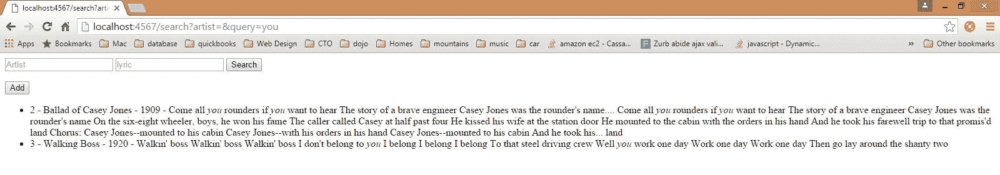

# 在 Java 应用程序中使用 Elasticsearch

> 原文：[`developer.ibm.com/zh/tutorials/j-use-elasticsearch-java-apps/`](https://developer.ibm.com/zh/tutorials/j-use-elasticsearch-java-apps/)

如果您使用过 Apache Lucene 或 Apache Solr，就会知道它们的使用体验非常有趣。尤其在您需要扩展基于 Lucene 或 Solr 的解决方案时，您就会了解 [Elasticsearch](https://www.elastic.co/products/elasticsearch) 项目背后的动机。Elasticsearch（构建于 Lucene 之上）在一个容易管理的包中提供了高性能的全文搜索功能，支持开箱即用地集群化扩展。您可以通过标准的 REST API 或从特定于编程语言的客户端库与 Elasticsearch 进行交互。

本教程将展示 Elasticsearch 的实际工作原理。首先从命令行访问该 REST API 来了解它的基本信息。然后设置一个本地 Elasticsearch 服务器，并从一个简单的 Java 应用程序与它交互。您可以[获取示例代码](http://public.dhe.ibm.com/software/dw/java/j-use-elasticsearch-java-apps/es-demo.zip)。

## 前提条件

要理解本教程的所有示例，需要在您的系统上安装 Elasticsearch。下载针对您的平台的 [最新 Elastic Search 程序包](https://www.elastic.co/downloads/elasticsearch) 。将该包解压到一个方便的位置。在 UNIX 或 Linux 上，通过以下命令启动该实例：

```
/elastic-search-dir/bin/elasticsearch 
```

在 Windows 上，运行

```
/elastic-search-dir/bin/elasticsearch.bat 
```

在看到日志消息 `started` 时，该节点已准备好接受请求。

对于 Java 示例，还需要安装 [Eclipse](https://eclipse.org/downloads/) 和 [Apache Maven](https://maven.apache.org/download.cgi) 。如果您的系统上还没有它们，请下载和安装它们。

您还需要 cURL。在 Microsoft Windows 上，我使用 [Git Bash](https://gitforwindows.org/) shell 来运行 cURL。

## 使用 cURL 执行 REST 命令

可以对 Elasticsearch 发出 cURL 请求，这样很容易从命令行 shell 体验该框架。

> Elasticsearch 是无模式的。它可以接受您提供的任何命令，并处理它以供以后查询。

Elasticsearch 是无模式的，这意味着它可以接受您提供的任何命令，并处理它以供以后查询。Elasticsearch 中的所有内容都被存储为 *文档* ，所以您的第一个练习是存储一个包含歌词的文档。首先创建一个 *索引* ，它是您的所有文档类型的容器 — 类似于 MySQL 等关系数据库中的数据库。然后，将一个文档插入该索引中，以便可以查询该文档的数据。

### 创建一个索引

Elasticsearch 命令的一般格式是： `REST VERB HOST_:9200/ _index_ / _doc-type` — 其中 `REST VERB` 是 `PUT` 、 `GET` 或 `DELETE` 。（使用 cURL `-X` 动词前缀来明确指定 HTTP 方法。）

要创建一个索引，可在您的 shell 中运行以下命令：

```
curl -XPUT "http://localhost:9200/music/" 
```

##### 模式可选

尽管 Elasticsearch 是无模式的，但它在幕后使用了 Lucene，后者使用了模式。不过 Elasticsearch 为您隐藏了这种复杂性。实际上，您可以将 Elasticsearch 文档类型简单地视为子索引或表名称。但是，如果您愿意，可以指定一个模式，所以您可以将它视为一种模式可选的数据存储。

### 插入一个文档

要在 `/music` 索引下创建一个类型，可插入一个文档。在第一个示例中，您的文档包含数据（包含一行）”Deck the Halls” 的歌词，这是一首最初由威尔士诗人 John Ceirog Hughes 于 1885 年编写的传统的圣诞歌曲。

要将包含 “Deck the Halls” 的文档插入索引中，可运行以下命令（将该命令和本教程的其他 cURL 命令都键入到一行中）：

```
curl -XPUT "http://localhost:9200/music/songs/1" -d '
{ "name": "Deck the Halls", "year": 1885, "lyrics": "Fa la la la la" }' 
```

前面的命令使用 `PUT` 动词将一个文档添加到 `/songs` 文档类型，并为该文档分配 ID 1。URL 路径显示为 *index/doctype/ID* 。

### 查看文档

要查看该文档，可使用简单的 `GET` 命令：

```
curl -XGET "http://localhost:9200/music/songs/1" 
```

Elasticsearch 使用您之前 `PUT` 进索引中的 JSON 内容作为响应：

```
{"_index":"music","_type":"songs","_id":"1","_version":1,"found":true,"_source":
{ "name": "Deck the Halls", "year": 1885, "lyrics": "Fa la la la la" }} 
```

### 更新文档

如果您认识到日期写错了，并想将它更改为 1886 怎么办？可运行以下命令来更新文档：

```
curl -XPUT "http://localhost:9200/music/lyrics/1" -d '{ "name":
"Deck the Halls", "year": 1886, "lyrics": "Fa la la la la" }' 
```

因为此命令使用了相同的唯一 ID 1，所以该文档会被更新。

### 删除文档（但暂时不要删除）

暂时不要删除该文档，知道如何删除它就行了：

```
curl -XDELETE "http://localhost:9200/music/lyrics/1" 
```

### 从文件插入文档

这是另一个技巧。您可以使用一个文件的内容来从命令行插入文档。尝试此方法，添加另一首针对传统歌曲 “Ballad of Casey Jones” 的文档。将清单 1 复制到一个名为 caseyjones.json 的文件中；也可以使用[示例代码包](http://public.dhe.ibm.com/software/dw/java/j-use-elasticsearch-java-apps/es-demo.zip)中的 caseyjones.json 文件。将该文件放在任何方便对它运行 cURL 命令的地方。（在下载的代码中，该文件位于根目录中。）

<h5 id=”清单-1-” ballad-of-casey-jones”-的-json-文档>清单 1\. “Ballad of Casey Jones” 的 JSON 文档

```
{
  "artist": "Wallace Saunders",
  "year": 1909,
  "styles": ["traditional"],
  "album": "Unknown",
  "name": "Ballad of Casey Jones",
  "lyrics": "Come all you rounders if you want to hear
The story of a brave engineer
Casey Jones was the rounder's name....
Come all you rounders if you want to hear
The story of a brave engineer
Casey Jones was the rounder's name
On the six-eight wheeler, boys, he won his fame
The caller called Casey at half past four
He kissed his wife at the station door
He mounted to the cabin with the orders in his hand
And he took his farewell trip to that promis'd land

Chorus:
Casey Jones--mounted to his cabin
Casey Jones--with his orders in his hand
Casey Jones--mounted to his cabin
And he took his... land"
} 
```

运行以下命令，将此文档 `PUT` 到您的 `music` 索引中：

```
$ curl -XPUT "http://localhost:9200/music/lyrics/2" -d @caseyjones.json 
```

在该索引中时，将清单 2 的内容（包含另一手民歌 “Walking Boss”）保存到 walking.json 文件中。

<h5 id=”清单-2-” walking-boss”-json>清单 2\. “Walking Boss” JSON

```
{
  "artist": "Clarence Ashley",
  "year": 1920
  "name": "Walking Boss",
  "styles": ["folk","protest"],
  "album": "Traditional",
  "lyrics": "Walkin' boss
Walkin' boss
Walkin' boss
I don't belong to you

I belong
I belong
I belong
To that steel driving crew

Well you work one day
Work one day
Work one day
Then go lay around the shanty two"
} 
```

将此文档推送到索引中：

```
$ curl -XPUT "http://localhost:9200/music/lyrics/3" -d @walking.json 
```

### 搜索 REST API

是时候运行一次基本查询了，此查询比您运行来查找 “Get the Halls” 文档的简单 `GET` 要复杂一些。文档 URL 有一个内置的 `_search` 端点用于此用途。在歌词中找到所有包含单词 *you* 的歌曲：

```
curl -XGET "http://localhost:9200/music/lyrics/_search?q=lyrics:'you'" 
```

`q` 参数表示一个查询。

响应是：

```
{"took":107,"timed_out":false,"_shards":{"total":5,"successful":5,"failed":0},"hits":{"total":2,"max
_score":0.15625,"hits":[{"_index":"music","_type":"songs","_id":"2","_
score":0.15625,"_source":{"artist": "Wallace Saunders","year": 1909,"styles":
["traditional"],"album": "Unknown","name": "Ballad of Casey Jones","lyrics": "Come all you rounders
if you want to hear The story of a brave engineer Casey Jones was the rounder's name.... Come all
you rounders if you want to hear The story of a brave engineer Casey Jones was the rounder's name
On the six-eight wheeler, boys, he won his fame The caller called Casey at half past four He kissed
his wife at the station door He mounted to the cabin with the orders in his hand And he took his
farewell trip to that promis'd land Chorus: Casey Jones--mounted to his cabin Casey Jones--with his
orders in his hand Casey Jones--mounted to his cabin And he took his... land"
}},{"_index":"music","_type":"songs","_id":"3","_score":0.06780553,"_source":{"artist": "Clarence
Ashley","year": 1920,"name": "Walking Boss","styles": ["folk","protest"],"album":
"Traditional","lyrics": "Walkin' boss Walkin' boss Walkin' boss I don't belong to you I belong I
belong I belong To that steel driving crew Well you work one day Work one day Work one day Then go
lay around the shanty two"}}]}} 
```

### 使用其他比较符

还有其他各种比较符可供使用。例如，找到所有 1900 年以前编写的歌曲：

```
curl -XGET "http://localhost:9200/music/lyrics/_search?q=year:<1900 
```

此查询将返回完整的 “Casey Jones” 和 “Walking Boss” 文档。

### 限制字段

要限制您在结果中看到的字段，可将 `fields` 参数添加到您的查询中：

```
curl -XGET "http://localhost:9200/music/lyrics/_search?q=year:>1900&fields=year" 
```

### 检查搜索返回对象

清单 3 给出了 Elasticsearch 从前面的查询返回的数据。

##### 清单 3\. 查询结果

```
{
    "took": 6,
    "timed_out": false,
    "_shards": {
        "total": 5,
        "successful": 5,
        "failed": 0
    },
    "hits": {
        "total": 2,
        "max_score": 1.0,
        "hits": [{
            "_index": "music",
            "_type": "lyrics",
            "_id": "1",
            "_score": 1.0,
            "fields": {
                "year": [1920]
            }
        }, {
            "_index": "music",
            "_type": "lyrics",
            "_id": "3",
            "_score": 1.0,
            "fields": {
                "year": [1909]
            }
        }]
    }
} 
```

在结果中，Elasticsearch 提供了多个 JSON 对象。第一个对象包含请求的元数据：看看该请求花了多少毫秒 (`took`) 和它是否超时 (`timed_out`)。 `_shards` 字段需要考虑 Elasticsearch 是一个集群化服务的事实。甚至在这个单节点本地部署中，Elasticsearch 也在逻辑上被集群化为分片。

继续查看清单 3 中的搜索结果，可以观察到 `hits` 对象包含：

*   `total` 字段，它会告诉您获得了多少个结果
*   `max_score` ，用于全文搜索
*   实际结果

实际结果包含 `fields` 属性，因为您将 `fields` 参数添加到了查询中。否则，结果中会包含 `source` ，而且包含完整的匹配文档。 `_index` 、 `_type` 和 `_id` 的用途不言自明； `_score` 指的是全文搜索命中长度。这 4 个字段始终会在结果中返回。

### 使用 JSON 查询 DSL

基于查询字符串的搜索很快会变得很复杂。对于更高级的查询，Elasticsearch 提供了一种完全基于 JSON 的特定于领域的语言 (DSL)。例如，要搜索 `album` 值为 `traditional` 的每首歌曲，可创建一个包含以下内容的 query.json 文件：

```
{
    "query" : {
        "match" : {
            "album" : "Traditional"
        }
    }
} 
```

然后运行：

```
curl -XGET "http://localhost:9200/music/lyrics/_search" -d @query.json 
```

## 从 Java 代码使用 Elasticsearch

> Elasticsearch 强大功能会在通过语言 API 使用它时体现出来。

Elasticsearch 强大功能会在通过语言 API 使用它时体现出来。现在我将介绍 Java API，您将从一个应用程序执行搜索。请参见 下载 部分，获取相关的示例代码。该应用程序使用了 Spark 微型框架，所以可以很快设置它。

### 示例应用程序

为一个新项目创建一个目录，然后运行（将该命令键入到一行上）：

```
mvn archetype:generate -DgroupId=com.dw -DartifactId=es-demo
-DarchetypeArtifactId=maven-archetype-quickstart -DinteractiveMode=false 
```

要生成一个项目来在 Eclipse 中使用，可通过 `cd` 进入 Maven 创建的项目目录，并运行 `mvn eclipse:eclipse` 。

在 Eclipse 中，选择 **File** > **Import** > **Existing Project into Workspace** 。导航到您使用 Maven 的文件夹，选择该项目，单击 `Finish` 。

在 Eclipse 中，您可以看到一个基本的 Java 项目布局，包括根目录中的 pom.xml 文件和一个 com.dw.App.java 主要类文件。将您所需的依赖项添加到 pom.xml 文件中。清单 4 给出了完整的 pom.xml 文件。

##### 清单 4\. 完整的 pom.xml

```
<project xmlns="http://maven.apache.org/POM/4.0.0" xmlns:xsi="http://www.w3.org/2001/XMLSchema-instance"
  xsi:schemaLocation="http://maven.apache.org/POM/4.0.0 http://maven.apache.org/maven-v4_0_0.xsd">
  <modelVersion>4.0.0</modelVersion>
  <groupId>com.dw</groupId>
  <artifactId>es-demo</artifactId>
  <packaging>jar</packaging>
  <version>1.0-SNAPSHOT</version>
  <name>es-demo</name>
  <url>http://maven.apache.org</url>
  <build>
    <plugins>
      <plugin>
        <groupId>org.apache.maven.plugins</groupId>
        <artifactId>maven-compiler-plugin</artifactId>
        <configuration>
          <compilerVersion>1.8</compilerVersion>
          <source>1.8</source>
          <target>1.8</target>
        </configuration>
      </plugin>
    </plugins>
  </build>
  <dependencies>
    <dependency>
    <groupId>com.sparkjava</groupId>
    <artifactId>spark-core</artifactId>
    <version>2.3</version>
</dependency>
<dependency>
    <groupId>com.sparkjava</groupId>
    <artifactId>spark-template-freemarker</artifactId>
    <version>2.3</version>
</dependency>
<dependency>
    <groupId>org.elasticsearch</groupId>
    <artifactId>elasticsearch</artifactId>
    <version>2.1.1</version>
</dependency>
  </dependencies>
</project> 
```

清单 4 中的依赖项获取 Spark 框架核心、Spark Freemarker 模板支持和 Elasticsearch。另请注意，我将 `<source>` 版本设置为 Java 8，Spark 需要该版本（因为它大量使用了 lambda）。

我不知道您的情况，但我不久前构建了许多 RESTful 应用程序，所以为了改变以下步调，您将为应用程序提供一个更加传统的 “提交和加载 (submit-and-load)” UI。

在 Eclipse 中，在导航器中右键单击项目，选择 **Configure** > **Convert to Maven Project** ，以便 Eclipse 可以解析 Maven 依赖项。转到项目，右键单击该项目，然后选择 **Maven** > **Update Project** 。

### Java 客户端配置

Elasticsearch 的 Java 客户端非常强大；它可以建立一个嵌入式实例并在必要时运行管理任务。但我在这里将重点介绍如何运行针对您已运行的节点的应用程序任务。

运行一个 Java 应用程序和 Elasticsearch 时，有两种操作模式可供使用。该应用程序可在 Elasticsearch 集群中扮演更加主动或更加被动的角色。在更加主动的情况下（称为 Node Client），应用程序实例将从集群接收请求，确定哪个节点应处理该请求，就像正常节点所做的一样。（应用程序甚至可以托管索引和处理请求。）另一种模式称为 Transport Client，它将所有请求都转发到另一个 Elasticsearch 节点，由后者来确定最终目标。

### 获取 Transport Client

对于演示应用程序，（通过 App.java 中执行的初始化）选择 Transport Client，并保持 Elasticsearch 执行最低级别的处理：

```
Client client = TransportClient.builder().build()
   .addTransportAddress(new InetSocketTransportAddress(InetAddress.getByName("localhost"), 9300)); 
```

如果连接到一个 Elasticsearch 集群，构建器可以接受多个地址。（在本例中，您只有一个 localhost 节点。）连接到端口 9300，而不是像之前在 REST API 的 cURL 中一样连接到 9200。Java 客户端将会使用这个特殊端口，使用端口 9200 不起作用。（其他 Elasticsearch 客户端，Python 客户端就是其中之一，将会 使用 9200 来访问 REST API。）

在服务器启动时创建该客户端，并在整个请求处理过程中使用它。Spark 通过 Mustache 模板引擎的 Java 实现来呈现该页面，而且 Spark 定义了请求端点 — 但我不会太多地解释这些简单的用例。（请参见 参考资料 ，获取 Spark 的详细信息的链接。）

该应用程序的索引页面显示了 Java 客户端的功能：



UI：

*   呈现现有歌曲的列表
*   提供一个添加歌曲的按钮
*   实现按艺术家和歌词进行搜索
*   返回突出显示了匹配内容的结果

### 搜索和处理结果

在清单 5 中，根 URL `/` 被映射到 index.mustache 页面。

##### 清单 5\. 基本搜索

```
Spark.get("/", (request, response) -> {
        SearchResponse searchResponse =
            client.prepareSearch("music").setTypes("lyrics").execute().actionGet();
        SearchHit[] hits = searchResponse.getHits().getHits();

            Map<String, Object> attributes = new HashMap<>();
            attributes.put("songs", hits);

            return new ModelAndView(attributes, "index.mustache");
        }, new MustacheTemplateEngine()); 
```

清单 5 中的有趣部分始于：

```
SearchResponse searchResponse = client.prepareSearch("music").setTypes("lyrics").execute().actionGet(); 
```

这一行显示了搜索 API 的简单用法。使用 `prepareSearch` 方法指定一个索引（在本例中为 `music` ），然后执行查询。查询基本上显示为 “Give me all of the records in the `music` index.”。另外，将文档类型设置为 `lyrics` ，但在这个简单用例中没有必要这么做，因为索引仅包含一种文档类型。在更大的应用程序，需要执行这种设置。这个 API 调用类似于您之前看到的 `curl -XGET "http://localhost:9200/music/lyrics/_search"` 调用。

`SearchResponse` 对象包含有趣的功能（例如命中数量和评分），但就目前而言，您只想要一个结果数组，可使用 `searchResponse.getHits().getHits();` 获得它。

最后，将结果数组添加到视图上下文中，并让 Mustache 呈现它。Mustache 模板如下所示：

##### 清单 6\. index.mustache

```
<html>
<body>
<form name="" action="/search">
  <input type="text" name="artist" placeholder="Artist"></input>
  <input type="text" name="query" placeholder="lyric"></input>
  <button type="submit">Search</button>
</form>
<button onclick="window.location='/add'">Add</button>
<ul>
{{#songs}}
  <li>{{id}} - {{getSource.name}} - {{getSource.year}}
    {{#getHighlightFields}} -
      {{#lyrics.getFragments}}
        {{#.}}{{{.}}}{{/.}}
      {{/lyrics.getFragments}}
    {{/getHighlightFields}}
  </li>
{{/songs}}
</ul>

</body>
</html> 
```

### 突出显示高级查询和匹配内容

要支持突出显示更高级的查询和匹配内容，可以使用 `/search` ，如下所示：

##### 清单 7\. 搜索和突出显示

```
Spark.get("/search", (request, response) -> {
        SearchRequestBuilder srb = client.prepareSearch("music").setTypes("lyrics");

        String lyricParam = request.queryParams("query");
        QueryBuilder lyricQuery = null;
        if (lyricParam != null && lyricParam.trim().length() > 0){
            lyricQuery = QueryBuilders.matchQuery("lyrics", lyricParam);
        }
        String artistParam = request.queryParams("artist");
        QueryBuilder artistQuery = null;
        if (artistParam != null && artistParam.trim().length() > 0){
          artistQuery = QueryBuilders.matchQuery("artist", artistParam);
        }

        if (lyricQuery != null && artistQuery == null){
          srb.setQuery(lyricQuery).addHighlightedField("lyrics", 0, 0);
        } else if (lyricQuery == null && artistQuery != null){
          srb.setQuery(artistQuery);
        } else if (lyricQuery != null && artistQuery != null){
          srb.setQuery(QueryBuilders.andQuery(artistQuery,
              lyricQuery)).addHighlightedField("lyrics", 0, 0);
        }

        SearchResponse searchResponse = srb.execute().actionGet();

SearchHit[] hits = searchResponse.getHits().getHits();

    Map<String, Object> attributes = new HashMap<>();
    attributes.put("songs", hits);

    return new ModelAndView(attributes, "index.mustache");
}, new MustacheTemplateEngine()); 
```

在清单 7 中，要注意的第一个有趣的 API 用法是 `QueryBuilders.matchQuery("lyrics", lyricParam);` 。这是您设置对 `lyrics` 字段的查询的地方。另外要注意的是 `QueryBuilders.andQuery(artistQuery, lyricQuery)` ，它是将查询的 `artist` 和 `lyrics` 部分合并到 AND 查询中的一种方法。

`.addHighlightedField("lyrics", 0, 0);` 调用告诉 Elasticsearch 生成 `lyrics` 字段上的搜索命中突出显示结果。第二和第三个参数分别指定无线大小的分段和无限数量的分段。

在呈现搜索结果时，将突出显示结果放入 HTML 中。使用 Elasticsearch 就能生成有效的 HTML，使用 `<em>` 标记来突出显示匹配字符串所在的位置。

### 插入文档

让我们来看看如何以编程方式将文档插入索引中。清单 8 给出了添加过程。

##### 清单 8\. 插入索引中

```
Spark.post("/save", (request, response) -> {
      StringBuilder json = new StringBuilder("{");
      json.append("\"name\":\""+request.raw().getParameter("name")+"\",");
      json.append("\"artist\":\""+request.raw().getParameter("artist")+"\",");
      json.append("\"year\":"+request.raw().getParameter("year")+",");
      json.append("\"album\":\""+request.raw().getParameter("album")+"\",");
      json.append("\"lyrics\":\""+request.raw().getParameter("lyrics")+"\"}");

      IndexRequest indexRequest = new IndexRequest("music", "lyrics",
          UUID.randomUUID().toString());
      indexRequest.source(json.toString());
      IndexResponse esResponse = client.index(indexRequest).actionGet();

      Map<String, Object> attributes = new HashMap<>();
      return new ModelAndView(attributes, "index.mustache");
    }, new MustacheTemplateEngine()); 
```

使用 `StringBuilder` 直接生成一个 JSON 字符串来创建它。在生产应用程序中，可使用 Boon 或 Jackson 等库。

执行 Elasticsearch 工作的部分是：

```
IndexRequest indexRequest = new IndexRequest("music", "lyrics", UUID.randomUUID().toString()); 
```

在本例中，使用了 UUID 来生成 ID。

## 结束语

您已快速掌握了如何从命令行和在 Java 应用程序中使用 Elasticsearch。您现在已经熟悉了索引、查询、突出显示和多字段搜索。Elasticsearch 在一个相对容易使用的包中提供了大量的功能。作为一个项目，Elasticsearch 带来了一些您可能也会感兴趣的结果。具体地讲，所谓的 ELK 堆栈，即 Elasticsearch、Logstash（用于日志管理）和 Kibana（用于报告/可视化），正在迅速发展。

本文翻译自：[Use Elasticsearch in your Java applications](https://developer.ibm.com/tutorials/j-use-elasticsearch-java-apps/)（2016-03-28）