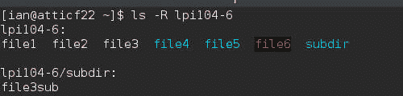
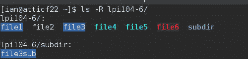

# 创建和更改硬链接和符号链接

> 原文：[`developer.ibm.com/zh/tutorials/l-lpic1-104-6/`](https://developer.ibm.com/zh/tutorials/l-lpic1-104-6/)

## 概述

##### 学习更多知识。开发更多项目。联系更多同行。

全新的 [IBM developer Premium](https://www.ibm.com/developerworks/cn/premium/ )会员计划提供了强大的开发工具和资源，包括 500 篇通过 Safari Books Online 提供的顶级技术文章（其中数十篇文章专门针对 Java 开发人员）、最重要开发人员活动的大幅折扣、最新的 O’Reilly 大会的视频录像，等等。[立即注册](https://www.ibm.com/developerworks/cn/premium/ )。

在本教程中，学习创建和管理硬链接和符号链接。学习：

*   创建硬或软链接
*   识别链接并知道它们的类型
*   理解复制与链接文件之间的区别
*   使用链接执行系统管理任务

本教程将帮助您针对 Linux Server Professional (LPIC-1) 考试 101 的主题 104 中的目标 104.6 进行应考准备。该目标的权重为 2。

## 链接简介

在存储设备上，文件或目录包含在一些数据块中。有关某个文件的信息包含在一个 *inode* 中，它记录了所有者、最后访问该文件的时间、文件的大小、它是否是目录，以及谁可以读取或写入它等信息。inode 编号也称为 *文件序列号* ，该编号在特定文件系统内是唯一的。一个 *目录条目* 包含一个文件或目录的名称，以及用来存储该文件或目录的信息的 inode 的指针。

##### 关于本系列

本教程系列将帮助您学习 Linux 系统管理任务。您还可以使用这些教程中的资料对 [Linux Professional Institute 的 LPIC-1：Linux 服务器专业认证考试](http://www.lpi.org)进行应考准备。

请参阅 “[*学习 Linux，101* ：LPIC-1 学习路线图](http://www.ibm.com/developerworks/cn/linux/l-lpic1-map/)”，查看本系列中每部教程的描述和链接。这个路线图仍在开发中，它反映了 2015 年 4 月 15 日更新的 4.0 版 LPIC-1 考试目标。在完成这些教程时，会将它们添加到路线图中。

*链接* 只是一个针对文件或目录的额外的目录条目，允许为同一个实体使用两个或更多名称。

### 前提条件

要从本系列教程中获得最大收获，您应该拥有 Linux 的基本知识和一个正常工作的 Linux 系统，您可以在这个系统上实践本教程中包含的命令。除非另行说明，本教程中的示例使用的均为 CentOS 6 和 2.6.-504 内核。

有时程序的不同版本将得到不同的输出格式，所以您的结果可能并不总是与这里给出的清单和图完全相同。具体地讲，我展示的许多输出都高度依赖于我们的系统上已安装的包。您自己的输出可能非常有所不同，但您应能够发现重要的共性。

## 创建链接

*硬链接* 是指向 inode 的目录条目，而 *软链接* 或 *符号链接* 是指向提供另一个目录条目的名称的 inode 的目录条目。存储第二个名称的准确机制可能依赖于文件系统和名称的长度。符号链接也称为 *symlink* 。

您可以只为文件创建硬链接，而不为目录创建硬链接。一个例外是一个包含该目录和它的父目录（. 和 ..）的目录中的特殊目录条目，它们是维护子目录数量的硬链接。因为硬链接指向 inode，而且 inode 仅在特定的文件系统内是唯一的，所以硬链接不能跨文件系统使用。如果一个文件有多个硬链接，那么只在指向该 inode 的最后一个链接被删除，而且链接数量变为 0 时，才会删除该文件。

软链接或 symlink 仅按名称指向另一个文件或目录，而不是按 inode。软链接可以跨越文件系统边界进行使用。删除软链接不会删除目标文件或目录，删除目标文件或目录也不会自动删除任何软链接。

首先让我们看看如何创建硬和软链接。在本教程后面，我们将介绍识别和使用我们在这里创建的链接的方式。

### 硬链接

使用 `ln` 命令创建现有文件的额外的硬链接（但不能是目录，即使系统将 . 和 .. as 设置为硬链接）。

创建硬链接 展示了如何创建一个包含两个文件和一个子目录的目录，其中包含 file1 的两个硬链接，一个位于同一个目录中，另一个位于子目录中。我们向 file1 添加一个词，然后向 file3 添加另一个词，并在子目录中显示该链接的内容，以表明所有链接确实都指向相同的数据。

##### 创建硬链接

```
[ian@atticf22 ~]$ mkdir -p lpi104-6/subdir
[ian@atticf22 ~]$ touch lpi104-6/file1
[ian@atticf22 ~]$ touch lpi104-6/file2
[ian@atticf22 ~]$ ln lpi104-6/file1 lpi104-6/file3
[ian@atticf22 ~]$ ln lpi104-6/file1 lpi104-6/subdir/file3sub
[ian@atticf22 ~]$ echo "something" > lpi104-6/file1
[ian@atticf22 ~]$ echo "else" >> lpi104-6/file3
[ian@atticf22 ~]$ cat lpi104-6/subdir/file3sub
something
else 
```

如果尝试创建跨文件系统或针对目录的硬链接，则会获得错误。 硬链接创建失败 显示我的主目录和 research 目录在不同的文件系统上，而且跨这些文件系统创建硬链接的尝试失败了，与创建 lpi104-6 目录的硬链接的尝试一样。

##### 硬链接创建失败

```
 [ian@atticf22 ~]$ df . research
 Filesystem     1K-blocks     Used Available Use% Mounted on
 /dev/sda5       71168700 31642752  35887712  47% /
 /dev/sdb3       60326992 30677592  26578276  54% /home/ian/research
 [ian@atticf22 ~]$ mkdir -p research/lpi104-6/
 [ian@atticf22 ~]$ ln lpi104-6/file1 research/lpi104-6/file3
 ln: failed to create hard link ' research/lpi104-6/file3 ' =>
' lpi104-6/file1 ' : Invalid cross-device link
 [ian@atticf22 ~]$ ln lpi104-6 lpidir104-6
 ln: ' lpi104-6 ' : hard link not allowed for directory 
```

### 软链接

使用 `ln` 命令和 `-s` 选项来创建软链接。软链接使用文件或目录名称，这些名称可能是相对或绝对的。如果使用相对名称，您可能希望当前工作目录是您创建链接的目录。否则，您创建的链接将是文件系统中的另一个位置相对的链接。

创建软链接 展示了为我们刚创建的 file1 创建软链接的两种方式，以及如何创建软链接，而不是创建在 硬链接创建失败 中失败的两个硬链接。

##### 创建软链接

```
[ian@atticf22 ~]$ # Create symlink using absolute paths
[ian@atticf22 ~]$ ln -s ~/lpi104-6/file1 ~/lpi104-6/file4
[ian@atticf22 ~]$ # Create symlink using relative paths
[ian@atticf22 ~]$ cd lpi104-6/
[ian@atticf22 lpi104-6]$ ln -s file1 file5
[ian@atticf22 lpi104-6]$ cd ..
[ian@atticf22 ~]$ # Create symlink across file systems
[ian@atticf22 ~]$ mkdir -p ~ian/research/lpi104-6
[ian@atticf22 ~]$ ln -s ~/lpi104-6/file1 ~ian/research/lpi104-6/file4
[ian@atticf22 ~]$ # Create symlink for directory
[ian@atticf22 ~]$ ln -s lpi104-6 lpidir104-6 
```

与之前一样，您可以使用任何链接或目标文件名来引用该文件或目录。 使用软链接 显示了一些例子。

##### 使用软链接

```
[ian@atticf22 ~]$ echo "another line" >> ~ian/research/lpi104-6/file
[ian@atticf22 ~]$ # cat a symlink
[ian@atticf22 ~]$ cat lpi104-6/file5
something
else
[ian@atticf22 ~]$ # cat a hard link
[ian@atticf22 ~]$ cat lpi104-6/file1
something
else
[ian@atticf22 ~]$ # display directory contents using symlink
[ian@atticf22 ~]$ ls lpidir104-6
file1  file2  file3  file4  file5  subdir 
```

在创建链接时，让我们在工作目录 **不是** 我们想要存放链接的目录时使用相对路径创建一个链接。下一节将介绍如何实现此目的。

##### 创建不良的软链接

```
[ian@atticf22 ~]$ ln -s lpi104-6/file1 lpi104-6/file6 
```

## 识别链接

在上一节中，您了解了如何创建链接，但不知道如何区分您创建的链接。现在让我们讨论一下这个主题。

### 查找信息

在许多系统上， `ls` 命令等同于 `ls --color=auto` ，它以不同颜色打印不同类型的文件系统对象。如果使用此选项，可能使用蓝绿色文本来显示 symlink，如 使用 ls 的 –colors 选项来识别链接 中所示。

##### 使用 ls 的 –colors 选项来识别链接



在旧配置上，可能使用深蓝色背景来显示硬链接。这些颜色可使用 `dircolors` 程序来配置。如果要自定义您的终端外观，您可能希望更改 `ls` 的一些输出的颜色。 使用 dircolors 为硬链接设置一种蓝色背景 显示了一种在 Fedora 22 系统上获得硬链接的蓝色背景的方式，而 使用蓝色背景来标识硬链接 则显示了结果。使用手册页进一步理解该示例。

##### 使用 dircolors 为硬链接设置一种蓝色背景

```
[ian@atticf22 ~]$ # Save a copy of dircolors defaults
[ian@atticf22 ~]$ dircolors -p > dircolors-defaults
[ian@atticf22 ~]$ grep MULTI dircolors-defaults
MULTIHARDLINK 00 # regular file with more than one link
[ian@atticf22 ~]$ # Change MULTIHARDLINK to blue background
[ian@atticf22 ~]$ sed -e'/MULTI/s/00/00;44/' dircolors-defaults > dircolors-new
[ian@atticf22 ~]$ grep MULTI dircolors-new
MULTIHARDLINK 00;44 # regular file with more than one link
[ian@atticf22 ~]$ # Set the new colors for the current terminal session
[ian@atticf22 ~]$ eval $(dircolors dircolors-new ) 
```

##### 使用蓝色背景来标识硬链接



对于能够区分颜色的视力正常的人而言，颜色可能很方便，但它们对其他人没多大用处，对 shell 脚本或程序肯定也没多大用处。没有颜色，就需要更多的信息，比如使用 `ls -l` 通过一个长清单所提供的信息。在 识别链接 中，我们为第一个示例显式禁用了颜色输出，但您也可以像我们对另外两个示例所做的一样显式调用 `/bin/ls` 命令。

##### 识别链接

```
 [ian@atticf22 ~]$ ls --color=none -lR lpi104-6
 lpi104-6:
 total 12
 -rw-rw-r--. 3 ian ian   15 Aug  9 14:19 file1
 -rw-rw-r--. 1 ian ian    0 Aug  9 14:19 file2
 -rw-rw-r--. 3 ian ian   15 Aug  9 14:19 file3
 lrwxrwxrwx. 1 ian ian   24 Aug  9 14:26 file4 -> /home/ian/lpi104-6/file1
 lrwxrwxrwx. 1 ian ian    5 Aug  9 14:26 file5 -> file1
 lrwxrwxrwx. 1 ian ian   14 Aug  9 14:34 file6 -> lpi104-6/file1
 drwxrwxr-x. 2 ian ian 4096 Aug  9 14:19 subdir

 lpi104-6/subdir:
 total 4
 -rw-rw-r--. 3 ian ian 15 Aug  9 14:19 file3sub
 [ian@atticf22 ~]$ /bin/ls -l ~ian/research/lpi104-6/file4
 lrwxrwxrwx. 1 ian ian 24 Aug  9 14:27 /home/ian/research/lpi104-6/file4 -> /home/ian/lpi104-6/file1
 [ian@atticf22 ~]$ /bin/ls -l lpidir104-6
 lrwxrwxrwx. 1 ian ian 8 Aug  9 14:27 lpidir104-6 -> lpi104-6 
```

输出的第二列是一个链接计数，显示了此文件的硬链接数，所以我们知道 file1、file3 和 file3sub 都拥有多个指向它们表示的对象的硬链接。我们仍没有足够的信息来知道它们都表示同一个对象。如果您删除一个链接数大于 1 的文件，inode 中的链接数会减 1，但该文件只在链接数变为 0 时才会删除。同一个文件的其他所有硬链接将显示一个现在减去了 1 的链接数。

在输出的第一列中，您会看到第一个字符是表示符号链接的 “l”（L 的小写形式）。您还会看到在 -> 字符后显示了链接的目标。例如，file4 -> /home/ian/lpi104-6/file1。另一个提示是，该大小是链接目标的名称中的字符数。请注意，对于符号链接，目录清单中的链接数没有更新。删除该链接不会影响目标文件。Symlink 不会阻止文件被删除。如果目标文件被移动或删除，那么 symlink 将被破坏。出于这个原因，许多系统在目录清单中使用了颜色，通常使用淡蓝色表示正常链接，使用红色表示被破坏的链接。

您可以使用 `ls` 命令的 `-i` 选项来显示文件和目录条目的 inode 数量。 显示 inode 信息 同时给出了我们的 lpi104-6 目录的短和长输出。

##### 显示 inode 信息

```
[ian@atticf22 ~]$ ls -i lpi104-6
1988884 file1  1988884 file3  1988892 file5  1988605 subdir
1988886 file2  1988885 file4  1988891 file6
[ian@atticf22 ~]$ ls -il lpi104-6
total 12
1988884 -rw-rw-r--. 3 ian ian   15 Aug  9 14:19 file1
1988886 -rw-rw-r--. 1 ian ian    0 Aug  9 14:19 file2
1988884 -rw-rw-r--. 3 ian ian   15 Aug  9 14:19 file3
1988885 lrwxrwxrwx. 1 ian ian   24 Aug  9 14:26 file4 -> /home/ian/lpi104-6/file1
1988892 lrwxrwxrwx. 1 ian ian    5 Aug  9 14:26 file5 -> file1
1988891 lrwxrwxrwx. 1 ian ian   14 Aug  9 14:34 file6 -> lpi104-6/file1
1988605 drwxrwxr-x. 2 ian ian 4096 Aug  9 14:19 subdir 
```

您还可以使用 `find` 命令，使用 `-type l` 查找表达式来搜索符号链接，如 使用 find 查找 symlink 中所示。

##### 使用 find 查找 symlink

```
[ian@atticf22 ~]$ find lpi104-6 research/lpi104-6 -type l
lpi104-6/file4
lpi104-6/file6
lpi104-6/file5
research/lpi104-6/file4 
```

### 破坏的 symlink

在 创建不良的软链接 中，我们声明要创建一个不良的软链接。这是破坏的 symlink 的一个示例。因为硬链接始终指向一个表示文件的 inode，所以它们始终有效。但是，symlink 可能出于许多原因而遭到破坏，包括：

*   在创建链接时，链接的原始文件或目标不存在（就像 创建不良的软链接 中一样）。
*   链接的目标被删除或重命名。
*   目标的路径中的某个元素被删除或重命名。

所有这些条件都不会抛出错误，所以您需要仔细考虑您在创建 symlink 时可能发生了什么情况。具体地讲，对于绝对或相对路径的选择，可能受到您希望链接的对象在链接生存期中发生什么的影响。

如果您使用颜色输出，破坏的 symlink 可能在黑色背景上显示为红色文本，就像 使用 ls 的 –colors 选项来识别链接 中的 file6 的情况一样。否则，您需要使用 `ls` 的 `-H` 或 `-L` 选项来取消引用该链接，并提供有关目标的信息。 `-H` 选项在命令行上取消引用链接， `-L` 选项取消引用显示中包含的附加链接。 使用 ls -H 和 ls -L 取消引用链接 演示了来自这两个选项的输出中的区别。

##### 使用 ls -H 和 ls -L 取消引用链接

```
[ian@atticf22 ~]$ /bin/ls -lH lpidir104-6
total 12
-rw-rw-r--. 3 ian ian   15 Aug  9 14:19 file1
-rw-rw-r--. 1 ian ian    0 Aug  9 14:19 file2
-rw-rw-r--. 3 ian ian   15 Aug  9 14:19 file3
lrwxrwxrwx. 1 ian ian   24 Aug  9 14:26 file4 -> /home/ian/lpi104-6/file1
lrwxrwxrwx. 1 ian ian    5 Aug  9 14:26 file5 -> file1
lrwxrwxrwx. 1 ian ian   14 Aug  9 14:34 file6 -> lpi104-6/file1
drwxrwxr-x. 2 ian ian 4096 Aug  9 14:19 subdir
[ian@atticf22 ~]$ /bin/ls -lL lpidir104-6
/bin/ls: cannot access lpidir104-6/file6: No such file or directory
total 20
-rw-rw-r--. 3 ian ian   15 Aug  9 14:19 file1
-rw-rw-r--. 1 ian ian    0 Aug  9 14:19 file2
-rw-rw-r--. 3 ian ian   15 Aug  9 14:19 file3
-rw-rw-r--. 3 ian ian   15 Aug  9 14:19 file4
-rw-rw-r--. 3 ian ian   15 Aug  9 14:19 file5
l?????????? ? ?   ?      ?            ? file6
drwxrwxr-x. 2 ian ian 4096 Aug  9 14:19 subdir 
```

请注意，错误消息表明 file6 不存在，另请注意针对它的包含所有 “?” 字符的输出，它们同样表明该文件不存在。

关于破坏的符号链接，还要说明最后一点。读取该文件的尝试将失败，因为它不存在。但是，如果您拥有目标文件的合适权限，写入它的尝试将有效，如 读取和写入一个破坏的 symlink 中所示。请注意，我们需要在写入该文件之前创建 lpi104-6/lpi104-6。

##### 读取和写入一个破坏的 symlink

```
 [ian@atticf22 ~]$ cat lpi104-6/file6
cat: lpi104-6/file6: No such file or directory
[ian@atticf22 ~]$ echo "Testing file6" > lpi104-6/file6
bash: lpi104-6/file6: No such file or directory
[ian@atticf22 ~]$ mkdir lpi104-6/lpi104-6
[ian@atticf22 ~]$ cat lpi104-6/file6
cat: lpi104-6/file6: No such file or directory
[ian@atticf22 ~]$ echo "Testing file6" > lpi104-6/file6
[ian@atticf22 ~]$ cat lpi104-6/file6
Testing file6
[ian@atticf22 ~]$ ls lpi104-6/lpi104-6
file1
[ian@atticf22 ~]$ ls -l lpi104-6/file6
lrwxrwxrwx. 1 ian ian 14 Aug  9 14:34 lpi104-6/file6 -> lpi104-6/file1 
```

### 谁链接到我？

要确定哪些文件是一个特定 inode 的硬链接，可以使用 `find` 命令和 `-samefile` 选项及一个文件名，或者 `-inum` 选项及一个 inode 编号，如 查找同一个文件的硬链接 中所示。

##### 查找同一个文件的硬链接

```
 [ian@atticf22 ~]$ find lpi104-6 -samefile lpi104-6/file1
lpi104-6/file1
lpi104-6/file3
lpi104-6/subdir/file3sub
[ian@atticf22 ~]$ ls -i lpi104-6/file1
1988884 lpi104-6/file1
[ian@atticf22 ~]$ find lpi104-6 -inum 1988884
lpi104-6/file1
lpi104-6/file3
lpi104-6/subdir/file3sub 
```

要查找哪些文件通过符号链接而链接到一个特定文件，可以使用 `find` 命令和 `-lname` 选项及一个文件名，如 查找一个文件或目录的符号链接 所示。链接可以使用相对或绝对路径，所以您可能希望在名称中放入一个前导的星号来找到所有匹配结果。

##### 查找一个文件或目录的符号链接

```
[ian@atticf22 ~]$ find lpi104-6 research/lpi104-6 -lname "*file1"
lpi104-6/file4
lpi104-6/file6
lpi104-6/file5
research/lpi104-6/file4 
```

## 复制还是链接

根据您想要完成的任务，有时会使用链接，有时复制一个文件可能会更好一些。主要区别在于，链接提供了一个文件的多个名称，而副本会在两个不同的名称下创建两组相同的数据。对于备份和测试用途，肯定会使用副本，您希望试验一个新程序而不让您的操作数据处于风险之中。在需要某个文件（或目录）的别名时（可能用于提供更方面或更短的路径），可以使用链接。在下一节中，我们将介绍链接的其他一些用法。

您已经看到，在更新一个文件时，它所有的链接都会看到更新信息，而复制文件不会这样。您还看到，符号链接可以破坏，后续写入操作可以创建新的文件。请小心使用链接。

## 链接和系统管理

链接（尤其是符号链接）通常用在 Linux 系统管理中。命令通常具有别名，所以用户不需要知道当前命令的版本号，但在必要的时候，可以使用更长的名称来访问其他版本。如 将命令别名化为一个特定版本 所示， `python` 命令是 `python2` 的 symlink， `python2` 本身是 2.7 版的 `python2.7` 的 symlink。

##### 将命令别名化为一个特定版本

```
[ian@atticf22 ~]$ which python
/usr/bin/python
[ian@atticf22 ~]$ ls -l /usr/bin/python
lrwxrwxrwx. 1 root root 7 May 27 14:12 /usr/bin/python -> python2
[ian@atticf22 ~]$ ls -l /usr/bin/python2
lrwxrwxrwx. 1 root root 9 May 27 14:12 /usr/bin/python2 -> python2.7
[ian@atticf22 ~]$ ls -l /usr/bin/python2.7
-rwxr-xr-x. 1 root root 7120 May 27 14:12 /usr/bin/python2.7 
```

在多个命令名称使用相同的基础代码时，比如存储和重新启动系统的各种命令，其他用途就可以派上用场。有时，一个新命令名称（比如 `genisoimage` ）将取代旧命令名称，但旧名称 (mkisofs) 保持为新命令的链接。一些替代性 工具会广泛使用链接，所以您可以在多个替代性工具中选择一个来用于某条命令，比如 `java` 。 命令别名的示例 显示了一些示例。

##### 命令别名的示例

```
[ian@atticf22 ~]$ which halt
/usr/sbin/halt
[ian@atticf22 ~]$ ls -l /usr/sbin/halt
lrwxrwxrwx. 1 root root 16 Jun  9 09:16 /usr/sbin/halt -> ../bin/systemctl
[ian@atticf22 ~]$ find /usr/sbin /usr/bin -lname "*/systemctl"
/usr/sbin/halt
/usr/sbin/telinit
/usr/sbin/shutdown
/usr/sbin/runlevel
/usr/sbin/poweroff
/usr/sbin/reboot
[ian@atticf22 ~]$ which mkisofs
/usr/bin/mkisofs
[ian@atticf22 ~]$ ls -l /usr/bin/mkisofs
lrwxrwxrwx. 1 root root 25 Jun 15 08:02 /usr/bin/mkisofs -> /etc/alternatives/mkisofs
[ian@atticf22 ~]$ alternatives --display mkisofs
mkisofs - status is auto.
link currently points to /usr/bin/genisoimage
/usr/bin/genisoimage - priority 50
slave mkisofs-mkhybrid: /usr/bin/genisoimage
slave mkisofs-mkhybridman: /usr/share/man/man1/genisoimage.1.gz
slave mkisofs-mkisofsman: /usr/share/man/man1/genisoimage.1.gz
Current `best' version is /usr/bin/genisoimage. 
```

库名称通常也使用 symlink 来管理，无论是允许程序在获取当前版本时链接到一般名称，还是管理系统，比如能够运行 32 位程序的 64 位系统。 库链接 显示了一些示例。请注意，一些情况会使用绝对路径，而另一些情况会使用相对路径。

##### 库链接

```
[ian@atticf22 ~]$ ls -l /usr/lib*/libm.so*
lrwxrwxrwx. 1 root root 21 Feb 23 10:31 /usr/lib64/libm.so -> ../../lib64/libm.so.6
lrwxrwxrwx. 1 root root 12 Feb 23 10:33 /usr/lib64/libm.so.6 -> libm-2.21.so
lrwxrwxrwx. 1 root root 12 Feb 23 10:35 /usr/lib/libm.so.6 -> libm-2.21.so
[ian@atticf22 ~]$ find  /usr/lib/ /usr/lib64/ -lname "*libstdc++*"
/usr/lib/gcc/x86_64-redhat-linux/5.1.1/libstdc++.so
/usr/lib/gcc/x86_64-redhat-linux/5.1.1/32/libstdc++.so
/usr/lib/gcc/x86_64-redhat-linux/5.1.1/32/libstdc++.a
/usr/lib64/libstdc++.so.6
[ian@atticf22 ~]$ ls -l /usr/lib64/libstdc++.so.6
lrwxrwxrwx. 1 root root 19 Jun 18 06:52 /usr/lib64/libstdc++.so.6 -> libstdc++.so.6.0.21
[ian@atticf22 ~]$ ls -l /usr/lib64/libwbclient*
lrwxrwxrwx. 1 root root 19 Jul  1 10:37 /usr/lib64/libwbclient.so.0 -> libwbclient.so.0.12
lrwxrwxrwx. 1 root root 40 Jul  1 10:37 /usr/lib64/libwbclient.so.0.12 ->
/etc/alternatives/libwbclient.so.0.12-64 
```

有关链接的更多信息，请参阅 `ln` 和您在本教程中看到的其他命令的手册页。

本文翻译自：[Learn Linux, 101: Create and change hard and symbolic links](https://developer.ibm.com/tutorials/l-lpic1-104-6/)（2016-03-09）