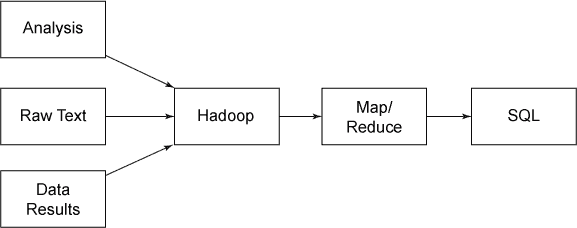
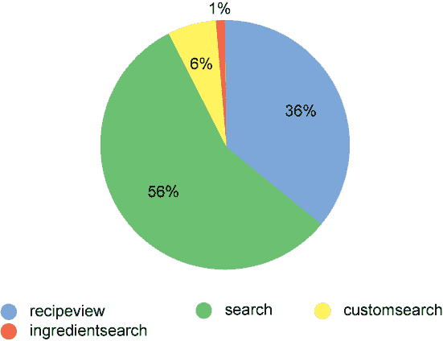
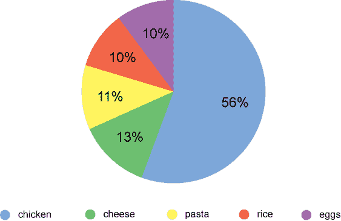

# 基本数据交换技术

> 原文：[`developer.ibm.com/zh/tutorials/bd-sqltohadoop1/`](https://developer.ibm.com/zh/tutorials/bd-sqltohadoop1/)

## 大数据和 SQL

“大数据”是近 10 年来经常被使用的一个词。它和 NoSQL 等技术一起，被视为享誉已久的使用 SQL 的 RDBMS 解决方案的替代方案。如今，DB2® 、Oracle、Microsoft® SQL Server MySQL 和 PostgreSQL 统治着 SQL 领域，仍在整体市场中占有相当大的比例。大数据和伴随它一起出现的数据库系统以及服务已成为现代系统齿轮中的额外齿轮。如何将现有的基于 SQL 的数据存储与 Hadoop 相集成，以便可以在需要它们时利用不同的技术？让我们来看看交换信息的基本架构方面，以及执行数据交换的基本技术。

## 数据和查询的考虑因素

在 SQL 与 Hadoop 之间交换信息时，最重要的考虑因素是信息的数据格式。该格式应该完全从信息的角度和导出信息的原因来确定。

简单地导出数据，然后将其导入 Hadoop 中，这不会解决任何问题。您需要准确地知道导入的信息，导入它的原因，以及您期望从该过程中获得什么。

在分析开始交换数据的具体原因之前，首先需要考虑数据交换的性质。它是单向的吗？或者它是双向的吗？

如果为了利用查询功能而传输数据，而且来源不是配套的数据库解决方案，那么单向数据交换 — 从 SQL 到 Hadoop 或从 Hadoop 到 SQL — 将会很实用。例如，纯文本数据（或者计算程序或分析程序的原始结果）可以存储在 Hadoop 中，用 MapReduce 进行处理，然后存储在 SQL 中（参见图 1）。

##### Hadoop 向 SQL 的转换



反向转换（将信息从 SQL 提取到 Hadoop 中）很少见，但可以使用它来处理提供了大量文本内容的基于 SQL 的内容，比如博客、论坛、CRM 和其他系统（参见图 2）。

##### SQL 向 Hadoop 的转换


双向数据交换更常见一些，而且在数据交换和数据处理方面提供了两个转换方向的优势（参见图 3）。

##### 双向转换


尽管有许多示例，但最常见的示例是从 SQL 中获取大型的、线性的数据集和文本数据集，并将其转换为可由 Hadoop 集群处理的摘要信息。然后，可以将摘要信息导入到 SQL 存储中。当大型数据集在 SQL 查询中的处理时间太长时，此方法特别有用。例如，包含评论分数或字数/词数的大型语料库。

##### IBM InfoSphere BigInsights

InfoSphere BigInsights 大大简化了 Hadoop 和 SQL 数据库之间的集成，因为它提供了必要的工具和机制，在不同数据库之间导出和导入数据。使用 InfoSphere BigInsights，您可以定义数据库来源、视图、查询和其他选择条件，然后自动将该信息转换为各种格式，最后将该格式集合直接导入 Hadoop 中。

例如，您可以创建一个查询来提取数据，并用记录数据填充 JSON 数组。在导出数据之后，可以创建一个作业来处理和加工该数据，然后显示它，或者导入处理后的数据并将它导回 DB2 中。

[下载 InfoSphere BigInsights Quick Start Edition](http://www.ibm.com/developerworks/downloads/im/biginsightsquick/)，这是 InfoSphere BigInsights 的一个免费的、可下载的版本。使用 Quick Start Edition，您可以尝试使用 IBM 构建的功能来提高开源 Hadoop 的价值，比如 Big SQL、文本分析和 BigSheets。

通常，在 SQL 与 Hadoop 之间建立连接有三个主要原因：

1.  **导出用于存储** — Hadoop 提供了一个实用的解决方案来将大量不常用的数据存储为一种可查询、处理和提取的格式。例如：对于通过将数据插入 Hadoop 集群中来利用 HDFS 的架构而言，使用日志、访问日志和错误信息都很实用。这种导出类型的一个辅助特性是，可以在以后处理或分析信息，并将它们转换成可再次使用的格式。
2.  **导出用于分析** — 两种常见的情况是：导出数据，以便将它们重新导入 SQL 中；导出分析输出，以便直接在您的应用程序中使用它们（例如，分析结果并将其存储为 JSON）。Hadoop 在这里具有优势，它允许对信息执行分布式大规模处理，而不是执行 SQL 中提供的单表主机处理。在分析路由中，通常会保留原始信息，但使用分析流程来提供可与原始数据一起使用的摘要或统计基础数据。
3.  **导出用于处理** — 基于处理的导出旨在利用最初的原始来源信息，处理和精减（或简化）它，然后存回该信息来取代原始数据。在已经捕获了来源信息，不再需要最初的原始信息时，这种交换类型最常见。例如，通过查找特定的事件类型或汇总数据来统计特定错误数量或发生次数，可以轻松地将各种格式的日志数据解析为更简单的结构。这里通常不需要原始数据。通过 Hadoop 精减该数据并将这些数据加载回摘要统计信息，这样做可以节省时间，并让内容更容易查询。

了解这些基本原理后，让我们来看看 SQL 与 Hadoop 之间的基本数据交换技术。

## 从 SQL 中导出数据

在从 SQL 中导出数据时，最重要的考虑因素是生成的信息的格式。因为 Hadoop 不是一个表格数据库（tabular database），所以在 Hadoop 中处理的数据选择何种灵活的格式很有意义。如果想要使用纯表格信息，一种选择是 CSV 格式，但也可以使用包含适当的分隔符或标识符的原始文本。

对于复杂的结构，采用一种允许轻松分离和分发的结构来输出信息可能更有意义。例如，生成 JSON 格式的记录数据并导出数据块，比如每个文件 10,000 条记录。使用像 JSON 这样的灵活封装格式可以解决数据交换的许多麻烦。

### 使用标准转储或查询导出

大多数 SQL 数据库和接口都有将数据导出为特定格式的方法。例如，在 MySQL 中，可以使用命令行创建一个 CSV 文件，如清单 1 所示。

##### 使用命令行创建一个 CSV 文件

```
SELECT title, subtitle, servings, description into OUTFILE  'result.csv'
FIELDS TERMINATED BY ',' FROM recipes t; 
```

在 DB2 中，存在同样的解决方案（参见清单 2）。

##### 在 DB2 中创建一个 CSV 文件

```
EXPORT TO result.csv OF DEL MODIFIED BY NOCHARDEL SELECT title, subtitle,
servings, description FROM recipes; 
```

结果文件可以通过 HDFS 直接加载到 Hadoop 中。 在 Perl、Python 或 Ruby 中，使用一个简单脚本生成相同的输出也同样很简单。

### 编写自定义程序

根据采用的数据集，使用一个自定义应用程序导出数据可能更实用。该方法对结构化数据尤其实用，在结构化数据中，您想要输出的信息是基于多个表和结构的内容。

通常，最简单的方法是获取结构化数据，协商出一种输出格式或结构（以便可以在 Hadoop 内解析它），然后转储该信息。

例如，在处理配方数据（recipe data）来查找常见主题和线索时，可以使用内部工具来加载配方记录，包括配料成分、说明、方法和其他数据，然后使用结构化的配方对象来输出该信息，以便在 Hadoop 中进行处理，并将每个配方存储为一个 JSON 对象（参见清单 3）。

##### 导出复杂数据

```
use JSON;
use Foodware;
use Foodware::Public;
use Foodware::Recipe;

my $fw = Foodware->new();

my $recipes = $fw->{_dbh}->get_generic_multi('recipe','recipeid',
    { active => 1});

my $js = new JSON;

foreach my $recipeid (keys %{$recipes})
{
    my $recipe = new Foodware::Recipe($fw,$recipeid,{ measgroup => 'Metric',
                                                      tempgroup => 'C',});

    my $id = $recipe->{title};
    $id =~ s/[ ',\(\)]//g;
    my $record = {
        _id => $id,
        title => $recipe->{title},
        subtitle => $recipe->{subtitle},
        servings => $recipe->{servings},
        cooktime => $recipe->{metadata_bytag}->{totalcooktime},
        preptime => $recipe->{metadata_bytag}->{totalpreptime},
        totaltime => $recipe->{metadata_bytag}->{totaltime},
        keywords => [keys %{$recipe->{keywordbytext}} ],
        method => $recipe->{method},
        ingredients => $recipe->{ingredients},
        comments => $recipe->{comments},
    };

    foreach my $ingred (@{$recipe->{ingredients}})
    {
        push(@{$record->{ingredients}},
             {
                 meastext => $ingred->{'measuretext'},
                 ingredient => $ingred->{'ingredonly'},
                 ingredtext => $ingred->{'ingredtext'},
             }
            );
    }

    print to_json($record),"\n";
} 
```

该数据被导出到一个包含配方数据的文件中（参见清单 4）。

##### 包含配方数据的文件

```
{
   "_id" :"WarmpotatotunaandCheshiresalad",
   "comments" : null,
   "preptime" :"20",
   "servings" :"4",
   "keywords" :[
      "diet@wheat-free",
      "diet@peanut-free",
      "diet@corn-free",
      "diet@citrus-free",
      "meal type@salads",
      "diet@shellfish-free",
      "main ingredient@fish",
      "diet@demi-veg",
      "convenience@add bread for complete meal",
      "diet@gluten-free"
   ],
   "subtitle" :"A change from cold salads...",
   "totaltime" :"35",
   "cooktime" :"15",
   "ingredients" :[
      {
         "scaled_fromqty" :100,
         "_error_ingredid" :1,
...
      }
    ]
} 
```

可以将结果直接加载到 HDFS 中，由一个合适的 MapReduce 作业进行处理，以便提取所需的信息。这种结构化方法的一个好处是，它使您能够在输出上执行任何所需的预处理，包括将信息组织成为一种可在您的 Hadoop MapReduce 基础架构中处理的格式。

短语”导入到 Hadoop 中”实际意味着您只需将信息复制到 HDFS 中就可以使用它（参见清单 5）。

##### 将信息复制到 HDFS 中

```
 hdfs dfs mkdir recipes
 hdfs dfs -copyFromLocal recipes.json recipes 
```

在复制入文件后，就可以在需要 Hadoop MapReduce 作业时使用它们。

为了在 HDFS 中获得更高的灵活性，可以将输出划分到多个文件中，而且可以加载这些文件。根据您的用例和处理需求，将数据提取到各个文件中（每条概念性记录一个文件）对分布式处理可能更高效。

## 使用 Sqoop 移动数据

Sqoop 是 Hadoop 的一个附加工具，它使用 JDBC 驱动程序连接到现有数据库，并将表或数据库直接从来源 JDBC 连接导入到 HDFS 中。对于将来自 SQL 的原始数据一字不差地导入 Hadoop 中而不进行处理的绝大多数导入而言，Sqoop 为移动数据提供了最简单、最有效的流程。例如，可以使用清单 6 加载单个数据库中的所有表。

##### 加载单个数据库中的所有表

```
$ sqoop import-all-tables --connect jdbc:mysql://192.168.0.240/cheffy
    --username=cheffy 
```

对于支持它的驱动程序，可以使用 `--direct` 选项直接读取数据，然后将其写入 HDFS 中。该过程快得多，因为它不需要中间文件。以这种方式加载数据时，可以根据表名称在 HDFS 中创建目录。例如，配方数据集中包含的是 access_log 表中的访问日志信息，导入的数据被写入到 access_log 目录中的文本文件中（参见图 7）。

##### 查看从 Sqoop 导入的数据

```
$ hdfs dfs -ls access_log
Found 6 items
-rw-r--r--   3 cloudera cloudera          0 2013-08-15 09:37 access_log/_SUCCESS
drwxr-xr-x   - cloudera cloudera          0 2013-08-15 09:37 access_log/_logs
-rw-r--r--   3 cloudera cloudera   36313694 2013-08-15 09:37 access_log/part-m-00000
-rw-r--r--   3 cloudera cloudera   36442312 2013-08-15 09:37 access_log/part-m-00001
-rw-r--r--   3 cloudera cloudera   36797470 2013-08-15 09:37 access_log/part-m-00002
-rw-r--r--   3 cloudera cloudera   36321038 2013-08-15 09:37 access_log/part-m-00003 
```

在默认情况下，这些文件被拆分为大约 30MB 大小的数据块，数据用逗号分隔（参见清单 8）。

##### 使用 CSV 转换 Sqoop 表数据

```
1,1,1135322067,09890012-11583713-542922105,recipeview,779
2,1,1135322405,09890012-11583713-542922105,recipeview,288
3,89,1135327750,26458011-11487731-455118105,search-ingredient,
4,89,1135327750,26458011-11487731-455118105,ingredient,pork
5,89,1135327750,26458011-11487731-455118105,ingredient,cheese
6,89,1135327765,26458011-11487731-455118105,recipeview,1421 
```

要选择个别表，可以使用清单 9 中的代码。

##### 选择个别表

```
$ sqoop import-all-tables --connect jdbc:mysql://192.168.0.240/cheffy --username
=cheffy  --table access_log 
```

要选择表中的个别列，可以使用清单 10 中的代码。

##### 选择个别列

```
$ sqoop import-all-tables --connect jdbc:mysql://192.168.0.240/cheffy
 --username=cheffy --table access_log --columns id,userid,operation 
```

无需单独选择表和列，一种更实用的方法是使用查询来指定要输出的信息。使用此方法时，当您使用 `--split-by` 选项将数据拆分为单个包时，必须在语句中使用 `$CONDITIONS` 语句并指定要使用的列，如清单 11 所示。

##### 指定要输出的信息

```
$ sqoop import-all-tables --connect jdbc:mysql://192.168.0.240/cheffy --username
=cheffy --query 'select recipeid,recipe,description from recipe WHERE $CONDITION'
--split-by id 
```

但是，Sqoop 的一个局限性是，它格式化和构造信息的能力有限。对于复杂数据，自定义工具的导出和加载功能可以提供更好的功能。

## 从 Hadoop 中提取数据

在处理来自 Hadoop 的原始的、经过处理的数据时，需要获得 Hadoop 作业的文件输出。与导出时一样，应该确保您的 Hadoop 作业以您可以有效读回的格式输出信息。

### 导入到 SQL

使用 CSV 既简单又直观，但对于更复杂的结构，您可能希望再次考虑 JSON 格式，因为它使整个转换和翻译过程变得非常容易。

要获取该信息，需要使用 HDFS 工具将输出文件放回您可以执行加载的文件系统中 — 例如 `$ hdfs dfs -copyToLocal processed_logs/*` 。拥有这些文件后，就可以使用适合来源信息和结构的方法来加载信息。

### 从 Sqoop 中导出

与导入过程一样，Sqoop 提供了一种将信息从 Hadoop 作业转换回 SQL 表的简化方法。

从 Sqoop 中输出结果信息时，对于最简单的导出，可以采用 CSV 格式。然后，要导入该信息，需要创建一个合适的表来接受经过处理的日志。例如，从我们的访问日志可以看出，Hadoop 输出已将该数据映射到操作次数摘要中，所以必须先创建一个合适的表： `CREATE TABLE summary_logs (operation CHAR(80), count int)` 。然后，可以直接将信息从 Hadoop 导入到您的 SQL 表中（参见清单 12）。

##### 从 Hadoop 导出到 SQL 中

```
$ sqoop export --connect jdbc:mysql://192.168.0.240/cheffy --username=root
    --export-dir processed_log --table processed_log
13/08/15 10:04:34 INFO manager.MySQLManager:Preparing to use a MySQL streaming
    resultset.
13/08/15 10:04:34 INFO tool.CodeGenTool:Beginning code generation
13/08/15 10:04:35 INFO manager.SqlManager:Executing SQL statement:SELECT t.
    * FROM `access_log` AS t LIMIT 1
13/08/15 10:04:35 INFO manager.SqlManager:Executing SQL statement:SELECT t.
    * FROM `access_log` AS t LIMIT 1
13/08/15 10:04:35 INFO orm.CompilationManager:HADOOP_MAPRED_HOME
    is /usr/lib/hadoop-mapreduce
13/08/15 10:04:35 INFO orm.CompilationManager:Found hadoop core jar at:
 /usr/lib/hadoop-mapreduce/hadoop-mapreduce-client-core.jar
Note:/tmp/sqoop-cloudera/compile/8034e8d9feb8c1b0f69a52fede8d1da7/access_log.java
    uses or overrides a deprecated API.
Note:Recompile with -Xlint:deprecation for details.
13/08/15 10:04:37 INFO orm.CompilationManager:Writing jar file:
 /tmp/sqoop-cloudera/compile/8034e8d9feb8c1b0f69a52fede8d1da7/access_log.jar
13/08/15 10:04:37 INFO mapreduce.ExportJobBase:Beginning export of access_log
13/08/15 10:04:39 WARN mapred.JobClient:Use GenericOptionsParser for parsing the
    arguments.Applications should implement Tool for the same.
13/08/15 10:04:39 INFO input.FileInputFormat:Total input paths to process :4
13/08/15 10:04:39 INFO input.FileInputFormat:Total input paths to process :4
13/08/15 10:04:39 INFO mapred.JobClient:Running job: job_201308150649_0006
13/08/15 10:04:40 INFO mapred.JobClient:map 0% reduce 0%
13/08/15 10:04:57 INFO mapred.JobClient:map 2% reduce 0%
...
13/08/15 10:08:06 INFO mapred.JobClient:
    CPU time spent (ms)=27470
13/08/15 10:08:06 INFO mapred.JobClient:
    Physical memory (bytes) snapshot=317607936
13/08/15 10:08:06 INFO mapred.JobClient:
    Virtual memory (bytes) snapshot=2076659712
13/08/15 10:08:06 INFO mapred.JobClient:
    Total committed heap usage (bytes)
    =188350464
13/08/15 10:08:06 INFO mapreduce.ExportJobBase:Transferred 139.1333 MB in
    207.5656 seconds (686.3975 KB/sec)
13/08/15 10:08:06 INFO mapreduce.ExportJobBase:Exported 2401906 records. 
```

该过程已完成。甚至在摘要级别上，也会看到 240 万条简化数据的记录，而该数据的来源内容存储的数据是该大小的大约 600 倍。

对于导入的信息，现在可以在该数据上执行一些简单快速的查询和结构化。例如，这个关键活动摘要花费了大约 5 秒时间（参见图 4）。

##### 摘要操作



在完整的数据集上，该过程花费了近 1 个小时。类似地，关于最流行搜索词汇的查询花费了不到 1 秒的时间，而不是超过 3 分钟，节省的这些时间使得在主页上包含一个查询成为可能（参见图 5）。

##### 摘要成分搜索



这些是 Hadoop 中使用的外部精简处理的简化示例，但它们有效地演示了外部接口的优势。

## 结束语

本文中的解决方案是对可导出、处理和导入到 Hadoop 的信息执行直接的、整个数据集的转储。 该过程可以是从 SQL 到 Hadoop、从 Hadoop 到 SQL 或者从 SQL 到 Hadoop 再到 SQL。只要您了解数据、它的格式，以及您想要内部处理和表示信息的方式，在基于 SQL 数据的 Hadoop 数据中导入和导出信息并不复杂。实际的转换、导出、处理和导入非常简单。

本文翻译自：[Basic data interchange techniques](https://developer.ibm.com/tutorials/bd-sqltohadoop1/)（2016-03-07）