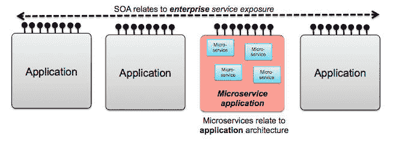
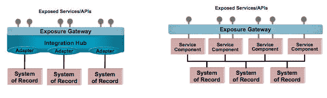
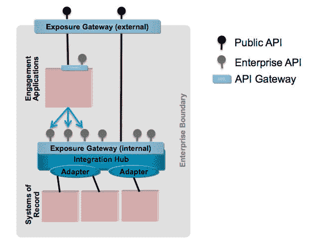
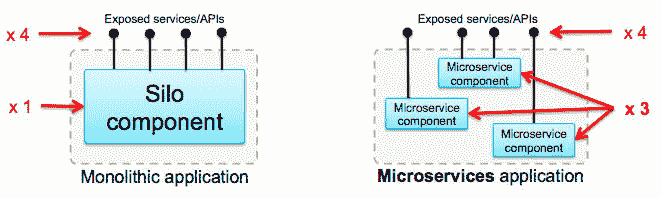
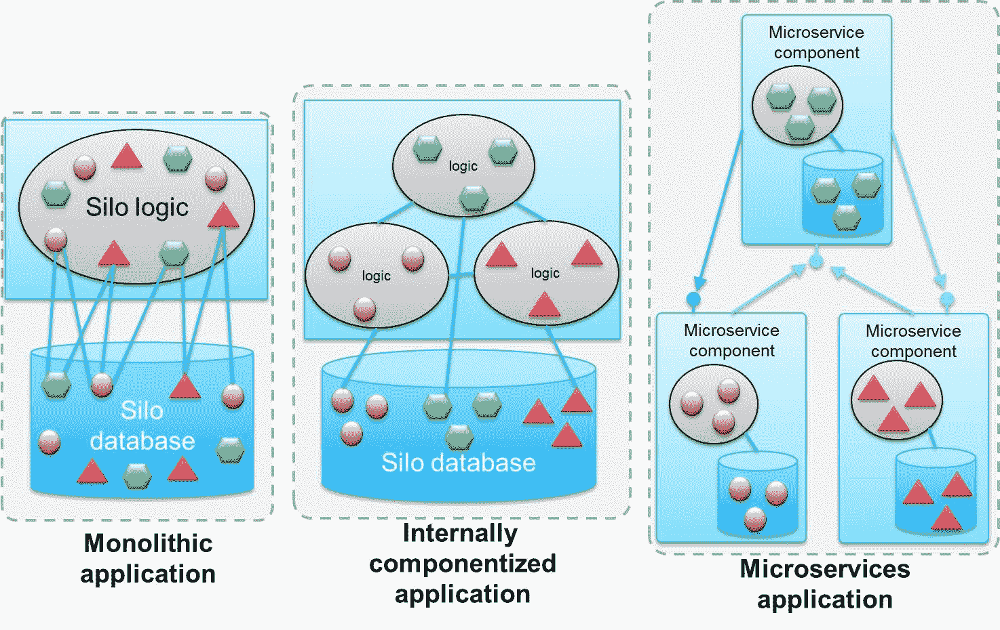
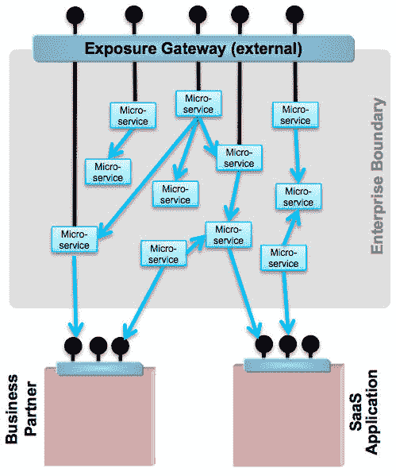
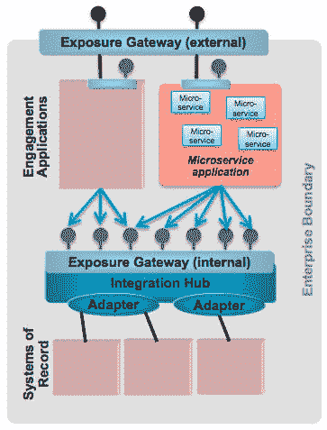
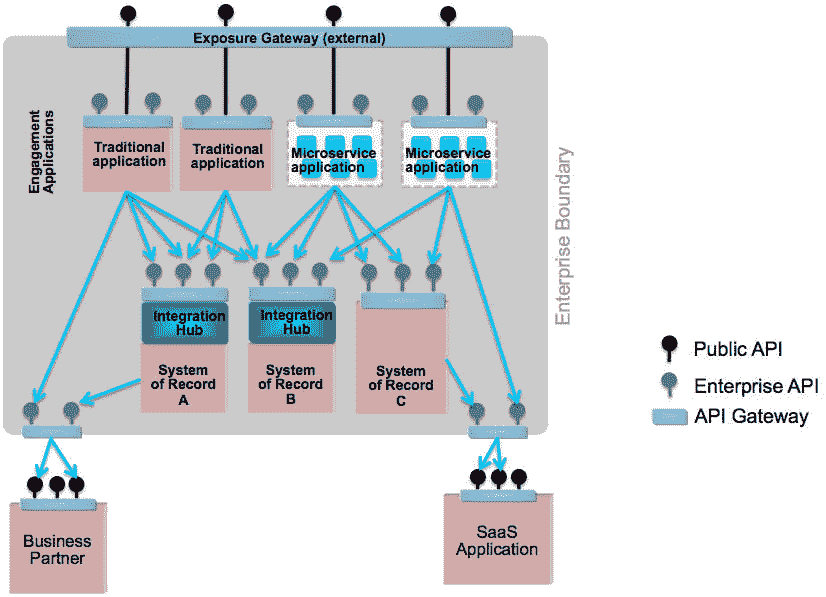

# 微服务、SOA 和 API：是敌是友？

> 原文：[`developer.ibm.com/zh/tutorials/1601_clark-trs/`](https://developer.ibm.com/zh/tutorials/1601_clark-trs/)

## 简介

在对比微服务架构和面向服务的架构（SOA）时，几乎不可能在它们彼此的关系上达成一致意见。如果应用程序编程接口（API） 再加入混战，就会让理解它们的差异变得更加困难。一些人可能会说这些概念完全不同，它们各自解决自己的一组问题，而且拥有独特的应用范围。其他人可能更宽厚，认为它们实现了类似的目标，并且具有相同的工作原理。他们可能还会说微服务架构是一种 “细粒度的 SOA” 或 “SOA 的恰当应用”。

本文将定义每个概念，解释不同观点的起源，并尝试寻找一个中间立场。本文还将分析如何将这 3 个概念组合在一起。

## 一种过于简单的观点

难以对比 SOA 和微服务的原因在于，它们的定义留有很大的解释空间。如果您仅拥有这两个概念的表面知识，可能会觉得它们很相似。一些关键方面（比如组件化、解耦和标准化通信协议）描述了最近几十年的大部分软件举措，所以我们需要进行更深入地分析。

考虑以下简单定义：

*   **微服务架构** 是一种构造应用程序的替代性方法。应用程序被分解为更小、完全独立的组件，这使得它们拥有更高的敏捷性、可伸缩性和可用性。
*   **SOA** 将应用程序的功能公开为更容易访问的服务接口，使得在下一代应用程序中使用它们的数据和逻辑变得更容易。

图 1 演示了这些定义。SOA 似乎拥有 *企业范围* ，应用程序在该范围内彼此通信。SOA 通过应用程序之间的标准化接口来公开服务。微服务架构似乎拥有 *应用程序范围* ，仅关注一个应用程序内的结构和组件。

##### 图 1\. 微服务架构与 SOA 之间的区别

这些 SOA 和微服务的定义过于简单。事实上，它们之间的关系要复杂得多。

## SOA 举措的分裂

在更详细地分析 SOA 时，您可以看到它的原始意图不仅仅是将接口公开为 SOAP Web 服务。SOA 基于两种观点，它们满足了不同的需求。

### 集成引导的技术元素

第一种观点包括需要深入集成到现有系统的复杂的专用数据格式、协议和传输机制中。然后需要使用标准化的机制（比如 SOAP/HTTP 或最近的 JSON/HTTP）来公开它们，使它们更易于在新应用程序中重用。这种观点如 图 2 的左侧所示。此观点的部分或全部通常被称为 *企业服务总线 (ESB) 模式* 。但是，这个词被随意使用，以至于失去了它原有的意义。

执行深入集成（集成中心或适配器）和以标准化方式（公开网关）将这些集成公开为服务或 API 的需求是必不可少的。这个方面与集成挑战密切相关，与应用程序设计也有一点关联。因此它似乎与微服务应用程序架构没什么关系。

#### 业务引导的功能元素

第二种观点来自业务角度。关注点是：当前系统上的接口很大程度上没有什么意义。它们对业务没有意义，它们没有提供下一代应用程序所需的东西。它们的粒度可能太细了，公开了系统内太多的复杂数据模型。所需的数据可能分散在多个系统中。数据模型可能不同于业务部门使用的术语。

该需求要求重构功能，以便公开一些业务人员可切实构建到未来解决方案中的东西。这种重构要求创建新的应用程序，将跨现有的记录系统的请求绑定在一起。在 SOA 参考架构中，这些应用程序通常称为 *服务组件* （图 2 的右侧）。这种观点表达了与应用程序设计（进而与微服务架构）和功能分解为单独组件的过程的关系。

##### 图 2\. SOA 的技术和功能观点

#### 混合这些观点的挑战

组织在哪种观点具有更大挑战的看法上存在差异。对于某些组织，他们最大的挑战是集成的多样性和复杂性。对于其他组织，重构和重新布局来实现正确的业务功能是主要的挑战。图 2 显示了依据您认为哪种挑战占主导，对这个问题的看法有何不同。

对许多组织而言，挑战在于两种观点的混合让人感到很痛苦。痛苦的原因是很难将两种观点合并到单个行动过程中。集成工具不是执行业务逻辑的正确位置。相反地，您不希望您的业务应用程序充斥着技术集成问题。

大多数 SOA 程序的目标都是实现功能方面。它们想获得能够轻松访问的、可用来更有效地构建新应用程序的业务相关服务。但是，许多组织耗尽了精力，或者更常见的是预算不足，而技术集成难题仍未解决。在大型企业中，SOA 通常被认为是失败的。这种想法可能是对的，因为它们未能提供最终的业务价值，尽管付出了巨大努力来改进记录系统的可访问性。但是，在较小的公司（或大型公司中更受限的环境）中，SOA 常常声称真正取得了业务成功，因为它们可快速克服集成问题，并将此转变为功能收益。

这两种 SOA 观点使得与微服务的对比变得很困难。

## API 与 SOA 公开的服务的对比

API 通常代表着低级编程代码接口。在最近几年，这个词被再次挪用，用来表示通过 HTTP 提供的简单接口。通常它等同于 *REST 接口* ，这些接口使用 JSON 数据格式（有时为 XML）来提供数据，使用 HTTP 动词 PUT、GET、POST 和 DELETE 来描述创建、读取、更新和删除操作。与早期 SOA 中更流行的基于 SOAP 的 Web 服务标准相比，这些协议和数据格式在使用上更加简单。另外，它们更适合 JavaScript 等在创建 API 请求时常用的语言。

但是，SOA Web 服务与 API 之间的区别不是由协议和数据格式来定义的，因为二者没有一致地使用它们。区别在于 API 和 SOA 服务背后的意图。一个关键区别是它们的经济学原理。

### 可重用的 SOA

在 SOA 程序中，公开服务旨在公开每个业务功能，以便服务可得到尽可能多的重用。这样，每个新项目就不需要经历再次与后端系统执行集成的痛苦。典型的用户是尝试将全新的用户界面放在旧记录系统上的内部应用程序。在这样做时，集成非常困难，而且会花费很大一部分的 IT 项目预算。如果可以通过可重用的接口公开公司的所有核心功能，就可以大大削减项目成本。SOA 旨在节省成本，而不是创造新收入。

API 拥有不同的出发点，它假设集成已被简化。这种简化是通过早期的一项 SOA 举措或通过升级后端系统提供更容易使用的现代接口来实现的。新的挑战是为潜在的用户设计一个有吸引力的接口。API 是为可能使用它们的上下文而设计的。例如，它们非常适合提供一种特定类型的移动应用程序所需的数据。

#### API 管理的黎明

随着智能电话使用量增长，API 的受欢迎程度也在迅速增长。智能电话运行着丰富的客户端应用程序，创造了一种颠覆性的新业务渠道。因此，应用程序开发人员需要简单地访问后端功能和数据；他们需要 API。API 变成一种畅销的产品，API 提供者为吸引开发人员的注意而展开激烈的竞争。API 的关注点不是 SOA 所关注的重用和成本节省。它的关注点是可使用性以及参与 API 经济中的竞争。API 是一种畅销产品。

与 SOA 服务相比，这一动态变化改变了对 API 的技术需求。API 需要复杂的门户，以便开发人员能够发现和试验 API。它们还需要一些机制来供开发人员注册使用和付费购买 API。API 提供者需要能够设置支付计划来适应各种 API 使用率。因为 API 是公开的，所以公开网关需要强大的安全功能。所有这些特性都需要是自助服务，而且最重要的是简单。此变化引入了一种现在称为 *API 管理* 的全新 IT 功能。

为此，API 的关注点是作为某种向外部用户公开的功能；API 与内部 SOA 服务之间的分界线已变得很明确。随着 API 管理技术日渐成熟，API 已带来了诸如易用性和自我管理等收益。结果，许多公司现在还希望使用 API 技术和协议来公开公司内部的服务，如 图 3 所示。SOA Web 服务和 API 之间的界线现在已经变得有些模糊，而且几乎无关紧要。它们在起源、向哪些用户公开和使用的数据模型上不同，但许多 SOA “服务” 也可以描述为内部 API。

##### 图 3\. 向内和向外公开 API

如今， *API* 这个词通常用于指代任何通过 REST (HTTP/JSON) 或 Web 服务（SOAP/HTTP） 公开的接口。API 通常按其范围进行分类，比如公共 API 或企业 API。维持 SOA 举措的企业有时会为内部、企业级 API 保留 “服务” 这个词。有关 SOA 和 API 之间的区别的更多信息，请参阅 [*集成架构：对比 Web API 与面向服务的架构和企业应用程序集成*](https://www.ibm.com/developerworks/cn/websphere/library/techarticles/1503_clark/1305_clark.html) 。

*API* 这个词表示 SOA 的 “服务公开” 方面的一次进化。它使用更简单的协议，更加精于公开本身，包括开发人员门户、策略控制和自我管理。

## 微服务：一种替代性架构

在考虑对比微服务和 SOA 之前，需要理解微服务架构的含义。从基本角度讲，微服务是构建 *应用程序* 的替代性架构。它们提供了更好的方法来解耦应用程序边界 *内* 的组件。事实上，如果将微服务称为 “微型组件”，它们的实际性质会更加明确。

应用程序的边界保持相同。如图 4 所示，尽管应用程序在内部被分解为不同的微服务组件，但从外部来看，应用程序仍是相同的。基于微服务的应用程序公开的 API 的数量和粒度不应与将 API 构建为孤立应用程序有任何不同。 *微服务* 中的第一个词 “微型” 表示内部组件的粒度，而不是公开的接口的粒度。

##### 图 4\. 微服务应用程序在应用程序边界上公开与孤立应用程序相同的接口

在应用程序内从逻辑上分离组件不是一个新概念。多年以来，大量不同的技术被开发出来，用于实现整个应用程序的各部分的干净分离。应用服务器可在其内部长期运行多个应用程序组件，如图 5 中的中图所示。微服务更进一步，在这些应用程序组件之间进行了绝对隔离。它们变成网络上单独运行的流程，如图 5 中的右侧所示。为了实现解耦，您还应分割您的数据模型来与微服务保持一致。

##### 图 5\. 从单个庞大的应用程序到微服务

## 微服务的优势

完全独立的微服务组件有助于实现完全自主的所有权，带来以下优势：

*   **敏捷性和生产力** 。开发微服务的团队可以完全理解代码库。他们可以在快得多的周期中与其他组件独立地构建、部署和测试代码库。因为微服务组件只是网络上的另一个组件，所以您可以采用最适合所需功能的语言或框架来编写它，并采用最合适的持久性机制。

    这种方法可显著减少要编写的代码量，使维护得到显著简化。它可以确保团队能够根据需要采用新技术或现有技术的新版本，而不是等待应用程序域的剩余部分跟上节奏。对于微服务粒度的定义，微服务组件应足够简单，以便在必要时在其下一次迭代中重写。

*   **可伸缩性** ：微服务开发团队可以在运行时与其他组件独立地扩展微服务组件，实现资源的高效使用和对工作负载变化的快速反应。从理论上讲，一个组件的工作负载可以转移到对任务最合适的基础架构上。它还可以与剩余组件独立地重新放置，以便充分利用网络位置。精心编写的微服务提供了非凡的按需可伸缩性，这一领域的早期创新者和采用者已证明这一点。这些微服务也得到了最佳布置，以便充分利用弹性功能，以富有成本效益的方式访问大量资源的原生云环境。
*   **恢复能力** ：独立的运行时可以立即提供与其他组件中的故障独立的恢复能力。借助小心地解耦的设计，比如避免同步依赖关系和使用断路器模式，可以编写每个微服务组件来满足自己的可用性需求，而不是在整个应用程序域中引入这些需求。容器等技术和轻量型运行时使微服务组件能够快速且独立地失败，而不是让所有不相关的功能区域都失效。同样地，它们是以一种高度无状态的方式编写的，以便可以立即重新分布工作负载并几乎同时地调出新运行时。

这些优势的示例是组织转而使用微服务的一些最常见的原因。

## 选择微服务时要考虑的关键因素

在决定是否将应用程序编写为微服务时，必须理解以下因素，以确保您的组织准备好处理它们：

*   **新技术模式** 。微服务是一种完全不同的应用程序构建方法。因为它们在网络上，所以它们需要网络上的一组全新的组件。一些支持技术已经存在，包括服务发现、工作负载编排、容器管理和日志框架。但是，您必须将它们放入一个紧密结合的集合中，这需要大量实验、技能和经验。您必须确定满足您的需求的完美的微服务设置的构成要素，它们可能与其他企业的微服务不同。
*   **应用程序适合性** 。微服务并不适合每个应用程序。目前微服务社区中的一种悖论是，让新的、相对简单的、具有高度凝聚性数据模型的应用程序采用微服务的概念，这样做不会获得任何优势。另外，将一个复杂的现有应用程序重构到微服务架构中是一项繁重的工作。

    如果不是在旧版或新式应用程序上，您会何时使用微服务？一种 [建议](https://martinfowler.com/bliki/MicroservicePremium.html) 是，在以传统方式编写的应用程序达到复杂性的拐点之前，不要使用微服务。但是，要让此方法发挥作用，则需要从一开始就编写一个适当构建的应用程序，并选择在正确的时刻执行过渡。

*   **不同的设计范例** 。微服务应用程序架构需要不同的设计方法。要从微服务方法获得最佳结果，您可能需要：

    *   接受最终的一致性模型，而不是您所习惯的事务性交互。
    *   理解如何处理没有中央操作数据存储的事件源应用程序。

    您还需要：

    *   如果需要利用重要的快速可伸缩性优势，请确保您的应用程序逻辑是无状态的。
    *   如果将您自己与下游组件分离，则需要熟悉异步通信的细微的潜在副作用。
    *   理解实现断路器模式的逻辑后果。
    *   认识到 HTTP/JSON 通信相比于进程中通信的错误处理限制。
    *   考虑链式交互中的网络延迟。
*   **DevOps 成熟性** 。微服务需要一种成熟的交付能力。持续集成、部署和全自动测试都必不可少。编写代码的开发人员必须负责代码的生产部署。构建和部署链需要重大更改，以便为微服务环境提供正确的关注点分离。

如果熟悉这些因素，您可能有机会获得微服务应用程序架构的重要优势。

## 微服务如何融入到 SOA 环境和集成挑战中

如果我们 SOA 的心理模式注重集成方面，那么微服务是完全分离的。它是编写集成架构尝试连接的应用程序的一种替代方法，如 图 1 所示。

但是，如果我们的 SOA 的心理模式注重将应用程序重新布局为对业务更有意义的 “服务组件”， 图 2 中的右侧显示的服务组件可能看起来更像微服务组件。微服务架构现在可视为 SOA 的一次进化。为了演示这一点，让我们对比一下两个极端。

首先，考虑一家新的创业公司，该公司对一种完全在线的产品（比如社交媒体或交易）有一种新想法。因为它最初没有现有的架构可用，所以该公司必须创建一套新应用程序来满足该业务的独特方面。然后，该公司可以选择将非核心增值业务的部分业务外包，并使用软件即服务 (SaaS) 应用程序来提供客户关系管理功能。

从很大程度上讲，该公司的格局可能会从头建立。主要关注点可能是它在一个持续可用的环境（绿场的概念）中以极少的宕机时间快速添加新功能的能力。该公司可能想根据无法预测的客户需求来实现灵活的伸缩（即扩展和精减）。它可能希望实现一种全天候的、高度可用的在线存在感。

微服务架构是该公司的许多格局的逻辑选择，如图 6 所示。

##### 图 6\. 一个绿场站点中的微服务架构

新应用程序可能位于单个微服务框架中，该框架提供了非功能性能力，比如可伸缩性、可用性和资源管理。您可能预料到低级集成问题很少，因为所有微服务组件和所涉及的 SaaS 应用程序都将使用常见的协议（比如 HTTP/JSON API）进行通信。SOA 公开宝贵的功能的一个关键目标是，为了它可以在整个企业中得到结合使用。在这个示例中，精心实现的 SOA 和微服务架构之间的界线已变得模糊。如果想象一下 SOA 的完美实现，它可能看起来和这个示例一样，但只有新公司能够创建这种性质的架构。

本文不会探讨 SOA “服务组件” 是否在大小上与微服务组件相当。微服务组件的粒度和它们的分组方式完全是另一个话题。

现在我们来考虑一个相反的示例，一家已经发展起来的大型公司，几十年来它已经建立了自己的 IT 格局。这个企业可能是一家传统的银行或保险公司，可能拥有数百或者甚至数千个重要应用程序是使用可追溯到数十年前的技术构建的。该企业内可能拥有严格的部门划分，比如医疗、养老金和一般保险，或者零售和投资银行。每个业务部门可能都拥有专门处理其核心业务的独立应用程序。这些部门还可能有一套应用程序，比如对于人力资源，其应用程序会尽可能共享。

该公司可能是通过并购竞争对手发展起来的。在该格局中，您会发现应用程序之间存在大量的数据重复。根据最初为客户服务的公司，客户帐户可能分散在许多系统中。同一个客户在多个系统中的关联性可能不是很直观。这些后端应用程序通常很难在内部进行更改。在此环境中，SOA 的一项艰巨任务就是将后端系统重新想象为对未来的业务需求更有用的某种东西。

集成挑战也很复杂。它可能需要集成工具（如图 7 所示），使得人们在存在协议、传输和数据格式上的挑战的情况下，仍能访问来自后端应用程序的数据和功能。主要出于历史原因，这种集成做法通常被打上 “SOA” 的标签，尽管它仅关注一半的 SOA 挑战。它被标为 SOA 是因为集成是大多数 SOA 举措处理的第一个区域。在许多情况下，这是他们在可用资金范围内完成的全部工作。

##### 图 7\. 格局中包含微服务的大型企业

但是，公司需要使用 SOA 实现的另一个方面是，将数据和功能改造为更加以业务为中心的功能。他们需要确定如何满足移动等新渠道，这些渠道需要使用与传统应用程序完全不同的服务粒度。为了实现这些方面，公司需要提供当前系统中可能没有的响应能力、可用性和可伸缩性。必须编写应用程序，以一种特殊风格满足这些新渠道，这种风格支持快速的敏捷变更，提供了极高的可伸缩性，而且提供了卓越的可用性。

人们很容易看到对这些新应用程序使用微服务架构的吸引力。如 图 7 所示，大型企业中对微服务的初始使用专注于新的互动参与体系应用程序。SOA 概念可能被早期的以集成为中心的工作所影响。因此，微服务通常被视为不同于 SOA，它提供了更高的敏捷性、可伸缩性和响应能力，但在许多情况下，这些取决于 SOA 的集成阶段的基础工作。

## 在未来将微服务、SOA 和 API 组合在一起

从架构的角度讲，SOA 有 3 个关键元素：

*   **深入集成** 使老化的系统能够公开其数据和功能，以便使用一个接口来发现这些数据和功能
*   **服务公开** 标准化并简化这些接口向更广泛的受众公开的方式
*   **服务组件** 将接口进一步组合到更宝贵的业务资产中

这 3 种元素仍会存在于未来的架构中，但它们一定会分散在整个格局中，如 图 8 所示。

### 深入集成

一些系统仍需要集成中心所提供的深入集成功能，以便将它们的基础功能和数据公开为 API。其他系统可能能够在升级到新版本时直接提供 API。当 SOA 倾向于将深入集成功能整合到一个集中化功能中时，关键区别就会显现出来。更高级的工具和技术应支持集成，以便更频繁地与应用程序所有者进行联合，如图 8 中的集成中心的位置所示。

##### 图 8\. 微服务、SOA 和 API 的组合

#### 服务公开

此外，所有系统只要想要保持关联，都需要提供 API。应用程序级 API 需要一个轻量型的控制层，如 图 8 中的 API 网关所示。这个控制层是来自 SOA 的服务公开概念的一种演化。它已变成更广泛、更分散化的 API 公开。

API 网关和管理功能可能是整个企业的一种通用资源。它是 “分散化的”，应用程序团队可以自行发布 API，同样也可以自行订阅他们所需的 API，而不再需要一个额外的团队。您可以在整个企业中以标准方式获得标准化的流量管理和监视、日志记录、审计和安全性机制，同时保留业务人员所需的敏捷性。这些相同的 API 网关也可用来帮助管理与业务合作伙伴和外部 SaaS 功能的交互。

#### 服务组件

传统的、更加孤立的应用程序仍适合一些实现。但是，微服务提供了一种构建某些类型的应用程序的替代方法，提供了传统应用程序无法提供的敏捷性、可伸缩性和恢复能力。微服务应用程序在互动层最常见，这一层最需要它们的具体特征，支持创建新的特定于渠道的功能和面对互联网的 API。

## 结束语

对于 SOA 打算实现的目标，至少有两种不同的观点。SOA 与微服务架构之间的直接对比可能充满困难。SOA 的概念存在于现代架构中，但已通过多种方式发生了演变。集成工具、模式和标准也已发生演变，所以功能和数据更容易公开。服务公开已演变为 API，简化了公开、使用、管理，在某些情况下，还可以从业务功能中牟利。新应用程序架构（包括微服务架构）使得开发人员能够更密切地关注业务逻辑，不断将基础架构细节推送到他们所在的环境。这些开发方式的组合有助于以更敏捷的风格构建解决方案，有助于应用程序获得全新的弹性可伸缩性和容错水平。

## 致谢

感谢以下人员为本文的材料提供的建议和评审：Andy Garratt、Andy Gibbs、Carlo Marcoli 和 Brian Petrini。

本文翻译自：[Microservices, SOA, and APIs: Friends or enemies?](https://developer.ibm.com/tutorials/1601_clark-trs/)（2016-01-21）