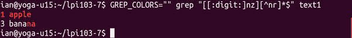

# 使用正则表达式搜索文本文件

> 原文：[`developer.ibm.com/zh/tutorials/l-lpic1-103-7/`](https://developer.ibm.com/zh/tutorials/l-lpic1-103-7/)

## 概述

本教程将介绍使用正则表达式搜索文本文件的基础 Linux 技术。学习如何：

*   创建简单的正则表达式
*   使用正则表达式搜索文件和文件系统
*   结合使用正则表达式和 sed

本教程帮助您对 Linux Server Professional (LPIC-1) 考试 101 的主题 103 中的目标 103.7 进行应考准备。该目标的权重为 2。

## 正则表达式

正则表达式起源于计算机语言理论。大多数计算机科学系的学生都知道，通过正则表达式表示的语言与通过有限自动机 (finite automata) 接受的语言完全相同。本教程中介绍的正则表达式能够表达更高的复杂性，所以与您在计算机科学课程中学到的正则表达式可能 **不同** ，但继承关系很清楚。

##### 关于本系列

本教程系列帮助学习 Linux 系统管理任务。您还可以使用这些教程中的资料对 [Linux Professional Institute 的 LPIC-1：Linux 服务器专业认证考试](http://www.lpi.org)进行应考准备。

请参阅 [*学习 Linux，101*：LPIC-1 学习路线图](http://www.ibm.com/developerworks/cn/linux/l-lpic1-map/)”，查看本系列中每部教程的描述和链接。这个路线图正在开发之中，它反映了 2015 年 4 月 15 日更新的 4.0 版 LPIC-1 考试目标。在完成这些教程后，会将它们添加到路线图中。

*正则表达式* （也称为 “regex” 或 “regexp”）是一种描述文本字符串或 *模式* 的方式，这样程序就可以将该模式与任意文本字符串 *相匹配* ，提供非常强大的搜索能力。 `grep` （表示 *g* eneralized *r* egular *e* xpression *p* rocessor，通用正则表达式处理器）是任何 Linux 或 UNIX® 程序员或管理员工具箱中的标配，可以帮助您在文件搜索或命令输出中使用正则表达式。在教程 “[学习 Linux 101：文本流和过滤器](http://www.ibm.com/developerworks/cn/linux/l-lpic1-v3-103-2/) ” 中，我们介绍了 `sed` （ *s* tream *ed* itor，流编辑器），它是另一个广泛使用正则表达式来查找和替换文件或文本流中的文本的标准工具。本教程将帮助您更好地理解 `grep` 和 `sed` 使用的正则表达式。另一个广泛使用正则表达式的程序是 `awk` 。

与本教程系列的其他部分一样，正则表达式和计算机语言理论足够写一本书。请参见 参考资料 来获得一些建议。

在学习正则表达式后，您将看到正则表达式语法与教程 “[学习 Linux 101：文件和目录管理](http://www.ibm.com/developerworks/cn/linux/l-lpic1-v3-103-3/) ” 中讨论的通配符（或 globbing）语法之间的一些相似性。这些相似性只是表面上的。

### 前提条件

要从本系列教程中获得最大收获，您应该掌握 Linux 的基本知识和一个正常工作的 Linux 系统，您可以在这个系统上实践本教程中涵盖的命令。有时程序的不同版本将得到不同的输出格式，所以您的结果可能并不总是与这里给出的清单和图完全相同。这里给出的示例中的结果是在 Ubuntu 15.04 发行版上获得的。本教程建立在之前的教程 “[学习 Linux 101：文本流和过滤器](http://www.ibm.com/developerworks/cn/linux/l-lpic1-v3-103-2/) ” 中讨论的概念之上。

## 设置示例

在本教程中，我们将使用教程 “[学习 Linux 101：文本流和过滤器](http://www.ibm.com/developerworks/cn/linux/l-lpic1-v3-103-2/) ” 中创建的一些文件来练习命令。如果还没有创建这些文件或没有保存您使用的文件，可以首先在您的主目录 lpi103-7 中创建一个新子目录，然后在其中创建必要的文件。为此，可以打开一个文本窗口，使用您的主目录作为当前目录。然后将 创建示例文件 的内容复制到窗口中，以便运行创建 lpi103-7 子目录和您将使用的文件的命令。 **提示：** 在大多数 X 视窗系统中，按住鼠标中键会将选定的文本粘贴在光标位置。选定的文本可以位于同一个或另一个窗口中。

##### 创建示例文件

```
mkdir -p lpi103-7 && cd lpi103-7 && {
 echo -e "1 apple\n2 pear\n3 banana" > text1
 echo -e "9\tplum\n3\tbanana\n10\tapple" > text2
 echo "This is a sentence. " !#:* !#:1->text3
 split -l 2 text1
 split -b 17 text2 y;
 cp text1 text1.bkp
 mkdir -p backup
 cp text1 backup/text1.bkp.2
 } 
```

您的窗口应类似于 创建示例文件 — 输出 ，您的当前目录现在应是新创建的 lpi103-7 目录。

##### 创建示例文件 — 输出

```
ian@yoga-u15:~$ mkdir -p lpi103-7 && cd lpi103-7 && {
> echo -e "1 apple\n2 pear\n3 banana" > text1
> echo -e "9\tplum\n3\tbanana\n10\tapple" > text2
> echo "This is a sentence. " !#:* !#:1->text3echo "This is a sentence. " "This is a sentence. " "This is a sentence. ">text3
> split -l 2 text1
> split -b 17 text2 y;
> cp text1 text1.bkp
> mkdir -p backup
> cp text1 backup/text1.bkp.2
> }
ian@yoga-u15:~/lpi103-7$ 
```

## 正则表达式构建块

大多数 Linux 系统上提供的 GNU grep 程序都使用了以下两种形式的正则表达式语法： *基本* 和 *扩展* 语法。对于 GNU grep，在功能上没什么不同。这里将介绍基本语法，以及它与扩展语法之间的区别。

正则表达式是从 *字符* 和 *运算符* 构建的，并通过 *元字符* 来扩充。大部分字符都匹配自己，大部分元字符必须使用反斜杠 () 来转义。基本操作是：

*   **串联**: 串联两个正则表达式来创建一个更长的表达式。例如，正则表达式 **a** 将匹配字符串 **abcdcba** 两次（第一个和最后一个 **a** ），正则表达式 **b** 也是如此。但是， **ab** 仅匹配 **ab** cdcba， **ba** 仅匹配 abcdc **ba** 。
*   **重复**: 克莱尼星号或重复运算符将匹配前一个正则表达式 0 次或多次。因此，像 **a*b** 这样的表达式将匹配任何在 **a** 后以 **b** 结尾的字符串，包括 **b** 本身（这是 0 个 **a** 后跟 **b** 的字符串）。克莱尼星号 *不需要转义，所以，想要匹配一个文字星号 (*) 的任何表达式都必须将星号转义。这里的 * 的用法不同于通配符中的用法，后者可以匹配任何字符串。
*   **交替**: 交替运算符 (|) 匹配前一个或后一个的表达式。它在基本语法中必须转义。例如表达式 **a*|b*c** 将匹配一个包含任意多个 **a** 或包含任意多个 **b** （但不能同时包含二者）且以一个 **c** 结尾的字符串。同样地，它将匹配单字符 **c** 。

您通常需要引用正则表达式来避免 shell 扩展。

## 搜索文件和文件系统

我们将使用之前创建的文本文件作为示例（参阅 “设置示例 ”）。分析 简单的正则表达式 中的简单示例。请注意， `grep` 获取一个正则表达式作为必需参数，并包含要搜索的 0 或多个文件的列表。如果未提供文件，grep 将会搜索 stdin，这使它成为一个可以在管道中使用的过滤器。如果任何行都不匹配，则 `grep` 没有输出，但可以测试它的退出代码。

##### 简单的正则表达式

```
ian@yoga-u15:~/lpi103-7$ grep p text1
1 apple
2 pear
ian@yoga-u15:~/lpi103-7$ grep pea text1
2 pear
ian@yoga-u15:~/lpi103-7$ grep "p*" text1
1 apple
2 pear
3 banana
ian@yoga-u15:~/lpi103-7$ grep "pp*" text1
1 apple
2 pear
ian@yoga-u15:~/lpi103-7$ grep "x" text1; echo $?
1
ian@yoga-u15:~/lpi103-7$ grep "x*" text1; echo $?
1 apple
2 pear
3 banana
0
ian@yoga-u15:~/lpi103-7$ cat text1 | grep "l\|n"
1 apple
3 banana
ian@yoga-u15:~/lpi103-7$ echo -e "find an \ns* here" | grep "s\*" 
```

从这些示例可以看到，您有时会获得出乎意料的结果，尤其在使用重复运算符时。您可能预计 **p*** 或者至少 **pp*** 与两个 **p** 匹配，但 **p*** 和 **x*** 匹配文件中的每一行，因为 *运算符匹配前一个正则表达式 **0** 次或多次。

两个示例演示了 grep 的退出代码。如果找到一个匹配值，则返回值 0，如果未找到匹配值，则返回值 1。发生错误时，可能会返回大于 1 的值（GNU grep 始终为 2），比如您尝试搜索的文件不存在。

### 第一篇快捷键

现在您已经可以将正则表达式的基本构建块用于 `grep` ，这是一些方便的快捷键。

*   **+**: + 运算符就像 *运算符一样，但它匹配前一个正则表达式的 **一次** 或多次出现。它在基本表达式中必须转义。
*   **?**: ? 表示前一个表达式是可选的，因此它表示匹配 0 次或 1 次。这与通配符中使用的 ? 不同。
*   **.**: .（句点）是一个表示任何字符的元字符。最常用的一种模式是 **.*** ，它匹配包含任意字符（或完全不含字符）的任意长度的字符串。不用说您就已经明白，它会用在较长的表达式中。比较句点与通配符中使用的 ?，以及 . *与通配符中使用的* 。

##### 更多正则表达式

```
ian@yoga-u15:~/lpi103-7$ grep "pp\+" text1 # at least two p's
1 apple
ian@yoga-u15:~/lpi103-7$ grep "pl\?e" text1
1 apple
2 pear
ian@yoga-u15:~/lpi103-7$ grep "pl\?e" text1 # pe with optional l between
1 apple
2 pear
ian@yoga-u15:~/lpi103-7$ grep "p.*r" text1 # p, some string then r
2 pear
ian@yoga-u15:~/lpi103-7$ grep "a.." text1 # a followed by two other letters
1 apple
3 banana 
```

### 匹配一行的开头或末尾

^（脱字符）匹配一行的开头，而 $（美元符号）匹配一行的末尾。所以 **^..b** 匹配一行开头任何后跟 **b** 的两个字符，而 **ar$** 匹配任何以 **ar** 结尾的行。正则表达式 **^$** 匹配任何空行。

### 更复杂的表达式

目前我们已看到了应用于单个字符的重复运算符。如果您想搜索一个多字符串的一个或多个出现位置，比如 b **anan** a 中出现了两次的 **an** ，可使用圆括号，圆括号在基本语法中必须转义。类似地，您可能希望搜索一些字符，但不使用 . 这么通用的或交替这么冗长的运算符。可以将交替表达式放在方括号中 ([])，这样它们就不会针对常规语法而进行转义。方括号中的表达式构成了一个 *字符类* 。除了稍后介绍的一些例外情况之外，使用方括号还可以消除转义 . 和 * 等特殊字符的需要。

##### 圆括号和字符类

```
ian@yoga-u15:~/lpi103-7$ grep "\(an\)\+" text1 # find at least 1 an
3 banana
ian@yoga-u15:~/lpi103-7$ grep "an\(an\)\+" text1 # find at least 2 an's
3 banana
ian@yoga-u15:~/lpi103-7$ grep "[3p]" text1 # find p or 3
1 apple
2 pear
3 banana
ian@yoga-u15:~/lpi103-7$ echo -e "find an\ns* here\nsomewhere." | grep "s[.*]"
s* here
ian@yoga-u15:~/lpi103-7$ echo -e "find a\n . or * in position 2." | grep "^.[.*]"
. or * in position 2. 
```

字符类还有其他一些有趣的可能用法。

*   **范围表达式**: 范围表达式是两个由 -（连字符）分开的字符，比如 0-9 表示数字，或者 0-9a-fA-F 表示十六进制数。请注意范围依赖于语言环境。
*   **命名类**: 一些命名类提供了常用类的方便的简略表达方式。命名类以 [: 开头并以 :] 结束，可用在括号表达式内。一些例子：

*   **[:alnum:]**: 字母数字字符。

*   **[:blank:]**: 空格和制表符字符。
*   **[:digit:]**: 数字 0 到 9（等效于 0-9）。
*   **[:upper:] 和 [:lower:]**: 分别表示大写和小写字母。

*   **^（求反）**: 用作字符类中 [ 后的第一个字符时，^（脱字符）对剩余字符的含义求反，所以仅在一个字符（除前导的 ^ 外） **不在类中** 时才发生匹配。

考虑到上面的特殊含义，如果想要匹配一个字符类中的文字 -（连字符），必须将它放在开头或末尾处。如果想要匹配文字 ^（脱字符），那么不能让它成为第一个字符。]（右方括号）结束该类，除非它放在第一位。

字符类是正则表达式和通配符比较 **相似** 的一个地方，但求反不同（^ 与 .!）。 更多字符类 给出了字符类的一些示例。

##### 更多字符类

```
ian@yoga-u15:~/lpi103-7$ # Match on range 3 through 7
ian@yoga-u15:~/lpi103-7$ echo -e "123\n456\n789\n0" | grep "[3-7]"
123
456
789
ian@yoga-u15:~/lpi103-7$ # Find digit followed by no n or r till end of line
ian@yoga-u15:~/lpi103-7$ grep "[[:digit:]][^nr]*$" text1
1 apple
ian@yoga-u15:~/lpi103-7$ # Find a digit, n, or z followed by no n or r till end of line
ian@yoga-u15:~/lpi103-7$ grep "[[:digit:]nz][^nr]*$" text1
1 apple
3 banana 
```

最后一个示例是否出乎您的意料？在这种情况下，第一个括号表达式匹配字符串中的 **任何** 数字，n 或 z，最后一个 n 后没有另一个 n 或 r，所以字符串末尾的 na 与该正则表达式相匹配。

### 哪些内容匹配？

如果您能够区分突出显示，比如颜色、加粗或下划线，那么您可以设置 GREP_COLORS 环境变量来突出显示非空匹配。默认设置以加粗的红色来突出显示匹配，如 为 grep 匹配使用颜色 中所示。可以看到输出中的整个第一行都匹配，但第二行中只有最后两个字符匹配。

##### 为 grep 匹配使用颜色



如果您不熟悉正则表达式，或者不确定为什么 grep 返回某个特定的行，此技术可以帮助您。

还可以使用 `-o` 或 `grep` 的 `--only-matching` 选项来仅显示（非空）匹配 ，其中每个匹配值放在单独一个输出行上，如 使用 grep 和 -o 选项显示匹配 中所示。

##### 使用 grep 和 -o 选项显示匹配

```
ian@yoga-u15:~/lpi103-7$ grep -o "[[:digit:]nz][^nr]*$" text1
1 apple
na 
```

## 扩展的正则表达式

扩展的正则表达式语法是一种 GNU 扩展。它消除了像在基本语法中使用时一样转义一些字符的需要，包括圆括号、’ ? ‘、’ + ‘、’ | ‘ 和 ‘ { ‘。缺点是如果您想在正则表达式中将它们解释为字符，则必须转义它们。您可以使用 `-E` （或 grep 的 `--extended-regexp` 选项）来指定您在使用扩展的正则表达式语法。 `egrep` 命令也能为您实现此目的。 扩展的正则表达式 显示了本节前面使用的一个示例和使用 `egrep` 的相应的扩展表达式。

##### 扩展的正则表达式

```
ian@yoga-u15:~/lpi103-7$ # Find b followed by one or more an's and then an a
ian@yoga-u15:~/lpi103-7$ grep "b\(an\)\+a" text1
3 banana
ian@yoga-u15:~/lpi103-7$ egrep "b(an)+a" text1
3 banana 
```

## 在文件中查找内容

现在您已经拥有基本语法中的一个命令，让我们使用 `grep` 和 `find` 的强大功能在文件系统中查找内容。这些示例也比较简单，它们使用了 [之前的一篇教程](https://www.ibm.com/developerworks/library/l-lpic1-103-2/index.html) 中创建的文件或您在 lpi103-7 目录及其子目录中创建的文件。（参阅 “设置示例 。”）如果使用来自本系列之前的教程的文件，您将拥有一些额外的文件，而且将会看到一些额外的结果。

首先， `grep` 可一次搜索多个文件。如果添加 `-n` 选项，它会告诉您哪些行号匹配。如果只想知道有多少行匹配，可以使用 `-c` 选项，如果只想要包含匹配内容的文件列表，可以使用 `-l` 选项。 搜索多个文件 显示了一些示例。

##### 搜索多个文件

```
ian@yoga-u15:~/lpi103-7$ grep plum *
grep: backup: Is a directory
text2:9      plum
yaa:9      plum
ian@yoga-u15:~/lpi103-7$ grep -n banana text[1-4]
text1:3:3 banana
text2:2:3      banana
ian@yoga-u15:~/lpi103-7$ grep -c banana text[1-4]
text1:1
text2:1
text3:0
ian@yoga-u15:~/lpi103-7$ grep -l pear *
grep: backup: Is a directory
text1
text1.bkp
xaa
ian@yoga-u15:~/lpi103-7$ echo $? # Error code because backup is a directory
2 
```

如果查看 搜索多个文件 中的 `-c` 选项的用法，您会看到一个 `text3:0` 行。您通常想要知道某个内容在一个文件中出现了多少次，而不是想知道哪些文件没有您查找的内容。 `grep` 命令有一个 `-v` 选项，该选项告诉它仅显示 **不** 匹配的行的输出。所以我们可以结合使用 `-v` 和正则表达式 `:0$` 来查找 **未** 以冒号和 0 结尾的行。

我们的下一个示例实现此目的的方式是，使用 `find` 找到当前目录及其子目录中的所有正则文件，然后使用 `xargs` 将文件列表传递给 `grep` 来确定 **banana** 在每个文件中出现的次数。最后，通过另一次调用 `grep` 来过滤此输出，这一次使用 `-v` 选项查找所有 **未** 以 :0 结尾的行，仅留下实际包含字符串 **banana** 的文件数量。

##### 查找包含至少一个 banana 的文件

```
ian@yoga-u15:~/lpi103-7$ find . -type f -print0| xargs -0 grep -c banana| grep -v ":0$"
./text1:1
./yaa:1
./backup/text1.bkp.2:1
./text2:1
./text1.bkp:1
./xab:1 
```

## 正则表达式和 sed

教程 “[学习 Linux 101：文本流和过滤器](http://www.ibm.com/developerworks/cn/linux/l-lpic1-v3-103-2/) ” 中对 sed（流编辑器）的介绍提到 sed 使用了正则表达式。Regexps 可用在地址表达式和替换表达式中。

如果仅查找某个内容，可以只使用 `grep` 。如果需要从匹配的行提取搜索字符串或一个相关的字符串，然后进一步处理它，您可以选择 `sed` 。让我们看看它的工作原理。首先回想一下，我们的两个示例文件 text1 和 text2 包含一个数字后跟空格，然后是一个水果名称，而 text3 包含一个重复的句子。我们在 text1、text2 和 text3 的内容 中再次给出了这些内容。

##### text1、text2 和 text3 的内容

```
ian@yoga-u15:~/lpi103-7$ cat text[1-3]
1 apple
2 pear
3 banana
9      plum
3      banana
10      apple
This is a sentence.  This is a sentence.  This is a sentence. 
```

首先，我们将使用 `grep` 和 `sed` 来提取以一个或多个字符后跟空白字符（空格或制表符）开头的行。正常情况下， `sed` 在一个周期结束时打印每一行，所以我们将使用 sed 的 `-n` 选项来禁止输出，然后使用 `sed` 中的 `p` 命令只打印与我们的正则表达式匹配的行。为了确认我们对两种工具使用了同一个正则表达式，我们将它赋给一个变量。

##### 使用 grep 和 sed 搜索

```
ian@yoga-u15:~/lpi103-7$ oursearch='^[[:digit:]][[:digit:]]*[[:blank:]]'
ian@yoga-u15:~/lpi103-7$ grep "$oursearch" text[1-3]
text1:1 apple
text1:2 pear
text1:3 banana
text2:9      plum
text2:3      banana
text2:10      apple
ian@yoga-u15:~/lpi103-7$ cat text[1-3] | sed -ne "/$oursearch/p"
1 apple
2 pear
3 banana
9      plum
3      banana
10      apple 
```

请注意，只要搜索到多个文件， `grep` 就会显示文件名。因为我们使用了 `cat` 为 `sed` 提供输入，所以 `sed` 无法知道原始的文件名。但是，匹配行是相同的，这跟我们预期的一样。

现在假设我们仅想要我们查找的行的第二个单词。在这个示例中，它是水果的名称，但我们可以查找 HTTP URL 或文件名，或查找几乎其他任何信息。对于我们的示例，准确删除我们尝试匹配的字符串就足够了，如 使用 sed 删除前导数字 中所示。

##### 使用 sed 删除前导数字

```
ian@yoga-u15:~/lpi103-7$ cat text[1-3] | sed -ne "/$oursearch/s/$oursearch//p"
apple
pear
banana
plum
banana
apple 
```

对于我们的最后一个示例，假设我们的行可能在水果名称后包含一些内容。我们将向内容中添加一个显示为 “lemon pie” 的行，看看如何仅获取 lemon。我们还将对输出进行排序并丢弃非唯一值，所以我们获得了找到的水果列表，每种水果仅出现一次。

Getting to the core of the fruit 显示了完成同一个任务的两种方式。第一个示例是，我们首先剔除前导数字和它之后的空格，然后通过 `sed` 剔除第一个空格或制表符后的任何内容，并打印剩余内容。在第二个示例中，我们引入了圆括号来将整行分解为 3 部分：数字和后面的空格、第二个单词，以及其他任何内容。我们使用 `s` 命令将整行替换为第二个单词，然后打印结果。您可能想尝试一种不同的方法，省略第三部分 (.*)，看看您能否解释发生的情况。

##### Getting to the core of the fruit

```
ian@yoga-u15:~/lpi103-7$ $ echo "7 lemon pie" | cat - text[1-3] |
> sed -ne "/$oursearch/s/\($oursearch\)//p" |
> sed "s/[[:blank:]].*//" |
> sort | uniq
$: command not found
apple
banana
pear
plum
ian@attic4:~/lpi103-7$ echo "7 lemon pie" | cat - text[1-3] |
> sed -ne "/$oursearch/s/\($oursearch\)\([^[:blank:]]*\)\(.*\)/\2/p" |
> sort | uniq
apple
banana
lemon
pear 
```

一些旧的 `sed` 版本不支持扩展的正则表达式。如果您的 `sed` 不支持扩展的正则表达式，可以使用 `-r` 选项告诉 `sed` 您在使用扩展的语法。 结合使用扩展的正则表达式和 sed 展示了需要对 `oursearch` 变量和 `sed` 命令执行哪些更改，才能使用扩展的正则表达式完成 Getting to the core of the fruit 中使用基本正则表达式完成的任务。

##### 结合使用扩展的正则表达式和 sed

```
ian@yoga-u15:~/lpi103-7$ oursearchx='^[[:digit:]]+[[:blank:]]'
ian@yoga-u15:~/lpi103-7$ echo "7 lemon pie" | cat - text[1-3] |
> sed -nre "/$oursearchx/s/($oursearchx)([^[:blank:]]*)(.*)/\2/p" |
> sort | uniq
apple
banana
lemon
pear
plum 
```

本教程只简要介绍了结合使用正则表达式与 `grep` 和 `sed` 可以在 Linux 命令行上执行的操作。使用手册页了解这些宝贵工具的更多信息。

本文翻译自：[Learn Linux, 101: Search text files using regular expressions](https://developer.ibm.com/tutorials/l-lpic1-103-7/)（2016-02-18）