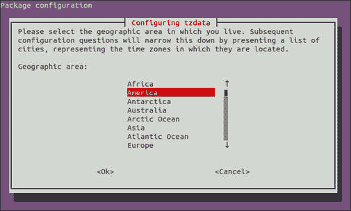
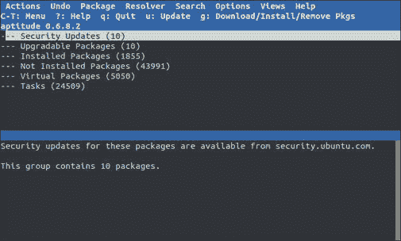
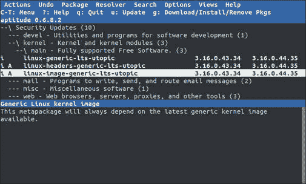
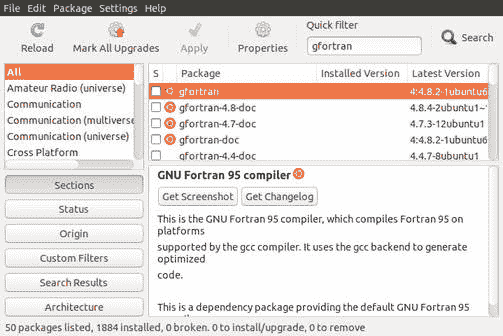
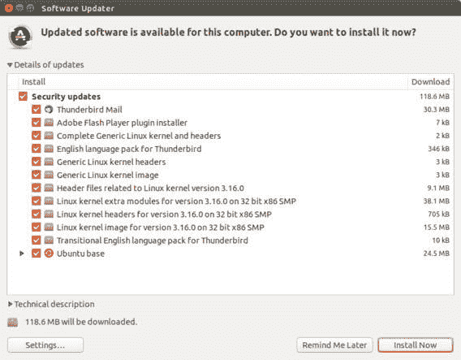

# Debian 包管理

> 原文：[`developer.ibm.com/zh/tutorials/l-lpic1-102-4/`](https://developer.ibm.com/zh/tutorials/l-lpic1-102-4/)

## 概述

在本教程中，学习使用 Debian 包管理工具来管理 Linux 系统上的包。学习：

*   安装、重新安装、升级和删除 Debian 二进制包
*   寻找包含特定文件或库的包（即使该包未安装）
*   获取版本、内容、依赖关系、包完整性和安装状态等包信息（即使该包未安装）

本教程帮助您针对 Linux Professional Institute 的 Linux 服务器专业认证 (LPIC-1) 考试 101 的主题 102 中的目标 102.4 进行应考准备。该目标的权重为 3。

## 包管理简介

过去，许多 Linux 程序以源代码的形式发行，用户将源代码构建为所需的程序或程序集，源代码还附带所需的手册页、配置文件，等等。现在，大多数 Linux 发行商都使用称为 *包* 的预先构建的程序或程序集，这些包便于在该发行版上安装。在本教程中，学习帮助安装、更新和删除包的 *包管理* 工具。本教程主要关注 Advanced Package Tool (APT)，APT 是 Debian 以及从 Debian 衍生出的发行版（比如 Ubuntu）使用的包管理系统。

##### 关于本系列

本教程系列将帮助您学习 Linux 系统管理任务。您还可以使用这些教程中的资料对 [Linux Professional Institute 的 LPIC-1：Linux 服务器专业认证考试](http://www.lpi.org)进行应考准备。

请参阅”[*学习 Linux，101*：LPIC-1 学习路线图](https://www.ibm.com/developerworks/cn/linux/l-lpic1-map/index.html)”，获得本系列中每个教程的描述和链接。这个路线图正在开发中，反映了 2015 年 4 月 15 日更新的 LPIC-1 考试的 V4.0 目标。在教程完成时，会将它们添加到路线图中。

从用户的角度讲，基本的包管理功能是通过命令提供的。Linux 开发人员一直致力于让 Linux 更容易使用，基本工具已得到了其他工具（包括 GUI 工具）的补充，它们为用户隐藏了基本工具的一些复杂性。在本教程，我主要关注基本工具，但也会提到其他一些工具，以便您能够继续研究它们。

### 前提条件

要从本系列教程中获得最大收获，您应该掌握 Linux 的基本知识，还应该有一个正常工作的 Linux 系统，您可以在这个系统上实践本教程中涵盖的命令。有时候，程序的不同版本将获得不同的输出格式，所以您的结果可能并不总是与这里显示的清单和图完全相同。具体地讲，我展示的许多输出都高度依赖于已安装在我的系统上的包。您自己的输出可能有所不同，但您应能够发现重要的共性。本教程中的示例来自一个 32 位 Ubuntu 14.04 LTS 系统。

## 安装 Debian 包

在安装 Linux 系统时，通常会安装大量的包。可以针对系统的预期用途（比如服务器、桌面或开发人员工作站）自定义这个包集合。有时候，可能还需要安装新包来添加新功能，更新已有的包，甚至删除不再需要或已被新包所取代的包。让我们来看看如何执行这些任务，以及如何解决一些相关的难题，比如寻找哪个包可能包含某个特殊的命令。

假设您想要编译一个 Fortran 程序，一位同事告诉您使用 `gfortran` 命令。您可以尝试使用 `gfortran --help` ，也可以尝试使用 `which gfortran` 或 `type gfortran` 。 但是，如果系统无法找到 `gfortran` ，您可能会看到类似 找不到 gfortran 命令 的输出。

##### 找不到 gfortran 命令

```
 ian@attic-u14:~$ gfortran --help
bash: gfortran: command not found

ian@attic-u14:~$ gfortran --help
The program 'gfortran' is currently not installed.You can install it by typing:
sudo apt-get install gfortran

ian@attic-u14:~$ which gfortran

ian@attic-u14:~$ type gfortran
bash: type: gfortran: not found 
```

如果没有从 找不到 gfortran 命令 中的输出表中获得有帮助的建议，您可能会与您的同事进行核实，确定要安装哪个包。否则，您可以猜测 `gfortran` 命令在 gfortran 包中。这种猜测通常是对的，但也不一定。您稍后将会看到如何寻找正确的包。在这里，您使用了 gfortran 包，并使用带有 `install` 选项的 `apt-get` 命令安装它，如 使用 apt-get 安装 gfortran 中所示。请注意， `apt-get` 会确定需要哪些额外的包才能满足依赖关系，然后为您提供将要安装的所有包的列表。这时，您会获得继续操作的提示。在我们的示例中，我们响应 `y` 来安装 gfortran 和所需的其他包：gfortran-4.8、libgfortran-4.8-dev 和 libgfortran3。

##### 使用 apt-get 安装 gfortran

```
ian@attic-u14:~$ sudo apt-get install gfortran
Reading package lists...Done
Building dependency tree
Reading state information...Done
The following extra packages will be installed:
  gfortran-4.8 libgfortran-4.8-dev libgfortran3
Suggested packages:
  gfortran-multilib gfortran-doc gfortran-4.8-multilib gfortran-4.8-doc
  libgfortran3-dbg
The following NEW packages will be installed:
  gfortran gfortran-4.8 libgfortran-4.8-dev libgfortran3
0 upgraded, 4 newly installed, 0 to remove and 23 not upgraded.
Need to get 0 B/5,039 kB of archives.
After this operation, 17.6 MB of additional disk space will be used.
Do you want to continue?[Y/n] y
Selecting previously unselected package libgfortran3:i386.
(Reading database ...202395 files and directories currently installed.)
Preparing to unpack .../libgfortran3_4.8.4-2ubuntu1~14.04_i386.deb ...
Unpacking libgfortran3:i386 (4.8.4-2ubuntu1~14.04) ...
Selecting previously unselected package libgfortran-4.8-dev:i386.
Preparing to unpack .../libgfortran-4.8-dev_4.8.4-2ubuntu1~14.04_i386.deb ...
Unpacking libgfortran-4.8-dev:i386 (4.8.4-2ubuntu1~14.04) ...
Selecting previously unselected package gfortran-4.8.
Preparing to unpack .../gfortran-4.8_4.8.4-2ubuntu1~14.04_i386.deb ...
Unpacking gfortran-4.8 (4.8.4-2ubuntu1~14.04) ...
Selecting previously unselected package gfortran.
Preparing to unpack .../gfortran_4%3a4.8.2-1ubuntu6_i386.deb ...
Unpacking gfortran (4:4.8.2-1ubuntu6) ...
Processing triggers for man-db (2.6.7.1-1ubuntu1) ...
Setting up libgfortran3:i386 (4.8.4-2ubuntu1~14.04) ...
Setting up libgfortran-4.8-dev:i386 (4.8.4-2ubuntu1~14.04) ...
Setting up gfortran-4.8 (4.8.4-2ubuntu1~14.04) ...
Setting up gfortran (4:4.8.2-1ubuntu6) ...
update-alternatives: using /usr/bin/gfortran to provide /usr/bin/f95 (f95) in auto mode
Processing triggers for libc-bin (2.19-0ubuntu6.6) ... 
```

从 使用 apt-get 安装 gfortran 的输出可以看到， `apt-get` 从某个地方读取了一个包列表（稍后进一步讨论），构建了一个依赖关系树，然后确定 gfortran-4.8、libgfortran-4.8-dev 和 libgfortran3 是所需的必备包，但目前尚未安装。您还会注意到，它建议安装一些单独的包：gfortran-multilib、gfortran-doc、gfortran-4.8-multilib、gfortran-4.8-doc 和 libgfortran3-dbg。在显示其他一些摘要信息（包括空间使用情况）后，会提示您继续，gfortran 将和这些必备包一起安装。 Debian 包通常具有扩展名 .deb，您可以在下列行中看到这些包已下载和解包：

```
Preparing to unpack .../gfortran-4.8_4.8.4-2ubuntu1~14.04_i386.deb ...
Unpacking gfortran-4.8 (4.8.4-2ubuntu1~14.04) ... 
```

假设您不想安装某个包，而是想确定该包是否依赖于其他包。可以在 `apt-get` 上使用 `-s` （代表 *simulate* ）选项。 还有其他一些具有等效功能的选项，比如 `--just-print` 和 \ `--dry-run` 。请查阅手册页了解完整的细节。 gfortran-doc 的模拟或排练式安装 显示了模拟安装 gfortran-doc 包的情况。

##### gfortran-doc 的模拟或排练式安装

```
ian@attic-u14:~$ sudo apt-get install -s gfortran-doc
Reading package lists...Done
Building dependency tree
Reading state information...Done
The following extra packages will be installed:
  gfortran-4.8-doc
The following NEW packages will be installed:
  gfortran-4.8-doc gfortran-doc
0 upgraded, 2 newly installed, 0 to remove and 23 not upgraded.
Inst gfortran-4.8-doc (4.8.4-2ubuntu1~14.04 Ubuntu:14.04/trusty-updates [all])
Inst gfortran-doc (4:4.8.2-1ubuntu6 Ubuntu:14.04/trusty [i386])
Conf gfortran-4.8-doc (4.8.4-2ubuntu1~14.04 Ubuntu:14.04/trusty-updates [all])
Conf gfortran-doc (4:4.8.2-1ubuntu6 Ubuntu:14.04/trusty [i386]) 
```

如您所见，gfortran-doc 文档包需要 gfortran-4.8-doc 包。但没有反向需求。自行尝试一下。

## 包位置

在前一小节中，学习了如何安装 Debian 包。但是，这些包来自何处？ `apt-get` 如何知道从何处下载包？我提到过， `apt-get` 从某个地方读取一个包列表。这个地方的起点是 /etc/apt/sources.list。该列表告诉 `apt-get` 到何处寻找包，包括从 CD-ROM、本地文件系统或使用 HTTP 或 FTP 在网上寻找。可以在 /etc/apt/sources.list.d 目录中添加更多的来源。

/etc/apt/sources.list 显示了我的系统上的 /etc/apt/sources.list 的前几行。请注意，第一行上的发行版 CD 已被注释掉（第一个 #）。如果需要安装多个不经常更新的新包，可能有必要取消注释这一行，并从发行版 CD 或 DVD 安装。 如果拥有宽带网络连接或需要一些更新，那么从 /etc/apt/sources.list 中后面的网络来源下载其他最新级别的包会更高效。

##### /etc/apt/sources.list

```
ian@attic-u14:~$ cat /etc/apt/sources.list
#deb cdrom:[Ubuntu 14.04.2 LTS _Trusty Tahr_ - Release i386 (20150218.1)]/ trusty main restricted

# See http://help.ubuntu.com/community/UpgradeNotes for how to upgrade to
# newer versions of the distribution.
deb http://us.archive.ubuntu.com/ubuntu/ trusty main restricted
deb-src http://us.archive.ubuntu.com/ubuntu/ trusty main restricted

## Major bug fix updates produced after the final release of the
## distribution.
deb http://us.archive.ubuntu.com/ubuntu/ trusty-updates main restricted
deb-src http://us.archive.ubuntu.com/ubuntu/ trusty-updates main restricted

## N.B. software from this repository is ENTIRELY UNSUPPORTED by the Ubuntu
## team.Also, please note that software in universe WILL NOT receive any
## review or updates from the Ubuntu security team.
deb http://us.archive.ubuntu.com/ubuntu/ trusty universe
deb-src http://us.archive.ubuntu.com/ubuntu/ trusty universe
deb http://us.archive.ubuntu.com/ubuntu/ trusty-updates universe
deb-src http://us.archive.ubuntu.com/ubuntu/ trusty-updates universe

## N.B. software from this repository is ENTIRELY UNSUPPORTED by the Ubuntu
## team, and may not be under a free licence.Please satisfy yourself as to
## your rights to use the software.Also, please note that software in
## multiverse WILL NOT receive any review or updates from the Ubuntu
## security team.
deb http://us.archive.ubuntu.com/ubuntu/ trusty multiverse
deb-src http://us.archive.ubuntu.com/ubuntu/ trusty multiverse
deb http://us.archive.ubuntu.com/ubuntu/ trusty-updates multiverse
deb-src http://us.archive.ubuntu.com/ubuntu/ trusty-updates multiverse 
```

`Apt-get` 和类似的工具使用本地数据库来确定安装哪些包。它们可针对可用级别来检查已安装的级别。为此，从 /etc/apt/sources.list 中列出的来源获取可用的级别，并将它们存储在本地系统上。可以使用命令 `apt-get update` 将本地数据库中的信息与 /etc/apt/sources.list 中指定的来源同步。应该在安装或更新任何包之前这样做，在修改 /etc/apt/sources.list 或向 /etc/apt/sources.list.d 添加文件后，也应该始终这样做。

## 删除 Debian 包

如果想要删除包，可以使用 `apt-get` 的 `remove` 选项。 gfortran 的模拟删除 中显示了一次模拟运行。

##### gfortran 的模拟删除

```
ian@attic-u14:~$ sudo apt-get remove -s gfortran
Reading package lists...Done
Building dependency tree
Reading state information...Done
The following packages were automatically installed and are no longer required:
  gfortran-4.8 libgfortran-4.8-dev libgfortran3
Use 'apt-get autoremove' to remove them.
The following packages will be REMOVED:
  gfortran
0 upgraded, 0 newly installed, 1 to remove and 23 not upgraded.
Remv gfortran [4:4.8.2-1ubuntu6] 
```

请注意，实际上没有自动删除作为 gfortran 的必备包而安装的 gfortran-4.8、libgfortran-4.8-dev 和 libgfortran3 包，但是输出会告诉您不再需要它们。 `apt-get` 的 `autoremove` 函数（或等效的 `remove` 函数和 `--auto-remove` 选项）可以删除请求的包，以及作为依赖关系安装但任何已安装的包都不再需要的任何包。这可能包括您尝试删除的一个或多个包以外的包安装的依赖关系。 删除 gfortran 和依赖关系 显示了 gfortran 及其依赖关系的模拟删除。我将展示如何仅删除 gfortran，然后使用 `apt-get autoremove` 清除最近被孤立的依赖关系。

##### 删除 gfortran 和依赖关系

```
ian@attic-u14:~$ # Simulate removal of gfortran and dependencies
ian@attic-u14:~$ sudo apt-get autoremove -s gfortran
Reading package lists...Done
Building dependency tree
Reading state information...Done
The following packages will be REMOVED:
  gfortran gfortran-4.8 libgfortran-4.8-dev libgfortran3
0 upgraded, 0 newly installed, 4 to remove and 23 not upgraded.
Remv gfortran [4:4.8.2-1ubuntu6]
Remv gfortran-4.8 [4.8.4-2ubuntu1~14.04]
Remv libgfortran-4.8-dev [4.8.4-2ubuntu1~14.04]
Remv libgfortran3 [4.8.4-2ubuntu1~14.04]
ian@attic-u14:~$ # Remove just gfortran
ian@attic-u14:~$ sudo apt-get remove gfortran
Reading package lists...Done
Building dependency tree
Reading state information...Done
The following packages were automatically installed and are no longer required:
  gfortran-4.8 libgfortran-4.8-dev libgfortran3
Use 'apt-get autoremove' to remove them.
The following packages will be REMOVED:
  gfortran
0 upgraded, 0 newly installed, 1 to remove and 23 not upgraded.
After this operation, 33.8 kB disk space will be freed.
Do you want to continue?[Y/n] y
(Reading database ...202421 files and directories currently installed.)
Removing gfortran (4:4.8.2-1ubuntu6) ...
Processing triggers for man-db (2.6.7.1-1ubuntu1) ...
ian@attic-u14:~$ # Autoremove unneeded packages
ian@attic-u14:~$ sudo apt-get autoremove
Reading package lists...Done
Building dependency tree
Reading state information...Done
The following packages will be REMOVED:
  gfortran-4.8 libgfortran-4.8-dev libgfortran3
0 upgraded, 0 newly installed, 3 to remove and 23 not upgraded.
After this operation, 17.6 MB disk space will be freed.
Do you want to continue?[Y/n] y
(Reading database ...202416 files and directories currently installed.)
Removing gfortran-4.8 (4.8.4-2ubuntu1~14.04) ...
Removing libgfortran-4.8-dev:i386 (4.8.4-2ubuntu1~14.04) ...
Removing libgfortran3:i386 (4.8.4-2ubuntu1~14.04) ...
Processing triggers for man-db (2.6.7.1-1ubuntu1) ...
Processing triggers for libc-bin (2.19-0ubuntu6.6) ... 
```

如您所见，您使用了 `apt-get` 的 `autoremove` 函数（没有使用任何包名称）来删除所有已安装但系统上不再需要的未使用的包。 还可以使用 `apt-get purge` 选项来删除配置信息。请参阅手册页了解更多的信息。

## 更新 Debian 包

如果需要更新单个包，可以再次使用 `apt-get` 和 `install` 选项。 更新单个包 显示了如何更新系统上已安装的 ghostscript 包。请注意，必备包 ghostscript-x 和 libgs9 也将升级。请记得在更新包之前运行 `apt-get update` ，确保您的本地数据库反映了最新的可用更新。

##### 更新单个包

```
ian@attic-u14:~$ sudo apt-get install ghostscript
Reading package lists...Done
Building dependency tree
Reading state information...Done
The following extra packages will be installed:
  ghostscript-x libgs9
Suggested packages:
  hpijs
The following packages will be upgraded:
  ghostscript ghostscript-x libgs9
3 upgraded, 0 newly installed, 0 to remove and 20 not upgraded.
Need to get 0 B/1,967 kB of archives.
After this operation, 0 B of additional disk space will be used.
Do you want to continue?[Y/n] y
(Reading database ...202535 files and directories currently installed.)
Preparing to unpack .../ghostscript_9.10~dfsg-0ubuntu10.3_i386.deb ...
Unpacking ghostscript (9.10~dfsg-0ubuntu10.3) over (9.10~dfsg-0ubuntu10.2) ...
Preparing to unpack .../ghostscript-x_9.10~dfsg-0ubuntu10.3_i386.deb ...
Unpacking ghostscript-x (9.10~dfsg-0ubuntu10.3) over (9.10~dfsg-0ubuntu10.2) ...
Preparing to unpack .../libgs9_9.10~dfsg-0ubuntu10.3_i386.deb ...
Unpacking libgs9 (9.10~dfsg-0ubuntu10.3) over (9.10~dfsg-0ubuntu10.2) ...
Processing triggers for man-db (2.6.7.1-1ubuntu1) ...
Setting up libgs9 (9.10~dfsg-0ubuntu10.3) ...
Setting up ghostscript (9.10~dfsg-0ubuntu10.3) ...
Setting up ghostscript-x (9.10~dfsg-0ubuntu10.3) ...
Processing triggers for libc-bin (2.19-0ubuntu6.6) ... 
```

### 更新所有包或升级到新的发行版

除了更新单个包之外，还可以使用 `apt-get upgrade` 命令更新系统上的所有包。 类似地， `apt-get dist-upgrade` 可以帮助您迁移到发行版的新级别。

有关 `apt-get` 的其他功能和选项的更多信息，请参阅手册页。

### APT 配置 — apt.conf 文件

`apt-get` 的手册页显示已经有许多选项。如果经常使用 `apt-get` 命令，而且觉得不喜欢使用默认选项，可以在 /etc/apt/apt.conf 中设置新的默认选项。脚本可以使用程序 `apt-config` 来查询 apt.conf 文件。请参阅 apt.conf 和 apt-config 的手册页来了解更多的信息。

## 重新配置 Debian 包

APT 包含一个名为 *debconf* 的功能，它可以在安装包之后对它们执行配置。使用此功能的包（不是所有）可以在安装后重新配置。 执行此配置的最简单方法是使用 `dpkg-reconfigure` 命令。例如， `adduser` 命令可以创建可供所有系统用户读取的主目录。出于保护隐私的原因，您可能不希望这样做。类似地，tzdata 包支持使用 `dpkg-reconfigure tzdata` 更改时区。必须使用根权限运行 `dpkg-reconfigure` 。

使用 dpkg-reconfigure 重新配置时区 显示了在运行 `sudo dpkg-reconfigure tzdata` 时被问到的第一个问题。预先设置的默认选项可能不是美国时区，而是您自己的系统的时区。可以使用 Tab 键和光标移动键在这个文本模式的屏幕上进行导航。

##### 使用 dpkg-reconfigure 重新配置时区



还可以使用 `debconf-show` 查看某个包的当前配置，如 使用 debconf-show 显示 tzdata 配置 所示。

##### 使用 debconf-show 显示 tzdata 配置

```
ian@attic-u14:~$ sudo debconf-show tzdata
  tzdata/Zones/Pacific:
  tzdata/Zones/Europe:
  tzdata/Zones/Indian:
  tzdata/Zones/Australia:
* tzdata/Areas:America
  tzdata/Zones/Arctic:
  tzdata/Zones/Atlantic:
* tzdata/Zones/Etc:UTC
* tzdata/Zones/America:New_York
  tzdata/Zones/US:
  tzdata/Zones/Africa:
  tzdata/Zones/SystemV:
  tzdata/Zones/Antarctica:
  tzdata/Zones/Asia: 
```

## Debian 包信息

现在，让我们查看一些获取包信息的工具。其中一些工具还有其他功能，但这里只关注如何获取信息。

### 使用 dpkg 获取包状态

APT 系统中包含的另一个工具是 `dpkg` 。 这是一个介质级（medium-level）包管理工具，它可以安装和删除包，并显示状态信息。可以使用 /etc/dpkg/dpkg.cfg 控制 dpkg 的配置，也可以在主目录中放入一个 .dpkg.cfg 文件来提供更多的配置。

dpkg 工具使用了文件系统中的 /var/lib/dpkg 树中的许多文件。 具体地讲，文件 /var/lib/dpkg/status 包含系统上的包的状态信息。 Tzdata 包状态 显示了使用 `dpkg -s` 在更新 tzdata 包和删除 gfortran 包后显示它们的状态。如果配置未变（在某些情况下会这样），可以使用 `purge` 选项从缓存中清除下载的包文件并删除配置信息。

##### Tzdata 包状态

```
ian@attic-u14:~$ dpkg -s gfortran tzdata
dpkg-query: package 'gfortran' is not installed and no information is available

Package: tzdata
Status: install ok installed
Priority: required
Section: libs
Installed-Size:1538
Maintainer:Ubuntu Developers <ubuntu-devel-discuss@lists.ubuntu.com>
Architecture: all
Multi-Arch: foreign
Version:2015d-0ubuntu0.14.04
Replaces: libc0.1, libc0.3, libc6, libc6.1
Provides: tzdata-jessie
Depends: debconf (>= 0.5) | debconf-2.0
Description: time zone and daylight-saving time data
 This package contains data required for the implementation of
 standard local time for many representative locations around the
 globe.It is updated periodically to reflect changes made by
 political bodies to time zone boundaries, UTC offsets, and
 daylight-saving rules.
Homepage: http://www.iana.org/time-zones
Original-Maintainer:GNU Libc Maintainers <debian-glibc@lists.debian.org>
Use dpkg --info (= dpkg-deb --info) to examine archive files,
and dpkg --contents (= dpkg-deb --contents) to list their contents. 
```

### 包和其中的文件

您可能想知道某个包中的内容或某个特殊文件来自哪个包。dpkg 可以完成这两个任务。 libparted 包中有什么？ 演示了使用 `dpkg -L` 列出由 libparted 包安装的文件（包括目录）。对于大多数包，可以只提供包名称，不需要为指定一个特殊版本而担忧。但是，一些包可能有多个版本可用，所以您在使用 `dpkg` 查询包信息时可能需要指定更详细的包名称。

##### libparted 包中有什么？

```
ian@attic-u14:~$ dpkg -L libparted
dpkg-query: package 'libparted' is not installed
Use dpkg --info (= dpkg-deb --info) to examine archive files,
and dpkg --contents (= dpkg-deb --contents) to list their contents.
ian@attic-u14:~$ dpkg -L libparted0debian1
/.
/usr
/usr/share
/usr/share/doc
/usr/share/doc/libparted0debian1
/usr/share/doc/libparted0debian1/changelog.Debian.gz
/usr/share/doc/libparted0debian1/copyright
/usr/share/lintian
/usr/share/lintian/overrides
/usr/share/lintian/overrides/libparted0debian1
/lib
/lib/i386-linux-gnu
/lib/i386-linux-gnu/libparted.so.0.0.1
/lib/i386-linux-gnu/libparted.so.0 
```

要查明哪个包包含某个特定文件，可以使用 dpkg 的 `-S` 选项，如 哪个包包含单个文件？ 所示。左边列出了包的名称。

##### 哪个包包含单个文件？

```
ian@attic-u14:~$ dpkg -S /lib/i386-linux-gnu/libparted.so.0
libparted0debian1:i386:/lib/i386-linux-gnu/libparted.so.0 
```

有时候，有的单个文件似乎不属于任何包。当发生这种情况时，需要做一些额外的调查来查明某个包来自何处。例如，安装设置步骤可以执行一些任务，比如创建未在包内容中列出的符号链接。Linux 系统中最近新添加了 *替代品* 系统，可以使用 `update-alternatives` 命令来管理它。常常为 `java` 等命令创建替代品，它们可能是 openJDK、Oracle 或 IBM 版本，等等。

一种更复杂的 dpkg -S 用法 显示了如何使用 `which` 命令查明在尝试运行 `java` 时调用的是什么。然后使用 `ls` 命令查明 `java` 命令符号链接的是什么。到 etc/alternatives 目录的链接表明我们正在使用替代品系统，所以我们使用 `update-alternatives` 命令寻找更多的信息。最后，我们使用 `dpkg -S` 命令确认 `java` 命令来自 openjdk-7-jre-headless。替代品系统的设置是由 openjdk-7-jre-headless 包中的一个安装后（post-install）脚本完成的。

##### 一种更复杂的 dpkg -S 用法

```
ian@attic-u14:~$ which java
/usr/bin/java
ian@attic-u14:~$ dpkg -S /usr/bin/java
dpkg-query: no path found matching pattern /usr/bin/java
ian@attic-u14:~$ ls -l $(which java)
lrwxrwxrwx 1 root root 22 Jul 24 18:06 /usr/bin/java -> /etc/alternatives/java
ian@attic-u14:~$ update-alternatives --display java
java - auto mode
  link currently points to /usr/lib/jvm/java-7-openjdk-i386/jre/bin/java
/usr/lib/jvm/java-7-openjdk-i386/jre/bin/java - priority 1071
  slave java.1.gz:/usr/lib/jvm/java-7-openjdk-i386/jre/man/man1/java.1.gz
Current 'best' version is '/usr/lib/jvm/java-7-openjdk-i386/jre/bin/java'.
ian@attic-u14:~$ dpkg -S /usr/lib/jvm/java-7-openjdk-i386/jre/bin/java
openjdk-7-jre-headless:i386:/usr/lib/jvm/java-7-openjdk-i386/jre/bin/java 
```

## 使用 aptitude

前面已经提到过，包的状态保存在 /var/lib/dpkg/status 中。还提到了 dpkg 能做的不仅仅是显示包信息。现在，让我们看看 `aptitude` 命令，它为 APT 包管理功能提供了一个基于文本的全屏界面（使用 ncurses）。如果尚未安装 aptitude，可以使用 `apt-get` 安装它。可以使用 aptitude 安装或删除包，以及控制状态标志，比如表明包是应该更新，还是应该保持当前状态。如果运行 `aptitude` 命令（作为根用户），会看到一个类似 运行 aptitude 的屏幕。

##### 运行 aptitude



按下 Enter 展开或折叠各种选项，然后使用 **ctrl-t** 访问菜单栏。 运行 aptitude 和检查包标志 显示有一个新的内核版本 3.16.0.43.34 可用于我的系统，还有其他一些可用的更新。左栏中的 “i” 表示当前状态是要安装这个包。Help 菜单项解释您拥有的各种选项，包括保持某个包的当前级别而不是更新它，删除它，或者将它标记为自动安装，让它符合自动删除的条件。记得 `apt-get` 的 `autoremove` 选项吗？现在您知道如何检查或控制哪些包符合自动删除的条件了。 使用 Help 中描述的键盘快捷键或使用 **Package** 菜单项更改标志。

##### 运行 aptitude 和检查包标志



可以使用斜杠 (“/”) 键搜索包。例如，如果想要重新安装前面已经删除的 gfortran 包，只需键入 “/gfortran” 来搜索它。如果搜索找到了 gfortran 之外的其他东西，比如 gfortran-doc，那么可以按下 n 键前进到下一个匹配项。然后使用 **Package** 菜单来标记要安装的包。

完成之后，选择 **Actions->Install/remove packages** （或按下 G）将您的选择应用于系统。如果不想应用更改，还可以单击 quit 选项。

在任何时候，都可以使用菜单栏或键入 “`?`“（问号）来获得帮助，然后按下 Q 键退出帮助。

## 使用其他工具升级 Debian

您已经看到 aptitude 可以帮助安装或删除单个包，并将系统上的所有包升级到最新级别。

除了 aptitude 之外，还有其他一些用于 Debian 系统的交互式包管理界面，包括 dselect、synaptic、update-manager、gnome-apt 和 wajig。Synaptic 是在 X Window System 中使用的图形化应用程序。 使用 synaptic 安装 gfortran 显示了 synaptic 用户界面，其中包含我们熟悉的 gfortran 包（已标记为要安装）。

##### 使用 synaptic 安装 gfortran



**Apply** 按钮安装 gfortran 并更新计划更新的其他所有包。 **Reload** 按钮刷新了包列表。如果您习惯使用 GUI 界面，可能会发现 synaptic 比 apt-get、dpkg 或 dselect 更容易使用。

类似地，您可能会发现您的系统包含 `update-manager` ，这是一个 X Window System 应用程序，专为帮助您保持系统最新而量身定做。如果已安装，那它很可能会定期自动启动，这样您就不会忘记更新。 Update Manager 示例 显示了 Update Manager 如何显示您在 运行 aptitude 和检查包标志 中看到的一组更新。与 aptitude 一样，这些更新已分类，以便让您知道哪些更新是重要的安全更新。

##### Update Manager 示例



## 寻找 Debian 包

在 Debian 包管理的最后一个主题中，我将介绍寻找包的方法。通常，apt-get 和这里讨论的其他工具已经知道可用包列表中您可能需要的任何 Debian 包。我们还没有使用过的一个命令是 `apt-cache` ，它对搜索系统上的包信息很有用。 `apt-cache` 可以使用正则表达式进行搜索（参阅”[*学习 Linux，101* ：使用正则表达式搜索文本文件](https://developer.ibm.com/zh/tutorials/l-lpic1-103-7/) ”，了解正则表达式的更多信息）。假设您想要寻找包含 Linux 加载程序的包的名称。 使用 apt-cache 搜索 Linux 加载程序 显示了如何完成此任务。

##### 使用 apt-cache 搜索 Linux 加载程序

```
ian@attic-u14:~$ apt-cache search "linux loader"
lilo - LInux LOader - the classic OS boot loader
lilo-doc - LInux LOader - Documentation for the classic OS boot loader 
```

前面已经看到，aptitude 和 synaptic 也提供了搜索工具。如果使用 synaptic，请注意，搜索菜单上还有只搜索包名称或包描述的选项。

如果仍然无法找到包，可以在 Debian 站点的包列表中（参见 参考资料 中的链接）或 Internet 上的其他地方找到它。

与未安装的包相比，对于已安装的包，大多数包工具都可以提供更多的信息，比如包中的文件列表。如果需要寻找哪个包中包含您尚未安装的程序，可以采用许多方法：

*   可以猜测哪个包可能包含该程序，下载这个包，但先不要进行安装。获得这个包之后，就可以进行查询。
*   可以在 Internet 上搜索。
*   可以尝试 command-not-found 功能，该功能将在本教程后面的 命令未找到 中介绍。

`apt-get` 命令有一个 `-d` 选项，用于下载包但不进行安装。还有一个 `--print-uris` 选项，可以显示从何处下载某个包和它的校验和。当前的校验和可能是 SHA256 校验和，可以使用 `sha256sum` 命令检查下载的包的完整性。请注意，如果已经下载了该包，就不会显示 URI 和校验和信息，所以应该在下载包之前获取此信息。

假设您想知道 gfortran 命令是否真的包含在 gfortran 包中。 使用 apt-get 实现只下载（download-only） 显示了如何使用 `apt-get` 下载 gfortran 包，但不安装它。

##### 使用 apt-get 实现只下载（download-only）

```
ian@attic-u14:~$ sudo apt-get install -d gfortran
Reading package lists...Done
Building dependency tree
Reading state information...Done
The following extra packages will be installed:
  gfortran-4.8 libgfortran-4.8-dev libgfortran3
Suggested packages:
  gfortran-multilib gfortran-doc gfortran-4.8-multilib gfortran-4.8-doc
  libgfortran3-dbg
The following NEW packages will be installed:
  gfortran gfortran-4.8 libgfortran-4.8-dev libgfortran3
0 upgraded, 4 newly installed, 0 to remove and 20 not upgraded.
Need to get 0 B/5,039 kB of archives.
After this operation, 17.6 MB of additional disk space will be used.
Do you want to continue?[Y/n] y
Download complete and in download only mode 
```

下载了包之后，可以使用 `dpkg` 的 `--info` 选项显示包信息，或者使用 `--contents` 选项显示这个包安装了哪些文件。 下载的文件通常位于 /var/cache/apt/archives/ 中。 使用 dpkg 列出 .deb 的内容 显示了如何找到下载的文件，并查明它将安装哪些二进制文件（假设它们安装在一个 …/bin/… 目录中）。

##### 使用 dpkg 列出 .deb 的内容

```
ian@attic-u14:~$ sudo find /var/cache -name "gfort*.deb"
/var/cache/apt/archives/gfortran_4%3a4.8.2-1ubuntu6_i386.deb
/var/cache/apt/archives/gfortran-4.8_4.8.4-2ubuntu1~14.04_i386.deb
ian@attic-u14:~$ sudo dpkg --contents \
> /var/cache/apt/archives/gfortran_4%3a4.8.2-1ubuntu6_i386.deb |
>  grep "/bin/"
drwxr-xr-x root/root         0 2014-04-07 18:49 ./usr/bin/
lrwxrwxrwx root/root         0 2014-04-07 18:49 ./usr/bin/gfortran -> gfortran-4.8
lrwxrwxrwx root/root         0 2014-04-07 18:49 ./usr/bin/i686-linux-gnu-gfortran -> gfortran-4.8 
```

如果使用 `apt-get` 之外的其他命令找到并下载一个 `.deb` 文件，可以使用 `dpkg -i` 安装它。

如果决定不将已下载的包安装到 APT 存档中，可以运行 `apt-get clean` 来清除所有已下载的包文件。

如果所有其他操作都失败了，还有另一个可能的包来源。假设您找到了一个打包为 RPM 而不是 .deb 的程序。可以尝试使用 `alien` 程序，该程序可在包格式之间执行转换。应该仔细阅读 alien 文档，因为 alien 并不能将所有包管理系统的所有特性都转换为另一种格式。使用您在本教程中学到的知识，帮助寻找包含 alien 命令的包。

## 命令未找到

返回到 找不到 gfortran 命令 ，您可以看到一条有帮助的信息，告诉您要安装哪个包来获得 `gfortran` 命令。这是如何实现的？当 Bash shell 搜索一条命令但没有找到它时，该 shell 会搜索一个名为 `command_not_found_handle` 的 shell 函数。 command_not_found_handle 显示了我的 Ubuntu 14 系统上对此函数的定义。

##### command_not_found_handle

```
ian@attic-u14:~$ type command_not_found_handle
command_not_found_handle is a function
command_not_found_handle ()
{
    if [ -x /usr/lib/command-not-found ]; then
        /usr/lib/command-not-found -- "$1";
        return $?;
    else
        if [ -x /usr/share/command-not-found/command-not-found ]; then
            /usr/share/command-not-found/command-not-found -- "$1";
            return $?;
        else
            printf "%s: command not found\n" "$1" 1>&2;
            return 127;
        fi;
    fi
} 
```

如果 `command_not_found_handle` 函数存在，则会使用原始命令和原始参数来调用它，函数的退出状态会变成该 shell 的退出状态。如果没有定义该函数，该 shell 会打印一条错误消息并返回退出状态 127。通常在系统的 /etc/bash.bashrc 文件中设置该函数。如 command_not_found_handle 中所示，该函数会检查 /usr/lib/command-not-found 是否存在，如果存在，则作为 Python 脚本运行它。 如果不存在（可能因为在启动 shell 会话后删除了提供它的 command-not-found 包），那么该函数会模拟标准系统行为并返回 127。

## PackageKit

如果不提到 PackageKit，对包安装的讨论就不算完整，这是一个为了实现跨平台以及更方便地安装和更新软件而设计的系统。它的意图是将不同发行版中使用的所有软件图形工具统一起来。PackageKit 使用了一个系统激活的守护进程，这意味着该守护进程只在需要时激活。PackageKit 拥有适用于 Gnome (gnome-packagekit) 和 KDE (KPackageKit) 的版本。

除了这里讨论的功能之外，Debian 包管理系统还有许多功能。除了包管理系统之外，Debian 还有其他许多功能。请参见 参考资料 ，获取更多细节和本系列中其他教程的链接。

本文翻译自：[Learn Linux, 101: Debian package management](https://developer.ibm.com/tutorials/l-lpic1-102-4/)（2015-08-24）