# Archived | 使用 Docker 和 Eclipse 为 Minecraft 构建插件

> 原文：[`developer.ibm.com/zh/tutorials/minecraft-and-ibm-cloud-part-2/`](https://developer.ibm.com/zh/tutorials/minecraft-and-ibm-cloud-part-2/)

**本文已归档**

**归档日期：:** 2019-12-09

此内容不再被更新或维护。 内容是按“原样”提供。鉴于技术的快速发展，某些内容，步骤或插图可能已经改变。

在[第 1 部分](http://www.ibm.com/developerworks/cn/cloud/library/cl-bluemix-minecraft-docker-trs-1)中，您学习了如何在 Docker 中设置一个“现成的”或未修改的 Minecraft 服务器，以及如何在 Docker 中设置 Spigot 服务器。这是构建您自己的可利用许多服务的 Minecraft 插件的第一步，这些服务包括 IBM Cloud（IBM 的平台即服务环境）上提供的 Watson 认知服务。使用这些服务，将使您的游戏体验更加智慧和更加愉快。

但您不能一蹴而就。您需要完成另外一些步骤，然后才能够构建可使用 Watson 服务的插件。在第 2 部分中，我将介绍设置您本地开发环境的下一步：设置 Eclipse，然后开发、构建您自己的服务器端 Minecraft 插件，并将它们导出到一个本地 Docker 镜像中。

##### 关于本系列

**[第 1 部分](https://www.ibm.com/developerworks/cn/cloud/library/cl-bluemix-minecraft-docker-trs-1/)**：设置您的本地 Minecraft 和 Docker 开发环境，开始在自己的服务器上使用 Minecraft。

**第 2 部分**：设置您的本地 Eclipse 开发环境，然后开发、构建您自己的服务器端 Minecraft 插件，并将它们导出到一个本地 Docker 镜像中。

**[第 3 部分](https://www.ibm.com/developerworks/cn/cloud/library/cl-bluemix-minecraft-spigot-trs-3/)**：将 Docker 镜像部署到 IBM Cloud，然后运行它们，使用它们作为可通过云访问的 Docker 容器。

**[第 4 部分](https://www.ibm.com/developerworks/cn/cloud/library/cl-bluemix-minecraft-watson-trs-4/)**：使用一个插件扩展 Spigot 服务器，该插件使用 IBM Cloud 上的 Watson 认知服务为您的游戏体验增添一些科学性。

我们将在 Eclipse 集成开发环境 (IDE) 中完成所有开发。Eclipse 是一个用于 Java® 和其他一些语言的免费、开源的开发环境。您可以选择几乎任何 Java IDE 来执行 Minecraft 插件开发，但在使用 IDE 的社区中，Minecraft 开发社区通常使用 Eclipse。

## 在 Ubuntu 中设置 Eclipse

要使用 Eclipse IDE，您需要首先将 Java 安装在您的 Ubuntu Linux 环境中。Eclipse 不仅是一个在 Java 中开发程序的环境，它本身也是一个 Java 程序。安装 Java 的命令应该看起来很熟悉，因为我们已在[第 1 部分](http://www.ibm.com/developerworks/cn/cloud/library/cl-bluemix-minecraft-docker-trs-1)中的 Dockerfile 中使用过它。但是，这一次您需要在您的 Ubuntu Linux 安装的命令行上运行该命令：

```
sudo apt-get install openjdk-7-jdk 
```

成功安装 JDK version 7 后，您需要做一次选择：

*   如果您更习惯使用 Ubuntu GUI，可以转到 [Eclipse 下载页面](http://eclipse.org/downloads/)并选择 Eclipse Mars 版本，然后下载 Eclipse 的安装文件。安装文件为 Gzipped tar 文件格式。在 Ubuntu 文件管理器中双击该 tar 文件，使用 Archive Manager 打开它。然后使用文件管理器将该文件的内容提取到一个名为 “eclipse” 的目录中。
*   如果您更习惯使用命令行，那么可以一次一个地发出以下命令：

    ```
    wget
    "https://eclipse.org/downloads/download.php?file=
    /technology/epp/downloads/release/mars/R/eclipse-jee-mars-R-linux-gtk-x86_64.tar.gz&r=1"
    -O eclipse-jee-mars-R-linux-gtk-x86_64.tar.gz

    tar -xzf eclipse-jee-mars-R-linux-gtk-x86_64.tar.gz 
    ```

无论您如何下载和安装 Eclipse，都可以采用同样的方式启动它。假设您已经将它安装在主目录中，可以在命令行上键入下面这条命令来启动 Eclipse：

```
./eclipse/eclipse 
```

在启动 Eclipse 后，系统会询问您是想要创建一个新的默认工作区还是使用现有的工作区。继续在它指定的目录中创建默认工作区。

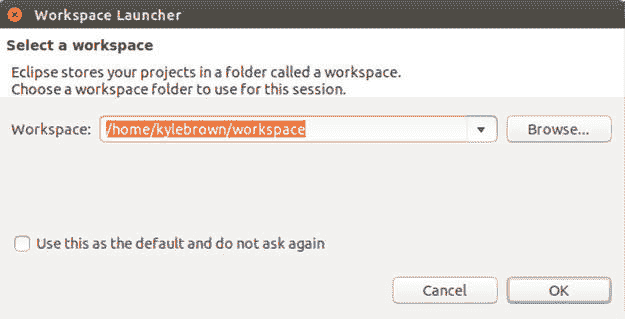

在 Eclipse Welcome 屏幕上，单击右上角的 Workbench 图标打开 Workbench。


您会看到 Eclipse Workbench：

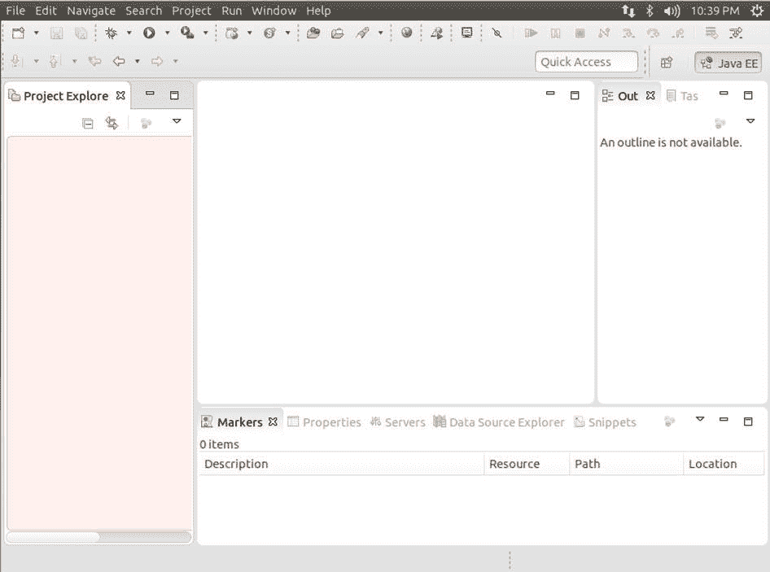

### 导入归档文件

我们将使用 Eclipse 的 **项目导入** 功能来导入一个包含我们的示例的项目归档文件。Eclipse 中的项目是您的工作区目录中的目录结构。项目归档文件是一种用于 Eclipse 的特殊 zip 文件格式，它允许您与其他人共享您的配置完整的项目。在将该项目导入 Eclipse 中后，我们将会分析示例代码。归档导入文件位于在[第 1 部分](http://www.ibm.com/developerworks/cn/cloud/library/cl-bluemix-minecraft-docker-trs-1)中从 GitHub 克隆的 minecraft-project 目录的根目录下，所以如果尝试不学习第 1 部分中的所有示例，而是直接跳到本教程，则需要返回执行该克隆过程。

1.  从 Eclipse Workbench 顶部的菜单中选择 **File > Import**。
2.  选择 **General > Existing Projects into Workspace**，然后单击 **Next**。

    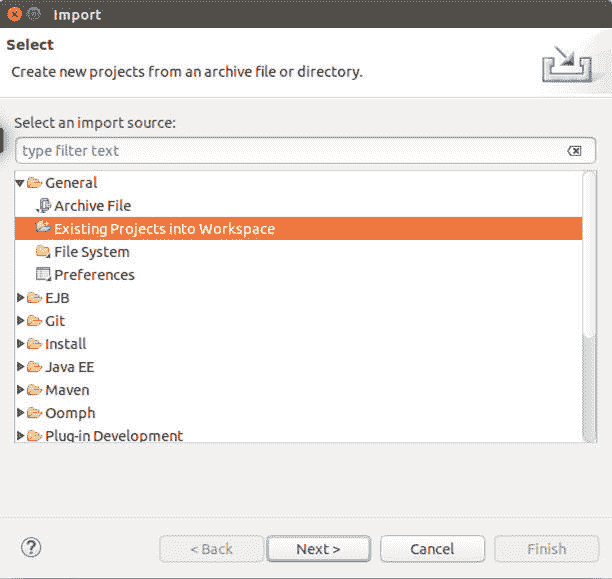

3.  选择 **Select Archive File**，然后单击 **Browse**。

    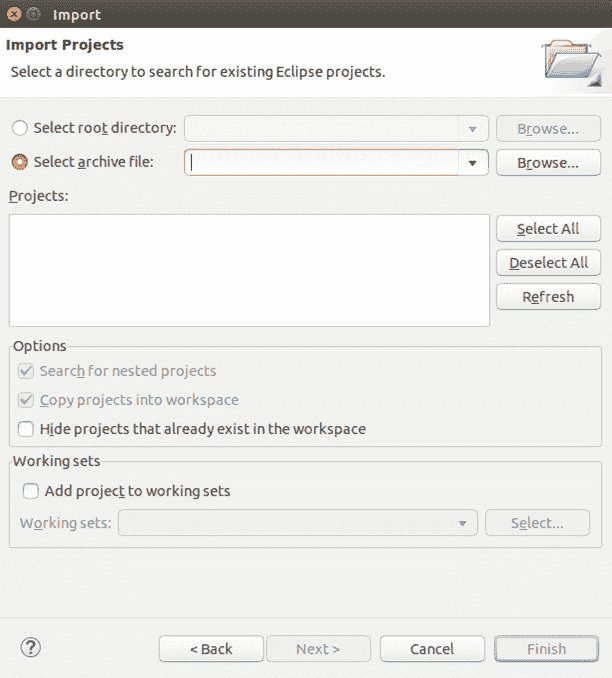

4.  导航到您克隆到的目录（或许是您的主目录，但具体情况取决于您在[第 1 部分](http://www.ibm.com/developerworks/cn/cloud/library/cl-bluemix-minecraft-docker-trs-1)中执行的操作）并打开 minecraft-project 目录。选择 SpigotPlugin.zip 并单击 **OK**。

    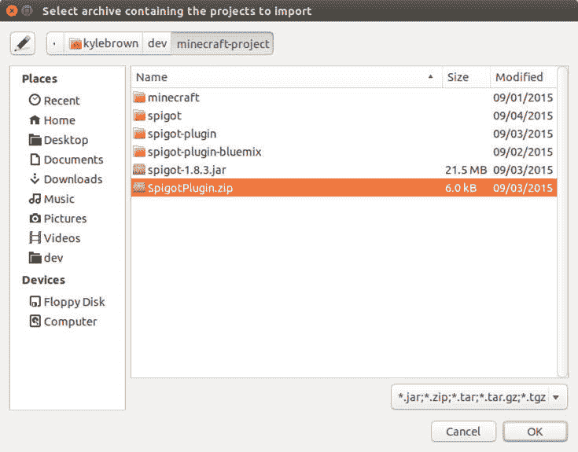

5.  单击 **Finish**。
6.  在 Workspace 中，您将在 SpigotProject 下看到一个红色的感叹号 (!)。没有关系 — 它只是提醒我们，我们需要修补指向 spigot-1.8.3.jar 文件的类路径，以便我们的插件的 Java 代码能够运行（因为我们的代码依赖于 Spigot API，所以需要导入这些 API）。

    在 Project 窗格中选择 SpigotPlugin.zip。单击（在其他平台上可以按下 Alt-Enter 或按住 Control 键并单击）并从弹出菜单上选择 **Properties**，然后选择 **Java Build Path**。选择 Libraries 选项卡。

    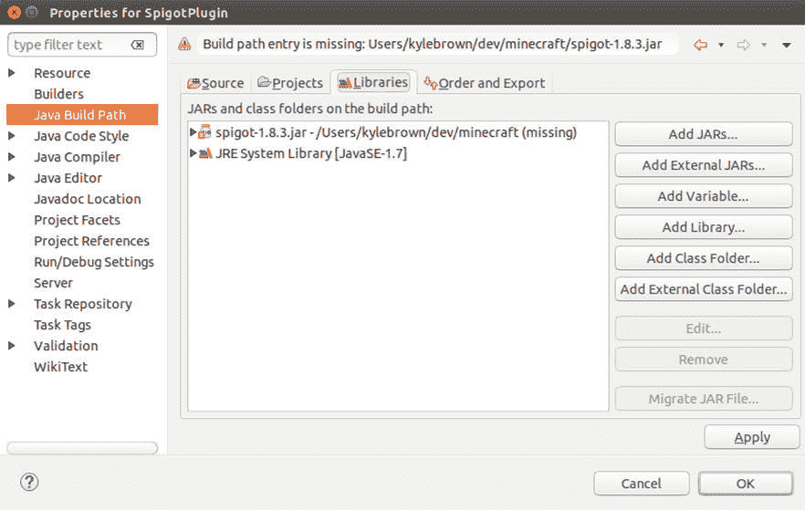

7.  选择 Spigot1.8.3.jar，然后单击 **Edit**。

    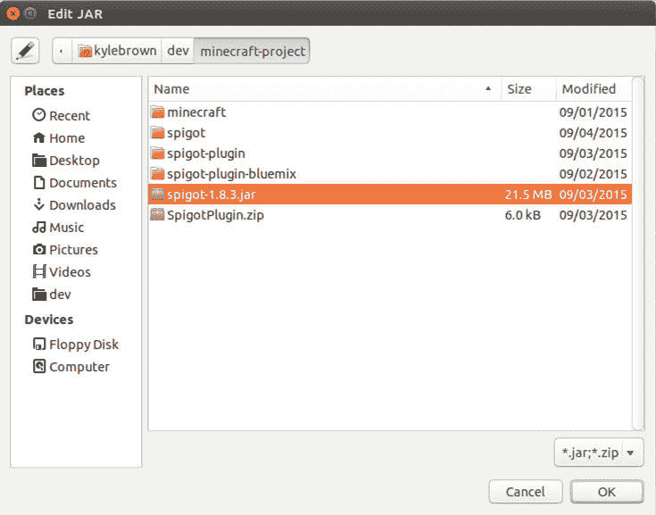

8.  双击 minecraft-project，然后在下一个窗格中选择 Spigot1.8.3.jar。

    如果仔细查看，您可能会担心这个 Spigot JAR 文件与上一个示例中构建的 Spigot JAR 文件的级别（为 1.8.8 级）不匹配。实际上，因为我们使用此 JAR 文件只是为了允许执行我们的代码编译，所以即使它具有较低的级别也没有关系 — 该 API 暂时不会更改。在您自己的代码中，如果这在以后导致了问题，可以按照 Spigot Build Tools wiki（[`www.spigotmc.org/wiki/buildtools）上的说明，在本地构建一个新的`](https://www.spigotmc.org/wiki/buildtools）上的说明，在本地构建一个新的) spigot JAR 文件，并替换您从 GitHub 下载的文件。

9.  单击 **Apply**，然后单击 **OK**，再次单击 **OK**。

此刻，您的工作区会显示旁边没有红色感叹号的 SpigotPlugin 项目，这意味着您已经解决了这个问题，而且我们可以继续运行我们的示例。

## 为 Minecraft 构建插件

Spigot 插件 API 实际上非常简单。如果您曾经使用 Java 执行过其他类型的服务器端编程，比如构建 servlet，就会发现它是采用同样工作原理的一个简单示例。我们安装一个特定的 JDK (Java 1.7) 的原因是，Minecraft 中的插件（或者至少使用 Bukkit API 的插件）必须在 Java 1.7 上构建。否则，您会在服务器上获得奇怪的类不匹配错误。在未来，这种情况可能发生改变，但就现在而言，最好坚持使用 Java 1.7 执行开发。

### HelloWorld 类

我们首先来看一个简单的 Minecraft 插件，它等效于任何编程语言中的 Hello World 程序。我们将使用此文件介绍 Bukkit API 的一些更简单的特性。

1.  首先，单击并展开 **SpigotPlugin**，从 Eclipse Workbench 项目窗格调出插件源代码文件。
2.  单击并展开 **src**，然后展开 **com.ibm.minecraftplugin** 目录。
3.  单击 **HelloWorld.java**。

让我们看看 HelloWorld.java 文件的内容：

```
package com.ibm.minecraftplugin;

import org.bukkit.command.Command;
import org.bukkit.command.CommandSender;
import org.bukkit.plugin.java.JavaPlugin;

public class HelloWorld extends JavaPlugin {

    public void onEnable(){
        getLogger().info("Hello World!");
    }

    public boolean onCommand(CommandSender sender, Command cmd, String label, String[] args)
    {
    if (cmd.getName().equalsIgnoreCase("hello")) {
    sender.sendMessage("Hello Everybody!");
    }
    return false;
    }
} 
```

您需要理解两个简单的概念。首先，构建一个插件非常简单，只需扩展 `JavaPlugin` 类，所以您的所有插件都将是 `JavaPlugin` 的子类。第二，您需要在每个插件类中实现两个方法：

*   `onEnable()` 是一个事件处理函数，会在服务器加载该插件时调用。您在此方法中对该类执行所有必要设置（例如设置数据库连接）。我们采用了一种标准的调试方法，那就是将一些状态信息记录到日志记录器中，以便在加载插件时，可以在日志输出中查看结果。
*   每当用户使用 `/&COMMAND&` 发出一个 Minecraft 命令时，就会调用 `onCommand()`。每个插件必须确定该命令能否被该插件处理（这非常简单，只需将该命令的名称与该插件可处理的相应名称进行比较），然后执行任何必要的操作。

在我们的例子中，一旦我们确认该命令可被该插件处理，就会将消息 “Hello Everybody!” 发送到该命令的发送者。这很简单，但足以让您了解该概念的原理。如果您喜欢的话，可以更改 `onEnable()` 方法写入的日志消息，或者该命令向用户发回的消息来自定义您的插件。

### Plugin.yml 文件

Bukkit 插件正常运行所需的最后的配置涉及 Plugin.yml 文件。此配置文件向框架的剩余部分描述您的插件。它是使用 YAML (Yet Another Markup Language) 编写的，像您将在本教程系列中看到的许多其他配置文件。要记住的一件事是，您不能在 YAML 插件文件中使用选项卡。

要检查您的 plugin.yml 文件，可以在 SpigotPlugin 项目中双击该文件。该文件的内容是：

```
name: HelloWorld
main: com.ibm.minecraftplugin.HelloWorld
version: 1.0
commands:
  hello:
    description: A new command 
```

可以看到，它非常简单：您在该文件的顶部指定您的插件的名称、主要类，以及版本。任何由您的类处理的命令都必须在 `commands:` 后面列出（缩进一个空格）。在这里的示例中，我们仅展示了该命令的 `description` 部分，但如果查阅[插件 YAML 文档](http://wiki.bukkit.org/Plugin_YAML)，还可以看到其他部分。

## 在本地测试

在编写了第一个插件的代码后，可以导出并试用它了。

如果您只想使用所提供的预先构建的 HelloWorld.jar 文件示例，可以跳过介绍导出 JAR 文件的下一节。如果您没有对该代码执行任何更改，那么这是最快的选择。如果您执行了更改，需要执行下一节中的步骤来试用您的新代码。

### 导出您的 JAR 文件

要导出您的 JAR 文件，可以完成这些步骤：

1.  在 Workbench 中，选择 SpigotPlugin 项目，单击以弹出菜单，然后选择 **Export**。
2.  在 Export 对话框中，选择 **Java > JAR file** 并单击 **Next**。

    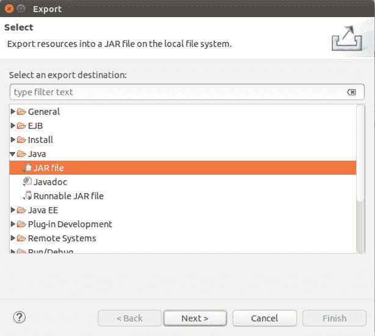

3.  在 JAR File Specification 对话框中，单击 **Browse**。
4.  在 File Selection 对话框中，导航到您的 minecraft-project 目录的 spigot-plugin 子目录，选择 **HelloWorld.jar**，然后单击 **OK**。

    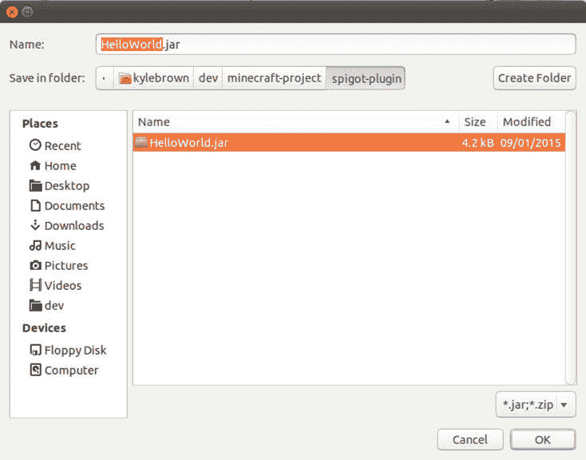

5.  返回到 JAR File Specification 对话框，单击 **Overwrite existing files without warning**，然后单击 **Finish**。

    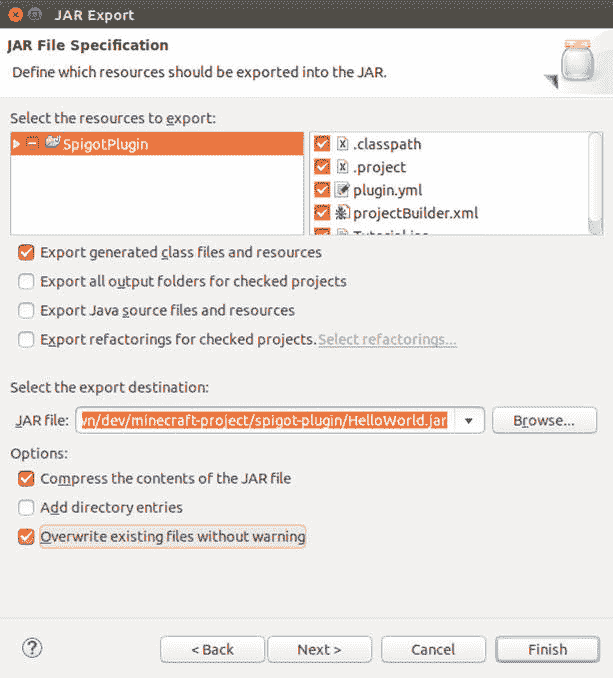

您的新 JAR 文件现在已替换旧文件。是时候查看您的代码是否能运行了！

### 新的 Dockerfile

像上一个示例中一样，我们将使用一个新 Dockerfile，该文件将在一个 Docker 镜像中构建该示例。首先，在 Ubuntu 中打开第二个终端窗口 — 这样您就可在 Eclipse 仍在运行时运行 Docker 命令。在新的终端窗口中（假设您位于主目录中，这也是您将 minecraft-project 目录克隆到的地方），键入以下两条命令：

```
cd minecraft-project/spigot-plugin
cat dockerfile 
```

您将看到此示例的新 Dockerfile，如下所示。花一些时间查看它，看看您能否发现与我们的上一个示例 Dockerfile 的区别。

```
# Version 0.0.3
# This version builds a spigot server
# using the recommended build strategy for spigot
# This is advantageous in that it's better for plugin development
# and fits well with the Docker approach
# it also adds a first Minecraft plugin into the bare spigot server
#
FROM ubuntu:14.04
MAINTAINER Kyle Brown "brownkyl@us.ibm.com"
RUN apt-get update
RUN apt-get install -y git
RUN apt-get install -y default-jdk
RUN apt-get install -y wget
RUN mkdir minecraft
RUN wget "https://hub.spigotmc.org//jenkins/job/BuildTools/lastSuccessfulBuild/artifact/target/BuildTools.jar" -O minecraft/BuildTools.jar
RUN java -jar minecraft/BuildTools.jar
RUN echo "eula=true" > eula.txt
RUN mkdir plugins
ADD HelloWorld.jar /plugins/HelloWorld.jar
CMD java -XX:MaxPermSize=128M -Xms512m -Xmx1024m -jar spigot-1.8.8.jar nogui
EXPOSE 25565 
```

您可能已经注意到，这非常类似于我们在本系列的[第 1 部分](https://developer.ibm.com/zh/tutorials/minecraft-and-ibm-cloud-part-1/)中看到的 0.0.2 示例 Dockerfile，但有两处不同。首先，这个文件创建了一个名为 “plugins” 的新目录。第二，它在 Docker 中执行了一个您未看到过的新命令：`ADD`。

`ADD` 命令从您的本地（主机）目录获取一个文件，并将它复制到 Docker 文件 — 这太棒了！这就是我们在这个示例中想要的结果 — 我们希望能够更改我们的插件文件，同时撇开其他部分不管。但是，`CMD` 命令在您每次使用 Docker `run` 启动一个新容器时都会运行，与它不同的是，`ADD` 命令仅在您执行 Docker `build` 时运行。这意味着，如果更改插件，则需要重新构建您的镜像。对于此示例，让我们在命令行键入下面这个命令，首次构建我们的新镜像：

```
sudo docker build -t="<directory>/spigot188-plugin" . 
```

就像您在[第 1 部分](https://developer.ibm.com/zh/tutorials/minecraft-and-ibm-cloud-part-1/)中所做的一样，将 <directory>替换为您的登录 id。您第一次构建新镜像时，所花的时间可能比后续构建更长，因为 Docker 会建立一些新的镜像层。</directory>

您已经构建了新的镜像，是时候运行它了！为此，键入以下这条命令：

```
sudo docker run -i -t -p=25565:25565 <directory>/spigot188-plugin 
```

因为您在与以前相同的端口上启动 Docker 容器的，所以应该不需要更改 Minecraft 客户端的配置。您将在 Minecraft 服务器的屏显日志中找到您的插件在正常运行的第一条线索 — 查找一个类似这样的行：

```
[14:22:50 INFO]: Done (12.942s)! For help, type "help" or "?" 
```

确定服务器已成功启动后，启动 Minecraft 客户端，连接到您的服务器，然后在 Minecraft 内键入：

```
/hello 
```

您的 Minecraft 命令屏幕看起来应该类似于下图：

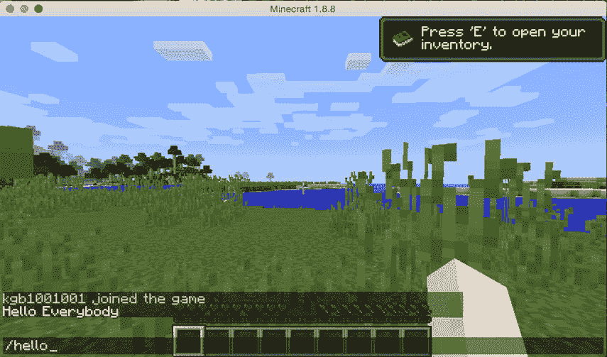

如果您看到消息 “Hello Everybody”（或您将该消息更改为的任何消息），则表明它在正常运行。恭喜您！

## 结束语

在本教程系列的第 2 部分中，您学习了如何使用 Eclipse 为 Minecraft 构建一个简单的服务器端插件，以及如何在 Docker 上运行它。[第 3 部分](http://www.ibm.com/developerworks/cn/cloud/library/cl-bluemix-minecraft-spigot-trs-3)中，将会进一步改进插件 — 让它在网络上的 IBM Cloud 中运行。

本文翻译自：[Building plugins for Minecraft with Docker and Eclipse](https://developer.ibm.com/tutorials/minecraft-and-ibm-cloud-part-2/)（2017-07-19）