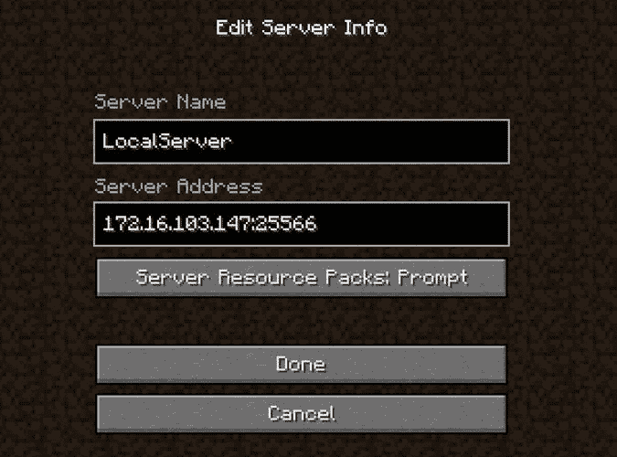

# Archived | 在 Docker 内运行 Minecraft 服务器

> 原文：[`developer.ibm.com/zh/tutorials/minecraft-and-ibm-cloud-part-1/`](https://developer.ibm.com/zh/tutorials/minecraft-and-ibm-cloud-part-1/)

**本文已归档**

**归档日期：:** 2019-12-09

此内容不再被更新或维护。 内容是按“原样”提供。鉴于技术的快速发展，某些内容，步骤或插图可能已经改变。

哪个 Java™ 程序的使用频率比其他任何 Java 程序高整整一个数量级？**提示：**自 2009 年发布 beta 版本以来，该程序已售出了 7000 多万个副本。Microsoft 最近以 25 亿美元收购了创建这个程序的公司。围绕此程序已经形成了一个庞大的开发生态系统，而且数十万的人受到鼓励开始学习 Java 编程 — 以便可以开发此程序的扩展版本。

您从标题中可能已经猜到，这个程序就是 Minecraft 游戏，令人惊奇的是，这数十万开发人员主要是儿童和青少年。Minecraft 已成为市场上的一次现象级成功，部分原因在于它的独特结构：您可以通过商业渠道购买客户端（游戏的外观），但服务器可以自由扩展。任何人都可以启动自己的游戏服务器，这使得人们在根据自己的兴趣和好恶在网络上建立独特的 Minecraft 构建者社区时，拥有数千种不同的选择。

##### 关于本系列

**第 1 部分**：设置您的本地 Minecraft 和 Docker 开发环境，开始在您自己的服务器上使用 Minecraft。

**[第 2 部分](https://www.ibm.com/developerworks/cn/cloud/library/cl-bluemix-minecraft-plugins-trs-2/)**：设置您的本地 Eclipse 开发环境，然后开发、构建您自己的服务器端 Minecraft 插件，并将导出到一个本地 Docker 镜像中。

**[第 3 部分](https://www.ibm.com/developerworks/cn/cloud/library/cl-bluemix-minecraft-spigot-trs-3/)**：将 Docker 镜像部署到 IBM Cloud，然后运行它们，使用它们作为可通过云访问的 Docker 容器。

**[第 4 部分](https://www.ibm.com/developerworks/cn/cloud/library/cl-bluemix-minecraft-watson-trs-4/)**：使用一个插件扩展 Spigot 服务器，该插件使用 IBM Cloud 上的 Watson 认知服务为您的游戏体验添加了一些科学性。

但该服务器既可以供您下载来启动您自己的服务器，也可以由想要为游戏构建自己的加载项的人进行扩展。在本系列中，我将展示如何利用 Minecraft 插件开发来传授一些特定的开发技术和原则。

您将了解如何轻松测试您在本地编写的插件，然后获取完全相同的配置，并在您的好友（“公测人员”）可以访问和试用的云服务器上原封不动地运行它。您将使用两种特定的技术完成这项任务：Docker 和 IBM Cloud 容器，在此过程中，您还将了解如何设置 Eclipse 和 IBM Cloud DevOps Delivery Pipeline 服务来构建您的插件，甚至是如何使用 git 设置团队开发。

## Docker、IBM Cloud 和容器简介

在深入介绍之前，我将向任何可能熟悉 Minecraft 和 Java，但不熟悉 Docker 和 IBM Cloud 的读者解释一下我刚才提到的过程。在第一篇教程中，我将重点介绍如何在 Docker 中设置本地 Minecraft 服务器，所以我们首先将介绍 Docker。

通过一个比喻或许能让您更好地理解 Docker。Docker 通常被称为“代码的运输集装箱”。那么这是什么意思？想想运输集装箱是什么（您总是会看到它们），它们是您在卡车、货车车厢上看到的长方体金属箱子，尤其是在港口之间运输数百个集装箱的称为集装箱云货船的大型船舶上的那些长方体金属箱子。

运输集装箱改变了货物在国家之间转运的方式。我们假设您在制造智能电话。您希望将数千台手机从韩国的工厂转移到位于加拿大多伦多的电子商店。过去，在卡车之间和船舶之间转移时，这些装电话的盒子可能会被装箱和拆箱数十次，在运输途中的仓库中停留多次。每次堆叠和卸下一个盒子时，它们都有可能被损坏或丢失。此外，堆叠和卸下这些货物既耗时又耗钱。如今，手机盒在工厂中一次性地装载到一个大型的钢制集装箱中，该集装箱由起重机从卡车转移到船上，再转移到卡车上，最后转移到电子商店 — 在任何时候都不会拆箱或打开。

Docker 对代码执行同样的操作。我们如今构建和运行代码（比如 Java）的方式是，在开发环境中开发您的代码。然后将源代码转移到另一个系统，该系统将编译您的代码并将它“构建”到一个可运行的系统中（一个 WAR 文件或 JAR 文件）。但是，这个可运行的代码需要大量基础架构（比如一个特定的 Java 运行时，或者一个特定的应用服务器，以及大量开源 JAR 文件）才能运行。所以这些事物都需要转移到您的单元测试服务器、您的系统测试服务器和您的每个生产服务器中，一次又一次地重新组装。每个阶段都带来了某个事物可能在“装箱和拆箱”步骤中出错的可能性。您可能选择了某个事物的错误版本，或者您可能在此过程中忘记某个事物 — 导致可能很难跟踪的错误。

Docker 允许您将整个运行系统（一直到操作系统）打包到一个轻便的包中（毫不奇怪，这个包也称为容器），然后您将在不同地方转移这个包。在转移它时，未留下任何事物，也未破坏任何事物。

IBM Cloud 在这方面提供了方便，使您能够获取您的 Docker 容器，不仅能在本地机器上运行它们，还能在云中运行它们，供其他人访问。IBM Cloud 容器为您提供了实现此目的的一种简单方法。

在这个教程系列中，我们将重点介绍的前两件事是，如何让一个 Minecraft 服务器在 Docker 本地运行，然后如何让同一个 Docker 容器在 IBM Cloud 中运行。

## 购买并安装 Minecraft 客户端

正如我早先提到的，Minecraft 的特征是，他们向数百万玩家销售客户端并开放了源代码，所以用户可以扩展该游戏，并为了获得多用户游戏体验而设置 Minecraft 服务器。您需要执行的第一步是购买并安装 Minecraft 客户端。可以在 [Minecraft 网站](https://minecraft.net)上找到在大多数操作系统上安装该客户端的说明。

我们将在 Ubuntu 中开发和运行我们的服务器，但您可以在任何受支持的操作系统上运行 Minecraft 客户端。您只需要知道该服务器的 IP 地址，而且您的客户端需要能够连接该 IP 地址。事实上，我购买了本机 Mac Minecraft 客户端，然后从该客户端连接到在我桌面上的一个 VMWare 虚拟机中运行的开发服务器。

## 安装并配置 Docker

您需要做的下一件事是下载并配置 Docker 以及让整个指令集发挥作用所需的其他软件。我们从 Docker 开始介绍。在本系列中，我将展示如何为 Ubuntu Linux 14.03.3 LTS 安装和配置它。如果您希望在不同的操作系统上执行此操作，请参阅针对相应平台的 [Docker 安装说明](https://docs.docker.com/installation/)。

尽管我们使用的是 Ubuntu 14.04.3 LTS，但您可以使用任何同时支持 Docker 和来自 Cloud Foundry 和 IBM 的 Cloud Foundry 工具的操作系统，包括 Windows 和 Linux。我推荐使用 Ubuntu，因为根据我的经验，在 Linux 中直接执行这种开发既更干净，又更简单。幸运的是，在其他任何操作系统中，很容易在 VMWare 或 VirtualBox 中下载和创建 Linux 镜像，所以我推荐您以此为基础来执行操作。在这么做时（或者如果您刚将 Ubuntu Linux 安装在硬件上），我还推荐将它配置为使用至少 2GB RAM 和 2 个核心 — 任何比此更低的配置都可能导致以后执行的一些构建失败。

在此示例中，我将展示如何在一个 VMWare 环境中运行的 Ubuntu 镜像内配置和运行 Docker。如果您选择使用 Virtualbox 或另一个虚拟机管理程序，那么在 Ubuntu 外执行的一些任务可能稍微不同。

### 在 Ubuntu 中安装 Docker

1.  将以下命令输入到 Ubuntu 中的“终端”应用程序来安装 Docker 1.7.0：

    ```
    wget -qO- https://get.docker.com/ | sed 's/lxc-docker/lxc-docker-1.7.0/' | sh 
    ```

2.  第一个命令会下载 Docker 并将它安装到 Ubuntu 中。但是，在默认安装中，Docker 要求您使用 root 用户特权运行 Docker 命令。为了避免这么做并使用不同的 id，可以运行下面这个命令：

    ```
    sudo usermod -aG docker <your nonroot login id> 
    ```

3.  发出该命令后，退出 Ubuntu 并重新登录。

### 安装 Cloud Foundry 命令行工具

接下来，需要安装 Cloud Foundry 命令行工具。我们不会在第一篇教程中使用它们，但在第三篇教程中将会开始使用它们，现在，在设置您的 Ubuntu 镜像时安装它们是一个好主意。如果在其他任何平台上，则需要转到 [GitHub](https://github.com/cloudfoundry/cli/releases)，在您的浏览器中安装正确的工具，但此过程适用于 Ubuntu。

1.  在命令行上，键入下面这行命令来下载 Cloud Foundry 命令行工具：

    ```
    wget
    "https://cli.run.pivotal.io/stable?release=debian64&version=6.12.3&source=github-rel"
    -O cf-cli_amd64.deb 
    ```

2.  在命令行上键入以下命令来安装这些工具：

    ```
    sudo dpkg -i cf-cli_amd64.deb 
    ```

3.  安装用于 Cloud Foundry 工具的 IBM 插件，它将使您能够在以后上传和运行 Docker 镜像。为此，在 Ubuntu 中键入以下命令：

    ```
    cf install-plugin https://static-ice.ng.bluemix.net/ibm-containers-linux_x64 
    ```

4.  在安装 IBM Containers 插件后，需要重新启动 Docker。为此，在您的终端中发出下面这条命令：

    ```
    sudo service docker restart 
    ```

5.  下载并安装 Docker 以及用于 Docker 的 Cloud Foundry 工具后（它们使您能够对二者执行一些有趣的操作！），就可以下载示例代码了，我们将在这篇教程和接下来的两篇教程中介绍该示例。示例代码包含在 git 中，您可使用下面这个命令下载它：

    ```
    git clone  https://github.com/kgb1001001/minecraft-project.git 
    ```

## 关于基本的 Minecraft Dockerfile

您可以通过两种不同方法运行 Docker。可以在 Docker 中启动一个容器并开始使用它，然后开始对运行的容器执行一些更，改并将更改保存为新镜像文件。但是，您需要记住，我们对 Docker 感兴趣的原因之一是，它可以避免执行手动更改所带来的问题，所以该方法对我们没有实际帮助！我们将使用同样受 Docker 支持的一种不同方法，那就是 Dockerfile。Dockerfile 是一组以可重复方式构建镜像的命令。通过这种方法，但您在不同的机器上执行 Dockerfile 时，您始终会获得完全相同的结果。可以将它视为一个“提货单”，它告诉您 Docker 镜像中（以及您构建的容器中）包含的内容。

我们的第一个 Docker 文件的用途是看看在 Docker 本地正常运行一个 Minecraft 服务器有多容易。所以让我们首先看看 Dockerfile。要查看 Dockerfile，可以键入以下命令：

```
cd minecraft-project
cat minecraft/dockerfile 
```

Dockerfile 的内容如下所示。我们一次分析一部分内容。

```
# Version 0.0.1
# This docker file builds a basic minecraft server
# directly from the default minecraft server from Mojang
#
FROM ubuntu:14.04
MAINTAINER Kyle Brown "brownkyl@us.ibm.com”
RUN apt-get update
RUN apt-get install -y default-jdk
RUN apt-get install -y wget
RUN mkdir minecraft
RUN wget -O minecraft/minecraft_server.jar \
https://s3.amazonaws.com/Minecraft.Download/versions/1.8.8/minecraft_server.1.8.8.jar
RUN echo "eula=true" > eula.txt
CMD java -Xms512m -Xmx1024m -jar minecraft/minecraft_server.jar nogui
EXPOSE 25565 
```

*   Dockerfile 中的第一个命令（在一些以井号为前缀的有帮助的注释之后）是 `FROM`。它显示这个 Docker 镜像是从哪个镜像构建而来的。Docker 的一个优势是，您可以使用其他镜像来构建镜像，所以如果其他人希望获取您的镜像并以某种方式扩展它，很容易在一些限制内完成此任务。在我们的例子中，我们从来自 Dockerhub 存储库的最新的 Ubuntu 14.04 镜像构建该 Docker 镜像。
*   `MAINTAINER` 显示谁负责编写和维护此文件。
*   接下来的 3 个命令很有趣。`RUN` 命令的作用是在 Linux 命令行上执行一个命令。我在接下来的 3 个命令中所做的事是，将当前的 Ubuntu 镜像更新到来自 Ubuntu 的最新的修复程序和更新集，然后安装默认的 Java JDK 和 wget 实用程序。接下来，我创建了一个名为 minecraft 的目录，并从托管 minecraft_server.jar 文件的 Amazon S3 存储网站下载它，然后将它放在 minecraft 目录中。
*   我的下一条命令是创建一个名为 eula.txt 的文件，它显示此服务器的用户已接受 EULA 协议。
*   现在我们已经涉及到了我们想执行的操作的核心。在这个 Dockerfile 创建的 Docker 镜像运行时，`CMD` 指令执行 `CMD` 关键字后的所有内容。这很重要 — `RUN` 指令在构建 Dockerfile 后或从一个包含指令的 Dockerfile 转换为最终的 Docker 镜像后立即执行。`CMD` 指令在您实际启动从此镜像创建的容器后才会执行。
*   最后一个指令是 `EXPOSE`。`EXPOSE` 关键字指出了在 Docker 容器运行时，应该可以从外部访问在 Docker 容器内查看的哪些 TCP/IP 端口。默认情况下，无法访问 Docker 容器内的任何端口 — 这意味着它们在默认情况下是安全的，您需要选择想要公开的端口和公开的时间。

正如我早先提到的，获得一个运行的容器需要两步：将 Dockerfile 构建到镜像中，然后以容器形式运行该镜像。但首先，您需要确定您的 Docker 存储库的名称。我通常使用与 Ubuntu 中的登录名相同的名称，所以只要您在后面的指令中看到 <directory>，即可将它替换为您的登录 id（例如，我的是“kbrown”）。</directory>

1.  我们首先在终端发出以下命令：

    ```
    cd minecraft
    sudo docker build -t="<directory>/minecraft188" . 
    ```

    请注意，最后一条命令末尾的点 (.) 很重要。此命令通过当前 (“.”) 目录中找到的 Dockerfile 内的指令创建一个全新的镜像 — 这是我们之前看到的同一个 Dockerfile。

    这导致所有步骤一次执行一个，并输出一些有关这些步骤的中间信息。依赖于您的网络连接速度，此命令可能花几分钟或更长时间，因为 Dockerfile 中的许多命令（比如 apt-get 命令）需要将该软件的新版本下载到您的 Docker 镜像中。如果该命令正常执行，您在成功执行 `RUN java -jar minecraft/BuildTools.jar` 后应看到的最后一行是：

    ```
    Successfully built 764c25d251f6 
    ```

    请注意，您的消息末尾的 12 位 id 将不同，但您希望看到 “Successfully built” 消息。

2.  现在是揭示真相的时刻了 — 我们准备查看您是否能够在 Docker 中运行 Minecraft 服务器！要尝试此操作，可以发出下面这条命令，同样用您的登录名替换 <directory>。</directory>

    ```
    sudo docker run -i -t -p=25565:25565 <directory>/minecraft188 
    ```

    完成后，您会在控制台底部看到一条类似这样的消息：

    ```
    [14:10:43] [Server thread/INFO]: Done (6.086s)! For help, type "help" or "?" 
    ```

3.  我们几乎可以认为我们可以尝试在 Docker 中运行我们的新 Minecraft 服务器了，但我们还需要找到一条信息。您在 VMWare 中运行虚拟机时，它在对您的主机机器可见但对其他所有机器不可见的一个网络地址上运行。但是，为了连接任何在该网络地址上运行的程序，您需要先找到它。因为我们当前的终端窗口正在 Docker 中运行 Minecraft，所以请转到 Ubuntu Terminal 的 File 菜单并选择 **Open Terminal** 来打开另一个窗口。
4.  在第二个终端窗口中，键入下面这条命令：

    ```
    ifconfig eth0 | grep "inet addr” 
    ```

    执行该命令时，您会看到类似以下输出的信息：

    ```
    inet addr:172.16.103.242  Bcast:172.16.103.255  Mask:255.255.255.0 
    ```

    紧挨 `inet addr:` 之后的网络地址是我们将在主机操作系统上的 Minecraft 客户端中用来连接我们的新服务器的地址。

## 设置 Minecraft 客户端

现在到有趣的部分了！

1.  启动您的 Minecraft 客户端，单击第一个屏幕上较大的开始按钮（该屏幕提供了即将发布的版本等信息）。
2.  在随后的 Minecraft 启动屏幕中，选择 **Multiplayer**。

    

3.  在随后的 Play Multiplayer 屏幕上，单击 **Add Server**。

    

4.  在 Add（或 Edit）Server Info 屏幕上，输入您早先在您的 VM 中找到的 IP 地址，确保在服务器 IP 网络地址末尾添加了 `:25565`（25565 是我们从 Docker 容器公开的端口）。

    

5.  单击 **Done**，然后在 Play Multiplayer 屏幕上单击 **Join Server** 加入您的新服务器。

    您会在 Docker 内新的本地服务器上运行！

6.  玩一段时间的游戏，或许在 Minecraft 中搭建了一些物体并杀死一些怪物后，您可以转到（Docker 中）运行您的服务器的 Ubuntu Terminal 窗口，按下 **control+C** 结束 Docker 容器。

## 关于 Spigot Dockerfile

能够像上面这样托管您自己的本地 Minecraft 服务器显然很有趣，但这不是本教程系列的重点。问题在于，由于 Minecraft 直接来自 Mojang，所以它在服务器端的扩展能力不是很强。 本系列文章想要展示的是如何利用 IBM Cloud 提供的一些 Watson 服务，这意味着我们需要一个可以修改的 Minecraft 服务器。在 2010 年，一组开发人员为这个服务器构建了一个 API — 他们将这个 API 称为 Bukkit API，它允许您将自己的扩展构建为 Minecraft 插件。Bukkit API 有许多实现，但最常用的是 Spigot 实现。Spigot 不仅是最常被修改的 Minecraft 服务器版本，而且它还通过多种改进来实现更高的效率和更高的性能。

我们将使用 Spigot 作为我们的服务器，所以剩余的示例没有基于前面的示例中的通用 Minecraft 服务器，我们将使用 Spigot 服务器继续我们的介绍。检查下面给出的 Dockerfile，看看它的区别，以了解如何实现此目的。

请注意，这个 Dockerfile 中的命令是从 Spigot 网站（[`www.spigotmc.org/wiki/buildtools）上的构建指令修改而来的。如果您在这个`](https://www.spigotmc.org/wiki/buildtools）上的构建指令修改而来的。如果您在这个) Dockerfile 中遇到问题，这或许是由于更改所致，请返回参阅该页面 — 它是有关如何构建 Spigot 服务器的信息的权威来源。

我们将查看新的 Dockerfile：

```
# Version 0.0.2
# This version builds a spigot server
# using the recommended build strategy for spigot
# This is advantageous in that it's better for plugin development
# and fits well with the Docker approach
#
FROM ubuntu:14.04
MAINTAINER Kyle Brown "brownkyl@us.ibm.com”
RUN apt-get update
RUN apt-get install -y git
RUN apt-get install -y default-jdk
RUN apt-get install -y wget
RUN mkdir minecraft
RUN wget "https://hub.spigotmc.org/jenkins/job/BuildTools/lastSuccessfulBuild/artifact/target/BuildTools.jar" -O minecraft/BuildTools.jar
RUN git config --global core.autocrlf input
RUN java -jar minecraft/BuildTools.jar
RUN echo "eula=true" > eula.txt
CMD java -XX:MaxPermSize=128M -Xms512m -Xmx1024m -jar spigot-1.8.8.jar nogui
EXPOSE 25565 
```

此文件的某些方面看起来应该很熟悉，因为它们与我们早先查看的基本 Minecraft 服务器示例相同。例如，更新 Ubuntu Linux 和安装默认 JDK 的命令是相同的。但是，这个 Dockerfile 还安装了 git 工具，我们已在 Linux 中使用过该工具。

真正的变化发生在执行 `wget` 从 SpitgotMC 服务器（而不是托管普通的 Minecraft 服务器的 Amazon S3 服务器）抓取该文件的行之后。我们从 SpigotMC 服务器抓取的不是我们随后运行的简单 JAR 文件，而是我们用于实际构建最终 JAR 文件的中间文件。这样做的优势是，我们可以始终获取 Spigot 服务器的的最新版本，不需要更改 Dockerfile 中的其他代码。我们还需要对 git 的默认行为执行一些更改（构建过程会使用它），以便以 Microsoft Windows（大多数 Spigot 开发都在这里进行）和 Linux 之间处理回车/换行的方式来处理这些区别。

为了查看构建过程有何不同，可以在您早先从中运行 Minecraft 容器的相同目录发出以下命令。

```
cd ../spigot

sudo docker build -t="<directory>/spigot188” . 
```

请注意，构建此文件需要花很长的时间！但好消息是，Docker 的分层性质意味着 Docker 不需要每次都构建所有中间步骤。要理解我的意思，可以再一次执行该命令。它的执行速度应该快得多！原因可在输出中找到：

```
Step 7 : RUN wget "https://hub.spigotmc.org/jenkins/job/BuildTools/lastSuccessfulBuild/artifact/target/BuildTools.jar" -O minecraft/BuildTools.jar
 ---> Using cache
 ---> fdf1e118f298
Step 8 : RUN git config --global core.autocrlf input
 ---> Using cache
 ---> 5a130309c12c
Step 9 : RUN java -jar minecraft/BuildTools.jar
 ---> Using cache
 ---> 516e9fb02428 
```

请注意，在每条命令后显示了 `Using cache`。当 Docker 在 Dockerfile 中执行一个步骤时，它会将结果缓存为一个新镜像。在[第 2 部分](http://www.ibm.com/developerworks/cn/cloud/library/cl-bluemix-minecraft-plugins-trs-2/)中，当我们开始为 Spigot 构建插件时，您会看到我们仍然没有经历构建过程的耗时部分 — 更新 Ubuntu 和构建 Spigot 文件！

要查看您是否构建成功，可以发出下面这条命令：

```
sudo docker run -i -t -p=25565:25565 <directory>/spigot188 
```

如果您看待类似这样的消息：

```
[21:16:17 INFO]: Done (11.170s)! For help, type "help" or "?" 
```

您已经成功构建了您的第二个 Minecraft 服务器 — 这个服务器可扩展！尝试将您的 Minecraft 客户端连接到新服务器（它位于与前面的示例相同的网络地址上，所以您不需要更改地址），看看是否一切正常。

## 结束语

您现在已经完成这个教程系列的第 1 部分的学习。您学习了 Docker 的工作原理，它对 Minecraft 开发人员有何用处，您还了解了两个创建本地 Minecraft 服务器的 Dockerfile 的一些详细示例。在[第 2 部分](http://www.ibm.com/developerworks/cn/cloud/library/cl-bluemix-minecraft-plugins-trs-2/)中，您将学习如何为 Spigot 服务器创建插件，您将看到一个在该服务器内运行的插件的例子。

本文翻译自：[Running Minecraft servers within Docker](https://developer.ibm.com/tutorials/minecraft-and-ibm-cloud-part-1/)（2017-07-20）