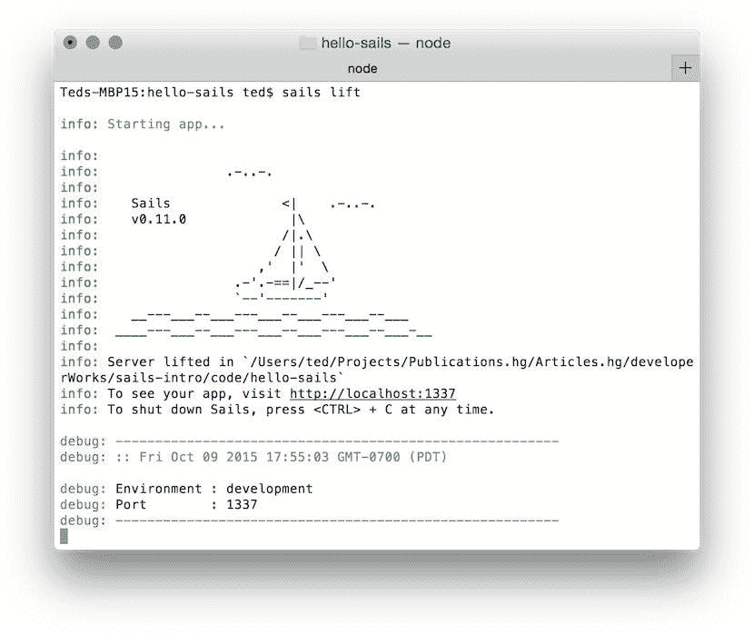

# 使用 Sails 构建和部署一个基本 Web 应用程序

> 原文：[`developer.ibm.com/zh/tutorials/wa-sailsjs1/`](https://developer.ibm.com/zh/tutorials/wa-sailsjs1/)

您是否曾经在一个食品店的奶酪货架旁徘徊，被来自全世界的奶酪引人入胜的包装搞得不知所措？这也没什么，但麻烦在于决定将哪种奶酪带回家。

奶酪选择如此丰富，以至于成为了 *选择悖论* 的完美例子，该原则表明没有选择是件坏事，但拥有太多选择同样是件坏事，而且有时会导致用户完全放弃选择。

寻找 Node.js 框架或库的开发人员就面临着这个问题，这是一个虚拟的有钱人窘境。很难知道从如此多的选项中选择哪一个，更不用说如何开始使用一个 Node.js 框架了，或者是哪些因素将帮助您决定它是否是正确的选择。

## 选择 Sails.js

##### 关于本系列

像它的同类产品 Ruby on Rails 一样，Sails.js 是一个旨在帮助开发人员构建 Web 应用程序的框架。Rails 默认用于构建在服务器上生成 HTML 并将其发回给浏览器的应用程序，与它不同的是，Sails 为构建 HTTP API 提供了很好的开箱即用的支持。这种设计有助于在客户端和服务器之间实现更好的关注点分离，以及促进客户端和服务器之间的更多的互操作性。在本系列教程中，Web 开发人员和教师 Ted Neward 将向您介绍 Sails.js。HTTP API 示例应用程序可以是 AngularJS、React 或几乎任何其他客户端应用程序的后端。

考虑到过多的选项，在选择 Sails.js 之前，我需要艰难地排除一些备选选项。我喜欢 Sails，因为它包含的一些想法已使 Rails 框架变得如此成功，同时保持着一个明显的 Node.js 风格。具体来讲，Sails 使用分层开发和约定优于配置（convention over configuration），这两种开发技术已被 Rails 和类似的框架普及。Sails 还集成了其他一些 Node.js 包作为关键组件，这意味着您不需要从头学习该框架。另一个优势是，事实上 Sails.js 的文档在不断改进，这是我在任何开源项目中都要寻找的一个关键指标。

在第一部分中，我将重点介绍 Sails 如何实现分层开发。未来的几部分将介绍约定优于配置和使用 Sails 编码的其他便捷性。[在此获得示例源代码](http://public.dhe.ibm.com/software/dw/web/wa-build-deploy-web-app-sailsjs-1-bluemix/sailsjs1-code.zip)。

### 新 MVC

> *对传统 MVC 架构的这种重新配置，实现了架构师和开发人员长久以来在应用服务器中寻找的东西：一个包含业务逻辑和验证的单一位置，以及一个用于多个客户端的通用接口。*

Sails 的分层开发方法与许多传统 Web 开发人员可能期望的不同。事实上，Sails 是新兴的框架种类中的一个，这些框架通过调优 MVC 而重新定义了 Web 应用程序开发的前景。与传统的 MVC 架构中将 MVC 组件放在服务器上不同，Sails 将模型和控制器放在服务器上，而视图位于客户端层。Sails 还将 “视图” 视为一种更加一般性的概念；它可以是 HTML，但它也可以是一个在原生 iOS 或 Android 中编写的移动应用程序。

不同于由服务器向客户端传送回 HTML，Sails 仅传送数据（通常为 JSON 或 XML 格式）。然后，客户端（一个移动应用程序或使用 AngularJS 等客户端 JavaScript 框架编写的单页 Web 应用程序）使用该数据，并以最适合客户端的方式呈现它。对于大部分客户端，数据表示格式将为 JSON，因为许多单页 Web 和移动客户端都是使用 JavaScript 编写的，而且可以轻松地使用 JSON。而且如果有必要，采用像 XML 这样的不同的数据表示格式也不难。

##### Mean.js 怎么样

Scott Davis 最近向 IBM Developer 读者 [介绍了 MEAN 堆栈](http://www.ibm.com/developerworks/cn/web/wa-mean1/index.html) 和 Mean.js 框架。我使用 Mean.js 完成了一些工作并维护着我使用它构建的一个项目，但我不关心它的一些底层设计决策。具体来讲，Mean.js 将客户端和服务器视为一个整体，而我信奉一种更加分层的方法。我将在本教程后面更详细地解释这一点。

对传统 MVC 架构的这种重新配置，实现了架构师和开发人员长久以来在应用服务器中寻找的东西：一个包含业务逻辑和验证的位置，以及一个用于多个客户端的通用接口。服务器仅需要以一种可被客户端识别的表示设计数据元素，此方法提供了一种通过 HTTP 端点执行传统业务逻辑和数据验证的轻松方式。

### HTTP API 示例应用程序

这种新架构（我称之为 HTTP API）类似于 RESTful 风格，但它实际上不是 REST; 至少依据 Roy Fielding 的 [REST 定义](http://www.ics.uci.edu/~fielding/pubs/dissertation/rest_arch_style.htm) 来讲不是。REST 依靠超媒体的交换作为表示应用程序状态的主要手段（这就是 Hypertext As The Engine Of Application State 或 HATEOAS 原则 — 可能是迄今为止发明的最差劲的缩写）。但 HTTP API 系统放弃了 REST 提供的一定的灵活性和 “通用客户端” 功能，以换取更简单的模型。

不同于 REST 系统，HTTP API 客户端需要它们与之通信的系统的一定的推断性知识。它们需要提前知道预期的结果和可用的端点。这与 REST 架构相反，但我发现它所换来的简单性物有所值。

##### 不断演变的 REST

大多数主要的基于 API 的在线系统都在使用 HTTP API。CouchDB、EventBrite、Yelp 和 GitHub 都在使用一种离真正的 RESTful 系统只有几步之遥的 HTTP API 设计。[Prismic](https://prismic.io)（一个 HTTP API CMS 系统）是我将在本系列中开发的示例的灵感来源。

在一个 HTTP API 中，客户端与服务器之间的所有通信在 HTTP 上发生。对于示例应用程序，我将使用 JSON 作为交换的数据格式，使用标准 HTTP 洞察来表示操作（GET 表示读取，POST 表示插入，PUT 表示更新，DELETE 表示删除）。我还将使用 HTTP 头部作为传达带外信息的机制，比如身份验证数据等。但是，我仍会将一些状态数据存储在服务器端（与传统的 REST 设计相反），而且交换的数据将全部为 JSON 并假定为特定于此系统。

HTTP API 的使用者示例 — 移动应用程序、单页 JavaScript 应用程序或者甚至其他想访问这里包含的数据的服务器; 将知道我将向它们发回的 JSON 类型。这不同于更具有 REST 风格的超文本/HATEOAS 的关注点，后者演示任何应用程序都应能够 “发现” 发回的信息。更重要的是，使用者将知道它们的数据将发送到、被检索或修改的后续 HTTP 端点。

在评估 Sails.js 时，我花了一些时间来试验它。所以言归正传，让我们开始了解 Sails 吧。

## 需要的准备工作：前提软件和设置

我希望您对 REST 和 RESTful 架构的原理和术语具有一定的了解；您不需要是发烧友，但您应熟悉 “原生地” 使用 HTTP 来提交 GET 请求、POST 请求等。您不应被查看动态的 HTTP 请求的想法吓到。

我还假设您熟悉 JavaScript、Node.js 和 npm（JavaScript 代码和库的包管理器）。您应在所选的开发环境上安装了 Node.js，知道如何在本地运行 Node.js 应用程序，并能够自行使用 “npm-install” 安装软件包。尽管查阅所谓的 *现代 JavaScript* 很有帮助（具体来讲，Douglas Crockford 在 *[JavaScript:The Good Parts](http://shop.oreilly.com/product/9780596517748.do)* 或它所催生的许多图书或教程之一中描述的 JavaScript），但事实上，您仅需要 JavaScript 的实用知识即可开始使用 Sails。

对于您的开发环境，请确保您机器上的 Node.js 是最新的（截至编写本文时，我的版本是 0.12.7），而且您安装了最新的 npm 版本（我的版本是 2.12.1）。尽管 Node.js 社区明显在尝试保持各个版本向后兼容，但无法保证我在这里编写的代码就适用于该技术的早期版本。一经出售，概不负责。

### 安装 Sails.js 和 MongoDB

使用 Sails.js 唯一需要的安装是在全局上将它安装到 npm 缓存，就像这样： `npm install -g Sails.js` 。

完成之后，您将拥有一个实用程序命令 `sails` 可供使用。像 npm 一样， `sails` 是一个使用 JavaScript 为 Node.js 编写的命令行实用程序。它充当着使用 Sails.js 框架执行多种操作的单一来源实用程序 — 比如创建一个新应用程序，运行该应用程序，在调试循环中运行该应用程序，为该应用程序生成新组件，等等。通过 npm 安装 Sails.js 时，一定要使用 `-g` 选项。否则，它将仅安装在当前的项目目录中，而且这是该实用程序真正需要全局化的少有情况之一。

在等待 Sails.js 框架下载和安装期间，请花片刻时间确保您已在开发环境中设置了 MongoDB。如果没有设置，现在正是 [下载一个适合您的目标平台的安装程序](http://www.mongodb.org/downloads) 的好时机。

请注意，Sails.js 使用的不仅仅是一个 MongoDB 后端；事实上，Sails.js 开箱即用地使用了一种基于磁盘的轻量型格式。这不是用于生产用途的推荐设置，但非常适合像我们这样的示例。到达本系列中使用 MongoDB 的部分还需要一段时间，但在我使用它时您一定很高兴拥有它。

这是目前需要的基本设置。在本教程后面将本地应用程序部署到 IBM Cloud 时，您将需要向资源组合中添加一个 [Cloud Foundry 安装](https://docs.cloudfoundry.org/devguide/installcf/install-go-cli.html) 和一个 [IBM Cloud](https://cloud.ibm.com/?cm_sp=ibmdev-_-developer-tutorials-_-cloudreg) 。

### 检查安装

Sails.js 完成安装了吗？使用命令 `sails version` 验证它。

截至编写本文时，Sails.js 的最新版本是 0.11.0。只要上面的命令生成的输出不是错误，就表明 Sails 已安装并准备好使用。

## Sails.js 显示 “Hello, world!”

根据惯例，程序员在学习一种新语言或环境时所做的第一件事是使用该语言编写最简单的程序：一个 Hello World 应用程序。幸运的是，Sails 生成了一个 Hello World 作为您创建一个新应用程序时的基本应用程序框架。我可使用此应用程序确认 Sails 基础架构有效。为了向敏捷开发战略致敬，我还将该框架部署到云（在本例中为 IBM Cloud）中，作为 “尽早发布，经常发布” 战略的一部分。

### 创建一个基本的 Sails.js 应用程序

获取一个新 Sails.js 应用程序非常简单。请注意，默认情况下，该框架将生成一个更传统的 Web 应用程序，其中服务器生成的 HTML 会发回到客户端。尽管这本身很有用，但如果目标是构建一个对客户端不可知的 HTTP API，我希望确保没有意外 “泄露” 将客户端与服务器捆绑在一起。为此，最佳方式是构建一个在项目任何地方都没有客户端组件的服务器。在 Sails.js 中，这非常简单，只需将您的默认配置设置为 `--no-frontend` 。

使用 `--no-frontend` 选项的不足之处是，我没有可视的方式来确认该框架有效。我希望在将应用程序部署到 IBM Cloud 时执行该验证。所以在第一部分中，我将创建拥有漂亮的 HTTP 前端框架的应用程序，但在未来的几个部分中，我会假设该应用程序构建时未使用任何前端部分（差别仅在于生成的 views 目录中填充的内容，所以它没有可能看起来那么复杂）。

闲话少说。我们实际操作一下吧！

从开发机器上您想要代码所在的目录，通过 `sails` 命令行发出一个 `new` 命令，然后命名您的应用程序： `sails new hello-sails` 。

完成这一步后，Sails 将等待片刻，然后回复一条类似这样的消息：”Created a new Sails app ‘hello-sails’!”（如果返回了任何其他信息，可能您的 Sails.js 安装某处出错了。）在目标目录中（根据应用程序名称推断而来），您会看到 Sails.js 生成了许多目录和文件。我将在整个系列文章中更详细地介绍其中大部分内容。就现在而言，您只需熟悉 Sails 应用程序的基本知识。

一般而言，可以安全地假设创建框架不会有任何问题（只要没人接触它），但知道如何在本地运行该应用程序会很有帮助。我们通过一个 “sails lift” 来开始我们的操作。

##### 在本地运行 Sails.js



非常漂亮，不是吗？就个人而言，我喜欢这种颜色的用法，此外这也正是 ASCII 作品令人印象深刻的显示形式。更重要的是，这个小型 ASCII 图像确认 Node.js 正成功地在本地机器的端口 1337 上运行我们搭建的应用程序。在浏览器中访问它，将出现默认的 Sails.js 网页，其中包含连接回主要 Sails 主页和文档的链接。

##### 关于生产 UI

选择一个 `--no-frontend`，Sails 应用程序将生成与更传统的 Web 应用程序相同的主页；而且 UI 将非常简单，包含缺少的客户端资产的负载。随着您逐渐了解 Sails，试验一下生成一个传统 Web 应用程序框架和一个没有前端的框架是值得的。您将会亲自在 HTTP API 设置中了解到应用程序拥有什么和缺少什么。

## 将 Sails.js 部署到云

在本地机器上运行与将代码部署到生产（或准生产）服务器不同，这时就需要使用云。对于本系列文章，我将使用 IBM Cloud 作为云主机。它看起来非常合适，而且 IBM Cloud 是一个容易用于托管基于 Node.js 的应用程序的平台。

IBM Cloud 也恰好基于 Cloud Foundry，所以如果您还没有 [安装 Cloud Foundry 客户端](https://docs.cloudfoundry.org/devguide/installcf/install-go-cli.html) (`cf`)，现在是时候安装它了。您将希望在托管您的 Sails.js 代码的同一台机器上运行它。

安装客户端后，运行 `cf--version` 来验证安装；在编写本文时，回送的版本是 6.12.2。

如前所述，您还需要一个 [IBM Cloud 登录帐户](https://cloud.ibm.com/?cm_sp=ibmdev-_-developer-tutorials-_-cloudreg) 来将应用程序部署到 IBM Cloud。获得您的凭据后，登录到 IBM Cloud 并将代码从您本地的 hello-sails 目录推送到 IBM Cloud。

##### 使用 cf 推送到 IBM Cloud

```
Teds-MBP15:hello-sails ted$ cf login
API endpoint: https://api.ng.bluemix.net

Email> ted@tedneward.com

Password>
Authenticating...
OK

Select an org (or press enter to skip):
1\. developerWorks
2\. ted@tedneward.com

Org> 1
Targeted org developerWorks

Targeted space Ted Neward

API endpoint:   https://api.ng.bluemix.net (API version: 2.27.0)
User:           ted@tedneward.com
Org:            developerWorks
Space:          Ted Neward 
```

`cf` 工具也需要知道要用于部署的 API 端点。如果 `cf` 无法确定该端点，您可通过命令 `cf api api.ng.bluemix.net` 手动设置它 (`api.ng.bluemix.net`)。

### 两个有用的文件

登录并设置 API 端点后，您将使用 `cf push` 将搭建的 Sails.js 应用程序部署到云。Cloud Foundry 仅需要一些参数即可正确地部署该应用程序。无需反复键入这些参数（它们会烦人地不断增加），可创建一个清单文件 (manifest.yml)。这将包含一些信息，比如要在 IBM Cloud 上使用的应用程序名称，要用于一个子域的主机名（如果它与应用程序名称不同），要为执行保留多少 RAM，等等。

示例的简单清单文件：

```
---
applications:
- name: tedneward-sailsIntro
  host: tedneward-sailsIntro
  memory: 256M
  command: node app.js 
```

Cloud Foundry 能识别的另一个有用文件是 .cfignore。它包含不应从本地应用程序推送到云的文件或目录列表。就现在而言，记录该信息只是为了未来参考。

##### 有关 YAML 的更多信息

请注意，清单的格式为 Yet Another Markup Language (YAML)，它已得到 Ruby 的普及。不是必须学习 YAML 才能理解本系列文章的示例。有兴趣的读者可在 [Cloud Foundry 的 GitHub 存储库](http://github.com/cloudfoundry/cli) 上找到该清单的设置的完整参考信息。

有了该清单文件，仅剩下执行 `cf push` 来让 push 命令完成自己的任务了（来自此命令的输出有时非常长，因为代码必须打包、上传、解包，然后安装在云实例上，这进而意味着需要在云实例上运行一次 `npm install` ，这会生成大量结果。因此，这里仅显示了前 20 行和最后 6 行输出）。

##### 使用 cf push 推送到 IBM Cloud

```
Using manifest file /Users/ted/Projects/sails-intro/code/hello-sails/manifest.yml

Updating app tedneward-sailsIntro in org developerWorks / space Ted Neward as ted@tedneward.com...
OK

Using route tedneward-sailsIntro.mybluemix.net
Uploading tedneward-sailsIntro...
Uploading app files from: /Users/ted/Projects/sails-intro/code/hello-sails
Uploading 31M, 11773 files
Done uploading
OK

Stopping app tedneward-sailsIntro in org developerWorks / space Ted Neward as ted@tedneward.com...
OK

Starting app tedneward-sailsIntro in org developerWorks / space Ted Neward as ted@tedneward.com...
-----> Downloaded app package (24M)
-----> Downloaded app buildpack cache (18M)

-----> IBM SDK for Node.js Buildpack v2.5-20150902-1526
       Based on Cloud Foundry Node.js Buildpack v1.5.0
-----> Creating runtime environment
       NPM_CONFIG_LOGLEVEL=error
       NPM_CONFIG_PRODUCTION=true
       NODE_MODULES_CACHE=true
-----> Installing binaries
       engines.node (package.json):  unspecified
       engines.npm (package.json):   unspecified (use default)

. . .

App tedneward-sailsIntro was started using this command `node app.js`

Showing health and status for app tedneward-sailsIntro in org developerWorks / space Ted Neward as ted@tedneward.com...
OK

requested state: started
instances: 1/1
usage: 256M x 1 instances
urls: tedneward-sailsIntro.mybluemix.net
last uploaded: Mon Oct 5 01:36:54 UTC 2015
stack: lucid64
buildpack: SDK for Node.js(TM) (ibm-node.js-0.12.7) 
```

假设您已正确上传和安装所有组件，您应在 IBM Cloud 上看到一个新子域（在我的例子中，该子域为 [`tedneward-sailsIntro.mybluemix.net）。新子域将生成`](http://tedneward-sailsIntro.mybluemix.net）。新子域将生成) Sails.js 示例欢迎页面来响应一个 HTTP `GET /` 请求。

## 结束语

有了该框架，我就准备好开始扩展和改进示例应用程序了。得益于目前完成的工作，我将能够在每次完成一个新部分时，将新代码部署到 IBM Cloud。请记住原则 “不断发布” — 或换种说法 “尽早发布，经常发布”。每次我将代码推送到服务器供其他人使用，我都在给其他人创造机会来寻找错误，确认我的代码在朝正确的方向发展，等等。使用一个被广泛接受的云基础使发布变得非常轻松，因为我已提前完成了大部分工作。使用一个简单的 `cf push` ，Sails 应用程序的最新版本将时刻等待着 HTTP 客户端找到和使用它。

下一篇文章将介绍 Sails.js 模型。在介绍模型的过程中，我们还会介绍大量 Sails 约定，称为蓝图或 Sails Blueprint API。就像它的灵感之源 Rails 一样，Sails 喜欢约定高过配置，这意味着我将能够构建模型，获得一些现成的有用功能，而无需编写大量配置文件或代码。

我现在已有一个框架，但在接下来的几个教程中形成的示例应用程序将是一个博客引擎; 经过了一定的修改。不同于将该引擎构建为一个传统的服务器端 Web 应用程序，我会将它开发为一个 HTTP API。该 API 将我需要的所有技术都打包到后端，将客户端代码留给有人喜欢编写的前端工具来解决。

现在是时候暂停一下了。对于该框架的名称，我们不想说 “再见”，说 “一路平安” 会更合适。

本文翻译自：[Build and deploy a basic web app with Sails](https://developer.ibm.com/tutorials/wa-sailsjs1/)（2015-11-03）