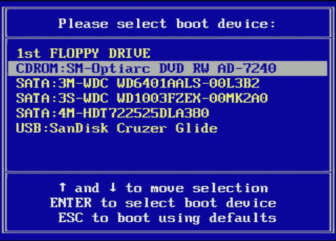
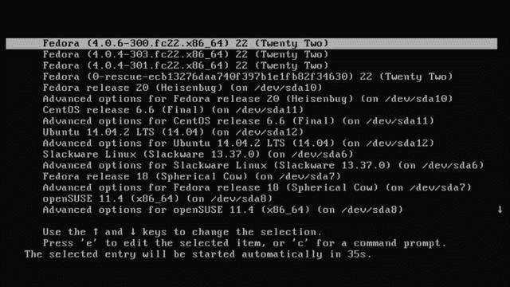
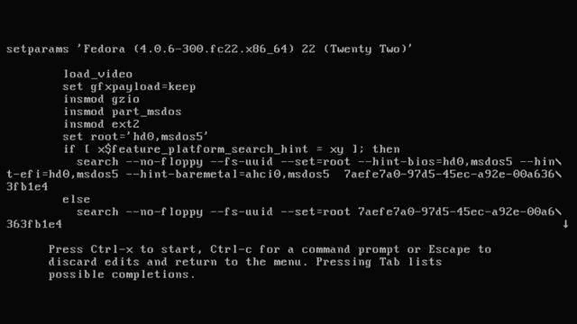
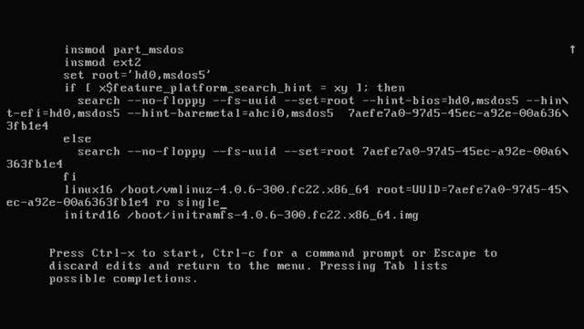

# 引导系统

> 原文：[`developer.ibm.com/zh/tutorials/l-lpic1-101-2/`](https://developer.ibm.com/zh/tutorials/l-lpic1-101-2/)

## 概述

本教程将帮助您理解从 BIOS 到引导结束整个过程的引导顺序，并介绍如何：

*   向引导加载程序提供常见命令
*   在引导时向内核提供选项
*   检查日志文件中的引导事件

本教程将帮助您针对 Linux Professional Institute 的 Linux 服务器专业认证 (LPIC-1) 考试 101 的主题 101 中的目标 101.2 进行应考准备。该目标的权重为 3。

我主要介绍经典的 SysVinit 进程和新的 systemd。 此外，我还将介绍 upstart。

## 引导计算机

在打开或重新启动一台计算机时，计算机必须加载一个操作系统，然后您才能开始做任何有用的工作。这个过程称为 *引导* 计算机。计算机使用一个 *引导加载程序* ，通过引导程序来启动自身。这个过程基本上是自动的，但有时您可能需要进行干预，例如引导安装媒体，引导到修复模式，或者将不同的操作系统引导到常见默认状态。我将介绍如何使用常见的 Linux 引导加载程序引导 Linux，以及您如何与该过程交互，然后检查该过程。

##### 关于本系列

本教程系列将帮助您学习 Linux 系统管理任务。您还可以使用这些教程中的资料对 [Linux Professional Institute 的 LPIC-1：Linux 服务器专业认证考试](http://www.lpi.org) 进行应考准备。

请参阅”[*学习 Linux，101*：LPIC-1 学习路线图](http://www.ibm.com/developerworks/cn/linux/l-lpic1-map/index.html)”，获得本系列中每个教程的描述和链接。这个路线图正在开发中，反映了 2015 年 4 月 15 日更新的 LPIC-1 V4.0 考试目标。在教程完成时，会将它们添加到路线图中。

引导过程的一些方面在大部分系统中是通用的，但另一些与硬件相关的方面是特定于某个特殊架构的。本教程中的资料专门针对使用 BIOS 引导系统的 x86 和 x86_64 架构系统。对于 Intel Itanium 和 IA64 架构，开发了使用可扩展固件接口 (Extensible Firmware Interface, EFI) 和 GUID 分区表 (GUID Partition Table, GPT) 的较新的系统来克服 16 位 x86 BIOS 架构的一些限制，尤其是 Itanium 架构打算使用的大型服务器。Intel 在 2005 年 V1.0 时停止了开发 EFI，将它贡献给了统一可扩展固件接口论坛 (Unified Extensible Firmware Interface Forum)，该论坛现在将它作为统一可扩展固件接口 (Unified Extensible Firmware Interface, UEFI) 进行管理。UEFI 变得越来越流行，尤其是对于拥有超过 2TB 容量的驱动器的系统。运行 Windows® 8 的计算机也需要它。

### 前提条件

要从本系列教程中获得最大收获，您应该掌握 Linux 的基本知识，还应该有一个正常工作的 Linux 系统，您可以在这个系统上实践本教程中涵盖的命令。有时候，程序的不同版本将获得不同的输出格式，所以您的结果可能并不总是与这里显示的清单和图完全相同。具体地讲，BIOS 设置在系统之间有很大的差别，不同发行版之间的引导加载程序开始画面之间也有很大的差别。

您还应该熟悉教程”[*学习 Linux 101* ：硬盘布局](https://www.ibm.com/developerworks/cn/linux/l-lpic1-102-1/index.html) ”中的资料。

除非另行说明，本教程中的示例一般使用 Fedora 22 和一个 4.0.4 内核。其他系统上的结果可能有所不同。

## 引导顺序

在我们深入了解引导加载程序（比如 LILO、GRUB 和 GRUB2）之前，让我们先来回顾一下 PC 在过去是如何启动或 *引导* 的。名为 *BIOS* （表示 *B* asic *I* nput *O* utput *S* ervice，基本输入输出服务）的代码存储在 ROM、EEPROM 或闪存等非易失性存储器（non-volatile memory）中。在启动或重新引导 PC 时，会执行此代码，并执行开机自检 (POST) 来检查机器。 还会确定来自可用的可移动设备或固定存储设备的引导驱动器，并从该驱动器上的主引导记录 (MBR) 加载第一个扇区。该驱动器可以是传统硬盘驱动器、固态硬盘驱动器、USB 记忆棒或驱动器，或者具有可移动媒体的驱动器，比如软盘、CD 或 DVD。在本教程的剩余部分中，我们将重点介绍硬盘驱动器，但其他类型的存储设备的引导过程是类似的。

正如教程”[*学习 Linux 101* ：硬盘布局](https://www.ibm.com/developerworks/cn/linux/l-lpic1-102-1/index.html) ”中介绍的那样，MBR 还包含分区表，所以 MBR 中的可执行代码量少于 512 字节，没有太多的代码。请注意，每个磁盘（甚至是软盘、CD、DVD 或固态设备，比如 USB 记忆棒）在其 MBR 中都包含可执行代码，即使该代码只够放入一条消息，比如 “Non-bootable disk in drive A:（驱动器 A 中没有可引导磁盘：）”。BIOS 从第一个扇区加载的这段代码称为 *第一阶段引导加载程序* 或 *阶段 1 引导加载程序* 。

MS DOS、PC DOS 和 Windows 操作系统所使用的标准硬盘驱动器 MBR 会检查分区表，查找引导驱动器上标为 *active* 的主分区，加载该分区的第一个扇区，并将控制权传递到已加载的代码的开头处。这段新代码也称为 *分区引导记录* 。分区引导记录实际上是另一个阶段 1 引导加载程序，但这个加载程序只能从分区加载一组数据块。这组新数据块中的代码称为 *阶段 2 启动加载程序* 。在由 MS-DOS 和 PC-DOS 使用时，阶段 2 加载程序直接继续加载操作系统的其余部分。这就是操作系统在正常运行之前通过其引导程序启动自身的过程。

这适用于具有单个操作系统的系统。在想要使用多个操作系统时，比如 OS/2、Windows 7 和 3 个不同的 Linux 发行版，会发生什么？您 *可以* 使用某个程序（比如 DOS FDISK 程序）来更改活动分区并重新引导。但这种方法比较笨拙。此外，一个磁盘最多只能有 4 个主分区，标准 MBR 只能有一个活动的主分区；而且它无法从逻辑分区进行引导。但我们的假设示例提到了 5 种操作系统，每个系统都需要一个分区。天啦！

典型的解决方案使用了一些允许用户选择引导哪个操作系统的特殊代码。一些解决方案已经使用了许多年。示例包括：

*   **Loadlin**: 一个 DOS 可执行程序，可从正在运行的 DOS 系统调用该程序来引导一个 Linux 分区。当设置多引导系统是一个复杂的、有风险的过程时，这个程序非常受欢迎。
*   **OS/2 Boot Manager**: 一个安装在小型专用分区中的程序。该分区被标记为 active，标准 MBR 引导过程会启动 OS/2 Boot Manager，它有一个菜单可供您选择要引导哪个操作系统。
*   **智能引导加载程序**: 一个可位于某个操作系统分区中的程序，通过活动分区的分区引导记录或主引导记录进行调用。一些常见的 Linux 引导加载程序是：

*   LILO (LInux LOader)

*   GRUB (GRand Unified Boot loader，现在称为 GRUB Legacy）
*   GRUB2，一个安装在许多常见发行版中的较新的引导加载程序
*   Syslinux，一组轻量型引导加载程序，适用于 MS-DOS FAT 文件系统 (SYSLINUX)、网络引导 (PXELINUX)、可引导的 “El Torito” CD-ROM (ISOLINUX)，以及 Linux ext2/ext3/ext4 或 btrfs 文件系统 (EXTLINUX)

本教程将主要介绍 GRUB2，从历史的角度讨论 GRUB 和 LILO。

很明显，如果可将系统控制权移交给某个拥有超过 512 字节代码的程序来完成其任务，那么从逻辑分区进行引导或从位于引导驱动器之外的分区进行引导应该不是很难。上述所有解决方案都支持这些可能性，这是因为它们都能从任意分区加载引导记录，或者因为它们都对需要加载哪个或哪些文件来启动引导过程有所理解。

### 链式加载

当一个引导管理器获得控制权时，它可以加载另一个引导管理器。这称为 *链式加载* ，通常发生在位于 MBR 中的引导管理器加载了位于分区引导记录中的引导加载程序时。 在 Linux 引导加载程序被要求引导一个 Windows 或 DOS 分区时，几乎总是会执行这种链式加载，但在一个系统的 Linux 引导加载程序被要求加载另一个系统的引导加载程序时，也有可能执行此加载。例如，您可以使用一个分区中的 LILO 链式加载另一个分区中的 GRUB，以便访问该分区的 GRUB 菜单。

### EFI 和 UEFI

简介中已经提到过，EFI 由 Intel 公司开发，用于克服 x86 BIOS 架构的一些限制，最明显的是安腾架构打算使用的大型服务器所专用的 16 位。Intel 在 2005 年 V1.10 时停止了开发 EFI，将它贡献给了统一可扩展固件接口论坛 (Unified Extensible Firmware Interface Forum)，该论坛现在将它作为统一可扩展固件接口 (Unified Extensible Firmware Interface, UEFI) 进行管理。从 2013 年开始，UEFI 论坛还管理了 *高级配置和电源接口 (Advanced Configuration and Power Interface*, *ACPI*)，这是一个针对设备配置和电源管理的规范。

与 16 位 BIOS 不同的是，UEFI 是 32 位或 64 位。可以在 64 位处理器上有一个 32 位 UEFI（例如，许多平板电脑和小型笔记本电脑中使用的一些 Intel Atom 处理器）。引导加载程序需要匹配 UEFI：32 位 UEFI 上的 32 位引导加载程序和 64 位 UEFI 上的 64 位引导加载程序。许多（但不是所有）UEFI 实现都允许引导进入 UEFI 模式或 Legacy BIOS 模式。这些系统允许使用不支持 UEFI 的引导加载程序进行引导。但是，如果系统仅支持 UEFI，则需要一个合适的 UEFI 引导加载程序，比如 GRUB2。

### Linux 引导加载程序

接下来，我们将重点介绍 GRUB2，大多数较新的 Linux 发行版中都包含该引导加载程序。LILO 被用于许多早期的 Linux 发行版。GRUB 比较新。最初的 GRUB 现在已成为 *GRUB Legacy* ，GRUB2 是在自由软件基金会 (Free Software Foundation) 的赞助下开发的较新的版本（参见 参考资料 了解详细信息）。 LILO 的一个新版本名为 *ELILO* （它是为引导使用 EFI 的系统而开发的）。但是，它已不再得到积极开发。请参见 参考资料 ，了解有关 ELILO 的其他信息。

总结一下 PC 的引导过程：

1.  在打开一台 PC 时，基本输入输出服务 (BIOS) 会执行自检。
2.  在机器通过自检后，BIOS 会加载 MBR，通常从引导分区的第一个 512 字节扇区进行加载。引导驱动器通常是系统上的第一个硬盘驱动器，但也可能是一个软盘、CD 或 U 盘。
3.  对于硬盘驱动器，MBR 加载了一个阶段 1 启动加载程序，该程序通常是 Linux 系统上的 LILO 或 GRUB 阶段 1 引导加载程序。这是另一个 512 字节的单扇区记录。
4.  该阶段 1 引导加载程序通常加载一个称为阶段 2 引导加载程序（或者有时称为阶段 1.5 加载程序）的记录序列。
5.  阶段 2 加载程序加载操作系统。对于 Linux，这是内核，也可能是一个初始 RAM 磁盘（initrd 或 initramfs）。

如果需要复习引导加载程序的安装或基本引导过程，请参阅配套教程”[*学习 Linux，101* ：引导管理器](https://www.ibm.com/developerworks/library/l-lpic1-102-2/) ”。

要改变系统的引导过程，可以：

1.  更改您引导的来源设备。如果通常从硬盘驱动器进行引导，可能需要从一个软盘、USB 存储器、CD、DVD 或网络进行引导。设置这些备用引导设备需要适当地配置 BIOS，可能还需要在引导期间按下某个特定的键来显示选项。 演示了我的一个系统上的选项。在启动时设置引导设备和选择引导设备的方法是特定于系统及其 BIOS 的。这不属于这个 LPI 目标的要求范围，所以请查阅您的系统文档。

##### 选择引导设备



1.  与引导加载程序进行交互，选择一些要引导的可能的配置，或者编辑引导配置。您将了解如何在本教程中为 GRUB2 实现此操作。
2.  向内核传递参数，以便控制在引导加载程序加载您的内核后启动系统的方式。

可以在配套教程”[*学习 Linux，101* ：引导管理器](https://www.ibm.com/developerworks/library/l-lpic1-102-2/) ”中找到针对 LILO 和 GRUB 的更多示例。

## GRUB2 引导菜单

在执行 GRUB2 加载时，会显示来自某个配置文件的信息，该文件通常位于 /boot/grub/grub.cfg 或 /boot/grub2/grub.cfg 中。显示了一个 Fedora 22 系统的 grub.cfg 文件的小部分内容。出于版面需要，我对其中一些做断行处理，并在这些行的末尾处添加了一个反斜杠 ()。

##### 用于引导 Fedora 22 的 GRUB2 配置菜单项

```
### BEGIN /etc/grub.d/10_linux ###
menuentry 'Fedora (4.0.6-300.fc22.x86_64) 22 (Twenty Two)' --class fedora \
--class gnu-linux --class gnu --class os --unrestricted $menuentry_id_option \
'gnulinux-4.0.6-300.fc22.x86_64-advanced-7aefe7a0-97d5-45ec-a92e-00a6363fb1e4' {
    load_video
    set gfxpayload=keep
    insmod gzio
    insmod part_msdos
    insmod ext2
    set root='hd0,msdos5'
    if [ x$feature_platform_search_hint = xy ]; then
      search --no-floppy --fs-uuid --set=root --hint-bios=hd0,msdos5 \
        --hint-efi=hd0,msdos5 --hint-baremetal=ahci0,msdos5  \
        7aefe7a0-97d5-45ec-a92e-00a6363fb1e4
    else
      search --no-floppy --fs-uuid --set=root 7aefe7a0-97d5-45ec-a92e-00a6363fb1e4
    fi
    linux16 /boot/vmlinuz-4.0.6-300.fc22.x86_64 \
        root=UUID=7aefe7a0-97d5-45ec-a92e-00a6363fb1e4 ro rhgb quiet
    initrd16 /boot/initramfs-4.0.6-300.fc22.x86_64.img
} 
```

在 GRUB2 读取该配置文件时，通常会显示一个菜单，比如 中显示的菜单。 通常，超时时间比较短，超过该时间就会引导默认选项。默认选项已突出显示，而且可以看到一个在倒计时的计时器。在这里，您可以看到，来自前面的清单的菜单项是默认选项。如果不执行任何操作，则会在 35 秒内执行引导。

##### 在 GRUB2 中选择一个引导选项



在显示菜单后，可以按下 Enter 立刻引导所选的菜单项，或者可以按下另一个键来停止计时。然后，可以突出显示和引导另一个选项，输入 `e` 来编辑选定的选项，或者输入 `c` 来输入一个 GRUB2 命令提示。 **备注：** 如果超时设置为 0，GRUB2 会立刻引导您的系统。在这种情况下，需要从另一个设备引导修复媒体。请参阅配套教程”[*学习 Linux，101* ：引导管理器](https://www.ibm.com/developerworks/library/l-lpic1-102-2/) ”获得详细信息。该教程还介绍了 GRUB2 命令行的使用，所以本教程中不再赘述。

现在让我们来看看内核参数和 init 进程，然后我将介绍如何编辑 GRUB2 条目来传递参数。

## 内核参数

内核参数（有时称为引导参数）用于为内核提供它可能无法自行决定的硬件参数的信息，覆盖它可能检测的值，或者避免检测不合适的值。一些较低的内核级别需要一个参数，然后才能在具有超过一定容量的 RAM 的系统上启用大内存支持。您可能希望引导系统进入单用户模式来修复系统，引导 SMP 系统进入单处理器模式，或者指定一个备用引导文件系统。或者您可能需要指定一个以前正常工作的内核，以确定为什么新构建的自定义内核无法引导。可以使用引导参数完成所有这些任务。

引导参数在内核命令行上提供。大部分参数具有以下格式：

```
name[=value_1][,value_2]...[,value_10] 
```

其中 ‘name’ 是一个唯一关键字，标识了内核的哪个部分应该接收关联的值。这些参数按以下顺序进行检查：

1.  内核检查用于查看参数是否是以下特殊参数中的任何一个：’root=’、’nfsroot=’、’nfsaddrs=’、’ro’、’rw’、’debug’ 或 ‘init’。
2.  它运行一个设置函数列表，查看指定的参数字符串是否与某个设置函数有关联。
3.  没有作为设置函数被接受的任何 ‘foo=bar’ 格式的参数就会被解释为一个要设置的环境变量。
4.  没有被内核选中或解释为环境变量的其余所有参数随后会传递到进程 1，该进程通常是 init 程序。

可以使用 `info bootparam` 或 `man bootparam` ，从手册页找到有关引导参数的更多信息。 kernel-parameters.txt 文件中还提供了最新信息，该文件应该包含在 kernel-doc 包中。 **备注：** 在撰写本文时，Fedora 22 似乎没有 kernel-doc 包或 kernel-parameters 文件。

假设您想要修改内核参数或添加新参数，或者从菜单项更改 grub.cnf 文件中的值。在看到 GRUB2 菜单时，可以选择想要编辑的条目并按下 e 来编辑它。然后，您会看到一个类似 的屏幕，可在其中看到 的前几行的信息。

##### 编辑 Fedora 22 GRUB2 菜单项



传递给 init 进程的最常用参数是单词 ‘single’，它告诉该进程引导计算机进入单用户模式，不启动所有常见的守护进程。通常使用此参数来执行某种恢复操作。如果将光标向下移动，屏幕将会滚动，您会看到一个以 ‘linux16’ 开头并以 ‘ro rhgb quiet’ 结尾的行。对于我们的示例，我们将光标放在这行的末尾处，然后使用 backspace 键擦除单词 ‘quiet’，随后擦除 ‘rhgb’。 这会停止 fedora 在引导期间通常会显示的 Red Hat Graphical Boot 屏幕，还会停止显示通常生成的许多消息。最后，我们向该行添加单词 ‘single’，以便引导进入单用户模式。显示如所示。

##### 设置 Fedora 22 来引导进入单用户模式



现在按下 Ctrl-x 引导系统进入单用户模式。 滚动几条消息后，您的屏幕上有一些类似行。

##### 单用户模式下的 Fedora 22

```
Welcome to emergency mode!After logging in, type "journalctl -xb" to view
system logs, "systemctl reboot" to reboot, "systemctl default" or ^D to
boot into default mode.
Give root password for maintenance
(Or press ^D to continue): 
```

您现在可以提供根用户密码，执行恢复系统所需的任何操作。然后可以重新引导，或者继续进入正常运行模式。

不同系统的单用户模式会有所不同。一些系统会直接将您带到根用户提示符，无需输入密码。 其他系统需要输入密码，比如我们的示例。依据您的系统使用的是经典的 System V init 进程还是较新的 upstart 或 systemd，继续执行的操作也会有所不同。

现在让我们更多地了解不同的 init 进程。

## init 进程

在内核完成加载时，通常会启动 `/sbin/init` 。在关闭系统之前，此程序会一直运行。它总是被分配进程 ID 1。在使用传统 System V init 进程的系统或使用较新的 Upstart 初始化进程的系统上，该进程被命名为 init。但是，在使用 Systemd 初始化进程的系统上，/sbin/init 是 /lib/systemd/systemd 中的 systemd init 进程的链接。我们将在中演示 Fedora 22 的这个进程。

##### init 进程

```
[ian@atticf22 ~]$ ls -l /sbin/init
lrwxrwxrwx.1 root root 22 Jun  9 09:16 /sbin/init -> ../lib/systemd/systemd
[ian@atticf22 ~]$ ps --pid 1
  PID TTY          TIME CMD
    1 ?        00:00:02 systemd 
```

在正常操作中，传统的 System V init 进程在 4 个可能的多用户 *运行级别* （2 到 5）中的一个级别上运行。不同的系统会以不同方式使用运行级别，但最高的运行级别通常用于 X Windows 系统的图形操作。文件 /etc/inittab 控制着在每个运行级别上启动哪些进程。使用 upstart 的系统有一个 *作业* 概念，而拥有 systemd 的系统使用 *单元* 来定义启动哪些进程，每个系统将合适的作业或单元映射到传统的 System V 运行级别。这使得 `telinit` 等许多命令在新的启动过程中变得有意义。许多 systemd 单元都存储在 /usr/lib/systemd/system/ 中。显示了从运行级别等效的（runlevel-equivalent）目标到相应的 systemd 目标的映射关系。

##### Systemd 运行级别目标单元

```
[ian@atticf22 l-lpic1-101-2]$ cd /usr/lib/systemd/system/
[ian@atticf22 system]$ ls -l runlevel*.target
lrwxrwxrwx.1 root root 15 Jun  9 09:16 runlevel0.target -> poweroff.target
lrwxrwxrwx.1 root root 13 Jun  9 09:16 runlevel1.target -> rescue.target
lrwxrwxrwx.1 root root 17 Jun  9 09:16 runlevel2.target -> multi-user.target
lrwxrwxrwx.1 root root 17 Jun  9 09:16 runlevel3.target -> multi-user.target
lrwxrwxrwx.1 root root 17 Jun  9 09:16 runlevel4.target -> multi-user.target
lrwxrwxrwx.1 root root 16 Jun  9 09:16 runlevel5.target -> graphical.target
lrwxrwxrwx.1 root root 13 Jun  9 09:16 runlevel6.target -> reboot.target 
```

在传统上，单用户模式等效于运行级别 1。当然，您可以键入 ‘1’ 代替 ‘single’，引导系统进入单用户模式（运行级别 1）。类似地，’3’ 会引导系统进入带网络功能的完全多用户模式，但没有 X Windows 系统，而 ‘5’ 会引导系统进入全图形化桌面。从上面的符号链接可以看到，systemd 现在使用 rescue.target 单元引导系统进入单用户模式。所以指定：

*   single
*   1
*   s
*   systemd.unit=runlevel1.target
*   systemd.unit=rescue.target

都是进入单用户模式的等效方式。您可以在手册页中找到 systemd 单元和目标的更多信息。尝试 `info systemd` 或 `man systemd` 。

无论使用哪个初始化程序，该初始化程序都会运行一系列脚本来引导系统的剩余部分。对于 System V init，这些脚本通常位于 /etc/rc.d/init.d 或 /etc/init.d 中。它们执行一些服务，比如设置系统的主机名，检查文件系统中的错误，挂载其他文件系统，启用网络，启动打印服务，等等。在完成脚本后， `init` 会启动一个名为 `getty` 的程序，该程序在控制台上显示登录提示。图形化的登录屏幕可以使用一个图形显示管理器（比如用于 Gnome 的 GDM）进行处理。

请参阅配套教程”[*学习 Linux，101* ：运行级别、引导目标、关机和重新引导](http://www.ibm.com/developerworks/linux/library/l-lpic1-v3-101-3/index.html) ”，了解关于不同启动过程的更多信息。

如果系统加载了一个内核，但无法成功运行 `init` ，可以尝试指定一个备用初始化程序来进行恢复。例如，通过指定 `init=/bin/sh` ，引导系统进入具有根用户权限的 shell 提示符，您可以从这里修复系统。

不用说，如果必须在每次引导时应用同一组额外参数，那么应该将它们添加到配置文件中。

## 初始 RAM 磁盘

您可能已经注意到我们的 GRUB2 示例配置中的最后两行，如所示。linux16 行指定了要加载哪个内核，initrd16 行指定了添加 *Initial RAM Disk* 。您已经了解了如何修改内核参数，那么什么是初始 RAM 磁盘？

##### {: #}

```
linux16 /boot/vmlinuz-4.0.6-300.fc22.x86_64 \
root=UUID=7aefe7a0-97d5-45ec-a92e-00a6363fb1e4 ro rhgb quiet
initrd16 /boot/initramfs-4.0.6-300.fc22.x86_64.img 
```

回想 UNIX 刚出现的时候，那时候设备很少，内核也很小。大部分设备都始终物理地附加到计算机上，构建某个内核通常是为了支持已安装的硬件。随着时间的推移，以及设备数量和类型的激增，设备支持通常转移到可加载的内核模块中。内核模块就像一个包含明确定义的入口点的函数库，允许内核使用未将相关支持编译到内核中的设备。 这允许使用一个要加载的内核，然后仅加载针对实际安装在系统中的设备的支持。但是，如果没有完全的磁盘和文件系统支持，您如何从磁盘中找到并加载这些模块？

答案是初始 RAM 磁盘、 *initrd* 或 *initramfs* ，后者是一个包含可加载的内核模块的文件。它通常是压缩文件，由引导加载程序将其载入 RAM 中。内核会获得访问它的权限，就像它是一个挂载的文件系统一样。如果使用 `file` 命令检查 initrd 文件，就会发现它使用的压缩方法。然后，如果您解压它的副本，通常可在其中找到一个 `cpio` 存档文件。在一些系统上（比如自 Fedora 12 开始的 Fedora），initrd 文件是使用一个名为 `dracut` 的实用程序创建的。在本例中，它显示为一个 cpio 存档文件，但是，如果解压它，可能不会找到太多的东西：比 initrd 文件大小暗示的大小要小得多。可以使用 `lsinitrd` 命令列出 initrd 文件的内容。

## 引导事件

在 Linux 引导过程中，会向控制台发出大量消息，描述引导的内核、您系统的硬件，以及与内核相关的其他信息。这些消息通常很快就会擦除，您可能无法读取它们，除非在引导过程中因为等待某个结果而发生延迟，比如无法连接一个时间服务器或一个必须检查的文件系统。 随着 Linux Bootsplash 项目的出现（参见 参考资料 ），这些消息可能被添加到一个图形后台上，或者可能隐藏它们并将它们替换为一个简单的状态栏。如果您的发行版支持隐藏模式，那么通常可以按下一个键（比如 K2）切换回到显示引导消息。

### dmesg

能够退回来并检查内核消息，这个功能很不错。因为标准输出与某个进程有关，而且内核没有进程标识符，所以内核（和模块）输出消息保存在 *内核环缓冲区* 中。可以使用 `dmesg` 命令显示内核环缓冲区，该命令会在标准输出上显示这些消息。当然，可以将此输出重定向到某个文件供以后分析，或者将它转发给内核开发人员进行调试。展示了您可以查看的一些输出。同样地，出于版面需要，我对其中一些做了断行处理，并在这些行的末尾处添加了一个反斜杠 () 来表明。

##### 部分 dmesg 输出

```
[root@atticf22 ~]#  dmesg | head -n 30
[    0.000000] Initializing cgroup subsys cpuset
[    0.000000] Initializing cgroup subsys cpu
[    0.000000] Initializing cgroup subsys cpuacct
[    0.000000] Linux version 4.0.6-300.fc22.x86_64 (mockbuild@bkernel02.phx2.fedoraproject.org) \
(gcc version 5.1.1 20150618 (Red Hat 5.1.1-4) (GCC) ) #1 SMP Tue Jun 23 13:58:53 UTC 2015
[    0.000000] Command line:BOOT_IMAGE=/boot/vmlinuz-4.0.6-300.fc22.x86_64 \
root=UUID=7aefe7a0-97d5-45ec-a92e-00a6363fb1e4 ro single
[    0.000000] tseg:0000000000
[    0.000000] e820:BIOS-provided physical RAM map:
[    0.000000] BIOS-e820:[mem 0x0000000000000000-0x000000000009ebff] usable
[    0.000000] BIOS-e820:[mem 0x000000000009ec00-0x000000000009ffff] reserved
[    0.000000] BIOS-e820:[mem 0x00000000000e4000-0x00000000000fffff] reserved
[    0.000000] BIOS-e820:[mem 0x0000000000100000-0x00000000cff7ffff] usable
[    0.000000] BIOS-e820:[mem 0x00000000cff80000-0x00000000cff8dfff] ACPI data
[    0.000000] BIOS-e820:[mem 0x00000000cff8e000-0x00000000cffcffff] ACPI NVS
[    0.000000] BIOS-e820:[mem 0x00000000cffd0000-0x00000000cfffffff] reserved
[    0.000000] BIOS-e820:[mem 0x00000000ff700000-0x00000000ffffffff] reserved
[    0.000000] BIOS-e820:[mem 0x0000000100000000-0x000000012fffffff] usable
[    0.000000] NX (Execute Disable) protection: active
[    0.000000] SMBIOS 2.5 present.
[    0.000000] DMI:System manufacturer System Product Name/M3A78-EM, BIOS 2003    10/12/2009
[    0.000000] e820: update [mem 0x00000000-0x00000fff] usable ==> reserved
[    0.000000] e820: remove [mem 0x000a0000-0x000fffff] usable
[    0.000000] e820: last_pfn = 0x130000 max_arch_pfn = 0x400000000
[    0.000000] MTRR default type: uncachable
[    0.000000] MTRR fixed ranges enabled:
[    0.000000]   00000-9FFFF write-back
[    0.000000]   A0000-EFFFF uncachable
[    0.000000]   F0000-FFFFF write-protect
[    0.000000] MTRR variable ranges enabled:
[    0.000000]   0 base 000000000000 mask FFFF80000000 write-back
[    0.000000]   1 base 000080000000 mask FFFFC0000000 write-back 
```

内核环缓冲区也可以在引导系统后用于保存一些事件。这些事件包括某些程序故障和热插拔事件。显示了一些与插入一个 USB 存储器相关的条目。请注意表明该卷没有正确卸载的警告。

##### 内核环缓冲区中的后续事件

```
[root@atticf22 ~]# dmesg | tail -n 21
[68209.847331] usb 4-2.4: new full-speed USB device number 5 using ohci-pci
[68209.928078] usb 4-2.4: device descriptor read/64, error -62
[68225.055771] usb 4-2.4: device descriptor read/64, error -110
[68225.231218] usb 4-2.4: new full-speed USB device number 6 using ohci-pci
[68225.340868] usb 4-2.4:New USB device found, idVendor=19ae, idProduct=2403
[68225.340875] usb 4-2.4:New USB device strings:Mfr=1, Product=2, SerialNumber=3
[68225.340877] usb 4-2.4:Product:MSC
[68225.340879] usb 4-2.4:Manufacturer:ATMEL ASF
[68225.340881] usb 4-2.4:SerialNumber:123123123123
[68225.343447] usb-storage 4-2.4:1.0:USB Mass Storage device detected
[68225.352501] scsi host15: usb-storage 4-2.4:1.0
[68226.357737] scsi 15:0:0:0:Direct-Access     ATMEL    SD/MMC Card Slot 1.00 PQ:0 ANSI:3
[68226.358727] sd 15:0:0:0:Attached scsi generic sg7 type 0
[68226.367683] sd 15:0:0:0:[sdf] 7774208 512-byte logical blocks:(3.98 GB/3.70 GiB)
[68226.377646] sd 15:0:0:0:[sdf] Write Protect is off
[68226.377653] sd 15:0:0:0:[sdf] Mode Sense:0f 00 00 00
[68226.387610] sd 15:0:0:0:[sdf] No Caching mode page found
[68226.387618] sd 15:0:0:0:[sdf] Assuming drive cache: write through
[68226.442450]  sdf:
[68226.484318] sd 15:0:0:0:[sdf] Attached SCSI removable disk
[68227.882986] FAT-fs (sdf):Volume was not properly unmounted.Some data may be corrupt.\
Please run fsck. 
```

## 记录系统消息

如您所见，在系统启动到运行 `/sbin/init` 的时间点后，内核仍会将事件记录到环缓冲区中。但是，这些进程使用了一个守护进程来记录消息。在传统的 System V init 系统中，这个守护进程是 syslogd 守护进程，该进程通常会记录到 /var/log/messages。基于 Systemd 的系统使用 systemd-journald 守护进程来记录消息，可以使用 `journalctl` 命令来确认这一点。

### /var/log/messages

与环缓冲区不同，每个 syslog 行都有一个时间戳，而且文件在系统重启之间持久化。如果引导进程中的 init 脚本阶段出现错误，那么应该首先检查这个文件。

大部分守护进程的名称都以 ‘d’ 结尾。展示了如何在重新启动后查看最后几条守护进程状态消息。还显示了最后 10 条任意类型的消息。 该示例来自一个 CentOS 6 系统。

##### 来自 /var/log/messages 的守护进程消息

```
[root@attic4-cent ~]# grep "Jul 22.........[^:]*d\:"/var/log/messages
Jul 22 21:45:23 attic4-cent rsyslogd:[origin software="rsyslogd" swVersion="5.8.10" \
x-pid="2051" x-info="http://www.rsyslog.com"] start
Jul 22 21:45:23 attic4-cent cpuspeed:Enabling ondemand cpu frequency scaling governor
Jul 22 21:45:26 attic4-cent acpid: starting up
Jul 22 21:45:26 attic4-cent acpid:1 rule loaded
Jul 22 21:45:26 attic4-cent acpid: waiting for events: event logging is off
Jul 22 21:45:27 attic4-cent acpid: client connected from 2423[68:68]
Jul 22 21:45:27 attic4-cent acpid:1 client rule loaded
Jul 22 21:45:32 attic4-cent abrtd:Init complete, entering main loop
Jul 22 21:45:33 attic4-cent libvirtd:Could not find keytab file:/etc/libvirt/krb5.tab:\
No such file or directory
[root@attic4-cent ~]# tail /var/log/messages
Jul 22 21:46:00 attic4-cent kernel:XFS (sda6):Mounting Filesystem
Jul 22 21:46:00 attic4-cent kernel:XFS (sda6):Ending clean mount
Jul 22 21:46:00 attic4-cent kernel:TECH PREVIEW: btrfs may not be fully supported.
Jul 22 21:46:00 attic4-cent kernel:Please review provided documentation for limitations.
Jul 22 21:46:00 attic4-cent kernel:Btrfs loaded
Jul 22 21:46:00 attic4-cent kernel: device fsid d9cb309d-e15d-4b00-9b2f-e3cc08db412c \
devid 1 transid 52 /dev/sda9
Jul 22 21:46:00 attic4-cent kernel: btrfs: disk space caching is enabled
Jul 22 21:46:00 attic4-cent kernel:BTRFS: couldn't mount because of unsupported \
optional features (140).
Jul 22 21:46:00 attic4-cent kernel: btrfs: open_ctree failed
Jul 22 21:46:47 attic4-cent pulseaudio[3252]: ratelimit.c:9 events suppressed 
```

关机事件也会被记录，所以，如果系统没有干净利落地关闭，可以在自上次关机后留下的日志信息中查找原因。

可以在 /var/log 中找到其他许多系统程序的日志。例如，可以查看 X Window 系统的启动日志。

### journalctl

除了新的 systemd 进程提供的大量功能之外， `systemd-journald` 守护进程还管理着一个新的日志功能。如果系统使用此守护进程，它会管理您的日志，您还可以使用 `journalctl` 命令来查看这些消息。显示了 `journalctl -xb` 命令的输出的第一页，该命令显示了来自当前引导的日志条目。

##### 使用 `journalctl -xb` 显示当前引导的日志条目

```
-- Logs begin at Tue 2015-06-02 12:38:08 EDT, end at Wed 2015-07-22 22:04:23 EDT
Jul 22 22:02:25 atticf20 systemd-journal[106]:Runtime journal is using 8.0M (ma
Jul 22 22:02:25 atticf20 systemd-journal[106]:Runtime journal is using 8.0M (ma
Jul 22 22:02:25 atticf20 kernel:Initializing cgroup subsys cpuset
Jul 22 22:02:25 atticf20 kernel:Initializing cgroup subsys cpu
Jul 22 22:02:25 atticf20 kernel:Initializing cgroup subsys cpuacct
Jul 22 22:02:25 atticf20 kernel:Linux version 4.0.6-300.fc22.x86_64 (mockbuild@
Jul 22 22:02:25 atticf20 kernel:Command line:BOOT_IMAGE=/boot/vmlinuz-4.0.6-30
Jul 22 22:02:25 atticf20 kernel: tseg:0000000000
Jul 22 22:02:25 atticf20 kernel: e820:BIOS-provided physical RAM map:
Jul 22 22:02:25 atticf20 kernel:BIOS-e820:[mem 0x0000000000000000-0x0000000000
Jul 22 22:02:25 atticf20 kernel:BIOS-e820:[mem 0x000000000009ec00-0x0000000000
Jul 22 22:02:25 atticf20 kernel:BIOS-e820:[mem 0x00000000000e4000-0x0000000000
Jul 22 22:02:25 atticf20 kernel:BIOS-e820:[mem 0x0000000000100000-0x00000000cf
Jul 22 22:02:25 atticf20 kernel:BIOS-e820:[mem 0x00000000cff80000-0x00000000cf
Jul 22 22:02:25 atticf20 kernel:BIOS-e820:[mem 0x00000000cff8e000-0x00000000cf
Jul 22 22:02:25 atticf20 kernel:BIOS-e820:[mem 0x00000000cffd0000-0x00000000cf
Jul 22 22:02:25 atticf20 kernel:BIOS-e820:[mem 0x00000000ff700000-0x00000000ff
Jul 22 22:02:25 atticf20 kernel:BIOS-e820:[mem 0x0000000100000000-0x000000012f
Jul 22 22:02:25 atticf20 kernel:NX (Execute Disable) protection: active
Jul 22 22:02:25 atticf20 kernel:SMBIOS 2.5 present.
Jul 22 22:02:25 atticf20 kernel:DMI:System manufacturer System Product Name/M3
Jul 22 22:02:25 atticf20 kernel: e820: update [mem 0x00000000-0x00000fff] usable
lines 1-23 
```

和平常一样，请查阅 systemd-journald 和 journalctl 的手册页了解更多的信息。

我们对通过引导过程来引导 Linux 系统的介绍到此就结束了。

本文翻译自：[Learn Linux, 101: Boot the system](https://developer.ibm.com/tutorials/l-lpic1-101-2/)（2015-08-25）