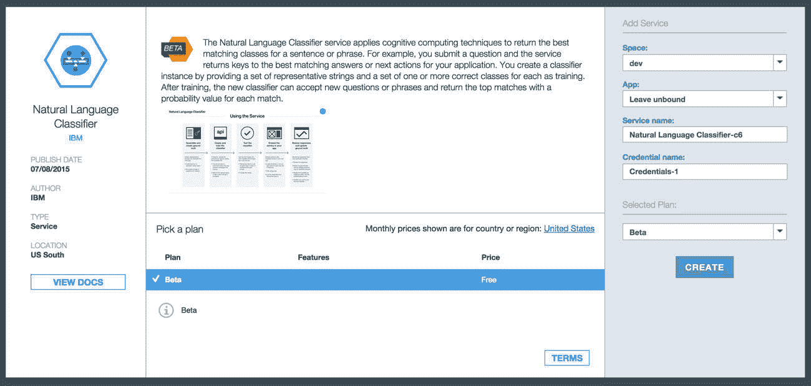

# 创建一个识别垃圾邮件的自然语言分类器

> 原文：[`developer.ibm.com/zh/tutorials/cc-spam-classification-service-watson-nlc-bluemix-trs/`](https://developer.ibm.com/zh/tutorials/cc-spam-classification-service-watson-nlc-bluemix-trs/)

在认知计算和智能机器出现后，机器学习以及相关的算法和技术开始变得非常重要。我们可以使用机器学习帮助理解丰富的不断演变的数据，并从中提取有用的洞察。机器学习可用于识别和确定复杂的模式，生成预测，不断学习，最终帮助我们制定更有效、更精明的决策。

IBM 现在在 IBM Cloud 上提供了大量认知服务。在本文中，我将介绍 Watson Natural Language Classifier 服务。Watson Natural Language Classifier 是一个机器学习分类器，它将复杂的卷积神经网络（convolutional neural network）与复杂的语言模型相结合来学习和理解语言。尽管它自身具有复杂性，但 Watson Natural Language Classifier 非常容易使用。

在本文中，我们将创建 Watson Natural Language Classifier 的一个新实例来创建一个垃圾邮件分类器应用程序，培训它来区分垃圾邮件与非垃圾邮件，并测试它的准确性。

## 需要做的准备工作

要构建您自己的使用 Watson Natural Language Classifier 和 IBM Cloud 的垃圾邮件分类器，您需要以下帐户或资源：

*   一个 [IBM Cloud](https://cloud.ibm.com/registration?cm_sp=ibmdev-_-developer-tutorials-_-cloudreg) 帐户
*   一个 IBM DevOps Services 帐户。
*   [curl](http://curl.haxx.se/) — 一个使用 URL 语法传输数据的命令行工具。
*   一个 [Python](https://www.python.org/downloads/) 解释器。

NoneNone

## 培训 Watson Natural Language Classifier 服务

要使用 Watson Natural Language Classifier 服务来分类垃圾邮件，需要先培训它。为了培训它，Watson Natural Language Classifier 集来培训一个能够生成合理的预测结论的模型。这种算法类型被称为*监督式学习算法*。

带标签的观察数据只是一个特征矢量（feature vector）和该矢量的标签。在 Watson Natural Language Classifier 中，每个观察数据包含一些文本（而不是特征矢量）和一个分类标签，如 Watson Natural Language Classifier 中带标签的观察数据所示：

##### Watson Natural Language Classifier 中带标签的观察数据

```
Label       Text
spam        Join xyz.com NOW!!!! And WIN $1,000,000!!!!!!
ham          Hi Mom. I hope dinner went well with Auntie Jane. Love you. 
```

现在让我们开始吧。

## 第 1 步. 创建一个 Watson Natural Language Classifier 服务

我们要做的第一步是创建 Watson Natural Language Classifier 服务的一个实例，它将成为我们的 Watson Natural Language Classifier 服务。

1.  [登录您的 IBM Cloud 帐户](https://cloud.ibm.com/login?cm_sp=ibmdev-_-developer-tutorials-_-cloudreg)（或[注册一个免费试用帐户](https://cloud.ibm.com/registration?cm_sp=ibmdev-_-developer-tutorials-_-cloudreg)）。
2.  导航到 IBM Cloud 目录，使用 Watson 缩小搜索范围，然后选择 Watson Natural Language Classifier：

    

3.  在右侧的 Add Service 下，确保为 **App** 指定了 **Leave unbound**，为您的服务指定了一个名称（例如 `spam_classifier` ），然后单击 **CREATE**。

    

4.  导航回 IBM Cloud 仪表板，向下滚动到您的服务，然后单击新服务实例：

    

5.  选择 **Service Credentials** 来查看 Watson Natural Language Classifier 服务 URL 和凭据：

    

    记下这些凭据；本教程后面将使用它们。

## 第 2 步. 设置您的开发环境

接下来，您需要从 `WatsonNLCSpam` 项目存储库收集一些文件：

1.  克隆 [Git 存储库](https://github.com/cdimascio/watson-nlc-spam)。

    1.  在终端中，输入以下命令：

        `git clone https://github.com/cdimascio/watson-nlc-spam`

    2.  提示时，输入您的 IBM ID 和密码。
2.  检查存储库内容：

    *   `README.md` 描述项目
    *   `data` 包含垃圾邮件分类器的培训数据集 (`SpamHam-Train.csv`) 和测试数据集 (`SpamHam-Test.json`)。
    *   `spam.py` 是用于执行基本的准确性测试的脚本。
    *   `web` 包含示例 Web 应用程序的源代码。

### 关于培训数据

垃圾邮件分类器的培训数据包含在文件 `SpamHam-Train.csv` 中。它包含原始数据集的 90%。另外 10% 留给测试数据集。 `SpamHam-Train.csv` 的内容被格式化为 CSV，存储在一个兼容 Watson Natural Language Classifier 的结构中。每行包含 `text,label` 。

检查以下从 `SpamHam-Train.csv` 获取的示例数据：

```
"=Bring home some Wendy =D",ham
"100 dating service cal;l 09064012103 box334sk38ch",spam
"Whatsup there. Dont u want to sleep",ham
"""Are you comingdown later?""",ham
"Alright i have a new goal now",ham 
```

此分类器非常简单。有两个特征使它变得简单：

1.  它是一种二元分类器，因为它有两个类： `spam` 和 `ham`。
2.  每个观察数据都与一个类相关联： `"Alright i have a new goal now", **ham**`

Watson Natural Language Classifier 支持多类分类和观察数据，但本教程中没有利用该功能。

### 关于培训元数据

*培训元数据*是描述培训数据的数据。培训元数据指定目标语言（在本例中为英语 `en`）和分类器的名称（在本例中为 `Spam Ham`）。培训元数据必须具有 JSON 格式。这是一个示例：

```
{
  "language":"en",
  "name":"Spam Ham" 
```

### 关于测试数据

培训分类器后，一定要测试它的准确性。`SpamHam-Test.json` 是包含测试数据的文件。像培训数据一样，测试数据是一组带标签的观察数据，例如 `"I love you, mom!",ham`。测试观察数据未包含在培训数据集中，因此可用于评估我们的分类器的准确性。

重新使用培训观察数据来测试分类器的准确性被认为是一种不好的做法。因为培训观察数据会在培训期间“看到”，所以在测试期间重用它们可能导致过于乐观的准确性结果。

Watson Natural Language Classifier 是一个完美的例子。如果所有测试观察数据都已在培训期间看到，那么 Watson Natural Language Classifier 的准确性等于 100%。但是，我们最终感兴趣的是分类器对于未看到的观察数据的准确性。此测试会让我们更好地理解分类器将如何推广到新观察数据。

提供的测试数据 `SpamHam-Test.json` 的结构与提供的培训数据 `SpamHam-Train.csv` 不同。测试数据中的每行都是一个 JSON 对象，表示单个带标签的观察数据。测试数据可以是简单的 CSV 格式。在教程的后面，我将演示如何在 `spam.py` 中使用 JSON 格式的测试数据来计算垃圾邮件分类器的准确性。

## 第 3 步. 创建和培训垃圾邮件分类器

在第 1 步中，我们克隆了 Watson Natural Language Classifier 的一个实例来创建我们的 Watson Natural Language Classifier 服务。现在，我们将使用该服务创建一个垃圾邮件分类器。

创建分类器很容易，只需使用以下 `curl` 命令向 `/v1/classifiers` 端点执行 `POST`：

`curl -X POST -u username:password -F training_data=@SpamHam-Train.csv -F training_metadata="{\"language\":\"en\",\"name\":\"My Classifier\"}" "https://api.us-south.natural-language-classifier.watson.cloud.ibm.com"`

这个 `curl` 命令需要一个 `<username>`、`<password>` 和 `<url>` 变量。这些变量需要替换为第 1 步中介绍的合适的服务凭据值。

在调用此命令后，请记下它的 `classifier_id`。我们稍后会使用它。培训分类器可能会花费 30 分钟的时间，所以现在正好休息一下。

## 第 4 步. 检查培训进度

要确定分类器是否已准备好使用，可以使用以下 `GET` 请求调用 Watson Natural Language Classifier 端点：

`curl -u <username>:<password> <url>/v1/classifiers/<classifier-id>`

该分类器表明它已做好准备可供使用时，请前进到下一步。

## 第 5 步. 试验垃圾邮件分类器

现在我们已经培训好了垃圾邮件分类器服务，可以试用它了。作为一次快速练习，对 `/classify` 端点发出以下 `POST` 请求：

`curl -X POST -u <username>:<password> -H "Content-Type:application/json" -d "{\"text\":\"I love you mom\"}" <uri>/v1/classifiers/<classifier_id>/classify`

也可发出一个 `GET` 请求：

`curl -G -u <user>:<password> <uri>/v1/classifiers/6C76AF-nlc-43/classify" --data-urlencode "text=what is your phone number?"`

`classifier_id` ID 是我们之前执行的 `/v1/classifiers` 调用返回的。如果忘记了该 ID，可以使用这个 curl 命令选项调用以下端点来获取它。这个端点将返回一个包含您的所有分类器的列表：

`curl -u <username>:<password> <uri>/v1/classifiers"`

## 第 6 步. 测试分类器的准确性

最后，为了测试我们的分类器和计算它的准确性，我们将使用所提供的 Python 脚本 `spam.py`。该脚本调用上一步中介绍的相同的 `POST` 请求，然后计算与该标签正确匹配的已分类预测结果数量。准确性的计算方法是将正确的预测结果数量除以测试观察数据的总数。

我们运行该脚本看看。

*   打开 `spam.py` 并更新 `YOUR_CLASSIFIER_ID`、`YOUR_CLASSIFIER_USERNAME` 和 `YOUR_CLASSIFIER_PASSWORD`，以便引用您的 Watson Natural Language Classifier 服务凭据（可在第 1 步中找到）。
*   在项目目录中，运行以下命令：

    `python spam.py`

脚本运行完成后，您会看到以下输出：

`accuracy:0.993079584775`

## 结束语

Watson Natural Language Classifier 给 IBM Cloud 提供了一个复杂的机器学习分类器。该分类器很容易使用，而且有直观的 REST 接口，使所有背景的开发人员都能非常很轻松地快速培训、测试和应用新的分类器来解决实际问题。

在本文中，您学习了如何使用 Watson Natural Language Classifier 构建、培训和测试垃圾邮件分类器。我们期待看到您使用它！

本文翻译自：[Create a natural language classifier that identifies spam](https://developer.ibm.com/tutorials/cc-spam-classification-service-watson-nlc-bluemix-trs/)（2018-04-16）