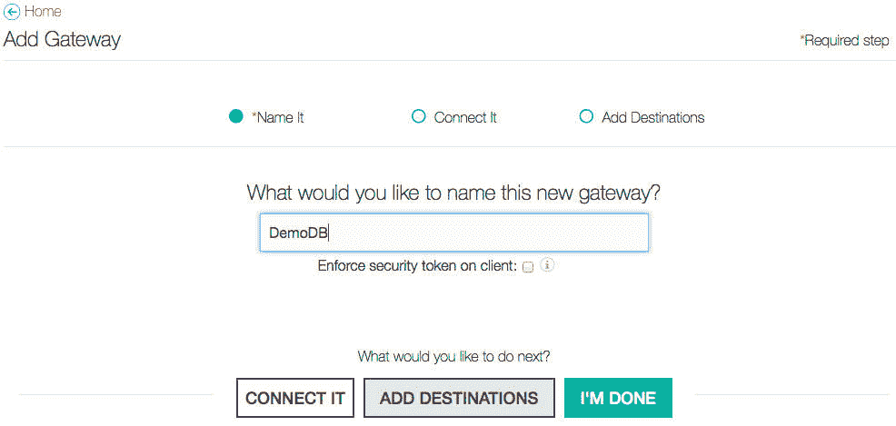
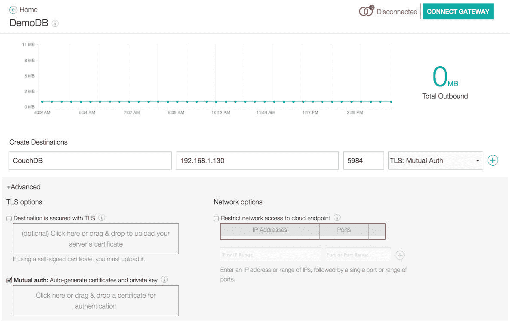
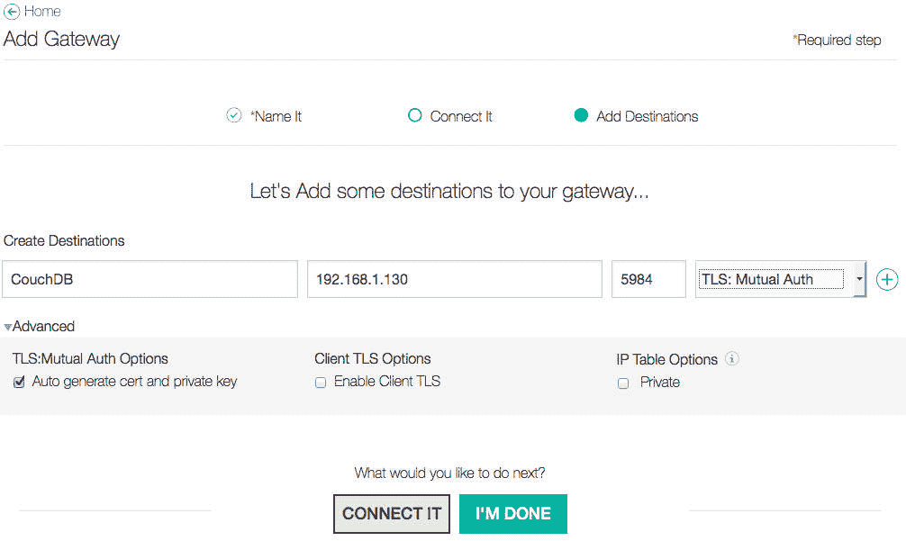
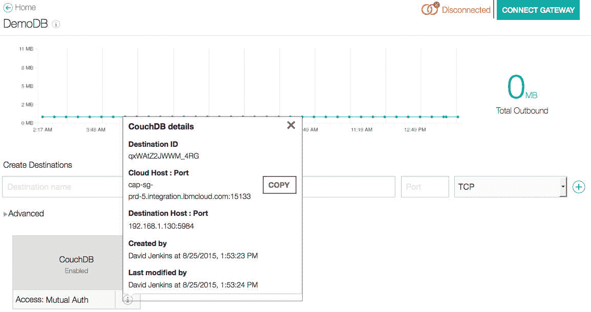
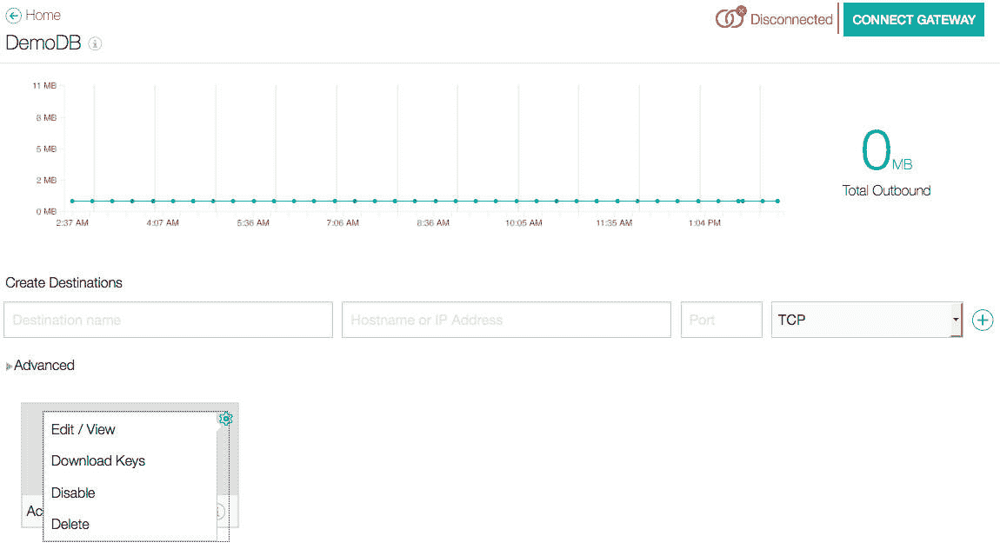
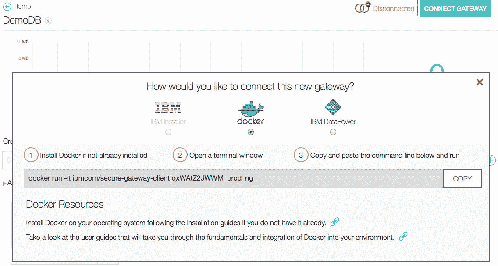

# 使用 IBM Cloud Secure Gateway 将您的 Docker 容器连接到企业服务

> 原文：[`developer.ibm.com/zh/tutorials/se-connect-docker-bluemix-trs/`](https://developer.ibm.com/zh/tutorials/se-connect-docker-bluemix-trs/)

可以利用 IBM Cloud Secure Gateway 服务建立连接到后端企业服务的安全连接。本教程将向您展示如何在 IBM Cloud 中配置服务，如何配置一个 Docker 容器以便从本地机器连接到该服务，以及如何使用 IBM Cloud 应用程序中的服务，通过 Docker 容器从您的本地机器安全地建立隧道来连接到可用的服务。

## 构建您的应用程序需要做的准备工作

您需要一个 [IBM Cloud 帐户](https://cloud.ibm.com/?cm_sp=ibmdev-_-developer-tutorials-_-cloudreg) 。

您还需要已经在本地机器上设置和运行应用程序，并准备好以下内容：

*   一个具有 2 GB RAM 的 Ubuntu 虚拟机（我使用的是版本 v14.04.3）
*   一个 Docker 容器
*   一个 CouchDB v1.6.1 实例

> *这里描述的示例将演示如何使用 Secure Gateway 从 Node.js IBM Cloud 应用程序连接到 CouchDB。*

## 第 1 步. 向您的应用程序添加 Secure Gateway

1.  在 IBM Cloud 中创建一个示例应用程序，选择 **SDK for Node.js Runtime** 。此运行时提供了一个快速获得并运行应用程序的简便方法。我将我的应用程序命名为 “DLJGatewayDemo1″。
2.  在载入应用程序后，浏览到应用程序的概述页面，单击屏幕右上角的 **ADD GIT** 。
3.  选择 **CREATE GIT REPOSITORY** ，确保您选择了使用 starter 应用程序来填充存储库。
4.  在应用程序的概述页面中，单击 **ADD A SERVICE OR API** 。
5.  向下滚动到 Integration 服务，并选择 **Secure Gateway** 服务。要快速找到它，请使用左侧的 Services 过滤器并选择 **Integration** 。
6.  单击 strong>CREATE 添加服务，然后重新载入应用程序。

## 第 2 步. 配置 Secure Gateway

1.  在应用程序的概述页面中，单击要打开 Secure Gateway 仪表板的 **Secure Gateway** 服务。
2.  单击 **Add Gateway** 创建一个新网关。为它提供一个名称，比如 “DemoDB”。
3.  单击 **Add Destinations** 。

    

4.  一个网关可用于支持多个目的地。这意味着您可以在您的本地机器上设置了一个网关，并用它连接到不同的本地目的地。目的地是您的本地机器将通过 Secure Gateway 公开的端点。在这里，我将公开 CouchDB，所以我提供了可从运行 Docker 容器的本地机器访问的 CouchDB 实例的 IP 地址和端口。

    

5.  接下来，要确定将要使用的安全性。如果选择 TCP 或 HTTP，则不需要来自客户端的额外安全性。这对于开发而言意义重大，为了确保 “安全的网关”，需要添加安全性。我选择 **TLS: Mutual Auth** ，它需要使用本地机器 CouchDB 的 IBM Cloud 应用程序提供证书来建立连接。我单击 **Advanced** ，然后选择 **TLS options** 下的 **Mutual Auth** 。
6.  确保选中了 **Auto generate cert and private key** ，否则您以后需要生成它们。您可以上传自己的证书。在输入您的目的地信息之后，单击目的地行末尾处的 **plus** 图标来添加目的地。然后单击 **I’M DONE** 。

    

## 第 3 步. 查看配置详细信息

1.  在应用程序的概述页面中，单击 **Secure Gateway** 服务打开 Secure Gateway 仪表板。
2.  选择 CouchDB 目的地上的 **info** 图标。有关该网关的以下信息将会显示：

    *   Cloud Host:Port
    *   Destination Host:Port
    *   Destination ID

IBM Cloud 应用程序使用 Cloud Host:Port 值来连接到本地 CouchDB。Destination Host:Port 设置指定了可从运行在您的本地机器上的 Docker 容器访问的 host:port。



## 第 4 步. 在本地机器上安装 Docker

您需要已经设置一个 Ubuntu 虚拟机来运行 Docker。我使用了一个 Ubuntu v14.04.3 虚拟机。关于各种 Ubuntu 版本的 Docker 安装说明，请访问 [Docker 网站](https://docs.docker.com/installation/ubuntulinux/) 。

## 第 5 步. 下载 Docker 容器使用的证书

1.  浏览到应用程序的概述页面，然后单击 **Secure Gateway** 服务打开 Secure Gateway 仪表板。
2.  单击目的地（在这里是 **CouchDB** ）打开仪表板。
3.  单击目的地的选项 **gear** 图标并选择 **Download Keys** 。这会下载一个包含证书的 zip 文件。

    

## 第 6 步. 设置 Docker 以便默认使用 TLS 安全性

1.  将证书复制到 Ubuntu 本地机器上名为 “.docker” 的主目录下的新文件夹中。
2.  您下载的 zip 文件中有 5 个文件。复制其中的 3 个文件，如下所示（其中 *xxx* 是目标 ID）：

    *   将 DigiCertCA2.pem 复制到 .docker/ca.pem
    *   将 _xxx cert.pem 复制到 .docker/cert.pem
    *   将 _xxx key.pem 复制到 .docker/key.pem
3.  设置环境变量 `DOCKER_HOST` 和 `DOCKER_TLS_VERIFY` （或者您可以在运行时有选择的使用 `-H` 和 `–tlsverify` 标志）：

    ```
    $ mkdir -pv ~/.docker
    $ cp DigiCertCA2.pem ~/.docker/ca.pem
    $ cp xxx_cert.pem ~/.docker/cert.pem
    $ cp xxx_key.pem ~/.docker/key.pem
    $ export DOCKER_HOST=tcp://$HOST:2376 DOCKER_TLS_VERIFY=1 
    ```

## 第 7 步. 启动 Docker 容器建立一个安全隧道

要从 Ubuntu 本地机器建立一个安全隧道连接，需要启动 Docker 容器并将其指向 IBM Cloud Secure Gateway 的目标 ID。在下面的示例中，我使用了 `-D` 标志来启用调试，确保显示来自该容器的其他任何调试消息。我还使用了 `--net="host"` 标志，该标志允许我的容器与正在运行该容器的本地服务器（Ubuntu 本地机器）共享网络堆栈。第一次运行此代码时，它会下载该映像。

```
$ sudo docker -D run --net="host" -it ibmcom/secure-gateway-client qxWAtZ2JWWM_prod_ng
[sudo] password for bluemix:
IBM Cloud Secure Gateway Client version 1.0.3
<press enter for the command line>
[YYYY-MM-DD HH:MM:SS:MS][INFO] secure tunnel connected 
```

要查看 Docker 命令（不包括上面提到的标志），可以通过浏览到应用程序的概述页面并单击 **Secure Gateway** 服务来打开 Secure Gateway 仪表板。接下来，单击您的目标（ **CouchDB** ）来打开其仪表板。最后，单击 **CONNECT GATEWAY** 按钮来查看连接选项，尤其是 Docker 命令行。



## 第 8 步. 测试连接

打开您的浏览器，浏览至 `http://cap-sg-prd-5.integration.ibmcloud.com:15133` (或者可以从命令行使用 cURL)。

这会导致以下两个可能的错误之一：ERR_CONNECTION_REFUSED 或 ERR_EMPTY_RESPONSE。这是因为您配置了应用程序来使用 TLS:Mutual Auth，所以在建立连接时客户端应用程序需要使用 TLS。下一步向您展示了如何设置应用程序来传递证书，以便允许建立连接。

## 第 9 步. 创建一个 Node.js 应用程序来建立安全隧道

在此步骤中，要创建一个简短的 Node.js 应用程序，以便设置到网关的安全隧道，并下移到本地机器。

1.  首先，创建一个名为 securetunnel.js 的文件，并使用下面的内容填充它。我将通过证书，使用 net 模块来创建一个网络包装器，并使用 tls 模块来建立连接。net 模块暴露了一个位于 localHost:8888 的新端点，它通过 tls 模块创建的安全隧道传输数据。

    ```
    var tls = require('tls');
    var fs = require('fs');
    var net = require('net');
    var tunnelPort = process.env.VCAP_APP_PORT || 8888;
    var server;
    var gatewayOptions = {
        //host local test to bluemix
            host: 'cap-sg-prd-5.integration.ibmcloud.com',
            port: '15133',
            key: fs.readFileSync('key.pem'),
            cert: fs.readFileSync('cert.pem'),
            ca: fs.readFileSync('ca.pem')
        }

    //create a server end point to use as a network wrapper for the secure gateway
    server = net.createServer(function (connListener) {
        console.warn("net server created");
        connListener.on('end', function() {
            console.warn('client disconnected')
        });

        //connect to farside, local/private server
        connectFarside(connListener, function(err, remoteSocket) {
            if (err){
                console.error(err);
            }
            console.warn('connection made')
            remoteSocket.pipe(connListener);
            console.warn('remote socket connected to local connListener');
            connListener.pipe(remoteSocket);
            console.warn('local connListener connected to remote socket');
        });
    });

    //setup listener for network wrapper on localhost:tunnelPort
    //function called when connection established and ready to tunnel requests
    //when in the function we invoke the callbackRunInTunnel which is where the code
    //runs to communicate to through the bluemix secure gateway
    server.listen(tunnelPort, function(){
        console.warn('tunnel created at: '+ server.address().address +":"+ server.address().port);
    });

    //create a TLS connection to the secure gateway
    function connectFarside(conn, callback) {
        try {
        console.warn("initiating farside connection");
            var socket = tls.connect(gatewayOptions, function() {
                console.warn('tunnel connected to '+ gatewayOptions.host +":"+ gatewayOptions.port);
                callback(null, socket);
            });
            socket.on('error', function(err){
                console.warn('Socket error: ' + JSON.stringify(err));
            });
        } catch(err) {
            console.error(err)
            callback(err);
        }
    }; 
    ```

## 第 10 步. 运行 Node.js 应用程序

在运行 securetunnel.js 应用程序之前，需要获得通过 Secure Gateway 服务生成的证书文件，该证书文件已用于 Docker 容器。之前，您下载了一个包含 5 个文件的 zip 文件。复制以下 3 个文件，如下所示：

*   将 DigiCertCA2.pem 复制到 ca.pem
*   将 _xxx cert.pem 复制到 cert.pem
*   将 *xxx key.pem 复制到 key.pem（其中 _xxx* 是目标 ID）

将这 3 个文件放在您放置 secure-conn.js 应用程序的相同目录中。在运行 securetunnel.js 应用程序时，系统会告诉您在其上创建隧道的主机的主机名和端口。

```
$ node securetunnel.js
tunnel created at: 0.0.0.0:8888 
```

## 第 11 步. 再次测试连接

这一次您将使用上一步中由 Node.js 应用程序创建的隧道。您将连接到 `http://localhost:8888`，而不是连接到 `http://cap-sg-prd-5.integration.ibmcloud.com:15133`。和以前一样，使用浏览器或 cURL。我在下面使用了 cURL。这次连接正常工作，因为是通过 Node.js 应用程序进行路由的，该应用程序创建了一个连接到 IBM Cloud Secure Gateway 的 TLS 连接。反过来，该连接被向下路由到本地机器和 CouchDB 实例。

```
$ curl http://127.0.0.1:8888
{"couchdb":"Welcome","uuid":"b03e6f754ca999e2d7a5c919954dc33e","version":"1.6.1","vendor":{"version":"1.6.1-1","name":"Homebrew"}} 
```

## 第 12 步. 在 IBM Cloud 中运行 Node.js 应用程序

1.  从应用程序的概述页面中，单击 **EDIT CODE** 。
2.  将 ca.pem、cert.pem、key.pem 和 securetunnel.js 拖放到您应用程序代码的主文件夹中。
3.  接下来，编辑 package.json 文件，告诉它运行 securetunnel.js 而不是 app.js。将代码从

    ```
    "scripts": {
        "start": "node app.js"
    }, 
    ```

    更改为以下代码：

    ```
    "scripts": {
        "start": "node securetunnel.js"
    }, 
    ```

4.  保存并部署您的代码。

## 第 13 步. 通过 IBM Cloud 测试连接

这一次您将使用由已部署到 IBM Cloud 的 Node.js 应用程序创建的隧道。您将连接到 `http:// _yourappname_.mybluemix.net`，而不是连接到 `http://localhost:8888`。无论是使用浏览器还是 cURL，都将获得相同的结果。如果您将 “**/_utils/**” 添加到路径名称中 (`http://yourappname.mybluemix.net/_utils/`)，并在您的浏览器中打开它，那么您可以使用 IBM Cloud 中建立的安全隧道与 CouchDB 进行完全交互。

```
$ curl http://yourappname.mybluemix.net:8888
{"couchdb":"Welcome","uuid":"b03e6f754ca999e2d7a5c919954dc33e","version":"1.6.1","vendor":{"version":"1.6.1-1","name":"Homebrew"}} 
```

## 结束语

在 IBM Cloud 中创建一个安全网关是如此容易，以致于真的没有必要进行说明，最棘手的部分似乎是如何保障安全和使用连接。本教程中的示例和说明已解释了这个过程的两个细微差别：在 Docker 中使用 TLS 和在您的应用程序中使用 TLS。一旦知道了证书放在哪里，在 Docker 中使用 TLS 就非常简单。在您的应用程序中使用 TLS 更高级一些。提供示例是让您了解如何在 Node.js IBM Cloud 应用程序中使用启用了 TLS 的安全网关的好方法。

您完成了什么？您：

*   在 IBM Cloud 中创建了一个安全网关
*   配置目标并通过设置来使用 TLS: Mutual Auth
*   配置一个 Docker 容器来使用 TLS
*   运行 Docker 容器并连接到安全网关
*   创建一个 Node.js 包装器应用程序来通过 TLS 建立连接，并向您的应用程序公开该连接
*   测试了本地运行您的 Node.js 应用程序的安全连接
*   测试了在 IBM Cloud 中运行您的 Node.js 应用程序的安全连接

本文翻译自：[Connect your Docker container to enterprise services with the IBM Cloud Secure Gateway](https://developer.ibm.com/tutorials/se-connect-docker-bluemix-trs/)（2018-10-09）