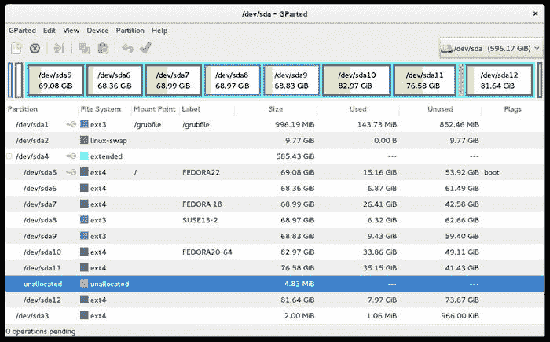
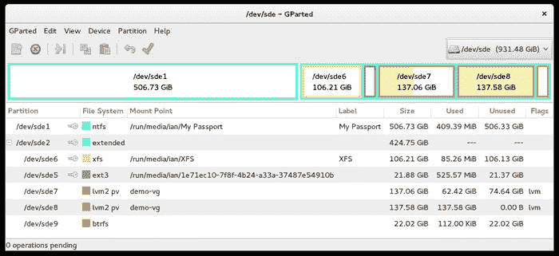

# 硬盘布局

> 原文：[`developer.ibm.com/zh/tutorials/l-lpic1-102-1/`](https://developer.ibm.com/zh/tutorials/l-lpic1-102-1/)

## 概述

在本教程中，将学习为 Linux 系统设计磁盘分区布局。学习内容如下：

*   向不同的分区或磁盘分配文件系统或交换空间
*   针对系统的目标用途来调整设计
*   确保系统可引导
*   理解逻辑卷管理器 (LVM) 的基本特性

## Linux 文件系统

Linux 文件系统包含以目录形式排列在磁盘上或其他块存储设备上的文件。和许多其他系统一样，Linux 系统上的目录可包含其他目录（称为子目录）。不同于 Microsoft® Windows® 等在不同驱动器盘符（A:、C: 等）上具有不同文件系统的系统，Linux 文件系统是一个单一的树，以 / 目录作为其根目录。

##### 关于本系列

本教程系列帮助学习 Linux 系统管理任务。也可使用这些教程中的资料来对 [Linux Professional Institute 的 LPIC-1：Linux 服务器专业认证考试](http://www.lpi.org) 进行应考准备。

请参阅 “[*学习 Linux，101*：LPIC-1 学习路线图](http://www.ibm.com/developerworks/library/l-lpic1-map/index.html)”，查看本系列中每部教程的描述和链接。这个路线图仍正开发，它反映了 2015 年 4 月 15 日更新的 4.0 版 LPIC-1 考试目标。在完成这些教程时，它们将被添加到路线图中。

本教程帮助针对 Linux Server Professional (LPIC-1) 考试 101 的主题 102 中的目标 102.1 进行应考准备。该目标的权重为 2。

**备注：** 本教程主要介绍布局的规划。有关实施步骤，请参阅针对主题 104 的教程（已在我们的 [系列路线图](http://www.ibm.com/developerworks/library/l-lpic1-map/index.html) 中介绍）。

### 前提条件

要从本系列教程中获得最大收获，您应该掌握 Linux 的基本知识并有一个正常工作的 Linux 系统，您可以在这个系统上实践本教程中涵盖的命令。有时程序的不同版本会得到不同的输出格式，所以您的结果可能并不总是与这里给出的清单和图完全相同。

## 通过挂载来建立分支

您可能想知道，如果文件系统是一棵大树，为什么磁盘布局很重要。实际情况是每个块设备（比如硬盘分区、CD-ROM 或软盘）实际上有一个文件系统。您可以通过将不同设备上的文件系统挂载在树中一个称为挂载点的点上，创建文件系统的单一树视图。

通常，内核通过将某个硬盘分区上的文件系统挂载为 / 来启动此挂载过程。可将其他硬盘分区挂载为 /boot、/tmp 或 /home。例如，可以将软盘上的文件系统挂载为 /mnt/floppy，将 CD-ROM 上的文件系统挂载为 /media/cdrom1。也可以使用 NFS 等网络文件系统来挂载来自其他系统的文件。还有其他一些文件挂载类型，但这已能让您对挂载过程有所了解。尽管挂载过程实际挂载某个设备上的文件系统，但我们通常只是简单地说您在 “挂载设备”，它代表的意思是 “挂载设备上的文件系统”。

现在，假设您挂载了根文件系统 (/)，并且希望在挂载点 /media/cdrom 上挂载一个 CD-ROM /dev/sr0。该挂载 CD-ROM 之前，该挂载点必须已经存在。在挂载 CD-ROM 时，CD-ROM 上的文件和子目录会变成 /media/cdrom 中的文件和子目录。任何已存在于 /media/cdrom 中的文件或子目录将不再可见，但它们仍存在于包含挂载点 /media/cdrom 的块设备上。如果卸载了 CD-ROM，最初的文件和子目录将再次变得可见。您不应将其他文件放在打算用作挂载点的目录中，以避免出现此问题。

/ 中的 FHS 目录 显示了文件系统分层结构标准 (FHS) 需要的 / 中的目录（有关 FHS 的更多细节，请参阅 参考资料 ）。

##### / 中的 FHS 目录

| 目录 | 描述 |
| --- | --- |
| bin | 基本的命令二进制文件 |
| boot | 引导加载程序的静态文件 |
| dev | 设备文件 |
| etc | 特定于主机的系统配置 |
| lib | 基本的共享库和内核模块 |
| media | 可移动设备的挂载点 |
| mnt | 临时挂载文件系统的挂载点 |
| opt | 附加应用软件包 |
| sbin | 基本的系统二进制文件 |
| srv | 此系统提供的服务的数据 |
| tmp | 临时文件 |
| usr | 辅助分层结构 |
| var | 变量数据 |

## 分区

第一个 SCSI 驱动器通常是 /dev/sda。在早期的 Linux 系统中，第一个 IDE 硬盘驱动器是 /dev/hda。随着串行附加 (SATA) IDE 设备的诞生，混合 PATA/SATA 系统有时会使用 /dev/hda 作为第一个 PATA 驱动器，使用 /dev/sda 作为第一个 SATA 驱动器。在较新的系统上，所有 IDE 驱动器都命名为 /dev/sda、/dev/sdb 等。IDE 驱动器名称的更改源于热插拔系统，这种系统最初支持 USB 驱动器。热插拔使您能够插入新设备并立即使用它们，现在被用在所有设备中，无论它们是内置到系统中的，还是在以后使用 USB 或 Firewire (IEEE 1394) 或其他可能的连接类型插入到运行的正在系统中的。

### MBR 分区

在传统上，硬盘驱动器被格式化 512 字节的扇区。在磁盘盘片上，无需移动磁头即可读取的所有扇区组成了一个磁道。磁盘通常拥有多个盘片。各个盘片上无需移动磁头即可读取的磁道集合称为一个柱面。硬盘驱动器的集合结构使用柱面、每个柱面的磁道（或磁头）数和每个磁道的扇区数来表达。在编写本文时，驱动器制造商开始引入具有 4K 扇区的磁盘。如果文件系统仍然使用 512 字节扇区，而且某个分区没有从位于 4K 边界的扇区上开始，则有可能导致性能下降。

PC 系统上的 DOS 操作系统所使用的柱面、磁头和扇区的可能大小的限制确定了 BIOS 平移几何结构值，以便可支持更大的硬盘驱动器。最终，甚至是这些方法也不够用。磁盘驱动器技术的最新发展引入了逻辑块寻址 (LBA)，所以 CHS 几何学度量已不那么重要，现代磁盘上的上述几何结构与真实的物理扇区布局的关联很小，甚至已经没有关联。如今使用的更大磁盘已迫使 LDA 扩展到 LBA48，后者保留了 48 位来存储扇区编号。现在，对于更大的驱动器，使用了一种称为 GUID 分区表 (GPT) 的新格式，而不再使用 MBR 格式。GPT 驱动器默认情况下最多支持 128 个分区。

硬盘驱动器上的空间被划分（或分割）为不同的分区。分区不能重叠；未分配给分区的空间称为空闲空间。分区具有类似 /dev/hda1、/dev/hda2、/dev/hda3、/dev/sda1 等的名称。在没有对 IDE 驱动器的热插拔支持的系统上，IDE 驱动器被限制为 63 个分区。热插拔所支持的 SCSI 驱动器、USB 驱动器和 IDE 驱动器被限制为 15 个分区。分配的一个分区包含整数个柱面（基于可能不准确的柱面概念）。仍有一些不完善的柱面分配方法，比如 `parted` 的 `-C` 选项，该选项指定分配的新分区应在柱面边界上。

可以使用 `fdisk` 或 `parted` 命令来显示 MBR 磁盘上的分区信息。两个命令可交互式地操作，或者您可以在命令行上传递参数。可以使用每个命令的 `-v` 参数来显示程序版本信息。两个命令都支持多种不同的显示单位和分配分区。 使用 fdisk 和 parted 显示 MBR 分区 给出了一个交互式地使用带参数的 `fdisk` 和 `parted` ，使用扇区为单位来显示 MBR 格式磁盘上的分区的例子。如这里所示，您需要通过 `sudo` 成为根用户或获取根用户权限，才能显示或操作分区表。

**备注：** 在选择将更新写入磁盘之前，所有这些分区工具都会不断改变内存。如果有怀疑，请使用 **QUIT** 退出：如果您不知道您在做什么或犯了一个错误，可能致使您的磁盘或系统变得不可用。

##### 使用 fdisk 和 parted 显示 MBR 分区

```
[ian@atticf20 ~]$ fdisk -v
fdisk from util-linux 2.26.2
[ian@atticf20 ~]$ fdisk -l /dev/sdb
fdisk: cannot open /dev/sdb: Permission denied
[ian@atticf20 ~]$ sudo fdisk -l /dev/sdb
[sudo] password for ian:
Disk /dev/sdb: 232.9 GiB, 250059350016 bytes, 488397168 sectors
Units: sectors of 1 * 512 = 512 bytes
Sector size (logical/physical): 512 bytes / 512 bytes
I/O size (minimum/optimal): 512 bytes / 512 bytes
Disklabel type: dos
Disk identifier: 0x000404d6

Device     Boot     Start       End   Sectors   Size Id Type
/dev/sdb1              63    401624    401562 196.1M 83 Linux
/dev/sdb2          401625 252786687 252385063 120.4G 83 Linux
/dev/sdb3       252786688 375631871 122845184  58.6G 83 Linux
/dev/sdb4       375647895 488392064 112744170  53.8G 83 Linux
[ian@atticf20 ~]$ sudo parted /dev/sdb
GNU Parted 3.2
Using /dev/sdb
Welcome to GNU Parted! Type 'help' to view a list of commands.
(parted) help u
  unit UNIT                                set the default unit to UNIT

    UNIT is one of: s, B, kB, MB, GB, TB, compact, cyl, chs, %, kiB, MiB,
        GiB, TiB
(parted) u s
(parted) p
Model: ATA HDT722525DLA380 (scsi)
Disk /dev/sdb: 488397168s
Sector size (logical/physical): 512B/512B
Partition Table     : msdos
Disk Flags:

Number  Start       End         Size        Type     File system  Flags
 1      63s         401624s     401562s     primary  ext3
 2      401625s     252786687s  252385063s  primary  ext4
 3      252786688s  375631871s  122845184s  primary  ext3
 4      375647895s  488392064s  112744170s  primary  ext4

(parted) q 
```

请注意，扇区大小同时包含逻辑大小和物理大小。自 2009 年末开始，硬盘驱动器公司就开始在磁盘上采用更大的扇区。这些更大的扇区提供了更高的性能和更好的错误恢复能力。IDEMA（International Disk Drive Equipment and Materials Association，国际硬盘设备和材料协会）将使用这些更大的 4K 扇区的磁盘称为高级格式。请参见 参考资料 ，获取有关的更多信息。因为大部分操作系统都要求使用 512 字节的扇区，所以高级格式驱动器提供了 512 字节扇区模拟功能。如果某个分区从一个是 4096 的倍数的逻辑扇区（扇区 0、8、16 等）上开始，性能通常会提高。

可使用 `parted` 或 `fdisk` 查看 Linux 系统上的三维几何结构。早期的 Linux 系统也在 /proc 文件系统中的一个文件（比如 /proc/ide/hda/geometry）中报告了几何结构，在较新的系统上可能无法找到这个文件。

如果两个不同的分区程序对标称磁盘几何结构（nominal disk geometry）有不同的理解，对于一个分区程序创建的分区，另一个分区程序可能会报告错误或问题。如果磁盘从一个系统移动到另一个系统，也有可能看到这种问题，尤其在 BIOS 功能不同的时候。

可使用 `fdisk` 和 `-u=cylinders` 选项显示柱面中的单位，或者在交互式模式下使用 `u` 子命令在扇区和柱面之间进行切换。最新的 `fdisk` 版本会告诉您现在已弃用的柱面单位。 `parted` 命令支持多个不同的单位。 使用 fdisk 和 parted 显示 MBR 磁盘几何结构 使用 `fdisk` 和 `parted` 显示了 使用 fdisk 和 parted 显示 MBR 分区 中使用的相同磁盘中的分区信息。我们还使用 `parted` 中可用的 `chs` （柱面、磁头和扇区）单位来给出了更详细的信息。对于此示例，我们将以交互方式使用 `fdisk` ，并展示如何在命令行上输入一个 `parted` 子命令字符串。

##### 使用 fdisk 和 parted 显示 MBR 磁盘几何结构

```
[ian@atticf20 ~]$ sudo fdisk /dev/sdb

Welcome to fdisk (util-linux 2.26.2).
Changes will remain in memory only, until you decide to write them.
Be careful before using the write command.

Command (m for help): u
Changing display/entry units to cylinders (DEPRECATED!).

Command (m for help): p
Disk /dev/sdb: 232.9 GiB, 250059350016 bytes, 488397168 sectors
Geometry: 255 heads, 63 sectors/track, 30401 cylinders
Units: cylinders of 16065 * 512 = 8225280 bytes
Sector size (logical/physical): 512 bytes / 512 bytes
I/O size (minimum/optimal): 512 bytes / 512 bytes
Disklabel type: dos
Disk identifier: 0x000404d6

Device     Boot Start   End Cylinders   Size Id Type
/dev/sdb1           1    25        25 196.1M 83 Linux
/dev/sdb2          26 15736     15711 120.4G 83 Linux
/dev/sdb3       15736 23383      7647  58.6G 83 Linux
/dev/sdb4       23384 30401      7019  53.8G 83 Linux

Command (m for help): q

[ian@atticf20 ~]$ sudo parted  /dev/sdb u cyl p u chs p
Model: ATA HDT722525DLA380 (scsi)
Disk /dev/sdb: 30401cyl
Sector size (logical/physical): 512B/512B
BIOS cylinder,head,sector geometry: 30401,255,63\.  Each cylinder is 8225kB.
Partition Table   : msdos
Disk Flags:

Number  Start     End       Size      Type     File system  Flags
 1      0cyl      24cyl     24cyl     primary  ext3
 2      25cyl     15735cyl  15710cyl  primary  ext4
 3      15735cyl  23382cyl  7646cyl   primary  ext3
 4      23383cyl  30400cyl  7018cyl   primary  ext4

Model: ATA HDT722525DLA380 (scsi)
Disk /dev/sdb: 30401,80,62
Sector size (logical/physical): 512B/512B
BIOS cylinder,head,sector geometry: 30401,255,63\.  Each cylinder is 8225kB.
Partition Table   : msdos
Disk Flags:

Number  Start       End           Type     File system  Flags
 1      0,1,0       24,254,62     primary  ext3
 2      25,0,0      15735,62,6    primary  ext4
 3      15735,62,7  23382,0,41    primary  ext3
 4      23383,0,0   30400,254,62  primary  ext4 
```

在使用柱面作为单位时，可以注意到 `parted` 和 `fdisk` 输出所显示的开始柱面和结束柱面之间有明显的差异。这是由于事实上 `parted` 从 0 开始计算柱面，而 `fdisk` 从 1 开始计算。从 `parted` 显示的 chs 信息可以看到，两个柱面没有在柱面边界处开始（磁头编号不等于 0），两个柱面也没有在柱面边界处结束（扇区编号不等于 62）。

### GPT 分区

使用 GUID 分区表 (GPT) 格式化的磁盘没有 MBR 磁盘所具有的几何学概念。对于这些磁盘，可使用 `gdisk` (GPT fdisk) 命令或 `parted` 。如果在 MBR 格式磁盘上使用 `gdisk` ，它将对磁盘执行内存中转换来转换为 GPT 格式。您 **可** 写入此命令来转换磁盘，但这是一个具有很大风险的操作，所以请确保您在尝试之前有一个很好的备份。

**备注：** GPT 被设计为适用于基于 UEFI（Unified Extensible Firmware Interface，统一可扩展固件接口）系统，而不是适用于基于 BIOS 的系统，以便从 GPT 磁盘引导，但您可以通过一些方法绕过此限制。规划分区时请牢记这一点。

在 使用 parted 和 gdisk 显示 GPT 分区 中，我们使用了 `parted` 和 `-l` 选项来显示一个有两个 GPT 磁盘的系统上的所有磁盘的信息。第一个磁盘 (/dev/sda) 是具有 Windows 8 的联想电脑所提供的原始的固态硬盘 (SSD)。第二个磁盘 (/dev/sdb) 是一个安装了 Ubuntu 15.04 的 16GB USB 闪存驱动器。

##### 使用 parted 和 gdisk 显示 GPT 分区

```
ian@yoga-u15:~$ sudo parted -l
Model: ATA SAMSUNG MZMTD512 (scsi)
Disk /dev/sda: 512GB
Sector size (logical/physical): 512B/512B
Partition Table  : gpt
Disk Flags:

Number  Start   End     Size    File system  Name                          Flags
 1      1049kB  1050MB  1049MB  ntfs         Basic data partition          hidden, diag
 2      1050MB  1322MB  273MB   fat32        EFI system partition          boot, hidden, esp
 3      1322MB  2371MB  1049MB  fat32        Basic data partition          hidden
 4      2371MB  2505MB  134MB                Microsoft reserved partition  msftres
 5      2505MB  470GB   467GB   ntfs         Basic data partition          msftdata
 6      470GB   497GB   26.8GB  ntfs         Basic data partition          msftdata
 7      497GB   512GB   15.5GB  ntfs         Basic data partition          hidden, diag

Model:  USB DISK 2.0 (scsi)
Disk /dev/sdb: 32.1GB
Sector size (logical/physical): 512B/512B
Partition Table  : gpt
Disk Flags:

Number  Start   End     Size    File system     Name  Flags
 1      1049kB  316MB   315MB                         bios_grub
 2      316MB   4510MB  4194MB  linux-swap(v1)
 3      4510MB  32.1GB  27.6GB  ext4

ian@yoga-u15:~$ sudo gdisk -l /dev/sdb
GPT fdisk (gdisk) version 0.8.10

Partition table scan:
  MBR: protective
  BSD: not present
  APM: not present
  GPT: present

Found valid GPT with protective MBR; using GPT.
Disk /dev/sdb: 62685184 sectors, 29.9 GiB
Logical sector size: 512 bytes
Disk identifier (GUID): FEE4E37D-AE90-43A1-A6A7-97ADA4618384
Partition table holds up to 128 entries
First usable sector is 34, last usable sector is 62685150
Partitions will be aligned on 2048-sector boundaries
Total free space is 4029 sectors (2.0 MiB)

Number  Start (sector)    End (sector)  Size       Code  Name
   1            2048          616447   300.0 MiB   EF02
   2          616448         8808447   3.9 GiB     8200
   3         8808448        62683135   25.7 GiB    8300 
```

### MBR 分区类型

针对 MBR 而格式化的 IDE 驱动器有 3 种类型的分区：主分区、逻辑分区和扩展分区。分区表位于磁盘的主引导记录 (MBR) 中。MBR 是磁盘的第一个扇区，所以分区表不是它的一个非常大的部分。这将磁盘上的主分区数量限制为 4 个。需要 4 个以上的分区时，就像常常遇到的情况一样，必须将主分区变成扩展分区。扩展分区是一个或多个逻辑分区的容器。这样，就可以在使用 MBR 布局的驱动器上拥有 4 个以上的分区。

MBR 布局还将支持的磁盘最大大小限制到大约 2TB。较新的 GUID 分区表（或 GPT）布局解决了此大小限制，还解决了分区数量较少的限制。使用 GPT 布局来格式化的磁盘默认支持最多使用 128 个主分区，但不使用扩展或逻辑分区。有关 MBR 内部结构和 GUID 分区表 (GPT) 工作原理的更多信息，请参与 MBR、EBR、GPT 和 LVM 内部结构 。

简单地讲，扩展分区是一个或多个逻辑分区的容器。此分区模式最初用于 MS DOS 和 PC DOS，允许 PC 磁盘供 DOS、Windows 或 Linux 系统使用。您只能有一个扩展分区，而且其中的空间必须是连续的。数据存储在扩展分区中的逻辑分区中。只有首先在扩展分区中创建逻辑分区，然后才能将数据存储在扩展分区中。

Linux 将主分区或扩展分区按 1 到 4 进行编号，所以 dev/sda 可以有 4 个主分区 /dev/sda1、/dev/sda2、/dev/sda3 和 /dev/sda4。或者它可以有最多 3 个主分区和 1 个扩展分区。一种常见的布局是拥有单一的主分区 /dev/sda1 和一个扩展分区 /dev/sda2。如果定义了逻辑分区，它们从 5 开始编号，所以 /dev/sda 上的第一个逻辑分区将为 /dev/sda5，即使磁盘上没有主分区且只有一个扩展分区 (/dev/sda1)。所以如果想要在 IDE 驱动器上有 4 个以上的分区，需要给扩展分区留出一个分区编号。尽管现在对于具有热插拔功能的内核，IDE 驱动器上分区最大数量理论上限制为 15 个，但您不一定能创建最后几个分区。如果计划在一个驱动器上使用 12 个以上的分区，请小心确认所有功能都可正常工作。

MBR 分区类型的示例 给出了对 Fedora 22 系统上一个具有主分区、扩展分区和逻辑分区的内部驱动程序执行带 `p` 选项的 `parted` 命令的输出。请注意不同的文件系统类型，将它们与之前的清单（包括 GPT 清单）对比。

##### MBR 分区类型的示例

```
[ian@atticf20 ~]$ sudo parted /dev/sda p
Model: ATA WDC WD6401AALS-0 (scsi)
Disk /dev/sda: 640GB
Sector size (logical/physical): 512B/512B
Partition Table  : msdos
Disk Flags:

Number  Start   End     Size    Type      File system     Flags
 1      32.3kB  1045MB  1045MB  primary   ext3
 2      1045MB  11.5GB  10.5GB  primary   linux-swap(v1)
 4      11.5GB  640GB   629GB   extended
 5      11.5GB  85.7GB  74.2GB  logical   ext4            boot
 6      85.7GB  159GB   73.4GB  logical   ext4
 7      159GB   233GB   74.1GB  logical   ext4
 8      233GB   307GB   74.1GB  logical   ext3
 9      307GB   381GB   73.9GB  logical   ext3
10      381GB   470GB   89.1GB  logical   ext4
11      470GB   552GB   82.2GB  logical   ext4
12      552GB   640GB   87.7GB  logical   ext4 
```

## 逻辑卷管理器 (LVM)

现在您已理解各种分区类型，您可能想知道如果没有为各个分区计划正确的大小，会发生什么。您如何扩展或搜索它们？或者如果一个大型文件系统需要比单个磁盘的容量更多的空间，会发生什么？进入逻辑卷管理器 (LVM)。

借助 LVM，您可以抽象化您的磁盘空间的管理，使单个文件系统可涵盖多个磁盘或分区，而且您可以轻松地在文件系统中添加或删除空间。当前版本为 lvm2，它向后兼容最初的 lvm（现在有时称为 lvm1）。

LVM 使用以下方式管理磁盘空间：

*   物理卷 (PV)
*   卷组 (VG)
*   逻辑卷 (LV)

物理卷是整个驱动器或驱动器上的一个分区。尽管 LVM 可在未定义分区的情况下使用整个驱动器，但您在 MBR、EBR、GPT 和 LVM 内部结构 节中将会看到，这通常不是一个好主意。

卷组是一个或多个 PV 的集合。一个 VG 中的空间被当作一个大型磁盘来管理，即使底层 PV 分散在多个分区或多个磁盘上。稍后我们将会演示，底层 PV 可具有不同的大小，并位于不同类型的磁盘上。

逻辑卷类似于物理 GPT 或 MBR 分区，因为它是使用某种特定文件系统类型来格式化的空间单元，比如 ext4 或 XFS，然后挂载为您的 Linux 文件系统的一部分。一个 LV 完全位于一个 VG 中。

可将 PV 视为一种物理空间单元，它们聚合在一种称为 VG 的抽象中结构中，VG 很像一种虚拟驱动器。VG 或虚拟驱动器然后分区为供文件系统使用的 LV。

在 VG 中，通过区段 (extent) 的方式来管理空间。默认的区段大小为 4MB，这个大小通常已经够用。如果使用更大的区段大小，需要注意的是，一个 VG 中的所有 PV 必须使用相同的区段大小。分配或调整 LV 时，分配单位为盘区大小。所以 LV 中的默认结果是 4MB 的倍数，必须按 4MB 的倍数来递增或递减。

LVM 结构的最后一部分是设备映射器。这是一块 Linux 内核代码，它为 LVM 或软件 RAID 等虚拟设备提供了一般性基础。

使用 LVM 的命令通常在 lvm2 包中。您可以从命令行运行一些命令，或者可以运行 `lvm` 命令，该命令提供了一个 shell 来运行各种 LVM 命令。 lvm 命令和它的子命令 显示了 `lvm` 命令和可从中运行的各种命令。与其他分区工具一样，除非您具有根用户权限，否则只能使用有限的功能。

##### lvm 命令和它的子命令

```
[[ian@atticf20 ~]$ lvm
  WARNING: Running as a non-root user. Functionality might be unavailable.
lvm> help
  /run/lvm/lvmetad.socket: connect failed: Permission denied
  WARNING: Failed to connect to lvmetad. Falling back to internal scanning.
  Available lvm commands:
  Use 'lvm help <command>' for more information

  devtypes        Display recognised built-in block device types
  dumpconfig      Dump configuration
  formats         List available metadata formats
  help            Display help for commands
  lvchange        Change the attributes of logical volume(s)
  lvconvert       Change logical volume layout
  lvcreate        Create a logical volume
  lvdisplay       Display information about a logical volume
  lvextend        Add space to a logical volume
  lvmchange       With the device mapper, this is obsolete and does nothing.
  lvmdiskscan     List devices that can be used as physical volumes
  lvmsadc         Collect activity data
  lvmsar          Create activity report
  lvreduce        Reduce the size of a logical volume
  lvremove        Remove logical volume(s) from the system
  lvrename        Rename a logical volume
  lvresize        Resize a logical volume
  lvs             Display information about logical volumes
  lvscan          List all logical volumes in all volume groups
  pvchange        Change attributes of physical volume(s)
  pvresize        Resize physical volume(s)
  pvck            Check the consistency of physical volume(s)
  pvcreate        Initialize physical volume(s) for use by LVM
  pvdata          Display the on-disk metadata for physical volume(s)
  pvdisplay       Display various attributes of physical volume(s)
  pvmove          Move extents from one physical volume to another
  pvremove        Remove LVM label(s) from physical volume(s)
  pvs             Display information about physical volumes
  pvscan          List all physical volumes
  segtypes        List available segment types
  tags            List tags defined on this host
  vgcfgbackup     Backup volume group configuration(s)
  vgcfgrestore    Restore volume group configuration
  vgchange        Change volume group attributes
  vgck            Check the consistency of volume group(s)
  vgconvert       Change volume group metadata format
  vgcreate        Create a volume group
  vgdisplay       Display volume group information
  vgexport        Unregister volume group(s) from the system
  vgextend        Add physical volumes to a volume group
  vgimport        Register exported volume group with system
  vgmerge         Merge volume groups
  vgmknodes       Create the special files for volume group devices in /dev
  vgreduce        Remove physical volume(s) from a volume group
  vgremove        Remove volume group(s)
  vgrename        Rename a volume group
  vgs             Display information about volume groups
  vgscan          Search for all volume groups
  vgsplit         Move physical volumes into a new or existing volume group
  version         Display software and driver version information
lvm> quit
  Exiting. 
```

为了提供实际运用 LVM 的简单例子， 显示您的物理卷 显示了一个 USB 驱动器上的两个 PV，您使用了 `pvscan` 命令来显示系统上的 PV。

##### 显示您的物理卷

```
[ian@atticf20 ~]$ sudo pvscan
  PV /dev/sde8         lvm2 [137.58 GiB]
  PV /dev/sde7         lvm2 [137.06 GiB]
  Total: 2 [274.64 GiB] / in use: 0 [0   ] / in no VG: 2 [274.64 GiB] 
```

现在，您将使用 `vgcreate` 命令来从这两个 PV 创建一个卷组，然后使用 `lvcreate` 命令创建一个比任一个 PV 都大的逻辑卷。最后，将新 LV 格式化为 ext4 并将它挂载在 /mnt/lvdemo 上，如 创建一个卷组和一个逻辑卷 中所示。

##### 创建一个卷组和一个逻辑卷

```
[ian@atticf20 ~]$ sudo vgcreate demo-vg /dev/sde7 /dev/sde8
  Volume group "demo-vg" successfully created
[ian@atticf20 ~]$ sudo lvcreate -L 200G -n demo-lv demo-vg
  Logical volume "demo-lv" created.
[ian@atticf20 ~]$ sudo lvscan
  ACTIVE            '/dev/demo-vg/demo-lv' [200.00 GiB] inherit
[ian@atticf20 ~]$ sudo mkfs -t ext4 /dev/demo-vg/demo-lv
mke2fs 1.42.12 (29-Aug-2014)
Creating filesystem with 52428800 4k blocks and 13107200 inodes
Filesystem UUID: d8589116-f58f-4e09-ac70-77543afd49da
Superblock backups stored on blocks:
    32768, 98304, 163840, 229376, 294912, 819200, 884736, 1605632, 2654208,
    4096000, 7962624, 11239424, 20480000, 23887872

Allocating group tables: done
Writing inode tables: done
Creating journal (32768 blocks): done
Writing superblocks and filesystem accounting information: done

[ian@atticf20 ~]$ sudo mkdir /mnt/lvdemo
[ian@atticf20 ~]$ sudo mount /dev/demo-vg/demo-lv /mnt/lvdemo
[ian@atticf20 ~]$ sudo df -h /mnt/lvdemo/
Filesystem                     Size  Used Avail Use% Mounted on
/dev/mapper/demo--vg-demo--lv  197G   60M  187G   1% /mnt/lvdemo 
```

**备注：**

*   `mkfs` 和 `mount` 等文件系统命令使用类似 /dev/<vg-name>/ <lv-name>的名称来访问 LV。</lv-name></vg-name>
*   默认情况下，创建 LV 时，它会立即激活，这从 创建一个卷组和一个逻辑卷 中的 `vgscan` 命令输出可以看出。如果 LV 位于可移动驱动器上，您需要卸载该驱动器上挂载的任何文件系统，使用 `lvchange` 命令取消激活它，然后才能从系统删除该驱动器。

## MBR、EBR、GPT 和 LVM 内部结构

在学习磁盘空间的分配之前，让我们大体了解一下 MBR、EBR、GPT 和 LVM 分区表的内部结构，以帮助巩固这些难以掌握的概念。

**备注：** LPI 考试不需要这一水平的细节，所以如果您时间紧迫或对内部结构不感兴趣，随时可以跳到 分配磁盘空间 。

### 主引导记录

主引导记录 (MBR) 是硬盘驱动器上的第一个扇区。MBR 包含引导程序代码，可能还包含其他一些信息，紧接着是 64 字节的分区表和一个 2 字节的引导签名。64 字节的分区表有 4 个 16 字节的条目，从偏移量 446 (1BEh) 开始。 分区表条目格式 给出了每个 16 字节条目的布局。

##### 分区表条目格式

| 偏移量（十六进制） | 长度 | 描述 |
| --- | --- | --- |
| 0h | 1 | 状态。80h 表示活动（或可引导）的分区。 |
| 1h | 3 | 分区中第一个绝对扇区的 CHS（柱面-磁头-扇区）地址 |
| 4h | 1 | 分区类型。 |
| 5h | 3 | 分区中最后一个绝对扇区的 CHS（柱面-磁头-扇区）地址 |
| 8h | 4 | 分区中第一个绝对扇区的逻辑块地址 (LBA)。 |
| Ch | 4 | 分区中的扇区数量 |

看看一个实际示例。根用户可使用 `dd` 命令直接从一个磁盘读取扇区。 显示 /dev/sda 上的分区表 显示了将 MBR 的前 510B 转储在 /dev/sda 上，然后使用 `tail` 命令仅选择记录的最后 64B（您随后会显示为十六进制）的输出。

##### 显示 /dev/sda 上的分区表

```
[root@atticf20 ~]# dd if=/dev/sda bs=510 count=1 2>/dev/null|tail -c 64 |hexdump -C
00000000  00 01 01 00 83 fe 3f 7e  3f 00 00 00 80 21 1f 00  |......?~?....!..|
00000010  00 00 01 7f 82 fe ff ff  bf 21 1f 00 3b 8b 38 01  |.........!..;.8.|
00000020  00 fe ff ff 83 fe ff ff  00 70 85 4a 00 10 00 00  |.........p.J....|
00000030  00 fe ff ff 05 fe ff ff  37 ad 57 01 8a c1 2d 49  |........7.W...-I|
00000040 
```

请注意，所有这些记录都没有表示可引导分区的 80h 状态。分区类型为 83h (Linux)、82h（Linux 交换）、83h (Linux) 和 05h（扩展），所以该磁盘有 3 个主分区和 1 个扩展分区。除第一个外的所有 CHS 值都为 feffff，这是使用 LBA 的磁盘上的典型情况。LBA 开始扇区和扇区计数解释为 32 位小端整数，所以 80 21 1f 00 表示 001f2180h，对应的十进制数为 2040192。所以第一个分区从扇区 63 (3fh) 开始，然后扩展为 2040192 (1F2180h) 个扇区。因此， `fdisk` 将显示结束扇区为 63+2040255-1=2040254。

在示例中，最后一行 (partition type 05h) 描述了扩展分区，它从扇区 0157ad37h（或十进制 22523191）开始。稍后在查看逻辑分区时，将需要该数字。

**备注：**

*   MBR 中的分区表不包含逻辑分区的任何信息，除了一条描述扩展分区容器的记录。您稍后会看到如何找到这些信息。
*   如果您的磁盘使用的是 CHS 值而不是 LBA 值，您需要执行一些额外的运算来将 CHS 值转换为绝对扇区。不需要使用不同的运算来找到绝对扇区，原理与这里列出的算法一样，所以在这里的简短介绍中不会介绍 CHS 计算。

##### /dev/sda 的 fdisk 输出

```
[ian@atticf20 ~]$ sudo fdisk -l /dev/sda
Disk /dev/sda: 596.2 GiB, 640135028736 bytes, 1250263728 sectors
Units: sectors of 1 * 512 = 512 bytes
Sector size (logical/physical): 512 bytes / 512 bytes
I/O size (minimum/optimal): 512 bytes / 512 bytes
Disklabel type: dos
Disk identifier: 0x00064a1a

Device     Boot      Start        End    Sectors   Size Id Type
/dev/sda1               63    2040254    2040192 996.2M 83 Linux
/dev/sda2          2040255   22523129   20482875   9.8G 82 Linux swap / Solaris
/dev/sda3       1250258944 1250263039       4096     2M 83 Linux
/dev/sda4         22523191 1250258624 1227735434 585.4G  5 Extended
/dev/sda5  *      22523193  167397299  144874107  69.1G 83 Linux
/dev/sda6        167397363  310761359  143363997  68.4G 83 Linux
/dev/sda7        310761423  455442749  144681327    69G 83 Linux
/dev/sda8        455442813  600092009  144649197    69G 83 Linux
/dev/sda9        600092073  744436034  144343962  68.8G 83 Linux
/dev/sda10       744436098  918439935  174003838    83G 83 Linux
/dev/sda11       918441984 1079044095  160602112  76.6G 83 Linux
/dev/sda12      1079053983 1250258624  171204642  81.7G 83 Linux

Partition table entries are not in disk order. 
```

事实上 /dev/sda1 在 2040254 上结束。

请注意显示分区表条目未按顺序排列的警告。这是因为 /dev/sda3 是一个较小的主分区，是刚才为了演示此概念而添加到磁盘末尾的一个分区。这不是一个错误，但 `fdisk` 程序和其他一些工具支持选择重写分区表，使它整齐有序。

### 扩展引导记录 (EBR)

在进一步了解扩展分区之前，快速看看 `gparted` 命令的图形输出，因为这会提供分区布局的图形画面，显示扩展分区的容器性质，

使用 gparted 显示包含多种分区类型的 /dev/sda 显示了对 /dev/sda 执行 `gparted` 命令的结果。正如之前提到的，该磁盘有 3 个主分区（/dev/sda1、/dev/sda2 和 /dev/sda4）和一个无序的扩展分区 (/dev/sda3)。扩展分区包含逻辑分区 /dev/sda5 到 /dev/sda12。在图像顶部的图示中，扩展分区被显示为一个围绕逻辑分区的（浅蓝色）方框。 使用 gparted 显示包含更多分区类型的 /dev/sde 显示了包含我们的 LVM 分区的 USB 驱动器上的分区。请注意，这些分区被标记为 LVM，/dev/sda6 设置了 boot 标志。

##### 使用 gparted 显示包含多种分区类型的 /dev/sda



##### 使用 gparted 显示包含更多分区类型的 /dev/sde



正如之前所看到的，MBR 不包含逻辑分区的分区表条目；它定义了一个容器来管理系统的剩余部分，就像一个特殊分区。逻辑分区是在这个容器中定义的。此过程的原理是什么？

扩展分区内的逻辑分区数量没有严格限制，任何固定大小的分区表都没有定义逻辑分区。相反， **每个** 逻辑分区都有一条扩展引导记录 (EBR)。像 MBR 一样，EBR 的长度为 512B，它像 MBR 一样使用偏移量 446 (1BEh) 上的一个分区表。这里只使用了 EBR 分区表中的两个条目。第一个条目定义了当前分区的偏移量和大小，第二个条目定义了下一个逻辑分区的偏移量和并结算该分区的结束点。对于这个单链链接中的最后一个逻辑分区，第二个条目包含 0。

要简化将小端十六进制数转换为十进制数的工作，可创建一个小型的 Bash 函数来显示 EBR 中的前两个条目。然后，使用 `hexdump` 命令的格式化字符串功能来显示 LBA 开始扇区和以十进制数而不是十六进制数表示的扇区数量。 显示 EBR 的函数 显示了 `showebr` 函数。您可以将此函数定义粘贴到您的 Bash 终端会话中来亲自尝试。

##### 显示 EBR 的函数

```
showebr ()
{
    dd if=$1 skip=$2 bs=512 count=1 2> /dev/null | tail -c 66 |
     hexdump -n 32 -e '"%07.7_ax  " 8/1 "%2.2x " 2/4 " %12d" "\n"'
} 
```

第一个 EBR 是您的扩展分区的第一个扇区，所以使用您的新 `showebr` 函数，使用您在 显示 /dev/sda 上的分区表 中找到的扇区偏移量 0157AD37h 或十进制表示 22523191 来显示它。

/dev/sda 上的第一个 EBR 显示了输出。

##### /dev/sda 上的第一个 EBR

```
[root@atticf20 ~]# showebr /dev/sda 22523191
0000000  80 fe ff ff 83 fe ff ff            2    144874107
0000010  00 fe ff ff 05 fe ff ff    144874109    143364060 
```

EBR 分区表中的第一个条目 (/dev/sda5) 显示，该分区 (/dev/sda5) 从这个 EBR 中的偏移量 2 处开始，而且该分区包含 144874107 个扇区，所以该分区在扇区 22523191 + 2 + 144874107 -1 = 167397299 处结束。第二个条目 (/dev/sda6) 显示下一个 EBR 在扩展分区中 **第一个** EBR 的偏移量 144874109 处或在扇区 22523191 + 144874109 = 167397300 处开始。该数量是从 **下一个** EBR 开始到下一个逻辑分区结束或 143364060 位置的扇区数量，所以最后一个扇区为 167397300 + 143364060 -1 = 310761359。

/dev/sda 上的扩展和逻辑分区 显示了 /dev/sda 上的扩展分区和逻辑分区的分区信息。请注意，/dev/sda6 的扇区数量为 143363997，它比您刚看到的 143364060 少 63 个扇区。您刚才计算的开始位置 167397363（而不是 167397300）也偏移了 63 个扇区。您稍后将会看到这 63 个扇区的差异是，您在 EBR 链中下一个 EBR 中看到的偏移量。

##### /dev/sda 上的扩展和逻辑分区

```
Device     Boot      Start        End    Sectors   Size Id Type
/dev/sda4         22523191 1250258624 1227735434 585.4G  5 Extended
/dev/sda5  *      22523193  167397299  144874107  69.1G 83 Linux
/dev/sda6        167397363  310761359  143363997  68.4G 83 Linux
/dev/sda7        310761423  455442749  144681327    69G 83 Linux
/dev/sda8        455442813  600092009  144649197    69G 83 Linux
/dev/sda9        600092073  744436034  144343962  68.8G 83 Linux
/dev/sda10       744436098  918439935  174003838    83G 83 Linux
/dev/sda11       918441984 1079044095  160602112  76.6G 83 Linux
/dev/sda12      1079053983 1250258624  171204642  81.7G 83 Linux 
```

使用刚学到的知识，以及 `showebr` 函数和一些内联 shell 运算，现在可以计算 /dev/sda 的整个 EBR 链，如 计算出 /dev/sda 上的逻辑分区链 中所示。

##### 计算出 /dev/sda 上的逻辑分区链

```
[root@atticf20 ~]# showebr /dev/sda 22523191
0000000  80 fe ff ff 83 fe ff ff            2    144874107
0000010  00 fe ff ff 05 fe ff ff    144874109    143364060
[root@atticf20 ~]# showebr /dev/sda $(( 22523191 + 144874109 ))
0000000  00 fe ff ff 83 fe ff ff           63    143363997
0000010  00 fe ff ff 05 fe ff ff    288238169    144681390
[root@atticf20 ~]# showebr /dev/sda $(( 22523191 + 288238169 ))
0000000  00 fe ff ff 83 fe ff ff           63    144681327
0000010  00 fe ff ff 05 fe ff ff    432919559    144649260
[root@atticf20 ~]# showebr /dev/sda $(( 22523191 + 432919559 ))
0000000  00 fe ff ff 83 fe ff ff           63    144649197
0000010  00 fe ff ff 05 fe ff ff    577568819    144344025
[root@atticf20 ~]# showebr /dev/sda $(( 22523191 + 577568819 ))
0000000  00 fe ff ff 83 fe ff ff           63    144343962
0000010  00 fe ff ff 05 fe ff ff    721912844    174003901
[root@atticf20 ~]# showebr /dev/sda $(( 22523191 + 721912844 ))
0000000  00 fe ff ff 83 fe ff ff           63    174003838
0000010  00 fe ff ff 05 fe ff ff    895916745    160604160
[root@atticf20 ~]# showebr /dev/sda $(( 22523191 + 895916745 )) #/dev/sda11
0000000  00 fe ff ff 83 fe ff ff         2048    160602112
0000010  00 fe ff ff 05 fe ff ff   1056530729    171204705
[root@atticf20 ~]# showebr /dev/sda $(( 22523191 + 1056530729 ))
0000000  00 fe ff ff 83 fe ff ff           63    171204642
0000010  00 00 00 00 00 00 00 00            0            0 
```

您现在已经看到，/dev/sda6 确实拥有 63 个扇区的偏移量，这导致了刚才注意到的差异。在此示例中，其他大多数分区也存在 63 个扇区的偏移量。这是大多数 Windows 和 Linux 系统中的典型情形。随着高级格式磁盘和更大的扇区的出现，以及分区对齐对性能更重要的固态硬盘 (SSD) 诞生，您现在能够将分区与特定的边界对齐。请注意，/dev/sda11 拥有 2048 个扇区的偏移量。

您可能在 使用 gparted 显示包含多种分区类型的 /dev/sda 中已注意到，/dev/sda11 与 /dev/sda12 之间存在较小的差距。有了现在掌握的知识，您应该能够使用扩展分区起点和来自 /dev/sda11 的 EBR 的值，计算该差距的大小。

### GUID 分区表 (GPT)

我之前曾经提到，MBR 布局将包含 512B 扇区的磁盘大小限制为 2TB。随着超过 2TB 的磁盘诞生，一种称为 GUID 分区表 (GPT) 的新布局也被设计出来。此格式可用在较小的磁盘上，但它是较大的磁盘所必需的。磁盘格式在常见的 MBR 位置放入了一个所谓的保护性 MBR，使无法理解 GPT 的操作系统和实用程序将整个磁盘视为一种未知的分区类型 (EEh)，显示的大小被缩减为整个磁盘或 MBR 支持的最大磁盘扇区大小。

最新的 Linux 发行版包含从 GPT 格式化和引导的工具，包括 `gdisk` （类似于 `fdisk` ）、 `parted` 、 `gparted` 、 `grub2` 和最新版本的 `grub` 。

最新的 Linux 系统还支持使用传统的 PC BIOS 或较新的可扩展固件接口（Extensible Firmware Interface，EFI），以便从 GPT 分区进行引导。最新的 64 位版 Windows 也支持使用 EFI 从 GPT 分区进行引导，而且 Windows 8 要求这么做。

GPT 分区包含一个 GPT 标头和一个 GPT 分区阵列。GPT 分区阵列包含至少 128 个条目，所以一个 GPT 磁盘可支持至少 128 个主分区。GPT 标头位于 GPT 分区的第一个扇区中，分区阵列位于下一个扇区中。GPT 标头和分区阵列会复制到分区末尾。为了提供额外的保护，标头还包含分区阵列的一个 32 位 CRC。

对 /dev/sdc 执行 gdisk 的输出 显示了对 Windows 8.1 笔记本上一个 SSD 主磁盘，以及一个包含这些示例中使用的 Ubuntu 15.04 系统的必要分区的 32GB USB 闪存驱动器 (/dev/sdb) 执行 `gdisk` 命令的输出。请注意 EFI 系统分区 (/dev/sda2)，它是 UEFI 引导加载程序寻找要引导的文件的地方。

##### 对 /dev/sdc 执行 gdisk 的输出

```
ian@yoga-u15:~$ sudo gdisk -l /dev/sda
GPT fdisk (gdisk) version 0.8.10

The protective MBR's 0xEE partition is oversized! Auto-repairing.

Partition table scan:
  MBR: protective
  BSD: not present
  APM: not present
  GPT: present

Found valid GPT with protective MBR; using GPT.
Disk /dev/sda: 1000215216 sectors, 476.9 GiB
Logical sector size: 512 bytes
Disk identifier (GUID): 2D3D303D-0161-4AB2-A713-41DD1A88A647
Partition table holds up to 128 entries
First usable sector is 34, last usable sector is 1000215182
Partitions will be aligned on 2048-sector boundaries
Total free space is 2669 sectors (1.3 MiB)

Number  Start (sector)    End (sector)  Size       Code  Name
   1            2048         2050047   1000.0 MiB  2700  Basic data partition
   2         2050048         2582527   260.0 MiB   EF00  EFI system partition
   3         2582528         4630527   1000.0 MiB  ED01  Basic data partition
   4         4630528         4892671   128.0 MiB   0C01  Microsoft reserved ...
   5         4892672       917575679   435.2 GiB   0700  Basic data partition
   6       917575680       970004479   25.0 GiB    0700  Basic data partition
   7       970004480      1000214527   14.4 GiB    2700  Basic data partition
ian@yoga-u15:~$ sudo gdisk -l /dev/sdb
GPT fdisk (gdisk) version 0.8.10

Partition table scan:
  MBR: protective
  BSD: not present
  APM: not present
  GPT: present

Found valid GPT with protective MBR; using GPT.
Disk /dev/sdb: 62685184 sectors, 29.9 GiB
Logical sector size: 512 bytes
Disk identifier (GUID): FEE4E37D-AE90-43A1-A6A7-97ADA4618384
Partition table holds up to 128 entries
First usable sector is 34, last usable sector is 62685150
Partitions will be aligned on 2048-sector boundaries
Total free space is 4029 sectors (2.0 MiB)

Number  Start (sector)    End (sector)  Size       Code  Name
   1            2048          616447   300.0 MiB   EF02
   2          616448         8808447   3.9 GiB     8200
   3         8808448        62683135   25.7 GiB    8300 
```

可在教程 “通过 GPT 和 Linux 充分利用大型磁盘” 中找到更多的信息（参见 参考资料 ）。

### LVM

我之前已提到过，LVM 可充分利用整个磁盘，无需首先对磁盘进行分区。出于 GPT 使用保护性 MBR 的相同原因，您应在磁盘上创建一个分区，然后在该分区中创建一个 PV，而不是使用原生的 LVM 功能来将整个磁盘定义为一个 PV。这样，无法理解 LVM 的其他操作系统就会认识到，该磁盘上有一个未知分区，而不会将它视为未格式化。

要管理 LVM 中使用的抽象层，显然需要比原始 MBR 分区表多得多的信息。除了建议您为 PV 创建一个分区之外，我不会进一步介绍 LVM 所使用的磁盘上的数据结构。

## 分配磁盘空间

正如之前所提到的，一个 Linux 文件系统是一个以 / 为根的庞大的树形结构。您至少需要拥有文件系统分层结构标准中所描述的文件系统。请参阅 / 中的 FHS 目录 获取这些文件系统的列表，或者参见 参考资料 。软盘或 CD-ROM 上的数据必须挂载的原因显而易见，不过您应考虑对存储在硬盘上的数据进行分离的原因或许不是那么明显。分离文件系统的一些不错的原因包括：

*   引导文件。一些文件必须可在引导时从 BIOS、UEFI 或引导加载程序访问。
*   多个硬盘驱动器。通常，每个硬盘将被划分为一个或多个分区，每个分区有一个必须挂载在文件系统树中某处的文件系统。
*   可共享的文件。一些系统镜像可共享静态文件，比如可执行程序文件。诸如用户主目录或邮件假脱机文件等动态文件也可共享，这样用户就可登录到网络上多个机器中的任何一个，而仍然使用同一个主目录和邮件系统。
*   潜在的溢出。如果一个文件系统的容量可能被完全占满，那么将它与运行系统所需的文件分开通常是个好主意。
*   配额。配额限制用户或组可在文件系统上占用的空间量。
*   只读挂载。在日志文件系统出现之前，在系统崩溃后恢复文件系统常常会花很长时间。因此，您可以只读形式挂载很少更改的文件系统（比如可执行程序的目录），以减少在系统崩溃后检查文件系统所花的时间。

除了目前介绍的文件系统用途之外，您还需要考虑在磁盘上分配交换空间。对于 Linux 系统，这通常是一个或多个专门的分区。

最后，您可能需要考虑拥有 UEFI 固件而不是 BIOS 的系统所需的分区，以及应为您的磁盘使用 GPT 还是 MBR 格式。

## 进行选择

我们就在设置一个拥有至少一个硬盘驱动器的系统，而且您希望从该硬盘驱动器引导。（本教程不会考虑通过 LAN 引导的无磁盘工作站的设置，或者使用实时 CD 或 DVD Linux 系统的考虑因素。）尽管可以在以后更改分区大小，但这通常需要一定的精力，所以提前做出正确的选择很重要。我们将会开始介绍相关的内容。

第一个考虑因素是确保您的系统将可引导。一些早期的系统的一个限制是，BIOS 只能从完全位于磁盘前 1024 个柱面中的分区引导。如果您有这样一个系统，那么您 **必须** 创建一个分区，这个分区最终将挂载为 /boot，而且将保存引导系统所需的关键文件。加载这些文件后，Linux 系统会接管磁盘的操作，而且 1024 个柱面的限制不会影响系统的进一步操作。如果需要为 /boot 创建一个分区，大约 100 MB 通常就足够用了。

您的下一个考虑因素可能是需要的交换空间容量。考虑到目前的内存价格，交换空间只是一种非常慢的辅助内存。曾经的一条常见的经验规则是，创建与实际 RAM 量相同的交换空间。如今，您可能希望为工作站配置一两倍于实际 RAM 的交换空间，以便在使用多个大型程序时不会耗尽 RAM。尽管在它们之间切换很慢，您任何时刻也可能仅使用一两个程序。

对于具有非常小内存的系统，也推荐使用较大的交换空间。对于服务器，您可能希望使用大约 RAM 的一半的交换空间，除非运行一个推荐使用不同值的应用程序。在任何情况下，您都应监视服务器内存使用情况，以便可在需要时添加实际的 RAM 或将工作负载分散在更多服务器上。在服务器上执行太多交换通常不是一种好的做法。可以使用交换文件，但专门的分区具有更好的性能。

现在我们存在着一种分歧。个人工作站的使用情况可能比服务器的使用情况难以预测得多。我最喜欢的方法（尤其是对于新用户）是，将大部分标准目录（/usr、/opt、/var 等）分配到单个大型分区中。这对可能无法清楚地知道接下来将安装哪些程序的新用户特别有用。运行一个图形桌面和适当数量的开发工具的工作站，可能需要 5GB 或更多磁盘空间，以及用户需要的空间。一些较大型的开发工具可能需要几 GB。我通常为每个操作系统分配 40GB 到 60GB 的空间，将剩余的磁盘空间留来加载其他发行版。32GB USB 闪存驱动器为一个基本的 Ubuntu 15.04 图形工作站安装分配了 3.9 GB 的空间，没有其他工具。

服务器工作负载将更稳定，耗尽特定文件系统中的空间可能带来灾难。所以对于这些文件，通常会创建多个分区，或许可使用硬件或软件 RAID 或逻辑卷组将它们分散在多个磁盘。

您还需要考虑特定文件系统上的工作负载，以及文件系统是在多个系统之间共享，还是由一个系统使用。您可以结合经验、容量规划工具和预计增长来确定系统的最佳分配。

无论是配置工作站还是服务器，本地驱动器上都会有每个系统所独有的一些文件。通常，这些文件包含存储系统参数的 /etc，存储引导期间需要的文件的 /boot，存储引导或恢复系统所需的文件的 /sbin，作为根用户的主目录的 /root，存储锁文件的 /var/lock，存储正在运行的系统的信息的 /var/run，以及存储此系统的日志文件的 /var/log。依据您的安装需求和偏好，其他文件系统可能在不同的分区上或通过网络挂载，比如用作用户主目录的 /home、/usr、/opt、/var/mail 或 /var/spool/news。

硬盘布局的介绍到此结束了。

本文翻译自：[Learn Linux, 101: Hard disk layout](https://developer.ibm.com/tutorials/l-lpic1-102-1/)（2015-09-09）