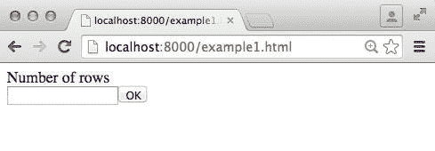
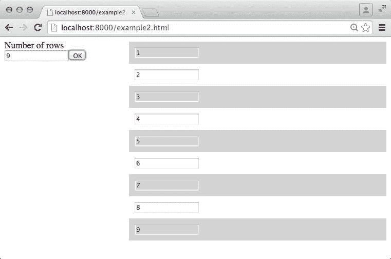

# React：创建可维护、高性能的 UI 组件

> 原文：[`developer.ibm.com/zh/tutorials/wa-react-intro/`](https://developer.ibm.com/zh/tutorials/wa-react-intro/)

JavaScript（受所有现代浏览器支持，而且不可争辩地成为事实上的 Web 原生编程语言）能够直接访问 Web 即平台所提供的所有丰富特性。复杂的 JavaScript 项目逐渐成长到脱离了孤独的编码奇才的领域，朝着相互协作的开发人员的大型团队的方面发展。这种转变带来了一些相关的问题。通过快速编程得到的有效代码无法被其他人理解和维护。新招聘的员工可能需要花很长时间才能跟上复杂系统的发展速度。不断扩大的代码库无法在整个团队中重用。而且莫名其妙的、不稳定的性能异常通常只在活动系统中发生。

走在前列的社交网络比其他人更熟悉这些问题，社交网络必须提供有竞争力但复杂的 Web UI，这些 UI 每天被使用几百万次。2013 年，Facebook/Instagram 将 React 项目（一个 UI 组件构建库）公开为一个开源项目，让人得以了解该公司如何处理这些不断增多的难题。React 及其关联的最佳实践得到了 JavaScript 开发人员的热情拥护; 他们也极富同情心地顺便解决了同样的难题。

本教程将介绍 React，解释它的工作原理，描述规定的最佳实践。在您完成上述操作后，您将能够创建自己的可重用的 React 组件，或者从社区贡献的数百个开源组件组装新组件。

## 使用 React 创建可重用的 UI 组件

> *您声明性地指定 Web UI 组件分层结构，并将它提供给 React 的虚拟 DOM。然后 React 负责在合适的时机同步您的 UI 与浏览器的实际 DOM。*

React 是作为一个 JavaScript 库提供的，其中包含一个 [JSX](http://facebook.github.io/jsx/) 编译器和关联的开发人员工具。React 有助于创建可重用的高性能 UI 视图组件，这些组件可组合在一起，形成现代 Web UI。通过遵循规定的最佳实践，您可以一种可维护、可重用的方式设计这些组件。

为了优化运行时性能，React 组件首先呈现到一个托管的 *虚拟 DOM* 中，如图 1 所示。

##### 图 1\. React 操作


##### 保留模式操作

React 中的虚拟 DOM 在*保留模式* 下运行。您声明性地描述您的 UI 应有的显示外观和行为方式（使用要呈现的组件的 JSX *场景图* 的形式），然后运行时引擎确定显示它的最优方式。保留模式操作有助于执行高性能渲染优化，这在处理 3D 图形的过程中很常见，包括流行的游戏引擎和 WebGL 框架；它还被 Famo.us 等现代应用程序框架采用。

您声明性地指定 Web UI 组件分层结构，并将它提供给 React 的虚拟 DOM。然后 React 负责在合适的时机同步您的 UI 与浏览器的实际 DOM。React 的虚拟 DOM 实现是自成一体的，不依赖于浏览器；它甚至可用于服务器端呈现（参见 参考资料 ）。虚拟 DOM 针对浏览器的 DOM 而对其内部状态执行一次优化的 diff 指令，执行让 UI 保持一致所需的最少更新。

这种保留模式方法（参见 保留模式操作 边栏）绕过了一大类与直接修改浏览器的 DOM 元素（一次一个可视过渡）相关的性能问题（就像在 jQuery UI 等流行的 UI 组件库的操作中一样）。

不同于类似的库，React 不会执行传统的模型-视图-控制器 (MVC) 风格的 UI 构造和状态管理。相反，React 仅关注视图的构造，该项目分享了一些有关为什么 MVC 可能不太适合复杂 Web UI 创建的观点（参见 在复杂现代 UI 中使用 MVC 的误区 边栏）。但是，React 无法阻止 MVC 结构的使用；许多开发人员最初的 React 经验包括将新代码集成到现有的基于 MVC 的大型项目的视图层中。

##### 在复杂现代 UI 中使用 MVC 的误区

尽管传统的一次一个页面的 Web 应用程序可能涉及到每个页面两个 MVC 实例，但具有高度交互式 UI 组件的现代单页应用程序需要创建和维护许多互联 MVC 实例。这些 MVC 以复杂的方式彼此连接：多个控制器可共享同一个模型，或者一个控制器可能在操作期间依赖于其他模型。

现代实例常常表现为内存中数据结构，表示控制器直接或简介共享的易变的应用程序状态。此情形可能给流经 MVC 网络的模型数据（和数据的计算或衍生版本）造成一种无法维护的胡乱嵌套，导致难以在任何时间点确定一个托管数据的单一事实来源。React 团队他能够过一项反模式案例分析，证明难以跟踪通过一个错综复杂的 MVC 网络执行的 “级联更新”。

### 尝试另一种 JavaScript UI 库的动机

React 的一些令人喜爱的特征包括：

*   React 很容易学习；如果您精通 JavaScript，那么您只需半天时间即可开始使用该库。
*   久经考验的最佳实践总结了组件构建知识，使大型 JavaScript 代码库变得可维护、可管理。
*   React 适合大多数加载器和工具集 — AMD、CommonJS 或全局变量；gulp、bower、npm、browserify、webpack、grunt — 迎合现代 JavaScript 开发人员的每个奇思妙想。
*   采用 React 不是一种孤注一掷的行为。该库能很好地兼容大多数现有的代码库（甚至遗留的 MVC 代码库）并与现有的 UI 框架紧密集成（参见 参考资料 ）。
*   React 的设计是异步后端架构的完美搭档，能够适应未来的技术。
*   React 运行时对性能的专注可扩展至其他目标平台，包括（通过 React Native ）iOS 和 Android。

## 通过 JSX 统一声明性的 UI 描述和逻辑

JSX 是一个转换器和编译器，它接受一种扩展的 JavaScript 语法。JSX 可将以下这样经过扩展的、类似 HTML 的表示法转换为：

```
<div>
     <MyLabel  text={TextLabel} />
     <MyTextfield />
     <MyButton textlabel='OK' />
</div> 
```

类似这样的 JavaScript React API 调用：

```
React.createElement("div", null,
     React.createElement(MyLabel, {text: TextLabel}),
     React.createElement(MyTextfield, null),
     React.createElement(MyButton, {textlabel: "OK"})) 
```

##### 在线试验 JSX

可使用 [交互式、在线的 JSX 编译器](http://facebook.github.io/react/jsx-compiler.html) 来进一步了解 JSX。

JSX 令人熟悉的、类似 HTML 的表示法大大简化了 React 组件的编码和维护。这种简化对声明深度嵌套的组件关系尤为明显。

JSX 使您能够将 UI 逻辑与相关的结构描述一起放在单个文件中，这有助于提高生产力并减少大型项目中的错误。对于其他框架，要同步的文件数量多达此方法的 3 倍：模板文件、处理函数 JavaScript 代码文件和结构化 HTML 描述。

### 部署 JSX

JSX 可在浏览器中运行或独立运行。浏览器中的转换器可在开发上提供帮助，因为您在修改 JSX 代码后可立即看到结果。对于生产环境，您一定希望将独立的转换器合并到您的构建工具链中，以便提供实现最佳的性能。

出于简便性，本教程的所有示例使用浏览器内的转换器。第一个示例 (example1) 从 CDN 获得 React 和 JSX 转换器，是实现正常运行的最简单方式（将文件放在 Web 服务器背后并访问它们的 URL）：

```
<html lang="en">
<head>
<script src="http://fb.me/react-0.12.2.js"></script>
<script src="http://fb.me/JSXTransformer-0.12.2.js"></script>
<script type="text/jsx" src="example1.jsx"></script>
</head>
<body> 
```

example2 和 example3 使用 bower 包管理器来安装 React；它们引用本地抓取的浏览器内 JSX 转换器副本。例如，example2.html 通过以下方式抓取两个文件：

```
<script src="bower_components/react/react-with-addons.js"></script>
<script src="bower_components/react/JSXTransformer.js"></script> 
```

在两种情况下，都可以修改 JSX 文件并刷新浏览器来查看结果，以便试验一下 React。

## 创建自定义 React 组件

使用 React 和 example1.jsx 中的代码快速创建一个组件：

```
var MyTextfield = React.createClass({
  render: function() {
    return <input type='text' />;
  }
}); 
```

就这么简单。

这个简单的自定义 React 组件（与其他 React 组件一起显示在图 2 中）呈现一个 *不受控制的* 输入字段，包装一个底层 HTML `<input>` 元素。这个组件现在可用作 `<MyTextfield>` 。您可能注意到，原生 HTML 元素名称是以小写字母开头的，而自定义 React 组件（类）名称是以大写字母开头的。

##### 图 2\. `<MyTextfield>` 、 `<MyLabel>` 和 `<MyButton>` React 组件



### React 组件中的 prop 和 JSX 中的 JavaScript 表达式

example1 中的第二个自定义组件是 `<MyButton>` ：

```
var MyButton = React.createClass({
  render: function() {
    return <button>{this.props.textlabel}</button>;
  }
}); 
```

`<MyButton>` 呈现一个自定义的 HTML `<button>` 元素。此组件演示了传入的特性（在 React 术语中称为 *props* ）。Prop 是组件的传入参数；它们就像 HTML 标签上的属性一样。组件可通过 `this.props` 访问这些属性来自定义它的呈现。JSX 支持通过 `{_JavaScript 表达式 _}` 来对内联 JavaScript 表达式求值，这一支持可用来呈现特性值。

在图 2 中， `<MyButton>` 实例使用其 `textlabel` 特性上的 `OK` 来参数化： `<MyButton textlabel='OK' />` 。

### 组合 React 组件

组合是重用 UI 组件的基石。React 使您能够轻松地组合现有的 React 组件和原生的 HTML 元素，以构建更复杂的组件。

在 example1 中，自定义 React 组件 — `<MyTextfield>` 、 `<MyButton>` 和 `<MyLabel>` — 组合在 UI 中。JSX 让此过程既直观又简单：

```
React.render(
  <div>
    <MyLabel  text={TextLabel} />
     <MyTextfield />
     <MyButton textlabel='OK' />
 </div>,
  document.getElementById('container')
); 
```

前面的 API 调用将组合的组件呈现到虚拟 DOM 中 ID 为 `container` 的 `<div>` — 元素中。

### 函数用作 prop 与 React 的 `SyntheticEvent`

通常，元素上的属性是通过回调函数来参数化的，而不是通过简单的数据类型。例如，您可能拥有设置 HTML `<button>` 元素的 `onClick` 属性的经验。同样的技术也可应用于 React 组件。在第二个示例 example2.jsx 中，自定义 `<MyButton>` React 组件获取一个 `onClick` 处理函数回调作为其特性之一：

```
var MyButton = React.createClass({
  _buttonClicked:  function(e) {
    if (this.props.onClick) {
        this.props.onClick(e)
    }
  },
  render: function() {
    return
     <button onClick={this._buttonClicked}>
             {this.props.textlabel}</button>;
  }
}); 
```

##### React 自动绑定

机敏的读者将会注意到，React 组件中没有对回调函数的 `bind(this)` 的调用。对 `this` 的引用在逻辑上仍能正确运行 <mdash>因为 React 自动将一个组件的每个方法绑定到它的实例。此功能称为*自动绑定*。</mdash>

单击该按钮时，将触发 HTML `<button>` 元素的 `onClick` 事件，React 将这些事件转发给 `<MyButton>` 的 `_buttonClicked()` 实现。

一定要知道， `_buttonClicked()` 不是通过原生浏览器 DOM 事件调用的，而通过 React 自己的跨浏览器、符合 W3C 的 `SyntheticEvent` 对象的实例来调用。 `SyntheticEvent` 在不同浏览器上拥有统一的行为，包装了实际的 DOM 原始事件。（包装的 DOM 事件仍可通过 `nativeEvent` 特性访问；请参见 参考资料 ，获取 `SyntheticEvent` 的更多信息的链接）。

在 `_buttonClicked()` 中，该代码可确保 `<MyButton>` 自己的 `onClick` 特性已设置，然后将 `SyntheticEvent` 转发到该事件处理函数。

### 维护 React 组件中的状态

一些组件需要维护一种在呈现期间使用的内部状态。例如，一个复选框组件需要一种状态来记住它已被选中。

在 example2.jsx 中， `<MyTextfield>` 组件维护一种始终反映了当前输入到该文本字段中的数字值的内部状态（一个名为 `data` 的变量）。为了向一个状态变量提供一个初始值，可实现 `getInitialState()` 。在 `<MyTextfield` > 中， `data` 被初始化为 `1` ：

```
var MyTextfield = React.createClass({
  getInitialState: function() {
     return {
      data: '1'
     };
  },
... 
```

React 组件状态可通过 `this.state` 进行访问。而且始终使用 `this.state.data` 来呈现底层 `<input>` 元素的值：

```
render: function() {
  return <input type='text' onChange={this._entryChanged}
                value={this.state.data} />;
} 
```

此示例是构造 React 组件的典型模式：使用一个组件的状态和 prop 值来呈现或自定义它。

对于这个 `<MyTextfield>` ，底层 `<input>` 元素是 *受控的* ，因为它的值始终由 React 组件呈现（而 example1 中的 `<MyTextfield>` 是 *不受控的* ）。

### 尝试 example2：一个动态表生成器

为了更好地理解 `<MyTextfield>` 和 example2 的工作原理，可以试用该示例。将 example2 文件放在一个 Web 服务器之后并访问 example2.html。图 3 显示了您最初看到的结果。行数设置为 1，因为 `this.state.data` 的初始值为 `1` 。

##### 图 3\. 自定义动态表生成器组件


可在该文本字段中键入 1 到 9 之间的任何值；它不会接受其他任何值。单击 **OK** 按钮时，会在右侧显示的表中生成指定的行数。图 4 显示生成了 9 行。

##### 图 4\. 表生成器显示了 9 行



在该文本字段中输入值时，将触发 `<input>` 的 `onChange` 事件，React 将该事件路由到 `<MyTextfield>` 的 `_entryChanged()` 处理函数：

```
_entryChanged: function(e) {
    var val = e.target.value;
    var validated = '1';
    if (!(isNaN(val) || (parseInt(val) > 9 ) || (parseInt(val) < 1)))     {
      validated = val;
    }
    this.setState({data: validated});
    if (this.props.onChange) {
      this.props.onChange(validated);
    }
  } 
```

`_entryChanged()` 确保输入的值是 1 到 9 之间（包含 1 和 9）的数字。输入的任何在该范围外的值都会设置为 `1` 。 `_entryChanged()` 然后使用 `this.setState()` 更新状态 (`data`)。如果 `data` 设置为一个新值，该文本字段内容将在 React 下次调用 `render()` 时更新。因此， `<MyTextfield>` 的内容始终与 `data` 状态变量同步。

此行为是在 React 组件中经常观察到的另一种模式：事件处理函数修改状态变量，后者进而更改呈现的组件的外观。

一个 `<DynamicList>` React 组件负责依据所提供的 `rows` 特性，呈现表行。表中的每个单元格是一个 `<MyTableCell>` 实例，其中包装了一个已禁用的 `<input>` 元素。

最后但同样重要的是一个 `<ListCreator>` 组件，它组合 `<MyTextfield>` 、 `<MyButton>` 和 `<DynamicList>` 来创建最终的 UI。单击 `<MyButton>` 实例时， `_okClicked()` 处理函数会在 `data` （跟踪 `<MyTextfield>` 中的值）与 `rows` （用于呈现 `<DynamicList>` 中的行）之间复制它的状态值。事件处理函数中的这一状态更新会导致 `<DynamicList>` 重新呈现它显示的行。

### 使用 `shouldComponentUpdate` 和 `PureRenderMixin` 来优化呈现

虚拟 DOM 中的呈现已经很快。但是，避免重新呈现在每次呈现时没有改变的 UI 部分，始终是明智之举。

React 拥有一个名为 `shouldComponentUpdate` 的回调，任何组件都可以实现它。组件可通过返回 `false` 来阻止不必要的呈现 — 只需要知道自上次呈现以来没有发生变化即可。默认情况下，它始终返回 `true` 。

example2 中的 `<ListCreator>` 组件使用一个来自 React 的 `PureRenderMixin` 加载项：

```
var ListCreator = React.createClass({
  mixins: [React.addons.PureRenderMixin],
  ... 
```

这个 mixin 添加了一个 `shouldComponentUpdate` 实现，后者可大体比较以前的所有 prop 和状态值与当前值。如果它未检测到变化，则返回 `false` ; 消除了不必要的呈现。如果一个组件的外观完全依赖于 prop 和状态值，就像 `<ListCreator>` 中一样，mixin 可帮助优化呈现性能。

## 使用第三方的可重用 React 组件

比较活跃的大型 React 社区的一个优势是，有大量容易使用的 React 组件可供使用。在 GitHub 等开源存储库上随意搜索，都会找到数百个可用的组件。

在 example3 中，使用了一个第三方条形图绘制 React 组件 （Mateus Zitelli 创建的 [react-bar-chart](https://github.com/MateusZitelli/react-bar-chart) ）来创建 UI。这个示例显示了一个网站的页面访问统计数据（按年龄组分类）。图 5 显示了该 UI。

##### 图 5\. 一个可更新的条形图组件


可编辑左侧表中的每个单元格（单击该单元格或文本字段），该条形图会通过立即刷新来显示更新的值。

表 1 描述了 example3 中的自定义组件，可用作自行分析 example3 源代码的指南。这些组件在图 5 中具有不同的标签。

##### 表 1\. 可更新条形图示例中的 React 组件

| React 组件 | 描述 | 重要状态/prop |
| --- | --- | --- |
| `<MyTableCell>` | 一个可更新的表单元格。将一个受控的 `<input>` 与一个 `<button>` 组合。在编辑该单元格值时， `<input>` 已禁用， `<button>` 被设置为 `{display: none}` 。 | `editing` ：跟踪一个单元格是否在编辑。 `data` ：始终反映单元格中显示的值。 |
| `<MyTable>` | 一个包含多行的表，每行包含一个 `<MyTableCell>` 实例。 | 无状态。 `data` 是一个 prop、一个 `hash` 数组，包含填充每行的 `text` 和 `value` 。 `onUpdate` 是一个回调 prop，在执行一次编辑会话之后触发，用于转发更改的单元格信息。 |
| `<MyBarChart>` | 一个容器视图。通过第三方 React 组件呈现一个 `<BarChart>` 实例。与 Flux 存储交互，以便在站点状态更改时接收通知。 | `stats` ：一个 `hash` 数组，包含 `text` 和 `value` ；为图表提供数据。 |
| `<MyTableWrapper>` | 一个容器视图。与 Flux 分派器交互，只要表中的一个单元格值被修改，就发送 `sitestats` 更新动作。 | `sitestats` ：一个 `hash` 数组，包含 `text` 和 `value` ；检查表中的当前值。 |
| `<EditableChart>` | 将 `<MyBarChart>` 和 `<MyTable>` 组合到最终的 UI 中。 | 无状态。 `data` 是一个 prop，它提供从 Flux 存储抓取的初始数据，用于显示在组合的组件中。 |

### 访问呈现的元素和物理 DOM

您的大部分代码都仅适用于虚拟 DOM。但是，一些情形需要访问实际的浏览器 DOM。一个示例就是在需要集成现有库时，比如 jQuery Mobile（参见 参考资料 ）和 [D3](http://d3js.org/) ；另一个示例在 `<MyTableCell>` 中的 `_cellClicked()` 处理函数中。单击该单元格之后，该单元格将进入编辑模式，将焦点放在实际的 `<input>` 浏览器 DOM 元素上。您通过一个对 `getDOMNode()` 的延迟调用来完成此任务：

```
setTimeout(function() {
        this.refs.inp.getDOMNode().select();
      }.bind(this), 100); 
```

`refs` 用于访问在虚拟 DOM 中呈现期间创建的元素（类似于浏览器 DOM 中的 `getElementById()` ）。

### 使用 JSX 传播属性来传输特性

在 `<MyTableWrapper>` 中，它的所有 prop 都传输到经过包装的 `<MyTable>` 实例。但是， `onUpdate` prop 值必须被覆盖，并指向它的 `_dataUpdated` 回调。您可以使用 JSX 传播属性表示法来完成此任务：

```
<MyTable {...this.props} onUpdate={this._dataUpdated}/> 
```

### 特性的默认值

在 `<EditableChart>` 中，它的 `sitestats` prop 的初始值从一个 Flux 存储抓取（参见本教程的 Flux：React 应用程序的扩展架构 一节）。使用 `getDefaultProps` 提供这个初始默认值。React 缓存该值以供以后使用：

```
getDefaultProps: function() {
    return {
      // initial default value only - cached by React
      sitestats: MockSiteStatsStore.getSiteStats()
    }
} 
```

### 设置 React 组件的样式

使用常规 CSS 来设置应用程序的样式。例如，example3.css 包含 CSS3 flexbox 代码来设置应用程序的样式：

```
.containing{
    display: -webkit-flex;
    display: flex;
    width: 100%;
    height: 600px;
}

.left-side {
    width: 300px;
    -webkit-flex: none;
    flex: none;
}

.right-side {
    -webkit-flex: 1;
    flex: 1;
} 
```

您可以注意到， `<EditableCell>` 中使用了 `className` prop 来指定 CSS 类（以避免 JSX 关键字冲突）：

```
<div className="containing">
 <div className="left-side">
   <MyTableWrapper data={this.props.sitestats} />
 </div>
 <div className="right-side">
   ...
  </div>
</div> 
```

如果您拥有可随组件的内部状态而改变的样式，您也可以在 JavaScript 中使用内联样式来设置它的样式。 `<MyTableCell>` 包含一个通过内联 JavaScript 来设置样式的原生 `<button>` ：

```
<button onClick={this._okClicked}
  style={this.state.editing? {zIndex: 5}: {display:'none'}}>
    ok</button> 
```

## Flux：React 应用程序的扩展架构

Flux 是一种搭建使用 React 组件的应用程序的方法。它规定了一种单向数据流架构，可消除与复杂 UI 中存在的互联 MVC 网络相关的问题，并改善了代码库的长期可维护性。

简单地讲，组件呈现过程中使用的共享的易变应用程序状态是向上游推送的。 *控制器-视图* （上级拥有者视图 — 比如 example3 中的 `<MyBarChart>` 和 `<MyTableWrapper>` — 管理拥有的子视图要呈现的状态）取代了传统的控制器。传统的模型操作现在的执行方式是，通过一个单独的分派器将 *动作* 路由到相关的 *存储* 。动作是声明要执行的操作和它的关联数据的数据包。（紧密耦合的方法调用由动作转换为松散耦合的数据流。）存储和它们的处理的相互依赖性由分派器以一种松散耦合的方式处理。（设计模式的开发者可能会看到命令和责任链模式的相似性；系统工程师可能会考虑 *编组 (marshaling)* 和 *序列化* 。）

控制器-视图绝不会直接或间接地彼此共享应用程序状态。它们向存储注册其关注的数据更改，存储通知视图在更改发生时抓取数据（并更新其自己的托管状态）。这是进入这些视图的惟一的数据流。图 6 演示了这种单向数据流。

##### 图 6\. Flux 中的单向数据流


example3 代码大体遵循 Flux 的构造模式，只有一个模拟的存储实现。 `<MyBarChart>` 向 `MockSiteStatsStore` 注册来获取任何数据更新。来自存储的通知是更改 `<MyBarChart>` 的托管状态的惟一方式。

在 `<MyTableWrapper>` 中执行的任何交互式的数据更改，都会以动作的形式通过 `MockSiteStatsAction.update()` 调用投入分配器/存储。即使这两个组件并存于同一个 UI 中，它们也不会直接共享状态。单向数据流是从 `<MyTableWrapper>` 流经分派器，再流到相关的 `MockSiteStatsStore` ，然后通过更改通知返回到 `<MyBarChart>` 。

Flux 应用程序构建模式的详细介绍不属于本文的范畴。参见 参考资料 ，了解有关的更多信息。

## 可用于 React 的工具

React Developer Tools 是一个有用的 Chrome 浏览器扩展，可以通过 [Chrome Web 存储](https://chrome.google.com/webstore/category/extensions) 获取。使用 Chrome Devtools 进行调试时，可以查看应用程序的 React 组件分层结构，而不是更加神秘的浏览器 DOM 表示。图 7 显示了安装了 React Developer Tools 的 example3 组件分层结构外观。

##### 图 7\. React Developer Tools 显示了组件分层结构


一个 [profiler](http://facebook.github.io/react/docs/perf.html) 也可用作加载项来检测您的 React 代码。

## 展望 React 生态系统的未来

对 Flux 的 Relay 扩展和 React Native 都于 2015 年 1 月在 React.js Conf 上公开。截至编写本文时，二者都没有开源。

### Relay

Relay 扩展了 Flux，以包含服务器数据抓取功能。Relay 背后的关键理念是，使每个 React 组件能够独立地指定自己的数据抓取需求。通常，这会引用用于呈现组件本身的数据。Relay 将支持在 UI 逻辑所在的同一个 (JSX) 文件内静态地声明组件的数据需求。这显著减少了在处理复杂的完整应用程序时典型的文件杂乱现象。它还允许通过在编辑 JSX 文件后刷新浏览器，在来发期间即时验证正确性和同步。

支撑 Relay 的技术是 GraphQL，这是一种适合任意格式数据的可组合的声明式查询规范语言。（Facebook 在生产环境中使用 GraphQL 已有两年。）GraphQL 使更高级的 React 组件能够组合其自己的组件的需求（无需依赖于需求本身的详细信息），并构建一个可发送给服务器的组合查询。

来自 GraphQL 查询的结果存储到一个 `general common` Flux 存储中，其中会通知注册了兴趣的视图执行更新。

### React Native

React Native 取代了用于 Android 或 iOS 平台的浏览器 DOM。它使得 React 开发人员能够针对移动设备开发其应用程序。

在 React Native 下，JavaScript 代码使用一个原生解释器在自己的系统线程上运行。一个所谓的高性能异步批处理桥将您的 React 代码连接到原生平台 — 编排原生 UI 组件来实现您的 UI。您也可通过此桥公开自定义的 JavaScript 访问原生访问。React 中的 HTML 元素已被移动平台上的原生代码视图和 UI 小部件取代。React Native 将通过一个基于 JavaScript 的 CSS 子集来设置原生组件的样式。

依据开发团队，使用 React Native 创建的应用程序可很好地再现用户仅与原生应用程序关联的细微的 UI 细节 — 基于 WebViews 或 HTML5 的替代方法目前无法得到此水平。

## 结束语

JavaScript 开发人员在为其项目创建 UI 时，可从丰富的开源框架和库中进行选择。但很少有框架和库经受得住注重性能的复杂 UI 项目的考验；拥有复杂的工具支持的框架和库更少；具有成熟的编码和设计最佳实践，以及一种扩展到服务器端数据操作和移动开发的有保障的未来发展路径的框架和库少之又少。React 具有所有这些优势，同时还拥有不断壮大、繁荣的社区的支持。现在是将 React 添加到您的开发工具箱中的绝佳时机。

本文翻译自：[React: Create maintainable, high-performance UI components](https://developer.ibm.com/tutorials/wa-react-intro/)（2015-02-27）