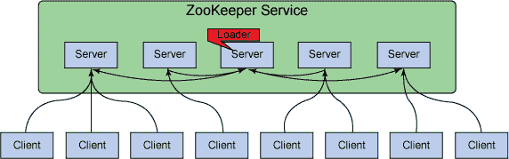
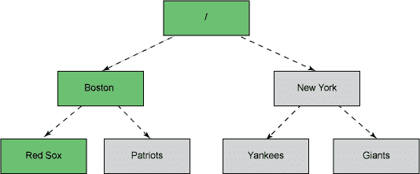

# ZooKeeper 基础知识、部署和应用程序

> 原文：[`developer.ibm.com/zh/tutorials/bd-zookeeper/`](https://developer.ibm.com/zh/tutorials/bd-zookeeper/)

## 简介

让我们首先讨论一下为什么想使用 ZooKeeper。ZooKeeper 是一个面向分布式系统的构建块。当设计一个分布式系统时，一般需要设计和开发一些协调服务：

*   **名称服务** — 名称服务是将一个名称映射到与该名称有关联的一些信息的服务。电话目录是将人的名字映射到其电话号码的一个名称服务。同样，DNS 服务也是一个名称服务，它将一个域名映射到一个 IP 地址。在分布式系统中，您可能想跟踪哪些服务器或服务在运行，并通过名称查看其状态。ZooKeeper 暴露了一个简单的接口来完成此工作。也可以将名称服务扩展到组成员服务，这样就可以获得与正在查找其名称的实体有关联的组的信息。
*   **锁定** — 为了允许在分布式系统中对共享资源进行有序的访问，可能需要实现分布式互斥（distributed mutexes）。ZooKeeper 提供一种简单的方式来实现它们。
*   **同步** — 与互斥同时出现的是同步访问共享资源的需求。无论是实现一个生产者-消费者队列，还是实现一个障碍，ZooKeeper 都提供一个简单的接口来实现该操作。您可以在 Apache ZooKeeper 维基上查看示例，了解如何做到这一点（参阅 参考资料 ）。
*   **配置管理** — 您可以使用 ZooKeeper 集中存储和管理分布式系统的配置。这意味着，所有新加入的节点都将在加入系统后就可以立即使用来自 ZooKeeper 的最新集中式配置。这还允许您通过其中一个 ZooKeeper 客户端更改集中式配置，集中地更改分布式系统的状态。
*   **领导者选举** — 分布式系统可能必须处理节点停机的问题，您可能想实现一个自动故障转移策略。ZooKeeper 通过领导者选举对此提供现成的支持。

虽然可以从头开始设计和实现所有这些服务，但调试任何问题、竞争条件或死锁都需要执行额外的工作，并且很难实现。就像您不会在代码中随处编写自己的随机数发生器或哈希函数一样，这里有一个要求：人们不应该在每次有需要时就到处从头编写自己的名称服务或领导者选举服务。此外，您可以相对容易地一起解决一个非常简单的组成员服务，但是，要编写它们来提供可靠性、复制和可扩展性，可能需要做更多的工作。这导致了 Apache ZooKeeper 的开发和开源，Apache ZooKeeper 是一个针对分布式系统的、开箱即用的、可靠的、可扩展的、高性能的协调服务。

InfoSphere® BigInsights™ Quick Start Edition 是 IBM 的大数据产品，以开源的 Apache Hadoop 项目为基础。它包括 ZooKeeper 和其他大数据技术，以及增加了该平台的价值的 IBM 技术。在本文中，我们只是使用了 ZooKeeper，但是，如欲了解有关 InfoSphere BigInsights 的更多信息，请参阅 参考资料 ，其中包括一个下载产品的链接。

ZooKeeper 虽然是一个针对分布式系统的协调服务，但它本身也是一个分布式应用程序。ZooKeeper 遵循一个简单的客户端-服务器模型，其中 *客户端* 是使用服务的节点（即机器），而 *服务器* 是提供服务的节点。ZooKeeper 服务器的集合形成了一个 ZooKeeper *集合体（ensemble）* 。在任何给定的时间内，一个 ZooKeeper 客户端可连接到一个 ZooKeeper 服务器。每个 ZooKeeper 服务器都可以同时处理大量客户端连接。每个客户端定期发送 ping 到它所连接的 ZooKeeper 服务器，让服务器知道它处于活动和连接状态。被询问的 ZooKeeper 服务器通过 ping 确认进行响应，表示服务器也处于活动状态。如果客户端在指定时间内没有收到服务器的确认，那么客户端会连接到集合体中的另一台服务器，而且客户端会话会被透明地转移到新的 ZooKeeper 服务器。

ZooKeeper 的客户端-服务器架构 描述了 ZooKeeper 的客户端-服务器架构。

##### ZooKeeper 的客户端-服务器架构



ZooKeeper 有一个类似于文件系统的数据模型，由 *znodes* 组成。可以将 znodes（ZooKeeper 数据节点）视为类似 UNIX 的传统系统中的文件，但它们可以有子节点。另一种方式是将它们视为目录，它们可以有与其相关的数据。每个这些目录都被称为一个 znode。 该图表示了两个城市中的运动队的层次结构 显示的图代表与两个城市中的运动队相同的层次结构。

##### 该图表示了两个城市中的运动队的层次结构



znode 层次结构被存储在每个 ZooKeeper 服务器的内存中。这实现了对来自客户端的读取操作的可扩展的快速响应。每个 ZooKeeper 服务器还在磁盘上维护了一个事务日志，记录所有的写入请求。因为 ZooKeeper 服务器在返回一个成功的响应之前必须将事务同步到磁盘，所以事务日志也是 ZooKeeper 中对性能最重要的组成部分。可以存储在 znode 中的数据的默认最大大小为 1 MB。因此，即使 ZooKeeper 的层次结构看起来与文件系统相似，也不应该将它用作一个通用的文件系统。相反，应该只将它用作少量数据的存储机制，以便为分布式应用程序提供可靠性、可用性和协调。

当客户端请求读取特定 znode 的内容时，读取操作是在客户端所连接的服务器上进行的。因此，由于只涉及集合体中的一个服务器，所以读取是快速和可扩展的。然而，为了成功完成写入操作，要求 ZooKeeper 集合体的严格意义上的多数节点都是可用的。在启动 ZooKeeper 服务时，集合体中的某个节点被选举为领导者。当客户端发出一个写入请求时，所连接的服务器会将请求传递给领导者。此领导者对集合体的所有节点发出相同的写入请求。如果严格意义上的多数节点（也被称为 *法定数量（quorum）* ）成功响应该写入请求，那么写入请求被视为已成功完成。然后，一个成功的返回代码会返回给发起写入请求的客户端。如果集合体中的可用节点数量未达到法定数量，那么 ZooKeeper 服务将不起作用。

##### InfoSphere BigInsights Quick Start Edition

ZooKeeper 是 InfoSphere BigInsights（IBM 基于 Hadoop 的产品）中的一个组件。Quick Start Edition 是一个免费的、可下载的 InfoSphere BigInsights 版本。使用 Quick Start Edition，您可以尝试使用 ZooKeeper 和 IBM 开发的特性来提高开源 Hadoop 的价值，比如 Big SQL、文本分析和 BigSheets。引导式学习可让您的体验尽可能地顺畅，包括按部就班、自订进度的教程和视频，可帮助您开始让 Hadoop 为您所用。没有时间或数据限制，您可以自行安排时间，在大量数据上试验。请[学习教程（PDF）](http://www.ibm.com/e-business/linkweb/publications/servlet/pbi.wss?CTY=US&FNC=SRX&PBL=GC19-4104-00) 和 [立刻下载 BigInsights Quick Start Edition](http://www.ibm.com/developerworks/cn/downloads/im/biginsightsquick/)。

法定数量是通过严格意义上的多数节点来表示的。在集合体中，可以包含一个节点，但它不是一个高可用和可靠的系统。如果在集合体中有两个节点，那么这两个节点都必须已经启动并让服务正常运行，因为两个节点中的一个并不是严格意义上的多数。如果在集合体中有三个节点，即使其中一个停机了，您仍然可以获得正常运行的服务（三个中的两个是严格意义上的多数）。出于这个原因，ZooKeeper 的集合体中通常包含奇数数量的节点，因为就容错而言，与三个节点相比，四个节点并不占优势，因为只要有两个节点停机，ZooKeeper 服务就会停止。在有五个节点的集群上，需要三个节点停机才会导致 ZooKeeper 服务停止运作。

现在，我们已经清楚地了解到，节点数量应该是奇数，让我们再来思考一下 ZooKeeper 集合体中需要有多少个节点。读取操作始终从连接到客户端的 ZooKeeper 服务器读取数据，所以它们的性能不会随着集合体中的服务器数量额变化而变化。但是，仅在写入法定数量的节点时，写入操作才是成功的。这意味着，随着在集合体中的节点数量的增加，写入性能会下降，因为必须将写入内容写入到更多的服务器中，并在更多服务器之间进行协调。

ZooKeeper 的美妙之处在于，想运行多少服务器完全由您自己决定。如果想运行一台服务器，从 ZooKeeper 的角度来看是没问题的；只是您的系统不再是高度可靠或高度可用的。三个节点的 ZooKeeper 集合体支持在一个节点故障的情况下不丢失服务，这对于大多数用户而言，这可能是没问题的，也可以说是最常见的部署拓扑。不过，为了安全起见，可以在您的集合体中使用五个节点。五个节点的集合体让您可以拿出一台服务器进行维护或滚动升级，并能够在不中断服务的情况下承受第二台服务器的意外故障。

因此，在 ZooKeeper 集合体中，三、五或七是最典型的节点数量。请记住，ZooKeeper 集合体的大小与分布式系统中的节点大小没有什么关系。分布式系统中的节点将是 ZooKeeper 集合体的客户端，每个 ZooKeeper 服务器都能够以可扩展的方式处理大量客户端。例如，HBase（Hadoop 上的分布式数据库）依赖​​于 ZooKeeper 实现区域服务器的领导者选举和租赁管理。您可以利用一个相对较少（比如说，五个）节点的 ZooKeeper 集合体运行有 50 个节点的大型 HBase 集群。

## 设置并部署 ZooKeeper 集合体

现在让我们设置并部署有三个节点的 ZooKeeper 集合体。在这里，我们将使用撰写本文时的最新版的 ZooKeeper：3.4.5（请参阅 参考资料 获得有关的下载信息）。我们用于此演示的节点被命名为 zkserver1.mybiz.com、zkserver2.mybiz.com 和 zk3server3.mybiz.com。必须在每个节点上遵循下面的步骤来启动 ZooKeeper 服务器：

1.如果尚未安装 JDK，请下载安装它（参阅 参考资料 ）。这是必需的，因为 ZooKeeper 服务器在 JVM 上运行。 2.下载 ZooKeeper 3.4.5\. tar.gz tarball 并将它解压缩到适当的位置。

下载 ZooKeeper tarball 并将它解压缩到适当的位置：

```
 wget
   http://www.bizdirusa.com/mirrors/apache/ZooKeeper/stable/zookeeper3.4.5.
   tar.gz tar xzvf zookeeper3.4.5.tar.gz 
```

3.创建一个目录，用它来存储与 ZooKeeper 服务器有关联的一些状态： `mkdir /var/lib/zookeeper` 。您可能需要将这个目录创建为根目录，并在以后将这个目录的所有者更改为您希望运行 ZooKeeper 服务器的用户。 4.设置配置。创建或编辑 zookeeper3.4.5/conf/zoo.cfg 文件，使其与 设置配置 相似。

设置配置

```
 tickTime=2000
   dataDir=/var/lib/zookeeper clientPort=2181
   initLimit=5 syncLimit=2
   server.1=zkserver1.mybiz.com:2888:3888
   server.2=zkserver2.mybiz.com:2888:3888
   server.3=zkserver3.mybiz.com:2888:3888 
```

值得重点注意的一点是，所有三个机器都应该打开端口 2181、2888 和 3888。在本例中，端口 2181 由 ZooKeeper 客户端使用，用于连接到 ZooKeeper 服务器；端口 2888 由对等 ZooKeeper 服务器使用，用于互相通信；而端口 3888 用于领导者选举。您可以选择自己喜欢的任何端口。通常建议在所有 ZooKeeper 服务器上使用相同的端口。

1.  创建一个 /var/lib/zookeeper/myid 文件。此文件的内容将只包含 zkserver1.mybiz.com 上的数字 1、zkserver2.mybiz.com 上的数字 2 和 zkserver3.mybiz.com 上的数字 3。 cat 输出 显示了来自 zkserver1.mybiz.com 的此文件的 cat 输出。

##### cat 输出

```
 mark@zkserver1.mybiz.com:~# cat
   /var/lib/zookeeper/myid 1 
```

现在，您已经做好了在每台机器上启动 ZooKeeper 服务器的准备。

##### 启动 ZooKeeper 服务器

```
 zookeeper3.4.5/ bin/zkServer.sh
   start 
```

现在，您可以从其中一台正在运行 ZooKeeper 服务器的机器上启动一个 CLI 客户端。

##### 启动 CLI 客户端

```
 zookeeper3.4.5/ bin/zkCli.sh server
   zkserver1.mybiz.com:2181,zkserver2.mybiz.com:2181,zkserver3.mybiz.com:2181 
```

客户端提供一个服务器列表，可以任意选中一个进行连接。如果在连接过程中失去与该服务器的连接，则会选中列表中的另一台服务器，而且客户端会话也会转移到该服务器。一旦启动了客户端，您就可以创建、编辑和删除 znode。让我们在 `/mynode` 创建一个 znode，使用 `helloworld` 作为关联的数据。

##### 在 `/mynode` 上创建一个 znode

```
 [zk:127.0.0.1:2181(CONNECTED) 2] create /mynode
   helloworld Created /mynode 
```

现在，让我们在 `/mynode` 验证和检索数据。

##### 在 `/mynode` 验证和检索数据

```
 [zk:127.0.0.1:2181(CONNECTED) 6] get /mynode
   helloworld cZxid = 0x200000005 ctime = Sat Jul 20
   19:53:52 PDT 2013 mZxid = 0x200000005 mtime = Sat
   Jul 20 19:53:52 PDT 2013 pZxid = 0x200000005
   cversion = 0 dataVersion = 0 aclVersion = 0
   ephemeralOwner = 0x0 dataLength = 11 numChildren =
   0 
```

您会发现，在获取一个 znode 数据时，客户端也返回了一些与 znode 有关的元数据。此元数据中的一些重要字段包括，与创建和最后修改 znode 的时间有关的阶段时间戳（ `ctime` 和 `mtime` ）、每次修改数据都会更改的数据版本（ `dataVersion` ）、数据长度（ `dataLength` ）、这个 znode 的子节点的数量（ `numChildren` ）。我们现在可以删除 znode。

##### 删除 znode

```
 [zk:127.0.0.1:2181(CONNECTED) 7]
   rmr /mynode 
```

让我们在 `/mysecondnode` 创建另一个 znode。

##### 创建另一个 znode

```
 [zk:127.0.0.1:2181(CONNECTED) 10] create
   /mysecondnode hello Created /mysecondnode 
```

现在，让我们在 `/mysecondnode` 验证和检索数据。这一次，我们在最后提供了一个可选参数 `1` 。此参数为 `/mysecondnode` 上的数据设置了一个一次性的触发器（名称为 *watch* ）。如果另一个客户端在 `/mysecondnode` 上修改数据，该客户端将会获得一个异步通知。请注意，该通知只发送一次，除非 watch 被重新设置，否则不会因数据发生改变而再次发送通知。

##### 在 `/mysecondnode` 上验证和检索数据

```
 [zk:127.0.0.1:2181(CONNECTED) 12] get
   /mysecondnode 1 hello cZxid = 0x200000007 ctime =
   Sat Jul 20 19:58:27 PDT 2013 mZxid = 0x200000007
   mtime = Sat Jul 20 19:58:27 PDT 2013 pZxid =
   0x200000007 cversion = 0 dataVersion = 0
   aclVersion = 0 ephemeralOwner = 0x0 dataLength = 5
   numChildren = 0 
```

现在，从不同的客户端（比如，从不同的机器）更改与 `/mysecondnode` 有关联的数据的值。

##### 更改与 `/mysecondnode` 有关联的数据的值

```
 [zk: localhost:2181(CONNECTED)
   1] set /mysecondnode hello2 cZxid = 0x200000007
   ctime = Sat Jul 20 19:58:27 PDT 2013 mZxid =
   0x200000009 mtime = Sat Jul 20 20:02:37 PDT 2013
   pZxid = 0x200000007 cversion = 0 dataVersion = 1
   aclVersion = 0 ephemeralOwner = 0x0 dataLength = 6
   numChildren = 0 
```

您会发现，在第一个客户端上获得了一个 watch 通知。

##### 在第一个客户端上获得了一个 watch 通知

```
 [zk:127.0.0.1:2181(CONNECTED) 13] WATCHER::
   WatchedEvent state:SyncConnected
   type:NodeDataChanged path:/mysecondnode 
```

继续下去，因为 znode 形成了一个分层命名空间，所以您还可以创建子节点。

##### 创建子节点

```
 [zk:
   localhost:2181(CONNECTED) 2] create /mysecondnode/
   subnode 123 Created /mysecondnode/ subnode 
```

您可以获得关于某个 znode 的其他统计元数据。

##### 获得关于某个 znode 的其他统计元数据

```
 [zk:127.0.0.1:2181(CONNECTED)
   14] stat /mysecondnode cZxid = 0x200000007 ctime =
   Sat Jul 20 19:58:27 PDT 2013 mZxid = 0x200000009
   mtime = Sat Jul 20 20:02:37 PDT 2013 pZxid =
   0x20000000a cversion = 1 dataVersion = 1
   aclVersion = 0 ephemeralOwner = 0x0 dataLength = 6
   numChildren = 1 
```

在上面的示例中，我们使用了 ZooKeeper 的 CLI 客户端与 ZooKeeper 服务器进行交互。ZooKeeper 提供了 Java™ 、C、Python 和其他绑定。您可以通过这些绑定调用客户端 API，将 Java、C 或 Python 应用程序转换为 ZooKeeper 客户端。

## ZooKeeper 的应用程序

由于 ZooKeeper 在分布式系统中提供了一些多功能的用例，ZooKeeper 有一组不同的实用应用程序。我们将在这里列出部分这些应用程序。这些应用程序大多取自 Apache ZooKeeper 维基，那里还提供了一个更完整的最新列表。请参阅 参考资料 ，获得这些技术的链接：

*   Apache Hadoop 依靠 ZooKeeper 来实现 Hadoop HDFS NameNode 的自动故障转移，以及 YARN ResourceManager 的高可用性。
*   Apache HBase 是构建于 Hadoop 之上的分布式数据库，它使用 ZooKeeper 来实现区域服务器的主选举、租赁管理以及区域服务器之间的其他通信。
*   Apache Accumulo 是构建于 Apache ZooKeeper（和 Apache Hadoop）之上的另一个排序分布式键/值存储。
*   Apache Solr 使用 ZooKeeper 实现领导者选举和集中式配置。
*   Apache Mesos 是一个集群管理器，提供了分布式应用程序之间高效的资源隔离和共享。Mesos 使用 ZooKeeper 实现了容错的、复制的主选举。
*   Neo4j 是一个分布式图形数据库，它使用 ZooKeeper 写入主选择和读取从协调。
*   Cloudera Search 使用 ZooKeeper（通过 Apache Solr）集成了搜索功能与 Apache Hadoop，以实现集中式配置管理。

## 结束语

实现您自己的协议来协调分布式系统，这可能是一个令人感到沮丧的费时的过程。这正是 ZooKeeper 发挥其作用的地方。ZooKeeper 是一个稳定的、简单的、高性能的协调服务，为您提供编写正确的分布式应用程序所需的工具，而无需担心竞争条件、死锁和不一致。在下一次编写分布式应用程序时，您就可以利用 ZooKeeper 支持所有协调需求。

本文翻译自：[ZooKeeper fundamentals, deployment, and applications](https://developer.ibm.com/tutorials/bd-zookeeper/)（2013-02-28）