# 使用 Swift 和 Objective-C 执行 iOS 内存管理的 7 个简单技巧

> 原文：[`developer.ibm.com/zh/tutorials/mo-ios-memory/`](https://developer.ibm.com/zh/tutorials/mo-ios-memory/)

对任何开发原生 iOS 应用程序的人来讲，管理内容非常重要和必不可少，使用 Apple 的新编程语言 Swift 也是如此。我在 IBM 的移动创新实验室遇到并解决了一些内存问题。

## 首先简单讲讲历史

Objective-C 从未像 Java 等语言那样实现垃圾收集。在开发人员首次开始使用 Objective-C 时，他们必须在一个 Reference Counting 系统中手动管理其内存。从很大程度上讲，这意味着在分配和解除分配对象时添加关键字 `retain` 、 `release` 和 `autorelease` 。

几年前，Apple 在 Xcode 4.2 中发布了 Automatic Reference Counting (ARC)，该功能为开发人员消除了手动执行引用计数的负担。它完成此工作的方式非常简单：执行开发人员管理内存所执行的所有操作。但是，即使有了 ARC，内存问题仍有可能发生，所以我们将分析使用 ARC 时要避免的陷阱，以及在应用程序中调试和查找内存问题的技术。

[您可以到到苹果开发者网站了解有关旧方法的更多信息。](https://developer.apple.com/library/archive/documentation/Cocoa/Conceptual/MemoryMgmt/Articles/mmRules.html#//apple_ref/doc/uid/20000994-BAJHFBGH)

## 常见内存问题

### 保留周期

在我处理的最新的 Objective-C 应用程序中，在我修复的所有内存错误中，修复保留周期问题对内存的改善效果最大。保留周期本质上就是两个对象彼此保留的时间。这违背了对象所有权的标准规则，使得两个对象都没有权利释放对方，导致内存泄漏（这些数字是保留计数）：

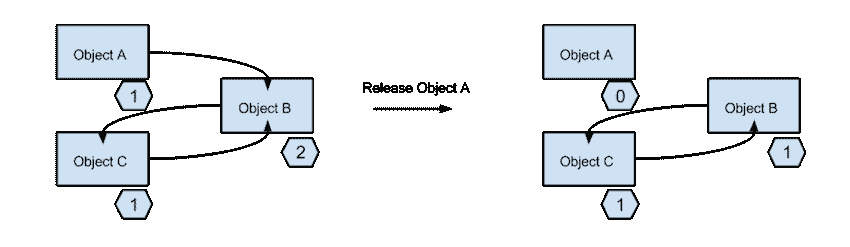

如上图所示，两个对象都拥有对象 B 的引用，所以在对象 A 被释放时，对象 B 仍然存在，因为对象 C 正在引用它，而且现在没有任何途径可释放对象 B 或对象 C。因此，我们看到，ARC 通过保留/释放调用来减少了我们的担忧，但我们仍需要考虑强和弱指针，以及保留周期。保留周期在 Swift 中也可能发生，因为它也在 ARC 上运行。

#### 我的修复方法

我处理的应用程序执行大量图像处理工作。在 iPhone 4S 上，该应用程序在运行我们的 UI 自动化测试 5 分钟后崩溃，因此我的团队知道存在内存问题。我最终遇到了类似以下的情况：

```
@property (nonatomic) id<MyDelegate> delegate; 
```

在我的视图控制器中，我们将试图控制器分配给了这个代理，最初看来这似乎没有问题。然后我发现，没有指定的属性都被隐式设置为强属性。所以此属性持有我的视图控制器的一个强引用，这阻止了它被解除分配，导致内存消耗快速升高。发现此现象后，我很快将此属性设置为弱属性：

```
@property (weak) id<MyDelegate> delegate; 
```

向该属性添加 weak 特性后，该应用程序在 iPhone 4S 上运行了 45 分钟 — 仅通过更改一行代码，性能就提升了 9 倍！

### 不必要的缓存

在我们的应用程序中，我们下载了大量不同图像并缓存它们，这不是缓存的理想用法。缓存最适合存储频繁访问的对象，而我们没有频繁访问这些图像。尽管 NSCache 和其他缓存库在内存不足时应丢弃部分缓存，但开发人员想要更多控制权。

与 Objective-C 一样，缓存问题在 Swift 中也可能发生，因为许多 Apple 框架（Foundation、UIKit、CoreLocation）仍是使用 Objective-C 编写的。但是，作为开发人员，您需要判断使用缓存系统是否有好处，否则它可能导致内存不必要地不断增长。

#### 我的修复方法

我希望更多地控制我们正在处理的应用程序，所以我使用了一个缓存库，它将我们的表视图的照片缓存到该视图被解除分配时；这时我们就清除该缓存。这样，我们的表视图就可以流畅地滚动，但我们不会不必要地在内存中保留图像。

### 不知道 ARC 在 C 语言中做什么

在我们的 Objective-C 应用程序中，不知道 ARC 在做什么并无大碍，但我仍会确保我们在正确地处理 C 代码。ARC 在本质上不适用于 C iOS 库（比如 Core Graphics 和 Core Text）或自编写的 C 代码。在 Core Graphics 中，您需要通过 C 函数调用来自行释放变量：

```
CGImageRef imageRef = CGImageCreateWithImageInRect([self.cropView.imageCGImage], CropRect);
cropped = [UIImage imageWithCGImage:imageRef];
CGImageRelease(imageRef); 
```

我们使用了这段代码来在应用程序执行实际的清理，但您可能注意到，我们创建了一个 Core Graphics 图像引用，然后在完成后很快释放了它。

**Swift 备注：** 这种情况与 Swift 中的工作方式没有直接关系。具体地讲，对于 Core Graphics，开发人员无需手动释放 CGImageRefs；ARC 会在 Swift 中为您完成此工作。但是，并不是 Swift 中的所有 C 库都是这样，所以在做出任何假设之前一定要查阅文档。事实上，Swift 拥有一些不错的新特性和一些语法改动，但它仍与 Objective-C 存在着紧密的联系。

## 如何调试和避免内存问题

### 改写 `dealloc` 方法

改写视图控制器上的 `dealloc` 方法，将有助于确保视图控制器会在您想要的时刻解除分配。它就像下面这个 Objective-C 示例这么简单：

```
-(void)dealloc
{
 NSLog(@"viewcontroller is being deallocated");
} 
```

这项技术帮助我找到了我们应用程序中的保留周期。它表明，某个视图控制器从未被解除分配，但不断在分配它的更多实例，因此引起了严重的内存泄漏。这是我在调试内存问题时遵循的第一条策略。

### 手动创建 autoreleasepool

Apple 关于创建 autoreleasepool 的说明表明，开发人员通常不需要亲自创建它。但是，在某些情况下，亲自创建有助于降低应用程序的峰值内存使用量。autoreleasepool 很有帮助是因为，您无需等待系统释放您创建的对象，您会告诉系统在代码段（或 Swift 中的闭包）结束时释放这些对象。这个示例将有助于解释：

```
for (int i=0; i<5000; i++)
{
 @autoreleasepool {
 NSNumber *num = [NSNumber numberWithInt:i];
 [num performOperationOnNumber];
  }
} 
```

在我们仅处理数字时，内存可能不会太高，但对象会在您迭代循环时不断释放，而不是在循环结束时一起释放。处理像 UIImages 甚至是 base64 NSStrings 这样的对象时，在任何这些对象被释放之前，内存占用可能变得非常高。我在我们的应用程序中使用了一些 autoreleasepool，但是因为我们不会在任何此刻处理大量很占内存的数据，所以我觉得这不会有很大的作用。

**Swift 备注：** 在 Swift 中，内存管理未发生多大变化，但 autoreleasepool 的使用发生了实际变化。在也使用了 Objective-C 的 Swift 项目中进行工作时，您可能需要使用或能够使用 autoreleasepool。如果开发单纯的 Swift 项目，那么绝不需要编写 autoreleasepool 闭包。顺便说一下，autoreleasepool 在 Swift 中的语法是一样的，但在开头没有 @ 符号。

### 隔离可能的问题区域

如果您已开始调试您的代码，并且不确定是什么导致了内 un 问题，隔离您怀疑的代码段会有所帮助。例如，可临时将代码设置为调用一个特定的方法许多次，看看您的内存分配和解除分配情况。在基于导航的应用程序中，使用一个潜在的问题方法不断推送和弹出试图控制器，看看是否您想要释放的所有内容都在每次弹出时释放，这也很有帮助。

在我们应用程序中的某一点，我们不确定是否是一个图像裁剪视图导致应用程序的内存占用攀升，所以我将整个视图控制器隔离在一个新 Xcode 项目中。在 Xcode Instruments 中分析项目后，我没有找到让我相信这个视图控制器存在问题的任何迹象。我在整个调试过程中采用了这一做法，这很有效地表明哪些地方 *不* 存在内存问题，在严谨的调试中为我节省了大量时间。

## 使用 Xcode Instruments 执行调试

最后一条技巧是使用 Xcode Instruments 执行调试。在 Xcode 工具集中检测一个应用程序。该工具集包含调试、测试或优化应用程序可能需要所有工具。在 Instruments 应用程序内，有许多类型的检测工具，比如 Allocations、Leaks、Automation 和 Time Profiler 等等。我将重点介绍 Xcode 6 Instruments 工具中的 Allocations 检测工具。在调试内存问题时，我使用它的次数最多，而且我确定它在现在或未来也可帮助到您。

开始之前，您可通过焦点搜索或直接从 Xcode 打开 Instruments，如下图所示：

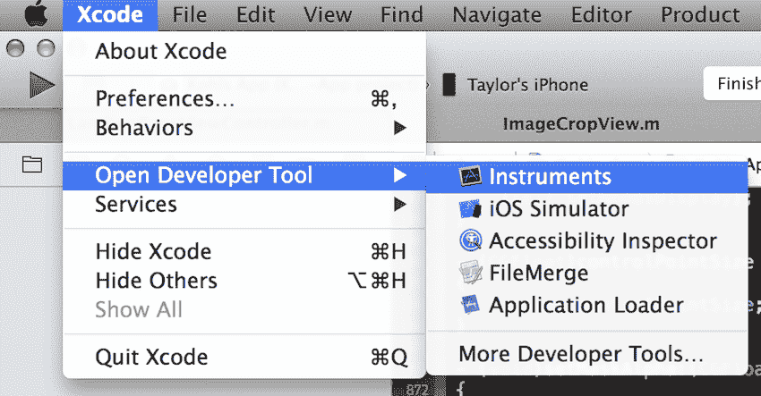

### 第 1 步. 挑选 Allocations 检测工具

1.  选择 **Allocations** 的分析模板：

    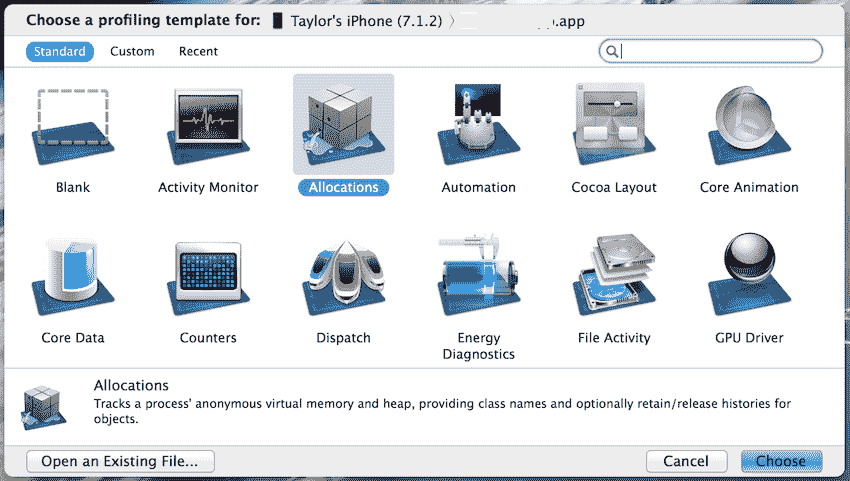

2.  在主要 Instruments 界面上，单击 **VM Tracker** （如果它存在）并按下 Delete 键，因为我们不需要这个特定的检测工具：

    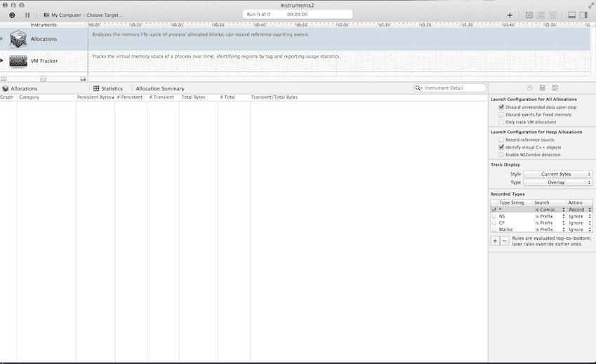

单击右上角的加号，可添加针对不同类型测试的更多检测工具，但本教程不会介绍它们。

### 第 2 步. 设置您的 Instruments 设置

运行任何分析之前，有一些事需要做。首先，需要连接一个安装了您的应用程序的 iOS 设备。它必须是一个物理设备，因为 iOS Simulator 仍是一个模拟器，可能不会准确地表示您应用程序中的内存使用量，或者一个应用程序在内存压力下的执行情况。

要挑选目标，可以单击靠近顶部的 **My Computer** ，将鼠标悬停在您设备上，然后从子菜单中挑选您的应用程序：

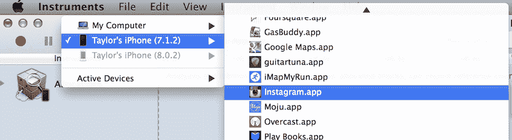

接下来有一个面板，您可在这里修改您想要查看的分配类型的相关设置。除了确保 **Created & Persistent** 气泡已被选中之外，没有其他什么需要提前做的事。

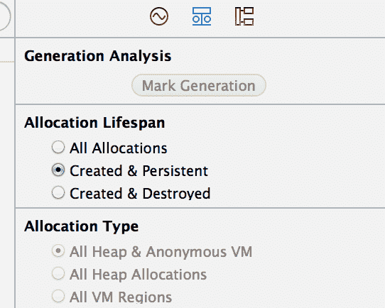

*可选操作：* 我喜欢放大分配视图。可以单击左侧的 **Allocations** 并按下 **Command+** 来放大分配视图。

### 第 3 步. 按下 record 按钮来运行检测工具

按下左上角的 Record 按钮后，您的应用程序将在您设备上启动，Instruments 将开始描绘您的分配情况。这里您只需运行您的应用程序，注意可能出问题的区域，看看分配的内存是否比解除分配的内存更多。这可能意味着做大量重复性工作，但以后您一定会感谢自己这么做了。

您会看到类似下图的信息：

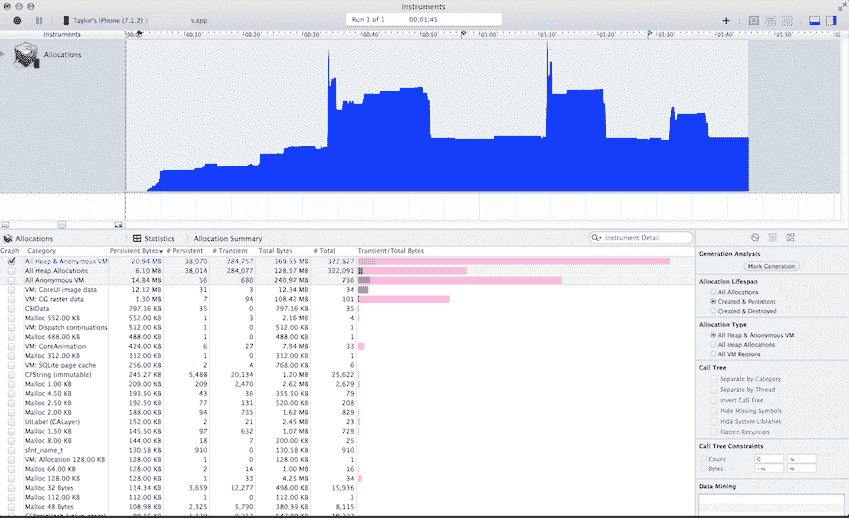

建议运行应用程序一次并到达一个稳定的内存使用点，这样您就有了一个很好的基准，使内存使用的任何增长变得很明显。感觉您拥有足够的数据来执行测试后，按下左上角的 Stop 按钮。

### 第 4 步. 分析

1.  我做的第一件事是，设置我的检查范围，以便度量都的基准线上的持久化字节总数。持久化字节数量位于 allocation summary 下方。

    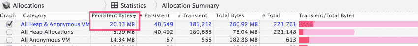

    要实际设置检查范围，可以使用键盘快捷键 **Command <** 设置左侧检查界限，使用 **Command >** 设置右侧检查界限。在我们的应用程序中，我们的基准为大约 20MB。

    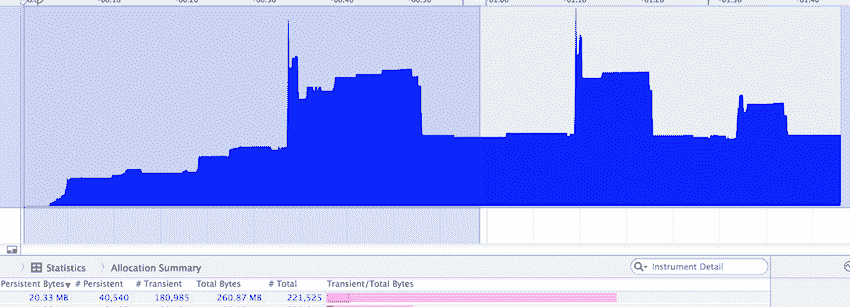

2.  然后，我将右侧检查界限移动到在我再次运行该应用程序后，内存量返回到我们基准上的时刻。在这里，您可看到内存量大体相同。所以，通过执行此操作更多次并看到内存返回到基准上，您可假设不存在重大的内存问题。

    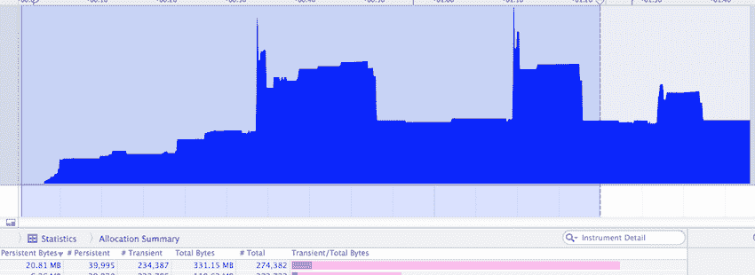

可以通过不同方式分析此数据，这里不再赘述，但您应该知道有一个下拉菜单包含查看和分析您数据的所有方式。

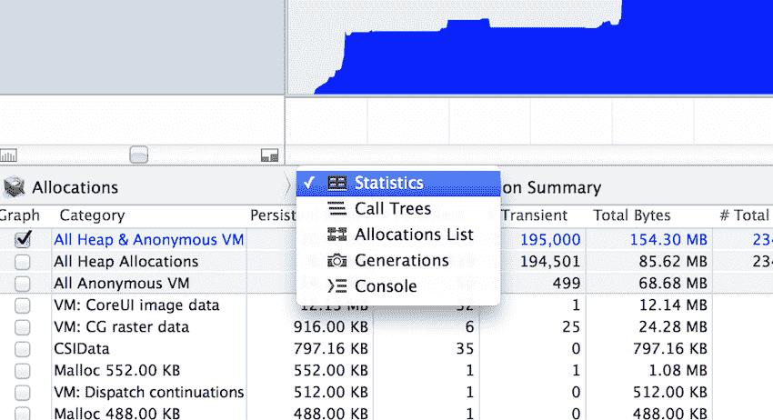

### 第 5 步. 标记时间点

如果不喜欢如此麻烦地处理检查范围，可以使用一个名为 Mark Generation 的特性。Instruments 的右侧面板上有一个调用它的按钮。

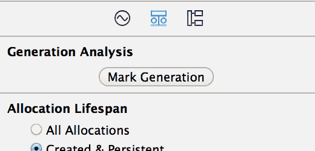

此按钮将基于检查线所在的位置来标记 Instruments 时间线上的点。这么做是为了跟踪自上一个标记以来（或者如果没有其他标记，从一开始到现在）的所有分配情况。可以在运行分配值检测工具时或者在停止运行后标记时间点，像这个示例中一样：

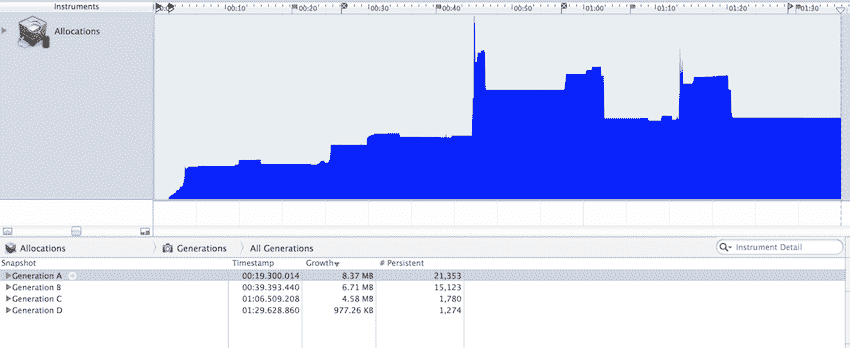

我执行了另一次运行，可以看到，时间线上我标记的每个时间点上显示了很小的红色标记。您还可以在底部看到时间点视图，查看所有数据和不同时间点上的数据变化。这是查看应用程序中我浏览的各个屏幕之间的内存增长情况的快速方式。根据您的具体情况，这可能很有用，但在其他时候，在记录您的会话后手动设置检查范围更容易。

### 第 6 步. 检查堆栈轨迹

要做的最后一件事是查看堆栈轨迹。对于此任务，我们想要设置检查范围来突出显示所有分配值，然后查看统计视图，确保已在右侧面板上选择了 **Created & Persistent** 气泡。在统计视图中，确保持久化数据从高到低排序。这里有许多分配值，而且可能很难了解具体情况如何，因为许多内存都是系统分配的。

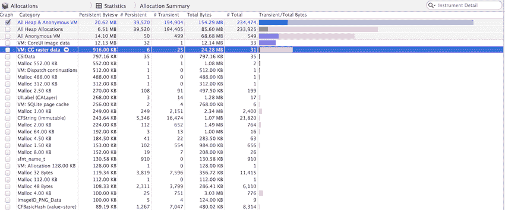

#### 深入分析

*   查看最大的分配值并单击向右的箭头。在许多时候，分配值都在您单击的分配值以下，而且许多值没有意义。

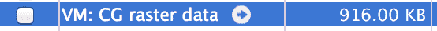

*   单击一个箭头后会突出显示不同的分配制，然后可在右侧面板上继续查看更多细节。最后，您将看到一些加粗文本，将您引导至项目中的设计代码，告诉您问题可能是什么。

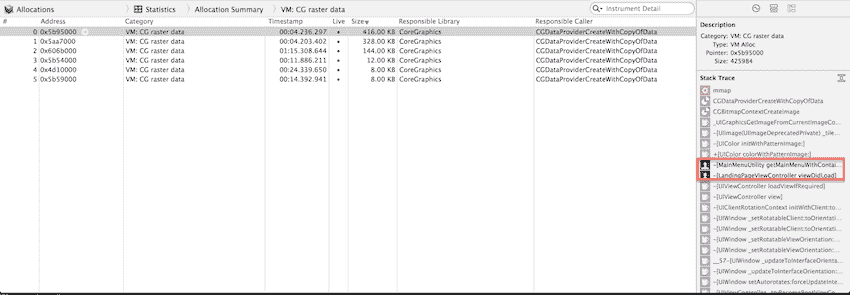

*   如果双击堆栈轨迹中一条加粗的记录，则会调出实际代码（假设您在自己拥有的应用程序上运行分配）。

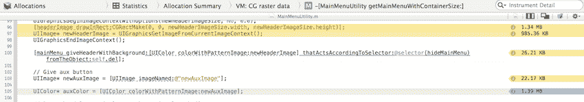

*   这个视图中有许多有用的信息，一个就是右侧最明显的黄色标签，它们显示了每个方法调用占用了多少内存。每个应用程序都是不同的，所以开发人员需要决定突出显示的方法存在问题，可以优化，还是只是您应用程序的一个不可或缺的部分。
*   在我的例子中，这个 UIColor 变量是持久化的，会在整个应用程序中使用，因此在应用程序的整个生命周期中都应接受它。

## 结束语

事情总是在变化，Xcode 更新和像 Swift 这样的发展进步就是例子。只要 iOS 开发过程中没有实现垃圾收集器，您就需要谨慎，避免内存泄漏 — 尤其是在开发过程中，而不是在您的应用程序差不多完成时。我希望本教程中的技巧可帮助您修复许多内存问题，帮助您构建能高效利用内存的应用程序。

本文翻译自：[7 foolproof tips for iOS memory management using Swift and Objective-C](https://developer.ibm.com/tutorials/mo-ios-memory/)（2014-11-07）