# 使用 PHP、jQuery Mobile 和 Google Tasks 创建一个移动友好的待办事项列表应用程序

> 原文：[`developer.ibm.com/zh/tutorials/mo-php-todolist-app/`](https://developer.ibm.com/zh/tutorials/mo-php-todolist-app/)

我习惯于使用 Windows 桌面应用程序跟踪待办事项列表。每次记起一些重要的东西时，我都会打开它，键入一个简短标签，分配一个截止日期，然后保存它。我每次登录到系统中时，该应用程序都会启动，所以我能立刻了解需要注意的事项和完成时间。

这个 Windows 应用程序很好用，但有两个不足之处：在离开计算机后，我不能检查待办事项列表或添加任务。

然后我发现了 Google Tasks。它支持在路途中检查我的任务和添加新任务。

Google Tasks 与 Gmail 集成在了一起（但知道这一点的人并不多），而且它支持在线创建和管理待办事项列表。因为可以通过浏览器访问任务列表，所以您可以很容易添加、查看和关闭任务，甚至在路途中也是如此。

## 构建待办事项列表应用程序需要做的准备工作

*   一个 Apache/PHP 开发环境
*   一个用于测试用途的 Google 帐户
*   [Slim](http://www.slimframework.com/)

    这个 PHP 微型框架将向您的 PHP 代码添加结构。

*   [Google APIs Client Library for PHP](http://code.google.com/p/google-api-php-client/)

    这个库提供了一种健全的 OAuth 实现和包装器对象，简化了对所有 Google API 的访问。

*   [jQuery Mobile](http://jquerymobile.com)

*   [OAuth 2.0 authentication](https://developers.google.com/identity/protocols/OAuth2)

    这个框架能迅速让您应用程序的用户界面投入正常使用，平台和浏览器兼容性问题很少。

## 您将需要知道的事项

像其他许多 Google 产品一样，Google Tasks 公开了一个 [Tasks API](https://developers.google.cn/tasks/reference/rest) ，它允许第三方应用程序连接到它，并围绕它的数据构建自定义应用程序。这个 API（遵循 REST 模型）可通过任何具有 REST 功能的开发工具包进行访问，而且已经拥有针对许多常见编程语言的客户端库，包括我最喜爱的 PHP。

要理解这里给出的 PHP 示例代码，您应当对 PHP 中的类和对象的基本知识有一定的了解，而且习惯使用 REST。您还应当熟悉 HTML、CSS 和 jQuery。

让我们开始吧！

## 配置依赖性库和组件

首先设置 Slim。

如果不熟悉 Slim，它是一个用于快速开发 Web 应用程序和 API 的 PHP 微型框架。不要被它的名称所误导：Slim 包含一个复杂的 URL 路由器，而且支持页面模板、flash 消息、加密 cookie 和中间件。它非常容易理解和使用，而且具有优秀的文档和一个热心开发人员社区。

### 第 1 步. 使用 Slim 和 Google OAuth 库创建应用程序目录

更改到 Web 服务器的文档根目录（通常在 Linux 上为 `/usr/local/apache/htdocs` ，在 Windows 上为 `C:\Program Files\Apache\htdocs` ），然后为应用程序创建一个新的子目录。将此目录命名为 `tasks` 。

```
shell> cd /usr/local/apache/htdocs
shell> mkdir tasks 
```

此目录在本文中被称为 `$APP_ROOT` 。

假设您已经下载了上一节中介绍的 Slim 框架和 Google OAuth 库，并将这些库提取到 `$APP_ROOT/vendor` 中。另外，您已经将 `index.php` 和 `.htaccess` 文件从 Slim 下载压缩文件传输到您的 `$APP_ROOT` 目录，编辑 `index.php` 文件，以便反映 `Slim.php` 文件的正确路径。

您的目录结构现在应类似于：

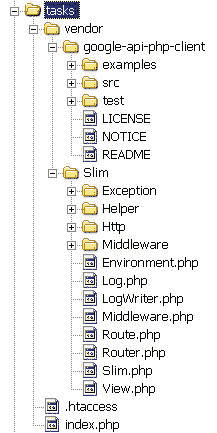

### 第 2 步. 定义一个虚拟主机

为了使得应用程序更易于访问，一个不错的想法是定义一个新虚拟主机并将它设置为工作目录。为此，需要编辑 Apache 配置文件（ `httpd.conf` 或 `httpd-vhosts.conf` ），向其中添加以下行：

```
NameVirtualHost 127.0.0.1
<VirtualHost 127.0.0.1>
    DocumentRoot "/usr/local/apache/htdocs/tasks"
    ServerName tasks.melonfire.com
</VirtualHost> 
```

这些行定义了一个新虚拟主机，该主机的文档根目录对应于 `$APP_ROOT` 。在上面的清单中，此主机的名称为 `tasks.melonfire.com` 。请记住，您需要将此名称更改为 `localhost` 或在您控制之下的另一个域。

重新启动 Web 服务器，以便激活这些新设置。请注意，可能有必要更新您网络的本地 DNS 服务器，让它也知道这个新主机。

完成这些操作之后，在浏览器中打开您的新主机。您会看到 Slim 框架欢迎页面：

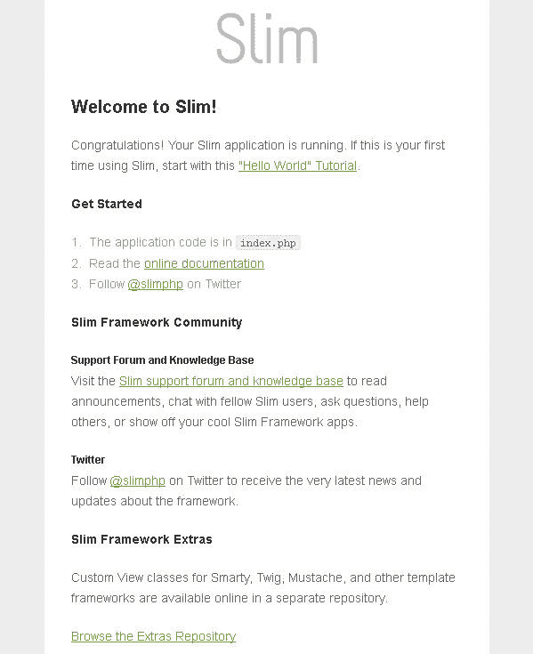

### 第 3 步. 向 Google Apps Platform 注册您的应用程序

使用 Google Tasks API 之前，需要向 Google 注册您的 Web 应用程序。为此，需要使用您的 Google Account 凭据登录到 Google 并访问 [Google Cloud Console](https://cloud.google.com/console) 。创建一个新项目，为它分配一个名称，然后开启对 Google Tasks API 的访问权。您的项目在 Google Cloud Console 看起来应类似于：

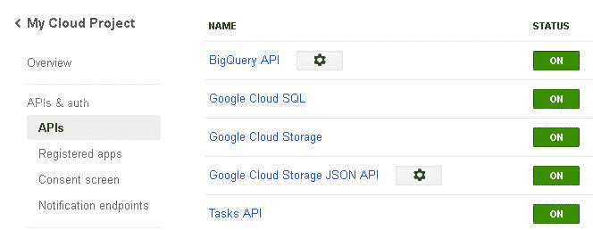

接下来，注册您的 Web 应用程序，以获得 OAuth 2.0 客户端 ID 和密钥。记下这些值，Google PHP OAuth 客户端需要使用它们。

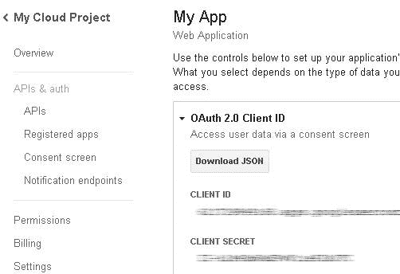

请记住，您还要在这里设置应用程序重定向 URL。在完成 OAuth 身份验证流程后，Google 会将客户端浏览器重定向到这个 URL。在根示例中，此 URL 被设置为 `http://tasks.melonfire.com/login` ：

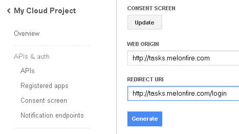

登录后，您还应当访问 Gmail，其中包含一个 [集成的 Google Tasks 界面](https://support.google.com/mail/answer/106237?hl=en) ，向它添加一些示例任务列表和任务。这对检查 PHP 应用程序能否正常工作很有用。Gmail 中的 Google Tasks 界面类似于：

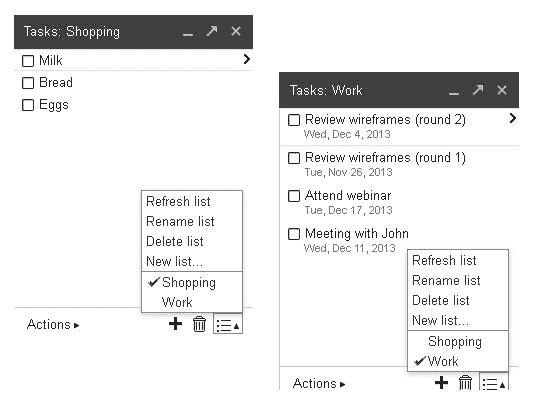

看起来像是要完成许多挂钩，好消息是您只需完成一次即可。

## 了解 Tasks API

Google Tasks API 接受对在资源上执行操作的 REST 请求，使用请求的信息作为响应。 *资源* 只是一个 URL，引用可对其执行操作的对象或实体，比如 `/lists` 或 `/users` 。 *操作* 是 4 个 HTTP “动词” 之一，比如 GET（检索）、POST（创建）、PUT（更新）和 DELETE（删除）。

Google Tasks API 包含两种主要资源：任务和任务列表。用户可拥有多个任务列表，每个列表可拥有多个任务。任务始终存在于任务列表中。Google Tasks API 会将用户创建的第一个任务列表视为他或她的 “默认” 任务列表。

Google Tasks API 使用 JSON 格式编码响应。以下是一个 API 响应示例，它向 `https://www.googleapis.com/tasks/v1/lists/@default/tasks` 发出一个经过验证的 GET 请求，这是检索用户的默认任务列表的 API 端点。

##### Google Tasks API 响应示例

```
{
 "kind": "tasks#tasks",
 "etag": "\"zhaMOBt\"",
 "items": [
  {
   "kind": "tasks#task",
   "id": "MTc3Mz",
   "etag": "\"zhaMOBt\"",
   "title": "Milk",
   "updated": "2013-11-11T07:46:09.000Z",
   "selfLink": "https://www.googleapis.com/tasks/v1/lists/MTc3Mz/tasks/MTc3MzQ1",
   "position": "00000000000637427684",
   "status": "needsAction"
  },
  {
   "kind": "tasks#task",
   "id": "MTc3Mz",
   "etag": "\"zhaMOBt\"",
   "title": "Bread",
   "updated": "2013-11-11T07:46:11.000Z",
   "selfLink": "https://www.googleapis.com/tasks/v1/lists/MTc3Mz/tasks/MTc3MzQ6",
   "position": "00000000000717532232",
   "status": "needsAction"
  },
  {
       ...
  }
 ]
} 
```

如清单 1 所示，Tasks API 生成一个 JSON 编码的响应，其中包含一个任务列表。每个任务条目包含一些有用的元数据，比如任务标题、截止日期、自己的 URL 和状态。现在编码此 JSON 并将它转换为适合在 Web 浏览器中显示的 HTML 表示会非常简单。但是，在大部分时间，您都不会向 Tasks API 发出原始的 GET 和 POST 请求。Google PHP OAuth 客户端和它的服务对象围绕这些请求提供了一个便捷的包装器，将所有相关功能封装到 PHP 对象和方法中。

## 列出任务

清单 2 结合使用了 Google OAuth 库和 Slim 框架来连接、验证任务列表和任务，并显示了它们的摘要。

##### OAuth 身份验证流和任务列表检索

```
<?php
session_start();
require_once 'vendor/Slim/Slim.php';
require_once 'vendor/google-api-php-client/src/Google_Client.php';
require_once 'vendor/google-api-php-client/src/contrib/Google_TasksService.php';

\Slim\Slim::registerAutoloader();
$app = new \Slim\Slim();
$app->config(array(
  'debug' => true,
  'templates.path' => './templates'
));
$client = new Google_Client();
$client->setApplicationName('Project X');
$client->setClientId('YOUR-CLIENT-ID');
$client->setClientSecret('YOUR-CLIENT-SECRET');
$client->setRedirectUri('http://tasks.melonfire.com/login');
$client->setScopes(array(
  'https://www.googleapis.com/auth/tasks'
));
$app->client = $client;
$app->tasksService = new Google_TasksService($app->client);

$app->get('/login', function () use ($app) {

    if (isset($_GET['code'])) {
      $app->client->authenticate();
      $_SESSION['access_token'] = $app->client->getAccessToken();
      $app->redirect('/index');
      exit;
    }

    // if token available in session, set token in client
    if (isset($_SESSION['access_token'])) {
      $app->client->setAccessToken($_SESSION['access_token']);
    }

    if ($app->client->getAccessToken()) {
      if (isset($_SESSION['target'])) {
        $app->redirect($_SESSION['target']);
      } else {
        $app->redirect('/index');
      }
    } else {
      $authUrl = $app->client->createAuthUrl();
      $app->redirect($authUrl);
    }

});

$app->get('/index', 'authenticate', function () use ($app) {
  $lists = $app->tasksService->tasklists->listTasklists();
  foreach ($lists['items'] as $list) {
    $id = $list['id'];
    $tasks[$id] = $app->tasksService->tasks->listTasks($id);
  }
  $app->render('index.php', array('lists' => $lists, 'tasks' => $tasks));
});

$app->get('/logout', function () use ($app) {
  unset($_SESSION['access_token']);
  $app->client->revokeToken();
});

$app->run();

function authenticate () {
  $app = \Slim\Slim::getInstance();
  $_SESSION['target'] = $app->request()->getPathInfo();
  if (isset($_SESSION['access_token'])) {
    $app->client->setAccessToken($_SESSION['access_token']);
  }
  if (!$app->client->getAccessToken()) {
    $app->redirect('/login');
  }
} 
```

清单 2（应保存为 `$APP_ROOT/index.php` ）首先加载 Slim 和 Google OAuth 客户端库，以及 Google Tasks 服务对象。它初始化一个新的 Slim 应用程序对象和一个新的 `Google_Client` 对象。不用说， `Google_Client` 对象必须配置之前在 Google Cloud Console 中定义的相同的客户端 ID、客户端密钥和重定向 URL。还会初始化一个 `Google_TasksService` 服务对象，该对象用作通过 PHP 与 Google Tasks API 交互的主要控制点。

Slim 定义 HTTP 方法和端点的路由器回调。完成方式是调用相应的方法（ `get()` 用于 GET 请求、 `post()` 用于 POST 请求等），并传递 URL 路由，以便匹配为该方法的第一个参数。该方法的第二个参数是一个函数，它指定了在路由与一个传入的请求匹配时应采取的操作。清单 2 设置了 3 个这样的路由器回调： `/index` 、 `/login` 和 `/logout` 。我们将依次看看每个回调：

*   `/login` 回调处理了 OAuth 身份验证流。有关这个流的完整讨论不属于本文的讨论范围，但您可通过 Google API 文档获取有关的详尽细节 。简言之，此回调使用了 `Google_Client` 对象的 `createAuthUrl()` 方法生成 Google 身份验证页面的 URL（参见下图），然后将客户端浏览器重定向到这个 URL。在用户验证应用程序并确认它能够访问的数据后，Google 将客户端重定向回 `/login` URL，此 URL 将会获取一个访问令牌并将该令牌存储在会话中。这个访问令牌为客户端提供了访问 Google Tasks API 的能力。
*   成功的 OAuth 身份验证会将客户端重定向到应用程序的索引页面，位于 `/index` 。此回调使用已配置好的 `Google_TasksService` 对象和它的 `listTasklists()` 方法来获取经过验证的用户的一组任务列。该代码然后迭代这个任务列表集合，对于每个列表，该代码都会调用服务对象的 `listTasks()` 方法来获取该列表中的各个任务。然后将此信息传输给视图，视图负责向用户呈现它。下文将给出视图脚本。
*   `/logout` 方法会销毁会话，进而清空其中存储的访问令牌。为了提高安全性，它还调用了客户端对象的 `revokeToken()` 方法，这也会让 Google 服务器上的令牌失效。

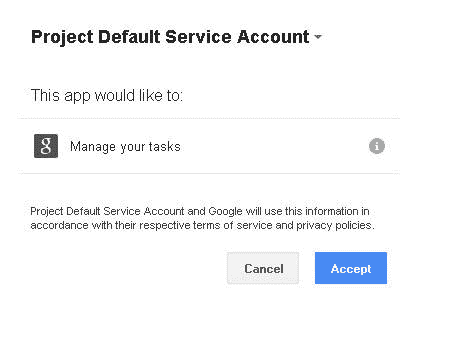

您已经看到， `/index` 回调负责获取用户的任务列表和每个列表的任务。此信息存储在 PHP 变量中，并被传输给视图，后者负责将它格式化为容易阅读的列表。视图脚本应位于 `$APP_ROOT/templates/index.php` ，它应类似于：

##### 索引页面

```
<!DOCTYPE html>
<html>
<head>
  <meta name="viewport" content="width=device-width, initial-scale=1">
  <link rel="stylesheet" href="http://code.jquery.com/mobile/1.3.2/jquery.mobile-1.3.2.min.css" />
  <script src="http://code.jquery.com/jquery-1.9.1.min.js"></script>
  <script src="http://code.jquery.com/mobile/1.3.2/jquery.mobile-1.3.2.min.js"></script>
</head>
<body>
    <div data-role="page">
      <div data-role="header">
      Tasks
      </div>
      <div data-role="content">
      <div data-role="collapsible-set" data-inset="false">
        <?php foreach ($lists['items'] as $list): ?>
          <?php $id = $list['id']; ?>
          <div data-role="collapsible">
            <h2><?php echo $list['title']; ?></h2>
            <ul data-role="listview">
              <?php if (isset($tasks[$id]['items'])): ?>
                <?php foreach ($tasks[$id]['items'] as $task): ?>
                <li>
                  <h3><?php echo $task['title']; ?></h3>
                </li>
                <?php endforeach; ?>
              <?php endif; ?>
            </ul>
          </div>
        <?php endforeach; ?>
        </div>
      </div>
    </div>
</body>
</html> 
```

清单 3 设置了一个依据标准 jQuery Mobile 约定而格式化的列表视图页面。主要页面元素是一个 `<div>` 元素，它有一个 `data-role="page"` 属性。该属性中包含针对页面页眉、页脚和内容的不同 `<div>` 元素。页面内容包含一系列可折叠的 `<div>` 元素，每个元素表示用户的一个任务列表。单击一个列表的标题会展开它的任务。

要查看此功能是如何实现的，您可以在浏览器中访问 `http://tasks.melonfire.com/index` （将该 URL 替换为您自己的虚拟主机的 URL）。您应该看到一个与以下列表类似的任务列表：

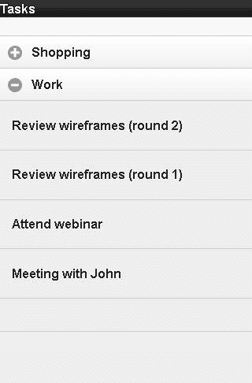

## 创建和删除任务列表

当然，显示任务只是第一步；您还希望用户能够添加新任务和任务列表。那么让我们在 `$APP_ROOT/index.php` 中定义一个新路由：

```
<?php

// ... other routes

$app->get('/add-list', 'authenticate', function () use ($app) {
  $app->render('add-list.php');
}); 
```

借助此路由，对 `/add-list` 的请求将生成一个要向用户呈现的 `$APP_ROOT/templates/add-list.php` 模板。下一个清单显示了此模板的内容。 `authenticate()` 函数是一个自定义函数，在执行路由回调之前执行；查看 OAuth 身份验证流和任务列表检索 ，您会看到它检查了一个访问令牌，如果没有找到该令牌，它会将客户端重定向到登录页面，提示重新登录。

##### 任务列表创建表单

```
<!DOCTYPE html>
<html>
<head>
  <meta name="viewport" content="width=device-width, initial-scale=1">
  <link rel="stylesheet" href="http://code.jquery.com/mobile/1.3.2/jquery.mobile-1.3.2.min.css" />
  <script src="http://code.jquery.com/jquery-1.9.1.min.js"></script>
  <script src="http://code.jquery.com/mobile/1.3.2/jquery.mobile-1.3.2.min.js"></script>
</head>
<body>
    <div data-role="page">
      <div data-role="header">
      Add List
      </div>
      <div data-role="content">
        <div data-role="collapsible-set">
          <form method="post" action="/add-list">
            <label for="title">Title:</label>
            <input name="title" id="title" data-clear-btn="true" type="text"/>
            <input name="submit" value="Save" type="submit"
              data-icon="check" data-inline="true" data-theme="a" />
            <a href="/index" data-role="button" data-inline="true"
              data-icon="back" data-theme="a">Back</a>
          </form>
      </div>
    </div>
</body>
</html> 
```

清单 4 包含一个表单，其中只有一个字段，表示新任务列表的标题。提交时，表单数据将 POST 回 `/add-list` 路由，后者现在需要扩展来处理表单输入。以下是额外的代码：

##### 任务列表创建

```
<?php

// ... other routes

$app->post('/add-list', 'authenticate', function () use ($app) {
  if (isset($_POST['submit'])) {
    $title = trim(htmlentities($_POST['title']));
    if (empty($title)) {
      $title = 'Untitled List';
    }
    $tasklist = new Google_TaskList();
    $tasklist->setTitle($title);
    $result = $app->tasksService->tasklists->insert($tasklist);
    $app->redirect('/index');
  }
}); 
```

清单 5 清除了通过表单提交的标题，然后创建一个新的 `Google_TaskList` 对象。此对象表示 Google Tasks API 中的一个任务列表资源。该对象的 `setTitle()` 方法用于分配一个标题，然后，该服务对象的 `insert()` 方法将新任务列表保存到 Google Tasks 中。

以下是这个表单，以及提交它的结果：

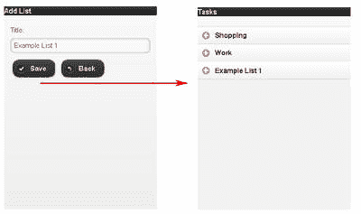

如果现在检查 Gmail 中的 Google Tasks 界面，您也应该在这里看到新添加的任务列表。您可亲自尝试！

如果已允许用户添加列表，那么您还需要为他们提供一种删除列表的方式。服务对象的 `insert()` 方法的反向方法是 `delete()` 方法，它接受一个任务列表标识符并从 Google Tasks 删除相应的列表。以下是路由定义：

##### 任务列表删除

```
<?php

// ... other routes

$app->get('/delete-list/:lid', 'authenticate', function ($lid) use ($app) {
  $app->tasksService->tasklists->delete($lid);
  $app->redirect('/index');
}); 
```

清单 6 设置一个新路由 `/delete-list` ，它接受一个列表标识符，使用该标识符作为请求 URL 的一部分。Slim 的路由框架随后会解析这个请求 URL，提取列表标识符，使用服务对象的 `delete()` 方法从 Google Tasks 删除相应的列表。

现在所剩只有更新索引页面列清单，增添添加和删除列表的按钮。以下是修订的索引页面的代码：

##### 索引页面

```
<!DOCTYPE html>
<html>
<head>
  <meta name="viewport" content="width=device-width, initial-scale=1">
  <link rel="stylesheet" href="http://code.jquery.com/mobile/1.3.2/jquery.mobile-1.3.2.min.css" />
  <script src="http://code.jquery.com/jquery-1.9.1.min.js"></script>
  <script src="http://code.jquery.com/mobile/1.3.2/jquery.mobile-1.3.2.min.js"></script>
</head>
<body>
    <div data-role="page">
      <div data-role="header">
      Tasks
      </div>
      <div data-role="content">
      <div data-role="collapsible-set" data-inset="false">
        <?php foreach ($lists['items'] as $list): ?>
          <?php $id = $list['id']; ?>
          <div data-role="collapsible">
            <h2><?php echo $list['title']; ?></h2>
            <ul data-role="listview">
              <?php if (isset($tasks[$id]['items'])): ?>
                <?php foreach ($tasks[$id]['items'] as $task): ?>
                <li>
                  <?php if ($task['status'] == 'needsAction'): ?>
                  <h3><?php echo $task['title']; ?></h3>
                  <?php else: ?>
                  <h3 style="text-decoration:line-through"
                    ><?php echo $task['title']; ?></h3>
                  <?php endif; ?>
                  <?php if (isset($task['due']) &&
                    ($task['status'] == 'needsAction')): ?>
                  <p>Due on <?php echo date('d M Y',
                    strtotime($task['due'])); ?></p>
                  <?php endif; ?>
                  <?php if (isset($task['completed'])
                    && ($task['status'] == 'completed')): ?>
                  <p>Completed on <?php echo
                    date('d M Y', strtotime($task['completed'])); ?></p>
                  <?php endif; ?>
                </li>
                <?php endforeach; ?>
              <?php endif; ?>
            </ul>
            <a href="/delete-list/<?php echo $id; ?>"
              data-inline="true" data-role="button" data-icon="delete"
              data-theme="a">Remove list</a>
          </div>
        <?php endforeach; ?>
        </div>
      </div>
      <a href="/add-list" data-inline="true" data-role="button"
        data-icon="plus" data-theme="b">Add new list</a>
    </div>
</body>
</html> 
```

除了添加和删除列表的新按钮之外，这个视图脚本版本还添加了一些额外的增强。此时我们显示了任务的截止日期，已完成的任务有一条划过它们的删除线，而仍为完成的任务 (`status="needsAction"`) 则没有删除线。以下是该页面的显示效果。

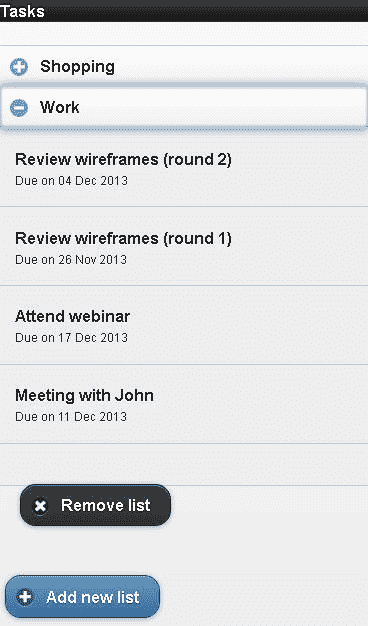

## 创建和删除任务

就像可以添加和删除任务列表一样，也可在列表中添加和删除任务。以下是用于此用途的新 `/add-item` 和 `/delete-item` 路由：

##### 任务添加和删除

```
<?php

// ... other routes

$app->get('/add-task/:tid', 'authenticate', function ($tid) use ($app) {
  $app->render('add-task.php', array('id' => $tid));
});

$app->post('/add-task', 'authenticate', function () use ($app) {
  if (isset($_POST['submit'])) {
    $title = trim(htmlentities($_POST['title']));
    $due = trim(htmlentities($_POST['due']));
    $id = trim(htmlentities($_POST['id']));
    if (empty($title)) {
      $title = 'Untitled Task';
    }
    if (empty($due)) {
      $due = 'tomorrow';
    }
    $task = new Google_Task();
    $task->setTitle($title);
    $task->setDue(date(DATE_RFC3339, strtotime($due)));
    $result = $app->tasksService->tasks->insert($id, $task);
    $app->redirect('/index');
  }
});

$app->get('/delete-task/:lid/:tid', 'authenticate', function ($lid, $tid) use ($app) {
  $app->tasksService->tasks->delete($lid, $tid);
  $app->redirect('/index');
}); 
```

每个任务都必须与一个任务列表相关联，所以 `/add-task` 路由回调被设置为接收一个任务列表标识符作为 GET 请求参数。然后，它会呈现 `$APP_ROOT/templates/add-task.php` 模板，其中包含一个添加新任务的表单，该模板如此清单中所述：

##### 任务创建表单

```
<!DOCTYPE html>
<html>
<head>
  <meta name="viewport" content="width=device-width, initial-scale=1">
  <link rel="stylesheet" href="http://code.jquery.com/mobile/1.3.2/
    jquery.mobile-1.3.2.min.css" />
  <link rel="stylesheet" type="text/css" href="http://dev.jtsage.com/cdn/
    datebox/latest/jqm-datebox.min.css" />
  <script src="http://code.jquery.com/jquery-1.9.1.min.js"></script>
  <script src="http://code.jquery.com/mobile/1.3.2/jquery.mobile-1.3.2.min.js"></script>
  <script src="http://dev.jtsage.com/cdn/datebox/latest/jqm-datebox.core.min.js"></script>
  <script src="http://dev.jtsage.com/cdn/datebox/latest/jqm-datebox.mode.calbox.min.js"></script>
  <script src="http://dev.jtsage.com/cdn/datebox/i18n/jquery.mobile.datebox.i18n.en_US.utf8.js"></script>
</head>
<body>
    <div data-role="page">
      <div data-role="header">
      Add Task
      </div>
      <div data-role="content">
        <div data-role="collapsible-set">
          <form method="post" action="/add-task">
            <input name="id" type="hidden" value="<?php echo $id; ?>" />
            <label for="title">Title:</label>
            <input name="title" id="title" data-clear-btn="true" type="text"/>
            <label for="due">Due:</label>
            <input name="due" id="due" type="date" data-role="datebox"
              data-options='{"mode": "calbox", "useFocus": true,
              "themeDateToday": "e"}' />
            <input name="submit" value="Save" type="submit"
              data-icon="check" data-inline="true" data-theme="a" />
            <a href="/index" data-role="button" data-inline="true"
              data-icon="back" data-theme="a">Back</a>
          </form>
      </div>
    </div>
</body>
</html> 
```

清单 9 包含一个具有两个可见字段的表单，一个字段用于任务标题，另一个字段用于任务截止日期。为了简化日期输入，日期输入字段被配置为使用 jQuery Mobile DateBox 插件，该插件显示一个图形化的日期选取器，以便通过单击来输入日期 。因为任务必须与一个任务列表有关联，所以作为 GET 参数而收到的任务列表标识符也在表单中被指定为一个隐藏字段。

提交表单后，输入其中的数据就会被清除，并用于初始化一个 `Google_Task` 对象。然后这个对象与隐藏的任务列表标识符一起传递给服务对象的 `insert()` 方法，该方法负责通过 GEST 调用将它添加到 Google Tasks 系统中。最后，像 `/add-task` 回调一样， `/delete-task` 路由回调被配置为同时接收任务列表标识符和任务标识符。然后，它使用服务对象的 `delete()` 方法来从指定的任务列表中删除指定的任务。

在设置了路由和业务登录后，剩下的任务就是更新索引页面、添加任务添加和删除按钮。因为我很快就会介绍如何更新任务的状态，所以现在正好为此功能添加一个按钮。以下是修订后的模板：

##### 索引页面

```
<!DOCTYPE html>
<html>
<head>
  <meta name="viewport" content="width=device-width, initial-scale=1">
  <link rel="stylesheet" href="http://code.jquery.com/mobile/1.3.2/
    jquery.mobile-1.3.2.min.css" />
  <link rel="stylesheet" type="text/css"
    href="http://dev.jtsage.com/cdn/datebox/latest/jqm-datebox.min.css" />
  <script src="http://code.jquery.com/jquery-1.9.1.min.js"></script>
  <script src="http://code.jquery.com/mobile/1.3.2/jquery.mobile-1.3.2.min.js"></script>
  <script src="http://dev.jtsage.com/cdn/datebox/latest/jqm-datebox.core.min.js"></script>
  <script src="http://dev.jtsage.com/cdn/datebox/latest/jqm-datebox.mode.calbox.min.js"></script>
  <script src="http://dev.jtsage.com/cdn/datebox/i18n/jquery.mobile.datebox.i18n.en_US.utf8.js"></script>
</head>
<body>
    <div data-role="page">
      <div data-role="header">
      Tasks
      </div>
      <div data-role="content">
      <div data-role="collapsible-set" data-inset="false">
        <?php foreach ($lists['items'] as $list): ?>
          <?php $id = $list['id']; ?>
          <div data-role="collapsible">
            <h2><?php echo $list['title']; ?></h2>
            <ul data-role="listview">
              <?php if (isset($tasks[$id]['items'])): ?>
                <?php foreach ($tasks[$id]['items'] as $task): ?>
                <li>
                  <div class="ui-grid-b">
                    <div class="ui-block-a">
                      <?php if ($task['status'] == 'needsAction'): ?>
                      <h3><?php echo $task['title']; ?></h3>
                      <?php else: ?>
                      <h3 style="text-decoration:line-through">
                        <?php echo $task['title']; ?></h3>
                      <?php endif; ?>
                      <?php if (isset($task['due']) &&
                        ($task['status'] == 'needsAction')): ?>
                      <p>Due on <?php echo date('d M Y',
                        strtotime($task['due'])); ?></p>
                      <?php endif; ?>
                      <?php if (isset($task['completed']) &&
                        ($task['status'] == 'completed')): ?>
                      <p>Completed on <?php echo
                        date('d M Y', strtotime($task['completed'])); ?></p>
                      <?php endif; ?>
                    </div>
                    <div class="ui-block-b"></div>
                    <div class="ui-block-c">
                      <?php if ($task['status'] == 'needsAction'): ?>
                      <a href="/update-task/<?php echo $id; ?>/
                        <?php echo $task['id']; ?>" data-inline="true"
                        data-role="button" data-icon="check"
                        data-theme="a">Done!</a>
                      <?php endif; ?>
                      <a href="/delete-task/
                        <?php echo $id; ?>/<?php echo $task['id']; ?>"
                        data-inline="true" data-role="button" data-icon="delete"
                        data-theme="a">Remove task</a>
                    </div>
                  </div>
                </li>
                <?php endforeach; ?>
              <?php endif; ?>
            </ul> <br/>
            <a href="/add-task/<?php echo $id; ?>"
              data-inline="true" data-role="button" data-icon="plus"
              data-theme="a">Add new task</a>
            <a href="/delete-list/<?php echo $id; ?>"
              data-inline="true" data-role="button" data-icon="delete"
              data-theme="a">Remove list</a>
          </div>
        <?php endforeach; ?>
        </div>
        <a href="/add-list" data-inline="true" data-role="button"
          data-icon="plus" data-theme="b">Add new list</a>
      </div>
    </div>
</body>
</html> 
```

如清单 10 所示，每个任务列表的标记都已更新，将每个列表转换为一个两列网格。左侧列包含任务标题和截止日期。右侧列包含可为该任务执行的操作，比如更新它还是删除它。最后还有一个新按钮，该按钮支持使用新任务更新此列表。

向任务列表添加新任务的过程类似于：

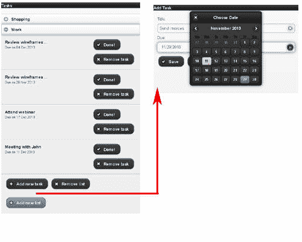

## 更新任务状态

所以，您的应用程序现在支持添加和删除任务和任务列表。您需要添加的最后一项功能是将任务标记为已完成。 任务创建表单 已包含此功能的按钮，它被链接到 `/update-task` 路由。清单 11 完成了最后的工作，指定了此路由的业务逻辑。

##### 任务更新

```
<?php

// ... other routes

$app->get('/update-task/:lid/:tid', 'authenticate',
  function ($lid, $tid) use ($app) {
    $task = new Google_Task($app->tasksService->tasks->get($lid, $tid));
    $task->setStatus('completed');
    $result = $app->tasksService->tasks->update($lid, $task->getId(), $task);
    $app->redirect('/index');
}); 
```

`/update-task` 路由回调同时接收列表和任务标识符，使用此信息从 Google Tasks API 获取任务信息。然后，使用此信息来填充一个新的 `Google_Tasks` 对象，该对象的 `setStatus()` 方法用于将任务的状态更改为 “completed”。服务对象的 `update()` 方法用于将新任务条目推送到 Google 的服务器。

将任务标记为已完成的过程类似于下图。

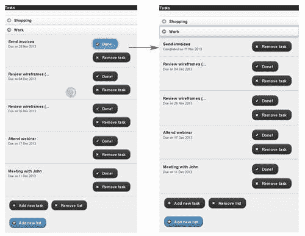

## 结束语

大功告成！您参加了一堂速成课，了解了如何结合使用 jQuery Mobile、Google PHP OAuth 库和 Slim PHP 微型框架，将来自 Google Tasks API 的数据与 PHP 应用程序相集成。本文中的示例介绍了 Google Tasks JSON 格式，展示了如何获取任务列表；添加、修改和删除任务；以及为用户的 Google Account 中的任务列表构建一个自定义界面。

正如这些示例所演示的，在您希望构建新的富有创意的任务管理应用程序时，Google Tasks API 是一个强大且又灵活的工具。使用它一段时间，看看您能想到什么！

本文翻译自：[Create a mobile-friendly to-do list app with PHP, jQuery Mobile, and Google Tasks](https://developer.ibm.com/tutorials/mo-php-todolist-app/)（2014-11-10）