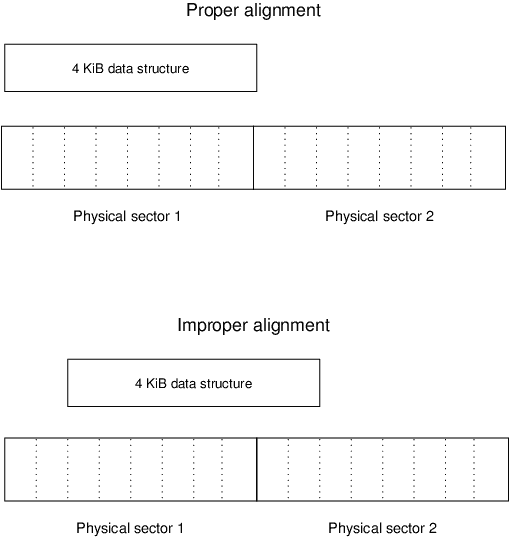
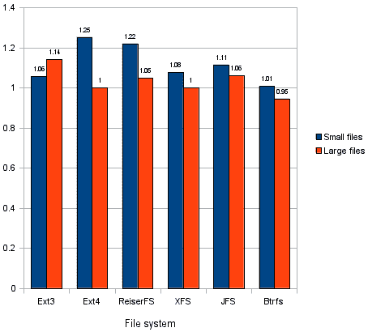
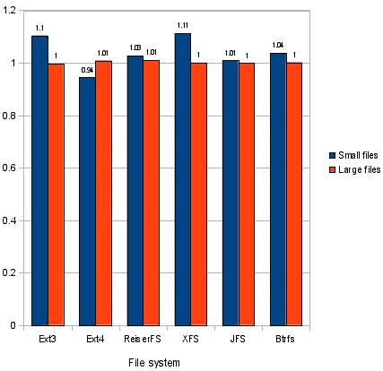
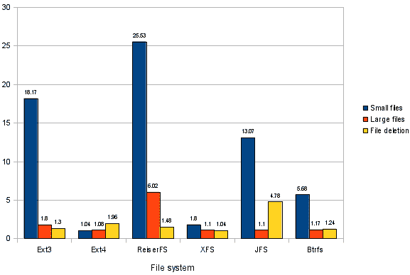
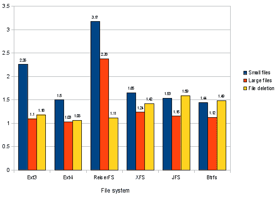
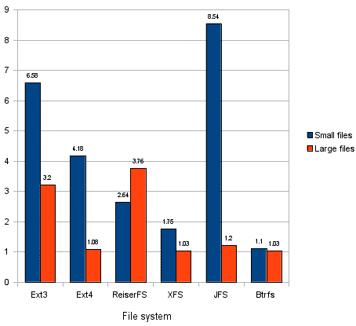
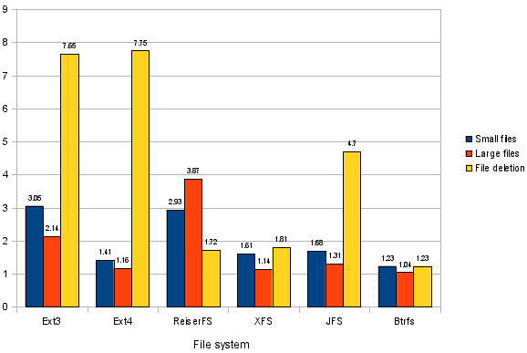
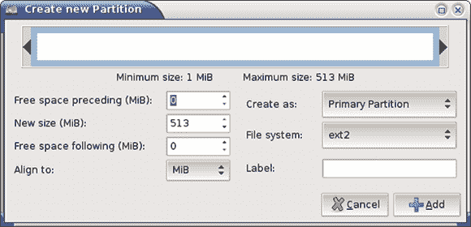

# 4 KB 扇区磁盘上的 Linux：实用性建议

> 原文：[`developer.ibm.com/zh/tutorials/l-linux-on-4kb-sector-disks/`](https://developer.ibm.com/zh/tutorials/l-linux-on-4kb-sector-disks/)

如果您熟悉磁盘结构，就会知道磁盘被分解成了多个 **扇区** ，这些扇区的大小通常为 512 字节；所有读写操作均在成倍扇区大小的空间内进行。如果仔细观察您就会发现，硬盘的各个扇区之间还包含额外的数据。磁盘使用这些额外字节的数据来检测和纠正每个扇区内的错误。

当扇区大小从 512 字节增加为更大的值时，就可以使用更有效的、功能更强大的纠错算法。因此，更改为较大大小的扇区可获得两个实际的好处：增加可靠性和扩大磁盘容量，至少从理论上将是这样的。

高级格式化磁盘将每个 4,096 字节的 **物理** 扇区转变成 8 个 512 字节的 **逻辑** 扇区。对于固件、操作系统和所有磁盘实用程序，磁盘看起像是 512 字节的扇区，但实际上，基础的物理扇区大小是 4,096 字节。然而，改变固件中表面的扇区大小会导致性能下降。要想了解其中的原因，则需要了解文件系统数据结构方面的知识，以及如何将分区放置在硬盘上。

## 文件系统数据结构为何会影响性能

当今的文件系统使用的是 4,096 字节或更大的数据结构。因此，大部分磁盘 I/O 操作使用了此数量的成倍大小的扇区。试想一下，如果 Linux 想在一个拥有 4,096 字节扇区的新磁盘上读写这些数据结构中的某一个，将会出现什么情况。如果文件系统数据结构恰好与基础物理扇区大小完全一致，那么读写 4,096 字节的数据结构就会产生单一扇区的读写。硬盘的固件不需要采取任何特别措施，但是，如果文件系统数据结构与基础物理扇区不完全一致，那么读写操作必须访问两个物理扇区。下图显示了这种差异：

##### 磁盘数据结构可以跨越高级格式化磁盘上的物理扇区



从理论上讲，读操作受到未对齐的影响小于写操作受到的影响。在执行磁盘读取操作时，磁盘的读/写磁头很可能忽略一个接着一个的扇区，因此固件返回 4 KiB 数据结构的任务就比较简单。相比之下，未对齐的数据结构的写操作要求磁盘的固件读取两个扇区，修改两个扇区的部分，然后写入两个扇区。这项操作花费的时间多于 4,096 字节数据占用单个扇区的时间。因此，会导致性能下降。实际上，读操作受到的影响有时与写操作受到的影响一样严重。

如何才能知道数据结构是否恰好对齐？大多数文件系统将其数据结构与包含数据结构的分区的开始部分对齐。因此，如果分区开始时是 4,096 字节（8 个扇区）的边界，则能恰好对齐。不过，在大约 2010 年以前，Linux 分区工具并不是采用这种方式来创建对齐的分区。即使在今天，这种方式仍然存在一些缺陷，因此创建分区时一定要小心谨慎。（要想了解如何使用常见的 Linux 分区软件完成这项工作，请转到下一小节， 对齐分区 。）

### 测试参数

为了了解正确对齐究竟有多重要，我在三台计算机上使用了三个高级格式化磁盘来执行测试：

*   一个 1TB 的西部数据 WD-10EARS 高级格式化驱动器 — 在使用了一个 NVIDIA MCP61P 芯片组和一个 64 位 2.6.32.3 内核的计算机上首批引入（2009 年末）的高级格式化磁盘之一。测试结果发布在本文的第一版中（2010 年出版）。
*   一个 2TB 的希捷 ST2000L003 驱动器，于 2012 年购买，该驱动器位于具有较新的 AMD 760G/SB710 芯片组和一个 64 位 3.4.1 内核的计算机上。
*   一个 3TB 的东芝 DT01ACA300 驱动器，于 2013 年末购买，该驱动器位于具有一个 Intel® H77 芯片组和一个 64 位 3.11.7 内核的计算机上。

在三个测试中，我都使用了全局惟一标识符 (GUID) 分区表 (GPT) 系统对磁盘进行分区，对齐的分区从逻辑扇区 40 开始，未对齐的分区从逻辑扇区 34（在使用具有默认分区表大小的 GPT 磁盘时，该扇区是第一个可用的扇区） 开始。被测试的文件系统是第三扩展文件系统 (ext3)、第四扩展文件系统 (ext4)、ReiserFS (V3)、日志文件系统 (JFS)、扩展文件系统 (XFS) 和 B-tree 文件系统 (Btrfs)。

在所有测试中，一个脚本执行了一系列的磁盘 I/O 操作，包括创建新的文件系统，将未压缩的 Linux 内核原始码 (tarball) 提取到测试驱动器中，将原始码复制到驱动器，读取测试驱动器上未压缩的原始码，从驱动器中读取原始码，以及删除 Linux 内核目录。源 Linux 内核原始码存储在另一个磁盘中，用于读取测试，输出被定向到 /dev/null。在执行每个写入测试后，都会立刻卸载测试驱动器，以此作为确保 Linux 磁盘缓存中没有保留任何操作的一种手段。报告的数字包括执行卸载操作所需的时间。

用于第一次测试的内核原始码的大小为 365MiB，用于第二次和第三次测试的内核原始码的大小为 451MiB。所有磁盘都有 64MiB 的缓存，因此两个测试中的原始码的大小都大大超过了磁盘的缓存大小。我在每个文件系统上运行每个测试序列各 6 次，3 次是在正好对齐的分区中，3 次是在未对齐的分区中。这些运行之间的变化不大。通过将平均对齐时间除以平均未对齐时间，就可以确定性能对未对齐的影响程度。值大于 1.00 表示未对齐存在一些性能损失。

## 基准测试结果

所有磁盘都显示了未对齐分区带来的损失，2009 西部数据磁盘和 2013 东芝磁盘像是一个类似的模式，2012 希捷模型显示了一种不同的模式。因此，我分两组介绍每一种结果的模式。

### 西部数据和东芝测试结果

2010 年在西部数据磁盘上运行的许多测试表明，所带来的性能损失是适中的。对于文件系统创建，性能损失值的范围为 0.96（对于 XFS）到 7.94（对于 ReiserFS），平均值为 2.79。在 2013 年的东芝测试上，对于文件系统创建，性能损失值的范围为 1.22（对于 ext4）到 1.82（对于 ext3 和 XFS），平均值为 1.57。由于文件系统创建通常进行得很少，所以这种性能损失并不重要。西部数据读取测试产生的比率范围为 0.95 到 1.25，包括最多 25% 的速度损失，如 在西部数据 WD-10EARS 磁盘上使用未对齐分区的读取性能损失 所示。值为 1.00 意味着没有损失，值越高则表示性能越差。东芝的性能损失值范围为 0.94 到 1.11，如 在东芝 DT01ACA300 磁盘上使用未对齐分区的读取性能损失 所示。

##### 在西部数据 WD-10EARS 磁盘上使用未对齐分区的读取性能损失



##### 在东芝 DT01ACA300 磁盘上使用未对齐分区的读取性能损失



大型文件的写入性能也会有适度的性能损失。在西部数据磁盘上，性能损失值的范围为 1.10（对于 XFS 和 JFS）至 6.02（对于 ReiserFS），平均值为 2.10；在东芝磁盘上，性能损失值的范围为 1.03（对于 ext4）至 2.38（对于 ReiserFS），平均值为 1.34。许多峰值都由 ReiserFS 的敏感性引起的。消除 ReiserFS 的敏感性之后，西部数据和东芝驱动器上其余 5 个文件系统的平均性能损失值分别为 1.31 和 1.13。删除文件的效果与此类似。在西部数据驱动器上，这些值的范围为 1.04（对于 XFS）到 4.78（对于 JFS），平均值为 1.97；在东芝驱动器上，性能损失值的范围为 1.05（对于 ext4）到 1.59（对于 JFS），平均值为 1.30。

小型文件的创建（提取内核原始码）对写入性能的影响最大。在西部数据磁盘上，对原始码提取的影响范围为 1.04（对于 ext4）到 25.53（对于 ReiserFS），平均值为 10.9。在本测试中，第二影响因素是 XFS，平均值为 1.82。在东芝磁盘上，影响范围为 1.44（对于 Btrfs）到 3.17（对于 ReiserFS），平均值为 1.92。由于这些数字是未对齐与对齐性能的比率，所以当值为 10.9 时，表示在完全对齐的分区上花了 10 秒钟，而在未对齐的分区上花了 109 秒 — 差别巨大！

在西部数据 WD-10EARS 磁盘上使用未对齐分区的写入性能损失 总结了西部数据磁盘上所有文件系统的写入性能损失，而 在东芝 DT01ACA300 磁盘上使用未对齐分区的写入性能损失 总结了东芝磁盘上所有文件系统的写入性能损失。和之前一样，值为 1.00 表示没有损失；值越高就表示性能越差。

##### 在西部数据 WD-10EARS 磁盘上使用未对齐分区的写入性能损失



##### 在东芝 DT01ACA300 磁盘上使用未对齐分区的写入性能损失



### 希捷硬盘测试结果

在希捷 ST2000L003 磁盘上进行测试时，产生了截然不同的结果。文件系统创建的性能损失范围为 1.09（对于 ReiserFS）到 1.97（对于 JFS），平均值为 1.42，这个结果与东芝磁盘上的结果类似。

令人惊讶的首先是读访问结果，如 在希捷 ST2000L003 磁盘上使用未对齐分区的读取性能损失 所示。读取性能在希捷驱动器上受到的影响远大于在西部数据或东芝驱动器上受到的影响，在 JFS 下，小型文件读取的性能损失值的范围高达 8.54，平均值为 4.13。甚至大型文件读取性能也受到了影响，平均值为 1.88，而且最高可达 3.76（对于 ReiserFS）。

##### 在希捷 ST2000L003 磁盘上使用未对齐分区的读取性能损失



希捷磁盘的写入性能损失如 在希捷 ST2000L003 磁盘上使用未对齐分区的写入性能损失 所示。小型文件创建的性能损失的范围为 1.23（对于 Btrfs）到 3.04（对于 ext3），平均值为 1.98。大型文件创建的性能损失的范围为 1.04（对于 Btrfs）到 3.87（对于 ReiserFS），平均值为 1.78。对于大多数文件系统来说，最大的损失在文件删除中，范围为 1.23（对于 Btrfs）到 7.75（对于 ext4），平均值为 4.14。

##### 在希捷 ST2000L003 磁盘上使用未对齐分区的写入性能损失



### 测试结果分析

三个硬盘上的结果模式之间的差异令人感到惊讶。我几乎花费了近四年的时间进行这些测试，我认为变量（磁盘品牌和型号、非磁盘硬件和 Linux 内核版本）不能精确地说明造成这些差异的原因。我对关于特定磁盘品牌的推断结果都很谨慎；尤其是，与西部数据磁盘相比，东芝磁盘的性能损失较小，这可能是改进的内核功能或主板磁盘硬件造成的。但是，不同的结果模式对于大多数人而言并不重要，因为结论是相同的：使用未对齐的分区会带来重大的性能损失。

**注意：** 这些测试并不反映所有文件系统的总体性能。例如，例如，您不应该因为 ReiserFS 产生一些最大的性能差异，就认为它对性能的影响不好。不过，ReiserFS 对不合理的对齐比其他文件系统更敏感，至少在某些重要测试中是这样。

如果使用了逻辑卷管理器 (LVM)，那么您需要意识到，LVM 的对齐规则与分区的对齐规则是相同的。虽然您不需要关心 LVM 中的逻辑卷对齐，但您应该注意 LVM 分区本身的对齐。少数文件系统的抽样检查使用了 LVM 来复制以前的结果。

在实际情况中，所有这些意味着什么？您首先应该确定磁盘的物理扇区大小。如果发现您已经有一个高级格式化驱动器，则应该正确地对齐您的分区。

## 确定物理扇区大小

从理论上讲，Linux 内核应该在 /sys/block/ *sdX* /queue/physical*block_size 伪文件中返回物理扇区大小相关信息，在 /sys/block/ _sdX* /queue/logical*block_size 伪文件中返回物理扇区大小相关信息，其中 _sdX* 是设备的节点名（通常为 sda、sdb 等）。但在实践中，物理块大小信息通常是假的 — 根据我的经验，内核只报告适用于某些磁盘的准确信息，而报告的准确度会因内核版本而异。这就意味着磁盘实用程序无法可靠地检测到这类磁盘的存在。

因此，您需要通过其他方式在制造商的网站上查看驱动器的说明书。设备的型号保存在 /sys/block/sdX/device/model 伪文件中，因此您可以在这里找到设备型号，然后再检查制造商。如有疑问，可假设您的磁盘是高级格式化模型 — 大多数新磁盘都是高级格式化磁盘。

西部数据和东芝都是通过驱动器上的标签来识别高级格式化驱动器。但是西部数据标签只暗示了在这些驱动器上使用 Windows XP 可能存在问题，而东芝的高级格式化标识并未指出存在任何可能的性能问题。根据我的基准测试结果，Linux 用户必须非常谨慎地使用这些驱动器。希捷高级格式化驱动器在其标签上并没有明确地给出这类说明。

## 对齐分区

##### RAID 和 SSD 对齐问题

独立磁盘冗余阵列 (RAID) 第 5 级和第 6 级（以及固态硬盘 (SSD)）都存在与这些高级格式化驱动器类似的对齐问题。对于 RAID，应该执行对齐操作，以便匹配用来创建阵列的数据条带的大小 <mdash>通常为 16KiB 到 256KiB。对于 SSD，应该执行对齐操作来匹配驱动器的擦除块大小，该大小通常为 512KiB，但我曾听说过对齐需求中的该单元大小高达 3MiB 的时候。作为一种新兴标准，2048 扇区（1024KB）上的默认对齐对大多数 RAID 条带大小和 SSD 设备都很适用。不过，因为有些 SSD 超过了这个值，所以您应该查看制造商的说明书。</mdash>

已发布的测试结果表明，RAID 阵列上不合理对齐带来的性能损失大约为 5% 到 30%，该值远低于高级格式化磁盘上的不合理对齐带来的损失。在高级格式化磁盘上创建 RAID 阵列时，您不需要采取任何额外的步骤。因为 RAID 对齐值是高级格式化磁盘所需的 4,096 字节对齐的倍数，所以，如果您为带 512 字节物理扇区的 RAID 磁盘阵列对齐分区，那么两种技术便都能实现。

大部分或所有西部数据高级格式化驱动器都包括一个跳线，可用于设置 Windows XP 兼容性。该跳线能够将扇区编号移动 1 位，这是解决 Windows XP 中常见情形（即使用跨整个驱动器的单一分区的扇区对齐问题）的一种应急方法。但是，如果您使用了多个分区，或者使用了最新的分区软件，那么该跳线就会带来一些问题，所以我强烈建议不要试用它。而是使用 Linux 分区软件来创建合理对齐的分区。（希捷公司和东芝公司在其驱动器中均未提供这样的跳线。）

主引导记录 (MBR) 的三个系列和 GPT 分区工具可供 Linux 使用，而且每个工具都有自己的对齐分区的方式。如果您有一个高级格式化驱动器，那么最好的选择就是运行可用的最新 Linux 分区软件。

### fdisk 系列

fdisk 系列是大多数 util-linux 或 util-linux-ng 分发包的一部分，支持直接编辑 MBR 数据结构，但它不能创建或修改文件系统。在 util-linux V2.17 中，fdisk 对分区的 8 扇区对齐不提供任何直接支持；对齐仍然是基于柱面的。这种情况在 V2.18 中有所改变，在默认情况下，fdisk 在扇区 2,048 上开始设置第一个分区的起始点。如果您在 fdisk 中使用是 1MiB 或更大大小的倍数的分区大小来创建所有分区，那么 fdisk 会保持您的分区是根据 1MiB 的倍数进行对齐的，分区的大小应该是 8 个扇区的倍数。

fdisk 最新版本的风险就是：如果磁盘开始的时候就存在不合理的对齐，那么在您创建后续分区时，fdisk 不会自动纠正。您还可以输入未合理对齐的手动分区起始扇区。因此，在使用 fdisk 时，总是会检查分区起始点，以确保它是 8 的倍数。执行这项操作时，验证程序使用了扇区作为其单元值；如果在主菜单中键入 `u` ，那么即使是 2.17 以后的版本也可以使用柱面。输入 `p` 后出现的显示框指出您可以用它来检查这些细节，如 显示了合理对齐的 fdisk 输出的示例 所示。虽然单元值并不是明确表述的，但显然这些单元位于扇区中，因为起始值和最终值都很大。在这种情况下，最终值在磁盘的最后一个扇区上；将该值与输出起点附近的总扇区值进行比较。请注意，fdisk 2.17 和更早的版本可能会抱怨，分区在合理对齐的情况下没有在柱面边界上终止。您可以忽略这条警告。

##### 显示了合理对齐的 fdisk 输出的示例

```
Command (m for help): p

Disk /dev/sdb: 2000.4 GB, 2000398934016 bytes
256 heads, 63 sectors/track, 242251 cylinders, total 3907029168 sectors
Units = sectors of 1 * 512 = 512 bytes
Sector size (logical/physical): 512 bytes / 512 bytes
I/O size (minimum/optimal): 512 bytes / 512 bytes
Disk identifier: 0x00000000

Device Boot         Start         End      Blocks   Id  System
/dev/sdb1            2048     2097151     1047552   83  Linux
/dev/sdb2         2097152  3907029167  1952466008   83  Linux 
```

当操作 MBR 磁盘时，要意识到扩展分区的对齐并不是很重要。这些分区保留了定义逻辑分区的单个扇区（one-sector）数据结构，因此，从某种意义上讲，扩展分区 *无法* 合理对齐。对齐主分区和逻辑分区时要谨慎操作。

### libparted 库

libparted 库支持许多 Linux 分区工具，而且支持 MBR 和 GPT 分区模式。libparted 3.1 附带了文本模式的 parted 分区工具，从 parted 2.2 起，您可以通过指定单位为 1MiB 或者更大的起始点和终点来对齐到 MiB 边界。如果想验证该对齐，可输入 `unit s` 来切换到扇区单元，并检查分区起始点，和对 fdisk 的操作一样，如 显示了合理对齐的 parted 输出的示例 所示：

##### 显示了合理对齐的 parted 输出的示例

```
(parted) unit s
(parted) print
Model: ATA ST2000DL003-9VT1 (scsi)
Disk /dev/sdb: 3907029168s
Sector size (logical/physical): 512B/512B
Partition Table: gpt
Disk Flags:

Number  Start       End          Size         File system  Name     Flags
 1      2048s       2097151s     2095104s     ntfs         Windows
 2      2097152s    3907029167s  3904932016s               Linux 
```

通过使用图形用户界面 (GUI) GParted 程序，确保已在 **Create new Partition** 对话框中将 **Align to** 值设置为 MiB，如 利用 GParted 创建分区时注意将 Align to 值设置为 MiB 所示。这样做会产生合理的对齐分区。您可以打开分区的 **Information** 对话框，了解分区的起始扇区和最终扇区的绝对数值。

##### 利用 GParted 创建分区时注意将 Align to 值设置为 MiB



### GPT fdisk 实用程序

GPT fdisk 实用程序只在 GPT 磁盘中有用。0.5.2 以前的版本并不执行任何对齐，但您可以通过指定合理的起始扇区数量来手动对齐分区。0.5.2 和 0.6.0 以及 0.6.0 到 0.6.5 都将所有分区的起始扇区调整为大型磁盘的 8 扇区边界（超过 800GiB 的磁盘），但这不适用于较小的磁盘。0.6.6 为所有未分区的磁盘引入了一种 Windows 样式的 2,048 扇区 (1MiB) 对齐，并试图根据现有分区推断出过去使用的磁盘对齐。

通过 0.5.2 及其后期版本，您可以通过专家菜单上的 `l` 选项手动调整对齐值。该选项将大量扇区作为一个选项。为了实现高级格式化磁盘的合理对齐，可将该值设置为 `8` 或其倍数。验证选项（任何菜单上的 `v` ）根据当前对齐值报告未合理对齐的所有分区； `gdisk` 显示了扇区值中的分区起始点和最终点。 显示了合理对齐的 gdisk 输出的示例 显示了使用该程序来验证合理分区对齐：

##### 显示了合理对齐的 gdisk 输出的示例

```
Command (? for help): p
Disk /dev/sdb: 3907029168 sectors, 1.8 TiB
Logical sector size: 512 bytes
Disk identifier (GUID): 4B18D328-5E8E-49DB-8690-9FE89807ABF8
Partition table holds up to 128 entries
First usable sector is 34, last usable sector is 3907029134
Partitions will be aligned on 8-sector boundaries
Total free space is 6 sectors (3.0 KiB)

Number  Start (sector)    End (sector)  Size       Code  Name
   1              40          409639   200.0 MiB   8300  Unused /boot
   2          409640          819239   200.0 MiB   8300  Unused /boot
   3          819240      3907029134   1.8 TiB     8E00  Linux LVM

Command (? for help): v

No problems found. 6 free sectors (3.0 KiB) available in 1
segments, the largest of which is 6 (3.0 KiB) in size. 
```

## 结束语

目前，最安全的假设就是您购买的所有新硬盘都使用了高级格式化技术。当然，您可以查看制造商说明书来确认这一假设，但是，对于高级格式化磁盘而言，对齐分区对旧的磁盘类型没有什么不利的影响，使用废弃的实用程序或操作系统时除外。

如今，一些外部磁盘使用了 4,096 字节的扇区，但内部磁盘使用了扇区大小转换。这在未来可能会发生改变。如果您遇到一个具有 4,096 字节的扇区的驱动器，而且它提供了一个使用真正的扇区大小的选项，那么您可能想要使用真正的扇区大小；但是，一定要了解相关的注意事项。

从 BIOS 启动的软件可能会对硬盘的扇区大小作出假设。如果 BIOS 包含这样的假设，那么您的计算机可能无法从具有 4,096 字节扇区但缺乏将其转换成 512 字节扇区的固件的磁盘进行启动。使用最新的软件可帮助您解决这些问题，例如可以将传统磁盘作为启动磁盘使用，将新技术磁盘仅作为数据磁盘使用。

本文翻译自：[Linux on 4 KB sector disks: Practical advice](https://developer.ibm.com/tutorials/l-linux-on-4kb-sector-disks/)（2014-05-15）