# 使用 WebGL 库以更少的编码做更多的事情

> 原文：[`developer.ibm.com/zh/tutorials/wa-webgl2/`](https://developer.ibm.com/zh/tutorials/wa-webgl2/)

内置于每个现代浏览器中的 [WebGL](http://www.khronos.org/webgl/) 通过 JavaScript 为直接编程访问开放了系统的硬件 3D 渲染管道。在这个由三部分组成的系列文章中的 [第 1 部分](http://www.ibm.com/developerworks/cn/web/wa-webgl1/index.html) 中，我们从头创建了一个 WebGL 示例，了解了一些基础的 3D 开发原理和技术：

*   从 HTML5 文档对象模型 (DOM) 画布元素获取 3D WebGL 上下文
*   指定组成一个 3D 网格的三角形
*   填入控制一个 3D 对象每个渲染像素颜色的顶点
*   编译并链接使用 OpenGL 着色语言 (GLSL) 编写的图形处理单元 (GPU) 着色器代码
*   将摄像机和 3D 对象放在 3D 场景中
*   插入顶点颜色值以创建一种颜色渐变
*   处理 JavaScript 中的低级二进制格式的缓冲区
*   创建变换矩阵来旋转一个对象

WebGL API 很强大，但更关注低级别的操作。 [第 1 部分](http://www.ibm.com/developerworks/cn/web/wa-webgl1/index.html) 完成了许多工作：用了 100 多行原始 WebGL 代码来创建一个围绕 y 轴旋转的金字塔的动画。使用原始 WebGL 语言编码的项目需要大量的设计、编码和维护工作。

所幸，WebGL 过去十年的演化为它带来了大量容易使用、更高级的 API 库。在第 2 部分中，您将了解两个流行的 WebGL 库：

*   Three.js，用于进行灵活 WebGL 开发的标准瑞士军刀库
*   SceneJS，一个用于构造错综复杂的 3D 场景的库

从金字塔旋转示例开始，您在了解这些库的基础功能的过程中将逐步接触更复杂的案例。我将在这些示例中介绍更多 3D 开发概念。

## 即时生产效率 10 倍提升

下载本文的[示例代码](http://public.dhe.ibm.com/software/dw/web/wa-webgl2/WebGL2dl.zip) 并将 pyramid3js.html 加载到 Chrome、Firefox 或 Safari 中。图 1 显示了该页面的快照。

##### 图 1\. 旋转的金字塔：Three.js 版本

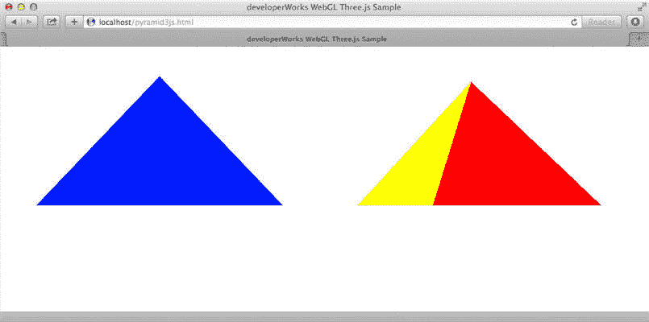

图 1 显示了您在 第 1 部分 中了解的 WebGL pyramid.html 示例，但这一次它使用 Three.js 编码。仅通过查看该页面，无法区分这个版本与原始的 WebGL 版本。但在底层，`draw3D()` 中最初的 100 多行 WebGL 代码变成了大约 10 行 Three.js 代码。要了解 Three.js 如何显著简化 WebGL 开发人员的工作，请看一下清单 1 中的源代码。

##### 清单 1\. 使用 Three.js 实现的旋转金字塔 (pyramid3js.html)

```
<!doctype html>
<html>
<head>
  <title>developerWorks WebGL Three.js Example</title>
  <script src="Three.js" ></script>
  <script type="text/javascript">
  function draw2D()  {
      var canvas = document.getElementById("shapecanvas");
      var c2dCtx = null;
      var exmsg = "Cannot get 2D context from canvas";
      try {
        c2dCtx = canvas.getContext('2d');
      }
      catch (e)
      {
        exmsg = "Exception thrown: " + e.toString();
      }
      if (!c2dCtx) {
        alert(exmsg);
        throw new Error(exmsg);
      }
      c2dCtx.fillStyle = "#0000ff";
      c2dCtx.beginPath();
      c2dCtx.moveTo(250, 40);
      c2dCtx.lineTo(450, 250);         // Bottom Right
      c2dCtx.lineTo(50, 250);         // Bottom Left
      c2dCtx.closePath();
      c2dCtx.fill();

  }

  function draw3D()  {
    function animate() {
      requestAnimationFrame(animate);
      pyramid.rotateY(Math.PI / 180);
      renderer.render(scene, camera);
    }
    var geo = new THREE.CylinderGeometry(0,2,2,4,1, true);
    var faceColors = [0xff0000, 0x00ff00, 0x0000ff, 0xffff00];
    faceColors.forEach( function(color, idx) { geo.faces[2 * idx + 1].color.setHex(color);});
    var pyramid = new THREE.Mesh(geo, new THREE.MeshBasicMaterial({vertexColors: THREE.FaceColors}));
    var camera = new THREE.PerspectiveCamera(45, 1,0.1, 100);
    pyramid.position.y = 1;  camera.position.z = 6;
    var scene = new THREE.Scene();
    scene.add(pyramid);
    var renderer = new THREE.WebGLRenderer();
    renderer.setSize(500,500);
    var span = document.getElementById("shapecanvas2");
    span.appendChild( renderer.domElement );
    animate();
  }

</script>

</head>
<body onload="draw2D();draw3D();">

  <canvas id="shapecanvas" class="front" width="500" height="500"></canvas>
  <span id="shapecanvas2" style="border: none;" width="500" height="500"></span>

  <br/>
  </body>

</html> 
```

##### Three.js 渲染器

在 WebGL 广泛应用到常见浏览器中很久以前，Three.js 就已是一个流行的 JavaScript 3D 渲染库。为了支持缺乏 WebGL 功能的浏览器，HTML5 上运行着一个使用 2D 绘图原语 (Canvas 2D Context API) 的 Three.js 渲染器（输出模块）。这个渲染器的性能有限（因为它无法访问 3D 硬件）且缺乏对高级 Three.js 特性的支持。

### 向 WebGL 画布上下文渲染 3D 效果

在 清单 1 中，请注意 `shapecanvas2` 元素现在是一个 `<span>` ，而不是 `<canvas>` 。Three.js WebGL 渲染器负责创建画布元素并渲染到画布的 3D 上下文（参见 Three.js 渲染器 边栏）。

在 pyramid3js.html 中，清单 2 中的代码负责将 `<span>` 与 Three.js 创建的画布元素关联起来。

##### 清单 2\. Three.js 创建的画布元素

```
var renderer = new THREE.WebGLRenderer();
renderer.setSize(500,500);
var span = document.getElementById("shapecanvas2");
span.appendChild( renderer.domElement ); 
```

### 创建一个几何体并分配表面颜色

在 [第 1 部分](http://www.ibm.com/developerworks/cn/web/wa-webgl1/index.html) 中您已知道，要自行创建金字塔，您必须在一个低级缓冲区中填入组成金字塔的三角形的顶点。Three.js 通过包含生成这些顶点的库代码，帮助消除了该任务的许多代码。通过在幕后为您生成和填充顶点缓冲区，Three.js 使您能够将编码工作集中在更高级的问题上。

为了大大简化 3D 场景的构造和建模，Three.js 包含生成 3D 渲染中通常使用的各种原始 *几何体* 所需的库代码。这些几何体包括正方体、球体、圆柱、圆环面、四面体、二十面体、八面体、平面、管子、文本，等等。您只需一两行代码即可设置典型的几何体（常常生成一个包含数千个三角形的网格）。对于金字塔，使用的 Three.js 几何体实际上是一个圆柱：

```
var geo = new THREE.CylinderGeometry(0,2,2,4,1, true); 
```

##### Three.js 中的材质

`THREE.MeshBasicMaterial` 不需要渲染光效。`THREE.MeshLambertMaterial` 与非环境光（定向光源或点光源）交互，在它的表面提供一种平滑的插值（高洛德着色）颜色效果。`THREE.MeshPhongMaterial` 还需要渲染非环境光；它用于表示发光面，因为它支持镜面（发光面上超亮的斑点）反射。Phong 和 Lambert 材质都支持投影。

光滑的圆柱通常通过使用许多三角形接近它的曲率来生成。本文的金字塔只是一个在各面上仅有 4 个分段的圆柱。（每个分段通常为两个三角形。）将顶半径设定为 0（创建金字塔的尖端并使每两个三角形组成的分段逐渐缩小为一个三角形），底半径为 2。指定高度为 2，圆柱为非封闭的（最后一个参数 `openEnded` 为 `true` ），以省去底部的正方形，该正方形永远不可见。

在 pyramid3js.html 中，这两行代码指定了 4 个金字塔面的颜色（红、绿、蓝、黄），取代了 第 1 部分 中用于指定顶点颜色的 20 行原始二进制缓冲区操作代码：

```
var faceColors = [0xff0000, 0x00ff00, 0x0000ff, 0xffff00];
    faceColors.forEach( function(color, idx) { geo.faces[2 * idx + 1].color.setHex(color);}); 
```

几何体的面 (`geo.faces)` — 8 个三角形面、圆柱体的每个分段有两个三角形面 — 都会经过迭代。因为顶半径为 0，所以每个分段的一个三角形面不可见。该代码仅设置奇数编号的面，这些面表示金字塔每一边可见的面。

### 创建网格

*材质* 用于创建 Three.js 网格。材质控制一个对象表面的渲染方式和光线与之交互的方式。使用 Three.js 创建一个 *网格* ，将一个几何体与一种材质相关联，这类似于您在原始 WebGL 中必须做的操作。在 pyramid3js.html 中，这行代码负责对金字塔执行关联：

```
var pyramid = new THREE.Mesh(geo, new THREE.MeshBasicMaterial({vertexColors: THREE.FaceColors})); 
```

##### 多功能的 Object3D 根类

Three.js 中的许多对象（包括网格、光源和摄像机）都派生自 Three.js `Object3D` 根类。`Object3D` 的子类继承了许多简化了 3D 编程的属性和方法。例如，`position` 属性跟踪对象在 3D 环境中的位置；`scale` 属性跟踪每个轴中的刻度；`rotateX()`、`rotateY()` 和 `rotateZ()` 方法直接围绕标准的轴旋转；`translateX()`、`translateY()` 和 `translateZ()` 简化了平移。您在使用 Three.js 编程时将经常使用 `Object3D` 的子类，所以需要熟悉它的属性和方法。

`Mesh` 是 `Object3D` 类的一个实例，它是 Three.js 中一个无处不在的根类。 `{vertexColors:THREE.FaceColors}` 告诉 Three.js 使用几何体对象的 `faces` 数组的 `color` 属性来渲染每一面的颜色。从 第 1 部分 中的原始 WebGL 示例，您可以看出一个面的所有 3 个顶点的颜色都被设置为完全相同。也可为一个或多个顶点指定一种不同的颜色来生成一种渐变（参见 [Three.js 文档](http://threejs.org/docs/) 中的 `THREE.VertexColors` 了解详细信息）。在任何情况下，Three.js 都负责为您处理生成顶点颜色数组和加载低级缓冲区的详细工作。而且，甚至 GLSL 着色器编码（和着色器的编译和链接）都对您进行了隐藏，您仅需选择一种材质。

## 放置摄像机和网格

摄像机和对象在场景中的放置决定了画布视口中哪些对象最终可见。在原始 WebGL 示例中，4×4 变换矩阵 (`modelViewMatrix`) 的创建会将对象平移、旋转和缩放到位。Three.js 通过对象的 `position` 、 `rotation` 和 `scale` 属性提供了一种直观得多的编程接口（网格从 `Object3D` 继承了这些属性）。position 的默认值为 `(0,0,0)` 。如要将网格放在场景中的 `(0,1,0)` 位置，所需做的只是输入以下代码：

```
pyramid.position.y = 1; 
```

此代码将摄像机放在原点背后 6 个单位处：

```
camera.position.z = 6; 
```

同样地，Three.js 向您隐藏了所有底层的矩阵数学运算，提供了一个单纯的 API 用于编程。

### 设置场景

要设置在原始 WebGL 示例中渲染的场景，您需要将摄像机到视口的投影指定为一个 4×4 `projectionMatrix`。在 Three.js 中，使用以下代码设置透视摄像机：

```
var camera = new THREE.PerspectiveCamera( 45, 1, 0.1, 100); 
```

金字塔网格通过以下代码放在场景中：

```
var scene = new THREE.Scene();
scene.add(pyramid); 
```

最后，此代码渲染场景的一帧：

```
renderer.render(scene, camera); 
```

编译和链接 GLSL 着色代码以及在渲染帧之前将数据编组到低级 GPU 缓冲区中的所有沉闷工作，都对 Three.js 开发人员不可见。

### 添加旋转动画

最后，要为金字塔围绕 y 轴的旋转创建动画，您需要处理原始 WebGL 示例中的 `modelViewMatrix`。使用 Three.js，只需调用从 `Object3D` 继承的 `rotateY` 方法，提供一个增量弧度（1 度 = PI / 180 弧度）：

```
pyramid.rotateY(Math.PI / 180); 
```

在每次帧更新期间，在 rAF 调用 `animate()` 时，金字塔旋转 1 度。

## 利用 Three.js 中的对象

Three.js 简单地抽象出了低级 WebGL 开发的复杂性，您只需关注 3D 开发的更高级细节（比如网格创建、光效和动画）。下一个示例在金字塔情形上更进了一步。您将看到如何利用面向对象的 Three.js 库来快速创建更复杂的场景。

将 twopyramids.html 加载到您的浏览器中。图 2 展示了显示效果。

##### 图 2\. 两个使用 Three.js 的金字塔

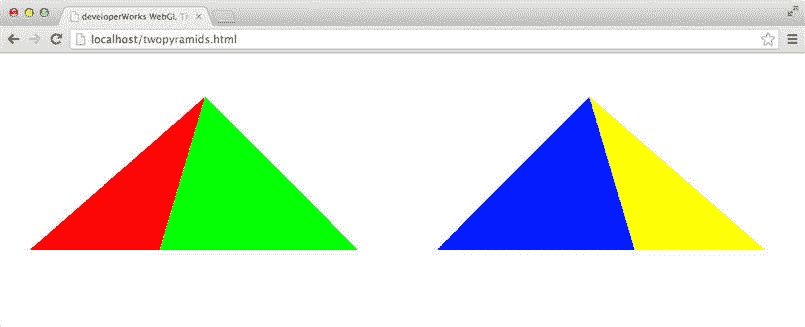

在 图 2 中的屏幕截图中，两个金字塔围绕 y 轴朝相反方向旋转。清单 3 显示了 twopyramids.html 的基础代码。它与 pyramid3js.html 之间的重要区别已以粗体突出显示。

##### 清单 3\. 创建金字塔的克隆体

```
function draw3D()  {
    function animate() {
      requestAnimationFrame(animate);
      pyramid1.rotateY(Math.PI/ 180);
      pyramid2.rotateY(- (Math.PI/ 180));
      renderer.render(scene, camera);
    }

    var geo = new THREE.CylinderGeometry(0,2,2,4,1, true);
    var faceColors = [0xff0000, 0x00ff00, 0x0000ff, 0xffff00];
    faceColors.forEach( function(color, idx)
       { geo.faces[2 * idx + 1].color.setHex(color);});
    var pyramid1 = new THREE.Mesh(geo,
       new THREE.MeshBasicMaterial({vertexColors: THREE.FaceColors}));
    pyramid1.position.set(-2.5, 1, 0);
    var pyramid2 = pyramid1.clone();
    pyramid2.position.set(2.5, 1, 0);

    var scene = new THREE.Scene();

    scene.add(pyramid1);
    scene.add(pyramid2);

    var camera = new THREE.PerspectiveCamera(  45, 1024/500,0.1, 100);
    camera.position.z = 6;

    var div = document.getElementById("shapecanvas2");
    var renderer = new THREE.WebGLRenderer();

    renderer.setSize(1024,500);
    div.appendChild( renderer.domElement );

    animate();
} 
```

##### 3D 渲染效果下的场景图

*场景图* 是一种数据结构（几乎总是一种非循环树），它包含一个场景的对象（网格、光源、摄像机等）（常常还有关联的变换）。场景图在 3D 场景包含多于一个对象时创建，常常会出现这种情况，因为您通过其观看场景的摄像机本身就被视为一个对象。场景图中的对象表示显示的场景。渲染场景图中的对象是 3D 渲染库运行时的工作。

在 twopyramids.html 中，画布大小和摄像机位置与 pyramid3js.html 中不同，以便容纳两个金字塔的显示。

清单 3 显示了重用在 Three.js 中创建的 3D 对象有多简单。突出显示的代码调用继承自 `Object3D` （ `Mesh` 的根类）的 `clone()` 方法来创建金字塔的另一个实例。如果使用原始 WebGL 进行编码，此任务将没有这么容易。

`pyramid2` （克隆的 `Mesh` ）通过此代码使用不同的位置和旋转来加以定制：

```
pyramid2.position.set(2.5, 1, 0);
...
pyramid2.rotateY(- (Math.PI/ 180)); 
```

现在您有一个包含两个金字塔的场景。克隆对于需要许多几乎相同的对象的场景特别方便。

### 构建更复杂的场景图

下一个示例增量地向自旋的组合中添加一个不同的对象。随着一个场景变得更加复杂，Three.js 在渲染时处理场景图的事实就会变得更加明显。加载 threespin.html 并看一看。图 3 显示了实际显示的 threespin.html 的快照。

##### 图 3\. 添加一个旋转的正方体

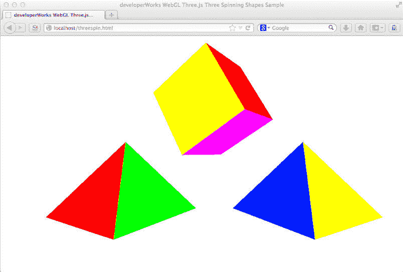

在 threespin.html 中，一个自旋的正方体显示在旋转的金字塔上方。正方体的旋转围绕一个倾斜的轴进行，所以它似乎在向前倾。threespin.html 中添加正方体的重要代码已在清单 4 中突出显示。

##### 清单 4\. 添加一个旋转的正方体

```
function draw3D()  {

    function animate() {
      requestAnimationFrame(animate);
      pyramid1.rotateY(Math.PI/180);
      pyramid2.rotateY(-(Math.PI/180));
      cube.rotateY(Math.PI/180); cube.rotateX(Math.PI/90);
      renderer.render(scene, camera);
    }

    var geo = new THREE.CylinderGeometry(0,2,2,4,1, true);
    var faceColors = [0xff0000, 0x00ff00, 0x0000ff, 0xffff00];
    faceColors.forEach( function(color, idx)
       { geo.faces[2 * idx + 1].color.setHex(color);});
    var pyramid1 = new THREE.Mesh(geo,
       new THREE.MeshBasicMaterial({vertexColors: THREE.FaceColors}));
    pyramid1.position.set(-2.5, -1, 0);
    var pyramid2 = pyramid1.clone();
    pyramid2.position.set(2.5, -1, 0);

    geo = new THREE.CubeGeometry(2,2,2);
    faceColors = [0xff0000, 0x00ff00, 0x0000ff, 0xffff00, 0x00ffff, 0xff00ff];
    faceColors.forEach( function(color, idx)
       { geo.faces[2 * idx + 1].color.setHex(color);
       geo.faces[2*idx].color.setHex(color);});
    var cube = new THREE.Mesh(geo, new THREE.MeshBasicMaterial({vertexColors:
       THREE.FaceColors}));
    cube.position.set(0, 1, 0);

    var camera = new THREE.PerspectiveCamera(  45, 1024/500,0.1, 100);
    camera.position.z = 7;

    var scene = new THREE.Scene();
    scene.add(pyramid1);
    scene.add(pyramid2);
    scene.add(cube);
    var div = document.getElementById("shapecanvas2");
    var renderer = new THREE.WebGLRenderer();
    renderer.setSize(1024,500);
    div.appendChild( renderer.domElement );
    animate();

} 
```

`cube` 是一个内置的 Three.js 几何体，所以在 添加一个旋转的正方体 中，使用 `THREE.CubeGeometry` 构造函数创建了一个新 `cube` 实例，将它的 3 个维度都指定为 `2` ：

```
geo = new THREE.CubeGeometry(2,2,2); 
```

可通过指定不同的维度来轻松地创建一个长方体。

接下来，设置正方体的 6 个正方形面的颜色。请注意，这次必须设置 12 个三角形的颜色，因为每个正方形面由两个三角形表示：

```
faceColors.forEach( function(color, idx) { geo.faces[2 * idx + 1].color.setHex(color);
   geo.faces[2*idx].color.setHex(color);}); 
```

正方体放在 3 组形状中位于 y 轴较高的位置：

```
cube.position.set(0, 1, 0); 
```

要获得前倾旋转的效果，对于每个 rAF 动画帧，正方体围绕偏离 x 轴 2 度和偏离 y 轴 1 度的方向旋转：

```
cube.rotateY(Math.PI/180); cube.rotateX(Math.PI/90); 
```

### 场景图继承关系

在 3D 工作中，我们常常希望在一组相关的对象上执行操作或变换。场景图中的对象之间的父子关系，以及 Three.js（和其他框架）中的继承特性，让分组变换变得相对直观。

再看看 threespin.html。假设您现在希望围绕 y 轴自旋整个分组中的 3 个对象，同时让每个对象独立地旋转。可在 `animate()` 函数中执行数学运算，平移/旋转正方体和每个金字塔。但这是相当繁重的工作。您可利用 Three.js 图形变换继承性：创建 3 个形状的一个父对象并围绕 y 轴自旋这个父对象。除了 3 个子对象自己的旋转，它们还自动继承了 “分组自旋”。如果加载 multispin.html，您可在浏览器中观察到这种组合旋转，如图 4 所示。

##### 图 4\. 转场景图

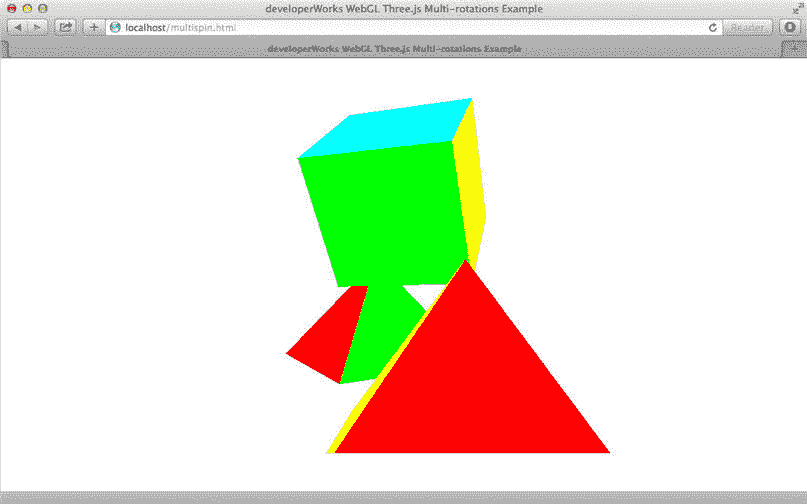

在 multispin.html 中，场景图使用一个名为 `multi` 的 `Object3D` 实例来构造，该实例是正方体、球体和金字塔的父对象。在 `multi` 围绕 y 轴旋转时，它的子对象继承了这种旋转。请特别注意正方体和它经历的复杂变换组合。正方体仍向前倾，同时在分组中围绕 y 轴自旋。在清单 5 中，突出显示的代码负责创建和旋转 `multi` 父对象。

##### 清单 5\. 通过场景图继承性旋转一个分组

```
function draw3D()  {
  function animate() {
    requestAnimationFrame(animate);
    pyramid1.rotateY(Math.PI/180);
    pyramid2.rotateY(-(Math.PI/180));
    cube.rotateY(Math.PI/180); cube.rotateX(Math.PI/90);
    multi.rotateY(Math.PI/360);
    renderer.render(scene, camera);
  }

  var geo = new THREE.CylinderGeometry(0,2,2,4,1, true);
  var faceColors = [0xff0000, 0x00ff00, 0x0000ff, 0xffff00];
  faceColors.forEach( function(color, idx)
     { geo.faces[2 * idx + 1].color.setHex(color);});
  var pyramid1 = new THREE.Mesh(geo,
     new THREE.MeshBasicMaterial({vertexColors: THREE.FaceColors}));
  pyramid1.position.set(-2.5, -1, 0);
  var pyramid2 = pyramid1.clone();
  pyramid2.position.set(2.5, -1, 0);

  geo = new THREE.CubeGeometry(2,2,2);
  console.log(geo.faces.length);
  faceColors = [0xff0000, 0x00ff00, 0x0000ff, 0xffff00, 0x00ffff, 0xff00ff];
  faceColors.forEach( function(color, idx)
     { geo.faces[2 * idx + 1].color.setHex(color);
   geo.faces[2*idx].color.setHex(color);});
  var cube = new THREE.Mesh(geo,
     new THREE.MeshBasicMaterial({vertexColors: THREE.FaceColors}));
  cube.position.set(0,1,0);

  var camera = new THREE.PerspectiveCamera(45, 1024/500,0.1, 100);
  camera.position.z = 7;

  var multi = new THREE.Object3D();
  multi.add(cube);
  multi.add(pyramid1);
  multi.add(pyramid2);
  multi.position.z = 0;

  var scene = new THREE.Scene();
  scene.add(multi);

  var div = document.getElementById("shapecanvas2");
  var renderer = new THREE.WebGLRenderer();
  renderer.setSize(1024,500);
  div.appendChild( renderer.domElement );

  animate();

} 
```

在清单 5 中， `multi` 分组在每个 rAF 动画帧上旋转 PI/360 弧度 = 0.5 度，每个形状同时自转 PI/180 弧度 = 1 度。

## 线框对象

目前，正方体和金字塔以具有统一平面颜色的固体形式渲染。但计算机图形动画常常会为一个网格（或 *线框* ）本身创建动画。

从原始 WebGL 示例中可以知道，网格线框必须（通过顶点缓冲区）显式定义，然后才能渲染对象。Three.js 提供了一种简单的方式来渲染这个线框。加载 multiwire.html 并观察线框自旋。图 5 是 multiwire.html 的快照。

##### 图 5\. 一个球体的线框和复杂性

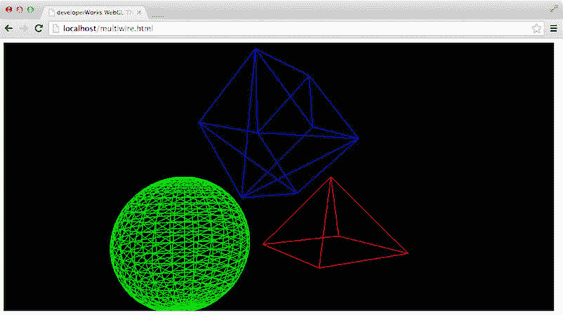

multiwire.html 中的背景设置为黑色，以增强与线框的反差。您可清晰地看到，蓝色正方体的每一面由两个三角形组成；这正是您在设置正方体的表面颜色时需要指定每种表面颜色两次的原因。

在 multiwire.html 中，我用一个球体取代了一个金字塔，以帮助您直观地展示使用足够的三角形建模任何形状的能力。球体明显平滑的曲率使用了大约 1,200 个三角形来渲染。您一定不希望手动指定每个三角形的顶点。Three.js 有一个针对球体的内置几何体生成器。清单 6 给出了 multiwire.html 的代码。

##### 清单 6\. 旋转线框对象

```
function draw3D()  {

    function animate() {
      requestAnimationFrame(animate);
      pyramid1.rotateY(Math.PI/180);
      sphere.rotateY(Math.PI/180);
      cube.rotateX(Math.PI/90);
      multi.rotateY(Math.PI/360);
      renderer.render(scene, camera);
    }

    var geo = new THREE.CylinderGeometry(0,2,2,4,1, true);
    var pyramid1 = new THREE.Mesh(geo,
       new THREE.MeshBasicMaterial({color: 0xff0000, wireframe: true}));
    pyramid1.position.set(-2.5, -1, 0);

    geo = new THREE.SphereGeometry(1, 25, 25);
    var sphere = new THREE.Mesh(geo,
       new THREE.MeshBasicMaterial({color: 0x00ff00, wireframe: true }));
    sphere.position.set(2.5, -1, 0);

    geo = new THREE.CubeGeometry(2,2,2);
    var cube = new THREE.Mesh(geo,
       new THREE.MeshBasicMaterial({color: 0x0000ff, wireframe: true })   );
    cube.position.set(0,1,0);

    var camera = new THREE.PerspectiveCamera(  45, 1024/500,0.1, 100);
    camera.position.z = 7;

    var multi = new THREE.Object3D()
    multi.add(cube);
    multi.add(pyramid1);
    multi.add(sphere);
    multi.position.z = 0;

    var scene = new THREE.Scene();
    scene.add(multi);

    var div = document.getElementById("shapecanvas2");
    var renderer = new THREE.WebGLRenderer();
    renderer.setSize(1024,500);
    renderer.setClearColor(0x000000, 1);
    div.appendChild( renderer.domElement );
    animate();

  } 
```

在清单 6 中突出显示的代码中，您可以看到球体是如何使用 Three.js 内置的 `THREE.SphereGeometry` 生成器创建的。生成的球体半径为 1，具有 25 个圆环，每个圆环分为 25 段。

此外，请注意，将 `THREE.MeshBasicMaterial` 的 `wireframe` 属性设置为 `true` ，将显示网格的线框。例如，通过设置其材质的 `wireframe` 属性可将正方体显示为线框：

```
var cube = new THREE.Mesh(geo,new THREE.MeshBasicMaterial({color: 0x0000ff, wireframe: true })   ); 
```

## 添加光源和阴影效果

##### Three.js 中的光源

各种具有不同属性的光源可用于定制您的 Three.js 场景的外观。使用 `AmbientLight` 向一个场景中的所有对象统一地添加光源。`DirectionalLight` 可模拟一个来自遥远地方的可投射阴影的光源（投射几乎平行的光线）。`SpotLight` 可在一个受控的方向上照明和投射阴影。`PointLight` 的强度随距离变远而变弱，但是从光源向各个方向散射。

目前，场景中的对象都已被魔法般地照亮，无需您向场景添加光源。之所以这样，是因为默认的 `THREE.MeshBasicMaterial` 不需要渲染任何光效。

在更加典型的 3D 场景中，您可能希望通过更好地控制光效来增加逼真度。为此，您必须显式地向场景添加光源对象。Three.js 支持多种类型的光源。图 6 显示了添加了光源和阴影效果的分组旋转场景。加载 matlight.html 并查看它的实际效果。请注意，此场景一定比任何以前的示例更加逼真。

##### 图 6\. 包含光源和阴影的场景

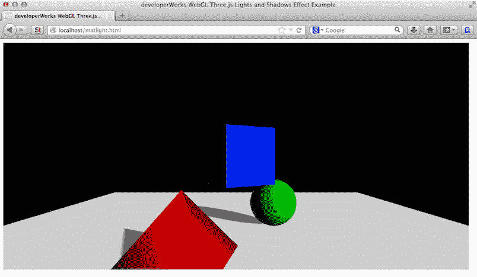

观察光如何从旋转的金字塔和球体反射。看看您是否能判断光是从何处照射的。清单 7 给出了 matlight.html 的代码。

##### 清单 7\. 光照和阴影效果

```
function draw3D()  {

    function animate() {
      requestAnimationFrame(animate);

      pyramid1.rotateY(Math.PI/180);
      sphere.rotateY(Math.PI/180);
      cube.rotateY(Math.PI/180);
      multi.rotateY(Math.PI/480);
      renderer.render(scene, camera);
    }

    var geo = new THREE.CylinderGeometry(0,2,2,4,1, true);
    var pyramid1 = new THREE.Mesh(geo, new THREE.MeshPhongMaterial({color: 0xff0000}));
    pyramid1.position.set(-2.5, -1, 0);

    geo = new THREE.SphereGeometry(1, 25, 25);
    var sphere = new THREE.Mesh(geo, new THREE.MeshPhongMaterial({color: 0x00ff00}));
    sphere.position.set(2.5, -1, 0);

    geo = new THREE.CubeGeometry(2,2,2);
    var cube = new THREE.Mesh(geo,new THREE.MeshPhongMaterial({color: 0x0000ff })   );
    cube.position.set(0, 1, 0);

    var camera = new THREE.PerspectiveCamera(  45, 1024/500,0.1, 100);
    camera.position.z = 10;
    camera.position.y = 1;

    var multi = new THREE.Object3D();
    pyramid1.castShadow = true; sphere.castShadow = true;
    multi.add(cube);
    multi.add(pyramid1);
    multi.add(sphere);
    multi.position.z = 0;

    geo = new THREE.PlaneGeometry(20, 25);
    var floor = new THREE.Mesh(geo, new THREE.MeshBasicMaterial({color : 0xcfcfcf}));
    floor.material.side = THREE.DoubleSide;
    floor.rotation.x = Math.PI/2;
    floor.position.y = -2;
    floor.receiveShadow = true;

    var light = new THREE.DirectionalLight(0xe0e0e0);
    light.position.set(5,2,5).normalize();
    light.castShadow = true;
    light.shadowDarkness = 0.5;
    light.shadowCameraRight = 5;
    light.shadowCameraLeft = -5;
    light.shadowCameraTop = 5;
    light.shadowCameraBottom = -5;
    light.shadowCameraNear = 2;
    light.shadowCameraFar = 100;

    var scene = new THREE.Scene();
    scene.add(floor);
    scene.add(multi);
    scene.add(light);
    scene.add(new THREE.AmbientLight(0x101010));

    var div = document.getElementById("shapecanvas2");
    var renderer = new THREE.WebGLRenderer();
    renderer.setSize(1024,500);
    renderer.setClearColor(0x000000, 1);
    renderer.shadowMapEnabled = true;
    div.appendChild( renderer.domElement );
    animate();

  } 
```

在清单 7 中，添加了一个新的 `floor` 对象来显示渲染的阴影效果。突出显示的代码使用 Three.js 的平面几何体生成器，生成一个 20 单位宽和 20 单位高的平面。这个平面是在 x-y 平面上生成的，所以它在 x 轴上旋转了 90 度并通过在 y 轴上平移 2 个单位来在场景中向下移动。

正方体、球体和金字塔现在都由 `THREE.MeshPhongMaterial` 材质构成，为它们提供了一种使它们也可投射阴影的、有光泽的、类似塑料的反射效果。以下代码可更改正方体的材质：

```
var cube = new THREE.Mesh(geo,new THREE.MeshPhongMaterial({color: 0x0000ff })); 
```

添加了一种从右上角向原点投射（更准确地说，从 (5,2,5) 向 (0,0,0) 投射）的定向光。除了定向光，还添加了环境光来 “填充” 场景的黑暗区域。否则，定向光源没有照到的区域将是全黑的。这种环境光由以下代码添加：

```
scene.add(new THREE.AmbientLight(0x101010)); 
```

### 在 Three.js 中渲染阴影效果

向一个场景添加准确的阴影，是一种极度麻烦的做法，需要计算密集型光线跟踪或光能传递算法。这些算法对如今最强大的 3D 渲染硬件来说都很费力。

存在计算效率较高的近似算法。Three.js 实施一种 z 缓冲区阴影映射技术，该技术由 Lance Williams 在其 1978 年的论文 “[Casting Curved Shadows on Curved Surfaces](http://cseweb.ucsd.edu/~ravir/274/15/papers/p270-williams.pdf) ” 中提出。这种有效且广泛使用的算法从光源的视角来渲染场景。它然后使用 z 缓冲区（隐藏面删除）信息来确定光源能否 “看到场景中的一个点”。任何 “光源无法看到” 的点都被视为在阴影中。

尽管阴影效果在游戏引擎中很常见，但并非所有 3D 库或框架都支持它们。（例如，SceneJS，即本文接下来要介绍的库，不支持阴影效果）。

要处理一个定向光源的平行光线，Three.js 需要一个正交投影摄像机的定义（ *阴影摄像机* ）来执行阴影映射（以确定光源可 “看到” 什么）。matlight.html 中创建阴影摄像机的代码是：

```
light.shadowCameraRight = 5;
light.shadowCameraLeft = -5;
light.shadowCameraTop = 5;
light.shadowCameraBottom = -5;
light.shadowCameraNear = 2;
light.shadowCameraFar = 100; 
```

要帮助该算法避免不必要的计算，您必须指定可投射阴影的对象和可接收阴影的对象。在 matlight.html 中，此代码指定只有球体和金字塔可投射阴影：

```
pyramid1.castShadow = true; sphere.castShadow = true; 
```

而且只有白色的地面可接收阴影：

```
floor.receiveShadow = true; 
```

尽管动态变化的阴影通过一种近似算法来渲染，但它们仍然在场景中看起来令人信服。

## 通过演练筹划一个 3D 场景

现在是时候将您目前学到的所有知识应用到实际中了。下面我们创建一个适度复杂的场景，其中包含两个房间和它们之间的一扇门。第二个房间将包含自旋的对象组。您将引导观看者从一个房间穿过门到达另一个房间，在这里它们将看到自旋的对象，以及光照和阴影。完成此演练效果的方法是（类似于好莱坞电影中经常使用的一种熟悉的 “前进跟踪” 拍摄），创建摄像机位置的动画。

计划拍摄之前，必须创建环境。这个具有两个房间的环境包含许多 3D 对象，您可使用 Three.js API 创建它们。它是本文中最复杂的场景图。表 1 显示了此场景图中包含的对象列表，以及它们的属性和每个属性的简要描述。

##### 表 1\. 组成 fullscene.html 中的场景的对象（网格）

| 网格/对象 | 名称 | 位置 | 颜色/材质 | 描述 |
| --- | --- | --- | --- | --- |
| 球体 | `sphere` | (-2.5,-1,0) | 绿色 | 围绕 y 轴顺时针旋转 |
| 正方体 | `cube` | (0,1,0) | 蓝色 | 围绕 y 轴顺时针旋转 |
| 金字塔 | `pyramid1` | (2,5,-1,0) | 红色 | 围绕 y 轴顺时针旋转 |
| 多对象分组 | `multi` | (0,0,0) | （不适用） | 用于顺时针一起旋转球体、金字塔和正方体 |
| 定向光 | `light` | 从 (5,2,5) 定向投射到 (0,0,0) | 苍白色 | 用于为自旋的几何体添加镜面反射和阴影效果 |
| 环境光 | （无） | （不适用） | 低强度白色 | 预防未照射到光的区域变成全黑色 |
| 平面（地板） | `floor` | 在 x-y 平面上创建，围绕 x 轴旋转 90 度，然后在 z 轴上（朝观看者）平移 10 个单位 | 苍白色 | 20 x 50 |
| 平面（左侧墙） | `wallleft` | 在 x-y 平面上创建，围绕 y 轴旋转 90 度，然后在 x 轴上平移 -8 个单位并在 z 轴上平移 12 个单位 | 黄色 | 50 x 20 |
| 平面（右侧墙） | `wallright` | 与 `wallleft` 相同，但 x 轴上平移为 x=8 | 黄色 | 50 x 20 |
| 形状几何体（剪出了门的墙） | `dWall` | 在 x-y 平面上创建，然后移动到： -24.5*-2=8。 | 红色 | 50 x 20，剪出了 2 x 3.5 的区域留给门 |
| 长方体（门） | `door` | 在 x-y 平面上创建为一个长方体，然后移动到：(-1.5, -0.25, 8) | 灰蓝色 | 2 x 3.5，厚 0.2；原点在内部平移，以围绕铰链旋转 |

加载 fullscene.html 并自行查看完成的场景演练。看看您 “如何进入第一个房间，” 然后在您走向第二个房间时，通过自旋的形状打开门，最后进入新发现的房间来观看自旋的形状。图 7 显示了您进入第一个房间且门关闭时的 fullscene.html。

##### 图 7\. 演练：进入第一个房间

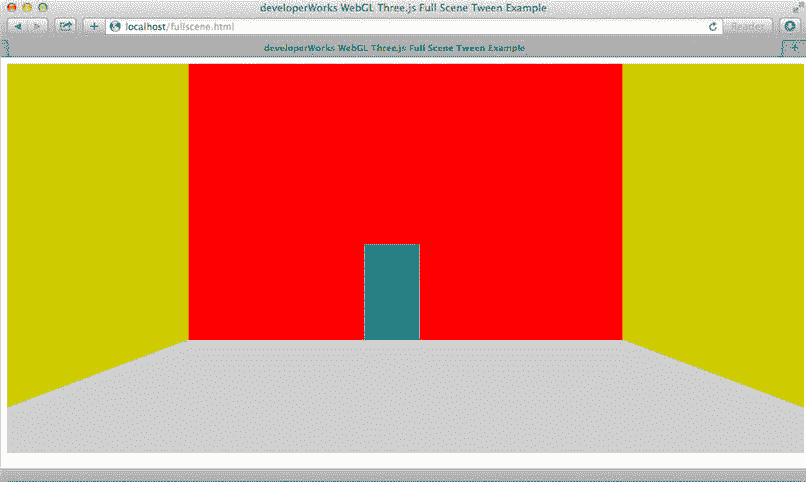

图 8 显示了 fullscene.html，门打开以显示第二个房间。

##### 图 8\. 演练：门打开

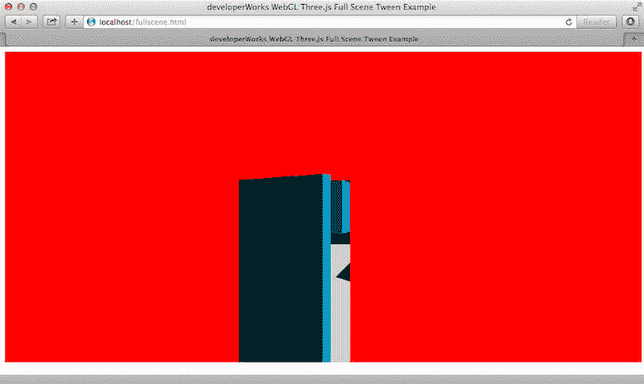

图 9 显示了您穿过打开的门、进入第二个房间后的 fullscene.html。

##### 图 9\. 演练：第二个房间中

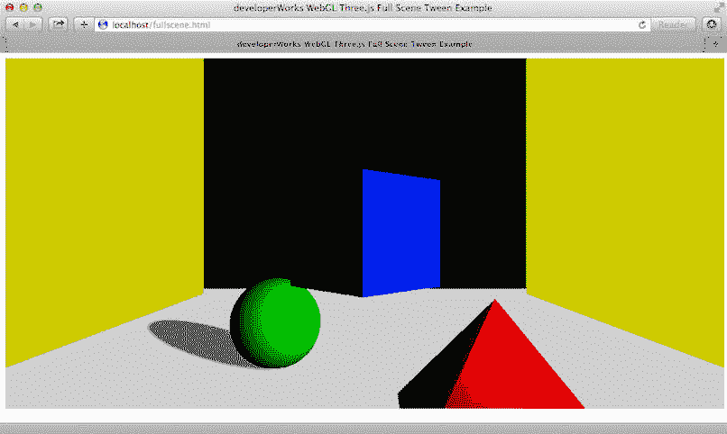

您应能够通过查看 表 1 中的每一行并在 fullscene.html 中找到相应对象的构造和放置代码，理解这个复杂场景的构造。清单 8 给出了 fullscene.html 的代码。

##### 清单 8\. 在 fullscene.html 中创建场景和动画

```
function draw3D()  {

   function setup() {

        var tweenOpenDoor = new TWEEN.Tween( door.rotation )
            .to( { y: door.rotation.y - Math.PI }, 3000 );

        var tweenWalkUp = new TWEEN.Tween(camera.position)
            .to({z: camera.position.z - 25}, 8000);

        var tweenWalkIn = new TWEEN.Tween(camera.position)
            .to({z: camera.position.z - 32}, 5000);

          tweenOpenDoor.chain(tweenWalkIn);
          tweenWalkUp.chain(tweenOpenDoor);
          tweenWalkUp.start();

    }

    function animate() {
      requestAnimationFrame( animate );
      ... code to rotate objects ...
      TWEEN.update();
      renderer.render(scene, camera);
    }

   // Code for setting up the three spinning shapes skipped for brevity

    // floor
    geo = new THREE.PlaneGeometry(20, 50);
    var floor = new THREE.Mesh(geo, new THREE.MeshBasicMaterial({color: 0xcfcfcf}));
    floor.material.side = THREE.DoubleSide;
    floor.rotation.x = Math.PI/2;
    floor.position.y = -2;  floor.position.z = 10;
    floor.receiveShadow = true;

    // left wall
    geo = new THREE.PlaneGeometry(50,20);
    var wallleft = new THREE.Mesh(geo ,new THREE.MeshBasicMaterial({color : 0xcccc00}));
    wallleft.material.side = THREE.DoubleSide;
    wallleft.rotation.y = Math.PI/2;
    wallleft.position.x = -8;
    wallleft.position.z = 12;

    // right wall
    var wallright = wallleft.clone();
    wallright.position.x = 8;

    // door
    geo = new THREE.CubeGeometry(2, 3.5, 0.2);
    geo.applyMatrix( new THREE.Matrix4().makeTranslation( 1, 0, 0 ) );  // move to hinge
    var door = new THREE.Mesh(geo, new THREE.MeshPhongMaterial({ color: 0x00c0ce}));
    door.position.set(-1.5, -0.25, 8);

    // wall with door
    var doorWall = new THREE.Shape();
    doorWall.moveTo(  0, 0 );
    doorWall.lineTo(  23, 0 );
    doorWall.lineTo( 23, 3.5 );
    doorWall.lineTo( 25, 3.5 );
    doorWall.lineTo( 25, 0);
    doorWall.lineTo( 50, 0);
    doorWall.lineTo(50, 20)
    doorWall.lineTo(0,20);
    doorWall.lineTo(0,0);
    geo = new THREE.ShapeGeometry(doorWall);
    var dWall = new THREE.Mesh(geo, new THREE.MeshBasicMaterial({color: 0xff0000}));
    dWall.material.side = THREE.DoubleSide;
    dWall.position.set(-24.5,-2, 8);

    // lights
    var light = new THREE.DirectionalLight(0xe0e0e0);
    light.position.set(5,2,5).normalize();
    light.castShadow = true;
    light.shadowDarkness = 0.5;
    light.shadowCameraRight = 5;
    light.shadowCameraLeft = -5;
    light.shadowCameraTop = 5;
    light.shadowCameraBottom = -5;
    light.shadowCameraNear = 2;
    light.shadowCameraFar = 100;

    var scene = new THREE.Scene();
    scene.add(floor)
    scene.add(wallright);
    scene.add(wallleft);
    scene.add(dWall);
    scene.add(door);
    scene.add(light);
    scene.add(multi);
    scene.add(new THREE.AmbientLight(0x101010));

    var camera = new THREE.PerspectiveCamera(  45, 1024/500,0.1, 100);
    camera.position.z = 40;  // 20
    camera.position.y = 1;

    var div = document.getElementById("shapecanvas2");
    var renderer = new THREE.WebGLRenderer();
    renderer.setSize(1024,500);
    renderer.setClearColor(0x000000, 1);
    renderer.shadowMapEnabled = true;

    div.appendChild( renderer.domElement );

    setup();
    animate();

} 
```

fullscene.html 中大部分对象创建和放置代码您都应已熟悉。我将重点介绍 清单 8 中引入的用于创建门和它附加到的墙的技术。

### 将 2D 形状转换为 3D 几何体

屏幕中央的墙和门不是一个简单的平面几何体。它使用 Three.js 的 [ShapeGeometry API](http://threejs.org/docs/#Reference/Extras.Geometries/ShapeGeometry) 创建。基本来讲，您使用熟悉的类似 2D 画布的绘制 API（ `moveTo()` 和 `lineTo()` ）创建一个形状。然后您要求 Three.js 将该形状转换为一个不规则形状的 3D 平面。（请注意，您也可使用 Three.js 将该形状 “挤压” 到一个具有厚度的对象中；请参阅有关 [ExtrudeGeometry](http://threejs.org/docs/#Reference/Extras.Geometries/ExtrudeGeometry) 的 Three.js 文档。）用于这面墙的形状如图 10 所示。

##### 图 10\. 用于创建中间墙的形状

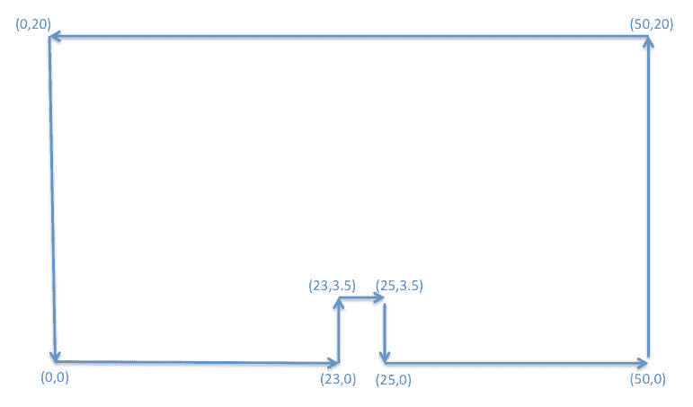

您可逐个分段地通过绘制的线来跟踪形状的创建，从原点 `(0,0)` 开始，最后到 `(0,0)` 结束。清单 9 给出了创建这面有门的墙的相应代码。

##### 清单 9\. 在 Three.js 中创建 `ShapeGeometry`

```
var doorWall = new THREE.Shape();
doorWall.moveTo( 0, 0 );
doorWall.lineTo( 23, 0 );
doorWall.lineTo( 23, 3.5 );
doorWall.lineTo( 25, 3.5 );
doorWall.lineTo( 25, 0);doorWall.lineTo( 50, 0);
doorWall.lineTo(50, 20)
doorWall.lineTo(0,20);
doorWall.lineTo(0,0);

geo = new THREE.ShapeGeometry(doorWall);
var dWall = new THREE.Mesh(geo, new THREE.MeshBasicMaterial({color: 0xff0000})); 
```

绘制 2D 形状 (`doorWall`) 后，您可以像创建其他内置几何体那样创建 `ShapeGeometry`：通过相应的构造函数，如 清单 9 中突出显示的代码所示。

### 处理偏离中央的旋转

要创建门打开的动画，表示门的长方体必须围绕它的铰链旋转 180 度。目前为止，您仅以中心作为原点旋转了对象。但铰链位于门的一侧，而未经过它的中心。

要将对象移离旋转的轴，您必须使用一个矩阵预先平移它。矩阵创建和操作 API 已内置于 Three.js 中并在幕后得到大量使用。 `Object3D` 的 `applyMatrix` 方法将对象在 *x* 轴上朝其当前的中心旋转 1 个单位：

```
geo.applyMatrix( new THREE.Matrix4().makeTranslation( 1, 0, 0 ) );  // move to hinge 
```

任何进一步的旋转将产生新的中心位置，该位置现在为离左侧 1 个单位处，门的铰链在概念上应位于该位置。

## 补间动画

##### 通过 tween.js 简化补间

[tween.js](https://github.com/sole/tween.js/) 是一个轻量型的补间库，常常与 Three.js 等 WebGL 库结合使用。在一个场景中创建和管理多个补间的简单 tween.js 语法很容易学习。

在补间中，生成的中间值插入到您指定的固定点中。这种插值默认是线性的，但大多数补间引擎还包含一个*缓动 (easing)* 功能，您可通过它指定一个在插值期间使用的更改速度控制曲线（例如，增加二次插值或减少四次插值）。tween.js 提供了数十个可为补间选择的 [缓动曲线](http://sole.github.io/tween.js/examples/03_graphs.html)。

您可通过精心设计对象在一段时间内的平移和旋转来创建复杂的动画。可协调多个对象（包括摄像机和光源）的运动来创建复杂序列。可更改一次运动的变化速度（变慢、变快）来实现戏剧效果。

*补间* 是动画序列编码中的一种基础技术。在补间中，不断控制一个对象的属性的数字值（例如，摄像机的 `position.z` 属性）的方式是，指定它在固定时间点上想要的值。补间引擎（代码运行时）然后为您生成中间值 (in-be *tween*)。

tween.js（一个通用的补间库）用于创建 fullscene.html 示例的演练。以下 tween.js 代码将一个虚构导演指令翻译为 “进入房间并停在门附近，从 40 单位到 15 单位进行 8 秒近摄”：

```
var tweenWalkUp = new TWEEN.Tween(camera.position)
       .to({z: camera.position.z - 25}, 8000); 
```

### 灯光就位，摄像就位，开始拍摄！

要编写该演练的代码，首先需要规划补间。在演练序列中，您通过摄像机在 z 轴上的位置动画来将观看者移动到场景中。观看者的移动轨迹由门沿其铰链打开的过程决定。

这个 16 秒的演练序列的方向集为：

1.  走向门，在 8 秒内从 z=40 移动到 z=15。
2.  打开门，在 3 秒内围绕铰链转动它（顺时针旋转 180 度）。
3.  进入房间，在 5 秒内从 z=15 移动到 z=8。

fullscene.html 中相应的补间的编码如清单 10 所示。

##### 清单 10\. fullscene.html 中相应的补间

```
var tweenOpenDoor = new TWEEN.Tween( door.rotation )
   .to( { y: door.rotation.y - Math.PI }, 3000 );

var tweenWalkUp = new TWEEN.Tween(camera.position)
    .to({z: camera.position.z - 25}, 8000);

var tweenWalkIn = new TWEEN.Tween(camera.position)
    .to({z: camera.position.z - 32}, 5000);

  tweenOpenDoor.chain(tweenWalkIn);
  tweenWalkUp.chain(tweenOpenDoor);
  tweenWalkUp.start(); 
```

请注意，在突出显示的代码中，补间使用它们的 `chain()` 方法彼此连接。 `start()` 方法调用启动这个 16 秒的序列。

要在渲染每一帧之前更新补间属性值，您还必须在您的 rAF 回调中添加 `TWEEN.update()` 调用。在此情况下，它位于 `animate()` 函数中，如清单 11 中所示。

##### 清单 11\. `animate()` 函数

```
function animate() {
  requestAnimationFrame( animate );
  pyramid1.rotateY(Math.PI/180);
  sphere.rotateY(Math.PI/180);
  cube.rotateY(Math.PI/180);
  multi.rotateY(Math.PI/480);
  TWEEN.update();
  renderer.render(scene, camera);
} 
```

## 向场景中的对象添加纹理

##### 纹理映射

*纹理映射*（或*纹理*）是向几何体表面应用位图来实现视觉效果的艺术。例如，可将一块花岗岩的 PNG 照片（通过一个关联的 GLSL 着色器）”映射”（插值）到一个球体的表面上，以创建一种花岗岩球体的外观。纹理在 3D 图形中广泛用于创建像照片一样逼真的对象。Three.js 还支持更加专业的纹理技术，比如*光影映射 (light mapping)* 和*凹凸映射 (bump mapping)。*光影映射为您提供对静态对象表面的光线水平的细粒度控制。使用凹凸映射，您可在几何体表面渲染细微的凹凸效果（想想地球仪表面上高尔夫球大小的低谷或山峰）。

平面的彩色墙壁、地面和门已足够建立该场景的原型了。最终的作品常常需要更加逼真。例如，您可能希望让地板成为木地板并向墙上添加一些墙纸。为此可通过 Three.js 使用 *纹理映射*。

要查看演练中使用了纹理映射的场景，可在浏览器中加载 fulltexturescene.html。您将在右侧看到一个漂亮的新沙发。在 fulltexturescene.html 中，演练补间被延长，以停下来打量房间和查看沙发。新的 28 秒序列为：

1.  走向门，在 4 秒内从 z=40 移动到 z=22。
2.  转身并看向右侧（沙发所在地），在 3 秒内转 45 度（最初很快，最后变慢）。
3.  转身并看向左侧，在 6 秒内转 90 度（最初很慢，最后变快）。
4.  在 3 秒内向右转 45 度。
5.  继续走向门，在 4 秒内从 z=22 移动到 z=15。
6.  打开门，在 3 秒内围绕铰链转动它（顺时针旋转 180 度）。
7.  进入房间，在 5 秒内从 z=15 移动到 z=8。

要查看渲染此带纹理的场景的代码，请查看 fulltexturescene.html 源代码。请注意，要打量房间，摄像机的 rotation 属性由 `tweenLookAround` 、 `tweenLookAround2` 和 `tweenLookAround3` 补间修改。对于序列中的第 2 步 (`tweenLookAround2`) 和第 3 步 (`tweenLookAround3`)，使用了 tween.js 对缓动的支持来创建速度不断改变的转身。图 11 显示了您进入房间时铺满纹理的场景。

##### 图 11\. 演练中带纹理的第一个房间

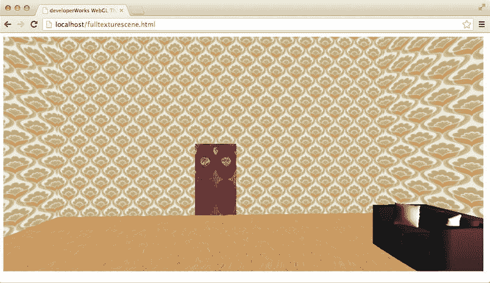

图 12 显示了在门打开后，您走进包含自旋形状的第二个房间时的演练。

##### 图 12\. 打开门，看到第二个房间

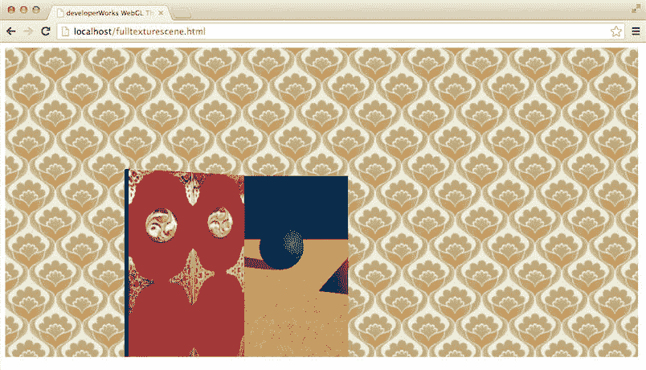

### 向门添加纹理

在 fulltexturescene.html 中，门使用一个红门的 PNG 文件 (door.jpg) 添加纹理，该文件是最初来自 CGTextures.com 的纹理的修改版本。创建纹理、然后将纹理映射到门的代码是：

```
doortex = THREE.ImageUtils.loadTexture('door.jpg');
...
geo = new THREE.CubeGeometry(2, 3.5, 0.2);
door = new THREE.Mesh(geo, new THREE.MeshPhongMaterial({map : doortex})); 
```

3D 资产和存储库：您最终会积累许多自定义纹理、几何体、形状、模型和补间。所有这些*资产* 可修改并重用于新的 3D 项目上。除了创建您自己的 3D 资产，您还可从在线商店、仓库或存储库获取资产。[Trimble 3D Warehouse](http://sketchup.google.com/3dwarehouse/) 是一个面向预制 3D 模型的流行仓库。[CGTextures.com](http://www.cgtextures.com) 是一个专门开发纹理的流行会员制资产存储库。

##### 使用 Three.js LoadingManager 执行异步加载

浏览器的图像加载和 Three.js 的模型加载都是异步的非阻塞活动。如果纹理未完整加载，渲染将失败。Three.js 的 `LoadingManager` 类管理异步加载。一个 `LoadingManager` 实例可管理多个异步加载器，为加载的每个项目调用 `onProgress()` 并在所有等待中的加载完成后调用 `onLoad()` 方法。实例化加载器时会使用一个 `THREE.DefaultLoadingManager` 实例，而不指定 `LoadingManager`。

首先，使用 `THREE.ImageUtils.loadTexture()` 创建纹理来加载 door.jpg 文件。请注意，加载是异步的。为 Three.js 纹理选择一个位图后，最好确保它的尺寸是 2 的幂（比如 64、128、256 或 512）；支持的尺寸依赖于基础 WebGL GPU。

加载门的纹理后，设置 `THREE.MeshPhongMaterial()` 的 `map` 属性，它将创建纹理图。此属性插入（拉伸）位图以适合长方体的每一面。门有 6 个面：前面、后面和 4 个边。前面和后面的纹理看起来很不错。因为使用了位图来为 4 个边添加纹理，所以如果仔细查看，您会看到它有点失真。为了让代码保持简单，我忽略了此细节。

### 平铺一个位图来设置平面的纹理

用于地板的纹理 (floor.jpg) 是来自 CGTextures.com 的木质面板纹理的一个修改版本。该纹理在表示地板的平面表面上重复多次。设置地板纹理的代码是：

##### 清单 12\. 设置地板纹理的代码

```
floortex = THREE.ImageUtils.loadTexture('floor.jpg');
...
floortex.wrapS = THREE.RepeatWrapping;
floortex.wrapT = THREE.RepeatWrapping;
floortex.repeat.x = 10;
floortex.repeat.y = 10; 
```

两侧的墙和中间的墙都通过同一种技术使用墙纸纹理 (wall.jpg) 来设置纹理。

## 加载预先组合的网格或场景

##### 3D 建模工具和文件格式

专业 3D 建模人员会使用软件工具来帮助他们创建 3D 对象、设置它们的纹理以及创建它们的动画。每个工具通常将模型保存为针对其自己的操作优化的格式。通常，工具供应商还提供转换器，将模型从专用格式转换为其他格式。例如，Wavefront 保存为 OBJ 和 MTL（用于材质）格式，Trimble SketchUp 可将模型导出为 Collada 格式。Three.js 随带一组可选的模型加载器来迎合不同的需求（参见 Three.js 发行版中的 js/loaders 目录）。Three.js 还支持以它自己 [备案的 JSON 格式](https://github.com/mrdoob/three.js/wiki/JSON-Model-format-3.1) 来保存和加载模型。

创建 3D 场景后，您常常需要包含预先组合的模型或子场景。它们可能是其他生产团队成员创建的资产，您从以前的项目重用的资产，或者您从一个公共存储库获得或从一个资产商店购买的资产。

Three.js 随带一组模型加载器，它们可加载 Alias Wavefront 或 Trimble SketchUp 等外部 3D 建模工具创建的模型。

第一个房间中的沙发是 Bilal Hameed 创建的来自 Trimble 3D Warehouse 的一个 3D 模型。此模型已在 Trimble SketchUp 中清除，然后导出为 Collada 格式，存储在一个名为 sofawork.dae 的文件中。

在 fulltexturescene.html 中， `setup()` 函数中的代码加载沙发，等待它完全加载，将它放在场景中，然后才开始使用补间。清单 13 显示了 `setup()` 函数的相关部分。

##### 清单 13\. 加载和放置沙发

```
function setup() {
    var cloader = new THREE.ColladaLoader();
    cloader.options.convertUpAxis = true;
    cloader.load( './sofawork.dae', function ( collada ) {
        sofa = collada.scene;
        sofa.position.set(5, -2, 16);
        scene.add(sofa);
        var newlight = new THREE.DirectionalLight(0xffffff, 0.5);
        newlight.position.set(5, 5,  16);
        scene.add(newlight);
        ... 
```

清单 13 中突出显示的代码添加了一个定向光源，它照射到沙发上以照亮该模型。

## 另一个 WebGL 3D 库：SceneJS

您现在已熟悉 Three.js 的主要特性并了解了一个 WebGL 库提供的基础支持 API。不是每个 WebGL 库都拥有与 Three.js 相同的 API，但几乎所有库都包含类似的基础支持。为了进行比较，下面快速看看另一个流行的 WebGL 库，即 SceneJS。

对比 Three.js 与 SceneJS 在某种意义上就好像对比苹果与橙子。二者都是经过时间检验的功能强大的 WebGL 库，但它们采用完全不同的方法来解决 3D 渲染的数据管理子问题。

SceneJS 采用了一种完全以数据为中心的方法。其中您在 SceneJS 中创建一个完整的 3D 场景，提供一个兼容 JSON 的 JavaScript 对象来表示一个非循环的场景图树。清单 14 显示了表示自旋的正方体、球体和金字塔的（SceneJS `nodes` 的）场景图。

##### 清单 14\. 3 个网格的 SceneJS JSON

```
var threeShapes =  [{
         type:"material",
        color:{ r:0.0, g:0, b:1.0 },

        nodes:[
            {
                type:"translate",
                y: 1,
                nodes: [
    {
                        type:"rotate",
                        id:"myRotate",

                        y:1.0,
                        angle:0,

                nodes:[
    {
                        type:"prims/box",
                        xSize: 1,
                        ySize: 1,
                        zSize: 1
    }
                       ]
                    }
                ]
            }
        ]

    }
    ,

    {
    type:"material",
        color:{ r:0.0, g:1.0, b:0 },

        nodes:[
            {
                type:"translate",
                x: 2.5,
                y: -1,
                nodes: [
                    {
                        type:"rotate",
                        id:"myRotate2",

                        y:1.0,
                        angle:0,

                        nodes:[

                            {
                                type:"prims/sphere",
                                slices: 25,
                                rings: 25,
                                radius: 1
                            }
                        ]
                    }
                ]
            }
        ]
    },

    {
    type:"material",
        color:{ r:1.0, g:0.0, b:0 },

        nodes:[
            {
                type:"translate",
                x: -2.5,
                y: -1,
        nodes: [

    {
                type:"rotate",
                id:"myRotate3",

                y:1.0,
               angle:0,

        nodes:[

                            {
                type:"prims/cylinder",
                radiusTop: 0,
                radiusBottom: 2,
                height: 2,
                radialSegments: 4,
                openEnded: true
                            }
                        ]
                    }
                ]
            }
        ]
    }
]; 
```

##### SceneJS 核心和插件

为了保持核心库源代码和运行时内存占用较小，SceneJS 广泛使用了可选的插件。作为配置的一部分，您必须指定插件目录的路径。作为其他库中的基元的项目（比如 Three.js 中的正方体和球体）在 SceneJS 中实现为插件。

SceneJS 运行时，它解析场景图树并在它的运行时内创建场景。与每个对象类型（比如网格或摄像机）相关联的行为被附加到所加载的树的内部表示。对树中每个节点使用 *ID* ，可动态地寻址和操作任何已添加标签的节点。因为节点通过树中的父子关系彼此关联，所以更改上游节点的属性可能改变这些节点的整个子树的行为或外观。如果您感觉所有这些听起来很像将 HTML 页面解析为浏览器的 DOM 并使用 jQuery 等库动态操作，则表明您已掌握 SceneJS 背后的理念。

通过采用这种数据驱动的方法，SceneJS 获得了高效地处理大型、复杂、动态的场景图的能力，这些场景图可能是从一个或多个后端数据源生成的。而且，SceneJS 是网络友好的。可在网络上通过传输 JSON 片段来 “实时” 修改和更新场景图和子图。

### 在 SceneJS 中重新创建 matlight.html

如果加载 sjmatlight.html，您会看到使用 SceneJS 再次实现了 Three.js matlight.html 示例。sjmatlight.html 如图 13 所示。将它与最初的 matlight.html 或 图 6 对比。

##### 图 13\. 使用 SceneJS 的 sjmatlight.html

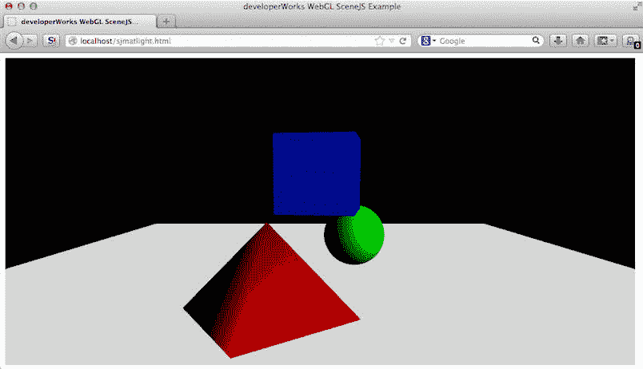

matlight.html 和 sjmatlight.html 的运作几乎相同。可能比较明显的一个区别是，SceneJS 没有内在的阴影效果。SceneJS 专长于阴影效果不太重要的工程和医疗应用程序（而不是游戏或室内设计应用程序）。

SceneJS 中的一些基元通过可选的插件加载。清单 15 显示了插件目录位置的配置。

##### 清单 15\. 包含 SceneJS 核心和插件

```
{
<!DOCTYPE html>
<html lang="en">
<head>
    <title>developerWorks WebGL SceneJS Example</title>
    <meta charset="utf-8">

    <script src="./scenejs.js"></script>

<script>
    SceneJS.setConfigs({
        pluginPath:"./plugins"
    });
    ... 
```

清单 16 显示了 sjmatlight.html 中创建用于观看场景的透视摄像机的代码。在这里，同样创建一个节点树，其中的 3 个自旋对象的分组是摄像机的一个子节点。

##### 清单 16\. SceneJS 中的透视摄像机

```
function setUp() {
   scene = SceneJS.createScene({
      canvasId: "shapecanvas2",
      nodes:[
          {
              type:"lookAt",
              eye:{ y:1, z:10 },
              look:{ x:0, y:0, z:0 },
              nodes:
           [
              { type:"camera",
                optics: {
                  type: "perspective",
                  fovy: 45.0,
                  aspect: 1024/500,
                  near: 0.10,
                  far : 100

                },
                nodes: [sceneNodes]
              }

            ]
          }
          ]
      }); 
```

定义了一个方便的函数 `rotateObject()` 来旋转对象。每个可旋转的对象使用一个 ID 进行标记，该 ID 可在运行时直接用于寻址。清单 17 给出了 `rotateObject()` 函数。

##### 清单 17\. SceneJS 中按 ID 进行的对象旋转

```
 function rotateObject(id, degreeInc) {
    scene.getNode(id,  function (obj) {
                var angle = 0;
                scene.on("tick",
                  function () {
                        angle = angle + degreeInc;
                        obj.setAngle(angle);
                });
            });
   }
...
   rotateObject("cube1", 1);
   rotateObject("sphere1", 1);
   rotateObject("pyramid1", 1);
   rotateObject("multi", - 0.25); 
```

## 结束语

Three.js 和 SceneJS 都是成熟且功能强大的 WebGL 库，每个库都具有自己的优点和缺点。Three.js 擅长一般用途的 3D 开发，提供一系列令人惊叹的基元、效果和模型加载器。SceneJS 更适合创建数据驱动的、复杂的、动态变化的场景图。

Three.js 和 SceneJS 等库大大简化了 WebGL 编程，这只是一种保守的说法。从本文和 第 1 部分 ，您应该清晰地认识到，没有库的帮助，原始的 WebGL 开发是一种不切实际的行为。作为 JavaScript 开发人员，您很幸运在手头拥有过去 40 年的 3D 硬件和软件研发的结晶。要在 3D 和 WebGL 领域富于创意和富有成效，您只需一个浏览器和一个文本编辑器。

在第 3 部分中，您将开始通过 3D 场景与用户交互，并探讨一些可能的应用。

本文翻译自：[Code less, do more with WebGL libraries](https://developer.ibm.com/tutorials/wa-webgl2/)（2014-01-21）