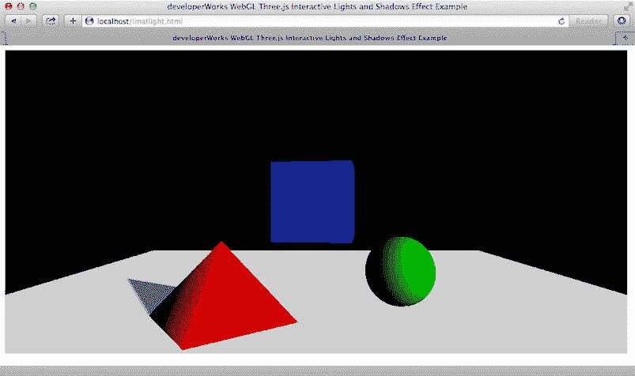
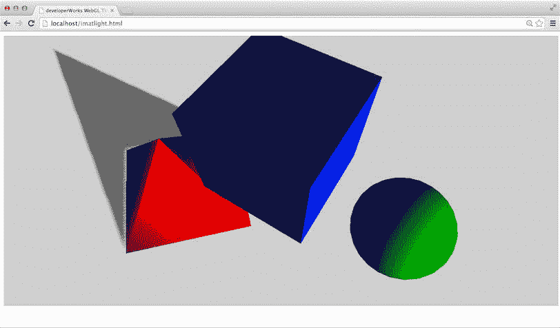
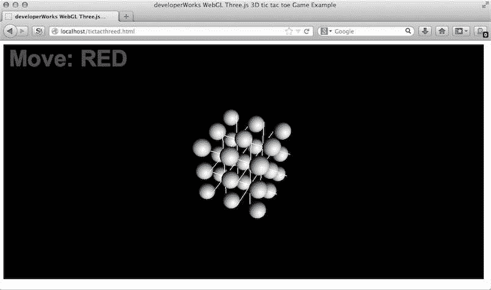
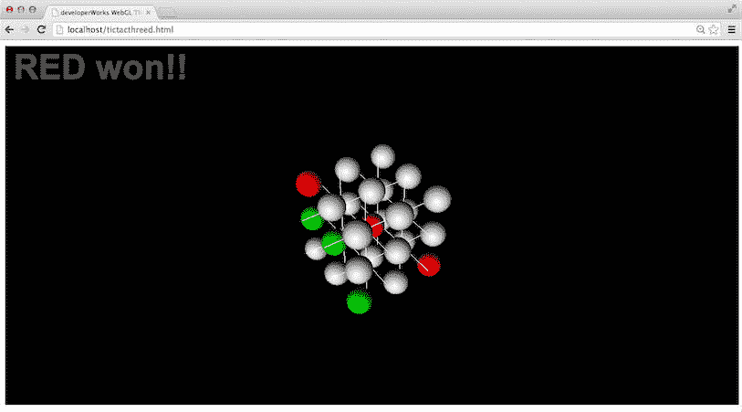
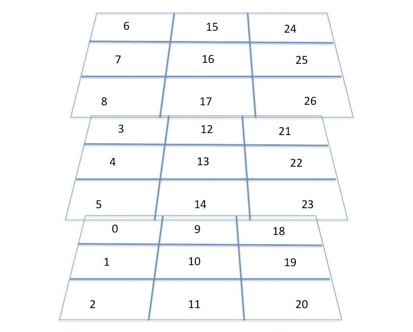
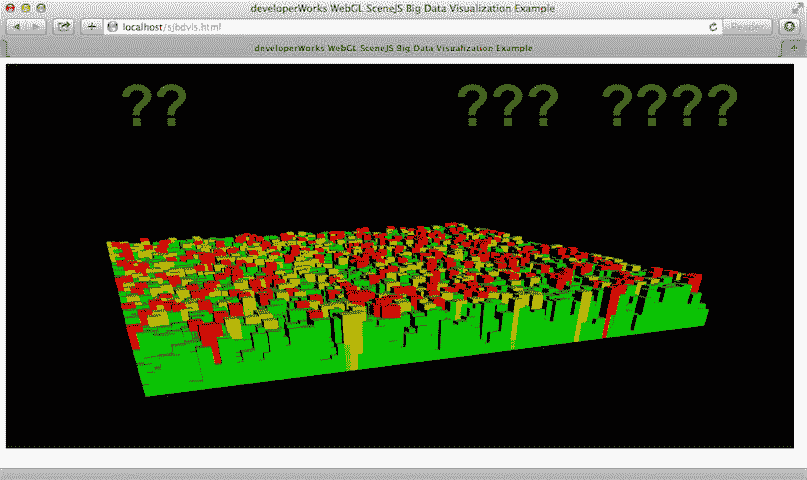
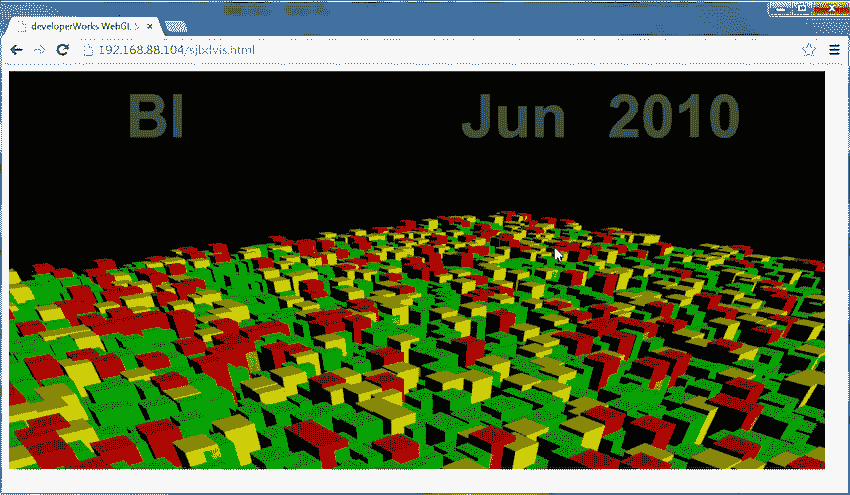
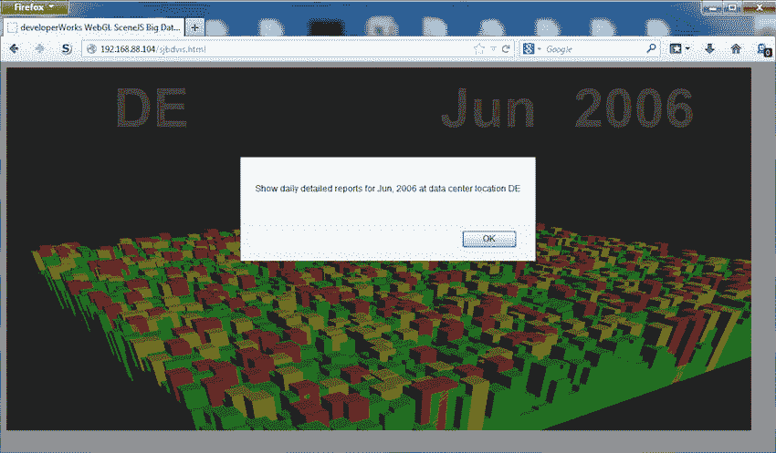

# 添加用户交互

> 原文：[`developer.ibm.com/zh/tutorials/wa-webgl3/`](https://developer.ibm.com/zh/tutorials/wa-webgl3/)

硬件加速的 3D 性能是目前每一个 JavaScript 开发都关注的事情，因为桌面和移动浏览器中对 WebGL 的支持几乎无处不在。在此 WebGL 系列的 第 2 部分 ，我们使用了以下两个高级别的 WebGL 库进行实验：Three.js 和 SceneJS。您看到了这些库如何通过简单的、概念性的纯 API 来封装原始 WebGL 开发的复杂性，并实现快速的 3D 开发。您学习了如何：

*   用 10 行 Three.js 代码而不是 100 行原始 WebGL 来旋转金字塔
*   通过 Three.js 类利用面向对象的设计，迅速克隆 3D 对象，并创建可以显示多个运动中对象的场景
*   使用 Three.js 学习基本的 3D 概念，包括场景图、网格、素材、灯光和摄像机的放置
*   创建场景中的轮廓式对象的动画
*   通过编程实现一个组合了多种运动的场景 — 对象固有的运动和整组对象的运动
*   通过运用灯光和阴影效果，创建激动人心的场景
*   使用照片般逼真的纹理，通过纹理贴图增加被渲染对象的真实感
*   使用 Three.js 几何形状 API 来生成不规则形状的 3D 几何图形
*   处理 3D 对象的偏心旋转
*   从在线 3D 仓库/存储库中获得复杂的、渲染就绪的预制 3D 网格和纹理，并将它们包含在您的 3D 场景中
*   通过动画补间（tweening）功能来规划多区域 3D 空间的飞行可视化，为其划分阶段和编写代码，并通过 easing 函数来增强效果
*   使用 SceneJS 库轻松创建复杂的 3D 场景图形，并对比 SceneJS 的设计与 Three.js 库

立刻创建 3D 应用程序和数据可视化，将目前所学的技巧付诸于实践。此系列的最后这一篇文章将介绍 3D 用户交互的一些概念和技术，然后引导您完成两个 3D 应用程序的开发：一个完整的 3D 井字过三关游戏，以及一个交互式数据可视化用户界面。[获取示例代码](http://public.dhe.ibm.com/software/dw/web/wa-webgl3/webGL3dl.zip)

在本文结束时，您就会掌握在您即将到来的 Web 开发项目中应用 WebGL 和处理 3D 需求的足够知识。

3

## D 场景的用户交互

在此文章系列中，目前为止已经构建了包含 3D 动画对象和移动摄像机（飞过或走过）的场景，但使用的都是用户不能参与的预先编程的动作。用户体验一直类似于观看视频。在实践中，许多 3D 应用程序（以及其他许多游戏和数据可视化）需要与用户进行交互。

利用 Three.js 等高层次的 WebGL 库来增加用户交互可能非常简单。在浏览器中加载 imatlight.html。这是 第 2 部分 中提供的灯光和阴影效果示例（matlight.html），添加了摄像头位置的 3D 用户控制。图 1 显示了由 imatlight.html 渲染的场景。

##### 图 1\. 可与用户进行交互的 3D 场景（在 OS X 上的 Safari 中）



开始与场景进行交互。通过使用鼠标，您可以：

*   水平或垂直平移场景：单击并按住鼠标右键，同时移动鼠标。
*   进入或离开场景，以显示更多或更少的细节：单击并按住鼠标滚轮（或中心），同时移动鼠标。您也可以通过转动鼠标滚轮来实现同样的效果。
*   围绕场景运动，保持与场景的当前距离：单击并按住鼠标左键，同时移动鼠标。

通过这些运动和一些练习，您应该能够有效地、快速地在 3D 渲染的场景中实现导航。

图 2 显示了进行一些交互后的 imatlight.html。您将从完全不同的角度查看图 1 的场景。

##### 图 2\. 进行用户交互后的另一个角度的 imatlight.html（在 OS X 上的 Chrome 中）



清单 1 显示了 imatlight.html 的代码。突出显示的行是添加到 matlight.html（来自 第 2 部分 ）的代码，用于将用户交互融入到场景中。

##### 清单 1\. 与 3D 场景 (imatlight.html) 进行交互

```
<!doctype html>
<html>
<head>
<title>developerWorks WebGL Three.js Interactive Lights and Shadows Effect Example</title>
  <script src="Three.js" ></script>
  <script src="js/controls/OrbitControls.js"></script>

  <script type="text/javascript">

  function draw3D()  {
    var controls;

    function animate() {
      requestAnimationFrame(animate);

      pyramid1.rotateY(Math.PI/180);
      sphere.rotateY(Math.PI/180);
      cube.rotateY(Math.PI/180);
      multi.rotateY(Math.PI/480);
      renderer.render(scene, camera);
    }
    function updateControls() {
      controls.update();
    }

    var geo = new THREE.CylinderGeometry(0,2,2,4,1, true);
    var pyramid1 = new THREE.Mesh(geo, new THREE.MeshPhongMaterial({color:0xff0000}));
    pyramid1.position.set(-2.5, -1, 0);

    geo = new THREE.SphereGeometry(1, 25, 25);
    var sphere = new THREE.Mesh(geo, new THREE.MeshPhongMaterial({color:0x00ff00}));
    sphere.position.set(2.5, -1, 0);

    geo = new THREE.CubeGeometry(2,2,2);
    var cube = new THREE.Mesh(geo,new THREE.MeshPhongMaterial({color:0x0000ff })   );
    cube.position.set(0, 1, 0);

    var camera = new THREE.PerspectiveCamera(  45, 1024/500,0.1, 100);
    camera.position.z = 10;
    camera.position.y = 1;

    controls = new THREE.OrbitControls( camera );
    controls.addEventListener( 'change', updateControls );

    var multi = new THREE.Object3D();
    pyramid1.castShadow = true; sphere.castShadow = true;
    multi.add(cube);
    multi.add(pyramid1);
    multi.add(sphere);
    multi.position.z = 0;

    geo = new THREE.PlaneGeometry(20, 25);
    var floor = new THREE.Mesh(geo, new THREE.MeshBasicMaterial({color :0xcfcfcf}));
    floor.material.side = THREE.DoubleSide;
    floor.rotation.x = Math.PI/2;
    floor.position.y = -2;
    floor.receiveShadow = true;

    var light = new THREE.DirectionalLight(0xe0e0e0);
    light.position.set(5,2,5).normalize();
    light.castShadow = true;
    light.shadowDarkness = 0.5;
    light.shadowCameraRight = 5;
    light.shadowCameraLeft = -5;
    light.shadowCameraTop = 5;
    light.shadowCameraBottom = -5;
    light.shadowCameraNear = 2;
    light.shadowCameraFar = 100;

    var scene = new THREE.Scene();
    scene.add(floor);
    scene.add(multi);
    scene.add(light);
    scene.add(new THREE.AmbientLight(0x101010));

    var div = document.getElementById("shapecanvas2");

    var renderer = new THREE.WebGLRenderer();
    renderer.setSize(1024,500);
    renderer.setClearColor(0x000000, 1);
    renderer.shadowMapEnabled = true;
    div.appendChild( renderer.domElement );
    animate();

  }

</script>

</head>
<body onload="draw3D();">

  <span id="shapecanvas2" style="border: none;" width="1024" height="500"></span>

  <br/>
  </body>

</html> 
```

### 面向 Three.js 的 OrbitControls API

在 Three.js 中，是通过 OrbitControls.js API 来支持鼠标交互的，该 API 位于 Three.js 源代码树的 examples/js/controls 目录。因为不是所有 3D 应用程序都要求用来与其他一些硬件设备进行交互的用户交互、OrbitControls 和其他 API 是可选的库。TrackballControls.js 通过一个轨迹球支持用户交互。FirstPersonControl.js 支持许多第一人称视角（FPV）游戏玩家所熟悉的用户交互模式。FlyControl.js 支持飞行模拟器式摄像机控制，支持滚动和俯仰。OculusControls.js 通过 Oculus Rift 支持用户交互，Oculus Rift 是一个仍在开发中（并备受期待）的、精密的消费者头部跟踪沉浸式虚拟现实设备。

OrbitControls 的工作原理是在 3D 场景内与鼠标输入一致地移动摄像机的位置。下面的两行代码举例说明了该控制，并使用来自 3D 场景的摄像机将其参数化：

```
controls = new THREE.OrbitControls( camera );
controls.addEventListener( 'change', updateControls ); 
```

OrbitControls `change` 侦听器对 `updateControls()` 函数进行了回调，该函数的定义是：

```
function updateControls() {
  controls.update();
    } 
```

在 imatlight.html 3D 场景中， `animate()` 回调函数已经通过一个 rAF 钩在刷新屏幕时更新对象旋转；这就是为什么 `updateControls()` 只需要调用 `controls.update()` 。如果被渲染的场景是静态的，那么 rAF 不会被钩住，而且只有在检测到控制变化时才会进行渲染。在这种情况下， `updateControls()` 函数还应该调用渲染器的渲染函数来更新场景。

## 设计 3D 游戏

您要开发的下一个项目是一个需要用户交互的完全可玩的 3D 游戏：3D 井字过三关游戏。两名对手玩家持不同颜色的棋子。一个玩家的棋子是红色的，另一个玩家的棋子是绿色的。玩家轮流将自己的棋子放在一个 3x3x3 的立方体 “井字框架（cage）” 里面。三个棋子沿任意维度排成一行的第一个玩家将会获得胜利。这里给出的代码实现了一个电脑玩家（控制红色棋子），您可以与其进行对战。核心 “引擎” 代码是独立的，可以修改为人与人对战的游戏，也许可以通过网络实现对战。

图 3 显示了玩这个游戏用的 3D 立方体。您可以看到 3x3x3=27 个位置，棋子可以放在这些位置上，所有位置都由白球占据。

##### 图 3\. 3D 井字过三关游戏的比赛场地（在 OS X 上的 Firefox 中）



当玩家围绕 “井字框架” 运动，思考下一步操作的时候，鼠标经过的每个可用位置都将变为黄色。然后，玩家可以单击选定的球，提交一步操作，球体就会变为该玩家的颜色。

屏幕上显示的文字指出了这是哪一个玩家的操作，并在其中一个玩家获胜时显示相关文字。图 4 显示了红色代表的计算机玩家的获胜组合，以及最终的屏幕显示。在获得胜利后，可单击屏幕上任意位置来重置游戏。

##### 图 4\. 红色玩家的胜利（在 OS X 上的 Chrome 中）



加载 tictacthreed.html，并自己试着玩一下这个游戏。就像在 imatlight.html 中那样，您可以使用鼠标围绕游戏的井字框架运动。（两个页面都使用了 Three.js OrbitControls API。）计算机玩家并不是特别聪明，您可以很轻松地赢得游戏。在游戏结束时，单击任意位置再次启动一个新游戏。前一次比赛中的失败方在新游戏中可以先走第一步。

在试玩几场比赛后，查看一下 tictacthreed.html 的[源代码](http://public.dhe.ibm.com/software/dw/web/wa-webgl3/webGL3dl.zip)。清单 2 中的代码是 tictacthreed.html 的部分，用于创建放棋子的 3D 游戏井字框架。

##### 清单 2\. 建 3D 游戏井字框架

```
var base = new THREE.Geometry();
for (var z=-1; z<1; z++ ) {
  base.vertices.push(
    new THREE.Vector3(0, 0 ,z), new THREE.Vector3( 3, 0, z ),
    new THREE.Vector3(0, 1 ,z), new THREE.Vector3( 3, 1, z ),
    new THREE.Vector3(1, 2 ,z), new THREE.Vector3( 1, -1, z ),
    new THREE.Vector3(2, 2 ,z), new THREE.Vector3( 2, -1, z )
  );
}
for (var x=1; x<3; x++ ) {
  base.vertices.push(
    new THREE.Vector3(x, 1 ,1), new THREE.Vector3( x, 1, -2 ),
    new THREE.Vector3(x, 0, 1), new THREE.Vector3( x, 0, -2 )
     );
}
var  cage = new THREE.Line(base, new THREE.LineBasicMaterial(), THREE.LinePieces );
cage.position.set(-1.5,-0.5, 0.5); 
```

共有 12 条相交的直线形成这个井字框架。前四条线在 x-y 平面上。第二组的四条线的结束坐标与第一组的相同，但其 z 分量是 -1，而不是 0。最后四条线包含两组线条，它们的结束坐标除了 x 值外都一样。使用 `THREE.Line` 构造函数创建由线 “段”（彼此没有连接的线段）组成的 `cage` 。在构造函数后面，转换已完成的 `cage` ，让它的中心位于原点（0,0,0）上。

### 生成标志着游戏位置的球体

为了生成用于标志可用位置的白色球体，tictacthreed.html 使用了清单 3 中所示的迭代代码。

##### 清单 3\. 生成白色球体

```
var geo = new THREE.SphereGeometry(0.3, 25, 25);
var range = [-1, 0, 1];
var idx = 0;
    range.forEach(function(x) {
    range.forEach(function(y) {
    range.forEach(function(z) {
var tempS = new THREE.Mesh(geo, new THREE.MeshPhongMaterial({color:0xffffff}));
    tempS.ID = idx++;
    tempS.claim = UNCLAIMED;
    pos.push(tempS);
    tempS.position.set(x, y, z);
    scene.add(tempS);
    })
  )

}); 
```

##### 计算机玩家的实现

通过 `redComputerMove()` 函数实现计算机玩家。每当轮到红色玩家的时候，都会调用 `redComputerMove()` 来走一步。这个函数首先会在 `wins` 数组中扫描所有获胜组合，以确定它是否能够在下一步中获胜。如果不能，那么它会重新扫描组合，以确定它是否必须阻止绿色玩家即将出现的胜利（因为绿色已占据一个获胜组合中的两个位置，剩下一个还没有人占据）。由 `countClaim()` 辅助函数协助完成获胜组合的扫描。如果 `redComputerMove()` 不能赢，也不需要进行阻止，那么它会通过遍历 `preferred` 位置数组来确定下一步的行动，或者占据第一个可用的无人占据的位置。按照这一策略，计算机会 “合理” 地进行下棋，但无法赢得每一场比赛。当然，您可以改进游戏策略。

球体的直径都是 0.6（半径为 0.3），因此用户可以透过井字框架看到它们。清单 3 中的代码创建了白色球体，并将它们放置到所有 27 个可玩的位置。需要注意的是，虽然所有 27 个球体都使用相同的几何对象（这些对象被命名为 `geo` ）进行网状构造，但每个球体都有一个单独的实例 `THREE.Material` 。这是必需的，因为代码会在后面的操作中单独更改每个球体的颜色。如果所有的网格实例都引用了同一个素材，那么所有球体都将同时改变颜色。

清单 3 的代码还建立了一个名为 `pos` 的数组，它引用 27 个网格，一个球体引用一个网格。胜者决定算法使用了 `pos` 数组来检查是否有玩家已经获胜（并重置游戏）。计算机玩家的代码也会大量使用 `pos` 数组来确定计算机玩家目前是否正在受到威胁，或者是否应该走出攻击性的一步。

每个球体网格对象都有一个额外的属性，名为 `claim` ，该属性被初始化为 `UNCLAIMED` 。当用户在相关的可玩位置/球体提交一步操作时，该属性被更改为 `RED` 或 `GREEN` 。

图 5 显示了由 清单 3 的代码生成的游戏位置的编号方案。每个数字代表该游戏位置（球体网格）在所生成的 `pos` 数组中的索引。胜者决定算法使用了这些指标集来判断玩家是否获胜。

##### 图 5\. 游戏位置编号方案



### 决定胜方

游戏中有 49 个可能的获胜组合，每个组合有三个位置。您可以根据图 5 手动枚举这些组合。

在 tictacthreed.html 中， `wins` 数组包含了所有获胜组合的枚举。为了判断某个玩家是否获胜， `checkWin(playerColor)` 函数将会遍历每个组合，并检查组合中的所有三个球体是否使用了玩家的颜色。通过检查组合中的每个球体的 `claim` 属性来确定胜方；当玩家单击选中的球体时，该属性被设置为该玩家的颜色。清单 4 显示了 `checkWin()` 的代码。

##### 清单 4\. `checkWin()` 函数

```
function checkWin(color) {
    var won = false;
    var breakEx = {};
    try {
     wins.forEach( function(wincomb) {
      var count = 0;
      wincomb.forEach( function (idx) {
        if (pos[idx].claim == color)
           count++;
      })
      if (count === 3) {
        won = true;
        throw breakEx;

      }

    })
   } catch (ex) {
    if (ex != breakEx) throw ex;

   }
    return won;

} 
```

在清单 4 突出显示的代码中，在确定胜方后， `checkWin()` 通过抛出一个异常来切断 `forEach()` 循环，并将 `true` 状态返回给调用程序。

### 使用 2D 鼠标在 3D 场景中拾取对象

3D 的另一个重要的用户交互技术是 *对象拾取* ，即 3D 场景中的对象选择。在井字过三关游戏中，输入设备是一个 2D 鼠标。用户实际单击的是在其中渲染 3D 场景的画布。因为当用户周绕场景运动时，渲染会发生变化，必须将鼠标的 2D 坐标动态地（在鼠标单击时）映射到场景的三维坐标空间，以确定哪些对象被选中。

在 2D 图形中，通过 *命中测试* 来执行鼠标选择。对象拾取是 3D 中的一种命中测试形式。Three.js 通过提供一个 `projector` 辅助程序来简化对象拾取，它可以从 2D 画布 (x,y) 点过渡到场景的 3D 世界，同时还会考虑到当前摄像机的属性（摄像机所指的方向和角度等）。

Three.js 也有一个 `RayCaster` 类，可以将光线投射到 3D 场景中，并确定光线是否与场景中指定的 3D 对象集合相交。

在井字过三关游戏中，在屏幕更新期间执行命中测试。鼠标移动事件侦听程序会将鼠标的 x 和 y 坐标保存为一个全局变量。

在命中测试中，与 `Raycaster` 相交的第一个对象用黄色 (RGB Hex 0xffd700) 突出显示，告诉用户该位置是可用的。清单 5 显示了执行这一命中测试的 tictacthreed.html 中的代码。

##### 清单 5\. 命中测试

```
function updateControls() {

var vector = new THREE.Vector3( mouse.x, mouse.y, 0.5 );
    projector.unprojectVector( vector, camera );
var ray = new THREE.Raycaster( camera.position,
    vector.sub( camera.position ).normalize() );
var hits = ray.intersectObjects( pos );

    if (mouse.clicked)  {
     ...
    }
    else { /* mouse move */
     if ( hits.length > 0 )
     {
        ...
     }
     else
     {
      ...;

     }
   }

} 
```

##### 图形 sprite

图形 *sprite* 是在 2D 图形动画中使用的基本元素。它们一般是经过优化的预渲染图形的矩形块，用于在 2D 加速的硬件平台上快速显示和动画。在 3D 渲染的上下文中，*sprite* 指含有 2D 绘图/图形的矩形平面 2D 几何图形，比如在 3D 场景中的 2D 文本标签。

在执行命中测试后，`hits` 变量包含 `THREE.RayCaster` 在场景内发现相交的球体的列表（来自 `pos`）。如果列表不为空，那么所返回的数组中的第一个对象就是第一个与投射光线相交的对象（”最上面的” 球体）。

当用户单击一个可玩的位置时，在该位置上的球体就会变成玩家的颜色。该球体的 `claim` 属性也被更新，以反映玩家所走的这一步。清单 6 显示 tictacthreed.html 的相关部分。

##### 清单 6\. 更新球体的属性

```
function updateControls() {

      var vector = new THREE.Vector3( mouse.x, mouse.y, 0.5 );
       projector.unprojectVector( vector, camera );
      var ray = new THREE.Raycaster( camera.position,
            vector.sub( camera.position ).normalize() );
      var hits = ray.intersectObjects( pos );
      if (mouse.clicked)  {
      if ( hits.length > 0 )
      {

        hits[0].object.material.color.setHex((currentMOVE == RED) ?0xff0000 :0x00ff00);
        hits[0].object.claim = currentMOVE;
        updateWin(currentMOVE);

}

      mouse.clicked  = false;
    }
    else {
    ...
    } 
```

### 在 3D 场景上显示 2D 屏幕上的状态

##### 3D 中的公告板

如果要显示 3D 场景中的文本标签，而不是叠加它，那么您可以通过 Three.js 使用公告板。*公告板* 是在 3D 渲染中使用的技术，用于显示无论摄像头放置在何处都要一直面对观众的标志或图形 sprite。公告板通常用来在 3D 可视化中标记场景内对象（例如，3D 渲染的人体器官），以确保观众能够在导航场景时读取标签。

如您所知，所有 3D 场景都被渲染为 HTML5 画布元素中的 2D 图像序列。为了对屏幕上的状态显示实现半透明的 2D 文本叠加效果，可以创建一个含半透明文本的 CSS3 样式的 DOM 元素（如 `<div>` 或 `<span>` ），并将它放置在用来渲染 3D 场景的画布元素的顶部。

对于游戏的屏幕上的状态显示，tictacthreed.html 使用了 CSS 和 HTML DOM 操作，而且不包含 WebGL 调用。清单 7 显示了相关的代码。

##### 清单 7\. 状态显示代码

```
var gamestatus = document.createElement('div');
gamestatus.setAttribute("id", "status");
gamestatus.style.cssText =
  "position:absolute;width:300;height:200;color:rgba(255,255,255,0.3);" +
  "background-color:rgba(0,0,0,0);top:10px;" +
  "left:20px;font:bold 48px arial,sans-serif";
gamestatus.innerHTML = "Move:RED";
div.appendChild(gamestatus); 
```

清单 7 显示了如何通过编程创建样式化的 `<div>` ，并将它添加到渲染画布。 `id` 属性也被添加到 `<div>` 元素，以便为它提供一个 `status` ID。

现在您可以通过修改 `<div>` 的 `innerHTML` 属性随时更新屏幕上的状态。在游戏中用于更新屏幕上的状态的典型代码是：

```
document.getElementById("status").innerHTML = "new status message"; 
```

### 重置游戏

在确定胜方后，全局 `gameWon` 变量被设置为 `true` 。当游戏处于这种状态时，随后的鼠标单击被切断，以便调用 `resetGame()` 函数，如清单 8 所示。

##### 清单 8\. 重置游戏的代码

```
function resetGame() {
    pos.forEach( function(position) {
    position.claim = UNCLAIMED;
    position.material.color.setHex(0xffffff);
    document.getElementById("status").innerHTML =
                 ((currentMOVE == RED) ?"Move:GREEN" :"Move:RED");
    currentMOVE = ((currentMOVE == RED) ?GREEN:RED);

  });
 }
  ...

function updateControls() {
    ...
    if (mouse.clicked)  {
      if (gameWON) {
        resetGame();
        gameWON = false;
        mouse.clicked = false;
        return;
      }
      if ( hits.length > 0 )
      {
       ... 
```

`resetGame()` 函数将所有可玩的位置再次修改为 `UNCLAIMED` ，并将所有球体的颜色恢复为白色。它还会更新屏幕上的显示，让游戏的失败方在新游戏中先走第一步。

现在是时候继续下一个示例了，您可以尝试使用 SceneJS 框架创建一个 WebGL 应用程序。

## 创建一个 3D 大数据导航用户界面的原型

用户在 Web 上或移动设备上所熟悉的数据导航界面大多数是 2D 的。每个用户都知道如何使用滚动列表、下拉组合框和切换按钮等 UI 元素。在过去的几十年中，图形用户界面在这方面的变化不大。现在，利用无所不在的 3D 的可用性，您可以尝试设计以 3D 为中心的新数据导航用户界面，让手头的应用程序显得更自然。

下一个示例将会探讨跨多个数据轴导航大型数据源的用例。原型用户界面支持超过 10,000 个综合数据点的一览导航 — 每个点代表 100 个数据中心的超过 100 个月（近 9 年）的每月汇总指标。图 6 显示了这个原型 sjbdvis.html（参见[示例代码](http://public.dhe.ibm.com/software/dw/web/wa-webgl3/webGL3dl.zip) ）的实际应用。

##### 图 6\. 导航大数据集的 3D UI 原型（在 OSX 上的 Safari 中）



在图 6 中，用户界面包括在 x-z 平面上的两个轴。在一个轴上放置数据中心位置的名称（范围从 AA 到 AZ、BA 到 BZ、CA 到 CZ、DA 到 DV），总共有 100 个地点。在另一个轴上是综合指标的日期，范围从 2004 年 1 月至 2012 年 4 月，总共是 100 个月。

### 快速在超过 10,000 个综合数据点之间导航

为每个（月份，数据中心）组合渲染一个 3D 矩形条，共 10,000 条。每个矩形条的值的范围可以是从 1 到 100。

设置两个阈值，用于确定被渲染的矩形条的颜色。除非矩形条的值超过 `HighThreshold` ，否则矩形条被渲染为绿色。若矩形条的值介于 `HighThreshold` 和 `PeakThreshold` 之间，那么矩形条被渲染为黄色。当它的值高于 `PeakThreshold` 时，矩形条被渲染为红色。您可以想像 `PeakThreshold` 红色矩形条可能表明一个值得进一步研究的特殊情况。

如果能够可视化相邻个月（矩形条）的相对值（高度），那么可以帮助识别数字报告、2D 图形或热图不可能传达的特定趋势或状况。如果能够可视化数据中心位置之间的相对差值，也会给分析和调查提供帮助。

您可以使用鼠标在 3D 中围绕显示运动（就像用 imatlight.html 实现的那样），更仔细地查看数据集的所有部分。

如图 7 所示，当鼠标移过 sjbdvis.html 中的矩形条时，一个大的叠加屏幕显示提供了关于当前月份和年份的反馈，以及所选中的数据中心的名称。

##### 图 7\. sjbdvis.html 与屏幕上的反馈显示（在 Windows 上的 Chrome 中）



当您找到需要进一步调查的有问题的数据点时，可以单击它来获取该月份的每日详细报告。（在这个原型中，没有实际的可用数据。）系统会提供一个弹出窗口，其中显示了月份、年份，以及应为其提取该报告的数据中心，如图 8 所示。

##### 图 8\. 单击 sjbdvis.html 中的数据条（在 Windows 上的 Firefox 中）



清单 9 中突出显示的代码显示了如何为原型随机生成数据集（模拟 10,000 个综合数据点）。

##### 清单 9\. 生成数据集

```
<!DOCTYPE html>
<html lang="en">
<head>
    <title>developerWorks WebGL SceneJS Big Data Visualization Example</title>
    <meta charset="utf-8">
    <script src="./scenejs.js"></script>
<script>
  var mouse = {x:0, y:0, updated: false, clicked: false};
  var monthLabels =
   ["Jan","Feb","Mar","Apr","May","Jun","Jul","Aug","Sep","Oct","Nov","Dec"];
  var yearLabels =
   ["2004","2005","2006","2007","2008","2009","2010","2011","2012","2013"];
  var PeakThreshold = 97;
  var HighThreshold = 93;

   var data = [];
   var node2Data = {};

   function initData() {
     for (var dim=0; dim<100; dim++)  {
        var axis = [];
        var datacenter = String.fromCharCode(65 + Math.floor(dim /26)) +
            String.fromCharCode(65 + (dim % 26));
        for (var i=0; i<100; i++) {
            var val = Math.floor(Math.random() * 100 + 1);
            var dpoint = {
               location: datacenter,
               year: yearLabels[ Math.floor(i /12)],
               month: monthLabels[ i % 12],
               value: val};

            axis.push(dpoint);
        }
        data.push(axis);

     }
   }
... 
```

这些数据被创建为一个 JavaScript 对象数组，其名称为 `data[]` 。每个数组元素都具有以下结构：

```
{
   location:datacenter location,
   year:year,
   month:month,
   value:value of metrics
} 
```

在生产中，可以从后端数据源中获取此数据。

在 sjbdvis.html 中，屏幕上的显示信息在您使用 UI 时被动态更新。该显示包含叠加在 3D 场景上的半透明 2D 文本，该文本是使用前一个例子中所示的相同技术创建的。

### SceneJS 实现大数据驱动的可视化

sjbdvis.html 是使用 SceneJS 构建的。正如您从本系列的 第 2 部分 所了解的那样，SceneJS 可以渲染非常复杂的场景，并擅长处理数据驱动的应用程序。要被渲染的网格可以在 JSON 兼容的 JavaScript 对象节点的 SceneJS 场景图（树）中定义，然后由 SceneJS 解析和渲染。在对场景图进行解析后，与每个网格相关联的 ID 都可以用于访问和操作该网格，操作方式类似于动态 HTML5 编程。SceneJS 的这一方面使得它适用于大数据可视化应用程序。

“核心” 场景图 `coreScene` 是静态定义的，包含一个简单的定向光，从左上方指向被渲染的网格。灯光的 `id` 是 `lights1` 。此 ID 使得用户可以直接从代码访问节点。清单 10 显示了 `coreScene` 的代码。

##### 清单 10\. `coreScene` 定义

```
var coreScene = {
     nodes:[
         {
             id:"light1",
             type:"lights",
             lights:[
                         {
                             mode:"dir",
                             color:{ r:1.0, g:1.0, b:1.0 },
                             diffuse:true,
                             specular:true,
                             dir:{ x:-5, y:-2, z:-5 },
                             space:"view"
                         }
             ]

         }
     ]
};; 
```

### 以编程方式创建一个包含 10,000 个矩形条的场景

以编程方式在 `light1` 下创建和插入子节点，根据空 `coreScene` 创建最后包含 10,000 个矩形条的场景。

首先，使用场景的异步 `getNode()` 方法调用来定位 `light1` 节点。在找到 `light1` 节点后，使用其 `addNode()` 方法，一次创建一个矩形条，并将它作为子节点添加到 `light1` 。清单 11 显示用于添加子节点的代码。

##### 清单 11\. 将矩形条添加到 `light1` 节点

```
scene.getNode("light1", function(light) {
   var zpos = 0;
   data.forEach(function(dim) {
     zpos++;
     var xpos = 0;
     dim.forEach(function(dpoint) {
       var curVal = dpoint["value"];
       var curColor = ((curVal > PeakThreshold) ?{ r:1, g:0, b:0} :
          ((curVal > HighThreshold) ?{r:1, g:1, b:0} :{r:0, g:1, b:0}));
       var nodeName = "n" + zpos + "m" + xpos ;
       node2Data[nodeName] = dpoint;
       light.addNode(
           { type:"name",
             name: nodeName,
             nodes:[
                {
                type:"material",
                color: curColor,
                nodes:[   {
                         type:"translate",
                         y: curVal/10,
                         x: xpos++,
                         z: zpos,
                         nodes:[
                         {
                          type:"prims/box",
                          xSize:1,
                          ySize: curVal/10,
                          zSize:1
                         }
                         ]
                     }
                     ]
                   }
                   ]
                 }
           );
       });  // dim.forEach
   });  // data.forEach
});  // scene.getNode("light1") 
```

清单 11 中突出显示的代码显示了所创建的每个 3D 矩形条的节点结构。每个矩形条都是一个 SceneJS 的原语多维数据集几何形状（prims/box）的一个实例，并且一个包装程序 `material` 节点为它提供了颜色。使用一个 `translate` 节点将它放到所要求的位置。表 1 总结了关键字段以及如何确定它们的值。

##### 表 1\. 创建每个 3D 矩形条时使用的关键字段

| 节点类型 | 字段 | 描述 |
| --- | --- | --- |
| Name | `name` | `name` 节点用于实现每个节点的 “拾取”（或 3D 选择）。每个矩形条的惟一名称是用算法根据 x-z 平面上的矩形条位置来生成的。 |
| Material | `color` | `material` 节点为每个矩形条提供其独有的颜色。颜色用于渲染通过相关联的数据点 `dpoint["value"]` 的值确定的矩形条。 `HighThreshold` 和 `PeakThreshold` 用于确定是使用绿色、黄色还是红色。 |
| Translate | `x` | 在日期/时间序列中每绘制一个矩形条，x 坐标增量 1 个单位。每个矩形条被渲染为 x-z 平面上的 1 个单位的正方形，代表一个月份的平均结果。 |
| Translate | `y` | 矩形条的 y 位置通过数据点值 `dpoint["value"]` 来确定。它被除以 10，以缩小范围。 |
| Translate | `z` | 每个数据系列代表一个不同的数据中心，占据一个不同的 z 位置。 |
| prims/box | `ySize` | 矩形条的 `ySize` 位置或高度通过数据点值 `dpoint["value"]` 来确定。它被除以 10，以缩小范围。 |

在生成 3D 矩形条的节点时，该代码还可以填充 `node2data` 散列。在对象拾取过程中，如果节点名称可用，那么可以使用这个散列快速获取数据点信息。您也可以在 SceneJS 节点内创建一个 `data` 字段，以包含该数据。不过，通过检索节点来获得数据需要做的工作并不只是进行散列查找这么简单。

### 在 SceneJS 中的摄像机轨道运动

像在 SceneJS 中的其他对象一样，控制渲染后视图的摄像机是通过 SceneJS 的场景图中的节点来表示的。像 Three.js 一样，SceneJS 支持使用鼠标让摄像机围绕场景运动。要实现相机轨道运动，可使用包含在 SceneJS 分发中的 `type:"camera/orbit"` 插件替代传统相机类型。在 sjbdvis.html 中的场景创建代码封装 `coreScene` （突出显示 — 10,000 个矩形条的场景）与一个轨道运动的摄像机节点：

```
scene = SceneJS.createScene({
        canvasId:"shapecanvas2",
        nodes:
          [
            { type:"cameras/orbit",
              look:{ x:80, y:0 },
              yaw:0,
              pitch:-20,
              zoom:200,
              zoomSensitivity:10.0,
              nodes:[coreScene]
             }
          ]
        }); 
```

如果轨道运动的摄像机节点已经到位，那么实现旋转和缩放的鼠标移动是由 SceneJS 库处理的。`look`、`yaw` 和 `pitch` 字段可用来控制摄像机的初始方向和位置。`zoom` 字段用于确定视图最初看起来离被渲染的场景有多远。

### SceneJS 的对象选取

SceneJS 中已启用对所渲染对象的命中测试的支持。关键是要将每个可拾取对象包装在 `type:"name"` 节点中。在 sjbdvis.html 中渲染的每个矩形条都被包装在具有惟一名称的 `type:"name"` 节点中，因此，可以从场景中拾取它。在 sjbdvis.html 中，当用户将光标移动到被渲染的 3D 矩形条上面时，可使用对象拾取执行屏幕上的状态显示的实时更新。每一个可拾取的 3D 矩形条都有以下包装：

```
{ type:"name",
  name:unique node name,
  nodes:[
    ...
  ]
} 
```

使用以下代码，将当前鼠标位置捕获到画布的 `mousemove` 事件处理程序：

```
canvas.addEventListener('mousemove',
 function(event) {
   mouse = {x: event.clientX, y: event.clientY, updated: false, clicked: false};

 },
 false); 
```

在更新全局鼠标位置/状态变量后，事件处理程序会立即返回，以保持响应灵敏度。当鼠标围绕矩形条移动时，全局 `mouse` 变量将会捕获鼠标的位置和状态。通过以下代码，在 SceneJS 场景刷新 *ticks* 时执行对象拾取和相关的屏幕显示更新：

```
scene.on("tick", function() {
   if (!mouse.updated) {
     scene.pick(mouse.x, mouse.y);
     mouse.updated = true;
   }
}); 
```

在屏幕更新时，根据鼠标的当前保存的位置进行对象拾取。如果用户的鼠标悬停在某个矩形条上（或用户单击其中一个矩形条），那么这个特定矩形条对象将由 SceneJS 运行时拾取，并发出一个 SceneJS `pick` 事件，执行一次回调，以表示该对象被命中：

```
scene.on("pick",
  function (hit) {
    var name = hit.name;
    var datapoint = node2Data[hit.name];
    document.getElementById("dmonth").innerHTML = datapoint["month"];
    document.getElementById("dyear").innerHTML = datapoint["year"];
    document.getElementById("dcenter").innerHTML = datapoint["location"];
    if (mouse.clicked)  {
      //simulate dive into  detailed data
      alert("Show daily detailed reports for " + datapoint["month"] + ", "
        + datapoint["year"] +  " at data center location "
        + datapoint["location"]);
       mouse.clicked = false;
     }

  }); 
```

##### 在 sjbdvis.html 中扩展 SceneJS 的数据驱动的性质

使用 SceneJS 以编程方式修改所渲染的几何形状（基于数据点的值）相对容易一些，这提供了动态更新显示统计数据的可能性。可以设想以下场景：添加一个 “联网的实时数据提要”，以推动 sjbdvis.html 的更新，从而创建一个实时监控控制台，管理 100 个数据中心的多达 100 种不同的指标。

`hit` 回调参数包含由用户（在 `hit.name` 中）选取的 `type:"name"` 的名称。可以使用该名称通过 `nod2data` 映射查找相关的数据点，数据点值被用来更新代表屏幕上的状态显示的 CSS 样式 `<div>` DOM 元素的内容。如果单击鼠标，则会弹出一个警报，显示需要进一步分析的数据点 — 模拟由 UI 生成的数据获取事件。

## 使用其他 3D 输入设备

关于本系列的最后一个示例，还有一点需要注意。PC 鼠标在与 3D 场景交互时就会真正体现出它的落后之处。为了用 3D 线索补充 2D 鼠标输入数据，您必须在拖动鼠标的同时单击多个按钮。理想情况下，通过具有 3D 功能的输入设备可以直接输入 3D 位置信息。

[Leap Motion Controller](https://www.leapmotion.com/) 就是这种设备。这个被广泛使用的设备是一个小型传感器盒，通过 USB 3 连接到您的 PC 或 Mac。通过使用与设备的硬件红外灯及摄像机数组一起工作的一个软件驱动程序检测 3D 位置和手势信息。该设备可以精确地检测手、手指以及在其检测区域范围内的手持工具的位置和运动。

图 9 显示了一个 imatlight.html 版本（[示例代码](http://public.dhe.ibm.com/software/dw/web/wa-webgl3/webGL3dl.zip) 中的名称为 ilpmatlight.html）中的 3D 用户交互，可将它显示在大电视屏幕上，经过修改，可将该版本与 Leap Motion Controller 结合使用。通过在 3D 空间中移动一只手，您可以平移、旋转和缩放在 Three.js 场景中的摄像机，从不同的角度观看场景。

##### 图 9\. 在 3D 中通过 Leap Motion Controller 实现的用户与场景的交互


Leap Motion Controller 的官方 JavaScript 支持软件是 [leapjs](https://github.com/leapmotion/leapjs) 。它包含一个 node.js 服务器，该服务器与本机驱动程序进行通信，并通过 WebSocket 将传感器信息发送到本地 JavaScript（浏览器）客户端。除了 `leapjs` 之外， [threeleapcontrols](https://github.com/torstensprenger/threeleapcontrols) 也是一组与 Leap Motion Controller 和 Three.js 配合使用的摄像机和对象控制。清单 12 显示了 ilpmatlight.html 中的代码更改，用于支持 3D 手位置控制输入。

##### 清单 12\. 将 Leap Motion 3D 输入支持添加到 ilpmatlight.html

```
<!doctype html>
<html>
<head>
  <title>developerWorks WebGL Three.js 3D Interactive Lights
     and Shadows Effect Example with Leap Motion Controller</title>
  <script src="Three.js" ></script>
  <script src="leap.min.js"></script>
  <script src="LeapCameraControls.js"></script>
  <script type="text/javascript">

  function draw3D()  {

     var controls;
    Leap.loop(function(frame) {
      pyramid1.rotateY(Math.PI/180);
      sphere.rotateY(Math.PI/180);
      cube.rotateY(Math.PI/180);
      multi.rotateY(Math.PI/480);
      controls.update(frame);
      renderer.render(scene, camera);
    });

    var geo = new THREE.CylinderGeometry(0,2,2,4,1, true);
    var pyramid1 = new THREE.Mesh(geo, new THREE.MeshPhongMaterial({color:0xff0000}));
    pyramid1.position.set(-2.5, -1, 0);

    ...
    var camera = new THREE.PerspectiveCamera(  45, 1024/500,0.1, 100);
    camera.position.z = 10;
    camera.position.y = 1;

    controls = new THREE.LeapCameraControls(camera);

    var multi = new THREE.Object3D();
    pyramid1.castShadow = true; sphere.castShadow = true;
    ...
    var div = document.getElementById("shapecanvas2");
    var renderer = new THREE.WebGLRenderer();
    renderer.setSize(1024,500);
    renderer.setClearColor(0x000000, 1);
    renderer.shadowMapEnabled = true;
    div.appendChild( renderer.domElement );
  }
  </script>
 </head>
 <body onload="draw3D();">
 <span id="shapecanvas2" style="border: none;" width="1024" height="500"></span>
 <br/>
  </body>
</html> 
```

## 主流 3D 计算的曙光

有整整一代计算机用户从小就开始玩 3D 游戏，他们正准备加入计算主流。他们渴望得到 3D 相关技术带来的新颖的、创新的应用程序，以提高生产率并改进他们的日常计算体验。在这十年中，大量研究资金倾注到了大数据可视化技术、3D 扫描和 3D 打印中 — 也许这是历史上第一次让 3D 中的计算合法化。结合这种趋势与当今移动设备不断增强的 3D 硬件渲染能力（以及能够使用 WebGL 简单而有效地驾驭这种能力），JavaScript 开发人员现在正处于一个令人兴奋的浪潮的最前沿。

本文翻译自：[Add user interaction](https://developer.ibm.com/tutorials/wa-webgl3/)（2014-02-04）