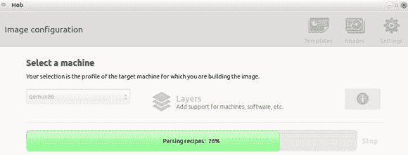
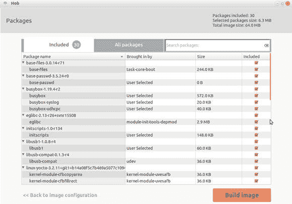
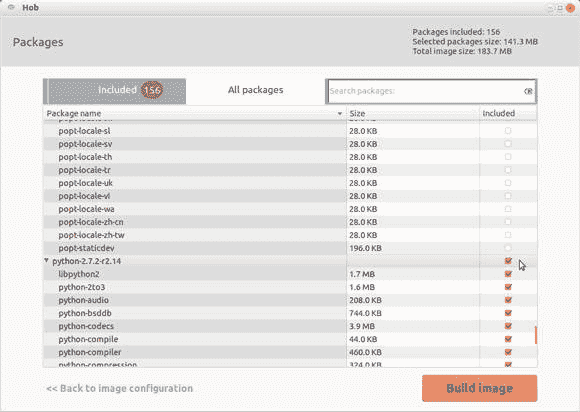
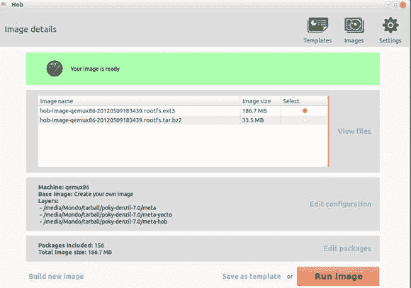
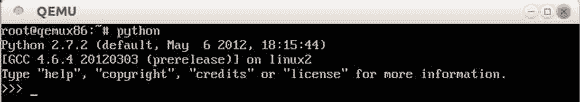

# 使用 Yocto Project 构建自定义嵌入式 Linux 发行版

> 原文：[`developer.ibm.com/zh/tutorials/l-yocto-linux/`](https://developer.ibm.com/zh/tutorials/l-yocto-linux/)

## 概述

Yocto Project 是一个开源协作项目，它提供了一些模板、工具和方法来支持面向嵌入式产品的自定义 Linux 系统，不管硬件架构是什么。我想要告诉那些对 yocto 这个名称不甚理解的用户的是，术语 *yocto* 是最小的 SI 单元。最为一个前缀，yocto 表示 10^-24。

本文将提供一个分步指导，向您介绍如何使用 Yocto Project 的行业标准开源工具为嵌入式设备创建自定义的 Linux 操作系统，并使用 QEMU 在一台虚拟机中启动操作系统。Yocto Project 是由大型硬件公司和操作系统供应商资助的、由 Linux 基金会赞助的开源项目，提供了一些行业领先的工具、方法和元数据来构建 Linux 系统。

Yocto Project 的两大主要组件由 Yocto Project 和 OpenEmbedded 项目一起维护，这两个组件是 BitBake 和 OpenEmbedded-Core，前者是构建引擎，后者是运行构建过程所使用的一套核心配方 (recipe)。下一节会介绍所有项目组件。

## Yocto Project 简介

作为一个协作项目，Yocto Project 有时也称为 “umbrella” 项目，它吸纳了许多不同的开发流程部分。在整个 Yocto Project 中，这些部分被称为 *项目* ，包括构建工具、称为 *核心配方* 的构建指令元数据、库、实用程序和图形用户界面 (GUI)。

### Poky

Poky 是 Yocto Project 的一个参考构建系统。它包含 BitBake、OpenEmbedded-Core、一个板卡支持包 (BSP) 以及整合到构建过程中的其他任何程序包或层。Poky 这一名称也指使用参考构建系统得到的默认 Linux 发行版，它可能极其小 (core-image-minimal)，也可能是带有 GUI 的整个 Linux 系统 (core-image-sato)。

您可以将 Poky 构建系统看作是整个项目的一个参考系统，即运行中进程的一个工作示例。在下载 Yocto Project 时，实际上也下载了可用于构建默认系统的这些工具、实用程序、库、工具链和元数据的实例。这一参考系统以及它创建的参考发行版都被命名为 Poky。您还可以将此作为一个起点来创建您自己的发行版，当然，您可以对此发行版随意命名。

所有构建系统都需要的一个项目是 *工具链* ：一个编译器、汇编程序、链接器以及为给定架构创建二进制可执行文件所需的其他二进制实用程序。Poky 使用了 GNU Compiler Collection (GCC)，不过您也可以指定其他工具链。Poky 使用了一种名为 *交叉编译* 的技术：在一个架构上使用工具链为另一个架构构建二进制可执行文件（例如，在基于 x86 的系统上构建 ARM 发行版）。开发人员常常在嵌入式系统开发中使用交叉编译来利用主机系统的高性能。

### 元数据集

元数据集按 *层* 进行排列，这样一来每一层都可以为下面的层提供单独的功能。基层是 OpenEmbedded-Core 或 `oe-core` ，提供了所有构建项目所必需的常见配方、类和相关功能。然后您可以通过在 `oe-core` 之上添加新层来定制构建。

OpenEmbedded-Core 由 Yocto Project 和 OpenEmbedded 项目共同维护。将 Yocto Project 与 OpenEmbedded 分开的层是 `meta-yocto` 层，该层提供了 Poky 发行版配置和一组核心的参考 BSP。

OpenEmbedded 项目本身是一个独立的开源项目，具有可与 Yocto Project 交换的配方（大部分）以及与 Yocto Project 类似的目标，但是两者具有不同的治理和范围。

### 板卡支持包

BSP 包含为特定板卡或架构构建 Linux 必备的基本程序包和驱动程序。这通常由生产板卡的硬件制造商加以维护。BSP 是 Linux 操作系统与运行它的硬件之间的接口。注意，您也可以为虚拟机创建 BSP。

### BitBake

BitBake 是一个构建引擎。它读取配方并通过获取程序包来密切关注它们、构建它们并将结果纳入可引导映像。BitBake 由 Yocto Project 和 OpenEmbedded 项目共同维护。

### Hob

为了让嵌入式 Linux 开发更容易，Yocto Project 提供了几种不同的图形工作方法。项目的一个较新的添加项叫作 Hob，它向 BitBake 和构建过程提供一个图像前端。两者的开发工作仍在继续，包含社区用户研究。

### 开源许可证合规性

遵守开源许可证是任何 Linux 开发工作的一个极其重要的部分。Yocto Project 的一个目标是尽可能容易地实现合规性。可以极为轻松地使用 Yocto Project 工具来创建清单（甚至构建整个源存储库）和过滤构建过程，用它们排除使用特定许可证的程序包。该项目使用了 Linux 基金会的 “开放遵守计划” (Open Compliance Program)，该计划包含一个 Software Package Data Exchange® (SPDX™ ) 规范。

### EGLIBC

嵌入式 GLIBC (EGLIBC) 是 GNU C Library (GLIBC) 的一个变体，旨在能够在嵌入式系统上运行。EGLIBC 的目标包括减少内存占用、让组件可配置、更好地支持交叉编译和交叉测试。EGLIBC 是 Yocto Project 的一部分，但在它自己的治理结构内加以维护。

### 应用程序开发工具包

应用程序开发工具包 (ADT) 能够让系统开发人员为他们使用 Yocto Project 工具创建的发行版提供软件开发工具包 (SDK)，为应用程序开发人员提供了一种针对系统开发人员提供的软件栈进行开发的方法。ADT 包含一个交叉编译工具链、调试和分析工具，以及 QEMU 仿真和支持脚本。ADT 还为那些喜欢使用集成开发环境 (IDE) 的人提供了一个 Eclipse 插件。

### Yocto Project 旗下的其他工具

属于 Yocto Project 一部分的若干其他工具：

*   **Autobuilder：** 不断自动构建 Yocto Project 工具，启用自动化的 Quality Assurance (QA) 活动。
*   **Cross-Prelink：** 为交叉编译开发环境提供预链接，并改进性能。
*   **Pseudo：** 模拟 root 访问，是构建可引导最终映像的一个不可或缺的部分。
*   **Swabber：** 检测交叉编译版本何时会受到主机组件影响而无法使用。
*   **Build Appliance：** 是一台运行 Hob 的虚拟机，使那些使用非 Linux 版本主机的人能亲眼看到 Yocto Project 进程。（ **注意：** Yocto Project 构建工具目前仅在 Linux 上受支持。）

### 治理和社区

对于任何开源项目来说，一个重要部分是开发和支持其组件的社区。Yocto Project 有一个活跃社区，部分由组织机构组成，包括硬件制造商、操作系统提供商、工具提供商和电子器件制造商，全方位覆盖了嵌入式开发，部分由个人组成，其中许多人为这些组织机构工作。

该项目由有一个首席架构师和一系列维护人员和技术主管（制定所有技术决策）管理。成员组织（很多通常是彼此竞争的）共同协作成立了一个顾问小组，顾名思义，他们的工作是顾问性质的。该小组管理项目资源，包括基础架构、宣传、推广和财务。

## 构建 Linux 发行版

本节将展示如何使用 Poky（参考构建系统）构建一个基本的嵌入式 Linux 系统。这里描述的流程构建参考了发行版以及构建该发行版所需的所有工具。如果您愿意的话，也可以下载预编译好的二进制文件，以避免编译的需要。请阅读 Yocto Project Quick Start Guide（参见 参考资料 ），了解有关的更多信息。

工具本身仅在 Linux 平台上受支持，特别是 Ubuntu、Fedora、CentOS 和 openSUSE。注意，虽然这些系统的最新发行版尚未列入受支持之列，但它们通常是支持该工具的，其他许多 Linux 发行版可能也支持该工具。

如果您的主机系统没有运行 Linux，或者如果您希望不安装任何东西就能继续运作，那么您可以下载 Yocto Project Build Appliance。这台虚拟机预安装了最新的官方 Yocto Project 发行版。Build Appliance 可在 VMWare Player 或 VirtualBox 中运行，并直接启动到 Hob GUI。如果您使用的是 Build Appliance，那么下面的大部分步骤已经完成，您可以直接跳到 测试插件 Hob 一节。不过，我建议您还是阅读一下中间部分的内容，以便了解 Hob 在做些什么。另外，应该阅读 Yocto Project 网站上的一些 Hob 文档，参见 参考资料 。

### 下载 Yocto Project 工具

使用两种方法中的任意一种下载 Yocto Project。确保使用一个至少有 50GB 空闲空间的磁盘。建议空闲空间是 100GB。

*   您可以从 Yocto Project 下载页面下载最新测试完毕的发行版的一个 `tar` 文件。下载 `tar` 文件，然后将其解压到一个目录，如 下载 poky 所示。

##### 清单 1\. 下载 poky

```
 $ wget \
  http://downloads.yoctoproject.org/releases/yocto/yocto-1.2/poky-denzil-7.0.tar.bz2
  $ tar xjf poky-denzil-7.0.tar.bz2
  $ cd poky-denzil-7.0 
```

*   您可以使用 `git` 获取最新发行版（或任何特定分支），尽管主开发分支可能不如 `tar` 文件中测试过的发行版稳定。 使用 git 获取 poky 显示了如何使用 `git` 下载最新版本。

##### 清单 2\. 使用 git 获取 poky

```
 $ git clone git://git.yoctoproject.org/poky.git
  $ cd poky 
```

注意，本例中的子目录简单地使用了 `poky` 这一名称，不带版本号，因为随时可以使用 `git` 更新它。

### 初始化环境

要初始化您的工作环境，请遵循以下步骤：

1.  首先，从您的主机系统的软件库中选择并安装所有必需的开发包。如果已经以前在主机上开发过软件，那么有可能已经安装好了大部分开发包。清单 在 Ubuntu 上安装必备组件 、 在 Fedora 上安装必备组件 、 在 CentOS 上安装必备组件 和 在 openSUSE 上安装必备组件 显示了如何在各种发行版上安装所需的程序包。

##### 清单 3\. 在 Ubuntu 上安装必备组件

```
 $ sudo apt-get install sed wget subversion git-core coreutils \
        unzip texi2html texinfo libsdl1.2-dev docbook-utils fop gawk \
        python-pysqlite2 diffstat make gcc build-essential xsltproc \
        g++ desktop-file-utils chrpath libgl1-mesa-dev libglu1-mesa-dev \
        autoconf automake groff libtool xterm libxml-parser-perl 
```

##### 清单 4\. 在 Fedora 上安装必备组件

```
 $ sudo yum groupinstall "development tools"
        $ sudo yum install python m4 make wget curl ftp tar bzip2 gzip \
        unzip perl texinfo texi2html diffstat openjade \
        docbook-style-dsssl sed docbook-style-xsl docbook-dtds fop xsltproc \
        docbook-utils sed bc eglibc-devel ccache pcre pcre-devel quilt \
        groff linuxdoc-tools patch cmake \
        perl-ExtUtils-MakeMaker tcl-devel gettext chrpath ncurses apr \
        SDL-devel mesa-libGL-devel mesa-libGLU-devel gnome-doc-utils \
        autoconf automake libtool xterm 
```

##### 清单 5\. 在 CentOS 上安装必备组件

```
 $ sudo yum -y groupinstall "development tools"
        $ sudo yum -y install tetex gawk sqlite-devel vim-common redhat-lsb xz \
          m4 make wget curl ftp tar bzip2 gzip python-devel \
          unzip perl texinfo texi2html diffstat openjade zlib-devel \
          docbook-style-dsssl sed docbook-style-xsl docbook-dtds \
          docbook-utils bc glibc-devel pcre pcre-devel \
          groff linuxdoc-tools patch cmake \
          tcl-devel gettext ncurses apr \
          SDL-devel mesa-libGL-devel mesa-libGLU-devel gnome-doc-utils \
          autoconf automake libtool xterm 
```

##### 清单 6\. 在 openSUSE 上安装必备组件

```
 $ sudo zypper install python gcc gcc-c++ libtool fop \
        subversion git chrpath automake make wget xsltproc \
        diffstat texinfo freeglut-devel libSDL-devel 
```

1.  使用所提供的脚本设置您的 shell 环境。运行该脚本之后，您的工作目录是 `build` 子目录，您可以从该位置运行您的版本。

    ```
    $ cd poky
    $ . ./oe-init-build-env 
    ```

2.  检查主配置文件 (conf/local.conf)。默认情况下，建立配置文件是为了创建 `qemux86` 映像，即模拟 32 位 x86 处理器的一个 QEMU 实例。如果您有一个多处理器主机，强烈建议您取消注释以下并行性选项来加速编译。目前暂时将这两个值设置为处理器核心数的两倍（例如，对于一个 4 核处理器，应该将该值设置为 8）。

    ```
    BB_NUMBER_THREADS = "8"
    PARALLEL_MAKE = "-j 8" 
    ```

### 执行初始构建

初始构建使用主机的编译器来构建交叉编译工具链和其他任何所需的构建工具。BitBake 还需要下载所有软件包，因此这可能需要花费一段时间。完成这些下载之后，您可以在 tmp/deploy/images 子目录中找到生成的映像。

##### 清单 7\. 初始构建映像

```
$ ls tmp/deploy/images
bzImage-3.2.11+gi...1.bin
bzImage-qemux86.bin
core-image-minimal-qemux86-20120506194741.rootfs.ext3
core-image-minimal-qemux86-20120506194741.rootfs.tar.bz2
core-image-minimal-qemux86.ext3
core-image-minimal-qemux86.tar.bz2
modules-3.2.11-yocto-standard-r1-qemux86.tgz
README_-_DO_NOT_DELETE_FILES_IN_THIS_DIRECTORY.txt 
```

另外，查看一下 tmp/deploy/IMAGE/license.manifest 中的内容。这是整个映像中使用的所有许可的列表。

### 启动新映像

完成构建之后，就可以使用模拟 32 位 x86 处理器的 QEMU 来启动映像。为此，只需运行：

```
$ runqemu qemux86 
```

您可以作为 `root` 用户登录到机器，无需输入密码。祝贺您！您已成功构建了一个嵌入式 Linux 发行版。

您可以对最终映像、组成最终映像的程序包以及进程本身进行许多定制。构建系统是使用 Python 编写的，具有完整的文档记录。

### 测试插件 Hob

Hob 是帮助自动化前面描述的一些过程的 GUI。Hob 的目标在于让构建过程更可见且易于理解。实际上，Hob 是一个 BitBake 前端，在 Hob 中可以执行的操作也可以从命令行执行（和脚本化）。不过，Hob 以图形方式显示了决策制定过程，描述了哪些程序包会构建到最终映像中。Hob 的一些其他功能包括修改现有映像、将自定义映像保存为模板、使用 QEMU 运行映像、将映像部署到某个 Universal Serial Bus (USB) 磁盘，以便在目标设备上实时启动。针对功能性和易用性的其他许多功能目前正在开发中。

要运行 Hob，只需从您的构建目录输入 `hob` ，然后主界面会出现。首选选择一个架构（在本例中是 `qemux86` ），然后 Hob 会解析可用配方，如 图 1 Hob 映像配置 所示。

##### 图 1\. Hob 映像配置



然后您可以选择一个基本映像（前面的示例构建了 `core-image-minimal` ，因此这些二进制文件已经存在）。选择 `core-image-minimal` ，然后单击 **View recipes** 或 **View packages** 。 Hob 包 中的界面显示了 **View packages** 中的滚动列表。您可以选择或取消选择复选框，以包含程序包或将其移出构建项目。单击列标题，根据该列进行排序。

##### 图 2\. Hob 包



在 Packages 选项卡上可以注意到，Python 没有包含在最低版本中。您可以通过选择 `python-2.7.2-r2.14` 复选框将其添加进来，如 在 Hob 中添加程序包 所示。所有依赖项和子包也会立即包含在其中。

##### 图 3\. 在 Hob 中添加程序包



单击 **Build image** ，Hob 会根据您的选择构建一个新映像。在构建过程中，您可以查看日志，了解进展如何，或者单击 Issues 选项卡，看看是否存在任何问题。

然后您可以单击 **Run Image** ，在 QEMU 仿真器中运行生成的映像，如 Hob 映像细节 所示。

##### 图 4\. Hob 映像细节



现在您可以通过检查确保 Python 已经包含在构建项目中，如 验证添加成功 所示。

##### 图 5\. 验证添加成功



更多信息、教程和视频可在 Yocto Project 网站（参见 参考资料 ）上找到。

## 结束语

了解如何有效使用 Yocto Project 工具需要花费一些时间，但这是值得的。工具的灵活工作流、可移植配置和高度的可配置性使我们能够在构建过程的各个级别进行定制。Yocto Project 代表一个商业工作流，它由专业的嵌入式系统开发人员设计和实现。在撰写本文之时，几个操作系统工具制造商正在基于项目调整其产品的方向。试用一下该工具，然后看看效果，如果您喜欢所看到的，那么就加入社区吧。

本文翻译自：[Build custom embedded Linux distributions with the Yocto Project](https://developer.ibm.com/tutorials/l-yocto-linux/)（2012-10-16）