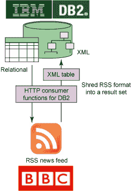

# 通过 Db2 访问 HTTP 和 RESTful 服务：针对 Db2 的 REST 用户定义函数的简介

> 原文：[`developer.ibm.com/zh/tutorials/dm-1105httprestdb2/`](https://developer.ibm.com/zh/tutorials/dm-1105httprestdb2/)

## 概述

本文介绍了一组针对 Db2 的用户定义的函数 (UDF)，它允许应用程序通过 SQL 使用基于 REST 的服务。本文将涵盖以下主题：

*   简介
*   基本的标量 REST UDF

    *   发送定制的 HTTP 头值
    *   通过获取 BBC newsfeed 将 XML 函数与 REST UDF 结合起来
    *   将 REST UDF 结果与关系表联接起来
    *   安全性 — 身份验证和加密
*   Helper 函数

    *   URL 编码/解码
    *   Base64 编码/解码

## 简介

##### 哪些 Db2？

本文中的信息不仅适用于 Db2 for Linux<reg>, UNIX <reg>and Windows <reg>，也适用于 Db2 for z/OS<reg>。</reg></reg></reg></reg>

HTTP 是在 20 多年前定义的，而最后一次重大变革 (HTTP 1.1) 发生在 1999 年（参见 RFC2616 ）。HTTP 经历如此长的时间表明它处于一个稳定的状态。HTTP 是 Web 上最流行的协议。随着时间的推移，已经在 HTTP 之上构建了 REST 或 WebDAV 等其他协议和使用模式。许多网站和应用程序均提供了基于 HTTP 的信息访问接口。

##### Web 上使用的其他格式：JSON

目前在 Web 上使用了很多其他基于文本的格式。[JSON](http://www.json.org) 近年来变得非常流行。此文章 “[构建 pureXML 和 JSON 应用程序，第 1 部分：使用 Db2 pureXML 储存和查询 JSON](http://www.ibm.com/developerworks/cn/xml/x-db2JSONpt1/)” 展示了可以在 Db2 中使用 JSONx 处理 JSON 以将 JSON 转化为 XML 或将 XML 转化为 JSON 的一种方式。

几个（主要是基于 XML）消息格式随着时间的推移经过演化，均可用于以 HTTP 中作为传输层来交换数据，例如 SOAP、RSS 或 Atom。

关系数据库管理系统 (RDBMS) 也经过演化，引入了除关系数据和 SQL 以外的处理和存储功能，以在本地支持 XML。

图 1\. 通过 REST 函数从 Db2 访问 Web


在本文中，我们以用户定义函数 (UDF) 的形式介绍了 SQL 扩展，该函数经由 HTTP 直接通过 SQL 语句访问 URL 可寻址资源。UDF 被称为 *REST UDF* 或 *REST 函数。* 使用该新函数，SQL 聚合或 XPath 访问等 RDBM 中可用的其他功能均可用于操作和存储从 Web 上获取的数据。使用 REST 函数，可以发布简单的 HTTP `GET` 或 `POST` 请求。

此外，还有 REST 函数中更复杂（ *详细* ）的签名，它可支持检查 HTTP 响应代码和头值，这对于调试非常有用。本文没有进一步详细讨论 REST 函数，不过您可以看一下 sample_tableUDF_Queries.txt 中的样例，了解如何使用该函数。

REST 函数可以将通过 HTTP 提交的信息看作是二进制或文本数据。二进制版本访问图像、声音和其他二进制格式的信息，而文本版本则通过自动在数据与使用过的数据库代码页之间进行转换数据来处理 HTML 页面和其他基于文本的信息。Internet 上的文本数据通常采用 Unicode，而关系数据库中的数据则通常采用其他编码形式。

通过遵循本文的步骤并下载随附文件，您可以从 Web 上获取数据，并将其与本地存储的关系数据联接起来。此外，您还可以应用 Db2 的本地 XML 存储功能来处理、存储和转换基于 XML 的数据（例如，通过使用 XMLTABLE 函数从 XML 文档中生成一个关系数据集）。

本文首先介绍 REST UDF。接着提供在 Web 上操作文本和二进制信息的示例。此外，还描述了如何通过设置 HTTP 头信息来定制 REST 请求。一个基于访问 RSS 提要的示例说明了 Web 与数据库数据的集成。另外还涉及到了 HTTP 身份验证和加密。文章最后展示了使用 helper 函数执行 URL 编码和 Base64 编码的示例。本文包含一个附录，该附录带有整套的 REST 函数参数。

本文还提供[示例代码](http://public.dhe.ibm.com/software/dw/data/dm-1105httprestdb2/download.zip)，其中包含了 REST UDFs for Db2 for LUW 和 Db2 for z/OS 以及各种示例。该下载包提供了一组基本标量以及一些 helper 函数。

## 基本的 REST 标量函数

基本的标量函数提供对 Web 上内容的访问。REST 函数有 4 种最常见的 HTTP 谓词：GET、POST、PUT 和 DELETE。有两个方法可用：一个用于处理二进制内容，另一个用于处理基于文本的内容。该函数的 Db2 模式是 Db2XML。

所有的基本 REST 函数都是标量函数，它以 *BLOB* （二进制）或 *CLOB* （文本）格式返回 HTTP 响应消息的内容。函数签名遵循以下模式：

```
DB2XML.HTTP<method><type>(url, httpHeader <,
input>) 
```

表 1\. 方法名

| 方法 | `GET、POST、PUT 和 DELETE` |
| --- | --- |
| 类型 | BLOB（二进制内容）或 CLOB（文本内容）定义返回类型和 `<input>` 文档的类型 |

表 2\. 输入参数

| `url` | （必填）正访问资源的 URL |
| --- | --- |
| `httpHeader` | （可选）与请求一起使用的其他头值 |
| `input` | （仅限 `POST 和 PUT` ）随请求作为 BLOB 或 CLOB 发送的数据 |

还有一个方法可用于执行 HTTP `HEAD` 请求。它不用发送或获取数据。而是通过 HTTP `GET` 获取 IBM 网站：

```
SELECT
   DB2XML.HTTPGETCLOB('http://www.ibm.com','')
FROM SYSIBM.SYSDUMMY1 
```

结果是以 CLOB 文本数据作为 IBM 网页 HTML 文本。

### 发送定制的 HTTP 头值

在上文，我们已为 HTTP 头值提供了一个空字符串，即发出请求消息时所使用的默认值。可能还需要通过一个请求提供定制的头信息（以在调用 SOAP Web 服务时更改内容类型或另外设置一个 `"SOAPAction"` 头字段）。

使用每一种方法，可以指定一个可选的 HTTP 头 XML 文档来允许设置其他 HTTP 头值。XML 头文档必须符合下列格式：

清单 1\. XML HTTP 头格式

```
<httpHeader connectionTimeout="10" follwRedirects="true">
    <header name="Accept" value="text/plain,application/xml,*/*;q=0.8" />
    <header name="Accept-Language" value="en-us,en;q=0.5" />
</httpHeader> 
```

每个定制的头字段都由一个 `<header>` 元素表示，该元素包含一个 *name* 和 *value* 属性。 `<httpHeader>` root 元素允许通过属性指定一些其他请求选项。

表 3\. 可以使用 `<httpHeader>` 指定的选项

| 属性名 | 类型 | 默认值 | 说明 |
| --- | --- | --- | --- |
| `connectionTimeout` | 整数 | 系统默认值 | 超时（以毫秒为单位） |
| `readTimeout` | 整数 | 系统默认值 | 超时（以毫秒为单位） |
| `followRedirects` | 布尔值 | 真 | 定义是否应当进行重定向 |
| `useCaches` | 布尔值 | 真 | 定义是否应当使用缓存 |

可以将 XML 头文档提供为 CLOB 或本地 XML（仅限 Db2 LUW）值。

清单 2\. 通过 HTTP `POST` 调用 SOAP 1.1 Web 服务

```
SELECT DB2XML.HTTPPOSTCLOB('http://www.webservicex.net//stockquote.asmx',
CAST ('<httpHeader>
       <header name="Content-Type" value="text/xml;charset=utf-8"/>
       <header name="SOAPAction" value=""http://www.webserviceX.NET/GetQuote""/>
       </httpHeader>' AS CLOB(1K)),
 CAST('<soap:Envelope xmlns:soap="http://schemas.xmlsoap.org/soap/envelope/">
          <soap:Body>
             <GetQuote xmlns="http://www.webserviceX.NET/">
                <symbol>IBM</symbol>
             </GetQuote>
          </soap:Body>
       </soap:Envelope>' AS CLOB(10K))
) FROM SYSIBM.SYSDUMMY1; 
```

结果是以 CLOB 文本数据作为 Web 服务 SOAP 响应消息。

### 通过获取 BBC 新闻提要将 XML 函数与 REST UDF 结合起来

本例展示如何使用 Db2 的 `XMLTABLE` 函数轻松获取 BBC 新闻提要并将其转换为关系数据集。

图 2\. 通过 REST UDF 和 Db2 pureXML 使用新闻提要



首先，我们使用以下语句看一下 BBC RSS 提要：

```
SELECT DB2XML.HTTPGETCLOB('http://feeds.bbci.co.uk/news/world/rss.xml?edition=uk','')
       FROM SYSIBM.SYSDUMMY1; 
```

现在我们可以包装一个 `XMLTABLE` 函数调用来将返回的 XML RSS 格式转换成一个关系结果集。

清单 3\. 将 BBC 新闻提要分解成一个关系数据集

```
SELECT *
   FROM XMLTABLE('$result/rss/channel/item'
      PASSING XMLPARSE(
         DOCUMENT
           DB2XML.HTTPGETBLOB('http://feeds.bbci.co.uk/news/world/rss.xml?edition=uk','')
      ) as "result"
         COLUMNS
            title VARCHAR(128) PATH 'title',
            description VARCHAR(1024) PATH 'description',
            link VARCHAR(255) PATH 'link',
            pubDate VARCHAR(20) PATH 'substring(pubDate, 1, 16)'
   ) AS RESULT; 
```

结果集包含 4 列：含有提要项目标题的 **TITLE** 列，含有提要说明的 **DESCRIPTION** 列，含有实际新闻文档 URL 的 **LINK** 列，还有一个 **PUBDATE** 列。

在本文的下载包中可以找到更多示例。

### 将 REST UDF 结果与关系表联接起来

在上一节中，我们使用了 `XMLTABLE` 函数来分解 REST UDF 所返回的 XML 数据。在本节中，我们将进一步推进该示例。将分解的结果集与现有的新闻表（含有与新闻标题相匹配的 4 个列）联接起来。

图 3\. 将 REST UDF 结果与关系表联接起来


清单 4\. 将 REST UDF 结果与关系表联接起来

```
SELECT DB2XML.NEWS.*
   FROM XMLTABLE('$result/rss/channel/item'
      PASSING XMLPARSE(
         DOCUMENT
           DB2XML.HTTPGETBLOB('http://feeds.bbci.co.uk/news/world/rss.xml?edition=uk','')
      ) as "result"
         COLUMNS
            title VARCHAR(128) PATH 'title'
   ) AS RESULT, DB2XML.NEWS
   WHERE RESULT.TITLE = DB2XML.NEWS.TITLE; 
```

### 安全性 — 身份验证和加密

##### 使用具有 REST UDF 的证书

REST UDF 利用 [Java Secure Socket Extension (JSSE)](http://en.wikipedia.org/wiki/Java_Secure_Socket_Extension) 进行安全套接字层 (SSL) 通信。SSL 通信在客户端需要一个证书存储以便存储服务器证书。对该存储的管理可能依赖于 JSSE 实现。[IBM JDK](https://www.ibm.com/developerworks/java/jdk/) 有其自己的实现，其中有对 z/OS 的特殊扩展（参见 [IBM JSSE implementation on z/OS](http://www.ibm.com/systems/z/os/zos/tools/java/products/jsse14.html)）。

REST 函数支持 HTTP 基本身份验证以及使用 HTTPS 的 SSL 加密。

以下示例展示了如何获取 Google Mail 帐户上的未读邮件并使用 `XMLTABLE` 将其解析为一个关系结果集。

图 4\. 使用 REST UDF 从 Db2 访问 Gmail


对 Gmail 的访问由 SSL 加密，并由 HTTP 基本身份验证确保安全（在 URL 中使用 $quot;https”）。Gmail 将未读邮件的标题作为 Atom 提要返回，我们使用本例中的 `XMLTABLE` 函数将结果作为一个关系数据集返回。

清单 5\. 使用 SSL 和 HTTP 身份验证获取 Gmail 上的未读邮件

```
SELECT *
  FROM XMLTABLE('$result/*[local-name()=''feed'']/*[local-name()=''entry'']'
    PASSING
       XMLPARSE(DOCUMENT
 DB2XML.HTTPGETBLOB('https://<username>:<password>@mail.google.com/mail/feed/atom/',''))
AS "result"
  COLUMNS
    title VARCHAR(128) PATH '*[local-name()=''title'']',
    summary VARCHAR(1024) PATH '*[local-name()=''summary'']',
    author_name VARCHAR(255) PATH '*[local-name()=''author'']/*[local-name()=''name'']',
    author_email VARCHAR(255) PATH '*[local-name()=''author'']/*[local-name()=''email'']'
) AS RESULT; 
```

结果集包含 4 列：TITLE、SUMMARY、AUTHOR_NAME 和 AUTHOR_EMAIL。

## Helper 函数

除了 REST 函数，您可以找到用于执行 URL 编码/解码以及 Base64 编码和解码的 helper 函数。

### URL 编码/解码

URL 规范 (RFC1738) 定义一组需要替换为转义序列的特殊字符（例如，如果在 URL 的查询字符串中使用）。下载包带有两个函数，用于执行 URL 编码和解码。 `urlEncode` 函数的第一个参数是纯字符串； `urlDecode` 函数的第一个参数是 URL 编码的字符串。两个函数的第二个可选参数是要使用的字符集编码。如果提供 NULL，则如同 RFC3986 中推荐的那样使用 UTF-8。

清单 6\. URL 编码示例

```
SELECT DB2XML.URLENCODE(
     'Please send and email to report our % earnings to Mark & Lisa at marklisa@xyz.com'
     , NULL)
       FROM SYSIBM.SYSDUMMY1

Result:
--------------------------------------------------------------------
Please+send+and+email+to+report+our+%25+earnings+to+Mark+%26+Lisa+at+marklisa%40xyz.com 
```

清单 7\. URL 编码示例

```
SELECT DB2XML.URLDECODE(
'Please+send+and+email+to+report+our+%25+earnings+to+Mark+%26+Lisa+at+marklisa%40xyz.com'
, NULL)
FROM SYSIBM.SYSDUMMY1

Result:
----------------------------------------------------------------------
Please send and email to report our % earnings to Mark & Lisa at marklisa@xyz.com 
```

### Base64 编码/解码

Base64 编码广泛地用在 Web 上以将二进制数据表示为字符串（例如，在发送哈希键时）。下载包带有两个函数，用于执行 Base64 编码和解码。

清单 8\. Base64 编码示例

```
SELECT DB2XML.BASE64ENCODE(
 CAST(
 'Please send and email to report our % earnings to Mark & Lisa at marklisa@xyz.com'
 AS VARCHAR(100) FOR BIT DATA))
 FROM SYSIBM.SYSDUMMY1

Result:
-----------------------------------------------------------------------
UGxlYXNlIHNlbmQgYW5kIGVtYWlsIHRvIHJlcG9ydCBvdXIgJSBlYXJuaW5ncyB0byBNYXJrICYgTGlzYSBhdCBtY
XJrbGlzYUB4eXouY29t 
```

清单 9\. Base64 编码的示例

```
SELECT
CAST(
   DB2XML.BASE64DECODE(
'UGxlYXNlIHNlbmQgYW5kIGVtYWlsIHRvIHJlcG9ydCBvdXIgJSBlYXJuaW5ncyB0byBNYXJrICYgTGlzYSBhdCBtY
XJrbGlzYUB4eXouY29t') AS VARCHAR(100) FOR MIXED DATA)
FROM SYSIBM.SYSDUMMY1

Result:
-----------------------------------------------------------------------
Please send and email to report our % earnings to Mark & Lisa at marklisa@xyz.com 
```

## HTTP 代理支持

因为 REST 用户定义的函数是用 Java 实现的，所以需要设置一组 Java 系统属性来启用 HTTP 代理支持。可以使用以下属性：

*   `http.proxyHost`
*   `http.proxyPort`
*   `http.proxyUser`
*   `http.proxyPassword`
*   `http.nonProxyHosts`

Db2 for Linux, UNIX, Windows 不提供对 Java 系统属性的访问。相反，REST UDF 会检查 $DB2INSTPATH/ 函数目录下的 restudf.properties 文件，其中用户可以像这样指定 HTTP 代理设置：

清单 10\. restudf.properties 文件中的 HTTP 代理设置

```
http.proxyHost=myProxyHost.com
http.proxyPort=8090
http.proxyUser=user
http.proxyPassword=secret
http.nonProxyHosts=*.ibm.com|wikipedia.org|... 
```

在 Db2 for z/OS 上您可以像这样指定 JVMPROPS 文件中的这些属性（另参见下载包中的 installationNotesUDFzOS.txt）：

清单 11\. JVMPROPS 文件中的 HTTP 代理设置

```
-Dhttp.proxyHost=myProxyHost.com
-Dhttp.proxyPort=8090
-Dhttp.proxyUser=user
-Dhttp.proxyPassword=secret
-Dhttp.nonProxyHosts=*.ibm.com|wikipedia.org|... 
```

## 结束语

Db2 REST 函数提供一种简单的方法来通过 SQL 语句访问 Web 上的资源。这些函数尽管很简单，但具有足够的灵活性，可访问和使用多个来源的数据。因为在 Web 上广泛使用 XML 作为消息格式，因此所提的 REST 函数与 Db2 pureXML 功能可无缝整合。本文解释 REST 函数的基本用法，以及如何集成 Web 数据与数据库数据。另外还解释了身份验证和加密的用法，以及描述了辅助 URL 编码和 Base64 编码的 helper 函数。

## 致谢

作者感谢 Ling Ling 审阅本文并测试其说明。

## 附录

表 4\. REST UDF 签名

| 名称 | 返回类型 | 签名 | HTTP 谓词 | 说明 |
| --- | --- | --- | --- | --- |
| httpGetBlob | BLOB | httpGetBlob(url VARCHAR(2048), httpHeader CLOB (10K)) RETURNS BLOB(5M) | `GET` | 通过 HTTP GET 根据给定 URL 获取资源。资源作为二进制 LOB (BLOB) 返回。 |
| httpGetClob | CLOB | httpGetClob(url VARCHAR(2048), httpHeader CLOB (10K)) RETURNS CLOB(5M) | `GET` | 通过 HTTP GET 根据给定 URL 获取基于文本的资源。资源作为字符 LOB (CLOB) 返回。如有必要，执行字符集到数据库代码页的转换。 |
| httpPutBlob | BLOB | httpPutBlob(url VARCHAR(2048), httpHeader CLOB (10K), data BLOB(5M)) RETURNS BLOB | `PUT` | 使用 HTTP `PUT` 创建（上传）给定 URL 下的二进制资源。如果由服务器发出，则响应消息作为二进制 LOB (BLOB) 返回。 |
| httpPutClob | CLOB | httpPutClob(url VARCHAR(2048), httpHeader CLOB (10K), data CLOB(5M)) RETURNS CLOB | `PUT` | 使用 HTTP PUT 创建（上传）给定 URL 下的文本资源。如果由服务器发出，则响应消息作为字符 LOB (CLOB) 返回。如有必要，执行字符集转换。 |
| httpPostBlob | BLOB | httpPostBlob(url VARCHAR(2048), httpHeader CLOB (10K), data BLOB(5M)) RETURNS BLOB(5M) | `POST` | 使用 HTTP POST 更新给定 URL 下的二进制资源。响应消息作为二进制 LOB (BLOB) 返回。 |
| httpPostClob | CLOB | httpPostClob(url VARCHAR(2048), httpHeader CLOB (10K), data CLOB(5M)) RETURNS CLOB(5M) | `POST` | 使用 HTTP POST 更新给定 URL 下的文本资源。响应消息作为字符 LOB (CLOB) 返回。如有必要，执行字符集转换。 |
| httpDeleteBlob | BLOB | httpDeleteBlob(url VARCHAR(2048), httpHeader CLOB (10K)) RETURNS BLOB | `DELETE` | 使用 HTTP DELETE 删除给定 URL 下的二进制资源。如果有的话，响应消息作为二进制 LOB (BLOB) 返回。 |
| httpDeleteClob | CLOB | httpDelete(url VARCHAR(2048), httpHeader CLOB (10K)) RETURNS CLOB | `DELETE` | 使用 HTTP DELETE 删除给定 URL 下的文本资源。如果有的话，响应消息作为字符 LOB (BLOB) 返回。如有必要，执行字符集转换。 |
| httpBlob | BLOB | httpBlob(url VARCHAR(2048), httpMethod VARCHAR(128), httpHeader CLOB (10K), data BLOB(5M)) RETURNS BLOB | any HTTP verb | 使用提供的谓词执行 HTTP 请求。可将请求消息作为二进制 LOB (BLOB) 提供。如果由服务器发出，则响应消息作为二进制 LOB (CLOB) 返回。 |
| httpClob | CLOB | httpClob(url VARCHAR(2048), httpMethod VARCHAR(128), httpHeader CLOB (10K), data CLOB(5M)) RETURNS CLOB | any HTTP verb | 使用提供的谓词执行 HTTP 请求。可将请求消息作为字符 LOB (BLOB) 提供。如果由服务器发出，则响应消息作为字符 LOB (CLOB) 返回。如有必要，执行字符集转换。 |
| httpHead | CLOB/XML | httpHead(url VARCHAR(2048), httpHeader CLOB (10K)) RETURNS CLOB (10K) | `HEAD` | 使用 HTTP HEAD 验证所请求资源的 HTTP 头。只有 HTTP 头作为 CLOB/XML 返回。 |

仅限 Db2 for LUW：httpHeader XML 文档也可作为原生 XML 值（而非使用 CLOB）予以提供。

表 5\. helper 函数的签名

| 名称 | 返回类型 | 签名 | 说明 |
| --- | --- | --- | --- |
| urlEncode | VARCHAR | urlEncode(text VARCHAR(2048), encoding VARCHAR(20)) RETURNS VARCHAR(4096) | 用于执行所提供 *文本* 的 URL 编码的 helper 函数。 *编码* 值定义要使用的字符集。可以将它设置为 NULL，其中以 UTF-8 作为默认值。 |
| urlDecode | VARCHAR | urlDecode(text VARCHAR(2048), encoding VARCHAR(20)) RETURNS VARCHAR(4096) | 用于执行所提供 *文本* 的 URL 解码的 helper 函数。 *编码* 值定义要使用的字符集。可以将它设置为 NULL，其中以 UTF-8 作为默认值。 |
| base64Encode | VARCHAR | base64Encode(text VARCHAR(2732) FOR BIT DATA) RETURNS VARCHAR(4096) | 用于执行所提供二进制数据（作为 Base64 编码字符串返回）的 Base64 编码的 helper 函数。 |
| base64Decode | VARCHAR FOR BIT DATA | base64Decode(text VARCHAR(4096)) RETURNS VARCHAR(2732) FOR BIT DATA | 用于在所提供 Base64 编码数据（将数据作为二进制返回）上执行 Base64 解码的 helper 函数。 |

本文翻译自：[Accessing HTTP and RESTful services from Db2: Introducing the REST user-defined functions for Db2](https://developer.ibm.com/tutorials/dm-1105httprestdb2/)（2011-05-26）