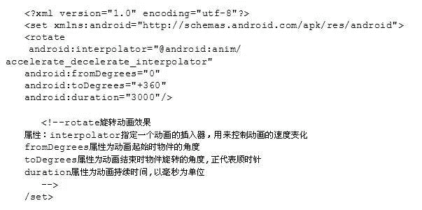
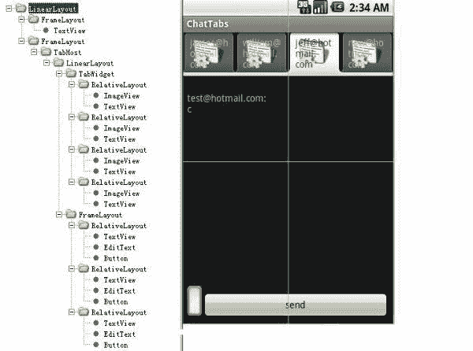
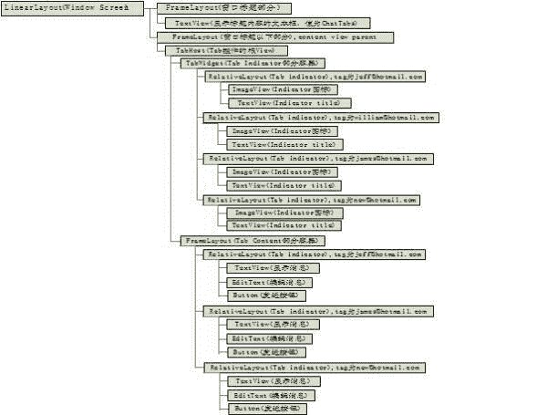
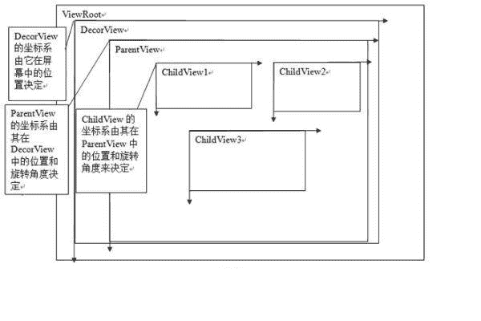
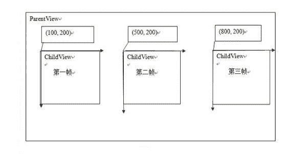
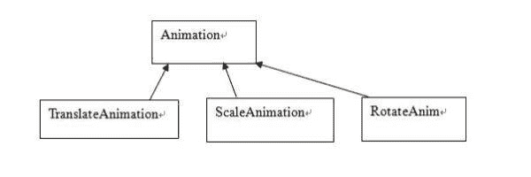

# Android 动画框架详解

> 原文：[`developer.ibm.com/zh/tutorials/os-cn-android-anmt1/`](https://developer.ibm.com/zh/tutorials/os-cn-android-anmt1/)

Android 平台提供了一套完整的动画框架，使得开发者可以用它来开发各种动画效果，本文将向读者阐述 Android 的动画框架是如何实现的。 任何一个框架都有其优势和局限性，只有明白了其实现原理，开发者才能知道哪些功能可以利用框架来实现，哪些功能须用其他途径实现。Android 平台提供了两类动画，一类是 Tween 动画，即通过对场景里的对象不断做图像变换 ( 平移、缩放、旋转 ) 产生动画效果；第二类是 Frame 动画，即顺序播放事先做好的图像，跟电影类似。本文是由两部分组成的有关 Android 动画框架详解的第一部分原理篇，主要分析 Tween 动画的实现原理，最后简单介绍在 Android 中如何通过播放 Gif 文件来实现动画。我们先看一下动画示例来一点感性认识。

## Android 动画使用示例

使用动画示例程序的效果是点击按钮，TextView 旋转一周。读者也可以参看 Apidemos 中包 com.example.android.apis.animationview 下面的 Transition3d 和 com.example.android.apis.view 下面的 Animation1/Animation2/Animation3 示例代码。

##### 清单 1\. 代码直接使用动画

```
package com.ray.animation;
import android.app.Activity;
import android.os.Bundle;
import android.view.View;
import android.view.View.OnClickListener;
import android.view.animation.AccelerateDecelerateInterpolator;
import android.view.animation.Animation;
import android.view.animation.RotateAnimation;
import android.widget.Button;
public class TestAnimation extends Activity implements OnClickListener{
    public void onCreate(Bundle savedInstanceState){
    super.onCreate(savedInstanceState);
    setContentView(R.layout.main);
    Button btn =(Button)findViewById(R.id.Button);
    btn.setOnClickListener(this);
}
   public void onClick(View v){
   Animation anim=null;
   anim=new?RotateAnimation(0.0f,+360.0f);
   anim.setInterpolator(new AccelerateDecelerateInterpolator());
   anim.setDuration(3000);
   findViewById(R.id.TextView01).startAnimation(anim);
}
} 
```

使用 XML 文件方式，在打开 Eclipse 中新建的 Android 工程的 res 目录中新建 anim 文件夹，然后在 anim 目录中新建一个 myanim.xml( 注意文件名小写 )，内容如下 :

##### 图 1\. 使用 xml 文件方式



其中的 java 代码如下：

```
 package com.ray.animation;
 import android.app.Activity;
 import android.os.Bundle;
 import android.view.View;
 import android.view.View.OnClickListener;
 import android.view.animation.Animation;
 import android.view.animation.AnimationUtils;
 import android.widget.Button;
 import android.widget.TextView;
 public class TestAnimation extends Activity implements OnClickListener{
 public void onCreate(Bundle savedInstanceState){
 super.onCreate(savedInstanceState);
 setContentView(R.layout.main);
 Button btn =(Button)findViewById(R.id.Button01);
 btn.setOnClickListener(this);
 }

 @Override
 public void onClick(View v){
 Animation anim=AnimationUtils.loadAnimation(this,R.anim.my_rotate_action);
 findViewById(R.id.TextView01).startAnimation(anim);
 }
 } 
```

## Android 动画框架原理

现有的 Android 动画框架是建立在 View 的级别上的，在 View 类中有一个接口 startAnimation 来使动画开始，startAnimation 函数会将一个 Animation 类别的参数传给 View，这个 Animation 是用来指定我们使用的是哪种动画，现有的动画有平移，缩放，旋转以及 alpha 变换等。如果需要更复杂的效果，我们还可以将这些动画组合起来，这些在下面会讨论到。

要了解 Android 动画是如何画出来的，我们首先要了解 Android 的 View 是如何组织在一起，以及他们是如何画自己的内容的。每一个窗口就是一棵 View 树，下面以我们写的 android_tabwidget_tutorial.doc 中的 tab 控件的窗口为例，通过 android 工具 hierarchyviewer 得到的窗口 View Tree 如下图 1 所示：

##### 图 2\. 界面 View 结构图



##### 图 3\. 界面 View 结构和显示对应图



其实这个图不是完整的，没有把 RootView 和 DecorView 画出来，RootView 只有一个孩子就是 DecorView，这里整个 View Tree 都是 DecorView 的子 View，它们是从 android1.5/frameworks/base/core/res/res/layout/screen_title.xml 这个 layout 文件 infalte 出来的，感兴趣的读者可以参看 frameworks\policies\base\phone\com\android\internal\policy\Imp\PhoneWindow.java 中 generateLayout 函数部分的代码。我们可以修改布局文件和代码来做一些比较 cool 的事情，如象 Windows 的缩小 / 关闭按钮等。标题窗口以下部分的 FrameLayou 就是为了让程序员通过 setContentView 来设置用户需要的窗口内容。因为整个 View 的布局就是一棵树，所以绘制的时候也是按照树形结构遍历来让每个 View 进行绘制。ViewRoot.java 中的 draw 函数准备好 Canvas 后会调用 mView.draw(canvas)，其中 mView 就是调用 ViewRoot.setView 时设置的 DecorView。然后看一下 View.java 中的 draw 函数：

递归的绘制整个窗口需要按顺序执行以下几个步骤：

1.  绘制背景；
2.  如果需要，保存画布（canvas）的层为淡入或淡出做准备；
3.  绘制 View 本身的内容，通过调用 View.onDraw(canvas) 函数实现，通过这个我们应该能看出来 onDraw 函数重载的重要性，onDraw 函数中绘制线条/圆/文字等功能会调用 Canvas 中对应的功能。下面我们会 drawLine 函数为例进行说明；
4.  绘制自己的孩子（通常也是一个 view 系统），通过 dispatchDraw(canvas) 实现，参看 ViewGroup.Java 中的代码可知，dispatchDraw->drawChild->child.draw(canvas) 这样的调用过程被用来保证每个子 View 的 draw 函数都被调用，通过这种递归调用从而让整个 View 树中的所有 View 的内容都得到绘制。在调用每个子 View 的 draw 函数之前，需要绘制的 View 的绘制位置是在 Canvas 通过 translate 函数调用来进行切换的，窗口中的所有 View 是共用一个 Canvas 对象
5.  如果需要，绘制淡入淡出相关的内容并恢复保存的画布所在的层（layer）
6.  绘制修饰的内容（例如滚动条），这个可知要实现滚动条效果并不需要 ScrollView，可以在 View 中完成的，不过有一些小技巧，具体实现可以参看我们的 TextViewExample 示例代码

当一个 ChildView 要重画时，它会调用其成员函数 invalidate() 函数将通知其 ParentView 这个 ChildView 要重画，这个过程一直向上遍历到 ViewRoot，当 ViewRoot 收到这个通知后就会调用上面提到的 ViewRoot 中的 draw 函数从而完成绘制。View::onDraw() 有一个画布参数 Canvas, 画布顾名思义就是画东西的地方，Android 会为每一个 View 设置好画布，View 就可以调用 Canvas 的方法，比如：drawText, drawBitmap, drawPath 等等去画内容。每一个 ChildView 的画布是由其 ParentView 设置的，ParentView 根据 ChildView 在其内部的布局来调整 Canvas，其中画布的属性之一就是定义和 ChildView 相关的坐标系，默认是横轴为 X 轴，从左至右，值逐渐增大，竖轴为 Y 轴，从上至下，值逐渐增大 , 见下图 :

##### 图 4\. 窗口坐标系



Android 动画就是通过 ParentView 来不断调整 ChildView 的画布坐标系来实现的，下面以平移动画来做示例，见下图 4，假设在动画开始时 ChildView 在 ParentView 中的初始位置在 (100,200) 处，这时 ParentView 会根据这个坐标来设置 ChildView 的画布，在 ParentView 的 dispatchDraw 中它发现 ChildView 有一个平移动画，而且当前的平移位置是 (100, 200)，于是它通过调用画布的函数 traslate(100, 200) 来告诉 ChildView 在这个位置开始画，这就是动画的第一帧。如果 ParentView 发现 ChildView 有动画，就会不断的调用 invalidate() 这个函数，这样就会导致自己会不断的重画，就会不断的调用 dispatchDraw 这个函数，这样就产生了动画的后续帧，当再次进入 dispatchDraw 时，ParentView 根据平移动画产生出第二帧的平移位置 (500, 200)，然后继续执行上述操作，然后产生第三帧，第四帧，直到动画播完。具体算法描述如清单 2：

#### 清单 2\. 算法

```
dispatchDraw()
{
....
Animation a = ChildView.getAnimation()
Transformation tm = a.getTransformation();
Use tm to set ChildView's Canvas;
Invalidate();
....
} 
```

##### 图 5\. 平移动画示意图



以上是以平移动画为例子来说明动画的产生过程，这其中又涉及到两个重要的类型，Animation 和 Transformation，这两个类是实现动画的主要的类，Animation 中主要定义了动画的一些属性比如开始时间、持续时间、是否重复播放等，这个类主要有两个重要的函数：getTransformation 和 applyTransformation，在 getTransformation 中 Animation 会根据动画的属性来产生一系列的差值点，然后将这些差值点传给 applyTransformation，这个函数将根据这些点来生成不同的 Transformation，Transformation 中包含一个矩阵和 alpha 值，矩阵是用来做平移、旋转和缩放动画的，而 alpha 值是用来做 alpha 动画的（简单理解的话，alpha 动画相当于不断变换透明度或颜色来实现动画），以上面的平移矩阵为例子，当调用 dispatchDraw 时会调用 getTransformation 来得到当前的 Transformation，这个 Transformation 中的矩阵如下：

##### 图 6\. 矩阵变换图


所以具体的动画只需要重载 applyTransformation 这个函数即可，类层次图如下：

##### 图 7\. 动画类继承关系图



用户可以定义自己的动画类，只需要继承 Animation 类，然后重载 applyTransformation 这个函数。对动画来说其行为主要靠差值点来决定的，比如，我们想开始动画是逐渐加快的或者逐渐变慢的，或者先快后慢的，或者是匀速的，这些功能的实现主要是靠差值函数来实现的，Android 提供了 一个 Interpolator 的基类，你要实现什么样的速度可以重载其函数 getInterpolation，在 Animation 的 getTransformation 中生成差值点时，会用到这个函数。

从上面的动画机制的分析可知某一个 View 的动画的绘制并不是由他自己完成的而是由它的父 view 完成，所有我们要注意上面 TextView 旋转一周的动画示例程序中动画的效果并不是由 TextView 来绘制的，而是由它的父 View 来做的。findViewById(R.id.TextView01).startAnimation(anim) 这个代码其实是给这个 TextView 设置了一个 animation，而不是进行实际的动画绘制，代码如下 :

public void startAnimation(Animation animation) { animation.setStartTime(Animation.START_ON_FIRST_FRAME); setAnimation(animation); invalidate(); }

其他的动画机制的代码感兴趣的读者请自己阅读，希望通过原理的讲解以后看起来会轻松点，呵呵。

以上就是 Android 的动画框架的原理，了解了原理对我们的开发来说就可以清晰的把握动画的每一帧是怎样生成的，这样便于开发和调试。它把动画的播放 / 绘制交给父 View 去处理而不是让子 View 本身去绘制，这种从更高的层次上去控制的方式便于把动画机制做成一个易用的框架，如果用户要在某个 view 中使用动画，只需要在 xml 描述文件或代码中指定就可以了，从而把动画的实现和 View 本身内容的绘制（象 TextView 里面的文字显示）分离开了，起到了减少耦合和提高易用性的效果。

## 动画实现示例

在这个例子中，将要实现一个绕 Y 轴旋转的动画，这样可以看到 3D 透视投影的效果，代码如下 ( 清单 4)：

#### 清单 3\. 实现一个绕 Y 轴旋转的动画

```
package com.example.android.apis.animation;
 import android.view.animation.Animation;
 import android.view.animation.Transformation;
 import android.graphics.Camera;
 import android.graphics.Matrix;
 /**
 * An animation that rotates the view on the Y axis between two specified angles.
 * This animation also adds a translation on the Z axis (depth) to improve the effect.
 */
 public class Rotate3dAnimation extends Animation {
    private final float mFromDegrees;
    private final float mToDegrees;
    private final float mCenterX;
    private final float mCenterY;
    private final float mDepthZ;
    private final boolean mReverse;
    private Camera mCamera;
    /**
     * Creates a new 3D rotation on the Y axis. The rotation is defined by its
     * start angle and its end angle. Both angles are in degrees. The rotation
     * is performed around a center point on the 2D space, definied by a pair
     * of X and Y coordinates, called centerX and centerY. When the animation
     * starts, a translation on the Z axis (depth) is performed. The length
     * of the translation can be specified, as well as whether the translation
     * should be reversed in time.
     *
     * @param fromDegrees the start angle of the 3D rotation
     * @param toDegrees the end angle of the 3D rotation
     * @param centerX the X center of the 3D rotation
     * @param centerY the Y center of the 3D rotation
     * @param reverse true if the translation should be reversed, false otherwise
     */
    public Rotate3dAnimation(float fromDegrees, float toDegrees,
            float centerX, float centerY, float depthZ, boolean reverse) {
        mFromDegrees = fromDegrees;
        mToDegrees = toDegrees;
        mCenterX = centerX;
        mCenterY = centerY;
        mDepthZ = depthZ;
        mReverse = reverse;
    }

    @Override
    public void initialize(int width, int height, int parentWidth, int parentHeight) {
        super.initialize(width, height, parentWidth, parentHeight);
        mCamera = new Camera();
    }

    @Override
    protected void applyTransformation(float interpolatedTime, Transformation t) {
        final float fromDegrees = mFromDegrees;
        float degrees = fromDegrees + ((mToDegrees - fromDegrees) * interpolatedTime);
        final float centerX = mCenterX;
        final float centerY = mCenterY;
        final Camera camera = mCamera;
        final Matrix matrix = t.getMatrix();
        camera.save();
        if (mReverse) {
            camera.translate(0.0f, 0.0f, mDepthZ * interpolatedTime);
        } else {
            camera.translate(0.0f, 0.0f, mDepthZ * (1.0f - interpolatedTime));
        }
        camera.rotateY(degrees);
        camera.getMatrix(matrix);
        camera.restore();
        matrix.preTranslate(-centerX, -centerY);
        matrix.postTranslate(centerX, centerY);
    }
 } 
```

在这个例子中我们重载了 applyTransformation 函数，interpolatedTime 就是 getTransformation 函 数传下来的差值点，在这里做了一个线性插值算法来生成中间角度：float degrees = fromDegrees + ((mToDegrees – fromDegrees) * interpolatedTime); Camera 类是用来实现绕 Y 轴旋转后透视投影的，我们只需要其返回的 Matrix 值 , 这个值会赋给 Transformation 中的矩阵成员，当 ParentView 去为 ChildView 设置画布时，就会用它来设置坐标系，这样 ChildView 画出来的效果就是一个绕 Y 轴旋转同时带有透视投影的效果。利用这个动画便可以作出像立体翻页等比较酷的效果。如何使用这个 animation 请见 ApiDemos 程序包 com.example.android.apis.animation 中的 Transition3d.java 代码。

## Android 中显示 Gif 格式图

有关这一部分，本文将不做详细介绍。 感兴趣的读者请参看 Apidemos 中 com.example.android.apis.graphics 下面的 BitmapDecode.java 中的示例代码。

这里先简单说明一下，它的实现是通过 Movie 这个类来对 Gif 文件进行读取和解码的，同时在 onDraw 函数中不断的绘制每一帧图片完成的，这个示例代码在 onDraw 中调用 invalidate 来反复让 View 失效来让系统不断调用 SampleView 的 onDraw 函数；至于选出哪一帧图片进行绘制则是传入系统当前时间给 Movie 类，然后让它根据时间顺序来选出帧图片。反复让 View 失效的方式比较耗资源，绘制效果允许的话可以采取延时让 View 失效的方式来减小 CPU 消耗。

目前使用这个方式播放一些 Gif 格式的动画时会出现花屏的现象，这是因为 Android 中使用的 libgif 库是比较老的版本，新的 tag 不支持，所以导致花屏，解决办法有制作 Gif 图片时别使用太新的 tag 或完善 android 中对应的 libgif 库。

## 结束语

本文介绍了 Android 动画框架的基本原理，可以帮助开发者深入理解 Android 的动画是如何实现的，从而能够充分利用 android 现有框架来做出够眩、够酷的动画效果。