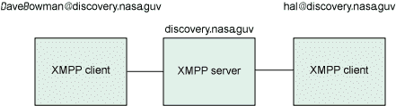
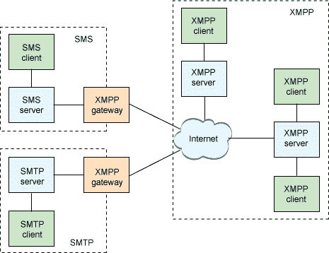
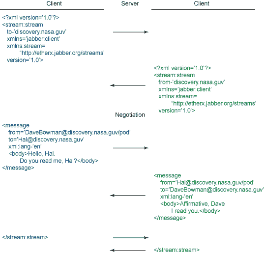
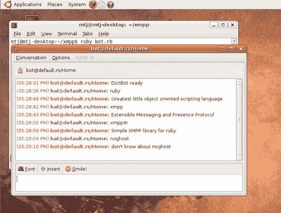

# 实现可扩展消息传递和到场协议（XMPP）

> 原文：[`developer.ibm.com/zh/tutorials/x-xmppintro/`](https://developer.ibm.com/zh/tutorials/x-xmppintro/)

即时消息传递（IM）在临时 Internet 用户和业务用户中都是一个受欢迎的应用程序。它不仅为用户提供了与他人进行实时通信的方法，还能够得到他们的到场信息（在线、离开、离线，等等）。Jabber 是最早的开放 IM 协议之一，由 Jeremie Miller 开发并于 1998 年作为一个非标准 IM 协议出现。由于 Jabber 是使用 XML 创建的可扩展协议，它很快就创建了其他可用作通用传输或面向消息的中间件（MoM）的应用程序。最终由 Jabber 产生了 XMPP，这是一个 IETF 工作组协议文档形式的基于标准的协议：RFC 3920，”可扩展消息传递和到场协议（XMPP）”。

XMPP 并不是惟一的通用消息传递协议。其他受欢迎的协议（如 XML-RPC 和 SOAP）能够为这个功能提供函数调用（如语义）。一些较新的方法，如具象状态传输（ReST），使用 URL 指定位置、对象和方法，提供受控制的文件访问。

## XMPP 架构

XMPP 与其他的应用层协议（如 SMTP）有着相似之处。在这些架构中，具有惟一名称的客户机通过相关的服务器与另外一个具有惟一名称的客户机进行通信。每个客户机执行客户机的协议表单，而服务器在表单中提供路由功能。 图 1 说明了这个简单的架构。在这个例子中，每个客户机都是同一个域名（discovery.nasa.guv）的一部分。

##### 图 1\. 由一个服务器和两个客户机组成的简单的 XMPP 架构



服务器还可以针对不同域之间（例如，在 discovery.nasa.guv 和 europa.nasa.guv 之间）的路由进行通信。此外，网关可用于在外部消息传递域和协议之间进行转换。图 2 中的示例显示了一个 XMPP 网络，网关通往一个短信服务（SMS）域和一个 SMTP 域。在这种情况下，网关大多数都是被用来在 IM 协议（例如，在 XMPP 和 Internet 中继聊天（IRC））之间进行转换。作为一个可扩展的协议，XMPP 对于在不同的端点协议间提供统一连接性来说是一个理想的中枢协议。XMPP 网关允许终止一个给定的客户端到服务器的会话，并且向目标端点协议发起一个新的会话（同时进行必要的协议转换）。

##### 图 2\. 包含了 XMPP 网关的更为复杂的 XMPP 架构



## XMPP 中的地址

XMPP 中的地址（即 *Jabber ID* [JID]）与标准电子邮件地址相似，但有着几个显著的差别。JID 包含一个可选节点、一个域和一个可选资源：

```
[ node "@" ] domain [ "/" resource ] 
```

最常见的用法就是定义一个 IM 用户（类似电子邮件地址），比如 DavidBowman@discovery.nasa.guv。用户能够多次登录 XMPP 服务器，而在这个例子中，资源能够表示位置。例如，示例用户可能有一个主终端（DavidBowman@discovery.nasa.guv/terminal）JID 和另外一个来自 EVA pod（DavidBowman@discovery.nasa.guv/eva_pod1）的 JID。因此，能够找到某个特定位置，或离开此位置并找到用户，不管用户在哪个位置登录。

## XMPP 协议

XMPP 是一个相对简单的协议，它通过 XML 消息出现在 TCP 套接字上。异步通信发生在 XML 流中，并带有 XML 节（stanza）。 *XML 流* 是封装了两个实体间的 XML 信息交换的容器。XML 流传递 *XML 节，* 这些 XML 节是一些分散的信息单元。例如，在 XMPP 中使用 XML 节传递 *消息* （IM 用户间的文本）以及到场信息。为说明这些概念，请看一个在两个客户端之间使用 XMPP 进行 IM 通信的简单示例。

图 3 演示了两个实体之间的简单会话。注意，至少有一个服务器会出现在会话中（在这个例子中，因为两个客户端存在于同一个域中，所以准确地说，只有一个服务器）。在图 3 中，左边的客户端是 *发起实体* （发起两个实体间的 XMPP 通信）。XML 流使用 `to` 属性来识别接收域（以及定义 XML 名称空间）。右边的 *接收客户端* 接收 XML 流并使用 XML 流响应（在这个例子中，使用 `from` 属性）进行回应。在这个阶段，可以进行几个不同的协商（如验证和加密）。请忽略这部分讨论（例外情况是当 IM 客户端出现在不同的域中进行服务器到服务器通信）。

##### 图 3\. 示例（简化的）XMPP 通信



图 3 中的 XML 流的下一步是进行消息传递。这个通信在消息节中进行，并且包括了源和目标 XMPP 地址（ `from` 和 `to` ）、使用的语言以及节正文中的消息。对方用其自己的消息进行响应，关键区别是源和目标 XMPP 地址。最后，发出流关闭消息（在连接的两端进行）以关闭 XML 流。

任何一边都可能返回一个错误，如下面所定义。在本例中，对方发送了一个无效的 XML 流和节。

```
<stream:error>
  <xml-not-well-formed xmlns='urn:ietf:params:xml:ns:xmpp-streams'/>
<stream:error> 
```

尽管这个示例展示了简单的 IM 通信，但很容易就能了解消息节是如何转换成 RPC 消息的，同时负载了来自对等协商的安全问题。您可以把函数注册为节点，以创建一个动态的 Web 服务框架，而不是对域中的用户进行注册。现在让我们看一下如何创建一个在 XMPP 中通信的简单应用程序。

## 使用 Ruby 的 XMPP 示例

选择 XMPP 的其他有趣方面的其中之一就是您可以在大量的库中进行选择，包括各种各样的语言。这个示例使用了 Ruby 语言和 XMPP4R 库。

通过库来演示 XMPP，探究用作技术字典的简单 IM 代理的开发。使用这种方法，您通过一个标准的即时消息程序输入一个词时，IM 代理将返回它的定义。

本示例实现了可以通过 XMPP 连接到其他 IM 代理的 IM 代理，并且一旦连接成功，将解释词语的定义。清单 1 提供了简单的 XMPP 代理。

##### 清单 1\. 用于文字定义的简单 XMPP 代理

```
require 'xmpp4r/client'

# Create a *very* simple dictionary using a hash
hash = {}
hash['ruby'] = 'Greatest little object oriented scripting language'
hash['xmpp4r'] = 'Simple XMPP library for ruby'
hash['xmpp'] = 'Extensible Messaging and Presence Protocol'

# Connect to the server and authenticate
jid = Jabber::JID::new('bot@default.rs/Home')
cl = Jabber::Client::new(jid)
cl.connect
cl.auth('password')

# Indicate our presence to the server
cl.send Jabber::Presence::new

# Send a salutation to a given user that we're ready
salutation = Jabber::Message::new( 'hal@default.rs', 'DictBot ready' )
salutation.set_type(:chat).set_id('1')
cl.send salutation

# Add a message callback to respond to peer requests
cl.add_message_callback do |inmsg|

    # Lookup the word in the dictionary
    resp = hash[inmsg.body]
    if resp == nil
      resp = "don't know about " + inmsg.body
    end

    # Send the response
    outmsg = Jabber::Message::new( inmsg.from, resp )
    outmsg.set_type(:chat).set_id('1')
    cl.send outmsg

end

# Run
while 1
end 
```

清单 1 首先创建了一个简单的字典。为此，您可以使用 Ruby 中的 `hash` 类，它允许您创建键值对（类似于数组），但是随后可以轻松地通过键引用它们。接下来，使用 XMPP4R 库连接到服务器。首先使用 `Client` 类创建一个 JID 和一个新的客户端连接。要真正连接到 IM 服务器，请使用 `connect` 方法。一旦连接上了，您可以使用密码来调用 `auth` 方法。现在，连接已经可以用来传递消息了。

下一步（可选）是表示您已经登录了 IM 服务器。为此，需要向服务器发送一个 presence 节。您还可以发送一个可选信息给对方，告诉对方您已在线了。这点可以通过创建一个消息节并使用对方地址和消息对它进行初始化来实现。消息初始化成功后，可以通过对 `Client` 类实例使用 `send` 方法来发送它。

要对发送给您的消息作出反应，请使用您的客户端连接的 `add_message_callback` 方法。任何时候消息到达时，都将调用代码块来处理消息。传入消息表示为 `inmsg` （ `Message` 实例）。首先要进行检查，看看传入消息 `body` 定义的词是否在您的字典中。如果返回 `nil` ，那么表示没有找到该词，因此您需要提供一个默认的响应。使用传入消息（ `inmsg.from` ）和响应字符串创建一个新的消息。初始化完成后，通过客户端实例把新消息发送给发送方。

图 4 显示了应用程序的一次运行。本示例使用了受欢迎的 pidgin 通用聊天客户端。pidgin 客户端支持所有主要的聊天协议，并可以与许多现有的聊天网络一起使用（甚至是同步进行）。图 4 显示了当 IM 代理连接到服务器并与定义用户开始会话时创建的消息传递弹出窗口。

##### 图 4\. 使用 IM 代理的示例 IM 会话



这个应用程序原本非常简单，但是 XMPP4R 为其他的功能（如帐户注册、发现、文件迁移、多用户聊天、发布/订阅，甚至 RPC）提供了许多类和方法。您可以在 参考资料 中找到一个 “可浏览的” 类 API，它为查看所有的 XMPP4R 文件、类和方法提供了一个方便的方法。

## XMPP 的应用

XMPP 为网络中的消息传递提供了一个通用框架。除了传统的 IM 和到场数据分布外，XMPP 还可以用于许多不同用途。

IM 的封闭式应用包括小组或多方消息传递，或开发多用户聊天室。使用多方通信，可以实现与 Twitter 提供的微博客（micro-blogging）类似的功能。但是文本并不是惟一可以通过 XMPP 传送的数据。其他的通信形式包括声音、图片和视频数据。

如今出现了服务发现协议（比如 Bonjour 或 Service Location Protocol），但 XMPP 为网络中的服务发现以及服务与功能的宣传提供了坚实的基础。

在线游戏大量地使用了 XMPP。XMPP 为在线游戏提供了一组关键的功能，包括验证、到场信息、聊天，以及可扩展的游戏状态信息的接近实时的交流。

最后，XMPP 是新的云计算时代的一个完美协议。云计算和存储系统依赖不同层次和形式的通信，不仅包括在系统间进行消息传递以中继状态，还包括较大对象（如存储或虚拟机器）的迁移。通过结合身份验证和传输中的数据保护，XMPP 可以应用在不同的层次，而且可以作为一个理想的中间件协议。

在此请注意，大多数应用与人类通信没有任何的关系，而是关系到机器通信（MMI 或机器到机器的通信）。当您发现用于 IM 的协议有着各种各样的用途时，您会觉得这是非常有趣的事情。

## 多语言的 XMPP

XMPP 是作为一组库实现的，为应用程序提供了 XMPP 能力。从 XMPP 支持众多语言这点就能轻松判断出，XMPP 是一种非常有用的协议。您将发现 XMPP 库软件支持传统语言（如 `C` 和 `C++` ）以及受欢迎的脚本语言（如 Ruby、Java™ 语言、Python、Perl 和 Tcl）。您还将发现 XMPP 库支持其他一些语言，如 Erlang、 `C#` 和 Lisp。因此，不管您在何种环境中，都有可能找到一种 XMPP 库来访问 XMPP。要获得各种 XMPP 库支持的语言列表，请查看 参考资料 。

## 结束语

##### 不断成长的 ReST

尽管 ReST 是一个架构模型而非实现方法，但它在一些领域中成长得很快。ReST 的用于远程资源管理的简单模型已经存放在了云存储中，在那里，ReST 被用作存储访问和管理模型。

许多有用的技术常常以全新的方式使用，这些方式是技术创建者当初从未考虑过的。例如，HTTP 是服务于 Internet 上的 Web 页面的事实标准协议，但它同时也用作针对 SOAP 和 XML-RPC 等其他协议（包括 ReST 之类的协议模型）的应用层传输。XMPP 是另外一个发掘出除了 IM 外的其他许多新应用的有用技术。您将如何把 XMPP 引用到您的解决方案中呢？

本文翻译自：[Meet the Extensible Messaging and Presence Protocol (XMPP)](https://developer.ibm.com/tutorials/x-xmppintro/)（2009-09-15）